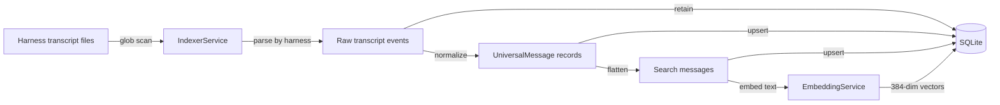
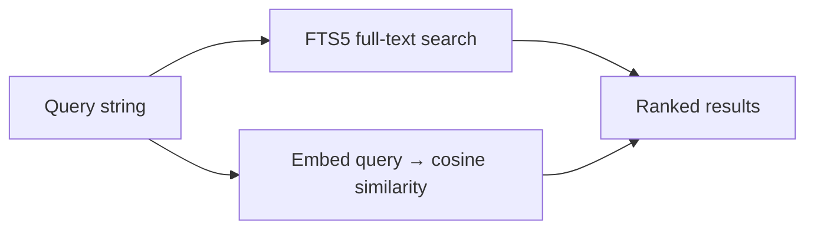

# Data Flow

## Indexing Pipeline

1. **Discovery** — IndexerService scans configured harness sources for `*.jsonl` files. Defaults include Claude Code and Codex.
2. **Raw retention** — Source records are retained as provider-specific raw transcript events.
3. **Normalization** — Supported importers convert records into `UniversalMessage` blocks for transfer, memory, and continuation workflows.
4. **Search flattening** — Universal messages are flattened into text messages for FTS and semantic search.
5. **Embedding** — Message text is embedded via `all-MiniLM-L6-v2` and stored as 384-dimensional float vectors in sqlite-vec virtual tables.
6. **Watching** — File watcher detects new/changed JSONL files and re-indexes incrementally.

Gemini, OpenCode, Aider, and Other source ids are accepted but importer behavior is stubbed until real transcripts are available for validation.

## Search Pipeline

- **FTS mode** — SQLite FTS5 with BM25 ranking
- **Semantic mode** — Query embedded, cosine similarity against stored vectors via sqlite-vec

## Client Data Flow

All clients (web, CLI) communicate with the API via HTTP `fetch` to `localhost:3100/api/*`. The shared package provides an `ensureApi()` helper that auto-launches the API server if it isn't running.

## Record Types

Claude source JSONL records: `permission-mode`, `user`, `assistant`, `attachment`, `system`, `file-history-snapshot`, `last-prompt`, `queue-operation`.

Canonical records: `RawTranscriptEvent`, `UniversalThread`, `UniversalMessage`, and `UniversalContentBlock`.

Derived entities: `Conversation`, `SearchResult`, `ThreadEdit`, `Artifact`, `Dataset`, `DatasetEntry`, `SavedPrompt`, `TagMeta`, `ProjectMeta`, `IndexStatus`, `ConversionCandidate`, `AppConfig`.

Supporting types: `SearchOptions` (mode: fts|semantic, filters), `TokenUsage` (input/output/cache tokens), `QualityLabel` (gold|silver|bronze), `ArtifactType` (agent|skill|command|snippet|runbook).
