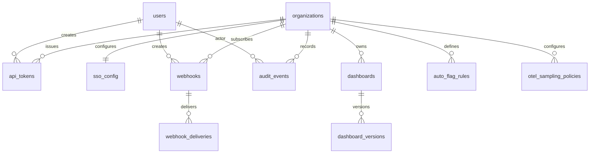
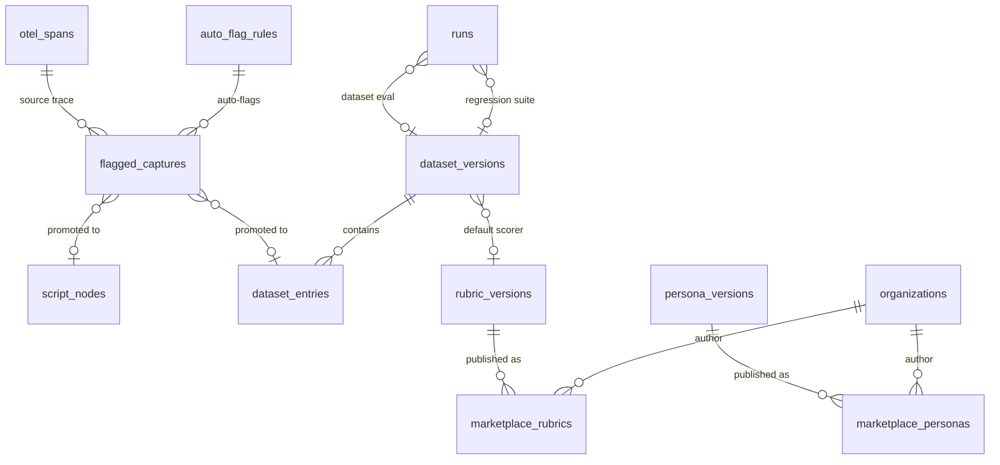
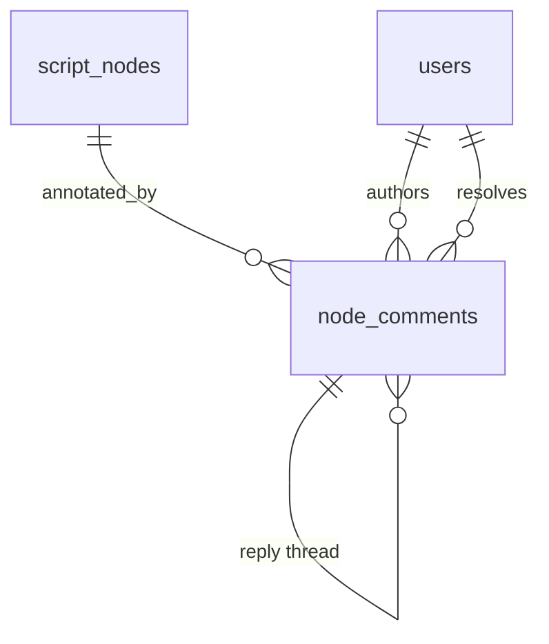

# Data Model — CodeFresh

Canonical schema reference for the CodeFresh backend. This document is **documentation-only** — no migrations have been executed. When the schema is committed, migrations are authored in the order listed in §10 and mapped directly from the tables in §4–§8.

## 1. Overview

CodeFresh stores four categories of data:

1. **Tenancy** — organizations and memberships
2. **Versioned authored entities** — prompts, scripts (with normalized graph: nodes + edges), expectations, personas, rubrics, agents; each uses a **head + version-table** pattern with copy-on-write semantics
3. **Execution records** — runs, run_steps, freeball_nodes, scores; all append-only and immutable at terminal state
4. **Observability ingest** — OpenTelemetry spans and logs from agents under test, correlated back to runs via `trace_id`

A seven-persona review (see `docs/personas/`) validates that every persona's workflow maps cleanly onto this schema. No gaps identified.

## 2. Design Principles

| Principle | Implication |
|---|---|
| Graphs are native, not serialized | `script_nodes` + `script_edges` are rows, not a JSONB blob |
| Everything authored is versioned | Head + version-table pair per entity class; runs pin exact version IDs |
| Everything executed is immutable | `run_steps`, `scores`, `freeball_*`, version tables all append-only |
| Freeball is data, not an error | `freeball_nodes` live alongside `script_nodes`, linked to the parent authored node, with a promotion workflow |
| Personas are orthogonal multipliers | `run = script_version × agent_version × [persona_versions]`, encoded via `run_personas` |
| Fuzzy expectation matching is hybrid | `expectations.scoring_method` enum; pgvector embedding column for the semantic path |
| Scoring itself is versioned | `scores` pin `rubric_version_id`, `judge_prompt_version_id`, `judge_model` — re-scoring writes new rows |
| Tenancy from day one | Every authored entity and run carries `organization_id` |
| YAML is lingua franca | Schema fields round-trip losslessly via `script_versions.yaml_source` + `checksum` |
| Runs stream | `run_steps` are append-only, ordered by `(run_id, step_index)`, queryable mid-run |
| OTel is ClickHouse-swappable | OTLP-shaped tables; run-linking columns stable; mirror to ClickHouse is a non-breaking follow-up |

## 3. Entity Relationship Diagram

```mermaid
erDiagram
    organizations ||--o{ memberships : has
    users ||--o{ memberships : joins
    organizations ||--o{ prompts : owns
    organizations ||--o{ scripts : owns
    organizations ||--o{ personas : owns
    organizations ||--o{ rubrics : owns
    organizations ||--o{ agents : owns
    organizations ||--o{ runs : owns

    prompts ||--o{ prompt_versions : versions
    scripts ||--o{ script_versions : versions
    personas ||--o{ persona_versions : versions
    rubrics ||--o{ rubric_versions : versions
    agents ||--o{ agent_versions : versions

    script_versions ||--o{ script_nodes : contains
    script_versions ||--o{ script_edges : contains
    script_nodes ||--o{ script_edges : from
    script_nodes ||--o{ script_edges : to
    script_nodes }o--|| prompt_versions : renders
    script_nodes ||--o{ expectations : declares
    persona_versions ||--o{ persona_expectations : layers
    script_nodes ||--o{ persona_expectations : applies_to
    expectations }o--o| rubric_versions : scored_by

    runs }o--|| script_versions : pins
    runs }o--|| agent_versions : pins
    runs ||--o{ run_personas : includes
    run_personas }o--|| persona_versions : pins
    runs ||--o{ run_steps : produces
    script_nodes ||--o{ run_steps : from_node
    script_nodes ||--o{ run_steps : to_node
    freeball_nodes }o--|| script_nodes : deviates_from
    freeball_nodes }o--|| runs : generated_in
    run_steps }o--o| freeball_nodes : entered
    freeball_nodes ||--o{ freeball_expectations : declares

    run_steps ||--o{ scores : evaluated_by
    expectations ||--o{ scores : produces
    freeball_expectations ||--o{ scores : produces
    rubric_versions ||--o{ scores : scored_with

    runs ||--o{ otel_spans : correlates
    runs ||--o{ otel_logs : correlates
    run_steps ||--o{ otel_spans : correlates
    run_steps ||--o{ otel_logs : correlates

    freeball_nodes ||--o{ review_queue : queued
    review_queue ||--o{ branch_promotions : promoted
    branch_promotions }o--|| script_versions : produces_new
```

## 4. Tenancy

### `organizations`

Top-level tenant boundary; every authored entity and run FKs here.

| Column | Type | Null | Default | Notes |
|---|---|---|---|---|
| `id` | uuid | no | `gen_random_uuid()` | PK |
| `slug` | citext | no | | URL-safe org handle |
| `name` | text | no | | |
| `settings` | jsonb | no | `'{}'::jsonb` | feature flags, defaults |
| `inserted_at` | utc_datetime | no | | |
| `updated_at` | utc_datetime | no | | |

- Unique: `(slug)`

### `memberships`

User ↔ organization join with role. Users exist globally; membership is scoped.

| Column | Type | Null | FK | Notes |
|---|---|---|---|---|
| `id` | uuid | no | | PK |
| `organization_id` | uuid | no | `organizations` | on delete cascade |
| `user_id` | uuid | no | `users` | on delete cascade |
| `role` | text | no | | enum: `:owner`, `:admin`, `:editor`, `:viewer` |
| `inserted_at`/`updated_at` | utc_datetime | no | | |

- Unique: `(organization_id, user_id)`
- Index: `(user_id)` for "orgs I belong to" queries

## 5. Versioned Authored Entities

All authored heads share a common shape. Column tables below list the distinct columns; the common ones are: `id uuid pk`, `organization_id uuid fk not null`, `slug citext not null`, `name text not null`, `description text`, `current_version_id uuid fk nullable` (deferred — nullable until first version is published), `archived_at utc_datetime nullable`, `created_by_user_id uuid fk nullable`, `inserted_at`, `updated_at`. Heads always have `UNIQUE (organization_id, slug)`.

All version tables share: `id uuid pk`, head FK (e.g. `prompt_id`), `organization_id uuid fk` (denormalized for tenancy filters), `version_number integer not null`, `checksum bytea not null`, `published_by_user_id uuid fk nullable`, `inserted_at utc_datetime not null`. Version tables omit `updated_at` (immutable). Common constraints: `UNIQUE (head_id, version_number)` and `UNIQUE (head_id, checksum)` (idempotent re-publish).

### 5.1 `prompts` / `prompt_versions`

`prompts`: common head shape only.

`prompt_versions` — additional columns beyond the common version shape:

| Column | Type | Null | Default | Notes |
|---|---|---|---|---|
| `body` | text | no | | rendered template text |
| `template_vars` | jsonb | no | `'{}'::jsonb` | declared variables + defaults |
| `tool_defs` | jsonb | no | `'[]'::jsonb` | optional tool/function declarations |
| `metadata` | jsonb | no | `'{}'::jsonb` | tags, eval_tags, author notes |

### 5.2 `scripts` / `script_versions` / `script_nodes` / `script_edges`

`scripts`: common head shape.

`script_versions` — additional columns:

| Column | Type | Null | FK | Notes |
|---|---|---|---|---|
| `root_node_id` | uuid | yes | `script_nodes` | deferred FK; set end-of-transaction in same txn as node insertion |
| `yaml_source` | text | yes | | canonical YAML at publish time (round-trip anchor) |
| `parent_version_id` | uuid | yes | `script_versions` | fork lineage; set on `branch_promotions` |

- Index: `(parent_version_id)`

`script_nodes` — nodes within a script version. Immutable (owned by an immutable version).

| Column | Type | Null | Default | Notes |
|---|---|---|---|---|
| `id` | uuid | no | | PK |
| `script_version_id` | uuid | no | | FK on delete cascade |
| `organization_id` | uuid | no | | denorm |
| `node_key` | text | no | | stable YAML identifier (`node-3a`) |
| `kind` | text | no | | enum: `:user_turn`, `:assistant_turn`, `:system`, `:terminal`, `:freeball_anchor` |
| `prompt_version_id` | uuid | yes | | FK; null for terminal/anchor nodes |
| `tone` | text | yes | | persona-independent tone hint |
| `eval_tags` | text[] | no | `'{}'` | |
| `freeball_policy` | text | no | `'allow'` | enum: `:allow`, `:strict`, `:required` |
| `position` | jsonb | no | `'{}'::jsonb` | editor x/y — part of YAML round-trip |
| `metadata` | jsonb | no | `'{}'::jsonb` | |
| `inserted_at` | utc_datetime | no | | immutable, no `updated_at` |

- Unique: `(script_version_id, node_key)`
- Unique: `(script_version_id, id)` — composite key referenced by `script_edges` for tenancy/version-consistency check
- Index: `(prompt_version_id)`

`script_edges` — directed branches between nodes within the same script_version.

| Column | Type | Null | Default | Notes |
|---|---|---|---|---|
| `id` | uuid | no | | PK |
| `script_version_id` | uuid | no | | FK on delete cascade |
| `organization_id` | uuid | no | | denorm |
| `from_node_id` | uuid | no | | FK to `script_nodes(id)`; composite FK `(script_version_id, from_node_id) → script_nodes(script_version_id, id)` |
| `to_node_id` | uuid | no | | same composite FK shape |
| `priority` | integer | no | `0` | lower wins when multiple edges match |
| `match_method` | text | no | | enum: `:regex`, `:semantic`, `:lm_judge`, `:structural`, `:always`, `:freeball` |
| `match_config` | jsonb | no | `'{}'::jsonb` | method-specific: regex pattern / threshold / judge prompt ref |
| `match_embedding` | vector(1536) | yes | | reference embedding for semantic-match edges |
| `label` | text | yes | | human-readable branch label |
| `inserted_at` | utc_datetime | no | | |

- Index: `(from_node_id, priority)` — primary hot path during traversal
- Index: `(to_node_id)`
- Check: `from_node_id <> to_node_id OR match_method = 'always'` (self-loops only permitted for explicit retry-style nodes)

### 5.3 `expectations`

Per-node, first-class. Immutable (lives on an immutable `script_node`).

| Column | Type | Null | Default | Notes |
|---|---|---|---|---|
| `id` | uuid | no | | PK |
| `script_node_id` | uuid | no | | FK on delete cascade |
| `organization_id` | uuid | no | | denorm |
| `label` | text | no | | e.g. "asks clarifying questions" |
| `weight` | numeric(4,3) | no | `1.000` | 0.000–1.000 |
| `direction` | text | no | `'positive'` | enum: `:positive` (should), `:negative` (must not) |
| `scoring_method` | text | no | | enum: `:lm_judge`, `:rubric`, `:regex`, `:semantic`, `:structural` |
| `config` | jsonb | no | `'{}'::jsonb` | method-specific |
| `rubric_version_id` | uuid | yes | | FK; required iff `scoring_method='rubric'` |
| `reference_embedding` | vector(1536) | yes | | required iff `scoring_method='semantic'` |
| `metadata` | jsonb | no | `'{}'::jsonb` | |
| `inserted_at` | utc_datetime | no | | immutable |

- Index: `(script_node_id)`
- Index: `(organization_id, scoring_method)`
- Check: method-coherence — `rubric_version_id IS NOT NULL` when `scoring_method='rubric'`; `reference_embedding IS NOT NULL` when `scoring_method='semantic'`

### 5.4 `personas` / `persona_versions` / `persona_expectations`

`personas`: common head shape.

`persona_versions` — additional columns:

| Column | Type | Null | FK | Notes |
|---|---|---|---|---|
| `tone` | text | yes | | `broken-english`, `hostile`, etc. |
| `description` | text | yes | | |
| `system_prompt_version_id` | uuid | yes | `prompt_versions` | optional persona-wide preamble |
| `metadata` | jsonb | no | | |

`persona_expectations` — extra expectations layered on a node when a persona is active.

| Column | Type | Null | Default | Notes |
|---|---|---|---|---|
| `id` | uuid | no | | PK |
| `persona_version_id` | uuid | no | | FK on delete cascade |
| `script_node_id` | uuid | no | | FK on delete cascade |
| `organization_id` | uuid | no | | denorm |
| `label` | text | no | | |
| `weight` | numeric(4,3) | no | `1.000` | |
| `direction` | text | no | `'positive'` | |
| `scoring_method` | text | no | | same enum as `expectations` |
| `config` | jsonb | no | `'{}'::jsonb` | |
| `rubric_version_id` | uuid | yes | | |
| `reference_embedding` | vector(1536) | yes | | |
| `inserted_at` | utc_datetime | no | | |

- Unique: `(persona_version_id, script_node_id, label)`
- Index: `(script_node_id)`, `(persona_version_id)`

Effectively immutable: both FKs point to immutable rows, so edits produce new persona versions.

### 5.5 `rubrics` / `rubric_versions`

`rubrics`: common head shape.

`rubric_versions` — additional columns:

| Column | Type | Null | FK | Notes |
|---|---|---|---|---|
| `judge_prompt_version_id` | uuid | yes | `prompt_versions` | judge invocation template |
| `judge_model` | text | yes | | e.g. `anthropic:claude-sonnet-4-5` |
| `scale` | jsonb | no | | e.g. `{"min":0,"max":1,"type":"continuous"}` |
| `criteria` | jsonb | no | | ordered weighted criteria list |

### 5.6 `agents` / `agent_versions`

`agents`: common head shape.

`agent_versions` — additional columns:

| Column | Type | Null | Default | Notes |
|---|---|---|---|---|
| `adapter` | text | no | | enum: `:openai`, `:anthropic`, `:langchain`, `:http` |
| `endpoint_url` | text | yes | | for `:http`, `:langchain` |
| `model` | text | yes | | model id when applicable |
| `auth_ref` | jsonb | no | `'{}'::jsonb` | opaque pointer to secret store — **no secrets in DB** |
| `headers` | jsonb | no | `'{}'::jsonb` | non-secret headers only |
| `request_template` | jsonb | no | `'{}'::jsonb` | body mapping |
| `response_jsonpath` | text | yes | | how to extract assistant reply from envelope |

**Secret note**: `auth_ref` holds `{"source":"vault","name":"openai-prod"}` or similar — the actual credential lives outside this schema entirely (Vault, AWS Secrets Manager). See §11 open question #9.

## 6. Execution Records

### 6.1 `runs`

| Column | Type | Null | Default | Notes |
|---|---|---|---|---|
| `id` | uuid | no | `gen_random_uuid()` | PK |
| `organization_id` | uuid | no | | |
| `script_version_id` | uuid | no | | pinned |
| `agent_version_id` | uuid | no | | pinned |
| `triggered_by_user_id` | uuid | yes | | null for CI-triggered |
| `trigger_source` | text | no | `'manual'` | enum: `:manual`, `:cli`, `:ci`, `:scheduled`, `:api` |
| `status` | text | no | `'pending'` | enum: `:pending`, `:running`, `:completed`, `:failed`, `:cancelled` |
| `started_at` | utc_datetime | yes | | |
| `finished_at` | utc_datetime | yes | | |
| `run_config` | jsonb | no | `'{}'::jsonb` | thresholds, freeball budget, timeouts, experiment cohort tags |
| `trace_id` | text | yes | | OTel trace root — correlator links spans by this |
| `summary_metrics` | jsonb | no | `'{}'::jsonb` | denormalized aggregates filled at completion |
| `inserted_at` | utc_datetime | no | | |

- Index: `(organization_id, inserted_at DESC)` for listing
- Index: `(script_version_id)`, `(agent_version_id)`, `(trace_id)`

Row is mutable through the `pending → running → terminal` state transitions; immutable once `status IN ('completed','failed','cancelled')`. Enforced in application (Ecto changeset guards on terminal status).

### 6.2 `run_personas`

| Column | Type | Null | FK | Notes |
|---|---|---|---|---|
| `id` | uuid | no | | PK |
| `run_id` | uuid | no | `runs` | on delete cascade |
| `persona_version_id` | uuid | no | `persona_versions` | |
| `organization_id` | uuid | no | | denorm |
| `inserted_at` | utc_datetime | no | | |

- Unique: `(run_id, persona_version_id)`
- Index: `(persona_version_id)`

### 6.3 `run_steps` (append-only, ordered)

| Column | Type | Null | Default | Notes |
|---|---|---|---|---|
| `id` | uuid | no | | PK |
| `run_id` | uuid | no | | FK on delete cascade |
| `organization_id` | uuid | no | | denorm |
| `step_index` | integer | no | | 0-based, strictly monotonic per run |
| `from_node_id` | uuid | yes | | null for first step |
| `to_node_id` | uuid | yes | | authored target; null if freeball |
| `freeball_node_id` | uuid | yes | | non-null when step entered freeball |
| `edge_id` | uuid | yes | | which authored edge was taken; null for root/freeball |
| `persona_version_id` | uuid | yes | | which persona lens was active this step |
| `user_message` | text | yes | | rendered prompt sent to agent |
| `agent_message` | text | yes | | response text |
| `agent_raw` | jsonb | no | `'{}'::jsonb` | full response envelope (tools, finish_reason) |
| `latency_ms` | integer | yes | | |
| `tokens_in` | integer | yes | | |
| `tokens_out` | integer | yes | | |
| `trace_id` | text | yes | | OTel trace for this step |
| `span_id` | text | yes | | root span id for this step |
| `status` | text | no | `'ok'` | enum: `:ok`, `:freeball`, `:error`, `:timeout` |
| `error` | jsonb | yes | | structured error |
| `inserted_at` | utc_datetime | no | | immutable |

- Unique: `(run_id, step_index)` — streaming + ordering invariant
- Index: `(run_id)`, `(to_node_id)`, `(freeball_node_id)`, `(trace_id)`
- Check: exactly one of `to_node_id` / `freeball_node_id` non-null, or both null only if `status='error'` before resolution

### 6.4 `freeball_nodes`

Tentative nodes generated mid-run by the secondary (runner) LLM.

| Column | Type | Null | Default | Notes |
|---|---|---|---|---|
| `id` | uuid | no | | PK |
| `run_id` | uuid | no | | FK — the run that generated it |
| `organization_id` | uuid | no | | denorm |
| `parent_script_node_id` | uuid | no | | FK — the authored node deviation originated from |
| `parent_freeball_node_id` | uuid | yes | | FK — if nested inside another freeball |
| `sequence` | integer | no | | position within the freeball chain |
| `prompt_text` | text | no | | inline (freeball prompts are ephemeral; not promoted to `prompt_versions` until reviewer action) |
| `confidence` | numeric(4,3) | no | | runner self-reported confidence 0–1 |
| `runner_model` | text | yes | | e.g. `anthropic:claude-haiku-4-5` |
| `runner_prompt_version_id` | uuid | yes | `prompt_versions` | the freeball-runner system prompt used |
| `review_status` | text | no | `'pending'` | enum: `:pending`, `:approved`, `:rejected`, `:promoted` |
| `metadata` | jsonb | no | `'{}'::jsonb` | |
| `inserted_at` | utc_datetime | no | | |

- Index: `(run_id, sequence)`, `(parent_script_node_id)`, `(review_status)`

Content is immutable; only `review_status` mutates through the review workflow.

### 6.5 `freeball_expectations`

Mirror of `expectations` but attached to a `freeball_node`. Carries `confidence` (the runner's self-reported confidence in this particular expectation).

| Column | Type | Null | Default | Notes |
|---|---|---|---|---|
| `id` | uuid | no | | PK |
| `freeball_node_id` | uuid | no | | FK on delete cascade |
| `organization_id` | uuid | no | | denorm |
| `label` | text | no | | |
| `weight` | numeric(4,3) | no | `1.000` | |
| `direction` | text | no | `'positive'` | |
| `scoring_method` | text | no | | |
| `config` | jsonb | no | `'{}'::jsonb` | |
| `rubric_version_id` | uuid | yes | | |
| `reference_embedding` | vector(1536) | yes | | |
| `confidence` | numeric(4,3) | no | | |
| `inserted_at` | utc_datetime | no | | |

- Index: `(freeball_node_id)`

### 6.6 `scores` (immutable, append-only)

| Column | Type | Null | Default | Notes |
|---|---|---|---|---|
| `id` | uuid | no | | PK |
| `run_step_id` | uuid | no | | FK |
| `organization_id` | uuid | no | | denorm |
| `expectation_id` | uuid | yes | | exactly one of the two must be set |
| `freeball_expectation_id` | uuid | yes | | |
| `rubric_version_id` | uuid | yes | | required iff `scoring_method='rubric'` |
| `scoring_method` | text | no | | redundantly pinned for audit |
| `judge_model` | text | yes | | which model scored (lm_judge/rubric) |
| `judge_prompt_version_id` | uuid | yes | `prompt_versions` | |
| `score` | numeric(6,4) | no | | normalized 0–1 |
| `verdict` | text | no | | enum: `:pass`, `:warn`, `:fail` |
| `rationale` | text | yes | | judge explanation |
| `raw_output` | jsonb | no | `'{}'::jsonb` | full judge response |
| `scored_at` | utc_datetime | no | | |
| `inserted_at` | utc_datetime | no | | |

- Partial unique: `(run_step_id, expectation_id, rubric_version_id)` WHERE `expectation_id IS NOT NULL`
- Partial unique: `(run_step_id, freeball_expectation_id, rubric_version_id)` WHERE `freeball_expectation_id IS NOT NULL`
- Index: `(run_step_id)`, `(expectation_id)`, `(freeball_expectation_id)`, `(organization_id, verdict)`
- Check: exactly one of `expectation_id` / `freeball_expectation_id` non-null

Re-scoring a run step under a new rubric version (or different judge prompt) produces new rows; original rows remain visible in history.

## 7. OpenTelemetry Ingestion

OTLP-shaped tables. Run-linking columns (`organization_id`, `run_id`, `run_step_id`) are stable across any future migration to ClickHouse/Tempo; everything else is swappable.

### 7.1 `otel_spans`

| Column | Type | Null | Default | Notes |
|---|---|---|---|---|
| `id` | uuid | no | | PK |
| `organization_id` | uuid | yes | | set once correlated; nullable for in-flight uncorrelated |
| `run_id` | uuid | yes | | correlation may lag |
| `run_step_id` | uuid | yes | | |
| `trace_id` | text | no | | 16-byte hex per OTLP |
| `span_id` | text | no | | 8-byte hex |
| `parent_span_id` | text | yes | | |
| `name` | text | no | | span operation |
| `kind` | text | no | | enum: `:internal`, `:server`, `:client`, `:producer`, `:consumer` |
| `service_name` | text | yes | | `resource.service.name` |
| `start_time` | timestamptz | no | | partition key |
| `end_time` | timestamptz | no | | |
| `duration_ns` | bigint | no | | |
| `status_code` | text | no | `'unset'` | enum: `:unset`, `:ok`, `:error` |
| `status_message` | text | yes | | |
| `attributes` | jsonb | no | `'{}'::jsonb` | raw OTLP attributes |
| `resource_attributes` | jsonb | no | `'{}'::jsonb` | |
| `events` | jsonb | no | `'[]'::jsonb` | span events |
| `name_embedding` | vector(1536) | yes | | optional; populated async for semantic search |
| `inserted_at` | utc_datetime | no | | |

- Unique: `(trace_id, span_id)`
- Index: `(trace_id)`, `(run_id, start_time)`, `(run_step_id)`, `(organization_id, start_time DESC)`
- GIN index: `attributes jsonb_path_ops`
- **Partitioning: TimescaleDB hypertable on `start_time`** *(revised — supersedes the monthly RANGE partition plan).* TimescaleDB is installed on the cluster; use `create_hypertable('otel_spans', 'start_time')` with a 1-month chunk interval. Benefits over native RANGE partitioning: automatic chunk management, native compression policies (saves ~10× storage after 7 days), retention policies via `add_retention_policy`, and continuous-aggregate views for `run_id`-rollup queries. Monthly chunk size matches ClickHouse's `toYYYYMM(start_time)` 1:1 when the mirror lands (US-133).
- **Sampling audit fields** (US-132): `sampled boolean`, `sample_decision_reason text nullable`, `sample_rate numeric(4,3) nullable`.
- **Optional Weaviate offload** for `name_embedding`: once semantic-search QPS warrants it, the `vector(1536)` column can be dropped and embeddings materialized in a Weaviate collection keyed by `(trace_id, span_id)`. Postgres retains the IDs; Weaviate returns matches; app joins back. See §15.3.

### 7.2 `otel_logs`

| Column | Type | Null | Default | Notes |
|---|---|---|---|---|
| `id` | uuid | no | | PK |
| `organization_id` | uuid | yes | | |
| `run_id` | uuid | yes | | |
| `run_step_id` | uuid | yes | | |
| `trace_id` | text | yes | | may be absent |
| `span_id` | text | yes | | |
| `timestamp` | timestamptz | no | | partition key |
| `severity_number` | smallint | yes | | OTLP 1–24 |
| `severity_text` | text | yes | | |
| `body` | text | no | | |
| `attributes` | jsonb | no | `'{}'::jsonb` | |
| `resource_attributes` | jsonb | no | `'{}'::jsonb` | |
| `inserted_at` | utc_datetime | no | | |

- Index: `(trace_id)`, `(run_id, timestamp)`, `(run_step_id)`
- GIN index: `attributes jsonb_path_ops`
- **Partitioning: TimescaleDB hypertable on `timestamp`**, 1-month chunk interval (same strategy as spans).

**No separate `otel_span_attributes` table.** JSONB + GIN handles attribute-contains queries at the MVP scale; if attribute cardinality explodes later and GIN lookups slow, the replacement is ClickHouse (non-goal to pre-optimize). Weaviate is available for semantic search on log bodies if demand emerges (§15.3).

## 8. Review / Promotion

### 8.1 `review_queue`

Workflow queue for freeball nodes awaiting reviewer action.

| Column | Type | Null | Default | Notes |
|---|---|---|---|---|
| `id` | uuid | no | | PK |
| `organization_id` | uuid | no | | |
| `freeball_node_id` | uuid | no | | FK |
| `status` | text | no | `'pending'` | enum: `:pending`, `:claimed`, `:resolved`, `:dismissed` |
| `priority` | integer | no | `0` | |
| `assigned_to_user_id` | uuid | yes | | |
| `claimed_at` | utc_datetime | yes | | |
| `resolved_at` | utc_datetime | yes | | |
| `resolution_notes` | text | yes | | |
| `inserted_at`/`updated_at` | utc_datetime | no | | mutable queue row |

- Unique: `(freeball_node_id)` — one active review per freeball node
- Index: `(organization_id, status, priority DESC)`

### 8.2 `branch_promotions`

Audit record of promoting a freeball chain into a new `script_version`.

| Column | Type | Null | Default | Notes |
|---|---|---|---|---|
| `id` | uuid | no | | PK |
| `organization_id` | uuid | no | | |
| `source_freeball_node_id` | uuid | no | | anchor of the promoted chain |
| `source_script_version_id` | uuid | no | | version the freeball deviated from |
| `target_script_version_id` | uuid | no | | new version produced by promotion |
| `promoted_by_user_id` | uuid | yes | | |
| `node_mapping` | jsonb | no | `'{}'::jsonb` | `{freeball_node_id: new_script_node_id}` |
| `edge_additions` | jsonb | no | `'[]'::jsonb` | audit of edges added to reach the promoted branch |
| `notes` | text | yes | | |
| `inserted_at` | utc_datetime | no | | immutable |

- Unique: `(source_freeball_node_id)` — a freeball chain promotes once
- Index: `(target_script_version_id)`, `(source_script_version_id)`

## 9. Key Invariants

- **Version tables are immutable** once inserted. Enforced by convention initially; optional follow-up trigger migration.
- **Heads point to versions, not vice versa for identity.** `prompts.current_version_id` advances; `prompt_versions.prompt_id` is fixed forever.
- **`version_number` is monotonic per head**, assigned inside the publish transaction via `SELECT max(version_number) FOR UPDATE` on the head row.
- **Runs pin exact version IDs** at creation and never re-resolve, even mid-run.
- **`run_steps` are append-only**, strictly ordered, no gaps; `step_index` starts at 0.
- **Scores are immutable per `(run_step_id, expectation_id, rubric_version_id)`.** Re-scoring mints a new rubric version (or distinct judge prompt) and writes new rows.
- **Run status terminality.** Once `:completed | :failed | :cancelled`, all `runs` columns become immutable.
- **Freeball promotion is irreversible per chain.** `UNIQUE (source_freeball_node_id)` on `branch_promotions`.
- **Tenancy consistency.** All intra-entity FKs must be within the same `organization_id`. Enforced either via composite FKs `(organization_id, id)` or application-level checks + future RLS.
- **Expectation method coherence.** `scoring_method='rubric'` requires `rubric_version_id`; `scoring_method='semantic'` requires `reference_embedding`. CHECK constraints.
- **Graph integrity.** `script_edges.from_node_id` / `to_node_id` must share `script_version_id` with the edge. Enforced by composite FK on `(script_version_id, node_id) → script_nodes(script_version_id, id)`.
- **Root node exists.** `script_versions.root_node_id` references a node whose `script_version_id` equals the version's own id. Deferred FK, checked end-of-transaction.
- **Checksums enable idempotent publish.** Re-publishing identical canonical content returns the existing version row instead of creating a duplicate.
- **OTel rows may be uncorrelated.** `run_id`/`run_step_id` nullable; correlator job sets them by matching `trace_id` after the fact.

## 10. Migration Sequencing

*Sequencing only — no migrations have been authored yet.*

1. `create_extensions` — `CREATE EXTENSION IF NOT EXISTS pgcrypto, citext, vector` (pgvector is already registered but extension SQL should be in a migration).
2. `create_organizations` — organizations + memberships.
3. `create_prompts_and_versions`.
4. `create_rubrics_and_versions` (depends on prompt_versions via `judge_prompt_version_id`).
5. `create_agents_and_versions`.
6. `create_personas_and_versions` (depends on prompt_versions via `system_prompt_version_id`).
7. `create_scripts_and_versions` — scripts + script_versions (`root_node_id` deferred) + script_nodes + script_edges. Composite unique `(script_version_id, id)` on nodes to support edge composite FK.
8. `create_expectations` (depends on script_nodes + rubric_versions).
9. `create_persona_expectations` (depends on persona_versions + script_nodes + rubric_versions).
10. `create_runs_and_personas` — runs + run_personas.
11. `create_run_steps` (depends on runs + script_nodes; `freeball_node_id` nullable, FK constraint added in next migration).
12. `create_freeball_nodes_and_expectations` (depends on runs + script_nodes + prompt_versions + rubric_versions; also adds the FK constraint to `run_steps.freeball_node_id`).
13. `create_scores`.
14. `create_otel_spans` — table + monthly partitions bootstrap (current + next) + indexes + GIN.
15. `create_otel_logs` — same shape.
16. `create_review_queue`.
17. `create_branch_promotions`.
18. `add_version_immutability_triggers` *(optional follow-up)* — row-level triggers rejecting UPDATE/DELETE on version-table rows.
19. `add_tenancy_composite_fks` *(optional consolidation)* — tighten all intra-entity FKs into composite `(organization_id, id)` form if we chose DB-level enforcement over app-level.

## 11. Open Design Questions

These decisions should be confirmed before migrations are authored. Each has a recommended default but a meaningful product-shaping downside worth discussing.

1. **Soft-delete vs. archive.** Recommended: archive (`archived_at` on heads only). Alternative: full soft-delete with `deleted_at` on every table and partial-unique indexes excluding deleted rows.
2. **Tenancy enforcement layer.** Recommended: application-level changeset scoping now, Postgres RLS as a follow-up. Alternative: RLS from day one (safer but higher plumbing cost).
3. **OTel partitioning granularity + retention.** Recommended: monthly RANGE on `start_time` / `timestamp`. Alternatives: daily (finer retention control, more partitions) or hash-on-`run_id` (worse for time queries). Retention policy itself (30/60/90/365 days) is undefined.
4. **Version immutability mechanism.** Recommended: convention now, trigger migration as step 18. Alternative: role-level `REVOKE UPDATE, DELETE` on version tables.
5. **Embedding dimensionality.** Recommended: `vector(1536)` (matches OpenAI `text-embedding-3-small` and `text-embedding-ada-002`). If the team standardizes on Voyage `voyage-3-large` at 1024, change *now* — mixing dimensionalities across rows is not supported by a single `vector(N)` column.
6. **Expectation vs. persona_expectation dedup.** Currently if a persona redeclares a base expectation, both score. Acceptable, or do personas need a `replaces_expectation_id` overlay?
7. **`current_version_id` semantics.** Recommended: auto-advance to latest published. Alternative: explicit promote (release-train workflow).
8. **Rubric re-score mechanics.** Recommended: force new rubric version per re-score. Alternative: vary `(judge_prompt_version_id, judge_model)` within a rubric version. Affects the `scores` partial-unique shape.
9. **Agent secret storage.** Recommended: external pointer (Vault / AWS Secrets Manager) via `auth_ref`. Alternatives: `cloak_ecto` encrypted-at-rest column or env-var table.
10. **Branch promotion depth.** Recommended: multi-hop chain promotes in one action; `node_mapping` JSONB records the full chain. Alternative: one-node-at-a-time.
11. **Score aggregation.** Recommended: `runs.summary_metrics` JSONB at MVP. Alternative: explicit count columns (`pass_count`, `warn_count`, `fail_count`) for index-backed filters in dashboards.
12. **User scope.** Recommended: users global, org access via `memberships`. Alternative: users org-scoped (if SSO-per-org is planned).

## 12. Non-Goals

Explicitly out of scope for this iteration. **Note:** items previously listed here that have since been pulled in by Wave 2 / Wave 3 stories are moved to §14 subsections; what remains below is what genuinely stays out.

- Billing, subscriptions, usage metering (Wave 3+ deferred category)
- Secret storage itself (schema stores opaque `auth_ref` pointers only; actual secrets in Vault / AWS SM / external KMS)
- User preferences / notifications inbox (inbound email alerts use existing user email; no per-user preferences store beyond opt-in flags on specific features)
- Per-entity ACLs beyond org role (role-based only; per-script / per-dataset ACLs are not in scope)
- Full-text search over agent messages (`run_steps.agent_message` is plain text; add `tsvector` later if needed)

**Pulled into scope by later stories** (now covered in §14):
- API tokens → §14.1 (US-096, US-097, US-087)
- Datasets / fixtures → §14.2 (US-101–US-105, US-110)
- Flagged captures → §14.3 (US-106–US-109)
- Node comments → §14.4 (US-112)
- Dashboards (custom) → §14.5 (US-130)
- OTel sampling policies → §14.6 (US-132)
- Auto-flag rules → §14.7 (US-147)
- Audit log → §14.8 (US-143)
- Webhooks → §14.9 (US-144)
- SSO config → §14.10 (US-142)
- Marketplace (personas, rubrics) → §14.11 (US-116, US-119)
- Cost / budget enforcement fields → §14.13 (US-067, US-124)
- ClickHouse mirror for OTel → reserved table shape mentioned in §14.12 (US-133)
- Scheduled runs → reserved `trigger_source=:scheduled` enum value; scheduler implementation is a separate workstream but the schema supports it

## 13. References

- `docs/PROJ-ARCH.md` — system-level architecture; this document is the data-layer expansion
- `docs/arch/freeball-protocol.md` — state machine + promotion lifecycle for the Freeball Protocol that `freeball_nodes` / `branch_promotions` encode
- `docs/personas/` — seven persona specs whose workflows validate this schema

## 14. Wave 2 & Wave 3 Schema Additions

Derived from user-story authoring (US-001–US-150) via parallel analyst pass documented in `schema-requirements.md`. Full column-level detail below. Migrations for these entities append to §10's Wave 1 sequence as steps 17a–17q (see §14.14).

### 14.1 `api_tokens` *(Wave 2 — US-096, US-097, US-087)*

Tenancy-scoped API credentials for SDK / CLI use.

| Column | Type | Null | Default | Notes |
|---|---|---|---|---|
| `id` | uuid | no | `gen_random_uuid()` | PK |
| `organization_id` | uuid | no | | FK |
| `name` | text | no | | user-visible label |
| `token_hash` | bytea | no | | bcrypt / argon2 of raw token |
| `key_prefix` | text | no | | first 8 chars of raw token for support lookup |
| `role` | text | no | | enum `:owner | :admin | :editor | :viewer | :ci` |
| `created_by_user_id` | uuid | yes | | |
| `expires_at` | utc_datetime | yes | | nullable = non-expiring |
| `last_used_at` | utc_datetime | yes | | updated on authenticated request |
| `revoked_at` | utc_datetime | yes | | set on revoke |
| `inserted_at`/`updated_at` | utc_datetime | no | | |

- Unique: `(token_hash)`, `(organization_id, name)`
- Raw token shown once at creation; never persisted in plaintext

### 14.2 Datasets cluster *(Wave 2 — US-101 through US-105, US-110)*

Traditional request→expected-output eval fixtures, versioned like other authored entities.

- `datasets` (head): common head shape + `type text` enum (`:request_response | :conversation | :custom`)
- `dataset_versions` (immutable): common version shape + `yaml_source text nullable`, `parent_version_id uuid fk nullable`, `default_rubric_version_id uuid fk nullable` *(US-110)*
- `dataset_entries` (immutable, owned by a dataset_version):
  - `id uuid pk`, `dataset_version_id uuid fk on delete cascade`, `organization_id uuid fk` (denorm)
  - `entry_key text not null` — stable identifier, unique within version
  - `input jsonb not null`, `expected_output jsonb nullable`
  - `tags text[]`, `notes text nullable`
  - `reference_embedding vector(1536) nullable` — pgvector for small-scale; Weaviate mirror if QPS warrants (§15.3)
  - `inserted_at utc_datetime not null`
  - Unique: `(dataset_version_id, entry_key)`

**Run linking:** `runs.run_config` JSONB gains `dataset_version_id`; `run_steps.dataset_entry_ref` JSONB points to `(dataset_entry_id, entry_key)` for drill-down *(schema delta in §14.13)*.

### 14.3 `flagged_captures` *(Wave 2 — US-106 through US-109; extended in Wave 3)*

Production-capture inbox for "flag interesting interactions → promote to scripts or datasets."

| Column | Type | Null | Default | Notes |
|---|---|---|---|---|
| `id` | uuid | no | | PK |
| `organization_id` | uuid | no | | |
| `title` | text | no | | |
| `notes` | text | yes | | |
| `tags` | text[] | no | `'{}'` | |
| `reason` | text | no | | enum `:deviation | :bug | :edge_case | :good_example | :regression` |
| `source_trace_id` | text | yes | | OTel trace correlation |
| `source_span_id` | text | yes | | |
| `source_run_step_id` | uuid | yes | | if captured from a CodeFresh-run step |
| `input` | jsonb | no | | captured user message (redaction applied) |
| `agent_response` | jsonb | no | | captured agent response |
| `captured_attributes` | jsonb | no | `'{}'::jsonb` | redacted subset of OTel span attributes |
| `promoted_to_script_node_id` | uuid | yes | | set on US-108 promotion |
| `promoted_to_dataset_entry_id` | uuid | yes | | set on US-109 promotion |
| `auto_rule_id` | uuid | yes | | FK to `auto_flag_rules` if auto-flagged; null for manual *(Wave 3, US-147)* |
| `flagged_by_user_id` | uuid | yes | | null for auto-flags |
| `inserted_at`/`updated_at` | utc_datetime | no | | |

- Index: `(organization_id, inserted_at DESC)`, `(source_trace_id)`, `(promoted_to_script_node_id)`, `(promoted_to_dataset_entry_id)`, `(auto_rule_id)`

**Redaction model:** `captured_attributes` stores only what the flagger (or auto-rule) chose to keep. Raw OTel span still lives in `otel_spans`.

### 14.4 `node_comments` *(Wave 3 — US-112)*

Editor-only comment threads pinned to script nodes. Does NOT persist in YAML export.

| Column | Type | Null | Default | Notes |
|---|---|---|---|---|
| `id` | uuid | no | | PK |
| `script_node_id` | uuid | no | | FK on delete cascade; comments follow the node across versions |
| `organization_id` | uuid | no | | denorm |
| `thread_id` | uuid | no | | groups replies; top-level comment uses own id |
| `parent_comment_id` | uuid | yes | | reply threading |
| `author_user_id` | uuid | no | | |
| `body` | text | no | | markdown |
| `resolved_at` | utc_datetime | yes | | null = active |
| `resolved_by_user_id` | uuid | yes | | |
| `inserted_at`/`updated_at` | utc_datetime | no | | mutable (inline edits, not versioned) |

- Index: `(script_node_id, thread_id, inserted_at)`, `(author_user_id)`
- Deletion: hard delete on `script_node` cascade is acceptable since comments are metadata; if soft-delete becomes required, add `deleted_at` later

### 14.5 Dashboards cluster *(Wave 3 — US-130)*

Custom dashboard persistence, using the same head + version-table pattern as authored entities.

`dashboards` (head): common head shape — `id`, `organization_id`, `slug`, `name`, `description`, `current_version_id`, `archived_at`, `created_by_user_id`, timestamps.

`dashboard_versions` (immutable):

| Column | Type | Null | Notes |
|---|---|---|---|
| `id` | uuid | no | PK |
| `dashboard_id` | uuid | no | FK cascade |
| `organization_id` | uuid | no | denorm |
| `version_number` | integer | no | monotonic per head |
| `checksum` | bytea | no | canonical-JSON hash |
| `layout` | jsonb | no | `{widgets: [{type, filters, position, size}, ...]}` |
| `published_by_user_id` | uuid | yes | |
| `inserted_at` | utc_datetime | no | |

- Unique: `(dashboard_id, version_number)`
- GIN index on `layout jsonb_path_ops` for widget-type queries

### 14.6 `otel_sampling_policies` *(Wave 3 — US-132)*

Org-scoped sampling rules applied at the OTLP receiver.

| Column | Type | Null | Default | Notes |
|---|---|---|---|---|
| `id` | uuid | no | | PK |
| `organization_id` | uuid | no | | FK |
| `name` | text | no | | |
| `head_sampling_rate` | numeric(4,3) | yes | | 0.0–1.0; null = inherit plan default |
| `tail_rules` | jsonb | no | `'{}'::jsonb` | `{error_traces: 1.0, run_linked: 1.0, default: 0.1}` |
| `effective_from` | utc_datetime | yes | | gradual rollout support |
| `metadata` | jsonb | no | `'{}'::jsonb` | append-only change log |
| `inserted_at`/`updated_at` | utc_datetime | no | | |

- Index: `(organization_id)`
- Redis-cached receiver config with 60s reload SLA

### 14.7 `auto_flag_rules` *(Wave 3 — US-147)*

Deterministic rules for auto-flagging OTel captures.

| Column | Type | Null | Default | Notes |
|---|---|---|---|---|
| `id` | uuid | no | | PK |
| `organization_id` | uuid | no | | |
| `name` | text | no | | |
| `rule_type` | text | no | | enum `:regex_input | :regex_response | :attribute_match | :latency_threshold | :token_count_threshold` |
| `config` | jsonb | no | | method-specific — pattern, threshold, attribute path/value |
| `default_reason` | text | no | | one of `flagged_captures.reason` enum values |
| `default_tags` | text[] | no | `'{}'` | |
| `enabled` | boolean | no | `true` | |
| `soft_deleted_at` | utc_datetime | yes | | rules stay in history |
| `match_count` | integer | no | `0` | denormalized for UI tuning visibility |
| `inserted_at`/`updated_at` | utc_datetime | no | | |

- Index: `(organization_id, enabled, rule_type)`
- No FK to `flagged_captures` (link direction is `flagged_captures.auto_rule_id → auto_flag_rules.id`)

### 14.8 `audit_events` *(Wave 3 — US-143)*

Append-only log of administrative actions for compliance.

| Column | Type | Null | Default | Notes |
|---|---|---|---|---|
| `id` | uuid | no | | PK |
| `organization_id` | uuid | no | | |
| `actor_user_id` | uuid | yes | | null for system-initiated |
| `action` | text | no | | enum: `membership_created`, `token_created`, `script_published`, `freeball_promoted`, etc. |
| `subject_type` | text | no | | `membership`, `token`, `script`, `expectation`, `persona`, `rule`, `webhook`, `dataset`, `rubric`, `agent`, `prompt` |
| `subject_id` | uuid | yes | | polymorphic (no FK; validated in app) |
| `subject_slug` | text | yes | | human-readable identifier |
| `diff` | jsonb | yes | | before/after for mutations |
| `metadata` | jsonb | no | `'{}'::jsonb` | IP, user agent, request id |
| `timestamp` | timestamptz | no | | for range queries |
| `inserted_at` | utc_datetime | no | | immutable |

- Index: `(organization_id, timestamp DESC)`, `(subject_type, subject_id)`, `(action, timestamp DESC)`
- **Partitioning: TimescaleDB hypertable on `timestamp`**, monthly chunks. 365-day minimum retention (compliance floor).

### 14.9 Webhooks cluster *(Wave 3 — US-144)*

Event subscriptions + delivery audit.

`webhooks` (configuration):

| Column | Type | Null | Default | Notes |
|---|---|---|---|---|
| `id` | uuid | no | | PK |
| `organization_id` | uuid | no | | |
| `name` | text | no | | |
| `endpoint_url` | text | no | | |
| `secret` | bytea | no | | HMAC-SHA256 signing key |
| `event_filters` | text[] | no | `'{}'` | e.g. `['run.completed', 'review_item.created', 'freeball.promoted']` |
| `active` | boolean | no | `true` | |
| `created_by_user_id` | uuid | yes | | |
| `inserted_at`/`updated_at` | utc_datetime | no | | |

`webhook_deliveries` (audit log, append-only):

| Column | Type | Null | Default | Notes |
|---|---|---|---|---|
| `id` | uuid | no | | PK |
| `webhook_id` | uuid | no | | FK cascade |
| `organization_id` | uuid | no | | denorm |
| `event_type` | text | no | | |
| `event_payload` | jsonb | no | | full event body |
| `http_status` | integer | yes | | response code |
| `error_message` | text | yes | | |
| `retry_count` | integer | no | `0` | |
| `next_retry_at` | utc_datetime | yes | | exponential backoff schedule |
| `sent_at` | utc_datetime | yes | | |
| `inserted_at` | utc_datetime | no | | |

- Index on `webhook_deliveries`: `(webhook_id, sent_at DESC)`, `(next_retry_at)` partial WHERE `sent_at IS NULL`
- Dead-letter after 5 consecutive failures; deliveries retained 30 days
- Retry queue managed via Redis

### 14.10 `sso_config` *(Wave 3 — US-142)*

Per-org SAML / OIDC configuration for enterprise tenancy.

| Column | Type | Null | Default | Notes |
|---|---|---|---|---|
| `id` | uuid | no | | PK |
| `organization_id` | uuid | no | | FK unique — one config per org |
| `provider` | text | no | | enum `:saml | :oidc` |
| `enabled` | boolean | no | `false` | |
| `metadata` | jsonb | no | | IdP metadata URL, issuer, client_id, ACS URL, etc. (secrets via `auth_ref`) |
| `role_mapping` | jsonb | no | `'{}'::jsonb` | IdP group → org role mapping |
| `sso_required` | boolean | no | `false` | if true, disallow password login |
| `inserted_at`/`updated_at` | utc_datetime | no | | |

- Unique: `(organization_id)`
- Client secrets stored externally via `auth_ref` pointer (never in DB)
- Break-glass: org owner recovery always allowed even when `sso_required = true`

### 14.11 Marketplace cluster *(Wave 3 — US-116, US-119)*

Cross-org sharing for personas and rubrics. Two parallel tables share the same shape; could be unified as `marketplace_items` with `item_type` discriminator in a future consolidation pass.

`marketplace_personas`:

| Column | Type | Null | Default | Notes |
|---|---|---|---|---|
| `id` | uuid | no | | PK |
| `persona_version_id` | uuid | no | | FK cascade — the published version |
| `author_organization_id` | uuid | no | | FK restrict (preserve attribution) |
| `title` | text | no | | display name |
| `description` | text | yes | | |
| `published_at` | utc_datetime | no | | |
| `download_count` | integer | no | `0` | |
| `average_rating` | numeric(3,2) | yes | | community rating (no rating UI in MVP; deferred) |
| `curation_status` | text | no | `'pending'` | enum `:pending | :approved | :featured | :flagged` |
| `inserted_at` | utc_datetime | no | | |

- Index: `(curation_status, published_at DESC)`, `(author_organization_id)`

`marketplace_rubrics`: same shape as above, with two additions:

| Column | Type | Null | Default | Notes |
|---|---|---|---|---|
| `rubric_version_id` | uuid | no | | FK cascade |
| `domain` | text | no | | enum `:safety | :rag | :code_generation | :summarization | :other` |

- Index: `(domain, curation_status, published_at DESC)`, `(author_organization_id)`

**Import provenance:** imported personas / rubrics store `metadata.imported_from` JSONB pointer in the freshly-created `persona_versions` / `rubric_versions` row for attribution link. No new column — use existing `metadata`.

### 14.12 `model_tiers` *(Wave 3 — US-076, OPTIONAL)*

Capability ranking across (provider, model) pairs for the freeball-runner capability-match warning. Analyst flagged this as optional — can alternatively live as denormalized `runs.runner_model_tier` and `agent_versions.model_tier` string columns sourced from an app-config table.

**Recommended: skip the dedicated table.** Use `agent_versions.model_tier text nullable` + `runs.run_config.runner_model_tier text` populated from app config at runtime. Revisit if tier definitions need versioning.

### 14.16 `invite_tokens` *(invite-gated signup)*

Signup is invite-only. A user cannot register without presenting a valid, active invite token. Invites are either **bootstrap** (no `organization_id` → redeemer creates a fresh org and becomes its owner) or **org-scoped** (`organization_id` set → redeemer joins that org with the invite's role). Invites may be single-use or multi-use, optionally email-bound, and optionally expiring.

| Column | Type | Null | Default | Notes |
|---|---|---|---|---|
| `id` | uuid | no | `gen_random_uuid()` | PK |
| `organization_id` | uuid | yes | | FK cascade; nullable for bootstrap invites |
| `email` | citext | yes | | bind to specific email when set; case-insensitive match |
| `role` | text | no | | enum matching `Membership.roles()`: `:owner | :admin | :editor | :viewer | :ci` |
| `token_hash` | bytea | no | | bcrypt hash of the raw token; raw never persisted |
| `key_prefix` | text | no | | first 8 chars of raw token — indexed for narrowing bcrypt candidates |
| `invited_by_user_id` | uuid | yes | | FK to users; null for system-generated bootstraps |
| `expires_at` | utc_datetime | yes | | null = non-expiring |
| `max_uses` | integer | no | `1` | CHECK `>= 1` |
| `use_count` | integer | no | `0` | CHECK `0 <= use_count <= max_uses` |
| `last_redeemed_at` | utc_datetime | yes | | updated on each successful redemption |
| `revoked_at` | utc_datetime | yes | | irreversible; no further redemptions once set |
| `metadata` | jsonb | no | `'{}'::jsonb` | free-form (`{kind: "dev-open", persona: "priya-ml-engineer"}`) |
| `inserted_at`/`updated_at` | utc_datetime | no | | |

- Unique: `(token_hash)`
- Unique (partial): `(organization_id, email)` WHERE `email IS NOT NULL AND revoked_at IS NULL AND use_count < max_uses` — prevents duplicate pending invites
- Partial index: `(organization_id, email)` WHERE `revoked_at IS NULL AND use_count < max_uses` — active-invite lookup
- Standard indexes: `(organization_id)`, `(email)`, `(key_prefix)`

**Lookup** (timing-attack-resistant): narrow candidates by indexed `key_prefix`, then `Bcrypt.verify_pass/2` each.

**Redemption is transactional** via `Ecto.Multi` in `Codefresh.Accounts.register_user_with_invite/2`: validate invite → insert user → resolve/create org → insert membership → increment `use_count`. All-or-nothing.

**Security model:**
- Raw tokens: `:crypto.strong_rand_bytes(32) |> Base.url_encode64(padding: false)` (~256 bits)
- Bcrypt at rest; raw never stored
- `key_prefix` alone does not enable redemption (stored bcrypt still required)
- Instant revocation via `revoked_at`
- Email-bound invites prevent stolen-token redemption by an arbitrary email

**Seed flow** (seed_helper-driven, `priv/repo/seeds/{env}-seeds.exs`):
- **dev:** bootstrap admin user + admin org + 5 persona invite tokens (30-day expiry) + 1 open dev invite (100 uses / 1-year). Raw tokens printed to stdout.
- **test:** minimal fixture (user + org + open invite) for test factories
- **prod:** single bootstrap invite with `organization_id = nil`; redeemer creates their own org on signup. Raw token printed to deploy log ONCE — capture immediately. Optional `CODEFRESH_BOOTSTRAP_EMAIL` env var binds invite to a specific email.

**Migration:** `20260421000050_create_invite_tokens.exs`.

### 14.13 Wave 3 new fields on existing entities

Consolidating field-level additions across all Wave 3 stories:

| Table | New field | Type | Source | Purpose |
|---|---|---|---|---|
| `runs` | `cost_estimate_usd` | numeric(10,4) | US-124 | formula-derived estimate logged at trigger |
| `runs` | `cost_cap_usd` | numeric(10,4) | US-067, US-124 | runtime cap; auto-cancel when exceeded |
| `runs` | `regression_suite_dataset_version_id` | uuid FK | US-137 | appends regression-dataset steps post-graph |
| `runs` | `retry_parent_run_id` | uuid FK | US-066 | lineage for retry-from-step |
| `run_steps` | `dataset_entry_ref` | jsonb | US-105, US-125 | `(dataset_entry_id, entry_key)` for dataset runs |
| `script_nodes` | `switch_persona_to` | uuid FK | US-118 | per-step persona switching |
| `script_nodes` | `freeball_policy` enum | (existing enum extended) | US-128 | add `:adaptive` option |
| `expectations` | *(none)* | — | — | |
| `rubric_versions` | `n_samples` | integer default 1 | US-120 | confidence-interval sampling (CHECK 1..10) |
| `agent_versions` | `daily_cost_cap_usd` | numeric(10,4) | US-064 | per-agent cost governance |
| `agent_versions` | `rate_limit_per_min` | integer | US-064 | per-agent rate limit |
| `agent_versions` | `model_tier` | text | US-076 | for capability-match warning |
| `persona_versions` | `imported_from` | (in `metadata` JSONB) | US-116 | marketplace provenance |
| `rubric_versions` | `imported_from` | (in `metadata` JSONB) | US-119 | marketplace provenance |
| `freeball_nodes` | `adaptive_depth_policy` | text nullable | US-128 | `:fixed | :adaptive` |
| `freeball_nodes` | `learning_examples` | jsonb nullable | US-127 | approved-context for learning mode |
| `branch_promotions` | `target_kind` | text | US-139 | `:script_version | :persona_version` |
| `review_queue` | `assigned_at` | utc_datetime nullable | US-140 | SLA age basis |
| `review_queue` | `sla_warning_sent_at` | utc_datetime nullable | US-141 | dedupe alert emails |
| `organizations` | `otel_retention_days` | integer nullable | US-131 | null = indefinite |
| `organizations` | `otel_head_sampling_rate` | numeric(4,3) nullable | US-132 | org default sampling |
| `organizations` | `freeball_review_sla_days` | integer default 7 | US-141 | SLA threshold |
| `organizations` | `settings.learning_mode` | (existing `settings` JSONB) | US-127 | org-level learning mode toggle |
| `otel_spans` | `sampled` | boolean | US-132 | explicit sampling flag |
| `otel_spans` | `sample_decision_reason` | text nullable | US-132 | `head_sampling | tail_sampled | run_linked | dropped` |
| `otel_spans` | `sample_rate` | numeric(4,3) nullable | US-132 | rate active at ingest |
| `dataset_versions` | `default_rubric_version_id` | uuid FK nullable | US-110 | default scoring rubric |
| `flagged_captures` | `auto_rule_id` | uuid FK nullable | US-147 | link to auto-flag rule |

### 14.14 Migration sequencing (consolidated)

Extending §10's sequence. All steps below land in Wave 2 / Wave 3 order:

**Wave 2 additions** (after step 17 of Wave 1 sequence):
- 17a. `create_api_tokens`
- 17b. `create_datasets_and_versions`
- 17c. `create_dataset_entries`
- 17d. `create_flagged_captures`
- 17e. `add_datasets_run_linking_fields` (adds `run_steps.dataset_entry_ref`, `runs.run_config` GIN hint)

**Wave 3 additions**:
- 18a. `create_node_comments`
- 18b. `create_dashboards_and_versions`
- 18c. `create_otel_sampling_policies`
- 18d. `create_auto_flag_rules`
- 18e. `create_audit_events_hypertable` — includes `create_hypertable('audit_events','timestamp')` + compression policy
- 18f. `create_webhooks_and_deliveries`
- 18g. `create_sso_config`
- 18h. `create_marketplace_personas`
- 18i. `create_marketplace_rubrics`
- 18j. `add_runs_wave3_fields` (cost_estimate_usd, cost_cap_usd, regression_suite_dataset_version_id, retry_parent_run_id)
- 18k. `add_script_nodes_switch_persona` + freeball_policy adaptive enum value
- 18l. `add_rubric_versions_n_samples` (+ CHECK constraint)
- 18m. `add_agent_versions_cost_governance` (daily_cost_cap_usd, rate_limit_per_min, model_tier)
- 18n. `add_freeball_nodes_adaptive_fields` (adaptive_depth_policy, learning_examples)
- 18o. `add_branch_promotions_target_kind`
- 18p. `add_review_queue_sla_fields` (assigned_at, sla_warning_sent_at)
- 18q. `add_organizations_wave3_settings` (otel_retention_days, otel_head_sampling_rate, freeball_review_sla_days)
- 18r. `add_otel_spans_sampling_fields` + convert to TimescaleDB hypertable
- 18s. `convert_otel_logs_to_hypertable`
- 18t. `add_flagged_captures_auto_rule_fk`
- 18u. `add_dataset_versions_default_rubric` (nullable FK)

**Optional / deferred**:
- 19a. `backfill_otel_name_embeddings_to_weaviate` (when large-scale semantic search needed)
- 19b. `create_clickhouse_mirror` (US-133, P3)

### 14.15 Open questions surfaced by Wave 2 & 3

**Carry-forward from Wave 2:**
1. `dataset_entries.reference_embedding` — keep for symmetry with US-100 semantic search, or drop and rely on Weaviate? Recommended: drop once Weaviate lands.
2. Flagged-capture redaction: user-driven now, rule-based later. Rule-based PII scrubbers are a Wave 3+ addition.
3. Dataset entry `input` / `expected_output` JSONB: add parallel `text` mirror columns for fast text-equality matching? Deferred until query patterns demand it.
4. API token scope: role-only for now; JSONB `scope` list if per-entity ACLs become P0.

**New in Wave 3:**
5. **Marketplace curation** — no moderation workflow beyond curator `curation_status` flip. Consider light moderation (version diff, safety scan) before public launch.
6. **Marketplace schema unification** — collapse `marketplace_personas` + `marketplace_rubrics` into single `marketplace_items` with `item_type` + `content_hash` + `version_signature` in a future consolidation pass.
7. **Dashboard JSONB schema** — widget types, filter shapes, position encoding need lockdown before migration 18b lands.
8. **Sampling audit trail depth** — `otel_sampling_policies.metadata` holds change log today; alternative is dedicated `policy_change_log` for strict compliance.
9. **Cost estimate formula** — after 10+ runs per (script, agent), estimate shifts to historical model; persistence strategy undefined (cache in `run_config` or dedicated `run_cost_models` table?).
10. **ClickHouse dual-write ordering** (US-133) — Postgres writes block until ClickHouse confirm, or fire-and-forget with lag SLA? Committing to fire-and-forget + 60s lag SLA is the lean choice.
11. **Learning mode scoping** — org-level today (US-127); per-script / per-agent learning modes may resurface.
12. **Audit log retention tiers** — 365-day minimum is the floor; enterprise tier may want 7+ years. Tier-gating lives in `organizations.plan` (not modeled yet).
13. **Webhook dead-lettering surface** — after 5 failures, push delivery to DLQ Redis list; no UI yet for operators to inspect / replay. Wave 3+.
14. **`node_comments` deletion cascade** — hard delete on script_node cascade acceptable for MVP; if comments carry decisions that must survive script deletion, switch to soft-delete with `deleted_at`.
15. **`model_tiers` implementation choice** — dedicated table (§14.12 option A) vs. denormalized column + app config (option B, recommended). Confirm.

## 15. Infrastructure Allocation

Schema is distributed across four stores. Placement decisions below are the default for each entity class; revisit as load patterns emerge.

### 15.1 PostgreSQL (primary OLTP)

- Core relational tables: all §4–§8 entities, all §14 additions except audit_events and OTel hypertables
- Extensions required: `pgcrypto`, `citext`, `pgvector`, `timescaledb` (listed in migration 1)
- Use `pgvector` for small-scale embedding columns where joining to relational rows matters:
  - `expectations.reference_embedding`, `persona_expectations.reference_embedding`
  - `script_edges.match_embedding`
  - (Optional for MVP) `dataset_entries.reference_embedding`, `otel_spans.name_embedding` — candidates to move to Weaviate later
- Connection pool sized for OLTP throughput; read replicas for dashboards/analytics (Wave 3+)

### 15.2 TimescaleDB hypertables

Extension on the primary Postgres cluster. Used for append-heavy time-series tables.

| Table | Time column | Chunk interval | Compression | Retention |
|---|---|---|---|---|
| `otel_spans` | `start_time` | 1 month | `SEGMENTBY trace_id` after 7d | per-org `organizations.otel_retention_days` |
| `otel_logs` | `timestamp` | 1 month | `SEGMENTBY trace_id` after 7d | same as spans |
| `audit_events` | `timestamp` | 1 month | `SEGMENTBY organization_id` after 30d | 365-day minimum; enterprise tier higher |
| `webhook_deliveries` | `inserted_at` | 1 week | `SEGMENTBY webhook_id` after 7d | 30-day retention |
| `run_steps` *(candidate)* | `inserted_at` | 1 week | — | tied to `runs` retention |

Continuous-aggregate views for common rollups (`otel_spans` by `(run_id, hour)`, `audit_events` by `(organization_id, day, action)`) can be added as query patterns solidify.

### 15.3 Weaviate (large-scale semantic search)

Deployed alongside Postgres for vector-search workloads where QPS or collection size outgrows pgvector. Postgres remains the source of truth for IDs and metadata; Weaviate holds embeddings and returns matching IDs; app joins back.

**Collections to create (Wave 3+):**

| Collection | Postgres source | Key | Properties indexed | Story |
|---|---|---|---|---|
| `OtelSpanNames` | `otel_spans` | `(trace_id, span_id)` | `name`, `service_name`, `run_id`, `start_time` | US-100 |
| `DatasetEntries` | `dataset_entries` | `dataset_entry_id` | `input_text`, `tags`, `dataset_version_id` | future |
| `AgentMessages` | `run_steps` | `run_step_id` | `agent_message`, `run_id`, `persona_version_id` | future (US-3+) |

**Sync pattern:** outbox-style — on Postgres insert, queue a sync job that writes to Weaviate; idempotent via `(source_table, source_id)` deduplication.

### 15.4 Redis (cache, queue, DLQ)

- Rate-limit counters per agent (US-064), per api_token
- Sampling policy config cache with 60s reload SLA (US-132)
- Webhook delivery retry queue + dead-letter list (US-144)
- Review-assignment caches (US-140)
- Run-stream fan-out pub/sub (US-016, US-068)
- Token-hash auth cache (60s TTL) for fast request auth

## 16. Supplementary ERDs

The main ERD in §3 covers authoring + execution; Wave 2 and Wave 3 additions are shown here as focused sub-diagrams.

### 16.1 Admin, tenancy, and integrations



### 16.2 Marketplace, capture, and curation pipeline



### 16.3 Node comments thread model



## 17. Index of Story → Schema Refs

Reverse index: for each schema table, which stories touch it. Populated by parsing `schema_refs` frontmatter across all 150 stories in `../user-stories/`. Regenerate when stories are added, modified, or `schema_refs` reassigned.

**Coverage:** 0 of 150 stories have non-empty `schema_refs`. The remaining 19 are genuinely schema-less (CLI / SDK / UI-only).

### Tenancy & Auth

| Table | Story count | Stories |
|---|---|---|
| `organizations` | 7 | [US-001](US-001-create-empty-script.md), [US-039](US-039-create-organization.md), [US-040](US-040-invite-user-to-organization.md), [US-071](US-071-configure-freeball-runner.md), [US-087](US-087-cli-login-token-management.md), [US-127](US-127-freeball-learning-mode.md), [US-142](US-142-sso-saml-oidc.md) |
| `api_tokens` | 5 | [US-037](US-037-run-script-via-cli.md), [US-038](US-038-cli-pass-fail-exit-code.md), [US-087](US-087-cli-login-token-management.md), [US-096](US-096-issue-api-token.md), [US-097](US-097-revoke-rotate-api-token.md) |
| `memberships` | 5 | [US-039](US-039-create-organization.md), [US-040](US-040-invite-user-to-organization.md), [US-087](US-087-cli-login-token-management.md), [US-142](US-142-sso-saml-oidc.md), [US-148](US-148-flag-digest-email.md) |
| `sso_config` | 1 | [US-142](US-142-sso-saml-oidc.md) |
| `users` | 1 | [US-040](US-040-invite-user-to-organization.md) |

### Authored / Versioned Entities

| Table | Story count | Stories |
|---|---|---|
| `script_nodes` | 18 | [US-002](US-002-add-user-turn-node.md), [US-003](US-003-attach-prompt-to-node.md), [US-004](US-004-add-expectation-to-node.md), [US-005](US-005-add-edge-with-match-condition.md), [US-006](US-006-publish-first-script-version.md), [US-007](US-007-import-script-from-yaml.md), [US-011](US-011-reference-prompt-from-node.md), [US-041](US-041-add-system-prompt-node.md), [US-042](US-042-add-terminal-node.md), [US-043](US-043-add-freeball-anchor-node.md), [US-044](US-044-start-new-draft-from-published-version.md), [US-045](US-045-diff-script-versions.md), [US-074](US-074-freeball-strict-mode.md), [US-075](US-075-freeball-required-mode.md), [US-077](US-077-diff-two-runs.md), [US-090](US-090-promote-freeball-chain.md), [US-108](US-108-promote-flag-to-script-node.md), [US-118](US-118-per-step-persona-switching.md) |
| `script_versions` | 13 | [US-002](US-002-add-user-turn-node.md), [US-005](US-005-add-edge-with-match-condition.md), [US-006](US-006-publish-first-script-version.md), [US-007](US-007-import-script-from-yaml.md), [US-008](US-008-export-script-to-yaml.md), [US-015](US-015-trigger-one-off-run.md), [US-026](US-026-filter-runs-by-script.md), [US-037](US-037-run-script-via-cli.md), [US-044](US-044-start-new-draft-from-published-version.md), [US-045](US-045-diff-script-versions.md), [US-046](US-046-fork-script.md), [US-090](US-090-promote-freeball-chain.md), [US-108](US-108-promote-flag-to-script-node.md) |
| `agent_versions` | 11 | [US-012](US-012-configure-openai-agent-adapter.md), [US-013](US-013-test-agent-health-check.md), [US-014](US-014-publish-agent-version.md), [US-015](US-015-trigger-one-off-run.md), [US-027](US-027-filter-runs-by-agent.md), [US-037](US-037-run-script-via-cli.md), [US-061](US-061-anthropic-agent-adapter.md), [US-062](US-062-langchain-agent-adapter.md), [US-063](US-063-http-agent-adapter.md), [US-076](US-076-runner-capability-match-warning.md), [US-122](US-122-bedrock-vertex-agent-adapters.md) |
| `rubric_versions` | 10 | [US-004](US-004-add-expectation-to-node.md), [US-020](US-020-see-individual-step-scores.md), [US-033](US-033-create-simple-rubric.md), [US-034](US-034-attach-rubric-to-expectation.md), [US-056](US-056-weighted-multi-criterion-rubric.md), [US-057](US-057-ladder-enum-scoring-scale.md), [US-110](US-110-attach-rubric-to-dataset.md), [US-119](US-119-rubric-marketplace.md), [US-120](US-120-rubric-confidence-bands.md), [US-121](US-121-rubric-disagreement-analytics.md) |
| `expectations` | 8 | [US-004](US-004-add-expectation-to-node.md), [US-020](US-020-see-individual-step-scores.md), [US-021](US-021-aggregate-run-score-summary.md), [US-034](US-034-attach-rubric-to-expectation.md), [US-044](US-044-start-new-draft-from-published-version.md), [US-045](US-045-diff-script-versions.md), [US-077](US-077-diff-two-runs.md), [US-121](US-121-rubric-disagreement-analytics.md) |
| `persona_versions` | 8 | [US-015](US-015-trigger-one-off-run.md), [US-035](US-035-create-basic-persona.md), [US-036](US-036-attach-persona-to-run.md), [US-044](US-044-start-new-draft-from-published-version.md), [US-053](US-053-persona-system-preamble.md), [US-080](US-080-filter-runs-by-persona.md), [US-116](US-116-persona-marketplace.md), [US-139](US-139-promote-freeball-to-persona-expectation.md) |
| `script_edges` | 8 | [US-005](US-005-add-edge-with-match-condition.md), [US-006](US-006-publish-first-script-version.md), [US-007](US-007-import-script-from-yaml.md), [US-041](US-041-add-system-prompt-node.md), [US-042](US-042-add-terminal-node.md), [US-044](US-044-start-new-draft-from-published-version.md), [US-045](US-045-diff-script-versions.md), [US-090](US-090-promote-freeball-chain.md) |
| `scripts` | 8 | [US-001](US-001-create-empty-script.md), [US-002](US-002-add-user-turn-node.md), [US-006](US-006-publish-first-script-version.md), [US-007](US-007-import-script-from-yaml.md), [US-037](US-037-run-script-via-cli.md), [US-044](US-044-start-new-draft-from-published-version.md), [US-047](US-047-archive-script.md), [US-137](US-137-regression-suite-from-rejected-freeballs.md) |
| `agents` | 7 | [US-012](US-012-configure-openai-agent-adapter.md), [US-013](US-013-test-agent-health-check.md), [US-014](US-014-publish-agent-version.md), [US-037](US-037-run-script-via-cli.md), [US-047](US-047-archive-script.md), [US-064](US-064-agent-cost-cap-rate-limit.md), [US-065](US-065-agent-health-on-list.md) |
| `personas` | 7 | [US-015](US-015-trigger-one-off-run.md), [US-035](US-035-create-basic-persona.md), [US-044](US-044-start-new-draft-from-published-version.md), [US-047](US-047-archive-script.md), [US-055](US-055-import-persona-library.md), [US-080](US-080-filter-runs-by-persona.md), [US-116](US-116-persona-marketplace.md) |
| `prompt_versions` | 7 | [US-003](US-003-attach-prompt-to-node.md), [US-007](US-007-import-script-from-yaml.md), [US-008](US-008-export-script-to-yaml.md), [US-010](US-010-publish-prompt-version.md), [US-011](US-011-reference-prompt-from-node.md), [US-048](US-048-prompt-template-variables.md), [US-049](US-049-prompt-tool-schemas.md) |
| `prompts` | 6 | [US-007](US-007-import-script-from-yaml.md), [US-008](US-008-export-script-to-yaml.md), [US-009](US-009-create-standalone-prompt.md), [US-010](US-010-publish-prompt-version.md), [US-047](US-047-archive-script.md), [US-050](US-050-browse-prompt-library.md) |
| `rubrics` | 3 | [US-033](US-033-create-simple-rubric.md), [US-047](US-047-archive-script.md), [US-119](US-119-rubric-marketplace.md) |
| `persona_expectations` | 2 | [US-051](US-051-attach-persona-expectations-to-nodes.md), [US-139](US-139-promote-freeball-to-persona-expectation.md) |

### Execution Records

| Table | Story count | Stories |
|---|---|---|
| `runs` | 28 | [US-015](US-015-trigger-one-off-run.md), [US-016](US-016-view-run-status-realtime.md), [US-018](US-018-cancel-in-flight-run.md), [US-019](US-019-run-level-verdict.md), [US-021](US-021-aggregate-run-score-summary.md), [US-025](US-025-list-recent-runs.md), [US-026](US-026-filter-runs-by-script.md), [US-027](US-027-filter-runs-by-agent.md), [US-028](US-028-filter-runs-by-status.md), [US-029](US-029-open-run-detail-from-list.md), [US-032](US-032-export-run-as-json.md), [US-036](US-036-attach-persona-to-run.md), [US-038](US-038-cli-pass-fail-exit-code.md), [US-066](US-066-retry-failed-run.md), [US-067](US-067-enforce-run-cost-cap.md), [US-068](US-068-stream-scores-realtime.md), [US-069](US-069-schedule-recurring-runs.md), [US-070](US-070-batch-run-multiple-agents.md), [US-076](US-076-runner-capability-match-warning.md), [US-077](US-077-diff-two-runs.md), [US-078](US-078-trend-chart-scores-over-time.md), [US-079](US-079-filter-runs-by-date-range.md), [US-080](US-080-filter-runs-by-persona.md), [US-082](US-082-correlate-otel-spans-to-run-steps.md), [US-105](US-105-run-dataset-against-agent.md), [US-124](US-124-cost-prediction-before-run.md), [US-129](US-129-cohort-comparison.md), [US-137](US-137-regression-suite-from-rejected-freeballs.md) |
| `run_steps` | 20 | [US-015](US-015-trigger-one-off-run.md), [US-016](US-016-view-run-status-realtime.md), [US-017](US-017-see-step-prompt-and-response.md), [US-022](US-022-fall-through-to-freeball.md), [US-023](US-023-see-freeball-prompt.md), [US-030](US-030-conversation-as-timeline.md), [US-031](US-031-drill-down-step-json.md), [US-052](US-052-fan-out-across-personas.md), [US-054](US-054-per-persona-results-breakdown.md), [US-066](US-066-retry-failed-run.md), [US-067](US-067-enforce-run-cost-cap.md), [US-076](US-076-runner-capability-match-warning.md), [US-077](US-077-diff-two-runs.md), [US-082](US-082-correlate-otel-spans-to-run-steps.md), [US-099](US-099-otel-span-drilldown-in-step.md), [US-105](US-105-run-dataset-against-agent.md), [US-118](US-118-per-step-persona-switching.md), [US-121](US-121-rubric-disagreement-analytics.md), [US-123](US-123-agent-streaming-response-support.md), [US-125](US-125-dataset-run-persona-fanout.md) |
| `scores` | 13 | [US-019](US-019-run-level-verdict.md), [US-020](US-020-see-individual-step-scores.md), [US-021](US-021-aggregate-run-score-summary.md), [US-030](US-030-conversation-as-timeline.md), [US-032](US-032-export-run-as-json.md), [US-038](US-038-cli-pass-fail-exit-code.md), [US-059](US-059-rescore-past-run.md), [US-060](US-060-score-comparison-across-rubric-versions.md), [US-068](US-068-stream-scores-realtime.md), [US-077](US-077-diff-two-runs.md), [US-105](US-105-run-dataset-against-agent.md), [US-120](US-120-rubric-confidence-bands.md), [US-121](US-121-rubric-disagreement-analytics.md) |
| `freeball_nodes` | 12 | [US-022](US-022-fall-through-to-freeball.md), [US-023](US-023-see-freeball-prompt.md), [US-024](US-024-see-freeball-confidence.md), [US-043](US-043-add-freeball-anchor-node.md), [US-071](US-071-configure-freeball-runner.md), [US-072](US-072-freeball-depth-cap.md), [US-073](US-073-freeball-within-freeball.md), [US-088](US-088-review-queue-page.md), [US-089](US-089-claim-approve-reject-freeball.md), [US-126](US-126-freeball-confidence-distribution.md), [US-127](US-127-freeball-learning-mode.md), [US-128](US-128-adaptive-freeball-depth.md) |
| `run_personas` | 6 | [US-015](US-015-trigger-one-off-run.md), [US-032](US-032-export-run-as-json.md), [US-036](US-036-attach-persona-to-run.md), [US-052](US-052-fan-out-across-personas.md), [US-080](US-080-filter-runs-by-persona.md), [US-125](US-125-dataset-run-persona-fanout.md) |
| `freeball_expectations` | 2 | [US-022](US-022-fall-through-to-freeball.md), [US-024](US-024-see-freeball-confidence.md) |

### OpenTelemetry

| Table | Story count | Stories |
|---|---|---|
| `otel_spans` | 9 | [US-081](US-081-otlp-receiver-endpoint.md), [US-082](US-082-correlate-otel-spans-to-run-steps.md), [US-094](US-094-sdk-otel-bridge-helper.md), [US-098](US-098-otel-span-query-by-attribute.md), [US-099](US-099-otel-span-drilldown-in-step.md), [US-100](US-100-otel-semantic-span-search.md), [US-131](US-131-otel-partition-retention-admin.md), [US-132](US-132-otlp-sampling-config.md), [US-133](US-133-clickhouse-mirror-for-otel.md) |
| `otel_logs` | 5 | [US-081](US-081-otlp-receiver-endpoint.md), [US-082](US-082-correlate-otel-spans-to-run-steps.md), [US-094](US-094-sdk-otel-bridge-helper.md), [US-131](US-131-otel-partition-retention-admin.md), [US-133](US-133-clickhouse-mirror-for-otel.md) |
| `otel_sampling_policies` | 1 | [US-132](US-132-otlp-sampling-config.md) |

### Review & Promotion

| Table | Story count | Stories |
|---|---|---|
| `review_queue` | 5 | [US-088](US-088-review-queue-page.md), [US-089](US-089-claim-approve-reject-freeball.md), [US-138](US-138-bulk-review-actions.md), [US-140](US-140-review-assignment-workflow.md), [US-141](US-141-freeball-sla-aging-alerts.md) |
| `branch_promotions` | 2 | [US-090](US-090-promote-freeball-chain.md), [US-139](US-139-promote-freeball-to-persona-expectation.md) |

### Datasets

| Table | Story count | Stories |
|---|---|---|
| `dataset_entries` | 5 | [US-103](US-103-add-dataset-entries.md), [US-104](US-104-import-dataset-csv-json.md), [US-109](US-109-promote-flag-to-dataset-entry.md), [US-149](US-149-huggingface-datasets-integration.md), [US-150](US-150-dataset-parquet-export.md) |
| `dataset_versions` | 5 | [US-102](US-102-publish-dataset-version.md), [US-105](US-105-run-dataset-against-agent.md), [US-110](US-110-attach-rubric-to-dataset.md), [US-149](US-149-huggingface-datasets-integration.md), [US-150](US-150-dataset-parquet-export.md) |
| `datasets` | 4 | [US-101](US-101-create-dataset.md), [US-105](US-105-run-dataset-against-agent.md), [US-137](US-137-regression-suite-from-rejected-freeballs.md), [US-149](US-149-huggingface-datasets-integration.md) |

### Flagged Captures & Rules

| Table | Story count | Stories |
|---|---|---|
| `flagged_captures` | 6 | [US-106](US-106-flag-otel-span-or-interaction.md), [US-107](US-107-browse-flagged-captures-library.md), [US-108](US-108-promote-flag-to-script-node.md), [US-109](US-109-promote-flag-to-dataset-entry.md), [US-147](US-147-auto-flagging-rules.md), [US-148](US-148-flag-digest-email.md) |
| `auto_flag_rules` | 1 | [US-147](US-147-auto-flagging-rules.md) |

### Integrations & Audit

| Table | Story count | Stories |
|---|---|---|
| `audit_events` | 1 | [US-143](US-143-audit-log-export.md) |
| `webhook_deliveries` | 1 | [US-144](US-144-sdk-webhook-subscriptions.md) |
| `webhooks` | 1 | [US-144](US-144-sdk-webhook-subscriptions.md) |

### Dashboards

| Table | Story count | Stories |
|---|---|---|
| `dashboard_versions` | 1 | [US-130](US-130-custom-dashboard-builder.md) |
| `dashboards` | 1 | [US-130](US-130-custom-dashboard-builder.md) |

### Marketplace

| Table | Story count | Stories |
|---|---|---|
| `marketplace_personas` | 1 | [US-116](US-116-persona-marketplace.md) |
| `marketplace_rubrics` | 1 | [US-119](US-119-rubric-marketplace.md) |

### Editor-only Metadata

| Table | Story count | Stories |
|---|---|---|
| `node_comments` | 1 | [US-112](US-112-node-inline-comments.md) |
