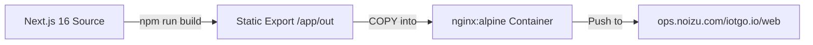

# Deployment Architecture

## Current State

IoTGo deploys as a single-container static site on the self-hosted K8s cluster at `*.noizu.com`.

### Build Pipeline

The Dockerfile uses a two-stage build:
1. **Builder stage**: `node:22-alpine` installs deps and runs `next build`, producing a static export in `/app/out`
2. **Runtime stage**: `nginx:alpine` serves the static files with a custom `nginx.conf`

### Kubernetes Resources

| Resource | Name | Notes |
|----------|------|-------|
| Deployment | `iotgo` | 1 replica, 50m/128Mi request, 200m/256Mi limit |
| Service | `iotgo` | ClusterIP on port 3000 |
| Ingress | `iotgo` | NGINX class, Cloudflare-only whitelist, TLS termination |
| TLS Secret | `iotgo-tls` | Synced by Infisical Operator from `k8-infra` project |

### Helm Chart

Located at `helm/iotgo/` (chart version 0.1.0, app version 0.1.0). Configurable via `values.yaml`:
- `replicas`, `image`, `port`, `domain`
- `resources` (CPU/memory requests and limits)
- `ingress` (class, annotations, Cloudflare-only toggle)
- `tls` (Infisical integration config)

### Health Checks

- **Liveness**: HTTP GET `/` every 30s (initial delay 10s)
- **Readiness**: HTTP GET `/` every 10s (initial delay 5s)

### Image Registry

Images pushed to `ops.noizu.com/iotgo.io/web:<tag>` using `imagePullSecrets` referencing `ops-registry-secret`.

## Domain & DNS

Domain `iotgo.io` is routed through Cloudflare. DNS managed via Terraform in the parent infrastructure repo (`terraform/domains/`).
