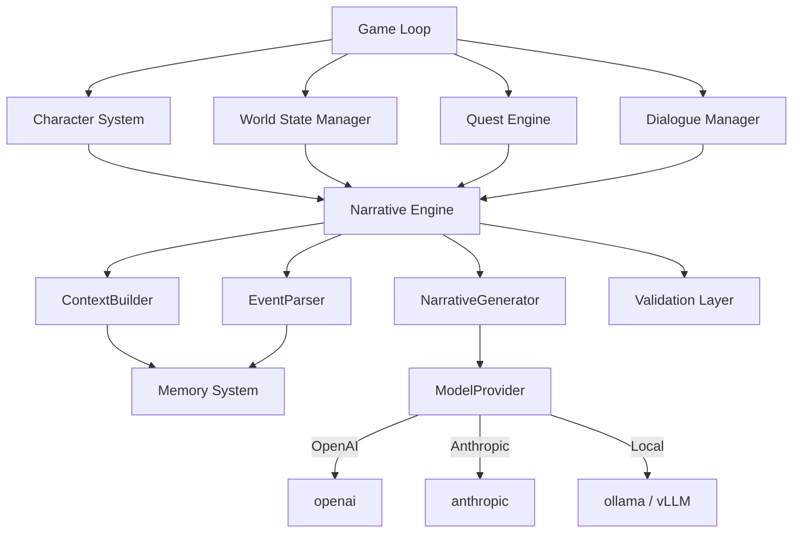

# Framework Architecture

## Design Principles

1. **Composable, not monolithic** — each component is independent; use only what you need
2. **LLM-agnostic** — all LLM calls go through a `ModelProvider` interface; swap providers with one line
3. **State is structured** — typed Pydantic models, not prompt-embedded context; LLM reads state but doesn't own it
4. **Events are ground truth** — every interaction produces typed `GameEvent` objects; events update state, not prose
5. **Context is budgeted** — the ContextBuilder assembles per-call prompts prioritized by relevance, constrained by token budget

## Component Architecture

## The Six Core Components

### Character System
Typed character definitions with stat blocks, traits, inventory, relationship graphs, and knowledge tracking. Supports serialization to JSON/YAML for save/load.

**Key abstractions:** `Character`, `StatBlock`, `Inventory`, `Relationship`, `Knowledge`

### World State Manager
Ground truth about the world — hierarchical locations, faction system with influence/disposition, timeline with scheduled events, and world rules (constraints the LLM must respect).

**Key abstractions:** `World`, `Location`, `Faction`, `Timeline`, `WorldRule`

### Narrative Engine
The central orchestrator. Assembles context from all other systems, calls the LLM, parses structured responses, validates against world rules, and applies state changes.

**Key abstractions:** `ContextBuilder`, `NarrativeGenerator`, `EventParser`, `ResponseSchema`

### Quest Engine (v0.2)
Quest templates with objectives, branching conditions, and rewards. Supports procedural generation from world state + character + theme. Quest state machine tracks progress and triggers events.

**Key abstractions:** `Quest`, `Objective`, `QuestGenerator`, `RewardTable`, `QuestGraph`

### Dialogue Manager (v0.2)
NPC voice profiles with personality and speech patterns. Knowledge boundaries enforce what NPCs should know. Disposition model tracks NPC attitudes based on player actions and reputation.

**Key abstractions:** `Dialogue`, `NPCVoice`, `DispositionModel`, `DialogueMemory`

### Memory System
Append-only event journal with periodic compression into summary blocks. Retrieval via keyword search (v0.1) and semantic vector similarity (v0.2). Relevance scoring ranks memories by current context.

**Key abstractions:** `EventJournal`, `MemoryIndex`, `Summary`, `RelevanceScorer`

## LLM Provider Interface

Unified async interface: `generate(prompt, schema, config)`. Built-in providers for OpenAI, Anthropic, and Ollama. Supports automatic token counting, cost tracking, rate limiting, fallback chains, and response caching for deterministic testing.

## Technology Stack

| Layer | Choice |
|-------|--------|
| Language | Python 3.11+, type-annotated, async-first |
| Data models | Pydantic |
| Package | PyPI as `noizurpg` |
| CLI | `noizurpg init`, `noizurpg play`, `noizurpg export` |
| Default storage | SQLite (zero-config) |
| Production storage | PostgreSQL + Redis |
| Vector storage | ChromaDB (default), Pinecone/Weaviate/pgvector via plugins |
| Testing | pytest, deterministic mode (fixed seed + cached LLM), LLM-as-judge eval |
| Documentation | MkDocs Material, auto-generated API docs |
