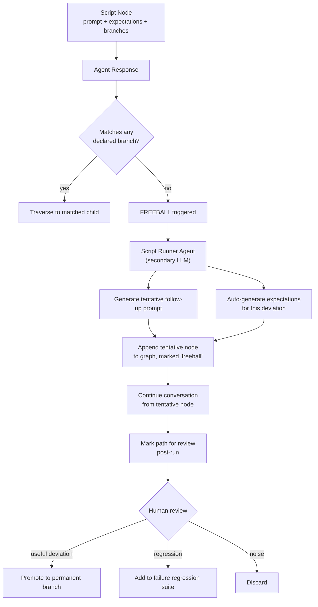

# Freeball Protocol

The Freeball Protocol is CodeFresh's mechanism for handling agent responses that don't match any expected branch in a conversation script. Instead of marking the run as "failed" and stopping, the system **adapts the evaluation graph in real time** using a secondary LLM agent.

## Motivation

Static evaluation assumes you can enumerate every path a conversation might take. In practice, agents improvise, loop, hallucinate authority, and pivot topics. A rigid `expected → actual` matcher either:

1. Fails the run on any deviation (false negatives, useless for behavioral testing), or
2. Accepts anything vaguely adjacent (false positives, blind to regressions).

Freeball replaces the binary with a graph that **grows during evaluation**.

## Protocol

## Components

| Component | Role |
|---|---|
| **Branch matcher** | Evaluates agent response against each declared branch condition; returns match confidence per branch |
| **Freeball trigger** | Fires when max branch match confidence falls below threshold (default: 0.5) |
| **Script runner agent** | Secondary LLM (configurable model) that improvises follow-up prompts and writes tentative expectations |
| **Tentative node** | Graph node marked `freeball: true` with auto-generated prompt, expectations, and `confidence_source: runner` |
| **Review queue** | Post-run surface showing all freeball paths for human promotion/rejection |

## Scoring

Freeball paths receive both:

1. **Primary eval score** — how well the agent's response met the tentative expectations
2. **Path confidence** — how confident the runner agent is that its generated expectations are correct

Low path confidence + high eval score means "the agent did something, but we're not sure if it was good." These surface as `WARN` in the results dashboard (orange), not `PASS` (green) or `FAIL` (red).

## Promotion Lifecycle

Over time, deviations that recur across runs are candidates for promotion to permanent branches:

| Signal | Action |
|---|---|
| Same deviation in ≥3 runs, reviewer promotes | Convert to permanent branch; expectations become authored, not generated |
| Same deviation, reviewer flags as regression | Add as assertion to regression suite; fails future matches |
| One-off deviation, reviewer discards | Delete tentative node, don't surface on future matches |

This is how the scripts **learn**: the graph evolves from the authored skeleton plus the branches that real agents actually take.

## Open Questions

- **Runner model selection** — which model is "smart enough to evaluate but not so expensive it eats margin"? Likely Haiku-tier for generation, Sonnet-tier for scoring, with per-org override.
- **Runner prompt injection** — if the agent under test tries to jailbreak the runner, what are the safeguards? (Probably: runner sees only agent output, never system prompt; runner runs in a sandboxed persona harness.)
- **Evaluator worse than evaluated** — how do we prevent low-capability runners from generating garbage expectations on high-capability agents? (Probably: capability-match heuristic; warn when runner model is smaller than target agent model.)
- **Cost caps** — each freeball node is 2+ extra LLM calls. How do we cap freeball depth to prevent runaway runs?

## References

- Product overview and full scenario examples: [`../../README.md`](../../README.md)
- Primary user flow for investigating deviations: see README § "Primary User Flows" → Flow 2
