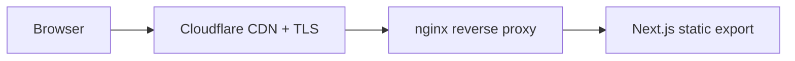

# Infrastructure

## Current Deployment (Landing Site)



| Component | Detail |
|-----------|--------|
| Container | Docker multi-stage build (Node build → nginx serve) |
| Proxy | nginx with `nginx.conf` in `web/` |
| TLS | Cloudflare-managed, `*.noizu.com` wildcard |
| Domain | `noizurpg.com` via Cloudflare DNS |

## Planned Infrastructure (Framework)

### Package Distribution
- **PyPI:** `pip install noizurpg` — the primary distribution channel
- **npm (future):** `@noizurpg/core` TypeScript SDK, post-v1.0

### Storage Backends

| Backend | Use Case | Config |
|---------|----------|--------|
| SQLite | Default, zero-config, offline development | Built-in, no setup |
| PostgreSQL | Production deployments, multi-user | Via `StorageBackend` interface |
| Redis | Session caching, real-time state | Via `StorageBackend` interface |
| ChromaDB | Vector storage for semantic memory retrieval | Embedded, default |
| Pinecone / Weaviate / pgvector | Production vector storage | Via plugins |

### Cloud Services (Planned)

| Service | Purpose | Status |
|---------|---------|--------|
| Cloud Playground | Browser sandbox with hosted Ollama backend | Planned |
| Managed Memory | Cloud-hosted vector store + event journal | Planned |
| Managed Models | Pre-configured LLM access, fine-tuned for RPG | Planned |

### Playground Architecture (Planned)

```
Browser (Next.js) ←WebSocket→ FastAPI ←→ NoizuRPG Framework ←→ LLM
                                  ↕
                              PostgreSQL (state)
                              ChromaDB (vectors)
```

- Free tier: rate-limited Ollama backend
- Paid tier: commercial model access (OpenAI, Anthropic)
