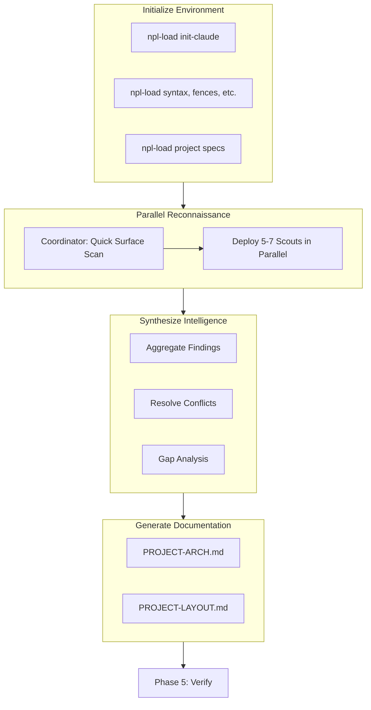

# init-project (Detailed Reference)

Complete reference for bootstrapping project documentation with NPL.

## Overview

`init-project` generates foundational project documentation:
- `CLAUDE.md` - LLM assistant instructions with NPL prompts
- `docs/PROJECT-ARCH.md` - Architecture documentation
- `docs/PROJECT-LAYOUT.md` - File structure documentation

The command uses multi-agent parallel reconnaissance to efficiently analyze codebases of any size.

## Workflow Phases



## Phase 1: Initialize Environment

Initializes CLAUDE.md and loads required NPL dependencies.

### Commands

```bash
# Initialize CLAUDE.md with standard NPL prompts
npl-load init-claude

# Load NPL syntax elements for documentation generation
npl-load c "syntax,fences,directive,formatting.template" --skip {@npl.def.loaded}

# Load specification documents
npl-load spec "project-arch-spec,project-layout-spec" --skip {@npl.spec.loaded}
```

### CLAUDE.md Contents

After initialization, CLAUDE.md contains:
- NPL Load Directive (environment variables, dependency loading)
- NPL Scripts reference (`dump-files`, `git-tree`, `npl-load`)
- SQLite Quick Guide

## Phase 2: Parallel Reconnaissance

The `@npl-project-coordinator` agent orchestrates codebase exploration.

### Delegation-First Scanning

The coordinator performs minimal direct exploration:

| Step | Duration | Actions |
|------|----------|---------|
| Surface Scan | ~30 sec | `ls` directories, read manifests, identify project type |
| Delegation | Immediate | Launch all scouts in parallel |
| Wait | Variable | Scouts operate independently |

### Why Delegation First

Sequential coordinator scanning: 10-20x slower than parallel scouts.

The coordinator orchestrates; scouts explore.

### Scout Deployment

Deploy 5-7 `@npl-gopher-scout` agents simultaneously:

| Scout | Domain | Key Targets |
|-------|--------|-------------|
| Scout-Structure | File Organization | tree, files, naming conventions |
| Scout-Layers | Architecture | tiers, boundaries, data flow |
| Scout-Domain | Business Logic | bounded contexts, entities, aggregates |
| Scout-Patterns | Code Patterns | conventions, design patterns, testing |
| Scout-Services | Infrastructure | database, cache, queues, external APIs |
| Scout-API | Interfaces | endpoints, auth, contracts, versioning |
| Scout-DevOps | Operations | CI/CD, deployment, containers, IaC |

### Scout Instructions

Each scout:
1. Performs deep reconnaissance of their domain
2. Returns structured findings with `file:line` references
3. Flags uncertainties and gaps
4. Estimates confidence per finding

### Execution Rules

All scouts MUST launch in a single parallel batch:
- One Task tool call per scout, ALL in the same message
- Do NOT wait for one scout before launching the next
- Do NOT have coordinator read files between launches
- Scouts operate independently (no inter-scout dependencies)

### Synchronization

```
BARRIER: All scouts must complete before synthesis phase.
```

## Phase 3: Synthesize Intelligence

Collect and unify scout reports.

### Steps

1. **Aggregate Findings**
   - Collect all scout reports
   - Build unified project model

2. **Conflict Resolution**
   - Identify contradictory findings
   - Apply confidence-weighted resolution

3. **Gap Analysis**
   - Check coverage against spec requirements
   - Spawn targeted follow-up scouts if needed

### Quality Gate

| Criterion | Threshold |
|-----------|-----------|
| Scout reports | All valid |
| Key architectural decisions | Confidence > 0.7 |
| Spec section coverage | > 80% |
| Unresolved conflicts | None critical |

## Phase 4: Generate Documentation

### Architecture Documentation

**File**: `docs/PROJECT-ARCH.md`

| Requirement | Value |
|-------------|-------|
| Max length | 1200-2000 lines |
| NPL directives | `<<arch-overview:>>`, `<<layers:>>`, `<<services:>>` |
| Sub-files | `docs/PROJECT-ARCH/` for sections > 50-100 lines |
| Diagrams | Mermaid layer diagram required |
| Critical issues | Mark with target indicator |

**Sub-files to consider:**

| File | Content |
|------|---------|
| `layers.md` | Detailed layer breakdown |
| `domain.md` | Entity details, bounded contexts |
| `patterns.md` | Code patterns with examples |
| `infrastructure.md` | Service configs, deployment |
| `database.md` | Schema details, extensions |
| `api.md` | API structure, contracts |

### Layout Documentation

**File**: `docs/PROJECT-LAYOUT.md`

| Requirement | Value |
|-------------|-------|
| Format | Single file |
| Tree diagrams | Clean, annotated (use `git-tree`) |
| Required sections | All 11 spec sections |
| Naming conventions | Documented |
| Quick reference | "Finding Files" section |

## Phase 5: Verify & Finalize

### Checklist

- [ ] CLAUDE.md contains NPL prompts
- [ ] Both doc files complete and consistent
- [ ] Sub-file references resolve correctly
- [ ] Cross-references between ARCH and LAYOUT valid
- [ ] Critical architectural decisions captured

## Output Files

| File | Description |
|------|-------------|
| `CLAUDE.md` | NPL prompts appended |
| `docs/PROJECT-ARCH.md` | Architecture documentation |
| `docs/PROJECT-ARCH/*.md` | Sub-files (as needed) |
| `docs/PROJECT-LAYOUT.md` | File structure documentation |

## Usage Example

```bash
# Typical invocation via npl-load
npl-load command "init-project"

# Or directly invoke the coordinator
@npl-project-coordinator
Coordinate parallel reconnaissance of this codebase to generate PROJECT-ARCH.md and PROJECT-LAYOUT.md.
```

## Best Practices

### Do

- Launch ALL scouts in parallel (single message, multiple Task calls)
- Use `git-tree` for directory views (respects `.gitignore`)
- Split architecture docs into sub-files when sections exceed ~50-100 lines
- Mark critical issues prominently
- Include confidence scores on findings

### Avoid

- Sequential file reading by coordinator
- Coordinator performing deep exploration directly
- Waiting for one scout before launching others
- Documentation files exceeding line limits
- Skipping the quality gate

## Performance Considerations

| Approach | Typical Duration |
|----------|------------------|
| Sequential coordinator scan | 10-20 minutes |
| Parallel scout deployment | 2-5 minutes |

Parallelism provides 5-10x speedup for medium-to-large codebases.

## Dependencies

### NPL Core

- `syntax` - Core syntax elements
- `fences` - Code fence handling
- `directive` - Directive processing
- `formatting.template` - Template handling

### NPL Specifications

- `project-arch-spec` - Architecture doc specification
- `project-layout-spec` - Layout doc specification

### Agents

- `@npl-project-coordinator` - Orchestration agent
- `@npl-gopher-scout` - Exploration agent (deployed 5-7 instances)

## Troubleshooting

### Scouts Not Completing

- Check scout task complexity
- Verify all scouts launched in parallel (not sequential)
- Review individual scout outputs for errors

### Missing Documentation Sections

- Run gap analysis again
- Deploy targeted follow-up scouts
- Check spec coverage requirements

### Conflicts in Findings

- Apply confidence-weighted resolution
- Spawn verification scout for specific area
- Document unresolved conflicts with low confidence

## See Also

- [init-project.md](./init-project.md) - Quick reference
- `npl/agent.md` - Agent specifications
- `docs/PROJECT-ARCH.md` - Generated architecture template
- `docs/PROJECT-LAYOUT.md` - Generated layout template
