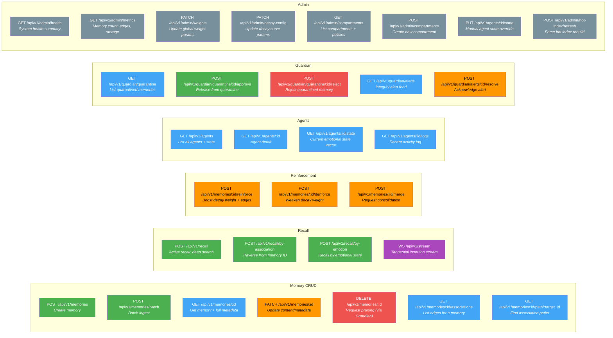
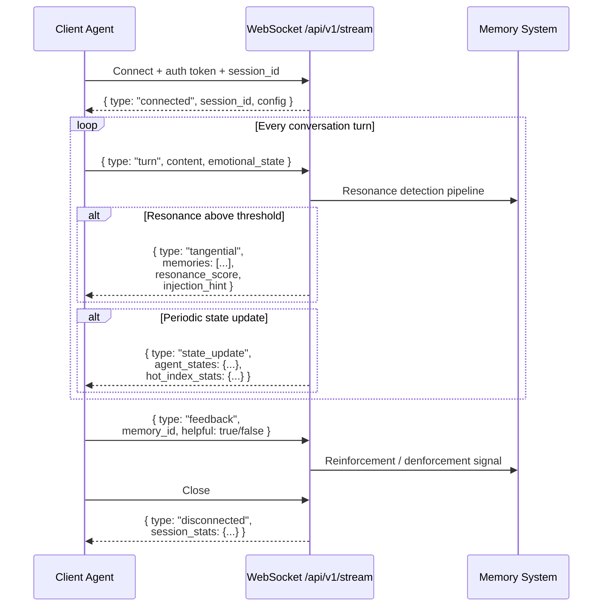
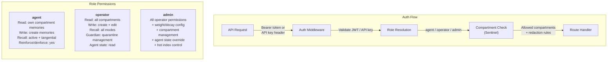

# API Surface Diagrams

Complete API route map and request/response schemas for The Robot Remembers.

---

## 1. API Route Map

All endpoints grouped by domain. Color coding: blue = read, green = write, orange = action, red = admin.



### Endpoint Summary

| Domain | Count | Auth Level |
|--------|-------|------------|
| Memory CRUD | 7 | Agent or API key |
| Recall | 4 | Agent or API key |
| Reinforcement | 3 | Agent or API key |
| Agents | 4 | Read: any authenticated; Write: admin |
| Guardian | 5 | Operator or admin |
| Admin | 8 | Admin only |
| **Total** | **31** | |

---

## 2. WebSocket Stream Protocol

The tangential insertion stream (`WS /api/v1/stream`) is a bidirectional WebSocket. The client sends conversation turns; the server pushes tangential memories when resonance exceeds threshold.



---

## 3. Request/Response Schemas

TypeScript interfaces for the key API payloads. These define the contract between client agents and the memory service.

### Recall

```typescript
// POST /api/v1/recall
interface RecallRequest {
  /** Natural language query text */
  query: string;

  /** Which retrieval mode to use */
  mode: 'active' | 'tangential';

  /** Maximum memories to return (active: 10-20, tangential: 1-3) */
  max_results?: number;

  /** Current emotional state for resonance scoring */
  emotional_context?: {
    /** Use the Monitor's current state instead of providing one */
    match_current_mood?: boolean;

    /** Override emotional state for this query */
    mood_override?: {
      valence?: number;   // -1.0 to 1.0
      arousal?: number;   // 0.0 to 1.0
      dominance?: number; // 0.0 to 1.0
    };

    /** Override hormonal state for this query */
    hormones_override?: {
      cortisol?: number;  // 0.0 to 1.0
      dopamine?: number;  // 0.0 to 1.0
      oxytocin?: number;  // 0.0 to 1.0
      serotonin?: number; // 0.0 to 1.0
    };
  };

  /** Filter by contextual attributes */
  contextual_filter?: {
    domain?: string;
    time_of_day?: 'morning' | 'afternoon' | 'evening' | 'night';
    season?: 'spring' | 'summer' | 'autumn' | 'winter';
    collaborators?: string[];
    content_type?: 'episodic' | 'semantic' | 'procedural';
  };

  /** Temporal range filter */
  temporal_range?: {
    after?: string;  // ISO 8601
    before?: string; // ISO 8601
  };

  /** Graph traversal configuration */
  traversal?: {
    max_depth?: number;      // default 3
    min_edge_weight?: number; // default 0.2
    edge_types?: Array<'semantic' | 'emotional' | 'temporal' | 'causal' | 'co-occurrence' | 'synthetic'>;
  };

  /** Output format */
  format?: 'context_injection' | 'full' | 'summary_only';
}

interface RecallResponse {
  /** Recalled memories, ordered by relevance */
  memories: RecalledMemory[];

  /** Metadata about the recall operation */
  meta: {
    query: string;
    mode: 'active' | 'tangential';
    latency_ms: number;
    candidates_evaluated: number;
    paths_explored: number;
    emotional_state_used: EmotionalVector;
    winnowed_from: number;
  };
}

interface RecalledMemory {
  id: string;
  content: string;
  summary: string;
  content_type: 'episodic' | 'semantic' | 'procedural';

  /** Composite relevance score (0.0-1.0) */
  relevance_score: number;

  /** Emotional resonance between query state and memory (0.0-1.0) */
  emotional_resonance: number;

  /** How this memory was found */
  retrieval_path: 'vector' | 'attribute' | 'graph_traversal' | 'co-occurrence';

  /** Emotional state when this memory was formed */
  emotional_metadata: EmotionalMetadata;

  /** When and where this memory was formed */
  contextual_metadata: ContextualMetadataSummary;

  /** Strongest associations from this memory */
  associations: AssociationHint[];

  /** Lifecycle info */
  decay_weight: number;
  recall_count: number;
  created_at: string;
  last_recalled_at: string | null;
}

interface AssociationHint {
  target_memory_id: string;
  target_summary: string;
  edge_type: string;
  weight: number;
}
```

### Memory Write

```typescript
// POST /api/v1/memories
interface MemoryWriteRequest {
  /** The memory content — natural language text */
  content: string;

  /** Memory classification */
  content_type?: 'episodic' | 'semantic' | 'procedural';

  /** Compressed version (auto-generated if omitted) */
  summary?: string;

  /** Emotional state at time of memory formation */
  emotional_metadata?: {
    mood?: {
      valence?: number;
      arousal?: number;
      dominance?: number;
    };
    hormones?: {
      cortisol?: number;
      dopamine?: number;
      oxytocin?: number;
      serotonin?: number;
    };
    frustration_index?: number;
    confidence?: 'high' | 'medium' | 'low';
  };

  /** Contextual information about the formation moment */
  contextual_metadata?: {
    topic?: string;
    domain?: string;
    modality?: 'chat' | 'voice' | 'api' | 'api_batch' | 'background';
    collaborators?: string[];
    environment?: Record<string, string>;
  };

  /** Access control partition */
  compartment?: string;

  /** Classification level */
  classification?: 'open' | 'restricted' | 'sealed';

  /** Source identification */
  source_agent?: string;
}

interface MemoryWriteResponse {
  id: string;
  lifecycle_state: 'enriched' | 'quarantined';
  content_type: string;
  decay_weight: number;
  created_at: string;

  /** If quarantined, why */
  quarantine_reason?: string;

  /** Associations created (empty if still processing) */
  associations_created: number;
}
```

### Agent State

```typescript
// GET /api/v1/agents/:id/state
interface AgentStateResponse {
  agent_id: string;
  agent_name: string;
  agent_role: string;
  biological_analogue: string;
  status: 'active' | 'idle' | 'degraded' | 'offline';

  /** Current emotional state vector */
  emotional_state: EmotionalVector;

  /** Operational metrics */
  metrics: {
    /** Events processed in the last hour */
    throughput_per_hour: number;
    /** Pending items in the agent's work queue */
    queue_depth: number;
    /** Error rate (0.0-1.0) over the last hour */
    error_rate: number;
    /** Average processing time per event (ms) */
    avg_latency_ms: number;
    /** Uptime since last restart */
    uptime_seconds: number;
  };

  /** Agent-specific stats */
  agent_specific: Record<string, unknown>;
  // Examples:
  //   Archivist: { memories_formed_today: 47, salience_rejection_rate: 0.62 }
  //   Guardian:  { quarantined_today: 3, contradiction_rate: 0.04 }
  //   Weaver:    { edges_created_today: 182, avg_edge_weight: 0.41 }
  //   Curator:   { pruned_today: 12, archived_today: 5 }
  //   Dreamer:   { consolidated_today: 8, speculative_proposals: 15 }
  //   Sentinel:  { access_denials_today: 2, redactions_applied: 7 }
  //   Recall:    { queries_today: 89, avg_latency_ms: 340, hit_rate: 0.78 }
  //   Monitor:   { state_broadcasts_today: 156, drift_events: 12 }

  last_updated: string;
}
```

### Shared Types

```typescript
interface EmotionalVector {
  valence: number;    // -1.0 to 1.0
  arousal: number;    // 0.0 to 1.0
  dominance: number;  // 0.0 to 1.0
  cortisol: number;   // 0.0 to 1.0
  dopamine: number;   // 0.0 to 1.0
  oxytocin: number;   // 0.0 to 1.0
  serotonin: number;  // 0.0 to 1.0
}

interface EmotionalMetadata extends EmotionalVector {
  frustration_index: number;
  confidence: 'high' | 'medium' | 'low';
  schema_version: number;
}

interface ContextualMetadataSummary {
  timestamp_utc: string;
  time_of_day: string;
  domain: string;
  topic: string;
  collaborators: string[];
  modality: string;
}
```

### Health and Metrics

```typescript
// GET /api/v1/admin/health
interface HealthResponse {
  status: 'healthy' | 'degraded' | 'unhealthy';
  components: {
    api: ComponentHealth;
    orchestrator: ComponentHealth;
    postgres: ComponentHealth;
    weaviate: ComponentHealth;
    redis: ComponentHealth;
  };
  timestamp: string;
}

interface ComponentHealth {
  status: 'up' | 'degraded' | 'down';
  latency_ms: number;
  details?: string;
}

// GET /api/v1/admin/metrics
interface MetricsResponse {
  memories: {
    total: number;
    by_state: Record<string, number>;
    by_type: Record<string, number>;
    by_compartment: Record<string, number>;
  };
  associations: {
    total_edges: number;
    avg_weight: number;
    by_type: Record<string, number>;
  };
  storage: {
    postgres_size_mb: number;
    weaviate_size_mb: number;
    redis_memory_mb: number;
  };
  recall: {
    total_queries_24h: number;
    active_queries_24h: number;
    tangential_insertions_24h: number;
    avg_active_latency_ms: number;
    avg_tangential_latency_ms: number;
    hit_rate: number;
  };
  quarantine: {
    pending: number;
    approved_24h: number;
    rejected_24h: number;
  };
  agents: Record<string, {
    status: string;
    queue_depth: number;
    error_rate: number;
  }>;
  timestamp: string;
}
```

---

## 4. Authentication and Authorization



| Role | Memory Read | Memory Write | Recall | Guardian | Admin | Agent State |
|------|-------------|-------------|--------|----------|-------|-------------|
| agent | Own compartment | Create | Active + tangential | -- | -- | Read own |
| operator | All compartments | Create + edit | All modes | Quarantine mgmt | -- | Read all |
| admin | All + sealed | All | All | All | All | Read + write |
