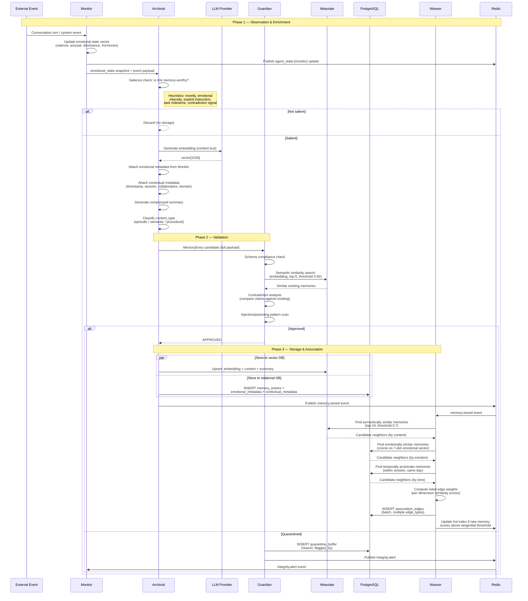
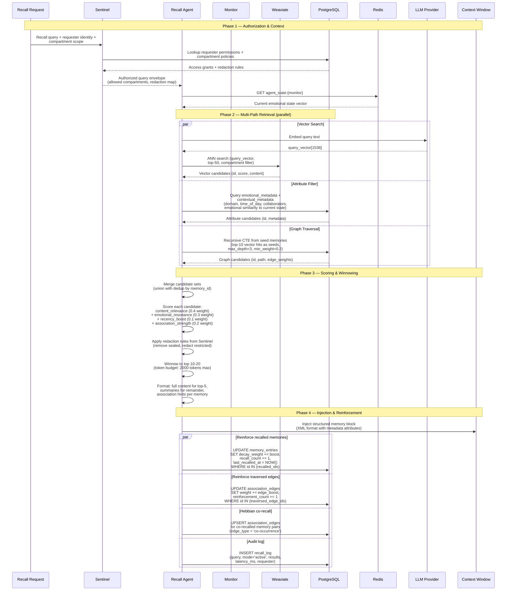
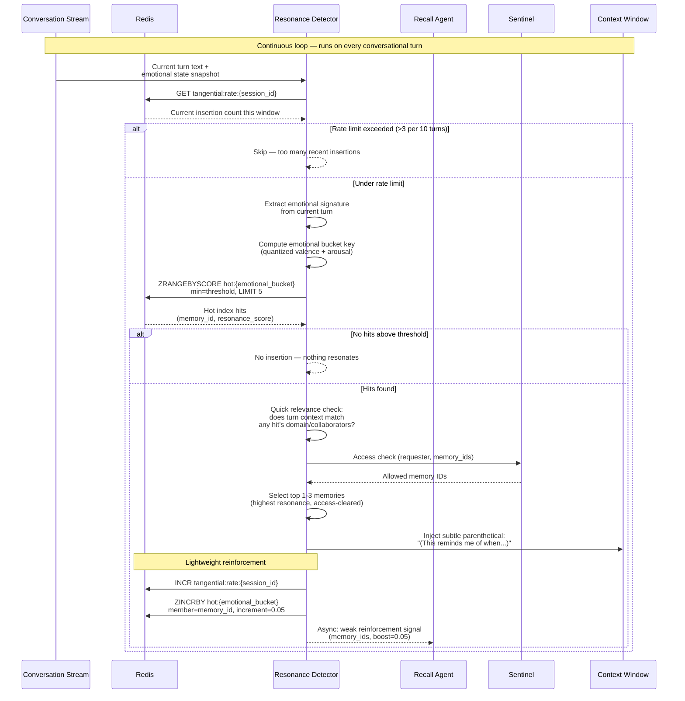
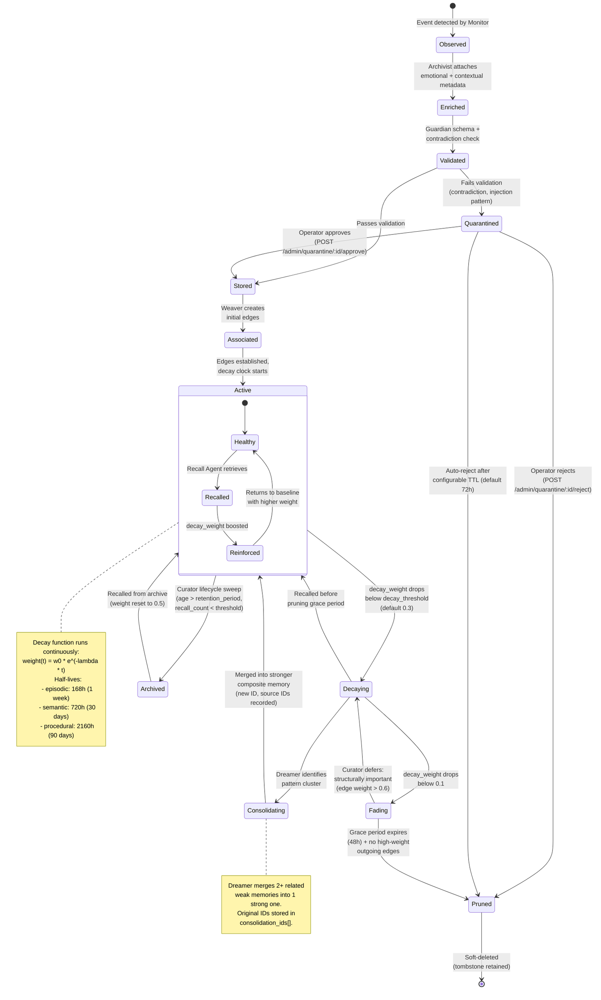
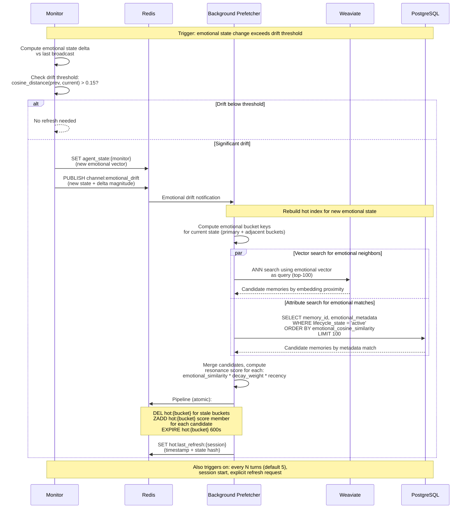

# Data Flow Diagrams

Detailed sequence and state diagrams for every major data path through The Robot Remembers.

---

## 1. Memory Formation Flow

The complete journey of a new memory from raw conversation event to stored, associated node in the memory graph. This is the "write path" — the most common operation in the system.



**Key design decisions in this flow:**

- **Salience filtering** happens early (at the Archivist) to avoid wasting embedding API calls on trivial events. Heuristics are tunable: emotional intensity threshold, novelty score vs. existing memories, explicit "remember this" signals.
- **Contradiction checking** uses a high similarity threshold (0.92) — it is looking for near-duplicates with conflicting claims, not loosely related content.
- **Storage is parallel** — the Weaviate and PostgreSQL writes happen concurrently. The memory ID is pre-generated (UUID) so both stores reference the same key.
- **Association creation is asynchronous** — the Weaver receives a pub/sub event and processes it independently. The formation pipeline does not block on association building.

---

## 2. Active Recall Flow

Explicit, deliberate retrieval: the agent or operator asks "What do I know about X?" This is the deep search path with a 2-second latency budget.



**Scoring formula detail:**

```
final_score = (0.4 * content_relevance)
            + (0.3 * emotional_resonance)
            + (0.1 * recency_boost)
            + (0.2 * association_strength)

where:
  content_relevance  = normalized vector similarity (0-1)
  emotional_resonance = 1 - (cosine_distance(current_emotion, memory_emotion) / 2)
  recency_boost      = e^(-hours_since_last_recall / 168)
  association_strength = max edge weight on any path from a seed memory to this candidate
```

---

## 3. Tangential Insertion Flow

Passive, serendipitous recall: memories surface unbidden during conversation when emotional/contextual resonance exceeds a threshold. This is the "background hum" of the memory system — the equivalent of a song triggering a childhood memory.



**Performance constraints (< 100ms budget):**

| Operation | Budget | Notes |
|-----------|--------|-------|
| Rate limit check | < 1ms | Single Redis GET |
| Emotional bucket lookup | < 5ms | Redis sorted set range query |
| Access check | < 10ms | Sentinel uses cached compartment policies in Redis |
| Context relevance filter | < 5ms | In-memory string matching, no DB call |
| Total | < 25ms | Leaves 75ms headroom for network variance |

The key insight: tangential insertion **never touches Weaviate or PostgreSQL**. It operates entirely from the pre-computed hot index in Redis. This is what makes sub-100ms possible.

---

## 4. Memory Lifecycle Flow

A state machine showing every phase a memory can pass through, with the responsible agent at each transition and the conditions that trigger state changes.



### Lifecycle Phase Summary

| Phase | Agent | Entry Condition | Exit Conditions | Duration |
|-------|-------|----------------|-----------------|----------|
| Observed | Monitor | Event detected | Archivist picks up | Milliseconds |
| Enriched | Archivist | Salience threshold met | Guardian validation | < 500ms |
| Validated | Guardian | Schema + contradiction check | Approved or quarantined | < 1s |
| Quarantined | Guardian | Failed validation | Operator resolves or TTL expires | Hours to days |
| Stored | Archivist | Validation passed | Weaver processes | < 100ms |
| Associated | Weaver | Edges created | Fully linked | < 2s |
| Active | -- | Edges established | Decay threshold crossed | Hours to months |
| Decaying | Curator | `decay_weight < 0.3` | Recalled, consolidated, or fades further | Hours to days |
| Fading | Curator | `decay_weight < 0.1` | Pruned or deferred | 48h grace period |
| Consolidating | Dreamer | Pattern cluster identified | New composite memory created | Background batch |
| Archived | Curator | Age + low recall count | Recalled from archive | Indefinite |
| Pruned | Curator | Grace period + no structural importance | Tombstone | Terminal |

---

## 5. Hot Index Refresh Flow

The hot index is the backbone of tangential insertion performance. It must stay fresh enough to reflect the agent's current emotional state without being so aggressive that it saturates Redis or Weaviate with queries.



**Refresh triggers (any of these):**

1. **Emotional drift** — cosine distance between current and last-broadcast state exceeds 0.15
2. **Turn interval** — every 5 conversational turns regardless of drift (catch gradual shifts)
3. **Session start** — always refresh at the beginning of a new conversation
4. **Explicit request** — operator or agent can force a refresh via admin API

**Hot index structure in Redis:**

```
Key: hot:{quantized_valence}:{quantized_arousal}
Type: Sorted Set
Members: memory_id (UUID)
Scores: resonance_score (float, 0.0-1.0)
TTL: 600 seconds (auto-expire if not refreshed)

Adjacent buckets: +/- 1 on each quantized axis
  e.g., if current state maps to hot:neg:high,
  also populate hot:neg:med and hot:neutral:high
```

This adjacency ensures that tangential insertion can find memories even when the emotional state is on a bucket boundary, avoiding sharp cutoff artifacts.
