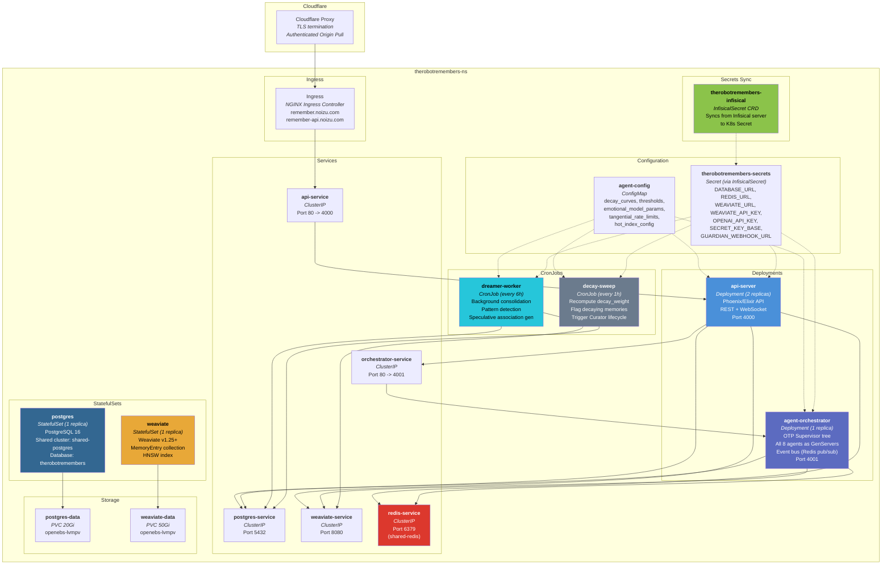

# Deployment Diagrams

Kubernetes deployment topology and Helm chart structure for The Robot Remembers.

---

## 1. Kubernetes Deployment Diagram

All workloads, services, storage, and networking resources within the `therobotremembers-ns` namespace.



### Resource Specifications

| Workload | Type | Replicas | CPU Request | CPU Limit | Memory Request | Memory Limit |
|----------|------|----------|-------------|-----------|----------------|--------------|
| api-server | Deployment | 2 | 250m | 1000m | 256Mi | 512Mi |
| agent-orchestrator | Deployment | 1 | 500m | 2000m | 512Mi | 1Gi |
| dreamer-worker | CronJob | 1 (per run) | 500m | 2000m | 512Mi | 2Gi |
| decay-sweep | CronJob | 1 (per run) | 100m | 500m | 128Mi | 256Mi |
| postgres | StatefulSet | 1 | 500m | 2000m | 1Gi | 4Gi |
| weaviate | StatefulSet | 1 | 500m | 2000m | 2Gi | 8Gi |

**Notes:**
- **postgres** may use the shared-postgres cluster (tier 1) instead of a dedicated StatefulSet. If shared, the StatefulSet and PVC are omitted and `SVC_PG` points to `shared-postgres.data-ns.svc`.
- **redis** uses the shared-redis or shared-valkey instance (tier 1). No dedicated Redis deployment.
- **weaviate** may use the shared Weaviate instance (tier 5) if multi-tenant collection isolation is acceptable. Dedicated instance preferred for performance isolation.
- The **agent-orchestrator** runs all 8 agents as OTP GenServers under a single Supervisor tree. This is a deliberate choice: inter-agent communication via Erlang messages is faster than network calls. If scaling requires it, agents can be split into separate deployments later.

### Ingress Configuration

```yaml
# Uses cloudflare-lib shared chart for annotations
annotations:
  {{- include "cloudflare-lib.ingress-annotations"
      (dict "bodySize" "10m" "readTimeout" "120" "sendTimeout" "120") | nindent 4 }}
  {{- include "cloudflare-lib.origin-pull-annotations" . | nindent 4 }}
  nginx.ingress.kubernetes.io/proxy-read-timeout: "120"
  nginx.ingress.kubernetes.io/websocket-services: "api-service"

rules:
  - host: remember-api.noizu.com    # API endpoint
    paths:
      - path: /api/
        service: api-service
      - path: /ws/
        service: api-service          # WebSocket upgrade for tangential stream
  - host: remember.noizu.com         # Operator dashboard
    paths:
      - path: /
        service: api-service          # Phoenix serves the Next.js static build
```

### infra-config.yaml Additions

```yaml
namespace_overrides:
  therobotremembers: therobotremembers-ns

tiers:
  3:  # Core Applications
    - therobotremembers
```

---

## 2. Helm Chart Structure

Follows the two-tier pattern used by all incubator portfolio products: a publishable chart in the incubator repo and a wrapper chart in `helm/apps/`.

```mermaid
graph TB
    subgraph "Tier 1: Publishable Chart"
        direction TB
        PUB["repos/incubator/helm/therobotremembers/"]
        PUB_CHART["Chart.yaml<br/><i>name: therobotremembers<br/>version: 0.1.0</i>"]
        PUB_VALUES["values.yaml<br/><i>Generic defaults<br/>No env-specific values</i>"]
        PUB_TEMPLATES["templates/"]
        PUB_T1["deployment-api.yaml"]
        PUB_T2["deployment-orchestrator.yaml"]
        PUB_T3["cronjob-dreamer.yaml"]
        PUB_T4["cronjob-decay.yaml"]
        PUB_T5["service-api.yaml"]
        PUB_T6["service-orchestrator.yaml"]
        PUB_T7["configmap-agent.yaml"]
        PUB_T8["ingress.yaml"]
        PUB_T9["_helpers.tpl"]
        PUB_DEP["Chart.yaml dependencies:<br/>cloudflare-lib (shared)"]
        PUB_PRE["preapply/<br/>infisical-secret.yaml"]

        PUB --> PUB_CHART
        PUB --> PUB_VALUES
        PUB --> PUB_TEMPLATES
        PUB --> PUB_PRE
        PUB_TEMPLATES --> PUB_T1
        PUB_TEMPLATES --> PUB_T2
        PUB_TEMPLATES --> PUB_T3
        PUB_TEMPLATES --> PUB_T4
        PUB_TEMPLATES --> PUB_T5
        PUB_TEMPLATES --> PUB_T6
        PUB_TEMPLATES --> PUB_T7
        PUB_TEMPLATES --> PUB_T8
        PUB_TEMPLATES --> PUB_T9
        PUB_CHART --> PUB_DEP
    end

    subgraph "Tier 2: Wrapper Chart"
        direction TB
        WRAP["helm/apps/therobotremembers/"]
        WRAP_CHART["Chart.yaml<br/><i>dependencies:<br/>- name: therobotremembers<br/>  version: 0.1.0<br/>  repository: oci://ghcr.io/<br/>    the-robot-lives/charts</i>"]
        WRAP_VALUES["values.yaml<br/><i>Environment-specific:<br/>domain, image tags,<br/>resource limits,<br/>Infisical paths,<br/>shared DB connection</i>"]

        WRAP --> WRAP_CHART
        WRAP --> WRAP_VALUES
    end

    subgraph "OCI Registry"
        OCI["ghcr.io/the-robot-lives/charts/<br/>therobotremembers:0.1.0"]
    end

    PUB -->|"helm-publish"| OCI
    OCI -->|"dependency"| WRAP_CHART

    style PUB fill:#e3f2fd,color:#000
    style WRAP fill:#fff3e0,color:#000
    style OCI fill:#f3e5f5,color:#000
```



### Publishable Chart values.yaml (key sections)

```yaml
# repos/incubator/helm/therobotremembers/values.yaml

api:
  replicaCount: 2
  image:
    repository: ghcr.io/the-robot-lives/therobotremembers-api
    tag: "latest"
    pullPolicy: IfNotPresent
  port: 4000
  resources:
    requests:
      cpu: 250m
      memory: 256Mi
    limits:
      cpu: 1000m
      memory: 512Mi

orchestrator:
  replicaCount: 1
  image:
    repository: ghcr.io/the-robot-lives/therobotremembers-orchestrator
    tag: "latest"
    pullPolicy: IfNotPresent
  port: 4001
  resources:
    requests:
      cpu: 500m
      memory: 512Mi
    limits:
      cpu: 2000m
      memory: 1Gi

dreamer:
  schedule: "0 */6 * * *"  # Every 6 hours
  resources:
    requests:
      cpu: 500m
      memory: 512Mi
    limits:
      cpu: 2000m
      memory: 2Gi

decaySweep:
  schedule: "0 * * * *"  # Every hour
  resources:
    requests:
      cpu: 100m
      memory: 128Mi
    limits:
      cpu: 500m
      memory: 256Mi

agentConfig:
  decay_curves:
    episodic_half_life_hours: 168
    semantic_half_life_hours: 720
    procedural_half_life_hours: 2160
  thresholds:
    decay_threshold: 0.3
    fading_threshold: 0.1
    pruning_grace_hours: 48
    structural_importance_threshold: 0.6
    tangential_resonance_threshold: 0.5
    contradiction_similarity_threshold: 0.92
  emotional_model:
    drift_threshold: 0.15
    hot_index_ttl_seconds: 600
    hot_index_max_per_bucket: 200
  tangential:
    max_insertions_per_window: 3
    window_seconds: 60
    rate_limit_window_turns: 10

ingress:
  enabled: true
  className: nginx
  hosts:
    - host: remember-api.noizu.com
      paths:
        - path: /api/
          pathType: Prefix
        - path: /ws/
          pathType: Prefix
    - host: remember.noizu.com
      paths:
        - path: /
          pathType: Prefix

persistence:
  postgres:
    enabled: true
    size: 20Gi
    storageClass: openebs-lvmpv
  weaviate:
    enabled: true
    size: 50Gi
    storageClass: openebs-lvmpv
```

### Wrapper Chart values.yaml (environment overrides)

```yaml
# helm/apps/therobotremembers/values.yaml

therobotremembers:
  api:
    image:
      tag: "v0.1.0"
    env:
      DATABASE_URL:
        secretKeyRef:
          name: therobotremembers-secrets
          key: DATABASE_URL
      REDIS_URL:
        secretKeyRef:
          name: therobotremembers-secrets
          key: REDIS_URL
      WEAVIATE_URL:
        secretKeyRef:
          name: therobotremembers-secrets
          key: WEAVIATE_URL

  # Use shared infrastructure (tier 1) instead of dedicated StatefulSets
  persistence:
    postgres:
      enabled: false  # Using shared-postgres
    weaviate:
      enabled: true   # Dedicated instance for performance
```

### Deploy Commands

```bash
# First-time setup
cd helm/apps/therobotremembers
helm dependency update

# Apply pre-requisites (InfisicalSecret CRD)
kubectl apply -f repos/incubator/helm/therobotremembers/preapply/

# Deploy
helm-upgrade --include therobotremembers

# Build and deploy images
deploy-service therobotremembers-api therobotremembers-orchestrator
```
