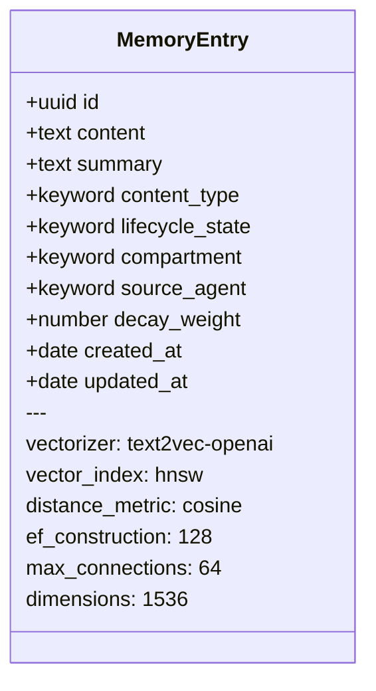
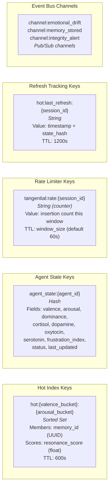

# Storage Schema Diagrams

Complete schema definitions for all three storage layers: PostgreSQL (relational), Weaviate (vector), and Redis (hot index / cache).

---

## 1. PostgreSQL Schema

The relational store is the system of record for all metadata, lifecycle state, access control, and audit data. The association graph is also stored here using an adjacency list pattern with recursive CTE traversal.

### Entity-Relationship Diagram

```mermaid
erDiagram
    memory_entries {
        uuid id PK
        text content
        varchar content_type "episodic | semantic | procedural"
        text summary
        varchar source_agent
        varchar lifecycle_state "active | decaying | consolidating | archived | quarantined | pruned"
        float decay_weight "0.0-1.0, starts at 1.0"
        int recall_count "default 0"
        int reinforcement_count "default 0"
        int denforcement_count "default 0"
        int version "incremented on merge/edit"
        varchar classification "open | restricted | sealed"
        varchar owner_agent
        timestamptz last_recalled_at
        timestamptz created_at
        timestamptz updated_at
        timestamptz pruned_at "nullable"
        jsonb consolidation_ids "nullable, array of source UUIDs"
    }

    emotional_metadata {
        uuid id PK
        uuid memory_id FK
        float valence "-1.0 to 1.0"
        float arousal "0.0 to 1.0"
        float dominance "0.0 to 1.0"
        float cortisol "0.0 to 1.0"
        float dopamine "0.0 to 1.0"
        float oxytocin "0.0 to 1.0"
        float serotonin "0.0 to 1.0"
        float frustration_index "0.0 to 1.0, computed"
        varchar confidence "high | medium | low"
        int schema_version "default 1"
    }

    contextual_metadata {
        uuid id PK
        uuid memory_id FK
        timestamptz timestamp_utc
        timestamptz local_time
        varchar time_of_day "morning | afternoon | evening | night"
        varchar day_of_week
        varchar season "spring | summer | autumn | winter"
        jsonb holiday_proximity "e.g. christmas: 2"
        varchar topic
        varchar domain "debugging | design | ops | etc"
        int conversation_length
        int turn_number
        varchar modality "chat | voice | api | api_batch | background"
        jsonb collaborators "array of agent/user IDs"
        jsonb environment "freeform key-value pairs"
    }

    association_edges {
        uuid id PK
        uuid source_memory_id FK
        uuid target_memory_id FK
        varchar edge_type "semantic | emotional | temporal | causal | co-occurrence | synthetic"
        float weight "0.0-1.0"
        varchar created_by "agent that created this link"
        int reinforcement_count "default 0"
        int denforcement_count "default 0"
        jsonb metadata "reason, emotional_similarity, temporal_proximity"
        timestamptz created_at
        timestamptz updated_at
        timestamptz last_reinforced "nullable"
    }

    agent_state {
        varchar agent_id PK "monitor | archivist | guardian | etc"
        jsonb emotional_state "full 7-dim vector + frustration"
        jsonb operational_metrics "throughput, error_rate, queue_depth"
        varchar status "active | idle | degraded | offline"
        timestamptz last_updated
    }

    compartments {
        uuid id PK
        varchar name UK
        text description
        jsonb access_policy "allowed_agents, allowed_users, default_access"
        varchar default_classification "open | restricted | sealed"
        timestamptz created_at
        timestamptz updated_at
    }

    memory_compartments {
        uuid memory_id FK
        uuid compartment_id FK
        timestamptz assigned_at
    }

    quarantine_buffer {
        uuid id PK
        uuid memory_id FK
        text reason
        varchar flagged_by "agent ID"
        varchar resolution "nullable: approved | rejected | auto_rejected"
        varchar resolved_by "nullable: operator ID"
        timestamptz flagged_at
        timestamptz resolved_at "nullable"
        timestamptz auto_reject_at "flagged_at + TTL"
    }

    recall_log {
        uuid id PK
        text query
        varchar mode "active | tangential"
        varchar requester "agent or user ID"
        jsonb emotional_context "agent state at time of recall"
        jsonb results "array of memory_id + score"
        int result_count
        int candidates_evaluated
        float latency_ms
        timestamptz created_at
    }

    consolidation_log {
        uuid id PK
        jsonb source_memory_ids "array of merged memory UUIDs"
        uuid result_memory_id FK
        text merge_rationale "Dreamer's reasoning"
        jsonb pattern_detected "what cluster was found"
        timestamptz created_at
    }

    memory_entries ||--|| emotional_metadata : "has one"
    memory_entries ||--|| contextual_metadata : "has one"
    memory_entries ||--o{ association_edges : "source"
    memory_entries ||--o{ association_edges : "target"
    memory_entries ||--o{ memory_compartments : "belongs to"
    compartments ||--o{ memory_compartments : "contains"
    memory_entries ||--o| quarantine_buffer : "may be quarantined"
    memory_entries ||--o{ consolidation_log : "result of"
```



### Key Indexes

```sql
-- Primary retrieval paths
CREATE INDEX idx_memories_lifecycle ON memory_entries(lifecycle_state)
    WHERE lifecycle_state IN ('active', 'decaying');
CREATE INDEX idx_memories_content_type ON memory_entries(content_type);
CREATE INDEX idx_memories_decay ON memory_entries(decay_weight)
    WHERE lifecycle_state = 'active';
CREATE INDEX idx_memories_source_agent ON memory_entries(source_agent);
CREATE INDEX idx_memories_last_recalled ON memory_entries(last_recalled_at);

-- Emotional similarity queries (used by Recall Agent attribute filter)
CREATE INDEX idx_emotional_valence ON emotional_metadata(valence);
CREATE INDEX idx_emotional_arousal ON emotional_metadata(arousal);
CREATE INDEX idx_emotional_cortisol ON emotional_metadata(cortisol);

-- Contextual queries
CREATE INDEX idx_contextual_domain ON contextual_metadata(domain);
CREATE INDEX idx_contextual_time_of_day ON contextual_metadata(time_of_day);
CREATE INDEX idx_contextual_timestamp ON contextual_metadata(timestamp_utc);
CREATE INDEX idx_contextual_collaborators ON contextual_metadata
    USING GIN (collaborators);

-- Graph traversal
CREATE INDEX idx_assoc_source ON association_edges(source_memory_id);
CREATE INDEX idx_assoc_target ON association_edges(target_memory_id);
CREATE INDEX idx_assoc_weight ON association_edges(weight)
    WHERE weight > 0.1;
CREATE INDEX idx_assoc_type ON association_edges(edge_type);
CREATE UNIQUE INDEX idx_assoc_unique ON association_edges(
    source_memory_id, target_memory_id, edge_type);

-- Quarantine management
CREATE INDEX idx_quarantine_unresolved ON quarantine_buffer(resolution)
    WHERE resolution IS NULL;
CREATE INDEX idx_quarantine_auto_reject ON quarantine_buffer(auto_reject_at)
    WHERE resolution IS NULL;

-- Audit
CREATE INDEX idx_recall_log_created ON recall_log(created_at);
CREATE INDEX idx_recall_log_mode ON recall_log(mode);
```

### Graph Traversal Query Pattern

The association graph uses PostgreSQL recursive CTEs for traversal. This is the query pattern the Recall Agent uses during active recall:

```sql
WITH RECURSIVE memory_graph AS (
    -- Seed: start from the initial vector search hits
    SELECT
        ae.target_memory_id AS memory_id,
        ae.weight,
        ae.edge_type,
        1 AS depth,
        ARRAY[ae.source_memory_id, ae.target_memory_id] AS path
    FROM association_edges ae
    WHERE ae.source_memory_id = ANY(:seed_memory_ids)
      AND ae.weight >= :min_weight  -- default 0.2
    UNION ALL
    -- Recurse: follow edges up to max_depth
    SELECT
        ae.target_memory_id,
        ae.weight,
        ae.edge_type,
        mg.depth + 1,
        mg.path || ae.target_memory_id
    FROM association_edges ae
    JOIN memory_graph mg ON ae.source_memory_id = mg.memory_id
    WHERE mg.depth < :max_depth  -- default 3
      AND ae.weight >= :min_weight
      AND NOT ae.target_memory_id = ANY(mg.path)  -- prevent cycles
)
SELECT DISTINCT ON (memory_id)
    memory_id,
    MIN(depth) AS shortest_depth,
    MAX(weight) AS strongest_edge,
    array_agg(DISTINCT edge_type) AS edge_types
FROM memory_graph
GROUP BY memory_id
ORDER BY memory_id, shortest_depth, strongest_edge DESC;
```

---

## 2. Weaviate Collection Schema

Weaviate stores the dense vector embeddings and content text. It is the first stage of recall — finding the initial candidate set by approximate nearest-neighbor search.



### Collection Definition (Weaviate v4 format)

```json
{
  "class": "MemoryEntry",
  "description": "Agent memory with emotional/contextual vector embedding",
  "vectorizer": "text2vec-openai",
  "vectorIndexType": "hnsw",
  "vectorIndexConfig": {
    "distance": "cosine",
    "efConstruction": 128,
    "maxConnections": 64,
    "ef": 64
  },
  "moduleConfig": {
    "text2vec-openai": {
      "model": "text-embedding-3-small",
      "dimensions": 1536,
      "type": "text"
    }
  },
  "properties": [
    {
      "name": "content",
      "dataType": ["text"],
      "description": "Full memory content — natural language text",
      "moduleConfig": {
        "text2vec-openai": { "vectorizePropertyName": false }
      }
    },
    {
      "name": "summary",
      "dataType": ["text"],
      "description": "Compressed version for context injection",
      "moduleConfig": {
        "text2vec-openai": { "skip": true }
      }
    },
    {
      "name": "content_type",
      "dataType": ["keyword"],
      "description": "episodic | semantic | procedural",
      "indexFilterable": true,
      "indexSearchable": false
    },
    {
      "name": "lifecycle_state",
      "dataType": ["keyword"],
      "description": "Current lifecycle phase",
      "indexFilterable": true,
      "indexSearchable": false
    },
    {
      "name": "compartment",
      "dataType": ["keyword"],
      "description": "Access control partition key",
      "indexFilterable": true,
      "indexSearchable": false
    },
    {
      "name": "source_agent",
      "dataType": ["keyword"],
      "description": "Agent that created this memory",
      "indexFilterable": true,
      "indexSearchable": false
    },
    {
      "name": "decay_weight",
      "dataType": ["number"],
      "description": "Current decay weight (0.0-1.0)",
      "indexFilterable": true,
      "indexRangeFilters": true
    },
    {
      "name": "created_at",
      "dataType": ["date"],
      "description": "Formation timestamp",
      "indexFilterable": true,
      "indexRangeFilters": true
    },
    {
      "name": "updated_at",
      "dataType": ["date"],
      "description": "Last modification timestamp",
      "indexFilterable": true
    }
  ],
  "invertedIndexConfig": {
    "stopwords": { "preset": "en" }
  },
  "replicationConfig": {
    "factor": 1
  }
}
```

**Query patterns against Weaviate:**

| Use Case | Query Type | Filters | Top-K |
|----------|-----------|---------|-------|
| Active recall — content search | `nearText` or `nearVector` | `lifecycle_state = active`, compartment whitelist | 50 |
| Guardian — contradiction check | `nearVector` (high threshold) | `lifecycle_state IN (active, decaying)` | 5 |
| Weaver — find neighbors for linking | `nearVector` | `lifecycle_state = active` | 10 |
| Hot index refresh — emotional prefetch | `nearVector` (emotional embedding) | `lifecycle_state = active`, `decay_weight > 0.2` | 100 |

---

## 3. Redis Key Schema

Redis serves three roles: hot index for tangential insertion, agent state cache for sub-millisecond reads, and rate limiting for insertion throttling.

### Key Patterns



### Detailed Key Specifications

#### Hot Index (`hot:{valence_bucket}:{arousal_bucket}`)

The hot index is partitioned by quantized emotional state to enable O(1) lookups during tangential insertion.

```
Bucket quantization:
  valence: neg (-1.0 to -0.33) | neutral (-0.33 to 0.33) | pos (0.33 to 1.0)
  arousal: low (0.0 to 0.33) | med (0.33 to 0.66) | high (0.66 to 1.0)

Total buckets: 3 x 3 = 9 primary + 8 adjacent per state = 17 active at any time

Examples:
  hot:neg:high   — frustrated, agitated memories
  hot:pos:low    — calm, satisfied memories
  hot:neutral:med — baseline/neutral memories

Commands used:
  ZADD hot:neg:high 0.87 "mem-uuid-1" 0.72 "mem-uuid-2" ...
  ZRANGEBYSCORE hot:neg:high 0.5 +inf LIMIT 0 5
  ZINCRBY hot:neg:high 0.05 "mem-uuid-1"    (weak reinforcement from tangential hit)
  DEL hot:neg:high                            (before full refresh)
  EXPIRE hot:neg:high 600                     (auto-cleanup if refresh stops)

Max members per bucket: 200 (configurable, enforced by ZREMRANGEBYRANK after insert)
```

#### Agent State (`agent_state:{agent_id}`)

Cached copy of each agent's current operational state. Written by each agent, read by others (especially Monitor and Recall Agent).

```
Examples:
  agent_state:monitor
  agent_state:archivist
  agent_state:recall_agent

Hash fields:
  valence        float   Current mood valence
  arousal        float   Current arousal level
  dominance      float   Current dominance level
  cortisol       float   Current stress signal
  dopamine       float   Current reward signal
  oxytocin       float   Current trust signal
  serotonin      float   Current stability signal
  frustration    float   Computed frustration index
  status         string  active | idle | degraded | offline
  queue_depth    int     Pending work items
  last_updated   string  ISO 8601 timestamp

Commands used:
  HSET agent_state:monitor valence -0.3 arousal 0.7 ...
  HGETALL agent_state:monitor
  HMGET agent_state:monitor valence arousal cortisol

No TTL — these keys persist for the lifetime of the session.
Canonical state lives in PostgreSQL agent_state table; Redis is a read-optimized cache.
```

#### Rate Limiter (`tangential:rate:{session_id}`)

Prevents tangential insertion from flooding the conversation with unsolicited memories. Uses a simple sliding window counter.

```
Configuration:
  max_insertions_per_window: 3
  window_size: 60 seconds (matches TTL)

Commands used:
  INCR tangential:rate:sess-abc123
  GET tangential:rate:sess-abc123
  TTL tangential:rate:sess-abc123

Key auto-expires — no cleanup needed.
```

#### Pub/Sub Channels

Internal event bus for agent coordination. Not persisted — agents that miss an event poll the canonical state from PostgreSQL.

```
channel:emotional_drift
  Payload: { agent_id, new_state: {valence, arousal, ...}, delta_magnitude }
  Publishers: Monitor
  Subscribers: Background Prefetcher

channel:memory_stored
  Payload: { memory_id, content_type, compartment }
  Publishers: Archivist
  Subscribers: Weaver, Curator

channel:integrity_alert
  Payload: { memory_id, reason, severity }
  Publishers: Guardian
  Subscribers: Monitor, Operator Dashboard (via WebSocket bridge)
```
