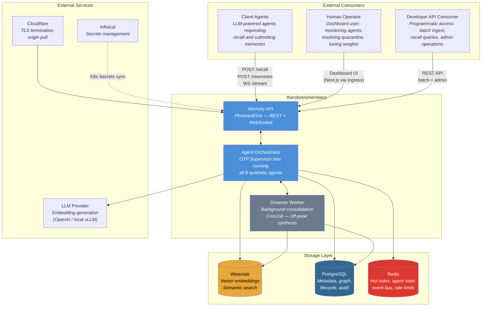
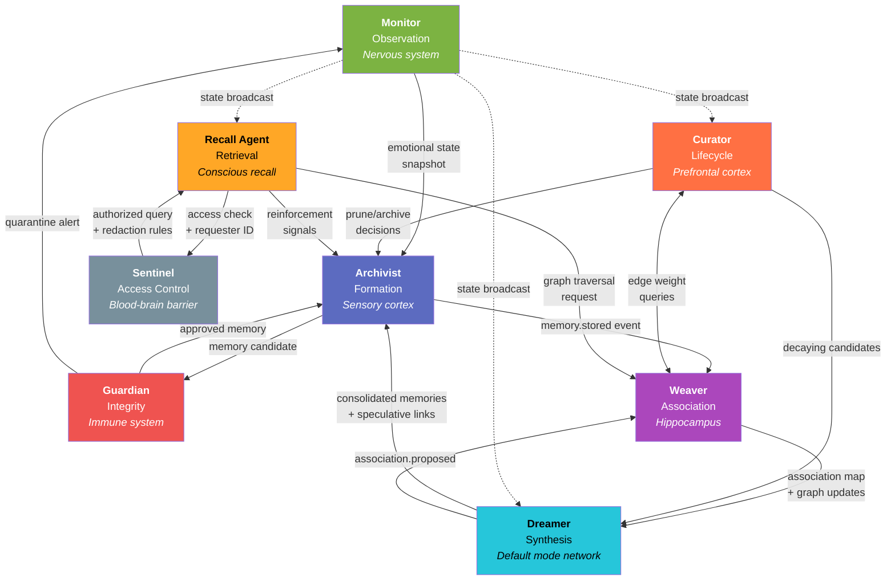
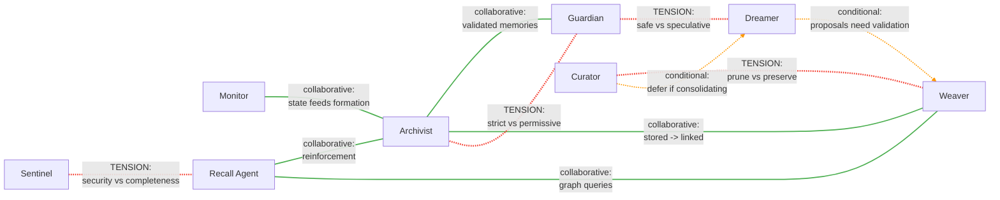

# System Overview Diagrams

Architectural views of The Robot Remembers — from external boundaries down to agent-level interaction patterns.

---

## 1. System Context Diagram

The memory service viewed from the outside: who talks to it, what they ask for, and what sits underneath.

**Key boundaries:**

- **Client agents** interact exclusively through the API layer — they never touch storage directly. They submit memories via REST and receive recall results either synchronously (active recall) or via WebSocket (tangential insertion stream).
- **The operator dashboard** is a Next.js frontend served through Cloudflare-proxied Ingress, hitting the same API with elevated admin permissions.
- **The Dreamer Worker** runs as a separate K8s CronJob to avoid competing with real-time agent processing for resources. It reads from and writes to the same storage layer.

---

## 2. Agent Ensemble Diagram

All eight agents and their communication topology. Arrows indicate the primary direction of data/event flow; labels describe what travels along each edge.

**Communication patterns:**

| Pattern | Agents | Description |
|---------|--------|-------------|
| **Formation pipeline** | Monitor -> Archivist -> Guardian -> Archivist -> Weaver | Linear flow for new memory ingestion |
| **Synthesis loop** | Curator -> Dreamer -> Archivist -> Weaver -> Dreamer | Cyclical: decay triggers consolidation, which creates new memories, which get re-associated |
| **Retrieval fan-out** | Recall Agent -> Sentinel + Weaver (parallel) | Recall checks access while simultaneously preparing graph traversal |
| **State broadcast** | Monitor -> all agents (pub/sub) | Monitor publishes emotional state changes; agents subscribe as needed |
| **Reinforcement feedback** | Recall Agent -> Archivist | Successful recall feeds back to strengthen memory weights |

---

## 3. Agent Tension Map

Not all agent relationships are cooperative. The system's intelligence emerges from productive friction between agents with competing priorities. Green edges are collaborative; red edges are adversarial (healthy tension); orange edges are conditional.

### Tension Details

| Tension | Agents | What They Disagree About | Resolution Mechanism |
|---------|--------|--------------------------|---------------------|
| **Prune vs Preserve** | Curator vs Weaver | Curator wants to prune low-weight memories to save storage. Weaver argues a memory with weak recall weight may still be structurally important (high-weight edges to active memories). | Curator checks edge weights before pruning. If any outgoing edge exceeds `structural_importance_threshold` (default 0.6), pruning is deferred. |
| **Safe vs Speculative** | Guardian vs Dreamer | Dreamer generates speculative associations and synthetic merged memories. Guardian flags these as potential contradictions or unvalidated data. | Dreamer marks all output with `speculative: true`. Guardian applies a relaxed validation pass for speculative content — schema compliance required, contradiction check uses a higher similarity threshold. |
| **Security vs Completeness** | Sentinel vs Recall Agent | Sentinel restricts cross-compartment access, which can cause the Recall Agent to miss relevant memories that exist in sealed compartments. | Sentinel provides "shadow hits" — a count of redacted results so the Recall Agent (and the user) knows memories exist but are inaccessible. The operator can then grant temporary access if warranted. |
| **Strict vs Permissive** | Guardian vs Archivist | Under high load, the Archivist wants to batch-store rapidly with minimal validation. The Guardian insists on full contradiction checking, which is slower. | Configurable `validation_mode`: `full` (default), `schema_only` (skip contradiction check under load), `deferred` (store now, validate async). The operator sets the mode based on trust level of the input source. |
