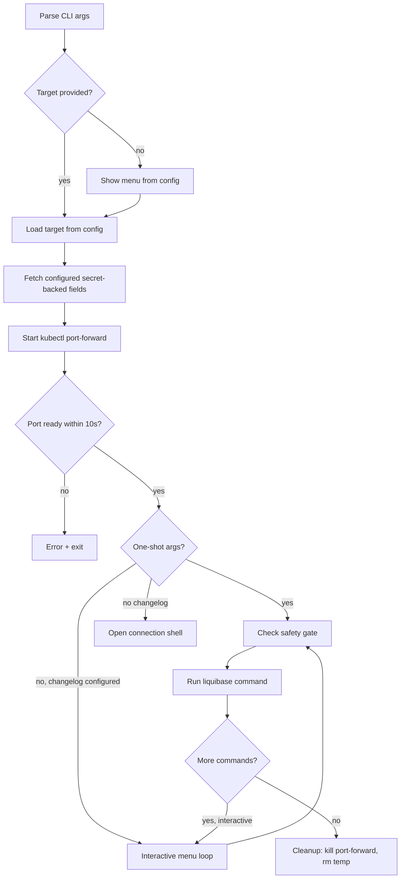

# liquibase-shell — Specification

## Overview

Interactive Liquibase shell that establishes `kubectl port-forward` to Kubernetes database services, fetches credentials from K8s secrets, and runs Liquibase commands against the forwarded connection.

## Usage

```
liquibase-shell [target] [--shell | -- liquibase-args...]
```

| Mode | Example | Behavior |
|------|---------|----------|
| Interactive | `liquibase-shell prod` | Opens menu with status/update/rollback/etc |
| One-shot | `liquibase-shell prod -- status` | Runs command, prints output, exits |
| Shell | `liquibase-shell prod --shell` | Opens a shell with the port-forward and connection env vars active |
| No target | `liquibase-shell` | Prompts for target selection |

## Config-Driven Targets

### Config source

The script loads targets from a YAML config file, allowing:

- New targets added without modifying the script
- Per-project override configs
- Team members can add custom targets (e.g. personal dev DBs)

### Config file resolution (first match wins)

1. `$LIQUIBASE_CONFIG` (env var, explicit path)
2. `./infra-config.yaml` (cwd)
3. `<repo-root>/infra-config.yaml`
4. `./.infra-config.yaml` / `<repo-root>/.infra-config.yaml`

Targets live under the `liquibase_targets` key in `infra-config.yaml`, alongside other infra topology config.

### Config format

```yaml
# in infra-config.yaml
liquibase_targets:
  prod:
    description: "Production PG (pgbouncer → EC2 primary)"
    namespace: gnp
    service: svc/gnp-pgbouncer
    remote_port: 6432
    local_port: 54320
    db_type: postgresql
    db_name: gnp-prod-db
    schema: dbgnp_gnp
    secret_name: gnp-pgbouncer-secrets
    secret_key: EC2_DB_PASSWORD
    username: gnp_migrate
    safety: destructive          # triggers confirmation for write ops
    changelog_dir: repos/gnp-backend/liquibase

  stage:
    description: "Stage PG (pgbouncer → stage replica)"
    namespace: gnp
    service: svc/stage-gnp-pgbouncer
    remote_port: 6432
    local_port: 54321
    db_type: postgresql
    db_name: stage-gnp-db
    schema: dbgnp_gnp
    secret_name: stage-gnp-pgbouncer-secrets
    secret_key: DB_PASSWORD
    username: gnp_migrate
    safety: normal
    changelog_dir: repos/gnp-backend/liquibase

  mysql:
    description: "Production MySQL"
    namespace: gnp
    service: svc/gnp-mysqldb
    remote_port: 3306
    local_port: 33060
    db_type: mysql
    db_name: gnp
    schema: gnp
    secret_name: gnp-mysqldb-secrets
    secret_key: MYSQL_PASSWORD
    username: gnp_admin
    safety: destructive
    changelog_dir: repos/gnp-backend/liquibase

  mysql-stage:
    description: "Stage MySQL"
    namespace: gnp
    service: svc/stage-gnp-mysqldb
    remote_port: 3306
    local_port: 33061
    db_type: mysql
    db_name: gnp
    schema: gnp
    secret_name: stage-gnp-mysqldb-secrets
    secret_key: MYSQL_PASSWORD
    username: gnp_admin
    safety: normal
    changelog_dir: repos/gnp-backend/liquibase

  replica:
    description: "Production PG read replica [read-only]"
    namespace: gnp
    service: svc/gnp-pgbouncer-readonly
    remote_port: 6432
    local_port: 54322
    db_type: postgresql
    db_name: gnp-prod-db
    schema: dbgnp_gnp
    secret_name: gnp-pgbouncer-secrets
    secret_key: EC2_DB_PASSWORD
    username: gnp_migrate
    safety: readonly             # blocks all write ops
    changelog_dir: repos/gnp-backend/liquibase

  shared-postgres:
    description: "Shared TimescaleDB instance"
    namespace: data-ns
    service: svc/shared-postgres
    remote_port: 5432
    local_port: 54322
    db_type: postgresql
    db_name: postgres
    schema: public
    secret_name: data-postgres-secrets
    secret_key: POSTGRES_PASSWORD
    username: postgres
    safety: destructive          # connection-only target; no changelog
```

### Field reference

| Field | Required | Description |
|-------|----------|-------------|
| `description` | yes | Shown in target selection menu |
| `namespace` | yes | K8s namespace for port-forward and secret fetch |
| `service` | yes | K8s service (e.g. `svc/gnp-pgbouncer`) |
| `remote_port` | yes | Service port to forward |
| `local_port` | yes | Local port to bind (must be unique across active targets) |
| `db_type` | yes | `postgresql` or `mysql` — determines JDBC URL format |
| `db_name` | yes* | Database name in JDBC URL. Required unless `db_name_key` is set |
| `db_name_key` | no | Key within a Secret to extract the database name |
| `db_name_key_fallbacks` | no | Ordered fallback database-name keys to try if `db_name_key` is absent |
| `db_name_secret_name` | no | Secret for `db_name_key`. Defaults to `secret_name` |
| `db_name_secret_namespace` | no | Namespace for `db_name_secret_name`. Defaults to `secret_namespace` |
| `schema` | yes | Default schema (used for `defaultSchemaName` and `currentSchema`) |
| `secret_name` | yes | K8s Secret name containing the password |
| `secret_namespace` | no | Namespace for `secret_name`. Defaults to `namespace` |
| `secret_key` | yes | Key within the Secret to extract |
| `secret_key_fallbacks` | no | Ordered fallback password keys to try if `secret_key` is absent |
| `username` | yes* | Database username. Required unless `username_key` is set |
| `username_key` | no | Key within a Secret to extract the database username |
| `username_key_fallbacks` | no | Ordered fallback username keys to try if `username_key` is absent |
| `username_secret_name` | no | Secret for `username_key`. Defaults to `secret_name` |
| `username_secret_namespace` | no | Namespace for `username_secret_name`. Defaults to `secret_namespace` |
| `safety` | yes | `destructive` / `normal` / `readonly` — controls confirmation gates |
| `changelog_dir` | no | Path to changelog directory, relative to the config file |
| `changelog_file` | no | Changelog file relative to `changelog_dir`. Defaults to `changelog-master.yaml` only when `changelog_dir` is set |

`username` and `username_key` are mutually substitutable: set one literal
username, or let the shell read it from a Kubernetes Secret.

`db_name` and `db_name_key` follow the same pattern. Targets without a
configured changelog are connection-only: `liquibase-shell <target>` opens
`--shell`, while one-shot Liquibase commands must pass a
`--changelog-file`/`--changeLogFile` argument.

### Safety levels

| Level | Behavior |
|-------|----------|
| `destructive` | Confirms before: `update`, `rollback`, `rollback-count`, `drop-all`, `clear-checksums` |
| `normal` | No extra confirmation |
| `readonly` | Blocks all write operations with an error message. Allowed: `status`, `diff`, `validate`, `history`, `update-sql`, `rollback-count-sql` |

## Lifecycle



## Installation

The Makefile should be updated to install `liquibase-shell` alongside `tsdb-snapshot`:

```makefile
install:
	@mkdir -p $(INSTALL_DIR)
	@install -m 755 bin/liquibase-shell "$(INSTALL_DIR)/liquibase-shell"
	@install -m 755 bin/liquibase-update "$(INSTALL_DIR)/liquibase-update"
	@install -m 755 bin/tsdb-snapshot "$(INSTALL_DIR)/tsdb-snapshot"
```

## Dependencies

- `kubectl` — port-forward and secret access
- `liquibase` — the actual migration tool (must be in PATH)
- `yq` — YAML config parsing (already available in this project)
- `nc` (netcat) — port readiness check
- `base64` — secret decoding

## Config parsing implementation note

Use `yq` to extract target fields from YAML. Example:

```bash
# List available targets
yq -r '(.liquibase_targets // {}) | keys[]' "$CONFIG_FILE"

# Get a field for a target
yq -r ".liquibase_targets.$TARGET.namespace" "$CONFIG_FILE"
```

This avoids adding a Python/Ruby dependency and stays consistent with the project's existing `yq` usage.
