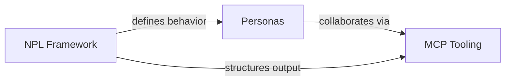

# Domain Model

**Type**: Architecture Documentation
**Category**: PROJECT-ARCH
**Status**: Core

## Purpose

The Domain Model defines the entity structure and bounded contexts for NoizuPromptLingo, establishing three primary contexts: **NPL Framework** (prompt syntax and patterns), **MCP Tooling** (artifact management and collaboration), and **Personas** (AI identity management). This model serves as the architectural foundation enabling structured prompt engineering, multi-agent collaboration, and persistent identity management across sessions.

## Key Capabilities

- **Context Segregation**: Three distinct bounded contexts with clear responsibilities and ubiquitous language
- **Entity Modeling**: Complete aggregate roots, entities, and value objects with invariants and relationships
- **Event-Driven Design**: Domain events for each context enabling reactive workflows and audit trails
- **Cross-Context Integration**: Defined relationships showing how NPL Framework drives Persona behavior, which collaborates via MCP Tooling
- **File-System Mapping**: Direct correspondence between domain entities and persistent file structures
- **Business Rules Enforcement**: Explicit precedence chains, validation rules, and state transition constraints

## Usage & Integration

- **Triggered by**: Architectural planning, system design discussions, entity modeling requirements
- **Outputs to**: Implementation specifications, database schemas, API designs, agent behavior definitions
- **Complements**: PROJECT-ARCH documents, system design documentation, MCP server implementation

The model provides the semantic foundation for:
- NPL syntax processing and agent behavior
- Artifact versioning and review workflows
- Persona state management and team dynamics
- Cross-context communication patterns

## Core Operations

### Context Map Visualization

The three bounded contexts interact through defined integration points:

### Entity Relationships

Each context defines:
- **Aggregate Roots**: Primary entities with identity and lifecycle (e.g., Agent, Artifact, Persona)
- **Entities**: Objects with identity within aggregates (e.g., Directive, Revision, Journal)
- **Value Objects**: Immutable data structures (e.g., SyntaxElement, OceanScores, VoiceSignature)

### Domain Events

All three contexts emit events enabling:
- Audit logging and traceability
- Reactive workflows across contexts
- State synchronization between agents
- Notification triggering

## Configuration & Parameters

### NPL Framework Context

| Entity Type | Primary Entities | Key Attributes |
|-------------|------------------|----------------|
| Aggregate Root | Agent | name, type, version, capabilities, constraints |
| Entities | Directive, Prefix, Pump, Fence, SpecialSection | emoji_prefix, type, purpose, processing |
| Value Objects | SyntaxElement, Template | formatting conventions, reusable patterns |

**Invariants**:
- Agent names unique within scope
- Directive types must match defined categories
- Pumps follow XHTML tag structure
- Special sections enforce precedence hierarchy

### MCP Tooling Context

| Entity Type | Primary Entities | Key Attributes |
|-------------|------------------|----------------|
| Aggregate Roots | Artifact, Review, ChatRoom | id, name, created_at, current_revision_id |
| Entities | Revision, InlineComment, ChatEvent, Notification | sequential numbering, timestamps, relationships |
| Value Objects | ReviewOverlay, RoomMember | file paths, composite keys |

**Invariants**:
- Artifact names globally unique
- Revisions sequential starting from 0
- Review status transitions: in_progress → completed only
- ChatEvents must reference existing parent events

### Personas Context

| Entity Type | Primary Entities | Key Attributes |
|-------------|------------------|----------------|
| Aggregate Roots | Persona, Team | id (slug), scope, file_paths, mandatory files |
| Entities | Journal, TaskList, KnowledgeBase, Relationship | chronological entries, active items, connections |
| Value Objects | VoiceSignature, ExpertiseGraph, OceanScores | communication patterns, domain competencies, personality |

**Invariants**:
- All 4 mandatory persona files required
- Voice signature consistent across interactions
- Hierarchical loading: project > user > system
- Auto-archiving at thresholds (journal: 100KB, tasks: 90 days)

## Integration Points

### NPL Framework → Personas
- Agent declarations establish Persona behaviors
- Pumps (`npl-cot`, `npl-reflection`) guide reasoning
- Directives format output
- Prefixes activate response modes
- VoiceSignature uses NPL syntax elements

### Personas → MCP Tooling
- Personas create and version Artifacts
- Personas conduct Reviews with InlineComments
- Multi-persona collaboration via ChatRooms
- @mentions generate Notifications
- Team workflows distribute Artifacts
- Task tracking via TodoCreate events

### NPL Framework → MCP Tooling
- Fences structure Artifact content
- Templates format Review output
- Directives organize Artifact formatting

## Limitations & Constraints

- **File System Dependency**: Personas require file-backed state; in-memory-only environments not supported
- **Sequential Revisions**: Artifact revision numbers must increment sequentially; cannot skip versions
- **Single Status Transition**: Reviews cannot be reopened once completed
- **Scope Hierarchy**: Personas cannot override system-level definitions at project level
- **Event Ordering**: Domain events emitted synchronously; async processing requires external queue
- **Relationship Symmetry**: Persona relationships stored in shared graph; bidirectional updates required

## Success Indicators

- ✓ All three contexts have clear bounded language with no terminology overlap
- ✓ Entity invariants enforced at domain layer (not just database constraints)
- ✓ Domain events emitted for all state transitions enabling audit trails
- ✓ Cross-context relationships explicitly documented with integration patterns
- ✓ File system structure directly maps to domain entities
- ✓ Business rules codified in precedence chains and validation logic
- ✓ Value objects remain immutable; entities maintain identity across operations

---
**Generated from**: worktrees/main/docs/PROJECT-ARCH/domain.md
