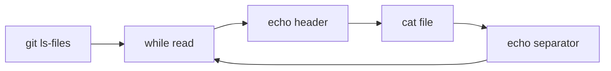

# dump-files - Detailed Reference

A Git-aware utility for concatenating file contents with formatted headers.

## Synopsis

```bash
dump-files <target-folder>
```

## Description

`dump-files` outputs the contents of all Git-visible files under a target directory. Each file is wrapped with a header showing its path and separators for parsing.

**Git-visible** means:
- Tracked files (committed or staged)
- Untracked files not excluded by `.gitignore`

## Arguments

| Argument | Required | Description |
|:---------|:---------|:------------|
| `<target-folder>` | Yes | Directory path to dump. Relative or absolute. |

## Output Format

```
# path/to/file.ext
---
[file contents exactly as stored]

* * *
```

Each file block contains:
1. **Header**: `# ` prefix + relative file path
2. **Separator**: `---` on its own line
3. **Contents**: Raw file contents via `cat`
4. **Footer**: `* * *` block separator

### Format Example

For a directory with two files:

```
# src/main.py
---
print("hello")

* * *

# src/utils.py
---
def helper():
    pass

* * *
```

## Implementation Details

### Core Command

```bash
git -c core.quotepath=false ls-files --cached --others --exclude-standard "$TARGET"
```

| Flag | Purpose |
|:-----|:--------|
| `-c core.quotepath=false` | Preserve UTF-8 filenames without escaping |
| `--cached` | Include tracked files |
| `--others` | Include untracked files |
| `--exclude-standard` | Respect `.gitignore`, `.git/info/exclude`, global excludes |

### Pipeline



### Shell Options

```bash
set -euo pipefail
```

- `-e`: Exit on command failure
- `-u`: Error on undefined variables
- `-o pipefail`: Propagate pipe failures

## Requirements

- Must execute inside a Git repository (`.git` directory accessible)
- `git` command available in PATH
- Read permissions on target files

## Exit Codes

| Code | Condition |
|:-----|:----------|
| 0 | Success |
| 1 | Missing target folder argument |
| 128 | Not a Git repository |
| Non-zero | File read or Git command failure |

## Edge Cases

### Binary Files

Binary files are output as-is via `cat`. Terminal may display garbage characters. Filter with `file` command or grep for text:

```bash
dump-files src/ | grep -v "Binary file"
```

### Empty Directories

Git does not track empty directories. `dump-files` outputs nothing for empty directories.

### Symlinks

Symlinks are dereferenced by `cat`. Contents of the target file are output.

### UTF-8 Filenames

The `-c core.quotepath=false` flag ensures non-ASCII filenames display correctly:

```
# docs/ドキュメント.md
---
...
```

### Large Files

No size limit. Large files may cause memory issues if piping to programs that buffer entire input. Consider:

```bash
dump-files large-dir/ > output.txt
```

### Files with Special Characters

Files with spaces, newlines in names, or other special characters work correctly due to the `read -r` line-by-line processing.

## Limitations

1. **No glob filtering**: Cannot filter by file extension or pattern
2. **No depth limit**: Always recursive to full depth
3. **No exclusion patterns**: Beyond `.gitignore`, cannot exclude specific files
4. **No output format options**: Fixed header/separator format
5. **Git-only**: Does not work outside Git repositories

### Workaround: Glob Filtering

Use `grep` to filter the output:

```bash
dump-files src/ | grep -A 9999 "^# .*\.py$" | grep -B 1 -A 9999 "^\* \* \*$"
```

Or filter at the Git level (requires modifying the script):

```bash
git ls-files --cached --others --exclude-standard "*.py"
```

## Integration Patterns

### AI Context Loading

Combine with clipboard for AI assistant context:

```bash
dump-files src/feature/ | pbcopy
```

### Code Review

Dump a feature branch's modified files:

```bash
git diff --name-only main | xargs -I{} dump-files {}
```

### Documentation Generation

Concatenate source with docs:

```bash
{
  dump-files src/
  dump-files docs/
} > context.txt
```

### Pipe to Processing

Parse structured output:

```bash
dump-files src/ | awk '
  /^# / { file = $2 }
  /^---$/ { reading = 1; next }
  /^\* \* \*$/ { reading = 0 }
  reading { print file ":" NR ": " $0 }
'
```

## Comparison with Alternatives

| Tool | Git-aware | Headers | Recursive |
|:-----|:----------|:--------|:----------|
| `dump-files` | Yes | Yes | Yes |
| `cat *` | No | No | No |
| `find -exec cat` | No | No | Yes |
| `tar -cvf` | No | Yes (archive) | Yes |

## See Also

- [git-tree](./git-tree.md) - Display directory structure
- [git-tree-depth](./git-tree-depth.md) - Show tree with depth levels
- `git ls-files` - Underlying Git command
