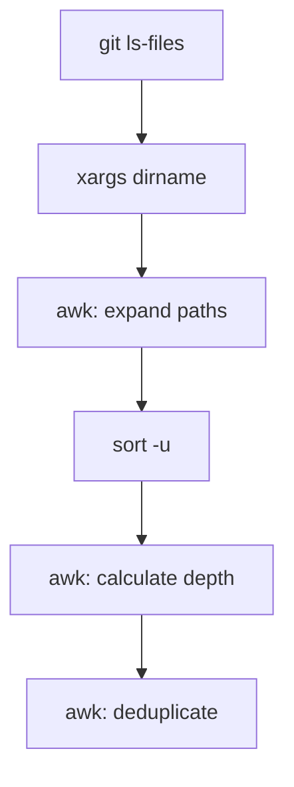

# git-tree-depth

Directory depth analyzer for Git repositories with `.gitignore` awareness.

## Synopsis

```bash
git-tree-depth <target-folder>
```

## Description

Lists all directories under a target folder, outputting each directory's relative path and nesting depth. Respects `.gitignore` rules by using `git ls-files` to enumerate tracked and untracked (but not ignored) files.

## Arguments

| Argument | Required | Description |
|:---------|:---------|:------------|
| `<target-folder>` | Yes | Directory to analyze. Use `.` for repository root. |

## Output Format

```
<relative-path> <depth>
```

- `relative-path`: Path relative to target folder
- `depth`: Integer nesting level (0 = target directory itself)

### Example Output

```
. 0
core 1
core/agents 2
core/scripts 2
docs 1
docs/scripts 2
```

## Exit Codes

| Code | Condition |
|:-----|:----------|
| 0 | Success |
| 1 | Missing argument or not in Git repository |

## Implementation Details

### Processing Pipeline



1. **File enumeration**: `git ls-files --cached --others --exclude-standard` retrieves tracked files plus untracked files not in `.gitignore`
2. **Directory extraction**: `xargs dirname` converts file paths to directory paths
3. **Path expansion**: First `awk` block generates all parent directories (e.g., `a/b/c` produces `a`, `a/b`, `a/b/c`)
4. **Deduplication**: `sort -u` removes duplicate paths
5. **Depth calculation**: Second `awk` block computes depth relative to target
6. **Final dedup**: Third `awk` removes any remaining duplicates from edge cases

### Key Script Behaviors

**Working directory**: Script changes to repository root (`git rev-parse --show-toplevel`) before processing.

**Path normalization**:
- Leading `./` stripped from target
- Trailing `/` stripped from target
- Handles both absolute and relative paths

**File matching**: Uses `--cached --others --exclude-standard` flags:
- `--cached`: Files in index (tracked)
- `--others`: Untracked files
- `--exclude-standard`: Applies `.gitignore`, `.git/info/exclude`, global excludes

### Depth Calculation Logic

```
Target: deployments/impact-simulation

Directory                              | Relative Path | Depth
---------------------------------------|---------------|------
deployments/impact-simulation          | .             | 0
deployments/impact-simulation/config   | config        | 1
deployments/impact-simulation/config/k8s | config/k8s  | 2
```

## Edge Cases and Limitations

### Empty Directories

Git does not track empty directories. If a directory contains no files (tracked or untracked), it will not appear in output.

### Symlinks

Symbolic links to directories are not followed. The symlink itself appears as a file in `git ls-files` output, not as a directory.

### Unicode Paths

Script uses `core.quotepath=false` to handle non-ASCII filenames without escaping.

### Large Repositories

Performance scales with file count. For repositories with 100k+ files, consider filtering the target to a subdirectory.

### Paths with Spaces

Handled correctly via quoted arguments in `xargs -I{}`.

### Target Not in Repository

If target directory does not exist or contains no Git-visible files, output will be empty.

## Integration Patterns

### Filter by Depth

Process only directories at specific depth:

```bash
git-tree-depth src | awk '$2 == 2 { print $1 }'
```

### Sort by Depth (deepest first)

```bash
git-tree-depth . | sort -t' ' -k2 -rn
```

### Generate Tree Structure

```bash
git-tree-depth . | while read -r dir depth; do
  printf "%*s%s\n" "$((depth * 2))" "" "$dir"
done
```

### Find Maximum Depth

```bash
git-tree-depth . | awk '{ if ($2 > max) max=$2 } END { print max }'
```

### Combine with Other Tools

```bash
# Process each directory with another script
git-tree-depth src | while read -r dir depth; do
  echo "Processing $dir at depth $depth"
  # your-script "$dir"
done
```

### Use in Makefiles

```makefile
DIRS := $(shell git-tree-depth src | cut -d' ' -f1)

process-all:
	@for dir in $(DIRS); do \
		echo "Processing $$dir"; \
	done
```

## Requirements

- Git repository (must be inside working tree)
- Standard Unix tools: `awk`, `sort`, `dirname`, `xargs`
- Bash 4+ (uses `set -euo pipefail`)

## Comparison with Related Tools

| Tool | Purpose | `.gitignore` Aware |
|:-----|:--------|:-------------------|
| `git-tree-depth` | List dirs with depth | Yes |
| `git-tree` | Display tree structure | Yes |
| `tree -d` | Display tree structure | No |
| `find -type d` | List directories | No |

## See Also

- [git-tree](./git-tree.md) - Display directory tree
- [dump-files](./dump-files.md) - Dump file contents
