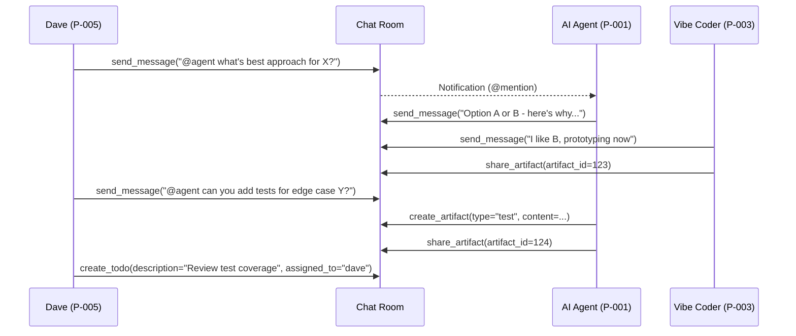

# User Story: Pair Program via Chat Room

**ID**: US-036
**Persona**: P-005 (Dave the Fellow Developer)
**Collaborators**: P-003 (Vibe Coder), P-001 (AI Agent)
**Priority**: Medium
**Status**: Draft
**Created**: 2026-02-02T10:20:00Z

## Story

As a **fellow developer**,
I want to **collaborate with vibe coders and agents in real-time via chat**,
So that **we can iterate quickly on designs and implementations together**.

## Acceptance Criteria

- [ ] **Multi-party chat**: Chat room supports 2+ participants (any mix of humans and agents)
- [ ] **Code snippet sharing**: Messages support markdown code blocks with syntax highlighting (via `send_message`)
- [ ] **Agent mentions**: Can @mention agents by persona ID to include them in conversation context
- [ ] **Inline artifact preview**: Shared artifacts (via `share_artifact`) display inline in chat feed with metadata
- [ ] **Context persistence**: Agent participants retain conversation history when responding to subsequent messages
- [ ] **Quick todo creation**: Can spawn todos from discussion using `create_todo` without leaving chat context
- [ ] **Real-time collaboration**: Multiple participants can send messages concurrently without message loss
- [ ] **Artifact versioning awareness**: When code is discussed and updated, new artifact revisions link back to chat discussion
- [ ] **Message threading**: Can reference previous messages for context (via event_id from `send_message`)
- [ ] **Notification support**: @mentioned participants receive notifications (if US-022 implemented)

## Technical Details

**Primary MCP Tools**:
- `send_message` (Chat Tools) - Main communication mechanism
- `share_artifact` (Chat Tools) - Share code/designs for discussion
- `create_todo` (Chat Tools) - Capture action items from discussion
- `get_chat_feed` (Chat Tools) - View conversation history and context
- `create_artifact` (Artifact Tools) - Create new code/design versions during pairing
- `update_artifact_revision` (Artifact Tools) - Iterate on shared work

**Workflow Pattern**:


## Notes

- **Key synergy point** between P-003 (Vibe Coder) and P-005 (Dave) for rapid iteration
- **Agent participation patterns**: Agents respond when @mentioned or when their expertise is relevant to discussion
- **Async vs. sync modes**: Chat supports both real-time pairing (immediate responses) and async collaboration (messages persist for later review)
- **Context window management**: Long conversations may require agents to periodically summarize key decisions to maintain context
- **Artifact lineage**: Artifacts created during chat pairing should reference the room_id in metadata for traceability

## Example Pairing Session

**Scenario**: Dave and Vibe Coder discuss authentication implementation with AI Agent assistance.

```json
// 1. Dave initiates discussion
send_message(room_id=15, persona="dave", content="@vibe-coder here's the component structure I'm thinking:\n```python\nclass AuthService:\n    def validate(self, token: str) -> bool:\n        ...\n```")

// 2. Vibe Coder responds with concern
send_message(room_id=15, persona="vibe-coder", content="looks good, but what about edge case when token is expired but signature is valid?")

// 3. Dave pulls in AI Agent
send_message(room_id=15, persona="dave", content="@ai-agent can you draft a test for that edge case?")

// 4. AI Agent creates test artifact
create_artifact(name="auth_edge_case_tests.py", type="code", content="...", created_by="ai-agent")
// Returns: {"artifact_id": 124}

// 5. AI Agent shares in chat
share_artifact(room_id=15, artifact_id=124, persona="ai-agent")

// 6. Vibe Coder iterates
send_message(room_id=15, persona="vibe-coder", content="nice! I'll add the implementation now")

// 7. Create todo for follow-up
create_todo(room_id=15, persona="dave", description="Review test coverage with product team", assigned_to="dave")
```

## Dependencies

- **US-007**: Create Chat Room for Collaboration - Room must exist before pairing can begin
- **US-006**: Send Message to Chat Room - Core communication mechanism
- **US-004**: Share Artifact in Chat Room - Share code/designs for discussion
- **US-008**: Create Versioned Artifact - Create new work during pairing session
- **US-028**: Create Todo from Chat - Capture action items during discussion

## Prerequisites

**Required Knowledge**:
- Persona identifiers for all participants (from `docs/personas/index.yaml`)
- Room ID of the chat room (from `create_chat_room` or session dashboard)
- Artifact IDs for any existing work to discuss

**System Requirements**:
- MCP server running with Chat Tools enabled
- Database initialized with chat_rooms and chat_events tables
- At least 2 participants (any combination of humans and agents)

## Implementation Notes

**Agent Context Management**:
- Agents receive full chat history when @mentioned or when joining a room
- For rooms with 50+ messages, consider providing a summary artifact to reduce context load
- Agents should reference previous messages by event_id when responding to specific points

**Message Formatting**:
- Markdown rendering happens client-side for performance
- Code blocks support language-specific syntax highlighting (```python, ```javascript, etc.)
- Inline code uses single backticks: `variable_name`
- @mentions use format: `@persona-id` (e.g., `@ai-agent`, `@dave`, `@vibe-coder`)

**Future Enhancements**:
- Message threading/replies (nest responses under original message)
- Presence indicators (show who is currently active in the room)
- Typing indicators for real-time feedback
- Voice/video integration for hybrid pairing sessions
- Screen sharing integration with screenshot tools (US-012, US-013)

## Open Questions

- [ ] **Agent latency handling**: Should chat UI show "Agent is typing..." indicator during LLM response generation?
- [ ] **Auto-summarization**: Should agents automatically summarize when conversation exceeds 50 messages, or only when explicitly requested?
- [ ] **Code review integration**: Should inline code blocks support hover-to-review similar to artifact comments (US-010)?
- [ ] **Session recording**: Should pair programming sessions be exportable as markdown transcripts for documentation?

## Related Commands

- `send_message` (Chat Tools) - Primary command for real-time communication
- `create_chat_room` (Chat Tools) - Set up pairing session space
- `share_artifact` (Chat Tools) - Share work in progress
- `create_todo` (Chat Tools) - Capture action items
- `get_chat_feed` (Chat Tools) - Review conversation history
- `create_artifact` (Artifact Tools) - Create new code/designs during session
- `update_artifact_revision` (Artifact Tools) - Iterate on shared work
