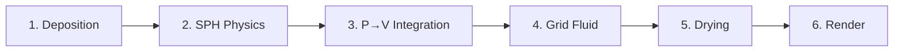

# Voxel Architecture — Summary

> Condensed from `voxel-architecture.md` (~1137 lines). Read the full doc for SPH/LBM/MPM research, code examples, and medium-specific implementation details.

## Architecture Decision: MPM-Inspired Layered Volume

**Not pure particles, not pure grid.** Particle-in-cell layers: Eulerian grid layers for structure/storage, Lagrangian SPH particles for fluid dynamics. Adapted from VFX-proven Material Point Method for 2D paint simulation.

### Why This Hybrid

| Grid (Eulerian) | Particles (Lagrangian) |
|-----------------|----------------------|
| Efficient GPU memory layout | Natural smudge behavior |
| Layer ordering constraints | Realistic fluid flow |
| Straightforward rendering | Variable detail density |
| Undo/redo via snapshots | Pigment mass conservation |

## Core Data Structures

### VolumeLayer (32 bytes, FP16)

```
uint8_t  substance_type, flags     // 2 bytes
half4    color_rgbo                // 8 bytes (absorption RGBA, not reflectance)
half     depth, wetness, viscosity // 6 bytes
half     hardness, velocity_x/y   // 6 bytes
half     surface_tension, age      // 4 bytes
half     gloss                     // 2 bytes
half2    _padding                  // 4 bytes → 32 total
```

8 layers per pixel → 256 bytes + 16 byte header = 272 bytes/pixel.

### SPHParticle (48 bytes)

```
float2  position, velocity        // 16 bytes
half4   color_rgba                // 8 bytes
half    radius, mass              // 4 bytes
half    local_density, rest_density // 4 bytes
half    viscosity, smoothing_length // 4 bytes
half    wetness, life             // 4 bytes
uint8_t layer_index, flags        // 2 bytes
uint16_t _padding                 // 2 bytes → 48 total
```

### Canvas Material Properties Texture

`rgba16Float` at canvas resolution. R=absorbency, G=roughness, B=porosity, A=sizing. Procedurally generated (canvas weave pattern). Affects deposition, flow, drying, and adhesion.

## Simulation Pipeline



### Phase Details

1. **Deposition** — Catmull-Rom interpolated strokes → GPU deposit + SPH particle generation. Cross-media rejection (watercolor can't adhere to dried oil/acrylic).

2. **SPH Physics** — Spatial hash neighbor search (2D, per-layer). Pressure gradient (Tait's equation), viscosity, surface tension forces. Semi-Lagrangian advection.

3. **Particle → Volume Integration** — SPH kernels splat particle contributions back to continuous field (dispatch per particle, not per pixel).

4. **Grid Fluid Dynamics** — Semi-Lagrangian advection, Jacobi iteration for implicit diffusion, surface tension via edge detection, mass conservation enforcement. Double-buffered ping-pong textures for flow/diffusion steps.

5. **Drying Kinetics** — Medium-specific rates (acrylic 8x, pastel 10x, oil 0.5x base). Canvas absorbency modulates rate. Edge darkening at wet/dry boundaries (pigment migration). Particles retire when dry.

6. **Rendering** — Layer-stack compositing (not raymarching). Back-to-front over-operator. Normal maps from depth gradient (central differences) for impasto. Per-medium specular. Absorption color model (Beer-Lambert). Reinhard tone mapping + gamma.

## Design Tradeoff: Struct Buffer vs Texture-Per-Datatype

KopiGajj uses separate textures per property. We use `VolumeLayer` struct buffers. Struct buffer = simpler management, one allocation. Texture-per-datatype = better GPU cache locality for single-property kernels. Pragmatic choice: struct for multi-layer architecture. Extract hot fields to separate textures if profiling demands it.

## Shader Source

All MSL as Swift string literals (kopigajj pattern). SPM can't build `.metal`. Runtime compilation via `MetalShaderCompiler` protocol. Modular split: `ShaderHeader.swift` (shared structs) + 6 per-kernel files. `MetalShaderCompilationTests` catch MSL errors at test time.

## Memory (1080p)

| Component | Size |
|-----------|------|
| Volume layers (8 × 32B) | ~563 MB |
| SPH particles (~500K) | ~24 MB |
| Spatial hash | ~3 MB |
| Render targets | ~34 MB |
| **Total** | **~630 MB** |

4K estimate: ~2.5 GB.

## Next Steps

1. Basic volume layer storage (1 layer, watercolor)
2. SPH particle system (spatial hash, neighbor search)
3. Brush deposition pipeline
4. Basic fluid solver (advection + diffusion)
5. Layer-stack compositor (impasto lighting)
6. Threadgroup memory optimization
7. Medium-specific physics (oil, charcoal, acrylic)
8. SwiftUI UI integration
9. Performance optimization (adaptive resolution, LOD)
10. Advanced features (drying, cross-media, canvas properties)
