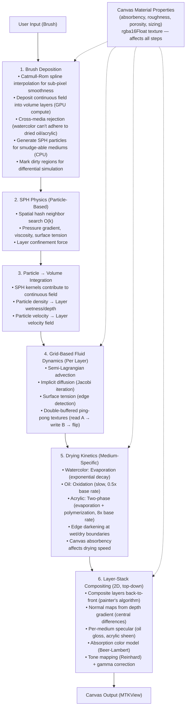
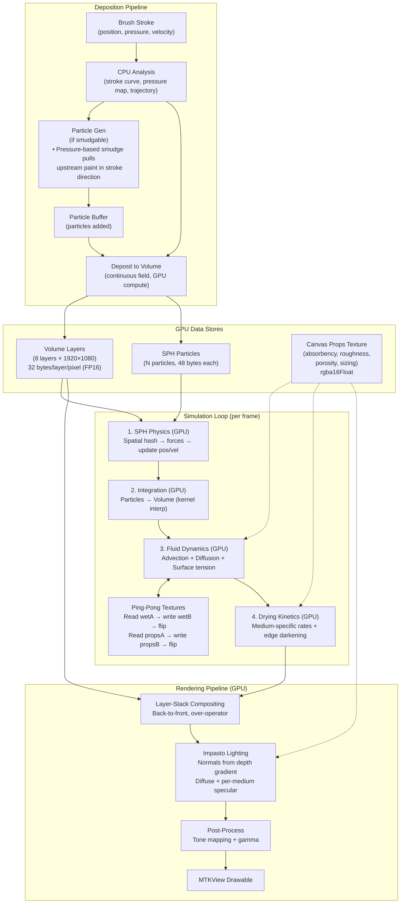

# Voxel Architecture: Quick Reference Diagrams

## KopiGajj Migration Notes

Quick hits from proven implementation. Fix these during compact:

- **SPH particle size is 48 bytes** (not 88 bytes as shown in memory layout). Corrected in voxel-architecture.md but this diagram still shows `1M × 88 bytes = ~88 MB`. Should be `1M × 48 bytes = ~48 MB`. Fix.
- **Volume layer memory** — diagram shows `1920×1080 × 32 bytes = ~67 MB per layer, ~536 MB total`. This assumes one buffer for all layers. KopiGajj uses separate textures per data type (wetAbsorb, solidAbsorb, props, height, canvasProps). Consider same approach for better GPU cache locality.
- **Rendering pipeline says "raymarching"** — still references `Raymarching (Volume Stack)` and `Trace rays through volume stack`. Our architecture doc corrected this to layer-stack compositing with normal-mapped impasto lighting. This diagram needs the same fix.
- **Threadgroup 16×16** — matches kopigajj. Keep.
- **Adaptive resolution** — kopigajj doesn't implement this (fixed 1024×1024). Good idea for us but defer to Phase 6.
- **Shader source split** — kopigajj splits into header (shared structs) + per-kernel files. Our diagram implies monolithic pipeline but implementation should follow kopigajj's modular approach.
- **Catmull-Rom interpolation** — kopigajj interpolates mouse input with 4-point Catmull-Rom splines for sub-pixel stroke smoothness. Should add to deposition pipeline description.
- **Missing: ping-pong buffers** — diagram doesn't show double-buffered textures. KopiGajj's pattern: simulation steps read from A, write to B, flip. Our flow/diffusion steps need this.
- **Missing: canvas material properties** — kopigajj has `canvasPropsTex` (absorbency, roughness, porosity) that affects every simulation step. Not represented here. Should add to data flow.
- **Missing: smudge mechanics** — kopigajj's brushStroke kernel has pressure-based smudge that pulls upstream paint in stroke direction. Our SPH approach handles this differently but the concept is important.
- **SPH kernel formulas are correct** — cubic spline, Wendland C², density/pressure/force equations all match standard SPH literature. Keep as-is.

---

## Hybrid Architecture Overview



---

## Data Flow Diagram


      │                          │
      v                          v
┌──────────────────┐     ┌────────────────┐
---

## Memory Layout

```
GPU Memory Map (Approximate for 1920×1080 Canvas)

┌────────────────────────────────────────────────────────┐
│  Volume Layer Storage (Primary Data)                   │
├────────────────────────────────────────────────────────┤
│  Layer 0 (Watercolor)   ──┐                           │
│  Layer 1 (Watercolor)   ──┤                           │
│  Layer 2 (Oil)          ──┤ 1920×1080 × 32 bytes    │
│  Layer 3 (Oil)          ──┤ = ~67 MB per layer       │
│  Layer 4 (Acrylic)      ──┤                           │
│  Layer 5 (Acrylic)      ──┤                           │
│  Layer 6 (Charcoal)     ──┘                           │
│  Layer 7 (Charcoal)                                  │
│  Total: ~536 MB                                         │
├────────────────────────────────────────────────────────┤
│  Canvas Material Properties                             │
│  canvasPropsTex (RGBA16F): 1920×1080×8 = ~17 MB       │
│  (absorbency, roughness, porosity, sizing)              │
└────────────────────────────────────────────────────────┘
│  SPH Particle Storage                                   │
├────────────────────────────────────────────────────────┤
│  Particles array (1M particles)                         │
│  1M × 48 bytes = ~48 MB                                │
├────────────────────────────────────────────────────────┤
│  Spatial Hash Table                                      │
│  Cell storage: 100K cells × 32 bytes = ~3.2 MB        │
│  Particle indices: 1M × 4 bytes = ~4 MB                │
│  Total: ~7 MB                                            │
└────────────────────────────────────────────────────────┘
│  Render Targets (Double Buffering)                      │
├────────────────────────────────────────────────────────┤
│  Color Buffer A (RGBA16F): 1920×1080×8 = ~17 MB       │
│  Color Buffer B (RGBA16F): 1920×1080×8 = ~17 MB       │
│  Normal Texture (RGB16F): 1920×1080×6 = ~13 MB        │
│  Depth Texture (R16F):      1920×1080×2 = ~4 MB       │
│  Total: ~51 MB                                            │
└────────────────────────────────────────────────────────┘
│  Simulation Ping-Pong Buffers (Flow/Diffusion)          │
├────────────────────────────────────────────────────────┤
│  Read/Write texture pairs for flow + diffusion steps    │
│  Wet A + Wet B (RGBA16F): 2 × ~17 MB = ~34 MB         │
│  Props A + Props B (RGBA16F): 2 × ~17 MB = ~34 MB     │
│  Total: ~68 MB                                            │
└────────────────────────────────────────────────────────┘
│  Working Buffers                                         │
├────────────────────────────────────────────────────────┤
│  Compute Scratch:                            ~32 MB     │
│  Staging Buffers:                            ~16 MB     │
│  Total: ~48 MB                                            │
└────────────────────────────────────────────────────────┘

GRAND TOTAL: ~775 MB (comfortable on 8GB+ GPU)
```

---

## SPH Kernel Functions

```
Smoothing Length (h): Interaction radius
┌────────────────────────────────────────────────────────┐
│                  r = |x_i - x_j|                      │
│                                                           │
│                ┌───●───┐                               │
│                │   │   │                               │
│                │   x_i  │  Kernel W(r, h)              │
│                │       │  non-zero only when r < h      │
│                └───●───┘                               │
│                    x_j                                 │
│                                                           │
│  Common Kernels:                                         │
│  • Gaussian:        exp(-(r/h)²)                        │
│  • Cubic Spline:    2/3 - q² + q³/2  (for q < 1)       │
│  • Wendland C²:     (1-q)⁴(4q+1)  (compact support)   │
│                                                           │
│  q = r/h (dimensionless distance)                       │
└────────────────────────────────────────────────────────┘

Density Calculation:
ρ_i = Σ m_j W(r_ij, h)

Pressure Calculation:
p_i = k × [(ρ_i/ρ₀)⁷ - 1]  (Tait's equation of state)

Forces:
∇p_i  = -Σ m_j (p_i/ρ_i² + p_j/ρ_j²) ∇W(r_ij, h)  (Pressure gradient)
μ∇²v_i = μ Σ m_j (v_j - v_i)/ρ_j ∇²W(r_ij, h)    (Viscosity)
σ∇²ρ_i = σ Σ m_j (ρ_j - ρ_i)/ρ_j ∇²W(r_ij, h)    (Surface tension)
g     = (0, 9.81)                                    (Gravity)

Acceleration:
a_i = (∇p_i + μ∇²v_i + σ∇²ρ_i + g) / ρ_i
```

---

## Medium-Specific Behavior

### Watercolor
```
Low Viscosity (μ = 0.001 kg/(m·s))     ──→  Flows easily
High Surface Tension (σ = 0.072 N/m)   ──→  Edge bleeds
Fast Evaporation (τ = 0.1/frame)       ──→  Dries quickly
Granulation (particle clustering)      ──→  Pigment pooling
Additive Blending (transparency)       ──→  Layer stacking
```

### Oil Paint
```
High Viscosity (μ = 50 kg/(m·s))       ──→  Thick, slow
Thixotropic (thins when brushed)       ──→  Variable viscosity
Slow Oxidation (τ = 0.00001/frame)    ──→  Dries slowly
Impasto (depth buildup)                ──→  Texture
Glossy (reflectivity increases)        ──→  Shiny finish
Perfect Mixing while wet               ──→  Blendable
```

### Charcoal
```
Particulate (not fluid!)                ──→  Collision-based
Smudge Factor (high)                    ──→  Easy transfer
Adhesion Probability                    ──→  Sticks to paper
No Drying (already dry)                 ──→  Permanent
Size Variance (texture)                 ──→  Rough appearance
Fixative Locks Particles (optional)     ──→  Permanence
```

---

## Performance Strategies

```
Strategy 1: Adaptive Resolution
┌────────────────────────────────────────────────────────┐
│  • Active brush (|v| > 0.5)       1/1 resolution      │
│  • Wet paint (wetness > 0.5)      1/2 resolution      │
│  • Dry paint (wetness < 0.5)      1/4 resolution      │
│  75% memory + compute savings typically               │
└────────────────────────────────────────────────────────┘

Strategy 2: Sparse Storage
┌────────────────────────────────────────────────────────┐
│  • Only store non-empty pixels (sparse volume)         │
│  • Typical painting: 20-30% pixels contain paint      │
│  70% memory savings                                     │
└────────────────────────────────────────────────────────┘

Strategy 3: Threadgroup Memory
┌────────────────────────────────────────────────────────┐
│  • 16×16 tile (256 pixels) cached in shared memory     │
│  • Neighbor operations hit L1 cache instead of global │
│  100× faster memory access                             │
└────────────────────────────────────────────────────────┘

Strategy 4: Indirect Dispatch
┌────────────────────────────────────────────────────────┐
│  • GPU calculates active tiles -> dispatch count       │
│  • No CPU roundtrip needed for workload distribution  │
│  Better load balancing                                 │
└────────────────────────────────────────────────────────┘

Strategy 5: Compute Shader Specialization
┌────────────────────────────────────────────────────────┐
│  • Separate pipelines for each medium                  │
│  • Skip irrelevant calculations (e.g., no evaporation │
│    for charcoal, no oxidation for watercolor)         │
│  30-50% performance gain per medium                    │
└────────────────────────────────────────────────────────┘

Strategy 6: Shader Source Organization (kopigajj pattern)
┌────────────────────────────────────────────────────────┐
│  • All MSL as Swift string literals (SPM can't build   │
│    .metal files — runtime compilation only)             │
│  • Modular split: header + per-kernel files             │
│    ShaderHeader.swift (shared structs)                  │
│    + ShaderCanvasInit.swift                             │
│    + ShaderBrushDeposition.swift                        │
│    + ShaderSPHPhysics.swift                             │
│    + ShaderFluidDynamics.swift                          │
│    + ShaderDrying.swift                                 │
│    + ShaderRender.swift                                 │
│  • Each kernel = header + "kernel void ..."             │
│  • Compile test for every kernel at test time           │
└────────────────────────────────────────────────────────┘
```

---

## Rendering Pipeline Steps

```
1. Layer-Stack Compositing (per pixel, back-to-front)
   composited = paper_color
   accumulated_opacity = 0
   for layer = 0 to active_layer_count:
       if layer.opacity < 0.001: continue
       color = layer.color_rgbo.rgb
       src_alpha = layer.opacity × (1 - accumulated_opacity)
       composited = mix(composited, color, src_alpha)
       accumulated_opacity += src_alpha
       if accumulated_opacity > 0.999: break

2. Impasto Lighting (per layer with depth > threshold)
   normal = normalize(float3(dL - dR, dU - dD, 2.0))  (central differences on depth)
   diffuse = max(0, dot(normal, light_dir)) × light_color
   specular = pow(max(0, dot(half_vec, normal)), 32) × gloss  (oil/acrylic only)
   lit_color = color × (ambient + diffuse) + specular

3. Absorption Color Model (Beer-Lambert)
   visibleColor = canvasColor × exp(-absorption × concentration)
   Higher absorption = more opaque (subtractive mixing works naturally)

4. Tone Mapping
   reinhard = color / (1 + color)  (clamps to [0,1])

5. Gamma Correction
   output = pow(reinhard, 1/2.2)
```

---

*Quick Reference for Implementation*
*See voxel-architecture.md for detailed explanations*