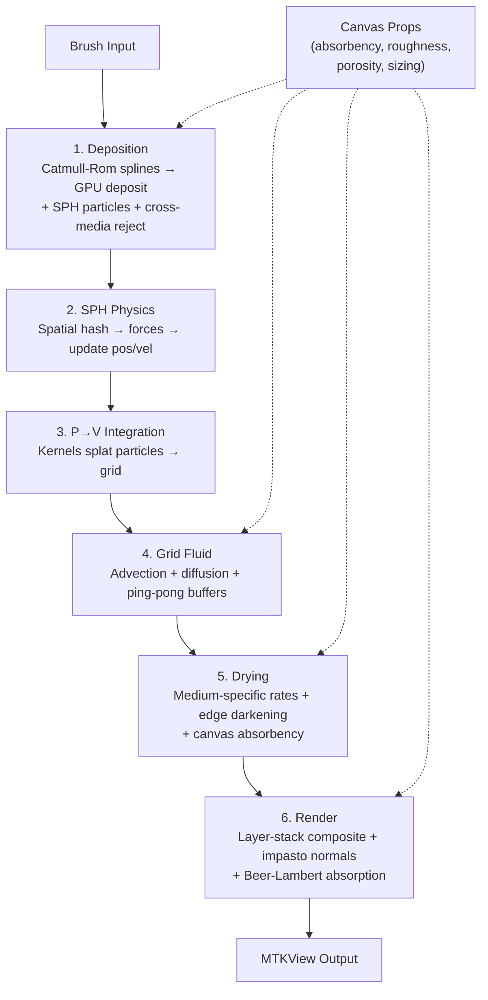

# Voxel Quick Reference — Summary

> Condensed from `voxel-quick-reference.md` (~345 lines). Read the full doc for mermaid diagrams, memory layout details, and SPH kernel formulas.

## Architecture in One Diagram



## Key Numbers

| What | Value |
|------|-------|
| VolumeLayer | 32 bytes (FP16) |
| SPHParticle | 48 bytes |
| Layers per pixel | 8 max |
| PixelVolume | 272 bytes |
| 1080p total memory | ~775 MB |
| Threadgroup size | 16×16 |
| Canvas props texture | rgba16Float (~17 MB) |
| Ping-pong buffer pairs | ~68 MB (wet + props A/B) |

## Memory Breakdown (1080p)

| Component | Size |
|-----------|------|
| Volume layers (8 × ~67 MB) | ~536 MB |
| Canvas material properties | ~17 MB |
| SPH particles (1M × 48B) | ~48 MB |
| Spatial hash | ~7 MB |
| Render targets (double-buffered) | ~51 MB |
| Simulation ping-pong buffers | ~68 MB |
| Working buffers | ~48 MB |
| **Grand total** | **~775 MB** |

## SPH Equations (Quick Lookup)

```
Density:     ρ_i = Σ m_j W(r_ij, h)
Pressure:    p_i = k × [(ρ_i/ρ₀)⁷ - 1]      (Tait's equation)
∇p_i  = -Σ m_j (p_i/ρ_i² + p_j/ρ_j²) ∇W     (pressure gradient)
μ∇²v_i = μ Σ m_j (v_j - v_i)/ρ_j ∇²W         (viscosity)
a_i = (∇p_i + μ∇²v_i + σ∇²ρ_i + g) / ρ_i     (acceleration)
```

Kernels: Gaussian, Cubic Spline, Wendland C²

## Media Quick Ref

| Medium | Viscosity | Drying | Special |
|--------|-----------|--------|---------|
| Watercolor | 0.001 (flows) | Fast (evaporation) | Granulation, backrun, wicking |
| Oil | 50.0 (thick) | Slow (oxidation, 0.5x) | Thixotropic, impasto, gloss |
| Acrylic | Medium | Fast (8x, two-phase) | Polymerization, water-resist |
| Charcoal | ~∞ (solid) | Already dry | Smudge, adhesion, fixative |
| Pastel | N/A (powder) | Fast (10x) | Powder accumulation |

## Rendering Steps

1. **Layer-stack composite** — back-to-front, over-operator, early-out at opacity 0.999
2. **Impasto lighting** — normal from `normalize(float3(dL-dR, dU-dD, 2.0))`, diffuse + per-medium specular
3. **Absorption model** — `visibleColor = canvasColor × exp(-absorption × concentration)`
4. **Tone map** — Reinhard: `color / (1 + color)`
5. **Gamma** — `pow(result, 1/2.2)`

## Performance Strategies

| Strategy | Gain |
|----------|------|
| Adaptive resolution (full/half/quarter) | 75% savings |
| Sparse storage (non-empty pixels only) | 70% savings |
| Threadgroup memory (16×16 tiles) | 100× faster access |
| Indirect dispatch (GPU-driven culling) | Better load balance |
| Per-medium pipeline specialization | 30-50% per medium |
| Modular shader source (header + per-kernel) | Test-time compilation |

## Cross-Doc References

- `planning.md` — project overview, phases, UI, risks
- `voxel-architecture.md` — full simulation details, code examples, research
- `kb/metal-reference.md` — 10 proven Metal patterns from kopigajj
