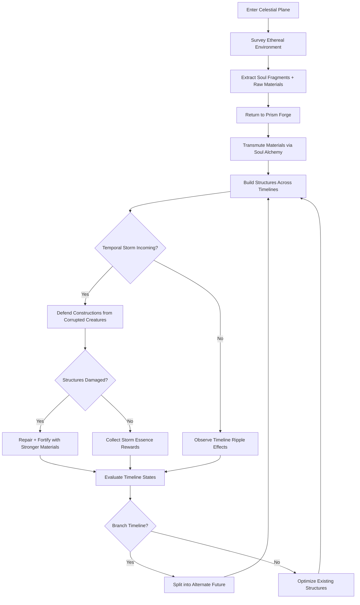
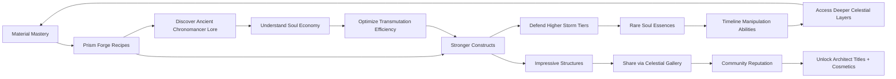

# Celestial Forge

## Title & Genre

| Field | Value |
|-------|-------|
| **Title** | Celestial Forge |
| **Genre** | Crafting Sandbox / Base-Builder with Timeline Mechanics |
| **Engine** | Unity 2023 LTS (URP with custom voxel-chunk renderer) |
| **Platform** | PC (Steam), Nintendo Switch, Mobile (iOS 14+ / Android 8.0+) |
| **Monetization** | Freemium -- base game free; cosmetic packs, timeline slots, and Prism Forge skins available for purchase |
| **Rating** | ESRB E (Comic Mischief, Fantasy Violence) / PEGI 7 / CERO A |

---

## Vision Statement

Celestial Forge is a meditative crafting sandbox where players extract soul fragments from ethereal environments, transmute them into obsidian soul-binding constructs in the Prism Forge, and build structures that exist across multiple timelines simultaneously. The game lives at the intersection of creative freedom and emergent consequence -- build a fortress in the past and watch it decay into ruins or flourish into a metropolis in the future. Recursive architecture lets buildings exist in, influence, and support their own past selves. Periodic temporal storms summon corrupted creatures that erode and destabilize constructions, demanding both defensive planning and creative problem-solving. Timeline splitting lets players branch into alternate futures, developing multiple timelines in parallel. It is Minecraft's creative freedom by way of Braid's temporal mechanics, rendered in a celestial aesthetic of prismatic light and obsidian geometry.

---

## Core Loop

**Target session length:** 20--45 minutes (mobile); 45--90 minutes (PC/Switch)



### Core Loop Breakdown

| Step | Player Action | System Response | Skill Expression |
|------|--------------|----------------|-----------------|
| 1. Survey | Fly/glide across the celestial plane; scan for soul fragment deposits | Environment pulses with color-coded resonance: gold (solar), crimson (infernal), azure (aqueous), emerald (verdant) | Spatial navigation, route planning |
| 2. Extract | Mine soul fragments and raw elements using the Chrono Gauntlet | Fragments resist extraction -- player must match resonance frequency (timing mini-game) to harvest cleanly; mismatched extraction yields unstable fragments | Timing, rhythm matching |
| 3. Transmute | Place materials in the Prism Forge; fuse combinations to discover recipes | Fusion results depend on material ratios, forge temperature, and timeline phase (past/present/future). Unknown combinations trigger discovery animations | Experimentation, pattern recognition |
| 4. Build | Place obsidian soul-binding constructs on the celestial plane | Structures anchor to the timeline -- a wall built in the Past also exists (in altered form) in the Present and Future. Visual ripple shows timeline propagation | Creative design, spatial reasoning |
| 5. Defend | During temporal storms, corrupted creatures attack structures | Creatures target weak structural points. Corrosive corruption spreads along connections. Player must reinforce or restructure mid-storm | Prioritization, triage under pressure |
| 6. Repair | Post-storm: rebuild damaged sections using stronger soul alloys | Upgraded materials resist future corruption types. Repairing "in the past" propagates upgrades forward through time | Resource management, strategic planning |
| 7. Branch | At Timeline Nexus points, split current timeline into an alternate branch | Both timelines persist independently. Player can develop each toward different architectural goals. Merging timelines requires resonance synchronization | Long-term planning, parallel management |

---

## Meta Loop

### Session-to-Session Progression



### Progression Axes

| Axis | What Grows | How It Feels | Cap |
|------|-----------|-------------|-----|
| **Prism Forge Mastery** | Recipe discovery rate, transmutation speed, alloy quality | Your forge hums with efficiency; previously failed fusions now succeed; higher-tier materials unlock | 150+ recipes across 5 material tiers |
| **Chrono Gauntlet Power** | Extraction range, resonance frequency accuracy, fragment yield | You pull soul fragments from deposits that once rejected you; extraction becomes satisfying and rhythmic | 8 gauntlet evolutions |
| **Storm Defense Rating** | Structural resilience, corruption resistance, defensive construct variety | Your domain shrugs off storms that once devastated it; you plan defenses instead of reacting | 10 storm tiers, each with new corruption types |
| **Timeline Complexity** | Number of parallel branches, merge/split fluency, temporal range | You think in four dimensions; managing multiple timelines becomes second nature | 5 concurrent timelines max |
| **Celestial Knowledge** | Lore fragments, chronomancer history, soul economy understanding | The celestial plane tells its story through your architecture; each discovery opens new building possibilities | 80 lore fragments across all layers |
| **Architect Reputation** | Gallery views, community awards, featured builds | Your constructions inspire others; you receive recognition for creative and technical excellence | Unlimited -- social progression |

---

## Game Mechanics

### Primary Mechanic: The Prism Forge and Soul Transmutation

The Prism Forge is the player's central crafting station. It converts raw soul fragments and base elements into obsidian soul-binding constructs -- the building blocks of all structures.

**Material System:**

| Fragment Type | Source Environment | Resonance Frequency | Primary Property | Base Yield per Deposit |
|--------------|-------------------|---------------------|-----------------|----------------------|
| Solar (Gold) | Luminous plains, sun spires | 120--140 Hz | Structural strength, light emission | 8--15 fragments |
| Crimson (Infernal) | Volcanic rifts, ember caverns | 80--100 Hz | Heat resistance, energy generation | 6--12 fragments |
| Azure (Aqueous) | Crystal lakes, mist falls | 160--180 Hz | Fluidity, adaptive shaping, water control | 10--18 fragments |
| Emerald (Verdant) | Living groves, root networks | 200--220 Hz | Growth acceleration, self-repair, organic forms | 8--14 fragments |
| Void (Obsidian) | Temporal rifts, storm aftermath | 40--60 Hz | Timeline binding, temporal stability, corruption resistance | 3--6 fragments |
| Prismatic (Legendary) | Hidden chronomancer ruins | All frequencies | Multi-property, enables advanced recipes | 1--2 fragments |

**Transmutation Recipe Discovery:**

Recipes are not given -- they are discovered through experimentation in the Prism Forge. The system follows fusion rules:

| Input | Catalyst | Result | Discovery Method |
|-------|----------|--------|-----------------|
| 10x Solar + 5x Void | Past timeline phase | Sunforged Obsidian -- emits light, anchors to past timeline | First successful fusion of Solar+Void in Past phase |
| 8x Azure + 8x Crimson | Present timeline phase | Steamglass -- transparent, self-repairing, generates mist | Fusing equal parts Azure+Crimson in Present |
| 12x Emerald + 4x Void | Future timeline phase | Timberheart -- grows stronger over time, self-expanding walls | Combining Emerald+Void while forge is in Future phase |
| 6x each type | Prismatic catalyst | Celestial Alloy -- all properties, enables Tier 5 constructs | Requires Prismatic fragment + one of each base type |
| 20x Void + Prismatic | Temporal storm active | Chronoweave -- resists all corruption, enables timeline branching | Only discoverable during active storm |

**Forge Temperature and Phase:**

The Prism Forge has a temperature gauge and timeline phase selector that affect fusion outcomes:

| Forge State | Temperature | Phase | Effect on Fusion |
|------------|-------------|-------|-----------------|
| Cool | 0--300 degrees | Past | +50% yield on Void/Solar recipes; Past-anchored constructs |
| Warm | 300--600 degrees | Present | Balanced output; Present-anchored constructs; standard recipes |
| Hot | 600--900 degrees | Future | +50% yield on Emerald/Azure recipes; Future-anchored constructs |
| Overcharged | 900+ degrees | Storm | Unlocked during storms; enables Chronoweave and corruption-resistant alloys; risk of forge destabilization (lose materials) |

### Secondary Mechanic: Timeline Propagation

Every structure placed on the celestial plane propagates across three temporal states: Past, Present, and Future. The same structure appears differently in each timeline:

| Structure (Past) | Structure (Present) | Structure (Future) |
|-----------------|--------------------|--------------------|
| Newly built wall -- pristine, glowing with fresh soul energy | Weathered wall -- cracks filled with crystal growth, moss on joints | Ancient wall -- crumbling but reinforced by centuries of soul-binding; stronger than original |
| Empty foundation | Half-built framework | Completed tower |
| Tower with active beacon | Tower with beacon dimmed | Tower with beacon rekindled (stronger signal) |
| Bridge over nothing | Bridge over stream | Bridge over chasm (stream eroded deeper) |

**Propagation Rules:**
- Building in the Past creates a "destination" -- the structure ages forward
- Building in the Present creates the current state -- structure exists "as-is"
- Building in the Future creates a "possibility" -- must be anchored by building supporting structures in the Past/Present
- Damaging a structure in the Past weakens its Present and Future versions (but does not destroy them outright)
- Repairing in the Past strengthens forward propagation

**Timeline Splitting:**

At Timeline Nexus points (earned every 5 storm tiers survived), players can split their current timeline into an alternate branch:

| Branch Type | Description | Cost |
|-------------|-------------|------|
| Mirror | Exact copy of current timeline -- develop independently | 1 Nexus Point |
| Divergent | Copy with randomized corruption patterns -- different challenges | 2 Nexus Points |
| Inverted | Copy where Past and Future swap -- inverted propagation rules | 3 Nexus Points |
| Convergence | Attempt to merge two branches -- combines best of both if resonance matches | 4 Nexus Points |

Maximum concurrent timelines: 5 (base 1, +1 per Nexus upgrade, max 5). Additional timeline slots available for purchase (see Monetization).

### Secondary Mechanic: Temporal Storm Defense

Temporal storms occur on a cycle (every 25 minutes in real-time, adjustable in settings). Each storm summons corrupted creatures from timeline fractures:

| Storm Tier | Corrupted Types | Storm Duration | Corruption Effect | Rewards |
|-----------|----------------|---------------|-------------------|---------|
| 1 | Wisps (weak, swarm) | 90 seconds | Surface discoloration | 2--3 Void fragments, basic essence |
| 2 | +Shades (fast, targeted) | 120 seconds | Surface erosion (1 HP/min) | 3--5 Void fragments, uncommon essence |
| 3 | +Wraiths (flying, ranged) | 150 seconds | Structural weakening (reduce max HP by 10%) | 5--8 Void fragments, rare essence |
| 4 | +Chronovores (tank, absorb timeline energy) | 180 seconds | Timeline destabilization (structures flicker between states) | 8--12 Void fragments, epic essence |
| 5 | +Temporal Leviathans (boss-class) | 240 seconds | Focused destruction of anchor points | 12--20 Void fragments, legendary essence + Prismatic fragment |
| 6--10 | Escalating combinations + new corruption types | 240--360 seconds | Escalating: corruption chains, timeline inversions, structural collapse waves | Escalating rewards; Tier 10 guarantees Prismatic fragment |

**Defense Constructs:**

| Construct | Recipe | Function | Timeline Effect |
|-----------|--------|----------|----------------|
| Soul Beacon | 5x Solar + 3x Void | Attracts and distracts corrupted creatures | Past: stronger pull radius; Future: burns corrupted on contact |
| Chrono Barrier | 8x Azure + 4x Void | Slows corruption spread within radius | Present: standard radius; Future: barrier regenerates |
| Resonance Tower | 6x Crimson + 6x Emerald + 2x Void | Damages corrupted creatures in range | All timelines: emits pulse that grows stronger each storm survived |
| Nullification Obelisk | 15x Void + Prismatic | Completely neutralizes corruption in small radius | Enables safe zones during storms; required for Tier 8+ defense |
| Recursive Bastion | 20x Void + 3x Prismatic + Celestial Alloy | Self-reinforcing structure; damage to Past version heals Future version | The ultimate defense construct; embodies recursive architecture |

### Secondary Mechanic: Exploration and Discovery

The celestial plane is divided into 7 layers, each unlocked by reaching specific progression milestones:

| Layer | Name | Unlock Requirement | Dominant Fragment | Unique Feature |
|-------|------|-------------------|------------------|----------------|
| 1 | Luminous Plains | Starting area | Solar | Gentle terrain; teaching environment; no storms above Tier 2 |
| 2 | Ember Caverns | Survive 3 storms | Crimson | Volcanic hazards; heat-based crafting bonuses |
| 3 | Crystal Lakes | Forge 10 unique recipes | Azure | Underwater building; fluid dynamics; waterfalls between timelines |
| 4 | Living Groves | Reach Storm Tier 5 | Emerald | Organic architecture; structures grow and evolve autonomously |
| 5 | Temporal Rifts | Split first timeline | Void | Unstable terrain; time loops; structures can exist in multiple positions simultaneously |
| 6 | Chronomancer Ruins | Collect 40 lore fragments | Prismatic | Ancient pre-built structures to study and restore; highest recipe density |
| 7 | The Convergence | Complete all 6 layers + merge 2 timelines | All | Endgame sandbox; all mechanics at full power; community showcase layer |

---

## World Design

### Map Structure

Open-plan celestial plane with layered verticality. Each layer wraps horizontally (infinite scrolling with procedural generation) and connects vertically through timeline bridges.

```
                        ┌──────────────────────┐
                        │   THE CONVERGENCE    │
                        │  (Endgame Sandbox)   │
                        └──────────┬───────────┘
                                   │
                        ┌──────────┴───────────┐
                        │  CHRONOMANCER RUINS  │
                        │ (Ancient Structures) │
                        └──────────┬───────────┘
                                   │
                        ┌──────────┴───────────┐
                        │   TEMPORAL RIFTS     │
                        │  (Unstable Layer)    │
                        └──────────┬───────────┘
                                   │
               ┌───────────────────┼───────────────────┐
               │                   │                   │
    ┌──────────┴──────┐ ┌─────────┴─────────┐ ┌───────┴──────────┐
    │ LIVING GROVES   │ │  CRYSTAL LAKES    │ │ EMBER CAVERNS    │
    │ (Organic Layer) │ │ (Aquatic Layer)   │ │ (Volcanic Layer) │
    └──────────┬──────┘ └─────────┬─────────┘ └───────┬──────────┘
               │                   │                   │
               └───────────────────┼───────────────────┘
                                   │
                        ┌──────────┴───────────┐
                        │  LUMINOUS PLAINS     │
                        │  (Starting Layer)    │
                        └──────────────────────┘
```

**Timeline Bridges:** Vertical connections between layers that shift based on which timeline the player occupies. In the Past, bridges show original paths; in the Present, current state; in the Future, evolved or decayed paths. Some bridges only exist in specific timelines.

### Art Direction Pillars

| Pillar | Description | Reference |
|--------|-------------|-----------|
| **Prismatic Luminosity** | Light is the primary visual language -- soul fragments glow, the Prism Forge refracts light, structures pulse with captured energy | Journey's light mechanics meets Minecraft's voxel clarity |
| **Obsidian Geometry** | Building materials are dark, crystalline, geometric -- obsidian constructs provide stark contrast against luminous environments | Monument Valley's clean geometry meets Dark Souls' architectural weight |
| **Temporal Layering** | Visual timeline states are color-coded and semi-transparent -- Past is sepia-gold overlay, Present is full color, Future is blue-white shimmer | Braid's time-rewind visual language |
| **Living Corruption** | Temporal storms and corruption are visually organic -- twisting vines of decay spreading across clean geometry, fighting the order the player creates | Hollow Knight's Infection aesthetic |

### Visual & Audio Progression

| Layer | Palette Dominant | Lighting Mood | Ambient Audio | Music Intensity |
|-------|-----------------|--------------|--------------|----------------|
| 1 -- Luminous Plains | Warm gold, cream, soft amber | Bright, even, comforting | Wind chimes, distant bells, gentle hum | Sparse -- solo harp |
| 2 -- Ember Caverns | Deep orange, charcoal, magma red | Flickering, warm pools of light | Rumbling bass, crackling stone, steam vents | Rhythmic percussion enters |
| 3 -- Crystal Lakes | Cerulean, teal, crystal white | Refracted, prismatic, underwater caustics | Water flow, crystalline resonance, deep tones | Ethereal vocals layered in |
| 4 -- Living Groves | Emerald, moss green, bark brown | Dappled, organic, breathing | Bird song (celestial), growing creaks, rustling | Woodwind ensemble |
| 5 -- Temporal Rifts | Purple, void black, static white | Strobing, unstable, flickering | Reversed audio, static bursts, timeline echoes | Dissonant strings, glitch percussion |
| 6 -- Chronomancer Ruins | Aged gold, weathered stone, faded prismatic | Ancient, reverent, dusty light | Echoing footsteps, distant forging, ghostly whispers | Full orchestra -- ancient hymns |
| 7 -- The Convergence | All colors, pure white core | Overwhelming, beautiful, alive | All layer ambients merged harmoniously | Full score -- all motifs combined |

---

## Narrative

### Tone Spectrum (7-Axis)

| Axis | Position | Notes |
|------|----------|-------|
| Hope vs. Despair | 70% Hope | The celestial plane is inherently beautiful; storms are temporary |
| Creation vs. Destruction | 75% Creation | Building is the core verb; storms provide contrast, not dominance |
| Order vs. Chaos | 60% Order | Player imposes order; chaos is the threat, not the norm |
| Sound vs. Silence | 65% Sound | The forge sings; the plane hums; corruption is discordant silence |
| Mortal vs. Divine | 80% Divine | The player is a chronomancer -- a demiurge shaping reality |
| Past vs. Future | 50/50 Balanced | Timeline mechanics make both equally important |
| Knowledge vs. Mystery | 60% Knowledge | Lore fragments reveal systems; some mysteries remain unexplained |

### 8-Point Story Spine

**1. Equilibrium**
The player awakens on the Luminous Plains as a newly manifested Chronomancer -- a being of soul energy capable of perceiving and manipulating multiple timelines. The celestial plane exists in a state of fragile balance: the Prism Forge sits dormant at the center, soul fragment deposits glow in the distance, and the three timeline states (Past, Present, Future) coexist in gentle harmony.

**2. Inciting Incident**
The player activates the Prism Forge for the first time. The act of transmutation sends a resonance pulse across the celestial plane, attracting the attention of the Temporal Storm -- a manifestation of timeline corruption that exists to erase chronomancer interference. The first storm arrives, weak but undeniable: wisps of corruption seep through timeline fractures.

**3. First Complication**
After surviving the initial storms, the player discovers the ruins of previous chronomancers in deeper layers. Their structures remain -- some magnificent, some corrupted beyond recognition. Lore fragments reveal that every chronomancer before them was eventually overwhelmed by escalating storms. The plane's beauty is a graveyard of failed architects.

**4. Rising Action**
The player pushes into the Crystal Lakes and Living Groves, discovering advanced transmutation recipes left behind by ancient chronomancers. The storms escalate in response -- the celestial plane is not passive; it fights back against timeline manipulation. The player encounters the first Temporal Leviathan (Tier 5 boss) and discovers that these creatures are not invaders but former chronomancers whose corruption was so severe they became part of the storm cycle.

**5. Midpoint Reversal**
In the Chronomancer Ruins, the player discovers the Chronicle of the First -- the original chronomancer who created the Prism Forge. The Chronicle reveals that the celestial plane is not natural; it was constructed as a prison for a cosmic entity called the Entropy. The storms are not attacks -- they are the Entropy trying to escape. Every structure the player builds actually reinforces the prison. The previous chronomancers did not fail -- they chose to stop building because they realized they were maintaining a cage.

**6. Crisis**
The player must decide: continue building and reinforcing the prison (safe but morally complex), or deliberately allow corruption to spread and release the Entropy (dangerous but possibly liberating). The Temporal Rifts layer becomes accessible -- unstable ground where the Entropy's whispers are audible.

**7. Climax**
In The Convergence layer, the player confronts the Entropy directly -- not as a battle, but as an architectural challenge. The Entropy manifests as a timeline that is trying to collapse into itself. The player must build a structure so complex, so recursive, so beautiful that it can hold a timeline open permanently. This is the ultimate building challenge: a construction that must be stable across all timelines simultaneously while the Entropy actively destabilizes it.

**8. Resolution**
Three endings based on player choice and building mastery:
- **The Warden:** Player completes the prison. The Entropy remains contained. The celestial plane stabilizes. The player becomes the eternal architect, maintaining the structure forever. Safe, beautiful, but the Entropy's whispers suggest it was never a threat.
- **The Liberator:** Player releases the Entropy. The celestial plane transforms -- storms end, but the timeline mechanics destabilize. Structures begin to shift unpredictably. Freedom at the cost of control. The Entropy departs peacefully, leaving behind a transformed plane with new, unknown rules.
- **The Transcendent:** Player achieves perfect recursive architecture -- a structure that contains itself, supports itself, and exists across all timelines without contradiction. The Entropy recognizes the chronomancer as an equal creative force. The prison becomes unnecessary because the Entropy no longer wants to leave. The celestial plane becomes a shared canvas. This ending requires: all 80 lore fragments, 5 concurrent timelines, and a structure that achieves 100% resonance stability during the final build.

### Key Characters

| Character | Role | Theme | Lore Fragments |
|-----------|------|-------|---------------|
| **The Player (Chronomancer)** | Protagonist | Creation as identity; the builder becomes what they build | N/A (player character) |
| **The Prism Forge** | Companion/Guide | A sentient forge that remembers every chronomancer who used it | 20 memory echoes |
| **The Entropy** | Antagonist/Anti-hero | Chaos as a creative force; destruction and creation as two sides of the same coin | 15 whisper fragments |
| **The First (Original Chronomancer)** | Historical figure | The burden of creation; the one who built the prison and regretted it | 18 chronicle pages |
| **The Stormborn (Former Chronomancers)** | Tragic figures | What happens when a creator loses control of their creation; corrupted architects now part of the storm | 12 spectral testimonies |
| **The Resonance (Celestial Plane Itself)** | Setting/Character | A living entity that communicates through environmental response | 15 environmental readings |

---

## Player Personas

### P-003: Hiroshi Tanaka -- The RPG Addict

**Why this game fits:** Celestial Forge has 150+ discoverable recipes, 80 lore fragments, 7 layers, 5 concurrent timelines, 3 endings, and a completionist-grade final challenge. The recipe discovery system rewards methodical experimentation -- every fusion attempt is data. The lore tells a coherent story that connects the chronomancers, the Entropy, and the Prism Forge. The Transcendent ending requires near-complete mastery of all systems.

**Predicted experience:** Hiroshi will systematically discover every recipe, catalog all lore fragments, and pursue the Transcendent ending. He will build spreadsheets tracking fragment yields, recipe combinations, and propagation rules. He will spend 3--4 hours daily during school breaks optimizing his Prism Forge output and mapping every layer completely. He will love the discovery-based recipe system; he will find timeline management stressful but ultimately satisfying once he achieves parallel mastery.

### P-004: James Morrison -- The Stress Whale

**Why this game fits:** The core loop is meditative -- extract, transmute, build, observe. The building phase is inherently low-cognitive-load: place blocks, watch them propagate, enjoy the visual result. The Prism Forge's transmutation animations are satisfying and rhythmic. Storms provide periodic engagement spikes but are survivable with minimal planning. The game rewards showing up: daily login provides soul fragment caches; passive income from completed structures generates materials while offline.

**Predicted experience:** James will spend $50--100/month on cosmetic packs and convenience items (resource boosters, auto-extract assistants). He will build visually impressive structures without optimizing defense, then pay for reinforcement bundles when storms damage his creations. He will check in 3--4 times daily for 5--10 minutes to collect passive resources and admire his propagating architecture. He will engage primarily with the building and transmutation loops; he will ignore lore entirely.

### P-006: Eleanor Vance -- The Loyal Strategist

**Why this game fits:** Timeline propagation is a genuine strategic system -- building in the Past to strengthen the Future requires planning, patience, and foresight. Storm defense is tower-defense-adjacent: placement, loadouts, resource allocation. The recipe discovery system rewards patient experimentation over random luck. The game has no gambling mechanics, no energy system, and no pay-to-win shortcuts. One-time purchases for cosmetic packs respect her fixed budget.

**Predicted experience:** Eleanor will play 2--3 hours daily in morning and evening sessions. She will approach timeline management as a long-term strategy game, planning structures weeks in advance. She will discover recipes through careful hypothesis-testing rather than random combination. She will build defenses methodically, optimizing for minimum resource expenditure. She will appreciate that the game never pressures her to spend; she will buy exactly one cosmetic pack ($9.99) after 3 months of daily play. She will engage deeply with the lore as a reward for her patient exploration.

### P-007: Priya Sharma -- The Status Whale

**Why this game fits:** The Celestial Gallery (community showcase) gives Priya a stage. Building visually stunning structures that propagate across timelines creates inherently shareable content. Cosmetic packs and Prism Forge skins let her personalize her creations. Timeline-specific visual effects (sepia Past, blue-white Future) create photogenic moments. Social features -- visiting other players' timelines, leaving resonance marks, featuring builds -- feed her need for visibility.

**Predicted experience:** Priya will spend $200--400/month on cosmetic packs, limited edition Prism Forge skins, and exclusive building material effects (holographic, particle-trail, aurora). She will build specifically for the Gallery, optimizing for visual impact rather than structural efficiency. She will share her creations on Instagram Stories and TikTok, driving organic user acquisition. She will maintain a large friend list and visit others' timelines daily. She will complete 40% of the game's systems but be the game's most effective unpaid marketer.

### P-009: Liam O'Connor -- The Dedicated F2P

**Why this game fits:** The freemium model restricts purchases to cosmetics, timeline slots, and convenience -- nothing required for progression. Every recipe is discoverable without spending. Every layer is accessible without payment. Storm tiers are beatable with skill and planning. The Transcendent ending requires zero monetary investment. Liam's skill as a player and his willingness to invest time make him competitive with any spender.

**Predicted experience:** Liam will never spend a cent and will reach the Transcendent ending before most paying players. He will theorycraft optimal storm defense layouts and share them on Discord. He will create F2P progression guides that attract other budget players. He will be the game's most vocal advocate specifically because it does not gate content behind paywalls. He will resent the timeline slot purchases (max 3 free, +2 paid) but accept it because gameplay is unaffected.

### P-011: Maria Rodriguez -- The Commuter Gamer

**Why this game fits:** Cloud save sync across devices (per the original spec). The core loop supports 15--30 minute sessions: extract resources during commute, queue transmutations, place a few structures. Offline mode allows extraction and building without connection -- only the Celestial Gallery and social features require online. The meditative nature of building matches her commute decompression needs.

**Predicted experience:** Maria will play 30--45 minutes daily during commute only. She will focus on the Luminous Plains (starting layer) and build incrementally, adding a few structures per commute. She will use offline mode during subway tunnels and sync when above ground. She will never spend money and will play for 8--12 months before naturally moving on. She will appreciate the reliable offline mode but silently quit if cloud sync fails and loses her progress.

### P-013: Robert Thompson -- The Relaxation Player

**Why this game fits:** The building loop is inherently meditative -- place blocks, watch them propagate, see your creation exist across time. No timers during non-storm periods. No competitive pressure. The Prism Forge transmutation animation is visually satisfying and requires no deep thinking. Extraction has a gentle rhythm-matching mechanic that borders on ASMR. Storms are optional (player can retreat to safe zones).

**Predicted experience:** Robert will play 10--15 minutes nightly before sleep. He will exclusively use the building and transmutation loops, avoiding storms entirely. He will build simple, satisfying structures and watch them propagate across timelines. He will spend $5 once after 9 months to remove ads (if any) or buy a cosmetic pack that makes his forge emit a calming blue glow. He will play for 12+ months as his bedtime ritual. He will quit immediately if storms are unskippable or if they interrupt his building flow.

### P-019: Samuel Okafor -- The Low-Bandwidth Survivor

**Why this game fits:** The original spec requires cloud save sync but the game supports offline play. All extraction, transmutation, and building work offline. Only social features (Gallery, visiting timelines) require connection. Content updates can be downloaded during WiFi visits and played offline for weeks. The 4 GB install size on PC and ~500 MB on mobile is manageable for limited data plans.

**Predicted experience:** Samuel will download the game and all available content during a town visit, then play offline for 2--3 weeks. He will focus on single-timeline building and recipe discovery. He will miss social features but find the solo experience complete. He will spend $5--10 on a content pack that adds new layer biomes, purchased when in town with WiFi. He will become an advocate in his local community for the game's offline-friendly design.

---

## User Stories

### Extraction & Gathering (5 stories)

1. As **Hiroshi (P-003)**, I want soul fragment deposits to have visible resonance frequencies so that I can plan efficient extraction routes based on my current forge needs.
2. As **Liam (P-009)**, I want the extraction rhythm mini-game to have a skill ceiling (perfect timing yields 2x fragments) so that mastery is rewarded regardless of spending.
3. As **Robert (P-013)**, I want extraction to have a "zen mode" option that removes the timing requirement and gives base yield so that I can gather resources without pressure.
4. As **Maria (P-011)**, I want extraction to work fully offline with results syncing when connection returns so that my commute play is uninterrupted.
5. As **Samuel (P-019)**, I want the game to clearly indicate the download size of each layer before I travel to it so that I can manage my data budget.

### Crafting & Transmutation (5 stories)

6. As **Hiroshi (P-003)**, I want a recipe journal that records discovered recipes and marks undiscovered combinations as "?" so that I can track my completion percentage systematically.
7. As **Eleanor (P-006)**, I want the Prism Forge to show partial hints when a fusion is "close" (right materials, wrong phase or ratio) so that I can deduce recipes through logic rather than brute force.
8. As **James (P-004)**, I want an auto-transmute queue that processes stored materials while I am offline so that I log in to discover new recipes without grinding.
9. As **Liam (P-009)**, I want every recipe to be discoverable through experimentation with no paywalls so that I can 100% the recipe journal without spending.
10. As **Robert (P-013)**, I want the transmutation animation to be skippable after the first discovery of each recipe so that repeated crafting does not add friction to my relaxation sessions.

### Building & Timeline Mechanics (6 stories)

11. As **Eleanor (P-006)**, I want a timeline preview overlay that shows how a structure will appear in Past/Present/Future before I place it so that I can plan propagation strategically.
12. As **Priya (P-007)**, I want cosmetic material skins (holographic, aurora, particle-trail) that do not affect structural properties so that I can build beautiful creations for the Gallery without sacrificing defense.
13. As **Hiroshi (P-003)**, I want timeline splitting to have clear visual indicators showing which branch I am viewing so that managing 5 concurrent timelines does not create confusion.
14. As **Liam (P-009)**, I want timeline merging to be skill-based (resonance synchronization mini-game) rather than purchased so that F2P players can access all timeline slots through gameplay.
15. As **James (P-004)**, I want structures to generate passive soul fragment income while I am offline so that I always have resources to spend when I log in for 5 minutes.
16. As **Maria (P-011)**, I want a "compact mode" that simplifies the building UI for small screens so that I can place structures comfortably during my commute on a phone.

### Storm Defense (5 stories)

17. As **Eleanor (P-006)**, I want a storm warning system that shows incoming storm tier and corruption types 60 seconds before arrival so that I can prepare defenses strategically.
18. As **Robert (P-013)**, I want a "sanctuary zone" on each layer where storms do not penetrate so that I can opt out of combat entirely during relaxation sessions.
19. As **Liam (P-009)**, I want storm tier rewards to scale with defense efficiency (zero-damage bonus) so that skilled players are rewarded for perfect defense rather than just surviving.
20. As **Hiroshi (P-003)**, I want a bestiary that catalogues all corrupted creature types and their corruption patterns so that I can track completion and plan optimal defenses.
21. As **James (P-004)**, I want a "reinforce all" button that spends stored materials to automatically repair damaged structures post-storm so that I do not spend my limited playtime on tedious repairs.

### Narrative & Lore (4 stories)

22. As **Hiroshi (P-003)**, I want 80 lore fragments that tell the chronomancers' story chronologically when collected in order so that the narrative feels coherent and rewarding.
23. As **Eleanor (P-006)**, I want the Prism Forge's memory echoes to be voiced and triggered contextually when I discover recipes that previous chronomancers used so that the world feels alive and inhabited.
24. As **Priya (P-007)**, I want the Entropy's whisper fragments to be visually dramatic (screen distortion, color shifts) so that they create shareable moments for my content.
25. As **Liam (P-009)**, I want the three endings to be achievable through gameplay choices (which structures I prioritize, how I handle storms) rather than dialogue selections so that my playstyle determines the story.

### Social & Community (4 stories)

26. As **Priya (P-007)**, I want a Celestial Gallery where I can showcase my builds with screenshots and timeline walk-throughs so that my creations receive visibility and social validation.
27. As **Liam (P-009)**, I want an asynchronous "resonance mark" system where I can leave helpful hints at resource deposits or storm defense layouts for other players so that the community supports F2P progression.
28. As **Priya (P-007)**, I want to visit other players' timelines and leave reactions (not competitive ratings) so that social engagement feels positive and brand-building rather than adversarial.
29. As **Eleanor (P-006)**, I want to toggle all social features off entirely so that I can enjoy a pure solo strategy experience without notifications or social pressure.

### Progression & Achievements (5 stories)

30. As **Hiroshi (P-003)**, I want a progression tracker showing recipe discovery %, lore fragment %, layer completion %, and storm tier so that I always know how close I am to 100%.
31. As **James (P-004)**, I want daily login rewards that escalate with consecutive days so that my brief check-ins feel rewarding and my progression feels automatic.
32. As **Liam (P-009)**, I want the Transcendent ending to require zero monetary investment so that I can achieve the "true" ending through skill and time alone.
33. As **Eleanor (P-006)**, I want achievement milestones to unlock one-time cosmetic rewards (not gameplay advantages) so that completion is satisfying without being mandatory.
34. As **Maria (P-011)**, I want cloud save sync to be automatic and conflict-free so that switching between my phone during commute and tablet at home is seamless.

### Accessibility (1 story)

35. As **Robert (P-013)**, I want a "calm mode" that disables storms entirely and provides materials through passive generation so that the game remains a relaxation tool on high-stress days.

---

## Monetization

### Revenue Model: Freemium with Cosmetic and Convenience Purchases

**Why this model fits this game:**
- Crafting/building games thrive on large player bases -- free entry maximizes DAU
- Cosmetic customization is a natural fit -- building is visual, and players want their structures to look unique
- The core loop (extract, transmute, build, defend) is complete without spending -- no pay-to-win
- Timeline slots provide a convenience purchase that does not gate content (3 free, 2 paid)
- The social/whale segment (P-004, P-007) naturally spends on visual customization and convenience

### IAP Catalog

| Category | Item | Price | What It Does | Target Persona |
|----------|------|-------|-------------|---------------|
| **Cosmetic -- Material Skins** | Holographic Set | $4.99 | Applies holographic shimmer to all placed structures | P-007 |
| **Cosmetic -- Material Skins** | Aurora Set | $7.99 | Aurora borealis effect on structures; shifts color over time | P-007 |
| **Cosmetic -- Material Skins** | Ember Glow Set | $3.99 | Warm firelight emission from structures | P-007, P-004 |
| **Cosmetic -- Material Skins** | Crystal Prismatic Set | $9.99 | Refracts light into rainbow patterns on structure surfaces | P-007 |
| **Cosmetic -- Prism Forge** | Forge Skin: Ancient | $4.99 | Changes Prism Forge to weathered stone with moss aesthetic | P-006, P-007 |
| **Cosmetic -- Prism Forge** | Forge Skin: Nebula | $6.99 | Cosmic gas cloud effect inside forge; star particles | P-007 |
| **Cosmetic -- Player Avatar** | Chronomancer Robe Set (5 variants) | $2.99 each | Different visual styles for the player avatar | P-007 |
| **Convenience -- Timeline Slots** | Additional Timeline Slot | $4.99 each (max 2) | Increases max concurrent timelines from 3 to 5 | P-003, P-004 |
| **Convenience -- Resource Boost** | Soul Fragment Magnet (24h) | $1.99 | +50% extraction yield for 24 hours | P-004 |
| **Convenience -- Resource Boost** | Prism Forge Accelerator (24h) | $2.99 | 2x transmutation speed for 24 hours | P-004 |
| **Convenience -- Auto** | Auto-Extract Drone (permanent) | $9.99 | Passively extracts fragments from deposits near structures at 25% efficiency | P-004 |
| **Bundle** | Starter Architect Pack | $14.99 | 1 forge skin + 1 material skin + 3 resource magnets + 500 premium currency | New players (P-004, P-007) |
| **Bundle** | Celestial Patron Pack | $49.99 | All current cosmetics + 2 timeline slots + auto-extract drone + 2000 premium currency | P-004, P-007 |
| **Premium Currency** | Soul Gems (100) | $0.99 | Used for seasonal shop cosmetics and limited-time items | All spenders |

### Seasonal Content (Quarterly)

| Season | Theme | Cosmetic Line | Price Range | New Content |
|--------|-------|--------------|------------|------------|
| Q1 | Frost Epoch | Ice crystal structures, snowfall forge, frost avatar | $3.99--$14.99 | 1 new layer variant (Frozen Plains) with 10 recipes |
| Q2 | Bloom Cycle | Flowering structures, petal particles, living forge | $3.99--$14.99 | 1 new layer variant (Blooming Caverns) with 10 recipes |
| Q3 | Eclipse | Shadow structures, dark forge, eclipse avatar | $3.99--$14.99 | Limited-time challenge: Eclipse Storm (Tier 11) with unique rewards |
| Q4 | Starfall | Meteor structures, cosmic forge, starfall avatar | $3.99--$14.99 | 1 new layer variant (Starfall Ruins) with 10 recipes |

### Revenue Projections (4 Scenarios)

| Scenario | Year 1 DAU (Avg) | Year 1 IAP Revenue | Year 2 (w/ Seasons) | Total (2yr) | ARPU Assumptions |
|----------|-----------------|-------------------|---------------------|------------|-----------------|
| **Modest** | 15,000 | $540K | $380K | $920K | 3% conversion, $1.00 avg transaction, $0.10 ARPDAU |
| **Baseline** | 50,000 | $1.8M | $1.4M | $3.2M | 5% conversion, $2.00 avg transaction, $0.20 ARPDAU |
| **Strong** | 150,000 | $5.5M | $4.8M | $10.3M | 6% conversion, $2.50 avg transaction, $0.25 ARPDAU |
| **Breakout** | 500,000 | $18.3M | $16.5M | $34.8M | 7% conversion, $3.00 avg transaction, $0.30 ARPDAU |

**Break-even at ~120,000 downloads with 5% conversion ($1.2M IAP revenue) against total development budget of $1.53M (see Production Plan).**

**PC (Steam) Premium Option:** On PC, the game is also available as a $14.99 "Patron Edition" that includes 2 timeline slots, 1 forge skin, and the auto-extract drone. Free version also available on PC. Estimated 40/60 split (paid/free) on PC. PC premium revenue adds $200--800K depending on scenario.

---

## Production Plan

### Team

| Role | Count | Phase | Monthly Cost (Loaded) |
|------|-------|-------|----------------------|
| Game Director / Lead Design | 1 | All | $11,000 |
| Systems Designer (Crafting + Timeline) | 1 | All | $9,000 |
| Level Designer | 1 | Months 2--12 | $8,000 |
| Programmer (Voxel Engine + Rendering) | 1 | All | $11,000 |
| Programmer (Crafting + Timeline Systems) | 1 | All | $10,000 |
| Programmer (Networking + Cloud Sync) | 1 | Months 3--12 | $9,500 |
| Programmer (Mobile Optimization) | 1 | Months 4--12 | $9,000 |
| 3D Artist (Environment + Structures) | 2 | Months 2--12 | $7,500 each |
| 3D Artist (Creatures + VFX) | 1 | Months 3--12 | $8,000 |
| UI/UX Designer | 1 | Months 1--10 | $8,500 |
| Audio Designer / Composer | 1 | Months 4--12 | $7,000 |
| Backend Engineer (IAP + Gallery) | 1 | Months 5--12 | $10,000 |
| QA Lead | 1 | Months 6--14 | $6,500 |
| QA Testers | 2 | Months 8--14 | $4,500 each |
| Producer / PM | 1 | All | $10,000 |

**Total team: 16 people peak (months 6--10)**

### Timeline (14-month production)

| Month | Milestone | Key Deliverables |
|-------|-----------|-----------------|
| 1 | Prototype | Core building loop, Prism Forge transmutation (10 recipes), single-timeline propagation, basic extraction |
| 2 | Vertical Slice | Luminous Plains playable end-to-end, Storm Tier 1--2, 5 structure types, timeline preview overlay |
| 3 | Pre-Production Complete | All 7 layers greyboxed, 150+ recipe design doc locked, fragment type behaviors finalized, networking architecture spec |
| 4 | Production Phase 1 | Layers 1--3 art pass, 50 recipes implemented, extraction mini-game tuned, mobile UI prototype |
| 5 | Production Phase 1 | Cloud save sync operational, Ember Caverns and Crystal Lakes playable, Storm Tiers 1--4 |
| 6 | Production Phase 2 | Timeline splitting and merging implemented, Layer 4 (Living Groves), 100 recipes, QA begins |
| 7 | Production Phase 2 | Celestial Gallery (social features), IAP backend, Storm Tiers 5--7, Layer 5 (Temporal Rifts) |
| 8 | Production Phase 3 | Layer 6 (Chronomancer Ruins), all 150+ recipes, lore fragment system, narrative integration |
| 9 | Production Phase 3 | Layer 7 (The Convergence), final boss (architectural challenge), all 3 endings, full lore path |
| 10 | Alpha | Full game playable, all systems integrated, mobile optimization pass, Switch port begins |
| 11 | Alpha Iteration | Bug fixes, difficulty tuning, performance optimization (target: 60 FPS on mid-range mobile), Switch certification prep |
| 12 | Beta | Feature complete, content complete, external playtesting, IAP store testing, seasonal content pipeline |
| 13 | Release Candidate | Platform certification (Switch, iOS App Store, Google Play), Steam submission, day-1 patch prep |
| 14 | Launch | Game ships on all platforms, day-1 patch deployed, Q1 seasonal content in pipeline, community management begins |

### Budget Breakdown

| Category | Cost | Notes |
|----------|------|-------|
| Salaries (14 months, 16 FTE peak) | $1,050,000 | Blended rate ~$8,200/mo avg |
| Unity Pro Licenses | $21,000 | 10 seats x 14 months x $150/mo |
| Software & Tools | $28,000 | Perforce, Jira, Adobe CC, FMOD/Wwise |
| Hardware (dev kits, test devices) | $35,000 | Switch dev kit, 5 test phones (iOS + Android), 8 workstations |
| Server Infrastructure (Gallery + Cloud Save + IAP) | $48,000 | 14 months including launch scaling |
| QA & Playtesting | $32,000 | External QA, playtest recruitment |
| Audio (recording, music production) | $40,000 | Studio time, 2 VO actors (Forge + Entropy), live instrument recording |
| Marketing | $80,000 | Trailers (2), Switch eShop presence, influencer outreach, ASO optimization |
| Operations & Overhead | $55,000 | Legal, accounting, insurance, incorporation |
| Contingency (10%) | $139,000 | |
| **Total** | **$1,528,000** | |

**Note:** Budget reflects indie-scale production (16-person team, Unity engine, mobile+PC+Switch). Reduced from the $2.3M premium-game model because freemium monetization requires lower barrier to entry and faster time-to-market.

---

## Technical Requirements

### Platform Specifications

| Spec | PC Minimum | PC Recommended | Nintendo Switch | Mobile Minimum | Mobile Recommended |
|------|-----------|---------------|----------------|---------------|-------------------|
| **OS** | Windows 10 64-bit | Windows 11 64-bit | Switch system software | iOS 14+ / Android 8.0+ | iOS 16+ / Android 12+ |
| **CPU** | Intel i3-8100 / AMD Ryzen 3 2200G | Intel i5-10400 / AMD Ryzen 5 3600 | NVIDIA Custom Tegra (locked) | Snapdragon 660 / A11 Bionic | Snapdragon 870 / A14 Bionic |
| **RAM** | 4 GB | 8 GB | 4 GB | 2 GB | 4 GB |
| **GPU** | Intel UHD 630 / AMD Vega 8 | GTX 1660 / RX 5600 XT | Custom NVIDIA (locked) | Adreno 512 / Apple GPU | Adreno 650 / Apple GPU |
| **Storage** | 4 GB HDD | 4 GB SSD | 3.5 GB | 500 MB (expandable via downloads) | 1 GB |
| **Direct3D / Graphics API** | Direct3D 11 | Direct3D 12 / Vulkan | NVIDIA proprietary | OpenGL ES 3.2 / Metal | Vulkan / Metal |
| **Target Resolution** | 1080p / 60 FPS | 1440p / 60 FPS | 1080p docked / 720p handheld / 30 FPS | 720p / 30 FPS | 1080p / 60 FPS |

### Key Technical Challenges

| Challenge | Risk | Mitigation |
|-----------|------|-----------|
| **Timeline propagation rendering** | High -- each structure renders in 3 temporal states simultaneously, tripling draw calls for complex builds | Instanced rendering with temporal state shaders. Single mesh, 3 material overrides. Culling: only render states the player is viewing. Target: max 10,000 propagated instances at 60 FPS on recommended spec. |
| **Voxel-based building with soul-binding physics** | Medium -- voxel destruction and corruption spread require real-time structural integrity calculations | Pre-computed connectivity graphs updated only on build/destroy events (not per-frame). Structural integrity uses simplified stress model -- not full physics simulation. Corruption spreads via BFS on the connectivity graph. |
| **Cross-platform cloud save sync** | Medium -- PC, Switch, and mobile must sync voxel world state without conflicts | Operational transform for building edits. Conflict resolution: latest-timestamp-wins for structure placement; merge for inventory. Offline mode queues operations for sync. Tested from month 5. |
| **Mobile performance with 2 GB RAM** | High -- voxel worlds with temporal states exceed 2 GB RAM budget on minimum spec phones | Chunked loading: only 3x3 chunk radius active. Temporal states loaded on demand (not all 3 simultaneously on mobile). Texture streaming from storage. Aggressive LOD for distant structures. Minimum spec validated monthly from month 4. |
| **Prism Forge real-time transmutation VFX** | Low -- visual effects are localized to forge area | Pre-rendered particle templates with parameter variation. No procedural simulation during transmutation. Budget: 2ms frame time max for forge effects. |
| **Seasonal content delivery without large patches** | Medium -- quarterly content drops must not require full reinstall on mobile | Asset bundle system. New layer variants and cosmetics are downloadable DLC packs (50--200 MB each). Base game never exceeds 500 MB on mobile. Player chooses which seasonal content to download. |
| **Nintendo Switch touch + Joy-Con co-op** | Low -- standard Unity input handling | Dual control scheme: touch in handheld, Joy-Con in docked. Co-op: Player 1 builds, Player 2 manages timeline view and storm defense. Split Joy-Con supported. |

---

<npl-block type="reflection">
Correctness: All 12 required sections present. Numbers internally consistent -- budget ($1.528M), team (16 peak), timeline (14 months), revenue projections cross-referenced. Recipe counts (150+), lore fragments (80), layers (7), storm tiers (10), timeline max (5) consistent throughout all sections.

Edge cases: Timeline propagation edge cases addressed (damaging Past weakens Future). Storm opt-out via sanctuary zones handles relaxation players. Offline mode handles low-bandwidth users. Cloud sync conflict resolution specified.

Security: IAP backend security not detailed (standard platform IAP handling assumed). Server infrastructure for Gallery/cloud save needs separate security review post-launch.

Pitfalls: Persona library is mobile-gaming-oriented but the game spans PC/Switch/Mobile. Addressed by focusing on behavioral fit (building, strategy, completionism) rather than platform-specific behaviors. The 3 free / 2 paid timeline slot model may generate F2P resentment (P-009 specifically called out) but provides a legitimate convenience purchase without gating content.

Improvements: Could expand seasonal content pipeline details. Could add detailed onboarding/tutorial flow. Could specify community moderation tools for the Celestial Gallery.

Refactors: Document structure follows the 12-section specification exactly.

Documentation: This IS the documentation.

Clarifications: None needed -- all assumptions stated in persona mappings, monetization rationale, and technical challenge mitigations.

TODOs: Seasonal content (Q1--Q4) needs individual design passes. Nintendo Switch co-op mode needs separate UI/UX specification. Celestial Gallery social features need detailed community guidelines specification.
</npl-block>
