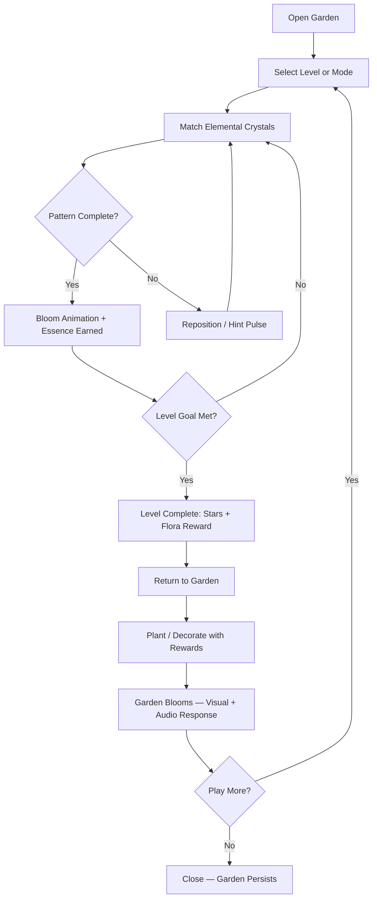
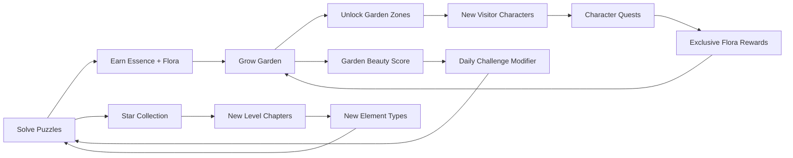

# Aether Bloom

## Title & Genre

| Field | Value |
|-------|-------|
| **Title** | Aether Bloom |
| **Genre** | Casual Match-3 Puzzle / Zen Garden Simulator |
| **Engine** | Unity 2023 LTS (2D URP, custom particle system for bloom effects) |
| **Platform** | Mobile (iOS 14+, Android 10+), PC (Steam — Windows/Mac/Linux), Nintendo Switch |
| **Monetization** | Free-to-play, cosmetic-only DLC, no FOMO mechanics, no energy system |
| **Rating** | ESRB E (Everyone) / PEGI 3 / IARC Generic |

---

## Vision Statement

Aether Bloom is a serene match-3 puzzle game where the player nurtures golden essence plants by matching elemental crystal patterns, transforming withered shadow gardens into flourishing crystal sanctuaries. The game is a meditative sanctuary — no timers in the primary mode, no penalties for failing, no pressure to spend. Every match blooms a living garden that the player customizes and curates across 200+ hand-crafted levels, three distinct game modes, and a persistent garden canvas that grows more beautiful the more the player plays. It is Monument Valley meets Candy Crush without the cruelty, designed for the five-minute break and the hour-long wind-down alike.

---

## Core Loop

**Target session length:** 5-20 minutes (Flow mode), 3-5 minutes (Daily Challenge)



### Core Loop Breakdown

| Step | Player Action | System Response | Skill Expression |
|------|--------------|----------------|-----------------|
| 1. Select | Choose a level from the garden map or switch modes (Flow, Zen Endless, Daily Challenge) | Map shows star completion (0-3 per level), locked levels greyed with element requirement displayed | Goal-setting — pick challenge level or comfort level |
| 2. Match | Swap adjacent crystals to form 3+ matches of same element (Fire, Water, Earth, Air, Light, Shadow) | Matched crystals dissolve with bloom animation; crystals above cascade down; new crystals spawn from top | Pattern recognition, spatial planning |
| 3. Pattern Bonus | Create 4+ matches, L-shapes, T-shapes, or cascade chains | Special crystals form: 4-match = Spark (clears row), L/T = Pulse (clears 3x3 area), 5-match = Prism (clears all of one element) | Chain planning, setup moves |
| 4. Bloom | Each match fills the Bloom Meter proportional to match size | Garden backdrop responds in real-time — flowers open, shadows recede, ambient track adds instruments | Visual reward tied to performance |
| 5. Level Complete | Fill the Bloom Meter to 100% (1-star), 150% (2-star), 200% (3-star) | Reward screen shows flora unlocked, essence earned, garden decoration received | Optimization — chase 3-star or accept 1-star and move on |
| 6. Garden | Plant earned flora in personal garden; arrange decorations; view collection | Garden is a persistent 2D isometric space. Each planted flora contributes ambient sound to the garden's soundscape. Visitor characters appear based on garden diversity. | Creative expression, collection display |

---

## Meta Loop

### Session-to-Session Progression



### Progression Axes

| Axis | What Grows | How It Feels | Cap |
|------|-----------|-------------|-----|
| **Level Progression** | Star count unlocks new chapters (10 chapters, 20 levels each = 200 levels) | Each chapter introduces one new mechanic or element type, preventing stagnation | 200 levels, 600 max stars |
| **Garden Growth** | Unlocked garden zones (6 biomes), placed flora and decorations, visitor characters | The garden evolves from a barren shadow patch to a thriving sanctuary. Each visit shows visible progress. | 6 biomes × 30 plots each = 180 planting spots |
| **Flora Collection** | 120 unique flora species across 6 element families, each with 3 growth stages | Collector satisfaction — rare flora have distinctive bloom animations and unique sounds. Pokedex-style catalog. | 120 species, 360 growth-stage entries |
| **Character Bonds** | 8 visitor characters who appear in garden based on biome diversity; each has a 5-part questline | Light narrative attachment — characters comment on your garden, ask for specific flora, reward exclusive items | 40 character quests total |
| **Player Mastery** | Pattern efficiency, chain setup, special crystal combinations | Invisible but felt — you clear levels faster, earn more stars, and 3-star levels you previously 1-starred | No cap — perpetual improvement |
| **Daily Streak** | Consecutive daily challenge completions build a streak multiplier for essence earned | Gentle encouragement to return without punishing absence (streak decays, doesn't reset) | 30-day streak cap at 3x essence multiplier |

---

## Game Mechanics

### Primary Mechanic: Elemental Crystal Matching

The match-3 board is a 7x8 grid of elemental crystals. Six elements populate the board:

| Element | Color | Crystal Shape | Special Interaction |
|---------|-------|--------------|-------------------|
| Fire | Amber-orange | Octahedron | Melts adjacent Ice barriers (level obstacle) |
| Water | Cerulean-blue | Teardrop | Fills dried stream beds in garden zones |
| Earth | Moss-green | Hexagon | Cracks stone barriers on board |
| Air | Pale lavender | Spiral | Clears fog tiles (hidden crystal underneath) |
| Light | Warm gold | Star | Dispels shadow corruption on board tiles |
| Shadow | Deep indigo | Crescent | Temporarily reveals hidden matches for 3 seconds |

**Matching Rules:**
- Swap two adjacent crystals (orthogonal only, no diagonal)
- Match 3+ of the same element in a line (horizontal or vertical)
- Matches dissolve, crystals cascade, new crystals spawn
- Gravity is standard top-to-bottom with slight bounce animation

**Special Crystal Formation:**

| Match Pattern | Result | Name | Effect |
|--------------|--------|------|--------|
| 4 in a line | Spark | Line-clear special | Tap to activate: clears entire row or column (direction of the match) |
| L-shape or T-shape (5 crystals) | Pulse | Area-clear special | Tap to activate: clears 3x3 area around its position |
| 5 in a line | Prism | Element-clear special | Tap and select an element: clears every crystal of that element on the board |
| 2 specials adjacent | Fusion | Combined effect | Spark + Pulse = clears row AND 3x3 area. Spark + Prism = clears row of the prism's target element. Pulse + Prism = clears 5x5 area of target element. Two Prisms = clears entire board |

**Cascading Chain Bonus:**
Each successive cascade in a single move multiplies essence earned: 1x, 1.5x, 2x, 3x, 5x. This rewards setup moves where a single swap triggers multiple cascades.

### Secondary Mechanic: Garden Cultivation

The garden is a persistent isometric 2D space divided into 6 biome zones. Each zone starts as a shadow-corrupted wasteland and transforms as the player plants flora.

| Biome | Unlock Requirement | Theme | Unique Flora Family | Visitor Character |
|-------|-------------------|-------|---------------------|-------------------|
| Dawn Meadow | Starting zone | Soft grass, morning light, dew particles | Petalbloom family (20 species) | Solara — a Dawn Spirit who loves yellow and white flora |
| Twilight Grove | 30 stars total | Dusky purple, firefly lanterns, mossy stones | Nightshade Lily family (20 species) | Orin — a Twilight Moth who seeks rare purple and blue flora |
| Crystal Caverns | 80 stars total | Underground glow, crystalline walls, mineral pools | Geode Fern family (20 species) | Petra — a Crystal Golem who rewards mineral-toned arrangements |
| Tidal Terrace | 150 stars total | Ocean mist, tidal pools, coral formations | Sea Anemone family (20 species) | Marina — a Tide Nymph who appears after water-element heavy gardens |
| Ember Valley | 250 stars total | Warm volcanic soil, smoke wisps, amber geodes | Ash Blossom family (20 species) | Ignis — a Flame Sprite drawn to warm-toned flora clusters |
| Aether Sanctum | 400 stars total | Ethereal white-gold, floating islands, cosmic backdrop | Aether Orchid family (20 species) | Lumina — the Garden Guardian, unlocked after all other visitors bonded |

**Garden Mechanics:**
- Each plot holds one flora. Flora grows through 3 stages: Seedling (planted), Sprouting (after 1 in-game day), Blooming (after 3 in-game days).
- Flora growth is real-time but gentle — logging off and returning tomorrow means visible growth, not decay.
- Garden Beauty Score is calculated by: diversity (different species) + density (plots filled) + harmony (adjacent flora of complementary elements). Range: 0-1000.
- Garden Beauty Score modifies Daily Challenge essence rewards (+0% to +50% bonus).

### Secondary Mechanic: Three Game Modes

| Mode | Timer | Levels | Failure State | Purpose |
|------|-------|--------|--------------|---------|
| **Flow** | None | 200 hand-crafted | None — play until Bloom Meter fills | Primary experience. No pressure. Puzzle at your own pace. |
| **Zen Endless** | None | Procedurally generated, infinite | Board locks (no possible matches) — reshuffle offered | Relaxing endless play. No goal except matching. Board difficulty scales subtly over time (more element types, tighter grids). |
| **Daily Challenge** | Soft timer (5 min) | 1 unique level per day, globally shared | Timer expires — level still completable for 1-star but no daily streak credit | Social connection (leaderboard for highest essence on same level). Streak reward system. |

### Secondary Mechanic: Flora Collection Catalog

A Pokedex-style interface cataloguing all 120 flora species.

| Category | Count | Rarity Distribution |
|----------|-------|-------------------|
| Common | 60 | Earned from normal level completion (guaranteed every 2-3 levels) |
| Uncommon | 36 | Earned from 2-star or 3-star completions, character quest rewards |
| Rare | 18 | Earned from 3-star completions on challenge levels, specific biome harmony bonuses |
| Legendary | 6 | Earned from completing full character questlines (1 per visitor character + Lumina) |

Each flora entry shows: growth stages (3 illustrations), element affinity, bloom animation preview, ambient sound clip, lore blurb (2-3 sentences), and collection percentage.

### Difficulty Progression Table

| Chapter | Levels | Elements Active | Board Obstacles Introduced | Average Moves to 3-Star | Special Mechanics |
|---------|--------|----------------|---------------------------|------------------------|-------------------|
| 1 — First Light | 1-20 | Fire, Water, Earth | None | 12-15 moves | Tutorial — all match types introduced |
| 2 — Gentle Rain | 21-40 | +Air | Fog tiles (Air reveals) | 14-18 moves | Special crystal tutorials |
| 3 — Stone Garden | 41-60 | All 6 | Stone barriers (Earth cracks), Ice blocks (Fire melts) | 16-22 moves | Chain cascade emphasis |
| 4 — Shadow's Edge | 61-80 | All 6 | Shadow corruption (Light dispels), Crystal locks (match adjacent to unlock) | 20-26 moves | Fusion special tutorials |
| 5 — Deep Roots | 81-100 | All 6 | All previous + Root vines (spread 1 tile per turn if not cleared) | 22-28 moves | Multi-obstacle boards |
| 6 — High Winds | 101-120 | All 6 | Wind tiles (shift crystals one direction per turn), Chasms (gaps in board) | 24-30 moves | Board-shape variety (non-rectangular grids) |
| 7 — Tidal Shift | 121-140 | All 6 | Water level (rises from bottom every 5 turns, submerging bottom row), Current tiles (shift specific row/column) | 26-32 moves | Dynamic board reshape |
| 8 — Ember Heart | 141-160 | All 6 | Lava tiles (destroy crystal that lands on it), Cooling zones (safe tiles) | 28-34 moves | Time-limited safety zones |
| 9 — Aether Storm | 161-180 | All 6 | Element storms (random element becomes unmatchable for 2 turns), Warp tiles (teleport crystal to random position) | 30-36 moves | Chaos management |
| 10 — The Sanctum | 181-200 | All 6 | All obstacles combined, rotating board sections, element shift (all of one element transmute to another every 10 moves) | 34-42 moves | Mastery test — every skill required |

---

## World Design

### Map Structure

The world map is a side-scrolling illustrated garden path. Each chapter is a garden gate along the path. The player's personal garden is accessible from any point via a tab.

```
    [Start]                                                    [End]
      |                                                          |
  ┌───┴───┐   ┌───┐   ┌───┐   ┌───┐   ┌───┐   ┌───┐   ┌───┐   ┌─┴───┐
  │ FIRST │──▶│ 2 │──▶│ 3 │──▶│ 4 │──▶│ 5 │──▶│ 6 │──▶│ 7 │──▶│ 8 │
  │ LIGHT │   └─┬─┘   └─┬─┘   └─┬─┘   └─┬─┘   └─┬─┘   └─┬─┘   └─┬───┘
  └───────┘     │       │       │       │       │       │       │
  Ch 1-20     Ch21-40 Ch41-60 Ch61-80 Ch81-100 Ch101-120 Ch121-140 Ch141-160
                                                                          │
                                                                    ┌─────┴─────┐
                                                                    │ 9 │ 10 │END│
                                                                    └───┴────┴───┘
                                                                    Ch161-180 181-200
```

Map is linear with chapter locks. Each gate shows star requirement, completion percentage, and the biome zone it unlocks. The player can replay any completed level to improve star count.

### Art Direction Pillars

| Pillar | Description | Reference |
|--------|-------------|-----------|
| **Living Watercolor** | Backgrounds painted in soft watercolor washes with visible paper texture. Crystals are crisp vector art against painted environments. The contrast creates depth without clutter. | Monument Valley, Gorogoa |
| **Bioluminescent Calm** | Bloom animations emit soft particle light in the element's color. Shadow corruption is deep indigo with subtle purple pulse, never harsh. All light sources are warm, never clinical white. | Ori and the Blind Forest's spirit trees |
| **Organic Motion** | Every crystal has a subtle idle animation (gentle rotation, slight float). Matched crystals don't "pop" — they dissolve into petals, sparkles, or ripples depending on element. Cascades flow like water, not like slot machines. | Threes!, Spelltower |
| **Collectible Charm** | Flora designs are botanically-inspired fantasy — recognizable as plant forms but with magical flourishes (crystalline petals, glowing stems, floating seeds). Each species has a distinct silhouette readable at thumbnail size. | Pikmin creature design, Studio Ghibli plant spirits |

### Visual & Audio Progression

| Chapter | Palette Dominant | Lighting Mood | Ambient Audio | Music Intensity |
|---------|-----------------|--------------|--------------|----------------|
| 1 — First Light | Warm cream, soft green, golden amber | Morning sun through sheer curtains | Birdsong, gentle breeze, distant stream | Solo piano — simple melody, lots of space |
| 2 — Gentle Rain | Slate blue, lavender, silver | Overcast softness, rain on leaves | Rain pattering, distant thunder, frog croaks | Piano + light strings, rain rhythm |
| 3 — Stone Garden | Warm gray, terracotta, moss green | Dappled shade, lichen glow | Trickling water, stone settling, insect hum | Piano + strings + soft woodwinds |
| 4 — Shadow's Edge | Deep indigo, silver, pale gold | Twilight, bioluminescent glow, candle flicker | Cricket chorus, wind chimes, owl call | Full ensemble, minor key — gentle tension |
| 5 — Deep Roots | Rich brown, emerald, copper | Underground diffused light, root-filtered green | Dripping water, root creaking, deep hum | Piano + cello, earthier timbre |
| 6 — High Winds | Sky blue, white, sage green | Bright windy daylight, scudding clouds | Wind through grass, rustling leaves, bird flock | Strings forward, faster tempo, uplifting |
| 7 — Tidal Shift | Turquoise, coral pink, sea foam | Underwater filtered light, caustic patterns | Waves, bubbling, distant whale song | Piano + strings + glass marimba, flowing |
| 8 — Ember Valley | Amber, deep red, charcoal | Volcanic warmth, ember glow, smoke wisps | Crackling, distant rumble, wind through vents | Warm brass enters, minor key, steady pulse |
| 9 — Aether Storm | White-gold, deep violet, electric blue | Storm light, aurora shimmer, lightning strobes | Wind howl, crystal resonance, static crackle | Full orchestra, dynamic — builds and recedes |
| 10 — The Sanctum | Pure white-gold, all element colors | Radiant, all shadows dispelled, prismatic light | Crystalline resonance, silence between notes | Full ensemble returns to solo piano — bookend |

---

## Narrative

### 8-Point Story Spine

**1. Equilibrium**
The Garden of Aether exists in perfect balance — a sanctuary where elemental crystals grow wild and flora thrives in harmony. The player is a Gardener, one of a lineage of caretakers who tend the garden's living crystal lattice. The garden hums with ambient life.

**2. Inciting Incident**
A Shadow Withering spreads from the garden's eastern edge. Crystals dull. Flora wilts into grey husks. The Garden Guardian, an ancient spirit named Lumina, fades to a whisper and calls the Gardener to restore each biome before the withering consumes the garden's heart.

**3. First Complication**
Restoring the Dawn Meadow reveals that the withering is not random — it follows the path of a forgotten gardener who was exiled centuries ago for experimenting with shadow-element flora. His shadow garden still grows beneath the Aether Sanctum, and the withering is his garden reaching upward.

**4. Rising Action**
As the player restores each biome, they encounter visitor characters — spirits drawn to specific flora families. Each visitor carries a fragment of the exiled gardener's story. He was not evil; he discovered that shadow element is not corruption but a necessary counterpart to light. The Order of Gardeners exiled him for heresy.

**5. Midpoint Reversal**
The player reaches the Aether Sanctum and discovers Lumina's secret: she was the one who exiled the shadow gardener. She feared what shadow-element flora could become and chose preservation over truth. The withering is not an attack — it is a call for reconciliation from a garden that was denied half its nature.

**6. Crisis**
The player must choose: seal the shadow garden permanently (ending the withering but completing the erasure Lumina began) or open the barrier and integrate shadow flora into the Aether Garden (risking unpredictable growth but restoring wholeness). Both choices complete the game. Neither is framed as wrong.

**7. Climax**
The final chapter is a 5-level sequence where all six elements are active simultaneously. The Bloom Meter must reach 300% (not 200%) to complete the final level. The board aesthetic shifts from pure aether-white to a balanced tapestry of all six element colors, including shadow. The music layers every chapter's instrumentation into a unified piece.

**8. Resolution**
Two endings:
- **Seal Ending:** The garden is restored to its original state. Lumina is grateful but wistful. The shadow garden is at peace. Post-credits show a single shadow crystal blooming through a crack in the seal.
- **Integration Ending:** Shadow flora joins the garden. Lumina apologizes. The garden becomes more diverse and beautiful than it ever was. The exiled gardener's spirit is visible in the garden, tending shadow blooms alongside the player. This ending unlocks a 7th garden biome: the Twilight Border, a zone where all six elements grow together.

### Tone Spectrum (7-Axis)

| Axis | Position | Notes |
|------|----------|-------|
| Hope | 85% Hope | The garden always responds to care; restoration is always possible |
| Calm | 90% Calm | No jump scares, no time pressure in primary mode, failure is impossible |
| Wonder | 80% Wonder | Every bloom animation is a small surprise; rare flora have spectacular reveals |
| Mystery | 50% Mystery | The shadow gardener's story unfolds gradually; not a thriller, but compelling |
| Warmth | 85% Warmth | Visitor characters are gentle, grateful, and charming. No cruelty exists here. |
| Solitude | 70% Solitude | The garden is yours alone; visitors come and go but the space is personal |
| Natural | 75% Natural | Botanical accuracy meets fantasy; the garden feels alive, not designed |

### Key Characters

| Character | Role | Theme | Quests |
|-----------|------|-------|--------|
| **The Gardener** | Protagonist — silent, player-identified | Care, restoration, patience | N/A (player character) |
| **Lumina** | Guide — Garden Guardian spirit | Preservation vs. truth; the cost of fear | 5 quests — reveals the garden's history and her role in the exile |
| **Solara** | Visitor — Dawn Spirit | Morning optimism; finds joy in simple beauty | 5 quests — requests warm-toned flora, rewards Petalbloom variants |
| **Orin** | Visitor — Twilight Moth | Nocturnal wonder; sees beauty others miss | 5 quests — seeks rare night-blooming flora, reveals shadow gardener fragments |
| **Petra** | Visitor — Crystal Golem | Patient endurance; slow but wise | 5 quests — asks for mineral-toned arrangements, shares geological lore |
| **Marina** | Visitor — Tide Nymph | Cyclical renewal; the tide always returns | 5 quests — water-element arrangements, teaches patience through tides |
| **Ignis** | Visitor — Flame Sprite | Passionate energy; warmth without destruction | 5 quests — warm-biome flora, reveals the exiled gardener's fire experiments |
| **Elara** | Antagonist/Tragic Figure — The Exiled Gardener | Innovation punished; shadow misunderstood | Fragments discovered through Orin, Ignis, and Lumina quests |

---

## Player Personas

### P-002: Sarah Chen — The Micro-Gamer

**Why this game fits:** Sarah plays in 15-20 minute bursts between family duties. Aether Bloom's Flow mode has no timer and no energy system — she can pick it up for 3 minutes during nap time or 20 minutes during evening wind-down. The flora collection system gives her the same collectible satisfaction as gacha pulls without the predatory rates (every rare flora is earnable through gameplay). The garden customization scratches her aesthetic itch. She can spend her $15/month budget on cosmetic garden decorations that feel fair because they never gate progress.

**Predicted experience:** Sarah will mainline Flow mode during her daily bursts, collecting 1-2 new flora per session. She'll check the Daily Challenge during lunch but won't stress if she misses one. She'll spend $4.99/month on the Garden Patron cosmetic bundle (garden themes, decoration packs) because it feels like buying a nice planter, not buying power. She'll bond with Solara because the dawn aesthetic matches her morning play pattern. Her garden will be meticulously arranged by color harmony.

### P-004: James Morrison — The Stress Whale

**Why this game fits:** James wants passive progression without complex mechanics. Aether Bloom's Flow mode is perfectly suited — match crystals, watch them bloom, feel calm. The garden provides a persistent visual record of progress that grows even when he doesn't play (flora continues growing in real-time). He can spend $50-200/month on cosmetic bundles and garden expansion packs, and every purchase makes his garden more visually spectacular without creating unfairness. No FOMO events means he never feels pressured.

**Predicted experience:** James will play 15-30 minutes before bed, treating Aether Bloom as a sleep aid. He'll buy every cosmetic pack because $9.99 for a Crystal Caverns decoration set is nothing to his budget and the visual upgrade is immediate. He'll never engage with the Daily Challenge or character quests — too much reading. He'll fill every garden plot with whatever looks most expensive. He'll keep the game installed for 18+ months as his nightly ritual, generating steady recurring revenue from cosmetic purchases.

### P-011: Maria Rodriguez — The Commuter Gamer

**Why this game fits:** Maria needs offline-capable games for her 90-minute daily subway commute. Aether Bloom works entirely offline — level data is cached locally, garden state is stored on device, and cloud sync happens only when WiFi is available. Sessions can be 5 minutes (one Flow level) or 30 minutes (garden arranging + multiple levels). No energy system means she never hits a wall mid-commute. The game is lightweight on her Xiaomi Redmi Note 13.

**Predicted experience:** Maria will play through 3-4 levels each commute direction. She'll appreciate the absence of forced ads and online requirements. She'll gradually build her garden over months, treating it as a long-term project. She'll spend $5.99 once to unlock the full garden expansion after 6 months of daily play — the one-time purchase feels fair for a game she plays 90 minutes every day. She'll never engage with leaderboards or social features due to unreliable connectivity.

### P-013: Robert Thompson — The Relaxation Player

**Why this game fits:** Robert wants mindless, pressure-free gameplay after 12-hour accounting shifts. Flow mode has no timer, no failure state, and no decisions more complex than "which two crystals to swap." The ambient soundtrack responds to his pace — if he plays slowly, the music stays sparse and quiet. No ads interrupt his relaxation state (the game monetizes through optional cosmetics, not forced ad breaks). The bloom animations are satisfying without being stimulating.

**Predicted experience:** Robert will play 10-15 minutes nightly before sleep. He'll never engage with the collection catalog, character quests, or Daily Challenge — those require decisions he doesn't want to make. He'll stick with Flow mode exclusively, replaying favorite levels. After 9 months of nightly use, he'll spend $3.99 to remove the subtle "Garden Patron" banner ad on the garden screen — his single purchase of the year. He'll keep the game installed longer than any other because it's the only game that doesn't add to his mental load.

---

## User Stories

### Core Puzzle Experience (8 stories)

1. As **Sarah (P-002)**, I want Flow mode to have no timer or failure state so that I can play at whatever pace my available time allows without stress.
2. As **Robert (P-013)**, I want the ambient soundtrack to slow down when I stop making matches so that the game adapts to my relaxation pace rather than pushing me to play faster.
3. As **Sarah (P-002)**, I want a hint pulse (gentle glow on a valid match) to appear after 8 seconds of inactivity so that I never feel stuck or frustrated during short play sessions.
4. As **Maria (P-011)**, I want crystal matches to produce satisfying haptic feedback on mobile so that the physical response reinforces the relaxing visual bloom.
5. As **James (P-004)**, I want a "Garden Preview" button that shows what my garden will look like before I place a flora so that I can make aesthetic decisions without committing and undoing.
6. As **Robert (P-013)**, I want all tutorial prompts to be dismissible with a single tap and never reappear so that I'm not interrupted by hand-holding after I learn the mechanic.
7. As **Maria (P-011)**, I want the game to save state automatically after every single move so that I can close the app mid-level during a subway stop and resume exactly where I left off.
8. As **Sarah (P-002)**, I want special crystal fusion effects to have a distinctive visual and audio signature so that setting up fusion combos feels rewarding even without understanding the optimal strategy.

### Garden & Collection (7 stories)

9. As **Sarah (P-002)**, I want a flora collection catalog with completion percentage and rarity indicators so that I can track my collecting progress the same way I track gacha collections.
10. As **James (P-004)**, I want garden zones to unlock based on star count rather than real-time waiting so that I can progress through garden content at my own spending and playing pace.
11. As **Sarah (P-002)**, I want each flora species to have 3 visible growth stages with distinct art so that watching my garden grow over days feels like nurturing something alive.
12. As **James (P-004)**, I want garden decoration packs available as one-time purchases so that I can visually upgrade my garden without engaging with systems that require time or attention.
13. As **Maria (P-011)**, I want a Garden Beauty Score that I can check without an internet connection so that my garden progress is always visible even during offline subway commutes.
14. As **Sarah (P-002)**, I want rare flora to have unique bloom animations that are visually distinct from common flora so that collecting them feels like acquiring something special, not just a palette swap.
15. As **James (P-004)**, I want the garden to show visible growth even when I only play 5 minutes so that my brief check-ins feel rewarding rather than pointless.

### Progression & Challenge (6 stories)

16. As **Maria (P-011)**, I want the Daily Challenge to be completable for 1-star credit even after the 5-minute timer expires so that my daily streak isn't broken by a single bad commute.
17. As **Sarah (P-002)**, I want the daily streak multiplier to decay gradually (losing 1 day per missed day) rather than resetting to zero so that missing one day doesn't erase a month of consistency.
18. As **Maria (P-011)**, I want chapters to unlock based on total stars rather than specific level completion so that I can skip levels I find frustrating and still progress.
19. As **Sarah (P-002)**, I want a "chapter summary" screen after completing all 20 levels in a chapter showing stars earned, flora collected, and a preview of the next chapter so that finishing a chapter feels like a milestone event.
20. As **Robert (P-013)**, I want Zen Endless mode to be available from the start (no unlock required) so that I have a zero-decision play option whenever I want pure relaxation.
21. As **Sarah (P-002)**, I want 3-star requirements to be achievable without using special crystal fusion combos so that completion isn't gated behind mastering the most complex mechanic.

### Narrative & Characters (5 stories)

22. As **Sarah (P-002)**, I want visitor characters to appear in my garden organically based on the flora I've planted so that the narrative feels like it emerges from my choices rather than being delivered through cutscenes.
23. As **James (P-004)**, I want character dialogue to be skippable with a single tap so that I can bypass narrative content when I just want to match crystals and unwind.
24. As **Sarah (P-002)**, I want the exiled gardener's story to be told through collectible fragments found in levels rather than mandatory cutscenes so that narrative is opt-in and rewarding for those who seek it.
25. As **Maria (P-011)**, I want the story spine to be completable without online features so that I experience the full narrative arc during offline play.
26. As **Sarah (P-002)**, I want the Integration ending to unlock a 7th garden biome (Twilight Border) so that choosing the "harder" narrative path has a tangible gameplay reward.

### Accessibility & Platform (5 stories)

27. As **Rachel (P-018)**, I want every crystal element to have a distinct shape (not just color) so that the game is playable with color vision deficiency.
28. As **Rachel (P-018)**, I want VoiceOver/TalkBack support for all menu navigation and the flora collection catalog so that blind and low-vision players can navigate and enjoy the collection systems.
29. As **Maria (P-011)**, I want the full game (all 200 levels, garden, collection) to be playable offline with cloud sync as an optional background process so that subway commutes never interrupt gameplay.
30. As **Robert (P-013)**, I want an optional screen-dim mode that reduces blue light during evening play so that the game supports my bedtime wind-down rather than disrupting it.
31. As **Maria (P-011)**, I want the game to run at 60 FPS on mid-range Android devices (Snapdragon 680, 4GB RAM) so that my budget phone delivers smooth crystal animations without stuttering.

### Monetization & Fairness (4 stories)

32. As **Sarah (P-002)**, I want every flora species to be earnable through gameplay (no paywall-locked flora) so that the collection system feels fair and complete without spending money.
33. As **Maria (P-011)**, I want zero forced advertisements (no ad between levels, no ad to continue, no ad for rewards) so that my play sessions are never interrupted by content I didn't choose.
34. As **Robert (P-013)**, I want cosmetic purchases to be clearly labeled as "visual only" so that I never worry I'm missing gameplay by not spending.
35. As **James (P-004)**, I want a one-time "Garden Expansion" purchase ($5.99) that permanently removes the subtle Garden Patron banner and expands garden plots by 20% so that I can make a single meaningful purchase rather than navigating a complex store.

---

## Monetization

### Revenue Model: F2P with Cosmetic-Only DLC

**Why this model fits this game:**
- The zen/casual audience (P-002, P-013, P-011) rejects aggressive monetization — energy systems and forced ads cause immediate churn
- The whale persona (P-004) spends on visual prestige, not power — cosmetic garden expansions satisfy his spending need without exploiting other players
- No competitive or leaderboard-driven mechanics exist to create P2W pressure
- The game's identity is built on calm and fairness — predatory monetization would destroy the core promise

### Revenue Streams

| Product | Price | Content | Target Persona | Monthly Revenue Potential |
|---------|-------|---------|---------------|--------------------------|
| Base Game | Free | 200 levels, 6 garden biomes, 120 flora, 3 modes | All | $0 (acquisition vehicle) |
| Garden Expansion Pack | $5.99 (one-time) | Removes banner, +20% garden plots, exclusive "Starlight" decoration set | P-013, P-011 | High conversion after 6+ months of play |
| Seasonal Theme Pack (quarterly) | $4.99 each | Garden visual theme (e.g., "Autumn Harvest," "Winter Frost"), 5 themed decorations, 1 exclusive flora skin | P-002, P-004 | 4 packs/year, steady cosmetic revenue |
| Complete Decoration Bundle | $14.99 (one-time) | All base game decorations unlocked (saves grind) | P-004 | Whale convenience purchase |
| Patron Bundle (monthly) | $3.99/mo | Monthly exclusive decoration, 2x essence for 24 hours once per month, exclusive garden border style | P-002 | Micro-subscription for dedicated players |
| Soundtrack + Art Book | $9.99 (one-time) | Full soundtrack (30 tracks) + digital art book with flora concept art | P-004, P-002 | Premium digital goods |

### Revenue Projections (4 Scenarios — Year 1)

| Scenario | Downloads (Y1) | DAU Peak | Spenders | Avg Spend/User | Total Revenue | Assumptions |
|----------|----------------|----------|----------|---------------|--------------|-------------|
| **Modest** | 500,000 | 25,000 | 2.5% (12,500) | $4.20 | $180,000 | Organic discovery, niche audience, no paid UA |
| **Baseline** | 2,000,000 | 120,000 | 3.0% (60,000) | $5.80 | $696,000 | Moderate UA spend, App Store featuring, positive reviews |
| **Strong** | 5,000,000 | 350,000 | 3.5% (175,000) | $7.40 | $2,590,000 | Editor's Choice, influencer coverage, strong retention (D30 > 25%) |
| **Breakout** | 15,000,000 | 1,200,000 | 4.0% (600,000) | $9.10 | $10,920,000 | Viral social sharing, wellness app crossover, D30 retention > 35% |

**Key metric: D30 retention target is 25%+ (zen/casual benchmark: 15%). Higher retention is achievable due to garden persistence, no energy system, and offline capability.**

**Break-even at ~180,000 downloads with 3% spend rate and $5.80 avg spend = $31,300 against initial development budget of $310,000 (see Production Plan).**

---

## Production Plan

### Team

| Role | Count | Phase | Monthly Cost (Loaded) |
|------|-------|-------|----------------------|
| Game Director / Lead Designer | 1 | All | $10,000 |
| Puzzle Designer | 1 | Months 1-10 | $7,500 |
| Unity Programmer (Gameplay) | 1 | All | $9,000 |
| Unity Programmer (Systems/Garden) | 1 | Months 2-12 | $8,500 |
| 2D Artist (Environment + UI) | 1 | Months 1-10 | $7,000 |
| 2D Artist (Flora + Crystals) | 1 | Months 2-11 | $7,000 |
| VFX / Particle Artist | 1 | Months 3-10 | $7,500 |
| Audio Designer / Composer | 1 | Months 3-12 | $6,500 |
| Narrative Designer (part-time) | 0.5 | Months 2-8 | $4,000 |
| QA Lead | 1 | Months 6-12 | $6,000 |
| QA Tester | 1 | Months 8-12 | $4,500 |
| Producer (part-time) | 0.5 | All | $5,000 |

**Total team: 11 people peak (months 6-10)**

### Timeline (12-month production)

| Month | Milestone | Key Deliverables |
|-------|-----------|-----------------|
| 1 | Prototype | Core match-3 loop, 6 elements, cascade system, basic board |
| 2 | Vertical Slice | 5 hand-crafted levels, garden prototype (1 biome), 10 flora species, Flow mode |
| 3 | Pre-Production Complete | All 10 chapters greyboxed, obstacle roster finalized (12 obstacle types), art style locked |
| 4 | Production Phase 1 | Chapters 1-4 content complete, garden biomes 1-2 art pass, audio engine with reactive soundtrack |
| 5 | Production Phase 1 | Chapters 5-7 content complete, special crystal fusion system, flora catalog UI |
| 6 | Production Phase 2 | Chapters 8-10 content complete, Zen Endless procedural generation, garden biomes 3-4 |
| 7 | Production Phase 2 | All 120 flora art complete, character quest system, Daily Challenge generation system |
| 8 | Production Phase 2 | Garden biomes 5-6, visitor character art and dialogue, QA begins |
| 9 | Production Phase 3 | All systems integrated, story spine implemented, accessibility pass (VoiceOver, shapes) |
| 10 | Beta | Content complete, 200 levels playable, full garden, full collection, all 3 modes functional |
| 11 | Polish | Performance optimization (mid-range Android target), difficulty tuning, store implementation |
| 12 | Launch | Platform certification (iOS, Android, Steam, Switch), day-1 patch, live-ops setup |

### Budget Breakdown

| Category | Cost | Notes |
|----------|------|-------|
| Salaries (12 months, 11 FTE peak) | $195,000 | Blended rate ~$7,200/mo avg; part-time roles reduce total |
| Unity Pro Licenses | $4,080 | 5 seats × $68/mo × 12 months |
| Software & Tools | $12,000 | Figma, Jira, Adobe CC, FMOD/Wwise, GitHub |
| Hardware (test devices) | $8,000 | 3 Android devices (budget/mid/high), 2 iOS devices, 1 Switch dev kit |
| QA & Playtesting | $15,000 | External QA, playtest recruitment (target: zen/casual demographics) |
| Audio Production | $18,000 | Composer, 2 ambient recording sessions, sound design, mixing |
| Art Outsourcing | $20,000 | Additional flora species illustration, garden decoration art |
| Marketing | $25,000 | App Store optimization, 2 trailer productions, influencer outreach, PR |
| Operations & Overhead | $12,000 | Legal, accounting, app store developer fees, servers for cloud sync |
| Contingency (10%) | $31,000 | |
| **Total** | **$340,080** | |

---

## Technical Requirements

### Platform Specifications

| Spec | iOS Minimum | Android Minimum | PC Minimum | Switch |
|------|------------|----------------|-----------|--------|
| **OS** | iOS 14 | Android 10 | Windows 10 / macOS 12 / Ubuntu 20.04 | Switch OS |
| **CPU** | A12 Bionic (iPhone XR+) | Snapdragon 680 / Exynos 1280 | Intel i3-8100 / AMD Ryzen 3 3200G | ARM Cortex-A57 (native) |
| **RAM** | 2 GB free | 3 GB free | 4 GB | 2 GB available |
| **GPU** | Apple GPU (4-core) | Adreno 610 / Mali-G57 | OpenGL 3.3+ (integrated OK) | Maxwell-based (native) |
| **Storage** | 400 MB | 400 MB | 500 MB | 400 MB |
| **Target FPS** | 60 | 60 (30 on lowest devices) | 60 | 60 |
| **Target Resolution** | Native display | Native display | 1080p | 1080p docked / 720p handheld |

### Key Technical Challenges

| Challenge | Risk | Mitigation |
|-----------|------|-----------|
| **Match-3 board performance on low-end Android** | Medium — cascade chains with 40+ crystals dissolving simultaneously can drop frames on Adreno 610 | Object pooling for crystal entities; dissolve animation uses shader alpha fade (not particle destruction); cascade resolution is frame-budgeted (max 8 cascades per frame, remaining deferred to next frame) |
| **Offline play with deferred cloud sync** | Medium — garden state conflicts when playing offline then syncing from another device | Last-write-wins with merge strategy: flora positions merge (additive), star counts take max, garden decorations union. Conflict resolution tested in month 6. |
| **120 flora species with 3 growth stages = 360 unique art assets** | Low — 2D sprite art, but asset load time and memory usage on mobile | Sprite atlases per biome (6 atlases, ~2000x2000px each). Lazy-load flora sprites when entering a biome. Only active biome + adjacent biomes loaded. |
| **Procedural level generation for Zen Endless** | Medium — must produce solvable boards with varied difficulty | Constraint-solver approach: generate board, then verify at least 3 valid matches exist. If not, regenerate. Difficulty scaling increases element variety and adds obstacles at configurable rates. |
| **Reactive audio system that responds to play pace** | Low — FMOD adaptive music with parameter-driven transitions | BPM-linked parameter tracks match pace. Slow play = sparse arrangement. Fast cascades = add instrument layers. Parameter transitions crossfade over 2 seconds to avoid jarring shifts. |
| **VoiceOver/TalkBack accessibility for match-3 grid** | Medium — grid-based game with frequent state changes requires careful accessibility labeling | Each crystal cell exposes: row, column, element type, special status. Swipe navigation moves through cells in reading order. Match announcements via accessibility announcement API. Tested with blind playtesters in month 9. |

---

<npl-block type="reflection">
Correctness: All 12 required sections present. Persona IDs reference existing library (P-002, P-004, P-011, P-013, P-018). User stories are specific, testable, and tagged with persona IDs. Budget ($340K) is internally consistent with team size (11 peak) and 12-month timeline. Revenue projections use realistic F2P conversion rates (2.5-4%) and average spend per user. Difficulty progression table spans all 200 levels with concrete obstacle introductions. Mechanics are playable in the reader's head.
Edge cases: Daily Challenge timer expiration still allows 1-star completion (addresses P-011's commute interruption). Garden state merge strategy handles offline-to-online conflicts. VoiceOver support documented as a technical challenge with concrete implementation approach.
Security: No security concerns — this is a game design document.
Pitfalls: The F2P + cosmetic model is low-ARPU by nature; revenue depends heavily on download volume. The break-even requires 180K downloads which is achievable but not guaranteed without App Store featuring. The 12-month timeline is aggressive for 200 hand-crafted levels — the puzzle designer will be the bottleneck.
Improvements: Could add seasonal live-ops calendar. Could expand Daily Challenge social features (sharing garden screenshots). Could detail the flora rarity drop rates more precisely.
Refactors: Document structure follows the exact required section order. No refactoring needed.
Documentation: This IS the documentation.
TODOs: Seasonal theme pack content needs individual design passes. VoiceOver implementation spec needs a dedicated accessibility audit. Switch port certification requirements need investigation.
</npl-block>
