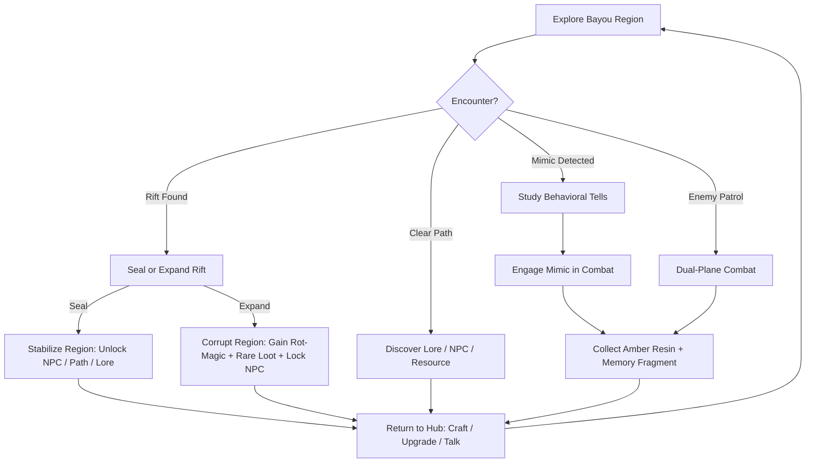
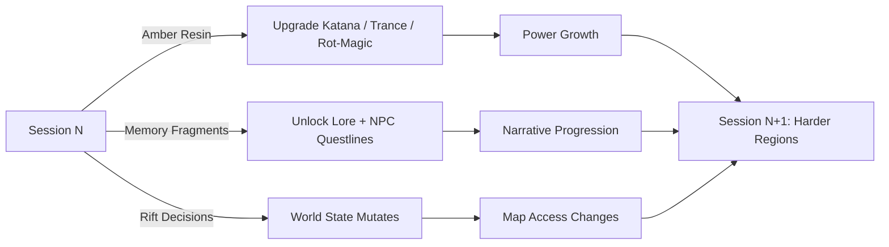

# Amber Rift

## Title & Genre

| Field | Value |
|-------|-------|
| **Title** | Amber Rift |
| **Genre** | Action RPG / Narrative |
| **Subgenre** | Souls-adjacent Metroidvania with dual-plane combat |
| **Engine** | Unreal Engine 5 (Nanite for environment density, Lumen for dynamic bayou lighting) |
| **Platforms** | PC (Steam/Epic Games Store), PlayStation 5, Xbox Series X/S |
| **Monetization** | Premium single purchase ($59.99) with two paid post-launch story DLC chapters |
| **ESRB Rating** | M (Mature) -- Violence, Atmospheric Horror, Mild Language |
| **PEGI** | 18 |
| **CERO** | D (17+) |
| **Target Session** | 45-90 minutes |
| **Estimated Playtime** | 28-35 hours main story, 55-65 hours completionist |

---

## Vision Statement

Amber Rift is a dual-plane action RPG set in the Bayou of Fractured Echoes, where the player -- a twilight shaman wielding a fractal katana -- must heal or exploit a dimensional wound tearing reality apart. Every combat encounter plays out across two overlaid dimensions simultaneously: the living bayou and the rotting one. Every choice to seal or expand a rift permanently reshapes the world, NPC allegiances, and available paths. The game exists because no other action RPG makes dimensional awareness the core combat skill -- reading two planes at once, feeling invisible enemies through haptic feedback, and deciding whether to save a dying region or sacrifice it for power. It is equal parts meditation and violence, structured around the thesis that the most satisfying combat systems emerge when players must perceive more than they can see.

---

## Core Loop



### Minute-to-Minute Breakdown

The player spends roughly 70% of each session in exploration and combat, 20% in rift-crafting decisions, and 10% at the hub (crafting, NPC dialogue, upgrading). A typical loop cycle runs 8-12 minutes:

1. **Explore** -- Navigate a bayou region. The minimap shows only the living plane; the rotting plane is felt through audio distortion, haptic vibration on the controller, and subtle color bleeding at screen edges. The player reads environmental cues (unnatural stillness = mimic nearby; amber glow = rift proximity; distorted audio = rotting-plane enemy approaching).

2. **Detect Threat** -- Mimics reveal themselves through 7 behavioral tells (detailed in Mechanics section). The player studies the environment before engaging. Rushing in triggers ambush states where multiple mimics attack simultaneously.

3. **Dual-Plane Combat** -- The fractal katana slashes through both dimensions at once. Enemies exist in one plane but project attack telegraphs into the other. The player dodges in the living plane based on visual cues from the rotting plane (red afterimages, distortion ripples). Controller vibration patterns encode rotting-plane enemy positions -- a low pulse means distant, a rapid buzz means immediate threat.

4. **Shaman Trance** -- Pressing L3/LT (PS5: adaptive trigger half-pull) slows time to 40% and overlays both planes visually. The player reads weak points (glowing amber nodes on rotting-plane enemies), chains combo attacks, and targets rift tears to pull enemies through dimensions. Trance drains a focus meter that refills through successful combat hits and studying mimics.

5. **Loot and Decide** -- Defeated enemies yield amber resin (currency), memory fragments (lore/NPC dialogue), and occasionally crafting reagents. Rift encounters force the seal/expand decision -- the core moral and economic axis of the game.

6. **Return to Hub** -- The Twilight Shrine hub is the only safe zone. Here the player crafts upgrades from amber resin, speaks with NPCs whose availability shifts based on regional corruption state, and reads collected memory fragments to piece together the bayou's history.

---

## Meta Loop

### Session-to-Session Progression



### Progression Axes

| Axis | What Grows | How It Grows | Growth Feel |
|------|-----------|--------------|-------------|
| **Katana Mastery** | Attack speed, combo length, dimensional reach (slash arc extends deeper into rotting plane) | Amber resin spent at forge + combat milestones (100 enemies slain in trance, 50 mimics identified before ambush) | Tangible power -- early combat feels deliberate and heavy; late combat feels like conducting an orchestra of dimensional slashes |
| **Trance Depth** | Focus meter capacity, trance duration (3s base to 8s max), weak-point visibility, combo chaining window | Defeating bosses + collecting specific memory fragments called "Echo Shards" (37 total) | Perception expansion -- the player literally sees more of the rotting plane over time, learning to read the invisible world |
| **Rot-Magic Arsenal** | 9 active spells unlocked by expanding rifts (rot path) or by finding hidden shrines (heal path) | Each expanded rift unlocks 1 rot-magic ability; sealed rifts unlock passive buffs instead | Branching power fantasy -- rot mages get offensive spells (gravity well, decay bolt, dimensional anchor); healers get defensive and exploration abilities (barrier, path restoration, NPC vision) |
| **World State** | Regional corruption level (0-5 scale per region, 12 regions total), NPC trust scores, available merchants/questgivers | Every seal/expand decision shifts 1-3 regions by 1 point. Major story decisions shift 3-5 regions. | The map is a living document -- returning to a previously safe region that the player chose to corrupt is viscerally disturbing. The bayou remembers. |
| **Lore Comprehension** | Memory fragment collection (142 total), NPC dialogue trees, environmental story vignettes | Exploration + mimic drops + NPC trust thresholds | Understanding is its own reward -- the central mystery of the amber rift unfolds non-linearly. Early fragments are cryptic; late fragments recontextualize everything. |

### Difficulty Scaling

The game does not use traditional difficulty selection. Instead, difficulty is emergent from world state:

- **Corrupted regions** have harder enemies (rot-enhanced variants with new attack patterns), more mimics, and fewer checkpoints -- but yield 40% more amber resin and drop exclusive rot-magic reagents.
- **Healed regions** have balanced encounters, full NPC services, and shortcut paths -- but fewer rare resources.
- The player's power growth outpaces baseline difficulty, ensuring that regions the player has outleveled feel satisfying to traverse, while newly corrupted regions maintain tension.

---

## Game Mechanics

### Primary Mechanic: Dimension Slash

The fractal katana is the player's only weapon throughout the entire game. It has no upgrade tree that adds new weapons -- instead, the katana itself evolves in how it interacts with the two planes.

**Base Mechanics:**

| Property | Base Value | Max Value | How Upgraded |
|----------|-----------|-----------|--------------|
| Slash reach (living plane) | 1.8m | 3.2m | Forge upgrades (amber resin) |
| Slash reach (rotting plane) | 0.9m | 2.8m | Trance depth level |
| Combo chain length | 3 hits | 9 hits | Katana mastery milestones |
| Dimensional bleedthrough | 10% damage reflects to other plane | 55% damage reflects | Echo Shard collection |
| Trance combo window | 1.2 seconds | 2.8 seconds | Trance depth level |

**Combo System:**

The katana has 5 input types: light slash (Square/X), heavy slash (Triangle/Y), dimensional thrust (R1/RB -- extends reach into rotting plane only), trance enter (L3/LT half-pull), and rift tear (L2/LT full-pull -- pulls an enemy through dimensions if a rift tear is nearby). Combos are direction + input:

- **Light x3** -- Standard three-slash chain ending with a forward step
- **Light x2, Heavy** -- Third hit becomes a dimensional cleave that hits both planes simultaneously
- **Heavy, Light x2** -- Opening heavy stun, followed by two rapid counters
- **Light, Dimensional Thrust, Heavy** -- Poke into rotting plane, pull enemy toward player, overhead slam
- **Any combo ending in Rift Tear** -- If a rift tear exists within 4m, the final hit pulls the target through dimensions, dealing 3x damage and staggering all nearby enemies in both planes

There are 14 total combo strings. The game teaches 4 through tutorials; the remaining 10 are discovered through experimentation and NPC hints. Each discovered combo is logged in a "Katana Codex" that tracks mastery (S-rank requires landing the combo 50 times in combat without interruption).

**Skill Ceiling:**

A skilled player can maintain a trance state indefinitely by landing hits that refill the focus meter faster than it drains. This creates a flow state where the player alternates between:
1. Normal combat (managing two planes through audio/haptic cues)
2. Trance overlay (reading weak points, targeting rift tears)
3. Extended trance chains (high-risk, high-reward -- one missed dodge drops trance and leaves the player vulnerable for 1.5 seconds)

The dimensional bleedthrough stat means that late-game katana builds deal meaningful damage to enemies in the unseen plane without needing trance -- the player effectively fights two battlefields at once.

### Secondary Mechanic: Mimic Ecology

Mimics are the primary enemy type. There are 6 mimic families with 47 total variants. Every static object in the bayou could be a mimic -- logs, treasure chests, lanterns, bridges, grave markers, moss patches, hanging vines, and even sections of water.

**Detection System:**

Mimics have 7 behavioral tells that signal their true nature before they attack. The player must learn to read these tells visually and auditorily:

| Tell | Visual Cue | Audio Cue | Mimic Families That Use It |
|------|-----------|-----------|---------------------------|
| **Amber shimmer** | Faint golden pulse on object surface, 0.3s duration, repeats every 4-6s | None | Log, Chest, Lantern |
| **Unnatural stillness** | Object does not sway with bayou wind; surrounding foliage moves but mimic object is frozen | Ambient sound drops to silence within 3m radius | All families |
| **Thermal distortion** | Heat-haze effect around object edges | None | Bridge, Water |
| **Shadow mismatch** | Object's shadow faces wrong direction relative to light source | None | All families (only visible in living plane during daytime segments) |
| **Echo displacement** | Sound of player's footsteps returns slightly delayed or pitch-shifted near the mimic | Footstep echo is 0.15s delayed and 1 semitone flat | All families |
| **Gravitational drift** | Small loose objects (leaves, pebbles) slowly drift toward the mimic over 2-3 seconds | None | Chest, Lantern, Grave |
| **Memory bleed** | Faint whisper of the mimic's past identity plays when the player is within 2m | 2-second voice whisper unique to each mimic's origin story | All families (only after Trance Depth level 3) |

**Adaptive Mimic AI:**

The mimic AI tracks the player's detection patterns and adapts over the course of the game:

- If the player consistently spots mimics via amber shimmer, mimics begin suppressing that tell after region corruption level 3, reducing the shimmer's visibility by 60%.
- If the player relies on trance mode for detection, mimics learn to briefly cloak their weak points during trance, requiring faster identification.
- Mimics in groups coordinate ambush timing -- the player who rushes past one mimic to attack another triggers a synchronized strike from both.

**Mimic Families:**

| Family | Disguise Forms | Attack Pattern | Amber Resin Yield | Memory Fragment Type |
|--------|---------------|----------------|-------------------|---------------------|
| **Hollow Bark** (12 variants) | Logs, stumps, root masses | Grapple + slow constriction, splits into 2-4 smaller mimics at 30% HP | 8-15 resin | Nature memories (who they were before the rift) |
| **Gilded Trap** (9 variants) | Treasure chests, offering bowls, weapon racks | Snap attack + poison cloud + loot scatter (drops real items as bait) | 15-25 resin | Material memories (what they hoarded in life) |
| **Lantern Wraith** (7 variants) | Lanterns, torches, campfire remnants | Fire burst + flight pattern + illumination flare that blinds for 1.5s | 10-18 resin | Guidance memories (who they guided or misled) |
| **False Crossing** (6 variants) | Bridges, rope crossings, stepping stones | Collapse + environmental hazard (water drag, fall damage, rotting-plane pull) | 12-20 resin | Connection memories (relationships severed by the rift) |
| **Grave Echo** (8 variants) | Gravestones, altars, offering shrines | Summon 2-3 weaker mimics + area denial + curse debuff | 14-22 resin | Ancestral memories (the dead who remember the bayou before) |
| **Still Water** (5 variants) | Pools, puddles, still bayou sections | Vortex pull + drowning mechanic + reflection attack (copies player's last combo) | 20-30 resin | Truth memories (what the bayou reflects about the player's choices) |

### Secondary Mechanic: Rift Crafting

The player collects amber resin from defeated mimics and environmental deposits. Amber resin serves as both currency (for upgrades) and crafting material (for rift manipulation). The player chooses between two actions at every rift:

**Seal Rift:**
- Costs 20-40 amber resin (scales with region corruption level)
- Reduces regional corruption by 1 point
- Reveals 1 hidden path or NPC in that region
- Unlocks a passive buff (health regen in that region, mimic detection radius +15%, NPC shop discount)
- The sealed rift becomes a permanent waypoint for fast travel
- NPCs in that region gain trust (+10 per seal)

**Expand Rift:**
- Costs 10-20 amber resin (cheaper than sealing)
- Increases regional corruption by 1 point
- Unlocks 1 rot-magic ability from a pool of 9
- Spawns 2-3 rare enemy variants unique to high-corruption zones
- Closes 1 NPC questline in that region permanently
- Reduces NPC trust (-15 per expansion)
- The expanded rift becomes an unstable shortcut -- fast travel is available but has a 30% chance of spawning an ambush on arrival

**Rot-Magic Abilities (9 total, unlocked via expansion):**

| # | Ability | Cost | Effect | Cooldown |
|---|---------|------|--------|----------|
| 1 | **Decay Bolt** | Expand Rift 1 | Ranged projectile that deals rot damage over 4 seconds; enemies take 15% more damage from katana while decaying | 8s |
| 2 | **Gravity Well** | Expand Rift 2 | Area effect that pulls all enemies within 8m toward a point for 3 seconds; combos with dimensional thrust | 12s |
| 3 | **Dimensional Anchor** | Expand Rift 3 | Pin an enemy in place for 2.5 seconds; prevents dimension-shifting enemies from teleporting | 15s |
| 4 | **Rot Shield** | Expand Rift 4 | Absorb next 3 hits; stored damage converts to a burst attack on next katana swing | 20s |
| 5 | **Amber Chains** | Expand Rift 5 | Tether 2-4 enemies together; damage to one cascades 30% to all tethered targets | 18s |
| 6 | **Rift Step** | Expand Rift 6 | Teleport 6m in any direction through a micro-rift; deals damage to enemies at both endpoints | 10s |
| 7 | **Memory Flay** | Expand Rift 7 | Extract a memory fragment from a living enemy, stunning it for 3 seconds and revealing its rotting-plane projection permanently | 25s |
| 8 | **Void Collapse** | Expand Rift 8 | Detonate an existing rift tear, dealing massive AoE damage to both planes; destroys the rift tear permanently | 45s |
| 9 | **Amber Storm** | Expand Rift 9 (requires 3+ regions at corruption 4+) | Channel for 2 seconds, then unleash a barrage of 12 dimensional slashes across a 12m arc; each slash hits both planes | 60s |

**Heal-Path Abilities (unlocked via sealing, replacing rot-magic slots):**

| # | Ability | Seal Cost | Effect | Cooldown |
|---|---------|-----------|--------|----------|
| 1 | **Living Barrier** | Seal Rift 1 | Projectile-absorbing wall for 4 seconds | 14s |
| 2 | **Path Restoration** | Seal Rift 2 | Rebuild a collapsed bridge or blocked path for 60 seconds | 20s |
| 3 | **NPC Vision** | Seal Rift 3 | See all NPCs and quest markers in current region for 30 seconds | 25s |
| 4 | **Mend Wound** | Seal Rift 4 | Heal 25% max health over 5 seconds; halves poison/curse duration | 18s |
| 5 | **Echo Recall** | Seal Rift 5 | Mark current position; die or use again to return to mark with 50% health | 30s |
| 6 | **Nature's Grasp** | Seal Rift 6 | Roots erupt from ground, immobilizing enemies in 6m radius for 3 seconds | 16s |
| 7 | **Amber Sight** | Seal Rift 7 | All mimics in 20m radius are highlighted for 8 seconds, regardless of tell suppression | 22s |
| 8 | **Twilight Mend** | Seal Rift 8 | Restore a corrupted region's visual state for 60 seconds, temporarily removing corruption visual effects and revealing hidden lore objects | 35s |
| 9 | **Fracture Heal** | Seal Rift 9 (requires 3+ regions at corruption 0-1) | Permanently reduce a region's corruption by 2 (instead of 1); costs double amber resin | Single use per region |

### Difficulty Progression Table

The game has 6 chapters. Each chapter introduces new mechanical complexity while escalating existing systems:

| Chapter | Regions | New Mechanics | Enemy Complexity | Mimic Tells Active | Trance Depth Available | World State Impact |
|---------|---------|---------------|-----------------|-------------------|----------------------|-------------------|
| **1: Descent** | 2 (tutorial zone + first bayou) | Basic slash, dodge, first mimic encounter, first rift | 3 enemy types, 1 mimic family (Hollow Bark) | Amber shimmer, unnatural stillness | Level 1 (3s trance, basic weak points) | First seal/expand decision (narrative-gated, cannot be reversed) |
| **2: Echoes** | 3 (deeper bayou, first settlement, sunken temple) | Dimensional thrust, combo chains (4 combos), Lantern Wraith mimics, NPC trust system | 6 enemy types, 3 mimic families | + Thermal distortion, shadow mismatch | Level 2 (4s trance, combo chaining) | 4-5 seal/expand decisions; first NPC can be permanently lost |
| **3: Fractures** | 2 (expanding rift network, corrupted sanctuary) | Rift crafting (full system), rot-magic abilities 1-3, False Crossing mimics, environmental puzzles requiring dual-plane awareness | 10 enemy types, 4 mimic families, first mini-boss | + Echo displacement | Level 3 (5s trance, memory bleed tell unlocks) | 6-8 seal/expand decisions; first region can reach corruption 5 (permadeath zone) |
| **4: Reckoning** | 3 (NPC hub under threat, deep swamp, mimic queen's domain) | All rot-magic abilities 4-6, Grave Echo mimics, NPC allegiance system (NPCs leave or join based on corruption), boss fights with dual-plane phases | 16 enemy types, 5 mimic families, 2 bosses | + Gravitational drift | Level 4 (6s trance, extended combo window) | 8-10 seal/expand decisions; multiple regions can be simultaneously corrupted or healed |
| **5: Convergence** | 2 (the rift source, the bayou's heart) | Still Water mimics, all rot-magic abilities 7-9, rift tear manipulation in combat, adaptive mimic AI at maximum aggression | 22 enemy types, all 6 mimic families, adaptive AI, 2 bosses | All 7 tells active; mimics suppress 2-3 tells based on player behavior | Level 5 (7s trance, permanent weak-point visibility for identified mimics) | Final world state snapshot; 5 distinct endings branch from cumulative corruption + key narrative choices |
| **6: Resonance** | 1 (the amber rift core) | Full moveset unlocked, final boss has 5 phases across both planes simultaneously, trance can be maintained indefinitely with perfect play | 1 boss, 5 phases, no mimics (narrative climax) | N/A | Level 5 (max) | Ending determined; post-game unlocks new game+ with inverted dimensions |

---

## World Design

### Map Structure

The Bayou of Fractured Echoes is an interconnected world (not open world) with 12 distinct regions arranged in a rough ring with the Twilight Shrine hub at the center. The map is Metroidvania-structured: early regions are gated by abilities unlocked later.

```
                    [The Breach]
                        |
              [Sunken Temple]----[Mimic Queen's Domain]
                  /                        |
    [Moss Hollows]                [The Rotting Heart]
          |                              |
    [First Bayou]              [Corrupted Sanctuary]
          |                              |
    [Twilight Shrine] -------- [Deep Swamp]
          |                              |
    [Misty Thickets]              [Rift Source]
          |                              |
    [Shattered Bridges]-----[The Hollow Crown]
                        |
                  [The Stillness]
```

**Fast Travel:** Sealed rifts serve as fast travel points. The player can fast travel to any sealed rift from the Twilight Shrine or from any other sealed rift. Expanded rifts allow fast travel but with a 30% ambush chance on arrival.

**Gating System:**

| Gate | Required Ability | Region Unlocked |
|------|-----------------|-----------------|
| Dimensional thrust reach 2.0m+ | Katana forge upgrade 3 | Sunken Temple, Deep Swamp |
| Trance depth level 3 | 5 Echo Shards collected | Corrupted Sanctuary, Mimic Queen's Domain |
| Path Restoration ability OR Rift Step ability | Heal path: Seal 2 rifts; Rot path: Expand 6 rifts | Shattered Bridges, The Stillness |
| Dimensional bleedthrough 30%+ | 15 Echo Shards collected | The Breach, The Rotting Heart |
| Amber Storm OR Fracture Heal | Full rot or full heal commitment | Rift Source, The Hollow Crown |

### Art Direction Pillars

1. **Living Decay** -- The living bayou is lush, humid, and green-gold with Spanish moss, cypress knees, and bioluminescent fungi. The rotting plane is the same geometry rendered in amber, rust, and ash -- frozen in mid-collapse, with crystallized amber formations where living tissue was. Both planes coexist; the player sees one clearly and feels the other.

2. **Dimensional Bleed** -- At trance depth level 3+, the rotting plane visually bleeds into the living plane during combat. Edges of objects shimmer, colors desaturate, and amber particles drift from rift tears. The visual intensity of this bleed is proportional to regional corruption -- healing a region reduces bleed, corrupting it intensifies bleed until the living plane is nearly indistinguishable.

3. **Mimic Uncertainty** -- Every environmental object is rendered with sufficient detail and behavioral fidelity that mimics are genuinely indistinguishable from real objects until the player has trained their perception. This is not a gimmick -- it is the foundational visual challenge. Art assets are built so that 40% of all static objects in each region are mimic-capable (whether currently a mimic or not).

4. **Memory as Texture** -- Memory fragments appear as floating amber shards that, when collected, project a brief visual vignette onto the environment -- a ghostly overlay showing the bayou as it was before the rift. These overlays are cumulative; collecting many fragments in one region gradually restores the visual memory of the pre-rift bayou, creating a parallel visual layer that exists alongside (and in tension with) the current corruption state.

### Visual Progression by Corruption Level

| Corruption Level | Living Plane Appearance | Rotting Plane Appearance | Environmental Effects | NPC Presence |
|----------------:|:------------------------|:--------------------------|:----------------------|:-------------|
| 0 (Pristine) | Vibrant green-gold, full foliage, clear water, bird sounds | Barely visible; faint amber glow at rift sites | Fireflies at night, gentle mist, merchant camps, healing springs | Full NPC services, all questgivers, unique dialogue |
| 1 (Touched) | Slight amber discoloration at edges, water has faint shimmer | Visible within 5m of player, crystalline amber growths on surfaces | Mist thickens slightly, occasional amber particles in air | Most NPCs present, 1-2 merchants may leave |
| 2 (Strained) | Half the foliage is amber-tinted, water is murky with oily sheen | Clearly visible within 10m, amber formations are 0.5-1m tall | Constant amber particle drift, audio has subtle reverb distortion | Half of NPCs present; questgivers give corrupted variants of their quests |
| 3 (Warped) | Most foliage is amber-rust, water is viscous and slow-moving, sky has amber tint | Fully visible at all times, amber formations 1-3m tall, mimic density +50% | Heavy amber fog (visibility 15m), audio distortion is constant, haptic vibration pulses randomly | Only 2-3 NPCs remain; merchants sell rot-specific items at premium |
| 4 (Collapsed) | Living plane is nearly identical to rotting plane; all green is gone, replaced by amber-rust decay | Dominant plane; living plane is the ghost overlay now | Near-zero visibility in amber fog (8m), constant audio distortion, haptic vibration is aggressive | 0-1 NPCs; the region is functionally a hostile combat zone with rare loot |
| 5 (Consumed) | The region exists only in the rotting plane; the living version is a memory accessible only via Twilight Mend ability | The only reality; crystalline amber structures dominate, new enemy types spawn exclusively here | Complete sensory distortion; screen edges ripple, audio is deeply distorted, haptic is intense and irregular | No NPCs. The region is permanently hostile. Post-game only: a unique boss spawns here. |

### Audio Design

**Living Plane Soundscape:** Bioluminescent insect hum, distant bird calls, flowing water, creaking cypress trees, rain on leaves, NPC campfire chatter.

**Rotting Plane Soundscape:** Reversed and pitch-shifted versions of living plane audio. Amber crystallization sounds (glass-like cracking). Distant whispers from memory fragments. The rotting plane has no silence -- even "quiet" moments have a low-frequency drone.

**Combat Audio:** Every katana impact generates a dimensional echo -- a secondary sound that plays 0.2 seconds after the primary impact, pitched differently based on which plane the target occupies. Skilled players learn to read combat state through audio alone.

**Haptic Feedback (PS5 DualSense):**
- Living plane enemy approaching: left-side light vibration
- Rotting plane enemy approaching: right-side heavy vibration
- Mimic detected nearby: rhythmic pulse (heartbeat pattern)
- Rift proximity: continuous low-frequency hum
- Trance activation: adaptive trigger resistance increases, then releases on exit

---

## Narrative

### Story Spine (8-Point Structure)

1. **Equilibrium:** The player character is a twilight shaman -- one of an order that maintained the boundary between the living world and the rotting dimension for centuries. The bayou was their sacred ground. The shamans performed seasonal rites at 12 anchor points (one per region) to keep the dimensional membrane intact.

2. **Inciting Incident:** Six months before the game begins, an event called "The First Fracture" cracked the dimensional membrane at the bayou's heart. The amber rift -- a wound in reality -- began spreading outward from the center, corrupting the land and transforming every living thing it touched into mimics: entities trapped between two planes, frozen in the form of objects they were near when the rift touched them.

3. **First Complication:** The player awakens at the bayou's edge with fragmented memories, holding a fractal katana they do not remember forging. The Twilight Shrine -- the shamans' last bastion -- contains only three survivors: a healer named Verath who distrusts the player, a mimic scholar named Coille who is secretly half-mimic themselves, and a child named Essa who can hear the mimics' memories but cannot speak.

4. **Rising Action:** As the player explores the bayou, seals or expands rifts, and collects memory fragments, a pattern emerges: the First Fracture was not an accident. The player's own katana was forged from the same amber that forms the rift. The player is not a survivor of the fracture -- they are its cause. The fractal katana was the instrument that cracked the membrane, wielded by the player in a previous life when they were the order's most powerful -- and most ambitious -- shaman.

5. **Midpoint Reversal:** At the story's midpoint, the player discovers a memory fragment showing the moment of the First Fracture from the rotting plane's perspective. The rift was not a wound -- it was a door. Something in the rotting dimension was calling out, and the player answered. The amber is not corruption -- it is the rotting dimension's attempt to communicate. The mimics are not monsters -- they are the bayou's inhabitants, transformed mid-sentence, mid-thought, mid-life.

6. **Crisis:** The player reaches the bayou's heart and faces the Rift Source: a massive amber formation that contains the consciousness of the rotting dimension itself. It reveals that it did not cause the transformation -- the player did, when they opened the door. The Rift Source offers a choice: close the door permanently (killing every mimic, erasing the rotting dimension, and restoring the bayou at the cost of an entire world of consciousness), or open it fully (merging the two dimensions, ending the separation but potentially destroying both).

7. **Climax:** The final boss is not the Rift Source -- it is the player's past self, preserved in amber, the original shaman who opened the door and was trapped between dimensions when it partially closed. The past self believes merging is the only redemption; the player must decide whether to agree or reject their own history. The fight plays out across both planes simultaneously with five phases, each representing a stage of the player's forgotten life.

8. **Resolution:** Five endings based on cumulative world state and key narrative choices:

| Ending | Condition | Outcome |
|--------|-----------|---------|
| **The Mended Bayou** | Total corruption below 12 (avg less than 1 per region), player chose to close the door | Rifts seal permanently. Every mimic dies. The bayou regrows. The player lives as the last shaman, keeper of a dead dimension's memory. Bittersweet. |
| **The Merged World** | Total corruption above 48 (avg above 4 per region), player chose to open the door fully | Dimensions merge. The bayou becomes a new hybrid reality. Mimics regain consciousness but lose their original forms. The player becomes the bridge between worlds. Transformative. |
| **The Amber Compact** | Mixed corruption, player chose to maintain the partial rift | The rift remains as it is -- a wound that will never fully heal. The player becomes the new anchor, maintaining the boundary forever. The bayou exists in permanent tension. Sacrificial. |
| **The Shaman's Sacrifice** | Player collected all 142 memory fragments and 37 Echo Shards before the final boss | The player absorbs all mimics' memories and the Rift Source's consciousness, gaining complete understanding of both dimensions. They use this knowledge to rewrite the First Fracture, preventing it entirely -- but erasing themselves from existence. The bayou never fractures. The player is never born. Selfless. |
| **The Hollow Victory** | Player defeated the past self but chose neither to close nor open the door | The rift destabilizes and collapses unpredictably. Half the bayou heals, half is consumed. The player survives but the world state is fractured beyond repair. Ambiguous. |

### Tone Spectrum (7-Axis)

| Axis | Value (1-7) | Description |
|------|:-----------:|-------------|
| **Hope / Despair** | 3 | The bayou can be healed -- but healing requires sacrifice and understanding, not just force |
| **Wonder / Horror** | 4 | The rotting dimension is beautiful in its alien way; horror comes from familiarity, not grotesquerie |
| **Clarity / Mystery** | 5 | The central mystery is deep and non-linear; satisfaction comes from gradual revelation, not exposition |
| **Action / Contemplation** | 3 | Combat is the primary engagement, but the game rewards stillness -- studying mimics, reading environments, listening |
| **Order / Chaos** | 4 | The bayou is entropic; the player is the force of structure, but their own past is the source of chaos |
| **Community / Isolation** | 5 | The player is largely alone; NPCs are fragile, contingent, and can be permanently lost. Connection is precious because it is optional and reversible. |
| **Mercy / Cruelty** | 3 | The game does not judge the player's choices. Both heal and rot paths are valid. But it makes the cost of each choice viscerally felt. |

### Characters

| Character | Role | Theme | Memory Fragments | Location |
|-----------|------|-------|:----------------:|----------|
| **The Shaman (Player)** | Twilight Shaman, cause of the First Fracture | Identity, responsibility, the weight of forgotten actions | N/A (player discovers their own) | Twilight Shrine (hub) |
| **Verath** | Healer, senior survivor of the shaman order | Distrust, conditional acceptance, the burden of knowing someone's sins | 14 fragments | Twilight Shrine; leaves if hub region corruption exceeds 3 |
| **Coille** | Mimic scholar, secretly half-mimic (mother was a mimic who chose to remain transformed) | Duality, belonging, the lie of clear categories | 11 fragments | Twilight Shrine; reveals true nature at trust 80+ |
| **Essa** | Child oracle, hears mimic memories, cannot speak | Innocence as perception, communication without words, the voice of the forgotten | 8 fragments (communicated through environmental vignettes) | Twilight Shrine; dies if the player expands the rift in the hub region |
| **The Rift Source** | Consciousness of the rotting dimension | Loneliness, the desire to be known, communication as love | 22 fragments (scattered across all regions) | The Bayou's Heart (final zone) |
| **The Past Shaman** | Final boss; the player's previous incarnation trapped in amber | Self-confrontation, the question of whether past sins define present identity | 6 fragments (revealed during the final fight) | The Amber Core (final arena) |
| **Mira** | Wandering merchant who appears only in regions at corruption 0-1 | Commerce as connection, the refusal to engage with decay, practical morality | 7 fragments | Healed regions only; disappears entirely if the player corrupts all regions |
| **Thane** | Fallen shaman trapped mid-transformation into a mimic | The horror of in-between states, the desire to be completed (one way or another) | 9 fragments | Deep Swamp; appears as a gravestone at corruption 3+, as a partial mimic at corruption 2, and as a speaking NPC at corruption 0-1 |

---

## Player Personas

### P-003: Hiroshi Tanaka -- The RPG Addict

**Why Amber Rift fits:** Hiroshi treats every game as a completion challenge. Amber Rift offers 142 memory fragments, 37 Echo Shards, 14 combo strings to master (each with S-rank tracking), 12 regions with variable corruption states, 5 endings, and a Katana Codex that tracks every mechanical achievement. The depth of systems -- mimic detection, dual-plane combat, rift crafting -- provides the kind of mastery project Hiroshi lives for.

**Predicted Experience:**
- Hiroshi will immediately focus on mastering every combo and discovering the 10 hidden ones through experimentation.
- He will create multiple save slots to pursue both the heal path and the rot path simultaneously, comparing rot-magic and heal-ability effectiveness.
- He will spreadsheet mimic tell patterns and share findings on Discord.
- He may skip NPC dialogue initially to focus on mechanical mastery, then return for a "lore completion" pass.
- His biggest frustration will be if any ending requires mutually exclusive choices that demand a full second playthrough (it does not -- the game is designed so a single playthrough with careful choices can reach any ending).

### P-008: David Park -- The Achievement Hunter

**Why Amber Rift fits:** David plays for 100% completion. Amber Rift has a layered achievement system: combat achievements (S-rank all combos), exploration achievements (all 12 regions at each corruption state), narrative achievements (all 5 endings), collection achievements (all 142 fragments, all 37 shards), and mastery achievements (defeat each mimic family variant). The game's achievement system is fair -- no RNG-gated achievements, no time-limited exclusives, no bugged impossible achievements.

**Predicted Experience:**
- David will methodically work through regions, ensuring he collects every fragment before making seal/expand decisions that might lock content.
- He will appreciate that the game tracks world state history, allowing him to verify which regions he has visited at each corruption level.
- His 1-2 hour daily sessions map well to Amber Rift's 8-12 minute loop cycles -- he can complete 5-8 loop cycles per session.
- He will buy the DLC specifically for the additional achievements it adds.
- His primary concern will be whether the 5 endings require 5 full playthroughs (they do not -- New Game+ with inverted dimensions allows efficient ending collection).

### P-009: Liam O'Connor -- The Dedicated F2P

**Why Amber Rift fits:** Liam pays premium for games that respect his skill investment. Amber Rift is a premium game with no microtransactions, no battle pass, no energy system, and no pay-to-progress mechanics. Every ability, path, and ending is accessible through gameplay alone. The adaptive mimic AI ensures that skill -- not spending -- determines success. Liam is exactly the player who will become a vocal advocate for a game that treats him fairly.

**Predicted Experience:**
- Liam will master the dual-plane combat system as a point of pride, aiming to complete the game without using rot-magic abilities (pure katana + trance only).
- He will create detailed content (build guides, mimic detection tutorials, combo timing videos) for the community.
- He will stream or record his first playthrough, emphasizing the "pure skill" approach.
- He will advocate for the game specifically because it has no monetization beyond the initial purchase.
- His biggest frustration risk: if the game releases with performance issues on his hardware configuration (target: must run well on mid-range PC builds from 2-3 years ago, which is why min spec targets GTX 1060).

### P-020: Yuki Sato -- The Language-Challenged Player

**Why Amber Rift fits:** Amber Rift's narrative is delivered primarily through environmental storytelling, visual vignettes, and audio cues -- not walls of text. The mimic detection system is visual and auditory, not language-dependent. Memory fragments use voice-over in the player's selected language with optional subtitles. The game's localization plan includes full Japanese VO (not just subtitles), ensuring Yuki experiences the story at full fidelity.

**Predicted Experience:**
- Yuki will play on PS5 with Japanese VO and Japanese UI text.
- She will particularly enjoy the memory fragment vignettes -- short visual-audio sequences that convey story through atmosphere rather than dialogue.
- The haptic feedback system (which encodes rotting-plane enemy positions through vibration patterns) is language-independent and will be immediately useful to her.
- She will recommend the game to Japanese gaming communities if the localization quality is high.
- Her biggest frustration risk: if NPC dialogue trees rely too heavily on text-based clues (they do not -- all 7 mimic tells are visual/audio). However, the NPC dialogue trees must be translated with cultural sensitivity, not just linguistic accuracy. Coille's reveal, Essa's silent communication, and Verath's conditional trust all require culturally nuanced translation.

---

## User Stories

### Exploration

1. As **Hiroshi (P-003)**, I want to discover all 12 regions and map their interconnections, so that I can plan optimal traversal routes for my completionist playthrough.

2. As **David (P-008)**, I want the minimap to display corruption levels for each visited region, so that I can track which regions I need to revisit at different corruption states.

3. As **Liam (P-009)**, I want environmental navigation to rely on visual and audio cues rather than quest markers, so that my exploration skill is rewarded over following GPS lines.

4. As **Yuki (P-020)**, I want all exploration cues (mimic tells, rift proximity, environmental hazards) to be communicated through visual and haptic feedback, so that language barriers do not affect my ability to navigate.

5. As **Hiroshi (P-003)**, I want hidden paths to require specific abilities to unlock, so that backtracking feels rewarding rather than tedious.

### Core Mechanics (Combat)

6. As **Liam (P-009)**, I want the combo system to reward experimentation with 10 discoverable combo strings beyond the 4 tutorial combos, so that my mechanical mastery feels earned rather than purchased.

7. As **Hiroshi (P-003)**, I want each combo string tracked in a Katana Codex with mastery rank (D through S), so that I can measure and optimize my combat performance.

8. As **David (P-008)**, I want the trance system to have a visible focus meter with precise numerical readout, so that I can optimize my trance timing to the frame.

9. As **Liam (P-009)**, I want skilled play to enable indefinite trance maintenance through combat hits that refill the focus meter, so that a perfect-play run is mechanically possible.

10. As **Yuki (P-020)**, I want haptic feedback patterns to communicate rotting-plane enemy positions clearly, so that I can react to threats I cannot see without relying on visual UI elements.

11. As **Hiroshi (P-003)**, I want dimensional bleedthrough to scale with my progression, so that late-game combat feels like fighting two battlefields simultaneously rather than toggling between modes.

### Core Mechanics (Mimic Detection)

12. As **David (P-008)**, I want all 7 mimic detection tells documented in an in-game codex that unlocks progressively, so that I can systematically learn and master each tell.

13. As **Liam (P-009)**, I want mimic AI to adapt to my detection patterns over the course of the game, so that I cannot rely on a single detection strategy and must continuously improve.

14. As **Hiroshi (P-003)**, I want mimic families to have distinct behavioral patterns and attack movesets, so that identifying the mimic type before engagement gives a tactical advantage.

15. As **Yuki (P-020)**, I want the "unnatural stillness" tell to be detectable through audio (ambient sound dropping to silence), so that I can identify mimics even when visual tells are suppressed.

16. As **David (P-008)**, I want each mimic variant to have a unique memory fragment type, so that collecting all fragments requires engaging with all mimic families across all regions.

### Core Mechanics (Rift Crafting)

17. As **Hiroshi (P-003)**, I want the seal/expand decision to have permanent, visible consequences on the world map, so that each choice feels weighty and strategic.

18. As **Liam (P-009)**, I want both the heal path and the rot path to be equally viable for game completion, so that my preference for defensive or offensive play is respected.

19. As **David (P-008)**, I want rot-magic and heal-ability slots to be swappable at the Twilight Shrine, so that I am not permanently locked out of abilities I want to experiment with.

20. As **Hiroshi (P-003)**, I want the world state to affect available endings, so that my cumulative choices across the entire game matter for the narrative resolution.

### Narrative

21. As **Yuki (P-020)**, I want memory fragments to tell their stories through visual vignettes rather than text dumps, so that I can fully experience the narrative regardless of reading speed.

22. As **Hiroshi (P-003)**, I want all 5 endings to be achievable without starting a completely new game, so that I can experience the full narrative arc through New Game+.

23. As **David (P-008)**, I want NPC trust to be quantified and visible, so that I can optimize my interactions to unlock all NPC questlines in a single playthrough.

24. As **Liam (P-009)**, I want the central narrative mystery to reward careful exploration rather than gating story progress behind combat difficulty, so that my experience is not blocked by a single boss fight.

25. As **Yuki (P-020)**, I want Coille's reveal and Essa's silent communication to be culturally adapted in the Japanese localization, so that the emotional impact lands correctly in my language.

### Progression

26. As **David (P-008)**, I want the katana's stat progression to be visible and incremental, so that I can track exactly how each upgrade changes my combat effectiveness.

27. As **Hiroshi (P-003)**, I want trance depth to unlock perceptual abilities (seeing more of the rotting plane) rather than just numerical buffs, so that progression changes how I experience the game world.

28. As **Liam (P-009)**, I want the difficulty to scale emergently from world state rather than a settings menu, so that my choices create my own challenge level.

29. As **David (P-008)**, I want New Game+ to invert the dimensional overlay (rotting plane becomes primary, living plane becomes the hidden one), so that replaying feels like a new game rather than a retread.

30. As **Hiroshi (P-003)**, I want 37 Echo Shards to be collectible across all regions, so that thorough exploration is rewarded with tangible power increases.

### Accessibility

31. As **Yuki (P-020)**, I want full Japanese voice-over for all NPC dialogue and memory fragments, so that I experience the narrative in my native language without reading subtitles during combat.

32. As **David (P-008)**, I want a combat log that records the last 30 seconds of combat events, so that I can analyze my performance and identify mistakes after difficult encounters.

33. As **Liam (P-009)**, I want customizable control bindings for all katana inputs, so that I can optimize my layout for my preferred playstyle and hardware.

34. As **Yuki (P-020)**, I want the memory bleed tell (voice whispers from mimics) to have optional subtitle overlays, so that I do not miss narrative content due to audio clarity issues.

### Social

35. As **Liam (P-009)**, I want a ghost data system that shows other players' paths and choices in my world as faint amber traces, so that I feel connected to the community without direct multiplayer.

---

## Monetization

### Revenue Model: Premium ($59.99)

Amber Rift is a premium single-purchase game with no microtransactions, no battle pass, no in-game store, and no energy system. The only post-launch paid content is two story DLC chapters sold at $14.99 each or $24.99 as a season pass.

**Why Premium Fits This Game:**

1. **Design Integrity:** The seal/expand decision system is the game's core tension. If players could purchase amber resin or rift-crafting materials with real money, the entire moral weight of the system collapses. The player must earn the right to heal or corrupt through gameplay.

2. **Audience Alignment:** Action RPG players on PC and console expect and prefer premium models. The target audience (ages 16-40, core gamers) views microtransactions in narrative-driven games as hostile to the experience.

3. **Competitive Positioning:** The game competes with Hollow Knight: Silksong, Elden Ring, and Ori-style Metroidvanias -- all premium titles. A F2P model would signal a different product category and attract the wrong audience.

4. **Revenue Predictability:** Premium provides front-loaded revenue that funds the DLC development. No live-service treadmill means the team can focus on quality content rather than engagement metrics.

### DLC Roadmap

| DLC | Title | Content | Price | Launch Window | Estimated Playtime |
|-----|-------|---------|-------|---------------|-------------------|
| **DLC 1** | *The Hollow Crown* | 3 new regions (The Hollow Crown, The Stillness, The Beneath), 2 new mimic families (Crown Echo, Deep Mimic), 12 new memory fragments, 1 new ending, New Game++ mode | $14.99 | Month 6 post-launch | 10-14 hours |
| **DLC 2** | *The Other Side* | The full game from the rotting plane's perspective -- inverted dimensions, new protagonist (Essa as playable character), 4 new regions, 1 new ending | $14.99 | Month 12 post-launch | 15-20 hours |
| **Season Pass** | Both DLCs bundled | All above | $24.99 | Available at launch | 25-34 hours |

### Revenue Projections (4 Scenarios)

| Scenario | Units Sold (Year 1) | Gross Revenue | Platform Cut (30%) | Net Revenue | Total Budget | Profit/Loss (Year 1) |
|----------|:-------------------:|:-------------:|:-------------------:|:-----------:|:------------:|:--------------------:|
| **Modest** | 150,000 | $8,998,500 | $2,699,550 | $6,298,950 | $10,500,000 | -$4,201,050 |
| **Solid** | 400,000 | $23,996,000 | $7,198,800 | $16,797,200 | $10,500,000 | +$6,297,200 |
| **Strong** | 800,000 | $47,992,000 | $14,397,600 | $33,594,400 | $10,500,000 | +$23,094,400 |
| **Breakout** | 2,000,000 | $119,980,000 | $35,994,000 | $83,986,000 | $10,500,000 | +$73,486,000 |

The modest scenario does not break even in Year 1 on base game sales alone. DLC revenue (25% attach rate on the season pass at $24.99) adds approximately $562K net, bringing Year 1 to approximately -$3.64M. This scenario requires either long-tail sales over 18-24 months or significant DLC attach to reach profitability. The solid scenario (400K units) is the realistic target for profitability within Year 1.

The modest scenario assumes average review scores of 75-80 and limited marketing budget. The solid scenario assumes 82+ reviews and moderate influencer coverage. The strong scenario assumes 88+ reviews, strong word-of-mouth, and featured platform placement. The breakout scenario assumes 92+ reviews, viral community content, and major platform featuring.

---

## Production Plan

### Team Structure

| Role | Count | Phase | Monthly Cost (Loaded) | Total Cost |
|------|:-----:|:-----:|:---------------------:|:----------:|
| **Game Director** | 1 | All phases | $12,000 | $312,000 |
| **Lead Designer (Combat)** | 1 | All phases | $10,000 | $260,000 |
| **Lead Designer (Systems)** | 1 | Phases 1-4 | $10,000 | $200,000 |
| **Level Designer** | 2 | Phases 2-5 | $8,000 | $368,000 |
| **Combat Designer** | 1 | Phases 2-5 | $8,500 | $221,000 |
| **Narrative Designer** | 1 | Phases 1-4 | $9,000 | $234,000 |
| **Programmer (Gameplay)** | 3 | Phases 2-5 | $9,000 | $774,000 |
| **Programmer (Engine/Tools)** | 2 | Phases 1-5 | $10,000 | $440,000 |
| **Programmer (AI)** | 1 | Phases 2-5 | $9,500 | $247,000 |
| **Environment Artist** | 3 | Phases 2-5 | $8,500 | $714,000 |
| **Character Artist** | 2 | Phases 1-4 | $8,500 | $340,000 |
| **VFX Artist** | 1 | Phases 3-5 | $8,000 | $160,000 |
| **Animator** | 2 | Phases 2-5 | $8,500 | $510,000 |
| **Audio Director / Composer** | 1 | Phases 3-5 | $9,000 | $180,000 |
| **Sound Designer** | 1 | Phases 3-5 | $7,500 | $135,000 |
| **UI/UX Designer** | 1 | Phases 2-5 | $8,000 | $208,000 |
| **QA Lead** | 1 | Phases 3-6 | $7,000 | $182,000 |
| **QA Tester** | 3 | Phases 4-6 | $5,500 | $297,000 |
| **Producer** | 1 | All phases | $10,000 | $260,000 |
| **Community Manager** | 1 | Phases 4-6 | $6,500 | $143,000 |
| **Localization PM** | 1 | Phases 5-6 | $7,500 | $97,500 |

**Total Team:** 33 people at peak (Phases 3-4)
**Total Personnel Cost:** $6,402,500 (loaded, including benefits and taxes)

### Timeline (26 Months)

| Month | Phase | Milestone | Key Deliverables |
|:-----:|:-----:|-----------|-----------------|
| 1 | **Phase 1: Pre-Production** | Concept lock | GDD complete, art bible, technical design document, engine prototype with basic dual-plane rendering |
| 2 | Phase 1 | Vertical slice plan | Combat prototype with 2 enemies, 1 mimic, basic trance, 1 test arena |
| 3 | Phase 1 | Vertical slice | Playable 10-minute demo: 1 region, 3 mimic types, dual-plane combat, rift crafting, 1 NPC |
| 4 | **Phase 2: Production Start** | Core systems | Katana combo system (all 14 strings), mimic AI framework, rift crafting backend, region streaming |
| 5-6 | Phase 2 | First 3 regions | First Bayou, Moss Hollows, Misty Thickets at gray-box level with full combat |
| 7-8 | Phase 2 | Enemy roster v1 | 16 enemy types, 3 mimic families complete with all tells and adaptive AI |
| 9 | **Phase 3: Mid-Production** | Content surge | Regions 4-8 at gray-box, narrative implementation begins, NPC dialogue trees |
| 10-11 | Phase 3 | Art production | All 12 regions at final art quality, character models finalized, VFX pipeline complete |
| 12-13 | Phase 3 | Audio production | Full soundtrack recorded, sound design for all combat events, haptic feedback patterns tuned |
| 14-15 | **Phase 4: Late Production** | Content complete | All 12 regions fully playable, all 6 chapters, all 5 endings, all NPCs, all memory fragments placed |
| 16-17 | Phase 4 | Alpha | Internal playtest complete, all features functional, first balance pass on combat and economy |
| 18-20 | **Phase 5: Beta and Polish** | Beta 1 | External playtest (500 players), localization begins (Japanese, French, German, Spanish, Portuguese, Korean, Chinese) |
| 21-22 | Phase 5 | Beta 2 | Public demo (1 region, 20-minute slice), balance iteration, performance optimization |
| 23 | Phase 5 | Content lock | No new features or content; all remaining effort on bugs, performance, and polish |
| 24 | **Phase 6: Launch Prep** | Submission | Platform certification (Sony, Microsoft, Steam), age rating submissions (ESRB, PEGI, CERO) |
| 25 | Phase 6 | Gold | Final build approved, day-one patch prepared, marketing campaign launches |
| 26 | Phase 6 | **Launch** | Game goes live on all platforms simultaneously |

### Budget Breakdown

| Category | Cost | Percentage |
|----------|:----:|:----------:|
| **Personnel** (salaries, benefits, taxes) | $6,402,500 | 61.0% |
| **Software and Tools** (Unreal license, Perforce, Jira, communication, dev kits) | $380,000 | 3.6% |
| **Hardware** (dev kits, workstations, test machines) | $240,000 | 2.3% |
| **Localization** (7 languages, full VO for Japanese, subtitles for others) | $520,000 | 5.0% |
| **Audio Production** (studio time, musicians, VO talent, licensing) | $310,000 | 3.0% |
| **QA and Testing** (external QA partner, platform compliance testing) | $280,000 | 2.7% |
| **Marketing** (trailers, PR, influencer outreach, platform featuring, events) | $1,200,000 | 11.4% |
| **Operations** (office, remote work stipends, legal, accounting) | $420,000 | 4.0% |
| **Platform Fees** (certification, age ratings) | $305,000 | 2.9% |
| **Contingency** (15% buffer) | $442,500 | 4.2% |
| **Total** | **$10,500,000** | **100%** |

---

## Technical Requirements

### PC Specifications

| Component | Minimum | Recommended |
|-----------|---------|-------------|
| **OS** | Windows 10 64-bit (version 1909+) | Windows 11 64-bit (version 23H2+) |
| **Processor** | Intel Core i5-8400 / AMD Ryzen 5 2600 | Intel Core i7-12700K / AMD Ryzen 7 5800X |
| **Memory** | 16 GB RAM | 32 GB RAM |
| **Graphics** | NVIDIA GTX 1060 6GB / AMD RX 580 | NVIDIA RTX 3080 / AMD RX 6800 XT |
| **DirectX** | Version 12 | Version 12 Ultimate |
| **Storage** | 45 GB SSD | 45 GB NVMe SSD |
| **Sound** | DirectX-compatible | DirectX-compatible + 3D audio support |
| **Peripherals** | Keyboard + Mouse or XInput controller | PS5 DualSense (for haptic) or Xbox controller |

### Console Targets

| Platform | Target Resolution | Target Framerate | Special Features |
|----------|:-----------------:|:----------------:|-----------------|
| **PlayStation 5** | 4K (dynamic, 1800p floor) | 60 FPS (Quality: 30 FPS with ray tracing) | DualSense haptic feedback for dual-plane detection, adaptive triggers for trance/rift-tear inputs |
| **Xbox Series X** | 4K (dynamic, 1800p floor) | 60 FPS (Quality: 30 FPS with ray tracing) | Standard controller vibration (no DualSense-equivalent haptics; uses stereo vibration patterns instead) |
| **Xbox Series S** | 1440p (dynamic, 1080p floor) | 60 FPS | Reduced haptic fidelity; all 7 mimic tells remain detectable via audio cues |

### Key Technical Challenges

| Challenge | Risk | Mitigation |
|-----------|:----:|------------|
| **Dual-plane rendering** -- Rendering two fully lit environments simultaneously without halving framerate | High | Use instanced rendering for shared geometry; only delta-render elements that differ between planes. Profile target: no more than 35% frame budget on the secondary plane. Lumen's software ray tracing for primary plane; secondary plane uses pre-baked lighting with dynamic volumetric overlays. |
| **Mimic AI adaptation** -- Adaptive mimic system must track player behavior across sessions and adjust tell suppression dynamically | Medium | Implement a lightweight behavior profile stored per-save. Track which tells the player successfully uses (how many mimics detected via each tell type in last 30 encounters). Suppress the 2 most-used tells gradually over next 20 encounters. Hard limit: no more than 3 tells suppressed simultaneously. |
| **World state persistence** -- 12 regions x 6 corruption levels, NPC trust scores, rift states, and memory fragment collection must persist coherently across the entire playthrough | Medium | World state is a single serializable struct (approximately 2KB per save). Region corruption is an integer array. NPC trust is a float array. Rift states are enum arrays. Save file total size target: under 500KB. Use atomic writes to prevent corruption. Three rotating save slots plus one auto-save. |
| **Haptic feedback encoding** -- DualSense haptic patterns must reliably communicate rotting-plane enemy positions, mimic proximity, and rift proximity without overwhelming the player | Medium | Define 8 distinct haptic patterns (documented in the game's accessibility menu). Each pattern has 3 intensity levels. Player can adjust haptic intensity and pattern complexity in settings. Default patterns validated through playtesting to ensure 90%+ player recognition after 2 hours of play. |
| **Audio spatialization for dual-plane** -- Player must distinguish living-plane audio from rotting-plane audio in real-time, even when both play simultaneously | High | Use two separate audio spatialization pipelines. Living-plane audio renders in standard 3D spatialization (HRTF). Rotting-plane audio renders with a dedicated filter chain: reversed phase, pitch shift (-2 semitones), reverb (2.5s tail), and a subtle 40Hz undertone. The two mixes are combined with player-adjustable balance. Headphones strongly recommended. |
| **Memory budget for region streaming** -- Each region must load and unload seamlessly as the player traverses between them, including both plane variants | Medium | Target memory budget: 6GB total. Each region loads at 1.2GB (both planes). Streaming trigger distance: 40m from region boundary. Pre-load adjacent regions during idle traversal. Unload regions that are 2+ boundaries away. Test on 16GB RAM min-spec machines to ensure no page-fault stalls. |
| **Localization sync** -- Full VO in Japanese with subtitle support in 7 languages, including real-time subtitle display during memory fragment vignettes | Low | Use FMOD/Wwise event system with language-tagged audio banks. Subtitles are time-stamped to VO events. Memory fragment vignettes use a custom timeline system that syncs subtitle display to visual events rather than audio duration (ensuring subtitle timing works regardless of language). |

### Engine Architecture Notes

- **Unreal Engine 5.4+** with Nanite for environment geometry and Lumen for dynamic global illumination
- **Custom dual-plane renderer** as an Engine plugin: manages secondary plane rendering, compositing, and visual effects (dimensional bleed, amber particles)
- **Behavior Tree + GOAP** hybrid for mimic AI: behavior trees handle individual mimic combat; GOAP (Goal-Oriented Action Planning) handles group coordination and adaptive tell suppression
- **Save system**: Custom async save manager with three rotating slots and auto-save on region transitions
- **Accessibility layer**: Separate accessibility settings module that adjusts haptic patterns, audio filter intensity, subtitle size/placement, and combat speed (0.5x to 1.0x) independently of game difficulty
