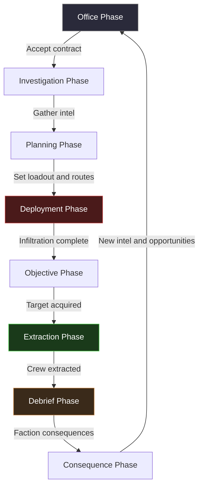

# Ash and Aspersion

## Title and Genre

| Field | Value |
|-------|-------|
| **Title** | Ash and Aspersion |
| **Genre** | Tactical Extraction Shooter / Mythological Noir |
| **Sub-genre** | Real-time with pause tactical heist, narrative detective |
| **Engine** | Unreal Engine 5.4 (Nanite for high-fidelity environments, Lumen for noir lighting) |
| **Platforms** | PC (Steam), PlayStation 5, Xbox Series X/S |
| **Monetization** | Premium ($49.99 base) + cosmetic operative skin DLC ($4.99-$9.99 per pack) |
| **Rating** | Mature (ESRB M / PEGI 18) -- Violence, Strong Language, Themes of Displacement and Oppression |
| **Target Session** | 45-90 minutes (mission) / 20-30 minutes (investigation) |
| **Camera** | Isometric tactical view with free-rotation, zoom from overhead to near-ground |

---

## Vision Statement

Ash and Aspersion is a tactical extraction shooter set in a dieselpunk metropolis where mythological creatures live as undocumented immigrants under the oppressive oversight of divine bureaucracies. You command a disgraced oracle running a supernatural extraction agency -- planning heists in your rain-soaked office, deploying a crew of mythic operatives through restricted zones, and navigating a web of faction politics where every creature you rescue is a potential ally, informant, or liability. It exists because no game has married the tension of a tactical heist with the moral weight of refugee crisis allegory, wrapped in the visual language of 1940s film noir and classical Greek sculpture. The player feels like a detective, a commander, and a conspirator in equal measure -- every decision carries consequences that ripple across a living city.

---

## Core Loop



### Detailed Breakdown

**1. Office Phase (5-10 minutes)**
The player returns to their agency office -- a cramped second-floor walkup above a minotaur-run tailor shop in the Lowers district. The corkboard displays active contracts, faction heat meters, and crew status. The player reviews incoming jobs from six faction boards, checks operative health and morale, reads intercepted messages on the telegraph machine, and decides which contract to pursue. Declining a contract from a faction raises suspicion; accepting one from their rival raises heat.

**2. Investigation Phase (15-25 minutes)**
A point-and-click detective layer. The player visits locations in the city -- a naga-run tea house, a harpy speakeasy, the Styx Longshoremen's dockside warehouse -- interviewing contacts, planting surveillance, photographing guard rotations with a long-lens camera, and collecting physical intel (blueprints, patrol manifests, key copies). Wrong intel gathered here produces wrong information on the planning map. A contact who was compromised produces deliberately misleading intel. The player cross-references sources to verify reliability.

**3. Planning Phase (10-15 minutes)**
The mission map renders the target location as a schematic derived from gathered intel. Incomplete intel shows blank rooms or outdated guard positions. The player assigns operatives to fire teams, sets infiltration routes with waypoint chains, marks distraction targets, designates breach points, and places extraction vehicle rendezvous coordinates. Each operative's creature ability is mapped to specific actions: minotaur for breaching walls, naga for vent infiltration, phoenix for diversionary fires, siren for guard pacification.

**4. Deployment Phase (real-time with pause, 15-35 minutes)**
The team enters the mission zone. Real-time tactical combat with full pause capability (spacebar). The player controls a fire team of 2-4 operatives, issuing move orders, ability activations, and engagement rules. Guard AI follows patrol routes derived from the investigation phase's accuracy. Oracle Vision activates on a 45-second cooldown, revealing a 3-second glimpse of enemy positions -- but 20% of visions are prophetic traps showing outdated or false positions.

**5. Objective Phase (during deployment)**
Integrated into the deployment. The player locates the extraction target (creature, relic, or informant), neutralizes or bypasses guards, and secures the objective. Alarm states escalate in 4 tiers: Suspicious (guards investigate sounds), Alert (guards actively hunt, reinforcements called), Lockdown (all exits sealed, heavy response teams deploy), and Scorched (facility self-destruct sequence initiated -- 90-second timer to extraction).

**6. Extraction Phase (5-10 minutes)**
The most intense segment. Once the objective is secured, the player must extract the team under deteriorating conditions. Extraction points are distance-based; longer routes are safer but give faction response teams more time to converge. Shorter routes are heavily guarded. The extraction vehicle has a 15-second arrival window once signaled -- miss it and the team is stranded for 60 seconds until the next window.

**7. Debrief Phase (5 minutes)**
Back at the office. Mission results screen shows: operatives injured/killed, intel gathered, faction heat changes, payment received, and reputation modifiers. Dead operatives are permanently lost with all their progression. Injured operatives require 1-3 missions of recovery time. The extracted target joins the agency roster as a potential recruit, informant, or -- if their loyalty is low -- a liability.

**8. Consequence Phase (narrative, 5 minutes)**
Faction reactions trigger. A high-heat faction sends raiders to the office (real-time defense mission). A grateful faction sends gifts or exclusive contracts. Extracted creatures share information that unlocks new mission chains. The city's political landscape shifts -- borders redraw, safe houses discovered or lost, new power brokers emerge.

---

## Meta Loop

### What Carries Between Sessions

| Element | Persistence | Growth Axis |
|---------|-------------|-------------|
| Operative roster | Permanent (until killed) | Skills, loyalty, equipment |
| Agency reputation | Persistent across campaign | Faction standing, client quality |
| Oracle Vision | Character progression | Clarity, cooldown reduction, trap detection |
| Office upgrades | Persistent | Workshop, armory, infirmary, archives |
| Intel database | Accumulative | Map accuracy, contact reliability scores |
| City political state | Persistent, reactive | District control, faction borders, market prices |
| Case files (narrative) | Branching, irreversible | Story progression, available mission chains |
| Equipment blueprint library | Accumulative | Craftable weapons, gadgets, creature-specific gear |

### Progression Axes

**Operative Mastery:** Each operative gains experience in 4 skill trees based on their creature type. A minotaur has Berserker (combat damage), Breacher (door/wall destruction), Interrogator (captured guard intel yield), and Endurance (HP and injury recovery). Maximum operative level is 30, with a prestige system at level 30 that resets to level 1 but unlocks a unique creature-specific ultimate ability.

**Oracle Clarity:** The protagonist's prophetic ability grows across 3 dimensions: Range (how far ahead visions reveal, from 1 room to an entire floor), Reliability (trap detection chance, from 80% accurate to 97%), and Duration (vision window, from 3 seconds to 8 seconds). Each dimension is upgraded independently through narrative milestones and collecting scattered prophetic fragments hidden in missions.

**Agency Infrastructure:** The office upgrades through 5 tiers. Tier 1: bare-bones safe house. Tier 2: basic workshop and first-aid station. Tier 3: dedicated armory, surveillance room, holding cells. Tier 4: underground tunnel network, oracle meditation chamber, faction liaison office. Tier 5: city-wide intelligence network, rooftop extraction pad, mythic wardens alliance. Upgrades cost drachmae (mission currency) and faction favors.

**Faction Web:** Six faction relationships evolve simultaneously. Each has a -100 to +100 scale. Below -50 triggers active hostility (raids, bounties, denied access). -50 to -20 is cold (restricted access, doubled prices). -20 to +20 is neutral. +20 to +50 is warm (discounts, bonus intel). Above +50 is allied (exclusive missions, operative loans, safe house access). No single playthrough can keep all factions positive -- alliance choices are zero-sum.

---

## Game Mechanics

### Primary Mechanic: Tactical Extraction Heist System

The extraction heist is the core of Ash and Aspersion. Every mission follows the heist structure but with enough variation that no two feel identical. The system has 4 interlocking layers:

#### Layer 1: Intel Accuracy

Investigation produces intel rated on a 1-5 star reliability scale. Each star improves map accuracy by 20%.

| Star Rating | Map Accuracy | Guard Positions | Layout Accuracy | Trap/Alarm Info |
|-------------|-------------|-----------------|-----------------|-----------------|
| 1 star | 30% -- large blank areas | 40% correct, 60% missing or wrong | Major rooms only | None |
| 2 stars | 50% -- some blank areas | 60% correct | Most rooms, some wrong connections | 25% of traps shown |
| 3 stars | 70% -- minor gaps | 75% correct | Full layout, minor errors | 50% of traps shown |
| 4 stars | 85% -- near complete | 90% correct | Full layout, accurate | 80% of traps shown |
| 5 stars | 95% -- complete | 98% correct | Full layout, verified | All traps shown |

Intel quality depends on: number of sources consulted (capped at 3 per mission), contact reliability (tracked per contact, ranges from 40% to 95%), time spent investigating (longer investigation yields better intel but advances a faction awareness timer), and whether the player cross-referenced sources (matching 2 independent sources on the same detail adds +1 star).

#### Layer 2: Team Composition and Creature Abilities

Operatives are recruited from extracted creatures. Each creature type has a primary role and 2-3 sub-roles:

| Creature | Primary Role | Sub-Roles | Unique Ability | Weakness |
|----------|-------------|-----------|----------------|----------|
| Minotaur | Breacher | Interrogator, Heavy Combat | Wall Charge -- destroys walls, doors, and barriers | Large hitbox, slow movement |
| Naga | Infiltrator | Poisoner, Scout | Vent Crawl -- access to duct network invisible to guards | Low HP, fragile in direct combat |
| Phoenix | Distraction | Area Denial, Emergency Revive | Flash Burn -- creates blinding fire that blocks LOS for 8 seconds | 3-use per mission, then exhausted |
| Siren | Pacification | Interrogator, Infiltrator | Compelling Voice -- guard walks to designated point, ignoring patrol | Requires LOS, 25-second channel |
| Cyclops | Overwatch | Artillery, Demolition | Precision Shot -- one-shot kill at extreme range through walls (sees through 1 wall) | Cannot see behind self, narrow FOV |
| Medusa | Area Control | Interrogator, Sabotage | Stone Gaze -- freezes 1 target in place for 12 seconds (LOS required) | Sunglasses required in lit areas or ability backfires |
| Harpy | Scout | Extraction Support, Distraction | Aerial Recon -- reveals all enemies in 40m radius for 10 seconds | Grounded in rain (50% of missions have rain) |
| Centaur | Cavalry | Heavy Transport, Pursuit | Full Gallop -- carries downed operative at 3x speed to extraction | Cannot enter buildings, outdoor-only |
| Satyr | Social | Distraction, Safe House Access | Charm -- creates friendly conversation with 1 guard for 30 seconds | Combat-ineffective, pacifist |
| Gorgon Sister | Ambush | Stealth Kill, Area Denial | Coil Strike -- silent takedown from 5m, body auto-hidden | Solo operative only, panics if outnumbered 3:1 |

Fire teams consist of 2-4 operatives. The player assigns a team leader (bonuses to command radius and morale) and support operatives. Team composition is the primary strategic decision -- a stealth team (Naga + Siren + Satyr) plays completely differently than a combat team (Minotaur + Cyclops + Phoenix + Centaur) and differently again from a hybrid team (Minotaur + Naga + Siren).

#### Layer 3: Alarm State Escalation

| Alarm State | Trigger | Guard Behavior | Reinforcement Rate | Timer |
|-------------|---------|----------------|-------------------|-------|
| Green | Mission start | Normal patrols, relaxed | None | None |
| Yellow | Suspicious noise, minor detection | Guards investigate last known position | 1 patrol per 60s | 3 min until Green if no further alerts |
| Orange | Confirmed intruder, dead guard found | Active hunt, guard dogs deployed | 1 squad per 45s | 5 min until Yellow if no sightings |
| Red | Alarm triggered, extraction target moved | Full lockdown, exits sealed, heavy teams | 1 heavy squad per 30s | No decay -- mission is now time-limited |
| Scorched | Facility self-destruct initiated | All guards retreat, environmental hazards | None -- facility destroying itself | 90s to reach extraction point |

The player manages alarm states through stealth kills, distraction deployment, body management (undiscovered bodies don't trigger escalation), and Oracle Vision timing (knowing when a patrol is about to discover a body allows the player to preemptively relocate it).

#### Layer 4: Extraction Under Pressure

The extraction phase is a distinct mechanical shift. Once the objective is secured, the player has 3 extraction options:

| Option | Prep Time | Travel Distance | Risk Level | Reward Modifier |
|--------|-----------|-----------------|------------|-----------------|
| Emergency Extraction | 5 seconds | Shortest path (marked on map) | High -- direct route through guard concentrations | 0.8x payout |
| Standard Extraction | 15 seconds | Medium path through service corridors | Medium -- predictable guard response | 1.0x payout |
| Clean Extraction | 30 seconds | Longest path, requires complete stealth | Low if stealth maintained, catastrophic if detected | 1.3x payout |

During extraction, the carried objective (rescued creature, stolen relic, extracted informant) has its own behavior. A terrified creature may panic and flee, requiring recapture. A hostile creature may attack the operative carrying them. A grateful creature may assist with a one-time ability. This adds an unpredictable element to every extraction.

### Secondary Mechanics

#### Oracle Vision System

The protagonist's dormant prophetic ability is both a tool and a risk. Oracle Vision activates on a 45-second cooldown (reducible to 30 seconds with upgrades). When activated:

- The game world shifts to a sepia-toned vision overlay
- Enemy positions, patrol routes, and hidden threats are rendered as ghostly outlines
- The vision lasts 3-8 seconds based on Oracle Clarity progression
- 20% of visions (reducible to 3%) are prophetic traps -- showing outdated or fabricated information

The player develops intuition for detecting traps over time: prophetic traps have subtle visual artifacts (flickering at edges, anachronistic guard uniforms, doors that don't match the facility's architecture). Learning to read these cues is a high-skill-ceiling mechanic.

#### Faction Heat System

Six factions compete for control of the city. Every mission modifies at least 2 faction standings:

| Faction | Territory | Operates | Heat Triggers | Alliance Benefits |
|---------|-----------|-----------|---------------|-------------------|
| Olympian Embassy | The Heights | Divine bureaucracy, immigration enforcement | Extracting from embassy facilities, freeing detained creatures | Access to official travel papers, reduced guard counts in municipal buildings |
| Tartarus Corrections | The Panopticon | Prison system, creature containment | Breaking creatures out of custody, destroying detention records | Safe passage through correctional zones, informant network inside prisons |
| Kairos Corp | Clockwork Quarter | Temporal technology, surveillance state | Stealing temporal artifacts, disabling surveillance nodes | Time-dilation gadgets, access to security camera feeds pre-mission |
| Sileni Syndicate | The Lowers | Black market, creature smuggling | Competing with syndicate jobs, extracting their clients | Black market prices halved, access to illegal creature enhancements |
| Styx Longshoremen | Harbor District | Smuggling routes, river access | Interfering with dock operations, extracting cargo | Extraction boat access (water routes), safe house network |
| Free Mythic Coalition | Underground | Creature resistance, liberation front | Failing to protect rescued creatures, working with oppressor factions | Additional volunteer operatives, safe houses in every district |

#### Office Detective Layer

Between missions, the player interacts with the office as a point-and-click environment:

- **Corkboard** -- Visual mission planner showing active contracts, faction relationships, and city map
- **Telegraph Machine** -- Incoming messages from contacts; some are genuine intel, some are faction traps
- **File Cabinet** -- Completed case files, operative dossiers, faction dossiers
- **Workshop** -- Equipment modification and crafting from blueprints found on missions
- **Interrogation Room** -- Captured guards can be questioned for intel (1 use per guard, reliability varies)
- **Oracle Meditation Chamber** (Tier 4+ office upgrade) -- Voluntary Oracle Vision for upcoming missions at the cost of protagonist HP

### Difficulty Progression

| Chapter | Mission Count | New Mechanic Introduced | Enemy Complexity | Alarm Sensitivity | Operative Slots |
|---------|--------------|------------------------|------------------|-------------------|-----------------|
| Prologue | 3 | Basic movement, stealth, Oracle Vision | 2-3 guards per room, simple patrols | Yellow at 2 alerts | 2 |
| Ch 1: The Lowers | 6 | Faction heat, contact reliability | 3-5 guards, patrol intersections | Yellow at 1 alert | 2-3 |
| Ch 2: Harbor District | 6 | Water extraction routes, creature cargo | 4-6 guards, guard dogs, security cameras | Orange at 2 alerts | 3 |
| Ch 3: Clockwork Quarter | 7 | Temporal traps, surveillance loops, Kairos Corp security | 5-8 guards, automated turrets, time-locked doors | Red at 3 alerts | 3-4 |
| Ch 4: The Panopticon | 7 | Prison layout, guard shift changes, detainee recruitment | 8-12 guards, heavy response teams, lockdown protocols | Red at 2 alerts | 4 |
| Ch 5: The Heights | 8 | Divine security, immortal guards, sanctuary zones | 10-15 guards, divine constructs, reality-warping architecture | Scorched at 3 alerts | 4 |
| Ch 6: The Convergence | 6 | Faction war zones, territory control, multi-faction missions | Variable (depends on faction alliances) | Context-dependent | 4 |
| Epilogue | 3 | Full toolkit, no restrictions, narrative-driven constraints | Maximum variety | Maximum sensitivity | 4 |

---

## World Design

### Map Structure

The city of **Aspersion** is a hierarchical map of 7 districts, each containing 3-5 mission locations. The player navigates the city between missions via a node-based travel map. District control shifts based on faction heat -- a hostile faction's district has more guards, fewer safe houses, and higher prices at vendors.

```
Aspersion (City Overview)
|
+-- The Heights (Olympian Embassy district)
|   +-- Marble Embassy (diplomatic compound)
|   +-- Immigration Processing Center
|   +-- The Ziggurat (executive tower)
|   +-- Sanctuary Gardens (hidden creature refuge)
|
+-- Clockwork Quarter (Kairos Corp district)
|   +-- Temporal Research Lab
|   +-- Surveillance Hub (camera network)
|   +-- Assembly Factory (construct manufacturing)
|   +-- Executive Vault
|
+-- The Panopticon (Tartarus Corrections)
|   +-- Intake Processing
|   +-- General Population Block
|   +-- Maximum Security Wing
|   +-- The Deep Cells (mythic containment)
|
+-- The Lowers (Sileni Syndicate territory)
|   +-- Black Market Bazaar
|   +-- Minotaur's Tailor Shop (agency office entrance)
|   +-- Harpy Speakeasy
|   +-- Basilisk Cartel Safe House
|
+-- Harbor District (Styx Longshoremen)
|   +-- Dockside Warehouse Complex
|   +-- River Smuggling Tunnels
|   +-- The Undertow (underwater creature pens)
|   +-- Lighthouse Safe House
|
+-- Underground (Free Mythic Coalition)
|   +-- The Warren (coalition HQ)
|   +-- Abandoned Subway Network
|   +-- Catacomb Safe Houses
|   +-- The Hollow (ancient creature sanctuary)
|
+-- The Convergence (central, contested)
    +-- City Hall (neutral ground)
    +-- The Oracle's Temple (protagonist's origin)
    +-- Monument Square (public executions)
    +-- The Rift (reality fracture -- final act location)
```

### Art Direction Pillars

| Pillar | Description | Implementation |
|--------|-------------|----------------|
| **Ink Wash Noir** | Shadows render as sumi-e ink wash -- pooling in corners, bleeding across surfaces | Custom shader: shadow maps use ink-spread algorithm with paper texture overlay |
| **Classical Sculpture Meets Dieselpunk** | Creature designs subvert mythological expectations through industrial modernization | Medusa wears sunglasses and trench coat; cyclops is a soft-spoken librarian with a monocle lens; minotaur has steam-powered gauntlets |
| **Rain as Character** | Constant rain that changes intensity with narrative tone | Dynamic rain system -- light drizzle during safe moments, torrential during crises, stops completely only in the Heights (divine privilege) |
| **Dossier UI** | All menus styled as physical case files, typewritten documents, and corkboard pins | UI is diegetic -- mission briefings are paper folders, operative stats are personnel files, maps are hand-annotated blueprints |
| **Anachronistic Technology** | Dieselpunk machinery merged with mythic artifacts -- telegraph machines powered by Styx water, surveillance cameras using basilisk lenses | Environmental storytelling through tech design -- each faction's technology reflects their mythology |

### Visual and Audio Progression by Chapter

| Chapter | Visual Tone | Color Palette | Rain Intensity | Dominant Sound Design | Lighting |
|---------|-------------|---------------|----------------|----------------------|----------|
| Prologue | Warm amber, lived-in | Sepia, warm brown, brass | Light drizzle | Typewriter clicks, muffled jazz from next door | Warm interior, tungsten glow |
| Ch 1: Lowers | Gritty, industrial | Rust, olive, smoke | Steady rain | Distant machinery, rain on tin roofs, naga whispers | Neon signs bleeding through fog |
| Ch 2: Harbor | Cold, maritime | Steel blue, gray, wet stone | Heavy rain, sea spray | Fog horns, creaking docks, water sloshing | Lighthouse beams sweeping, sodium floodlights |
| Ch 3: Clockwork | Sterile, mechanical | Chrome, electric blue, amber sparks | No rain (enclosed) | Ticking clocks, gear grinding, electric hum | Fluorescent flickering, sparks from machinery |
| Ch 4: Panopticon | Oppressive, brutalist | Concrete gray, red alarms, shadow black | Rain visible through barred windows | Echoing footsteps, metal doors, distant screaming | Harsh overhead lights, deep cell shadows |
| Ch 5: Heights | Opulent, divine | Marble white, gold, Olympian violet | No rain (divine weather control) | Choral humming, marble echoes, thunder in distance | Ethereal glow, god-ray shafts, divine luminance |
| Ch 6: Convergence | Fractured, reality-warped | All palettes bleed into each other | Rain falls upward in places | All district sounds overlapping, discordant | All lighting styles colliding in single spaces |
| Epilogue | Resolved, either hopeful or ash | Depends on ending achieved | Rain stops for first time | Single clear note (music box or cathedral bell) | Clean light, no shadows or all shadow |

---

## Narrative

### Story Spine (8-Point Structure)

**1. Equilibrium:** The protagonist, Cassius, is a disgraced oracle running a two-person extraction agency in the Lowers. Cassius lost their prophetic gift after refusing to deliver a prophecy that would have condemned an entire creature community to internment. The agency scrapes by on small jobs -- extracting minor creatures from low-security facilities, running black market goods for the Sileni Syndicate. The crew is Cassius plus one operative: Briareos, a cyclops librarian who serves as the agency's researcher and occasional sniper.

**2. Inciting Incident:** A naga named Melantha arrives at the agency door, half-dead, carrying an encoded message from the Oracle's Temple -- the institution that stripped Cassius of their gift. The message reveals that the Olympian Embassy is preparing "The Purgation," a mass detention operation that will sweep every undocumented creature in Aspersion within 30 days. Melantha dies before explaining how she obtained the message.

**3. First Complication:** Cassius investigates Melantha's death and discovers she was a double agent working for Kairos Corp, which is secretly funding The Purgation to clear creature districts for temporal research expansion. The encoded message is partially a Kairos trap designed to identify and eliminate potential resistance leaders. Cassius's investigation triggers heat with both Kairos Corp and the Olympian Embassy simultaneously.

**4. Rising Action:** Cassius builds the crew by extracting key creatures from escalating facilities -- a minotaur from a Tartarus Corrections transport, a phoenix from a Kairos Corp laboratory where she was being drained for temporal energy, a siren from an Olympian immigration detention center. Each extraction reveals another piece of The Purgation's scope: it is not merely detention but deportation -- creatures are being funneled through a rift beneath the city to Tartarus itself. The Free Mythic Coalition recruits Cassius as their extraction specialist, providing resources but also demanding increasingly dangerous operations.

**5. Midpoint Reversal:** During a high-stakes extraction from the Olympian Embassy's archive, Cassius discovers that The Purgation was Cassius's own prophecy -- the one they refused to deliver 5 years ago. The prophecy was not about preventing creature suffering; it was about causing it. By suppressing the prophecy, Cassius did not prevent The Purgation -- they delayed it, allowing it to grow into something far worse. The Olympian Embassy learned of the prophecy through other means and has been preparing ever since. Cassius's guilt is not just emotional -- it is causal. Their oracle gift begins to return, unbidden, as fractured and unreliable visions.

**6. Crisis:** The Purgation begins ahead of schedule. Creature districts are raided. The agency office is attacked by a joint Olympian-Kairos task force. Key operatives are captured or killed based on player choices throughout the campaign. The surviving crew must decide: flee Aspersion with the creatures they have saved (safe but abandoning thousands), or attempt to destroy the Tartarus Rift itself (catastrophic risk, potential to end deportations permanently). The faction web determines which factions support the final mission and which oppose it.

**7. Climax:** The crew infiltrates the Rift beneath the city -- a chaotic zone where all district aesthetics collide and reality is unstable. The mission is the most complex in the game: multiple teams, simultaneous objectives, a ticking clock as the Rift expands. The Olympian Embassy deploys its full divine security force. Kairos Corp activates temporal traps that reset sections of the mission. Creatures freed earlier in the game appear as either allies or enemies based on their loyalty outcomes. Cassius's Oracle Vision is at maximum power but also maximum unreliability -- the closer to the Rift, the more prophetic traps occur.

**8. Resolution:** Two primary endings with variations based on faction alignment and operative survival:

- **Ending A (Seal the Rift):** Cassius uses their restored oracle gift to seal the Tartarus Rift permanently. The Purgation ends. Creatures remain in Aspersion but without legal status -- the fight continues politically. Cassius loses their gift again, this time willingly. The agency continues as a protection service. Faction alignments determine which factions dominate the new political order.

- **Ending B (Open the Floodgates):** Cassius opens the Rift in reverse, flooding Aspersion with mythic energy that makes creature status meaningless -- every human in the city is touched by myth. The Purgation becomes impossible because the distinction between creature and citizen dissolves. Cassius is transformed into something neither human nor creature. Aspersion is reborn as a mythic city. The consequences are unpredictable and potentially catastrophic.

Each ending has 4 variations based on which faction the player aligned with most strongly, producing 8 total end states.

### Tone Spectrum (7-Axis)

| Axis | Position (1-10) | Description |
|------|----------------|-------------|
| Hope vs. Despair | 4 | Hope is earned through action; the default state is grim |
| Order vs. Chaos | 3 | The city oppresses through order; freedom requires chaos |
| Reason vs. Emotion | 5 | Balanced -- tactical reason in missions, emotional resonance in narrative |
| Familiar vs. Strange | 7 | The noir elements are familiar; the mythological fusion is deeply strange |
| Earnest vs. Ironic | 6 | The narrative is earnest about displacement; the world is ironic about bureaucracy |
| Quiet vs. Loud | 4 | Quiet investigation and planning; loud tactical moments |
| Abstract vs. Concrete | 3 | Concrete mechanics and consequences; abstract mythological underpinning |

### Key Characters

| Character | Creature Type | Role | Theme | Loyalty Missions | Fragments |
|-----------|--------------|------|-------|-------------------|-----------|
| **Cassius** | Human (Oracle) | Protagonist / Agency Lead | Guilt, redemption, prophetic burden | 0 (player character) | 5 (auto-collected through main plot) |
| **Briareos** | Cyclops | Agency Co-Founder / Researcher | Outsider wisdom, quiet dignity, forbidden knowledge | 2 | 4 |
| **Melantha** | Naga | Inciting catalyst (deceased) | Sacrifice, double agency, impossible choices | 0 (posthumous, revealed through investigation) | 3 (found in her belongings) |
| **Theron** | Minotaur | Breacher / Former Gladiator | Anger management, physical vs. spiritual strength, chosen family | 3 | 5 |
| **Pyra** | Phoenix | Distraction / Former Kairos Test Subject | Trauma recovery, self-worth beyond utility, rebirth | 3 | 5 |
| **Calliope** | Siren | Pacification / Underground Railroad Operative | Freedom vs. manipulation, the ethics of mind control | 2 | 4 |
| **Nyx** | Medusa | Area Control / Basilisk Cartel Defector | Visible otherness, weaponized beauty, trust after betrayal | 3 | 5 |
| **Galen** | Satyr | Social / Coalition Liaison | Hedonism as coping, radical joy as resistance | 2 | 4 |
| **Aegaeon** | Harpy | Scout / War Correspondent | Truth-telling in propaganda, documenting atrocity | 2 | 4 |
| **Archon Helena** | Human (Immortal) | Olympian Embassy Chief Antagonist | Institutional cruelty through bureaucratic rationality | 0 (antagonist) | 3 (intercepted communications) |
| **Director Chronos** | Unknown (Temporal Entity) | Kairos Corp CEO | The banality of evil through corporate profit-seeking | 0 (antagonist) | 3 (stolen corporate files) |

Loyalty missions unlock at specific relationship thresholds. Each loyalty mission has 2 outcomes (loyal vs. conflicted) that determine the character's behavior in the final mission. Collecting all fragments for a character unlocks their full backstory and an alternate costume.

---

## Player Personas

### P-001: Alex Rivera -- "The Ranked Grinder"

**Why this game fits:** Ash and Aspersion offers deep tactical mastery with measurable skill expression. The extraction loop is a competitive puzzle -- every mission has optimal routes, team compositions, and timing windows. Alex treats mission completion times and operative survival rates as personal leaderboards even in a single-player game.

**Predicted experience:** Alex plays on the highest difficulty from Chapter 2 onward, optimizing team compositions and replaying missions for clean extractions (no alarms, no injuries). He gravitates toward combat-heavy team builds (Minotaur + Cyclops + Phoenix) and treats stealth as an optimization challenge rather than a playstyle preference. He skips most investigation dialogue on replays, using memorized intel paths to speed-run the detective phase. He purchases cosmetic operative skins that signal achievement (e.g., the "Ghost Extractor" skin earned by completing 10 consecutive missions without triggering Orange alarm). He finishes the main campaign in 35-40 hours and spends another 20-30 hours on achievement hunting and difficulty mastery.

**What he loves:** The alarm escalation system creates tension spikes that feel competitive even without multiplayer. Oracle Vision as a risk/reward mechanic satisfies his optimization brain. Permadeath for operatives makes every decision weighty.

**What he skips:** Most dialogue trees, character backstories, and investigation flavor text. He reads enough to complete objectives and ignores the rest.

### P-003: Hiroshi Tanaka -- "The RPG Addict"

**Why this game fits:** The operative progression system is a deep RPG with 4 skill trees per creature type, equipment customization, and loyalty narratives. With 10 creature types and 30 levels each, Hiroshi treats operative mastery as a completion challenge. The branching narrative with 8 endings provides replay value for his completionist drive.

**Predicted experience:** Hiroshi plays methodically, completing every investigation thread, maxing every operative's skill tree, and collecting all oracle fragments before advancing the main plot. He keeps a physical notebook (or spreadsheet) tracking operative builds and skill synergies. He experiments with unusual team compositions (Satyr + Gorgon Sister + Medusa -- the "No Combat" build) and optimizes them for specific mission types. He completes all loyalty missions at the loyal outcome, then replays them for the conflicted outcome to see both storylines. He plays 80-100 hours across 3 playthroughs to see all endings and unlock all achievements.

**What he loves:** The creature-specific ultimate abilities unlocked at prestige level. The fragment collection system for each character. The depth of team composition strategy.

**What he skips:** Speed-running or difficulty optimization. He plays on normal difficulty and takes his time.

### P-006: Eleanor Vance -- "The Loyal Strategist"

**Why this game fits:** Ash and Aspersion rewards exactly the kind of patient, methodical play that Eleanor values. The investigation phase requires careful cross-referencing and source evaluation. The planning phase is a strategic puzzle. The faction web demands long-term thinking about consequences. There are no gambling mechanics, no gacha, no energy timers. Progression is earned through intelligent play.

**Predicted experience:** Eleanor plays in two focused sessions per day (morning and evening), completing one mission per session. She spends disproportionate time in the investigation and planning phases because she enjoys the strategic puzzle of assembling accurate intel. She favors stealth-heavy builds and achieves Clean Extraction on 70%+ of missions. She tracks faction relationships meticulously and plans her faction strategy 5-6 missions ahead. She plays 60-70 hours over 3-4 months, savoring every narrative beat. She chooses Ending A (Seal the Rift) because it represents earned stability.

**What she loves:** The office detective layer feels like a point-and-click adventure. The faction system rewards long-term strategic thinking. No predatory monetization or time pressure.

**What she skips:** Aggressive combat encounters. She reloads if an operative is killed rather than accepting the loss. She avoids missions that require loud approaches.

### P-008: David Park -- "The Achievement Hunter"

**Why this game fits:** Ash and Aspersion has 142 achievements across 8 categories (Campaign, Operative Mastery, Extraction Perfection, Faction Alignment, Collection, Investigation, Difficulty, and Hidden). The achievement system is fair -- no RNG-dependent achievements, no time-limited exclusives, no multiplayer requirements. Every achievement is skill-based and achievable through deliberate play.

**Predicted experience:** David approaches the game as a completion project. He creates a tracking spreadsheet mapping all 142 achievements before starting. He plays in efficient 30-45 minute sessions, targeting specific achievement categories per session. He completes the campaign on Normal first (45 hours), then begins a methodical achievement hunt on subsequent playthroughs. He particularly targets the "Ghost of Aspersion" achievement (complete the entire campaign without triggering Red alarm) and the "Menagerie" achievement (recruit all 10 creature types into the agency). He spends 90-100 hours achieving 100% completion.

**What he loves:** The achievement categories are well-organized and progressive. No bugged or impossible achievements. The fragment collection achievements are trackable and rewarding.

**What he skips:** Extended narrative engagement -- he reads enough to progress but does not linger on world-building.

---

## User Stories

### Exploration

1. As a **strategic planner** (P-006), I want to explore the city map between missions to identify safe houses and vendor locations, so that I can plan extraction routes and supply runs without relying on mission briefings alone.

2. As a **completionist** (P-008), I want to discover hidden locations on each district map by cross-referencing intel from multiple contacts, so that I can unlock all mission locations and achieve 100% map discovery.

3. As a **tactical optimizer** (P-001), I want to scout mission locations during the investigation phase using the camera tool to photograph guard patrol patterns, so that my planning phase map shows accurate enemy positions.

4. As a **lore explorer** (P-003), I want to find and read environmental story elements in each mission location (classified documents, personal letters, graffiti), so that I can piece together the world's history and understand each faction's motivations.

### Core Mechanics

5. As a **tactical optimizer** (P-001), I want to pause combat at any time to issue orders to my entire fire team simultaneously, so that I can coordinate complex multi-operative maneuvers under pressure.

6. As a **strategic planner** (P-006), I want to assign infiltration waypoints during the planning phase and see estimated detection risk at each point, so that I can choose the route that minimizes alarm escalation.

7. As a **RPG enthusiast** (P-003), I want each operative to have 4 distinct skill trees that unlock abilities meaningful to their creature type, so that I can customize each recruit to fill a specific tactical role.

8. As a **tactical optimizer** (P-001), I want Oracle Vision to show ghostly outlines of enemy positions but include a visual indicator I can learn to read for detecting prophetic traps, so that my tactical decisions reward skill development rather than luck.

9. As a **fire team commander**, I want to designate engagement rules for each operative (hold fire, return fire, engage freely), so that I can control whether a stealth mission stays stealthy when unexpected guards appear.

10. As a **breach specialist**, I want the minotaur operative to destroy walls and doors as an alternative entry point, so that I can create unpredictable approach routes that bypass well-guarded main entrances.

11. As a **stealth player** (P-006), I want undetected body management to prevent alarm escalation, so that I can maintain Green alarm state throughout a mission by carefully hiding unconscious guards.

### Narrative

12. As a **lore explorer** (P-003), I want to collect oracle fragments hidden in each mission environment that reveal Cassius's backstory, so that I understand why the oracle gift was lost and what it costs to recover it.

13. As a **strategic planner** (P-006), I want loyalty missions to present genuine moral dilemmas with no clearly correct answer, so that my choices feel meaningful and the resulting operative behavior in the finale reflects my values.

14. As a **story-driven player**, I want the midpoint revelation (that Cassius's suppressed prophecy caused The Purgation) to recontextualize every mission I have completed, so that my second playthrough carries dramatically different emotional weight.

15. As a **completionist** (P-008), I want all 8 ending variations to be achievable in separate save files, so that I can experience every narrative outcome without losing my main campaign progress.

16. As a **character investor** (P-003), I want each of the 10 recruitable creatures to have a complete character arc spanning recruitment, loyalty missions, and finale behavior, so that my crew feels like individuals rather than stat blocks.

### Progression

17. As a **RPG enthusiast** (P-003), I want operative prestige at level 30 to unlock a unique creature-specific ultimate ability, so that maxing an operative feels transformative rather than incremental.

18. As a **strategic planner** (P-006), I want office upgrades to provide tangible mechanical benefits (workshop improves equipment, infirmary accelerates healing), so that investing in infrastructure feels rewarding.

19. As a **tactical optimizer** (P-001), I want Oracle Clarity to have 3 independent upgrade paths (Range, Reliability, Duration), so that I can specialize my oracle ability to match my tactical approach.

20. As a **completionist** (P-008), I want a clear progression tracker showing how many fragments, achievements, and operative mastery milestones remain, so that I can plan my completion route efficiently.

21. As a **long-term player**, I want the faction web to prevent me from allying with all 6 factions simultaneously, so that my choices have irreversible consequences and replaying with different faction strategies produces different campaigns.

### Accessibility

22. As a player with **visual accessibility needs**, I want Oracle Vision prophetic traps to have audio cues in addition to visual artifacts, so that I can detect unreliable intel without relying solely on visual flickering.

23. As a player with **limited dexterity**, I want the real-time-with-pause system to allow unlimited pause duration with no gameplay penalty, so that I can issue complex orders without time pressure.

24. As a player with **cognitive accessibility needs**, I want the alarm state indicator to use both color coding and distinct iconography, so that I can assess mission threat level without interpreting color alone.

25. As a **non-native English speaker** (P-020), I want full localization for all dialogue, UI, and investigation text in at minimum 8 languages (English, Japanese, Korean, Simplified Chinese, French, German, Spanish, Brazilian Portuguese), so that I can engage with the tactical and narrative systems without language barriers.

26. As a player with **hearing accessibility needs**, I want all audio cues (guard footsteps, alarm triggers, Oracle Vision activation) to have visual indicators, so that I can respond to threats without audio reliance.

### Social and Community

27. As a **community contributor** (P-008), I want to share operative build configurations via exportable codes, so that I can publish my optimized team compositions on forums and help other players.

28. As a **competitive player** (P-001), I want mission results to include detailed statistics (alarm states triggered, detection events, extraction time, operative damage taken), so that I can compare my performance against community benchmarks.

29. As a **content creator**, I want the game to support photo mode during mission replays, so that I can capture dramatic tactical moments and share them on social media.

30. As a **theorycrafter** (P-003), I want all operative stats and ability descriptions to be visible in the codex, so that I can plan optimal builds without needing to discover mechanics through trial and error.

### Extraction and Missions

31. As a **strategic planner** (P-006), I want the 3 extraction options (Emergency, Standard, Clean) to be selectable mid-mission based on changing conditions, so that I can adapt my escape plan if the alarm state escalates beyond my planned threshold.

32. As a **tactical optimizer** (P-001), I want carried extraction targets to have individual behaviors (panicking, assisting, fighting), so that each extraction feels unpredictable and requires on-the-fly tactical adjustment.

33. As a **RPG enthusiast** (P-003), I want the creatures I extract to be recruitable as operatives only if I meet their specific loyalty conditions (completing their personal questline, maintaining specific faction standings), so that recruitment feels earned rather than automatic.

34. As a **completionist** (P-008), I want each mission location to contain a hidden oracle fragment accessible only through a non-obvious route or puzzle, so that thorough exploration is rewarded with progression-critical collectibles.

35. As a **stealth player** (P-006), I want the Scorched alarm state to serve as a dramatic narrative escalation rather than a pure failure state, so that even a mission going catastrophically wrong produces a memorable experience.

---

## Monetization

### Model: Premium + Cosmetic DLC

**Base Game:** $49.99 (PC/Steam, PS5, Xbox Series X/S)

**Why this model fits Ash and Aspersion:**
The game is narrative-driven, single-player, and built on permanent consequences (operative permadeath, irreversible faction choices). A free-to-play model would undermine the weight of these mechanics by incentivizing monetized revival or faction resets. A battle pass would conflict with the campaign structure. The extraction genre's core appeal -- high stakes, meaningful loss -- is incompatible with safety-net monetization. Premium pricing signals the game's scope and quality. Cosmetic DLC preserves the game's integrity while offering ongoing revenue from engaged players.

### DLC Roadmap

| DLC Pack | Contents | Price | Release Window |
|----------|----------|-------|----------------|
| **"Trench Coat Collection"** | 5 alternate operative skins (noir-themed) | $4.99 | Launch +6 weeks |
| **"Mythic Formal"** | 5 formal-wear operative skins (gala infiltration theme) | $4.99 | Launch +12 weeks |
| **"Tartarus Veteran"** | 5 battle-scarred operative skins + weapon reskins | $6.99 | Launch +18 weeks |
| **"The Lost Cases"** | 4 bonus missions set during Cassius's pre-agency career | $9.99 | Launch +24 weeks |
| **"Creature of the Night"** | 5 noir-silhouette operative skins (monochrome) | $4.99 | Launch +24 weeks |
| **"The Sileni Archive"** | 4 bonus missions set in the Sileni Syndicate's black market | $9.99 | Launch +36 weeks |

### Revenue Projections

| Scenario | Units Sold (Year 1) | Base Revenue | DLC Attach Rate | DLC Revenue | Total Revenue |
|----------|--------------------|--------------|-----------------|-------------|---------------|
| **Modest** (niche hit) | 85,000 | $4,249,150 | 15% | $76,500 | $4,325,650 |
| **Moderate** (genre success) | 250,000 | $12,497,500 | 25% | $437,375 | $12,934,875 |
| **Strong** (breakout hit) | 600,000 | $29,994,000 | 35% | $1,470,000 | $31,464,000 |
| **Phenomenon** (cultural moment) | 1,500,000 | $74,985,000 | 40% | $4,200,000 | $79,185,000 |

Steam's 30% cut and platform fees reduce net revenue to approximately 65% of gross. Console platform fees range from 30% (PlayStation) to 30% (Xbox). Break-even at the modest scenario requires a development budget under $2.8M net.

---

## Production Plan

### Team

| Role | Count | Phase | Duration | Monthly Cost (per head) | Total Cost |
|------|-------|-------|----------|------------------------|------------|
| Creative Director | 1 | Full cycle | 30 months | $12,000 | $360,000 |
| Lead Designer (Systems) | 1 | Full cycle | 30 months | $10,000 | $300,000 |
| Lead Designer (Narrative) | 1 | Full cycle | 30 months | $10,000 | $300,000 |
| Game Designer | 2 | Months 3-24 | 22 months | $7,500 | $330,000 |
| Lead Programmer | 1 | Full cycle | 30 months | $11,000 | $330,000 |
| Gameplay Programmers | 3 | Months 2-26 | 25 months | $8,000 | $600,000 |
| AI Programmer | 1 | Months 4-24 | 21 months | $9,000 | $189,000 |
| UI Programmer | 1 | Months 6-22 | 17 months | $8,000 | $136,000 |
| Art Director | 1 | Full cycle | 30 months | $10,000 | $300,000 |
| Environment Artists | 3 | Months 3-26 | 24 months | $7,000 | $504,000 |
| Character Artists | 2 | Months 2-22 | 21 months | $7,000 | $294,000 |
| Technical Artist (Shaders) | 1 | Months 4-26 | 23 months | $9,000 | $207,000 |
| VFX Artist | 1 | Months 8-26 | 19 months | $7,500 | $142,500 |
| Animator | 2 | Months 6-26 | 21 months | $7,000 | $294,000 |
| Writer | 1 | Months 1-24 | 24 months | $7,000 | $168,000 |
| Composer | 1 | Months 12-28 | 17 months | $6,000 | $102,000 |
| Sound Designer | 1 | Months 14-28 | 15 months | $6,500 | $97,500 |
| QA Lead | 1 | Months 12-30 | 19 months | $6,500 | $123,500 |
| QA Testers | 2 | Months 18-30 | 13 months | $4,500 | $117,000 |
| Producer | 1 | Full cycle | 30 months | $9,000 | $270,000 |
| Community Manager | 1 | Months 18-30 | 13 months | $5,000 | $65,000 |

**Total Team:** 31 people at peak (months 12-22)

### Timeline

| Month | Milestone | Deliverable |
|-------|-----------|-------------|
| 1-2 | Pre-production | GDD finalized, art bible, technical architecture, prototype of core loop |
| 3-4 | Vertical Slice | First playable mission (Prologue mission 1) with full extraction loop, placeholder assets |
| 5-6 | Systems Alpha | All 10 creature types playable, alarm system functional, Oracle Vision implemented |
| 7-8 | Content Block 1 | Prologue + Chapter 1 (The Lowers) -- 9 missions, investigation system functional |
| 9-10 | Content Block 2 | Chapters 2-3 (Harbor, Clockwork) -- 13 missions, faction system operational |
| 11-12 | Content Block 3 | Chapter 4 (The Panopticon) -- 7 missions, office upgrade system complete |
| 13-14 | Content Block 4 | Chapters 5-6 (The Heights, The Convergence) -- 14 missions |
| 15-16 | Narrative Integration | All loyalty missions, 8 endings, fragment collection system, epilogue |
| 17-18 | Polish Alpha | Full campaign playable end-to-end, QA begins, performance optimization |
| 19-20 | Beta / Balancing | Difficulty tuning, operative balance pass, faction economy balancing |
| 21-22 | Content Complete | All art final, all VO recorded, all audio implemented, achievement system live |
| 23-24 | QA and Certification | Platform certification submissions, bug fixing, localization QA |
| 25-26 | Polish and Release | Day-1 patch, marketing push, review copies, launch |
| 27-30 | Post-Launch Support | Bug fixes, DLC development, community engagement |

### Budget Breakdown

| Category | Cost | Percentage |
|----------|------|------------|
| Personnel Salaries | $5,629,500 | 65.1% |
| Software Licenses (UE5, Perforce, Jira, etc.) | $180,000 | 2.1% |
| Hardware (dev kits, workstations) | $120,000 | 1.4% |
| Office / Remote Stipends | $240,000 | 2.8% |
| Voice Acting (12 characters, ~40,000 words) | $280,000 | 3.2% |
| Music Production (3-hour score) | $150,000 | 1.7% |
| QA Outsourcing (months 18-24) | $200,000 | 2.3% |
| Localization (8 languages) | $320,000 | 3.7% |
| Platform Certification Fees | $60,000 | 0.7% |
| Marketing (pre-launch 6 months) | $800,000 | 9.3% |
| Contingency (15%) | $1,296,425 | 15.0% |
| Marketing Post-Launch (6 months) | $360,000 | 4.2% |
| **Total** | **$8,643,425** | **100%** |

Break-even at 15% net DLC attach: approximately 195,000 units sold at $49.99 gross ($32.49 net per unit after platform fees) = $6,335,550 net base revenue, covering 73% of budget. DLC revenue at 25% attach on 195,000 units = $170,625 net, bringing total to $6,506,175. Full break-even requires approximately 265,000 units sold with DLC.

---

## Technical Requirements

### Platform Specifications

| Spec | PC Minimum | PC Recommended | PlayStation 5 | Xbox Series X |
|------|-----------|----------------|---------------|---------------|
| **OS** | Windows 10 64-bit | Windows 11 64-bit | PS5 System Software | Xbox OS |
| **CPU** | Intel i5-9600K / AMD Ryzen 5 3600X | Intel i7-11700K / AMD Ryzen 7 5800X | Custom AMD Zen 2 (8C/16T) | Custom AMD Zen 2 (8C/16T) |
| **RAM** | 12 GB | 16 GB | 16 GB GDDR6 | 16 GB GDDR6 |
| **GPU** | NVIDIA GTX 1070 / AMD RX 5600 XT | NVIDIA RTX 3070 / AMD RX 6800 XT | Custom RDNA 2 (10.28 TFLOPS) | Custom RDNA 2 (12 TFLOPS) |
| **Storage** | 30 GB SSD | 30 GB NVMe SSD | 30 GB SSD | 30 GB SSD |
| **DirectX** | DirectX 12 | DirectX 12 Ultimate | N/A | N/A |
| **Target Resolution** | 1080p / 30 FPS | 1440p / 60 FPS | 4K / 30 FPS (Quality) or 1440p / 60 FPS (Performance) | 4K / 30 FPS (Quality) or 1440p / 60 FPS (Performance) |

### Key Technical Challenges and Mitigations

| Challenge | Risk Level | Description | Mitigation |
|-----------|-----------|-------------|------------|
| **Real-time-with-pause AI coordination** | High | Guards must maintain believable patrol behavior while the player pauses and resumes. AI state serialization and resumption must be seamless. | Dedicated AI programmer from month 4. AI state machine uses behavior trees with explicit pause/resume serialization. Prototype in vertical slice. |
| **Procedural intel accuracy system** | Medium | Mission maps must render accurately or inaccurately based on investigation quality, with partial information shown differently from full information. | Layer-based fog of war system. Each intel source contributes map layers that are composited during planning phase. Missing layers render as blank or annotated "?" zones. |
| **Ink wash shader performance** | Medium | Custom shadow rendering using ink-spread algorithms must maintain 60 FPS on recommended hardware. Shadows are the dominant visual identity. | Technical artist begins shader R&D in month 4. Profile on target hardware monthly. Fallback to standard shadow maps on minimum spec with reduced ink spread radius. |
| **Operative permadeath with narrative integration** | Medium | Dead operatives must be removed from all systems (roster, missions, loyalty quests, finale) without breaking narrative flow. Missing operative story beats must have alternative content. | All narrative content has branch conditions checking operative alive/dead status. Alternative dialogue and mission variations exist for every operative-dependent scene. Tested via automated "kill everyone" QA playthrough. |
| **Faction web balance** | High | Six-faction relationship system with zero-sum constraints must remain balanced across 47 missions. Players must not reach unwinnable states through faction heat alone. | Faction economy simulated and tested via Monte Carlo simulations across 10,000 playthroughs during months 19-20. Hard floor: no faction drops below -50 through main plot alone. "Get out of heat" missions available when any faction hits -40. |
| **Cross-platform save compatibility** | Low | Save files planned for cross-platform transfer post-launch. | Save format is platform-agnostic JSON. No platform-specific data in save structure. |
| **Memory budget for 7 districts** | Medium | Each district has unique assets, creature models, and environmental systems. Loading between districts must be under 5 seconds. | District streaming via UE5 World Partition. Only active district plus adjacent connections loaded. Texture streaming with mip bias for minimum spec. Memory budget: 8 GB for active district, 2 GB for adjacent buffer. |

### Accessibility Features

| Feature | Implementation |
|---------|---------------|
| **Full pause-without-penalty** | Spacebar pauses all AI, timers, and alarms. No time limit on pause. Works in all phases including extraction. |
| **Subtitle system** | Full subtitles for all dialogue. Adjustable font size (12-36pt), background opacity, speaker name display. |
| **Colorblind modes** | 3 presets (Protanopia, Deuteranopia, Tritanopia) that remap alarm colors, faction colors, and Oracle Vision tints. |
| **Audio cue visualization** | All audio cues (footsteps, alarms, ability activations) render as directional indicators on the HUD edge. |
| **Text-to-speech** | All investigation text and case files readable via TTS. Configurable voice and speed. |
| **Adjustable game speed** | Real-time speed adjustable from 0.5x to 1.5x. Does not affect pause functionality. |
| **Control remapping** | Full keyboard/controller remapping with multiple preset configurations. |
| **Auto-aim assist** | Optional targeting assistance for combat encounters. Scales from off to full lock-on. |
| **Difficulty presets** | 5 difficulty levels adjusting enemy count, alarm sensitivity, operative HP, and Oracle Vision trap frequency independently. |
