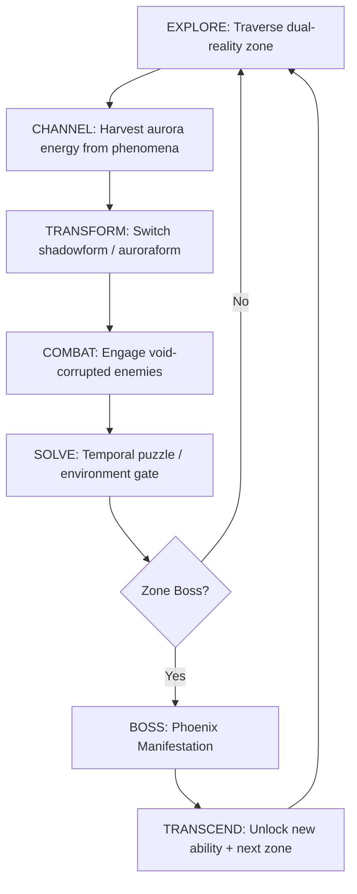
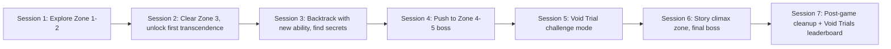
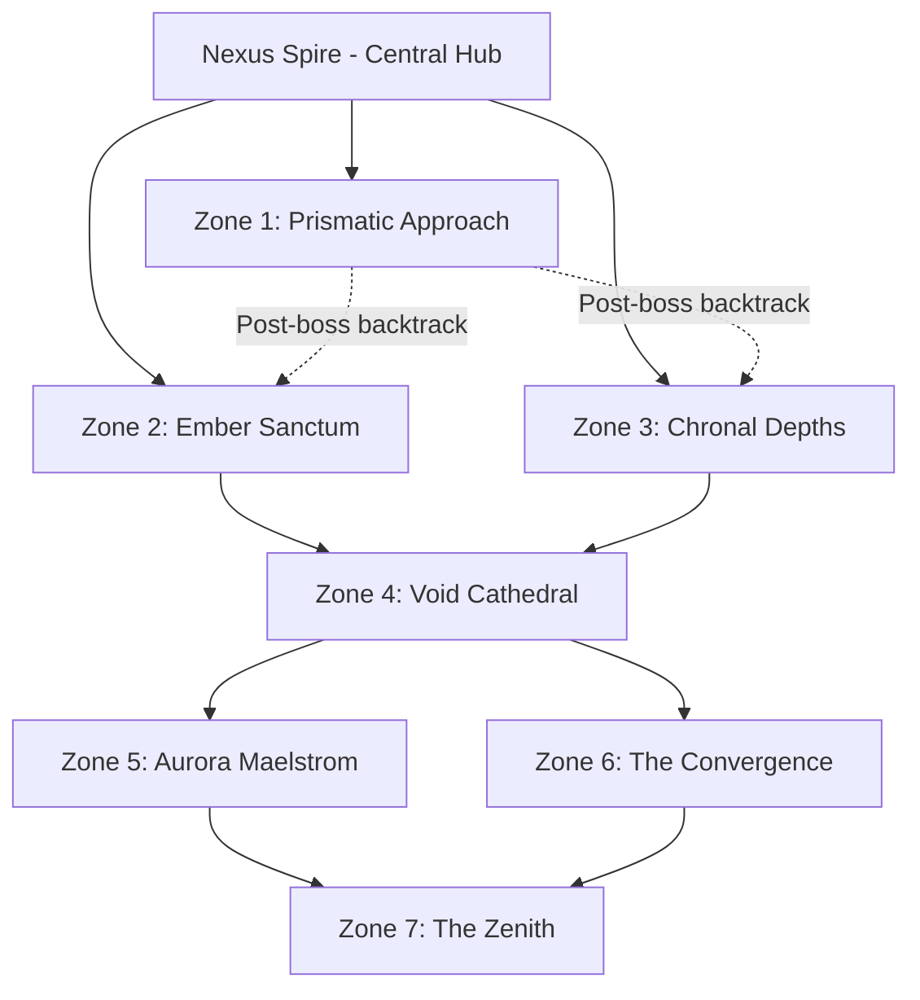

# Aurora Transcendence

## 1. Title and Genre

| Attribute | Value |
|-----------|-------|
| **Title** | Aurora Transcendence |
| **Genre** | Action-Adventure / Cosmic Horror |
| **Sub-genre** | Metroidvania with dual-reality traversal and time manipulation |
| **Engine** | Unreal Engine 5.4 (Nanite + Lumen for volumetric aurora rendering) |
| **Platform (Primary)** | PC (Steam, Epic Games Store) |
| **Platform (Secondary)** | PlayStation 5, Xbox Series X/S |
| **Platform (Tertiary)** | VR (Meta Quest 3, Valve Index) as standalone 4-hour campaign |
| **Monetization** | Premium ($39.99 base) with cosmetic-only post-launch DLC |
| **ESRB Rating** | T (Teen) — Fantasy Violence, Mild Blood, Mild Language |
| **PEGI** | 16 |
| **Target Session** | 45-90 minutes (core loop), 2-3 hours (exploration binge) |

---

## 2. Vision Statement

Aurora Transcendence is a single-player action-adventure in which the player inhabits an ethereal shadowmancer who must master dual-reality traversal, temporal manipulation, and void-resistant combat to prevent a transcendent phoenix from collapsing the membrane between time and space. The game exists because no title has successfully married the fluidity of form-switching traversal (a la Metroid Prime's Morph Ball) with the existential dread of cosmic horror (a la Elden Ring's outer gods) and the rhythmic satisfaction of time-bending combat (a la Superhot). The feeling the player carries is weightless terror: soaring through aurora-laced celestial corridors one moment, plummeting into void-warped catacombs the next, always one miscalculation from unraveling reality itself.

---

## 3. Core Loop

**Target session length:** 45-90 minutes (3-6 full cycles)

### Detailed Breakdown

| Step | Player Action | Duration | Inputs | Outputs |
|------|--------------|----------|--------|---------|
| **Explore** | Navigate interconnected zone in chosen form. Shadowform glides through narrow void fissures; auroraform rides aurora ribbons along wide celestial corridors. | 3-8 min | Left stick (move), A (jump), B (form switch), RT (dash) | Map reveal, lore fragments, aurora nodes |
| **Channel** | Absorb aurora energy from environmental phenomena (aurora storms, temporal echoes, phoenix memories). Hold LB to enter channeling stance; energy flows toward player in a particle stream. | 1-2 min | Hold LB + rotate LS to aim absorption beam | Aurora energy (currency), channeling XP, temporary buff |
| **Transform** | Instant switch between shadowform and auroraform. Each form has separate health, movement, and ability trees. Transformation takes 0.3s with a visual burst. | Instant | B (tap) | Active form changes; accessible paths change |
| **Combat** | Void-corrupted enemies attack in both realities simultaneously. Shadowform uses fast, dark lash attacks and phase-dodges. Auroraform uses ranged aurora blasts and shielding barriers. Time manipulation (slow/rewind) costs channel energy. | 2-5 min | X (attack), Y (heavy), RT (ability), LT (time power), RB (parry) | Enemy drops (void fragments, ability reagents), combat rating |
| **Solve** | Environmental puzzles gated by temporal manipulation. Rewind a collapsed bridge, slow falling debris to create platforms, fast-forward crystal growth to form handholds. Some puzzles require both forms (shadowform activates a void switch, auroraform rides the resulting aurora lift). | 3-7 min | LT (hold) + directional input for time power, B (form switch) | Zone progression, hidden lore caches, upgrade materials |
| **Boss** | Phoenix Manifestation unique to each zone. Three-phase fight escalating from physical attacks to temporal distortion to void collapse. Requires mastery of form-switching under pressure. | 8-15 min | Full combat kit + time powers | Phoenix memory fragment, new transcendence ability, zone completion |
| **Transcend** | After boss, receive a transcendence ability that permanently unlocks new traversal/combat options. Autosave + fast-travel point unlocks. | 1-2 min | Automated + dialogue choice | Permanent ability, fast-travel node, next zone access |

---

## 4. Meta Loop

### What Carries Between Sessions

| Persistent Element | Description | Growth Feel |
|--------------------|-------------|-------------|
| **Transcendence Abilities** | 7 permanent abilities earned from boss kills. Each opens new traversal paths in prior zones (Metroidvania backtracking). | Exponential — early zones feel cramped; by late game the player glides through them in seconds |
| **Form Mastery Trees** | Shadowform and auroraform each have a 15-node skill tree. Nodes unlock via channeling XP + specific reagents. | Linear with branch points — every 3 nodes, choose between two specializations |
| **Void Resistance** | A hidden stat that reduces void corruption severity. Raised by consuming void fragments at shrines. | Gradual — the void becomes less terrifying as the player understands it |
| **Lore Codex** | 147 entries across 6 categories (shadowmancer lore, aurora prophecies, void warnings, phoenix memories, zone ecology, temporal theory). | Discovery-driven — no checklist, entries appear when contextually triggered |
| **Outfit Cosmetics** | 23 visual outfits earned through exploration, achievements, and secrets. No stat bonuses. | Collector satisfaction — visual signposts of exploration thoroughness |

### Progression Axes

| Axis | What Grows | How It Grows | Emotional Arc |
|------|-----------|--------------|---------------|
| **Power** | Combat abilities, health pools, channel capacity | Boss kills, skill tree nodes | From fragile to devastating |
| **Mobility** | Traversal options, form-switch speed, time manipulation radius | Transcendence abilities | From stumbling to soaring |
| **Knowledge** | Understanding of cosmology, phoenix motivation, void nature | Lore codex, environmental storytelling | From confusion to revelation |
| **Resistance** | Void corruption tolerance, corruption recovery speed | Void fragment consumption at shrines | From vulnerability to defiance |
| **Mastery** | Combat rating (S/A/B/C), time-power efficiency, no-hit runs | Practice, optional challenges | From surviving to dominating |

### Session-to-Session Flow

---

## 5. Game Mechanics

### 5.1 Primary Mechanic: Dual Reality Form System

The player exists in two overlapping realities simultaneously. Pressing B swaps between shadowform and auroraform. The world persists in both, but geometry, enemies, interactable objects, and physics differ.

#### Shadowform

| Property | Value |
|----------|-------|
| **Movement** | Glide/hover along void currents. Speed: 8 m/s base. Wall-phasing through void fissures (gaps in reality outlined in purple-black). |
| **Combat** | Melee-focused. Dark Lash (X) extends shadow tendrils up to 4m. Phase-Dodge (RT + direction) shifts the player 2m through matter on a 1.2s cooldown. |
| **Health** | Shadow Essence — 100 base. Regenerates 5/sec while in aurora light sources. Depletes in direct aurora energy bursts. |
| **Interaction** | Void switches (purple-black levers only visible in shadowform), void fissures (phase-through passages), shadow echoes (platforms that exist only in shadow reality). |
| **Weakness** | Cannot interact with aurora-locked objects. Takes 2x damage from aurora-type enemies. Cannot channel aurora energy. |

#### Auroraform

| Property | Value |
|----------|-------|
| **Movement** | Ride aurora ribbons (luminous streams connecting floating platforms). Speed: 12 m/s on ribbons, 6 m/s grounded. Wall-run along aurora-lit surfaces for up to 3 seconds. |
| **Combat** | Ranged-focused. Aurora Blast (X) fires a light projectile, 15m range, 0.4s charge. Radiant Shield (RT) creates a 2m barrier absorbing 3 hits on an 8s cooldown. |
| **Health** | Aurora Vitality — 120 base. Regenerates 3/sec passively. Depletes in void zones. |
| **Interaction** | Aurora lifts (light columns that elevate the player), aurora conduits (energy transfer nodes), temporal anchors (fixed points for time manipulation). |
| **Weakness** | Cannot enter void fissures. Takes 2x damage from void-type enemies. Slower grounded movement. |

#### Form Switch Constraints

| Rule | Detail |
|------|--------|
| **Cooldown** | 0.3s transformation animation. No additional cooldown. |
| **Context locks** | Cannot switch during boss phase transitions (3-4 second lock). Cannot switch while channeling. |
| **Environmental trigger** | Some corridors force a specific form (void tunnels = shadowform only; aurora highways = auroraform only). |
| **Corruption interaction** | At high void corruption (above 70%), shadowform abilities mutate (lash range doubles but health drains at 2/sec). This is intentional — the player must manage corruption by switching to auroraform to "burn off" corruption. |

### 5.2 Secondary Mechanics

#### Temporal Manipulation

The player channels aurora energy to locally distort time in a 6m radius. Three modes:

| Mode | Effect | Energy Cost | Duration | Cooldown |
|------|--------|-------------|----------|----------|
| **Slow** | All enemies and environmental objects within radius move at 30% speed. Player moves normally. | 15 energy/sec | Hold to sustain (max 5 sec) | 2s after release |
| **Rewind** | Targeted object or enemy reverses to its state 5 seconds prior. Collapsed bridges reform. Enemy positions reset. Does not restore player health. | 40 energy (flat) | Instant effect | 8s |
| **Fast-Forward** | Targeted crystal growth or environmental process accelerates by 10x. Used to grow platforms, mature aurora conduits, or trigger timed mechanisms early. | 25 energy (flat) | Instant effect | 5s |

Energy pool: 100 base. Regenerates at 8/sec while in auroraform, 3/sec in shadowform. Consuming void fragments at shrines increases max pool by 10 per shrine (12 shrines total, max pool 220).

#### Void Corruption System

The void's influence spreads dynamically across zones as the story progresses.

| Corruption Level | Visual Effect | Gameplay Effect | Trigger |
|------------------|---------------|-----------------|---------|
| 0-30% (Stable) | Subtle purple mist at zone edges | None | Default state |
| 31-50% (Disturbed) | Walls breathe, floor textures shift | Shadowform gains +20% speed but auroraform loses -10% damage | After Zone 3 boss |
| 51-70% (Warped) | Geometry distorts, false corridors appear | Random enemy mutations (1 in 4 enemies gain a second attack pattern). Some shortcuts open, some close. | After Zone 5 boss |
| 71-90% (Collapsing) | Reality flickers between forms rapidly, zones bleed into each other | Shadowform abilities mutate (see Form Switch Constraints). Void spawns appear in previously safe areas. Auroraform is the only stable combat form. | After Zone 6 boss |
| 91-100% (Transcendent) | Full visual collapse — zones merge into a singularity landscape | All rules break. Both forms accessible simultaneously for 10-second bursts. Time powers cost half energy. | Final boss phase only |

Corruption is zone-wide and story-driven, not player-controlled. It resets only upon zone boss defeat (partial clear to 20%) or by consuming a Void Purge item at a shrine (full clear, limited to 3 per playthrough).

#### Phoenix Chase Sequences

High-speed scripted sequences triggered at specific story beats. The player rides aurora ribbons through collapsing celestial corridors while the phoenix tears rifts ahead.

| Parameter | Value |
|-----------|-------|
| **Duration** | 90-180 seconds per chase |
| **Speed** | 18 m/s (3x normal auroraform speed) |
| **Mechanics** | Dodge rift tears (LT + direction), form-switch to pass through dual-reality obstacles, channel energy to close pursuing void rifts |
| **Failure** | Reset to chase start. No health penalty. These are spectacle, not punishment. |
| **Frequency** | 5 chases across the game, one per major story beat after Zone 2 |

### 5.3 Difficulty Progression

| Zone | New Mechanic Introduced | Enemy Density | Boss Complexity | Time Puzzle Complexity | Form-Switch Frequency |
|------|------------------------|---------------|-----------------|----------------------|----------------------|
| 1 (Prismatic Approach) | Form switching, basic combat | 4-6 per room | 2 phases, single form | Slow only, single-step | Once per room |
| 2 (Ember Sanctum) | Time slow, aurora ribbon riding | 6-8 per room | 3 phases, requires 1 switch | Slow + single rewind | 2-3 per room |
| 3 (Chronal Depths) | Rewind, void fissure phasing | 8-12 per room | 3 phases, requires 2 switches | Rewind chains (2 steps) | Every 15 seconds |
| 4 (Void Cathedral) | Fast-forward, corruption begins | 10-14 per room | 4 phases, corruption active | All 3 time powers combined | Every 10 seconds |
| 5 (Aurora Maelstrom) | Phoenix chase, corrupted enemies | 12-16 per room | 4 phases, corrupted mechanics | Timed puzzles under corruption | Continuous |
| 6 (The Convergence) | Dual-form burst (simultaneous) | 14-18 per room | 5 phases, all mechanics | Multi-step puzzles with form chains | Every 5 seconds |
| 7 (The Zenith) | Transcendent form, reality collapse | 18-22 per room | 6 phases, reality-breaking | Puzzles are the combat | Constant |

---

## 6. World Design

### Map Structure

The world is a hierarchical interconnected web centered on the Nexus Spire — a central hub that grows as the player defeats zone bosses.

### Zone Details

| Zone | Area (sqm) | Theme | Key Landmark | Form Focus | Aurora Phenomena |
|------|-----------|-------|-------------|-----------|-----------------|
| 1. Prismatic Approach | 8,000 | Crystalline entry halls, prismatic light refracting through shattered walls | The First Shard — a massive aurora crystal the player awakens | Balanced introduction | Aurora storms (periodic light bursts that charge energy) |
| 2. Ember Sanctum | 12,000 | Smoldering temple complex, ember-fall from phoenix battles past | The Ash Altar — where the phoenix last shed its feathers | Auroraform primary | Phoenix memories (aurora echoes showing past events) |
| 3. Chronal Depths | 15,000 | Subterranean clockwork caverns, gears frozen mid-turn | The Time Engine — a colossal mechanism stuck between seconds | Shadowform primary | Temporal echoes (objects exist in multiple time states simultaneously) |
| 4. Void Cathedral | 18,000 | A cathedral built from nothing — arches of absence, stained windows showing what is not | The Null Throne — a seat that erases memory from anyone who sits | Corruption active | Void whispers (aurora patterns that spell warnings) |
| 5. Aurora Maelstrom | 20,000 | A swirling hurricane of aurora energy, platforms orbit a central eye | The Storm Core — the phoenix's nest, visible but unreachable until zone boss | Phoenix chase zone | Aurora vortex (rotating energy ribbons that must be ridden) |
| 6. The Convergence | 22,000 | All previous zone themes overlapping, geometry folding into itself | The Fold — a point where all realities meet | Dual-form required | Reality bleed (both forms visible simultaneously) |
| 7. The Zenith | 16,000 | A singularity landscape — no up, no down, aurora and void are one | The Phoenix Throne — the final arena floating in collapsed spacetime | Transcendent form | Singularity flux (time and space distort around the player) |

### Art Direction Pillars

1. **Luminous Dread** — Aurora lights are beautiful but illuminate horror. Every brilliant display reveals something unsettling.
2. **Absence as Architecture** — Void spaces are defined by what is missing. The cathedral has arches; the space between them is nothing.
3. **Temporal Layering** — Visual echoes of past/future states ghosted behind present geometry. The world remembers where it was and shows where it will be.
4. **Form-Dependent Palette** — Shadowform sees the world in deep violet, charcoal, and aurora-trimmed edges. Auroraform sees saturated jewel tones, gold highlights, and aurora-core illumination. The switch is not just mechanical but perceptual.

### Visual/Audio Progression

| Zone | Color Palette | Music Key | Audio Signature | Ambient Density |
|------|--------------|-----------|----------------|-----------------|
| 1 | Ice blue, pearl white, soft gold | C major | Crystal chimes, whispering wind | 12 sound sources |
| 2 | Burnt orange, deep red, charcoal | D minor | Ember crackle, distant wingbeats | 18 sound sources |
| 3 | Bronze, teal, clockwork silver | A minor (shifting time signatures) | Ticking clocks (out of sync), grinding gears | 24 sound sources |
| 4 | Black, void purple, absence white | Diminished chords, atonal | Silence punctuated by whispers, reversed audio | 30 sound sources |
| 5 | Full aurora spectrum, white-out | E major to E minor oscillating | Storm roar, aurora harmonics, phoenix shriek | 40 sound sources |
| 6 | All palettes overlapping, desaturated | Polytonal (C + D + A + E simultaneously) | All previous signatures overlapping, phase-shifted | 50+ sound sources |
| 7 | Pure white, pure black, aurora gold | Resolved C major (after 6 zones of tension) | Single sustained tone that harmonizes with all previous | 60+ sound sources converging to 1 |

---

## 7. Narrative

### Story Spine (8 Points)

1. **Equilibrium:** The player character is a shadowmancer initiate in the Prismatic Approach, studying aurora energy under the guidance of the Order of the Veil. The void is contained. The phoenix is a myth. Life is structured, ritualized, and safe. The player learns basic shadowform and auroraform mechanics during training.

2. **Inciting Incident:** During a routine channeling exercise, the player accidentally tears a micro-rift between realities. Through it, they glimpse the phoenix — not a myth, but a living cosmic entity trapped in a cycle of transcendence and collapse. The rift attracts void energy that corrupts the first zone. The Order declares the player an anomaly and seals them out.

3. **First Complication:** The player descends into the Ember Sanctum to find proof that the phoenix is real. They discover phoenix memory fragments showing the entity was once a shadowmancer who transcended — and the Order knew. The Order is not protecting the world from the phoenix; they are imprisoning it to harvest aurora energy. The player's channeling ability is revealed as stolen phoenix essence.

4. **Rising Action:** The player pushes through the Chronal Depths and Void Cathedral, facing void-corrupted Order members who have been mutated by the very energy they sought to control. Each zone reveals another layer: the Order caused the last transcendence cycle 3,000 years ago. The void is not invading — it is the phoenix's prison, and the prison is breaking. The player must choose: help the Order maintain the prison (at the cost of cosmic stagnation), or help the phoenix transcend (at the risk of void collapse).

5. **Midpoint Reversal:** At the Aurora Maelstrom, the player catches the phoenix. Instead of a battle, the phoenix speaks — it does not want to transcend again. Each transcendence resets the cosmos. It has done this 47 times. It is exhausted. The Order is forcing transcendence to reset their own corruption. The player has been the Order's delivery mechanism all along. The player's channeling ability is the trigger.

6. **Crisis:** The Order accelerates void corruption across all zones simultaneously. The Convergence begins — all realities fold toward a single point. The player must navigate collapsing geometry to reach the Order's inner sanctum. The Order attempts to force the player to channel at the Null Throne, which would trigger transcendence number 48. The player resists, but the void corruption has mutated their shadowform beyond recognition. They can no longer trust their own abilities.

7. **Climax:** The player reaches the Zenith and faces the Order's leader — a shadowmancer who has been absorbing phoenix essence for millennia. Three-stage boss fight: (1) physical combat against the corrupted leader, (2) temporal puzzle-battle where the player must rewind and fast-forward simultaneously to unmake the Order's power source, (3) a phoenix chase through collapsing reality where the player must choose to either absorb the phoenix's remaining essence (becoming the new phoenix, perpetuating the cycle) or destroy the Null Throne (releasing the phoenix permanently, ending the cycle but destroying all aurora energy forever).

8. **Resolution:** Two endings based on the final choice:
   - **Absorb (Cycle Continues):** The player becomes the new phoenix. The cosmos resets. A post-credits scene shows a new shadowmancer initiate tearing a micro-rift — the same scene as the opening. The implication: the player has now been the phoenix all along, and this was always transcendence number 48.
   - **Release (Cycle Broken):** The phoenix dissipates. Aurora energy drains from the world. The player loses all powers. The void collapses into nothing. The final scene is the player character, now mortal, walking through a mundane world with no magic — but also no cosmic horror. The Order's records crumble. The void is gone. The cost of freedom is the loss of wonder.

### Tone Spectrum (7 Axes)

| Axis | Position (1-7) | Description |
|------|----------------|-------------|
| **Hope vs. Despair** | 4 — Balanced | The player's choices matter, but every choice has a cost |
| **Order vs. Chaos** | 5 — Leaning chaos | The void disrupts all structure; the player imposes temporary order through time manipulation |
| **Familiar vs. Alien** | 6 — Strongly alien | The cosmology is genuinely otherworldly; even "safe" spaces feel wrong |
| **Agency vs. Fate** | 3 — Slight agency lean | The player believes they have agency; the midpoint reveals how constrained they were |
| **Beauty vs. Horror** | 2 — Leaning beauty | Aurora visuals are genuinely gorgeous; horror emerges from what beauty conceals |
| **Action vs. Contemplation** | 4 — Balanced | Combat and puzzle-solving interleave with quiet exploration moments |
| **Clarity vs. Mystery** | 5 — Leaning mystery | The lore is presented through fragments, never exposition dumps. Full understanding requires effort |

### Character Table

| Character | Role | Theme | Memory Fragments | First Appearance |
|-----------|------|-------|-----------------|-----------------|
| **The Shadowmancer (Player)** | Protagonist | Identity — who you become when your power is borrowed | N/A (experiences, not fragments) | Zone 1 |
| **The Phoenix** | Antagonist / Victim | Entrapment — what it means to be both destroyer and prisoner | 23 fragments across all zones | Zone 1 (glimpsed), Zone 2 (memories), Zone 5 (speaks) |
| **Archon Veyl** | Order Leader | Corruption — how the desire to contain becomes the desire to control | 8 fragments | Zone 2 (mentioned), Zone 4 (seen), Zone 7 (boss fight) |
| **Kael, the First Shadowmancer** | Historical figure | Hubris — the original transgression that started the cycle | 12 fragments | Zone 3 (echoes), Zone 6 (full memory) |
| **The Void** | Environmental force | Nature of nothing — is absence alive? | N/A (experienced through corruption, not fragments) | Zone 1 (edges), Zone 4 (center) |
| **Sentinel Oryn** | Recurring NPC / Guide | Loyalty — when does faith in an institution become complicity | 6 fragments | Zone 1 (tutorial guide), Zone 4 (turns hostile), Zone 6 (optional redemption) |

---

## 8. Player Personas

### P-003: Hiroshi Tanaka — "The RPG Addict"

| Attribute | Detail |
|-----------|--------|
| **Why this game fits** | Aurora Transcendence is a completionist's dream: 147 lore entries, 23 cosmetic outfits, 7 zone bosses with S-rank combat challenges, 12 void shrines, and a branching ending. The dual-form skill trees (30 nodes total) with branch-point specializations demand theorycrafting. Hiroshi will build optimization guides for both forms. |
| **Predicted play style** | Plays 3-4 hours daily for 2-3 weeks. Focuses on one zone per session, fully clearing before advancing. Builds both skill trees in parallel. Will spend extra time in the Chronal Depths theorycrafting time-power combos. |
| **What he loves** | The 147-entry lore codex with no checklist (he will create his own checklist on a wiki). The S-rank combat system that rewards mastery. The branching specializations at every 3rd skill node. |
| **What he skips** | Phoenix chase sequences (spectacle over mastery — he tolerates them but does not replay). The cosmetic outfits (stat-irrelevant). |

### P-008: David Park — "The Achievement Hunter"

| Attribute | Detail |
|-----------|--------|
| **Why this game fits** | The game offers 52 achievements across combat, exploration, lore, and challenge modes. No time-limited content. No RNG-gated achievements. Every achievement is skill- or exploration-based. The void trials (post-game challenge rooms) provide endgame achievement content. |
| **Predicted play style** | Plays 1-2 hours daily for 4-5 weeks. Methodically clears one category at a time (combat first, then exploration, then lore). Maintains a spreadsheet tracking achievement progress. Will 100% the game before touching the VR campaign. |
| **What he loves** | Fair, deterministic achievement design. The Void Trials as post-game mastery content. The dual endings as separate achievements (requiring two playthroughs). |
| **What he skips** | Speedrun content (not achievement-gated). The deeper lore codex (reads entries only if they have associated achievements). |

### P-009: Liam O'Connor — "The Dedicated F2P"

| Attribute | Detail |
|-----------|--------|
| **Why this game fits** | Premium single purchase with no P2W mechanics. All content accessible from the $39.99 base price. No energy systems. No time gates. Cosmetics are earnable in-game. Liam will advocate for this game on principle — a AAA-quality experience that respects player budgets. |
| **Predicted play style** | Binge-plays 4-5 hours on weekends. Focuses on mechanical mastery over exploration. Will attempt no-hit boss runs and share them on Discord. Creates F2P-accessible guide content ("How to beat Zone 4 boss with base stats"). |
| **What he loves** | The skill-based combat where player ability matters more than any upgrade. The fair premium model. The depth of time-manipulation combos that reward practice. |
| **What he skips** | Lore codex (not mechanically relevant). Cosmetic collection. Backtracking for secrets (unless it unlocks a combat advantage). |

### P-017: Alexei Petrov — "The Community Pillar"

| Attribute | Detail |
|-----------|--------|
| **Why this game fits** | Aurora Transcendence generates community content naturally: lore theory discussions, boss strategy threads, dual-ending debates, speedrun leaderboards. The ambiguous cosmology invites interpretation. Alexei will moderate the Discord, organize lore reading groups, and advocate for the game across his 50K-member network. |
| **Predicted play style** | Plays 2-3 hours daily for 6-8 weeks (slower pace due to community duties). Pauses to moderate discussions. Engages deeply with lore — reads every codex entry, speculates on the phoenix's 47-cycle history, debates the ending choice with the community. |
| **What he loves** | The lore ambiguity that drives community discussion. The developer's transparent communication (if they deliver patch notes, roadmap updates). The two endings as community debate fuel. |
| **What he skips** | Void Trials (not his interest). Achievement grinding. Speedrunning. |

---

## 9. User Stories

### Exploration

1. As a player (P-003), I want to discover hidden aurora conduits that connect distant zones, so that I can reduce backtracking time and feel rewarded for thorough exploration.
2. As a player (P-008), I want a map overlay that distinguishes between "fully cleared" and "secrets remaining" zones, so that I can track my completion progress without external tools.
3. As a player (P-009), I want alternate paths through every zone that reward skill over upgrades, so that I can access late-game areas early if I am skilled enough.
4. As a player (P-017), I want environmental storytelling elements that are open to interpretation, so that I can facilitate community lore discussions.
5. As a player (P-003), I want zone geometry to change after boss kills, so that backtracking feels fresh rather than repetitive.

### Core Mechanics — Dual Form System

6. As a player (P-009), I want form-switching to be seamless with no penalty for frequent toggling, so that I can chain shadowform attacks into auroraform combos without interruption.
7. As a player (P-003), I want each form's skill tree to offer meaningful branch-point choices, so that two players can have fundamentally different builds by mid-game.
8. As a player (P-008), I want both forms to have separate achievement tracks (shadowform mastery and auroraform mastery), so that I have clear completion targets for each.
9. As a player (P-009), I want combat encounters that can be solved using either form exclusively, so that I am never forced into a playstyle I have not optimized.

### Core Mechanics — Temporal Manipulation

10. As a player (P-003), I want time-manipulation abilities to stack with form-specific abilities, so that I can discover emergent combos (rewind + shadowform phase-dodge = time-clone).
11. As a player (P-009), I want the energy cost of time powers to be visible in real-time on the HUD, so that I can make split-second resource decisions during combat.
12. As a player (P-008), I want puzzles that require chaining all three time powers in sequence (slow, then rewind, then fast-forward), so that I can demonstrate mastery of the full temporal toolkit.
13. As a player (P-017), I want time-manipulation to affect the environment in visually consistent ways, so that the community can develop shared mental models of how time works in this world.

### Combat

14. As a player (P-009), I want a combat rating system (S/A/B/C) that evaluates form-switching fluidity, time-power usage, and damage taken, so that I have a metric for self-improvement.
15. As a player (P-003), I want void-corrupted enemies to have randomized mutation pools, so that encounters feel unpredictable even on repeat playthroughs.
16. As a player (P-008), I want boss fights to have distinct phase-transition achievements (e.g., "Reach Phase 3 without taking damage"), so that I can track granular combat mastery.
17. As a player (P-017), I want boss attack patterns to be readable through environmental cues (aurora flickers, void ripples), so that the community can collaboratively document boss strategies.

### Narrative

18. As a player (P-003), I want phoenix memory fragments to be scattered across zones rather than delivered in cutscenes, so that I piece together the story through exploration.
19. As a player (P-017), I want the midpoint reveal (the Order's true nature) to recontextualize earlier events, so that the community revisits Zone 1 with new understanding.
20. As a player (P-003), I want the two endings to have meaningful gameplay consequences (not just different cutscenes), so that my choice feels impactful.
21. As a player (P-008), I want both endings to be achievable in a single save file via chapter select, so that I do not need to replay the entire game for 100% completion.
22. As a player (P-017), I want Sentinel Oryn's optional redemption arc to have dialogue choices that affect his final disposition, so that the community debates the "correct" approach.

### Progression

23. As a player (P-003), I want transcendence abilities from boss kills to open at least 2 new paths in each prior zone, so that backtracking always yields new discoveries.
24. As a player (P-008), I want the void shrine system (12 shrines, 3 purge items) to be trackable on the map, so that I know my void resistance progress at a glance.
25. As a player (P-009), I want combat encounters to be replayable via a zone-select system, so that I can practice boss fights without replaying the full zone.
26. As a player (P-003), I want the lore codex to have a completion percentage tied to a final reward (transcendent cosmetic), so that my lore-hunting is mechanically acknowledged.

### Accessibility

27. As a player (P-018), I want high-contrast mode that makes aurora phenomena and void corruption visually distinct even at low vision, so that I can navigate the dual-reality system.
28. As a player (P-018), I want all lore codex entries to be available as voice-over narrations, so that I can consume the story without reading text.
29. As a player (P-019), I want an offline mode that caches all zone data locally after first load, so that I can play without a network connection after initial installation.
30. As a player (P-020), I want full localization in Japanese, Korean, Simplified Chinese, French, German, Spanish, and Portuguese, so that I can experience the narrative in my native language.

### Social

31. As a player (P-017), I want ghost data from other players visible in the Nexus Spire (their form choice, their ending), so that the community feels present without direct interaction.
32. As a player (P-009), I want a Void Trials leaderboard (challenge rooms, time-attack), so that I can compete on skill without P2W advantages.
33. As a player (P-017), I want a photo mode with aurora/void filters and time-pause, so that community members can share visually striking screenshots.
34. As a player (P-008), I want achievements to integrate with platform systems (Steam achievements, PlayStation trophies, Xbox achievements), so that my completion is visible across my profile.

---

## 10. Monetization

### Model: Premium Single Purchase

**Why this model fits this game:**

Aurora Transcendence is a narrative-driven, single-player experience with a completion target of 25-35 hours. A premium model aligns with the game's design: no energy systems, no time gates, no P2W mechanics. The target audience (P-003, P-008, P-009) values fair monetization and will advocate for the game based on its business model alone. F2P would undermine the horror atmosphere with shop UI and would corrupt the pacing with engagement metrics.

### Pricing

| Tier | Price | Contents |
|------|-------|----------|
| **Standard Edition** | $39.99 | Full game, 7 zones, 2 endings, Void Trials |
| **Deluxe Edition** | $54.99 | Standard + digital art book (120 pages) + soundtrack (47 tracks) + 3 exclusive cosmetics |
| **VR Add-On** | $14.99 (standalone) or included in Deluxe | 4-hour VR campaign (Zone 2.5: "The Ember Requiem") |

### Post-Launch DLC Roadmap

| DLC | Price | Contents | Launch Window |
|-----|-------|----------|--------------|
| **Cosmetic Pack 1: Order Regalia** | $4.99 | 5 outfits based on Order of the Veil ranks | Month 2 |
| **Cosmetic Pack 2: Phoenix Echoes** | $4.99 | 5 outfits based on phoenix's 47 cycles | Month 4 |
| **Challenge Mode: Void Ascendant** | Free | 20 Void Trial rooms + New Game+ difficulty | Month 3 |
| **Story Expansion: The 47th Cycle** | $14.99 | New zone (Zone 4.5), 4-6 hour campaign, new transcendence ability, new boss | Month 6 |

### Revenue Projections (4 Scenarios)

| Scenario | Units Sold (Year 1) | Gross Revenue | Net Revenue (after platform 30%) | Dev Cost Recovery |
|----------|--------------------|--------------|---------------------------------|-------------------|
| **Modest** | 85,000 | $3,400,000 | $2,380,000 | Break-even at month 18 |
| **Expected** | 220,000 | $8,800,000 | $6,160,000 | Break-even at month 8 |
| **Strong** | 500,000 | $20,000,000 | $14,000,000 | Break-even at month 4 |
| **Breakout** | 1,200,000 | $48,000,000 | $33,600,000 | Break-even at month 2 |

DLC revenue adds approximately 15-25% on top of base revenue in each scenario.

---

## 11. Production Plan

### Team Table

| Role | Count | Phase | Monthly Cost (per person) | Total Cost |
|------|-------|-------|---------------------------|------------|
| Game Director | 1 | Full (months 1-24) | $12,000 | $288,000 |
| Lead Designer | 1 | Full | $10,000 | $240,000 |
| Systems Designer | 1 | Full | $8,500 | $204,000 |
| Level Designer | 2 | Months 4-20 | $7,500 | $288,000 |
| Narrative Designer | 1 | Months 1-18 | $8,500 | $153,000 |
| Lead Programmer | 1 | Full | $11,000 | $264,000 |
| Gameplay Programmer | 3 | Months 2-22 | $8,500 | $510,000 |
| Engine/Rendering Programmer | 1 | Months 1-20 | $10,000 | $200,000 |
| AI Programmer | 1 | Months 6-20 | $8,500 | $127,500 |
| Lead Artist | 1 | Full | $9,500 | $228,000 |
| Environment Artist | 3 | Months 3-20 | $7,000 | $378,000 |
| Character Artist | 1 | Months 2-16 | $7,500 | $112,500 |
| VFX Artist | 2 | Months 6-22 | $7,500 | $255,000 |
| Animator | 2 | Months 4-22 | $7,000 | $252,000 |
| Lead Audio | 1 | Full | $8,500 | $204,000 |
| Sound Designer | 1 | Months 6-22 | $6,500 | $104,000 |
| Composer | 1 | Months 8-20 | $7,000 | $91,000 |
| UI/UX Designer | 1 | Months 4-18 | $7,500 | $112,500 |
| QA Lead | 1 | Months 10-24 | $6,500 | $97,500 |
| QA Tester | 3 | Months 14-24 | $4,500 | $148,500 |
| Producer | 1 | Full | $9,000 | $216,000 |
| Community Manager | 1 | Months 12-24 | $5,500 | $71,500 |
| **Total: 34 people** | | | | **$4,545,500** |

### Timeline with Monthly Milestones

| Month | Milestone | Deliverable |
|-------|-----------|-------------|
| 1 | Pre-production | Core design doc final, prototype vertical slice (Zone 1 boss arena), engine pipeline established |
| 2 | Prototype | Dual-form switching functional, basic combat (shadowform lash, auroraform blast), form-switch art pass |
| 3 | Prototype | Time manipulation (slow) implemented, Zone 1 greybox complete, aurora energy channeling loop |
| 4 | Production start | Rewind + fast-forward implemented, Zone 1 art pass 1, Zone 2 greybox begins |
| 5 | First playable | Zone 1 fully playable start-to-finish (alpha quality), Zone 2 greybox complete |
| 6 | Vertical slice | Zone 1 at 80% quality (vertical slice for publisher/platform holder review), VFX pipeline for aurora rendering |
| 7 | Production | Zone 2 art pass 1, Zone 3 greybox, phoenix chase sequence prototype |
| 8 | Production | Zone 3 art pass 1, Zone 4 greybox, music composition begins |
| 9 | Production | Zone 4 art pass 1, Zone 5 greybox, void corruption system implemented |
| 10 | Alpha | All 7 zones greyboxed, QA begins systematic testing, combat tuning pass 1 |
| 11 | Alpha | Zone 5 art pass 1, Zone 6 greybox, boss fight implementation begins |
| 12 | Alpha | Zone 6 art pass 1, Zone 7 greybox, narrative implementation (dialogue, cutscenes, lore codex) |
| 13 | Alpha complete | All zones at alpha quality, all systems functional, internal playtest begins |
| 14 | Beta | Combat tuning pass 2, Zone 7 art pass 1, QA escalation testing |
| 15 | Beta | All zones art pass 2 (detail pass), performance optimization pass 1, accessibility implementation |
| 16 | Beta | Localization begins (7 languages), VR campaign greybox, achievement system implementation |
| 17 | Beta | Performance optimization pass 2, lore codex complete (147 entries), VR campaign art pass 1 |
| 18 | Beta complete | All zones at beta quality, narrative complete, balancing finalization |
| 19 | Polish | Bug triage, Zone 1-7 art pass 3 (final polish), VR campaign implementation |
| 20 | Polish | Performance optimization pass 3, platform certification submissions (PS5, Xbox), VR campaign testing |
| 21 | Polish | Day-1 patch preparation, achievement integration, final QA sweep |
| 22 | Pre-launch | Gold master, marketing push, review copies sent, VR campaign gold |
| 23 | Launch | PC + Console launch, day-1 patch deployment, community onboarding |
| 24 | Post-launch | VR DLC launch (month 2), first cosmetic pack, challenge mode update, hotfix support |

### Budget Breakdown

| Category | Amount | Percentage |
|----------|--------|------------|
| Personnel (salaries + benefits) | $4,545,500 | 62.1% |
| Software licenses (UE5, Perforce, Jira, etc.) | $180,000 | 2.5% |
| Hardware (dev kits, workstations, VR headsets) | $220,000 | 3.0% |
| Outsourcing (additional art, localization QA) | $340,000 | 4.6% |
| Audio (studio time, voice acting, orchestra session) | $280,000 | 3.8% |
| Marketing (trailers, events, influencer outreach) | $600,000 | 8.2% |
| Platform fees and certification | $150,000 | 2.0% |
| Operations (office, cloud infrastructure, CI/CD) | $200,000 | 2.7% |
| Contingency (15%) | $1,097,325 | 15.0% |
| **Total** | **$7,312,825** | **100%** |

---

## 12. Technical Requirements

### PC Specifications

| Component | Minimum | Recommended | Ultra (4K/60) |
|-----------|---------|-------------|---------------|
| **CPU** | Intel i5-9600K / AMD Ryzen 5 3600 | Intel i7-11700K / AMD Ryzen 7 5800X | Intel i7-13700K / AMD Ryzen 9 7900X |
| **RAM** | 16 GB DDR4 | 32 GB DDR4 | 32 GB DDR5 |
| **GPU** | NVIDIA RTX 2060 Super / AMD RX 5700 XT | NVIDIA RTX 3070 Ti / AMD RX 6800 XT | NVIDIA RTX 4080 / AMD RX 7900 XTX |
| **Storage** | 50 GB SSD | 50 GB NVMe SSD | 50 GB NVMe SSD (Gen4) |
| **Network** | Optional (ghost data, leaderboards) | Broadband recommended | Broadband recommended |
| **VRAM** | 6 GB | 8 GB | 16 GB |
| **OS** | Windows 10 64-bit (21H2+) | Windows 10/11 64-bit | Windows 11 64-bit |
| **DirectX** | DirectX 12 | DirectX 12 Ultimate | DirectX 12 Ultimate |

### Console Targets

| Platform | Resolution | Target FPS | Notes |
|----------|-----------|-----------|-------|
| PlayStation 5 | 1440p (upscaled to 4K via FSR) | 60 FPS (performance) / 30 FPS (quality with ray tracing) | DualSense haptic feedback on form switch and time manipulation |
| Xbox Series X | 1440p (upscaled to 4K via FSR) | 60 FPS (performance) / 30 FPS (quality) | Smart Delivery with Series S version |
| Xbox Series S | 1080p | 60 FPS | Reduced particle density, no ray tracing, lower shadow quality |

### VR Specifications

| Component | Requirement |
|-----------|-------------|
| **Headsets** | Meta Quest 3 (standalone + PC link), Valve Index, PSVR2 |
| **GPU (PC VR)** | NVIDIA RTX 3080 / AMD RX 6800 XT minimum |
| **Storage** | 60 GB (includes high-fidelity VR assets) |
| **Play Space** | Room-scale (2m x 2m minimum), seated mode supported |
| **Controllers** | Motion controllers required (hand tracking optional for menus) |
| **Render Target** | 90 Hz native, 120 Hz on Index |
| **VR-Specific Features** | Form-switch via grip gesture, time manipulation via joystick rotation, haptic aurora feedback |

### Key Technical Challenges and Mitigations

| Challenge | Risk Level | Mitigation |
|-----------|-----------|------------|
| **Dual-reality rendering** — Both forms see different geometry simultaneously; switching must be seamless at 0.3s | High | Pre-load both reality meshes in memory. Use UE5 Nanite's LOD system to stream only visible detail. Target 8 GB VRAM utilization on recommended spec. Fallback: reduce shadow-reality draw distance on minimum spec. |
| **Temporal manipulation synchronization** — Rewind must reverse all entity states consistently without desync | High | Deterministic state snapshots every 0.5 seconds. Rewind interpolates between snapshots. All entities write to a shared state buffer. Unit test suite covers 200+ rewind scenarios. |
| **Void corruption dynamic geometry** — Zones mutate at runtime based on corruption level | Medium | Corruption is a blend weight on pre-authored geometry variants, not procedural generation. Each zone has 3 geometry states (stable, disturbed, collapsed) with smooth transitions. Artists author all 3 states explicitly. |
| **Aurora rendering performance** — Volumetric aurora ribbons with dynamic lighting across large vistas | Medium | UE5 Lumen handles indirect lighting. Aurora ribbons use Niagara particle systems with LOD: full volumetric within 50m, billboard sprites beyond. Budget: 15% GPU frame time for aurora effects. |
| **Cross-platform optimization** — PS5, Xbox Series X, Xbox Series S, PC, and VR from a single UE5 project | Medium | Scalable rendering pipeline with 4 quality presets. Platform-specific LOD biases. Series S is the floor; if it runs on Series S, it runs everywhere. Dedicated VR render path (forward rendering, single-pass stereo). |
| **Save system integrity across form switches and time manipulation** — Player could create paradox states by rewinding during a form switch | Low | Save system captures full game state (form, position, time-power state, corruption level, entity positions) as a single atomic snapshot. No incremental saves during form switches or time manipulation. Auto-save triggers at zone transitions and shrine interactions only. |
