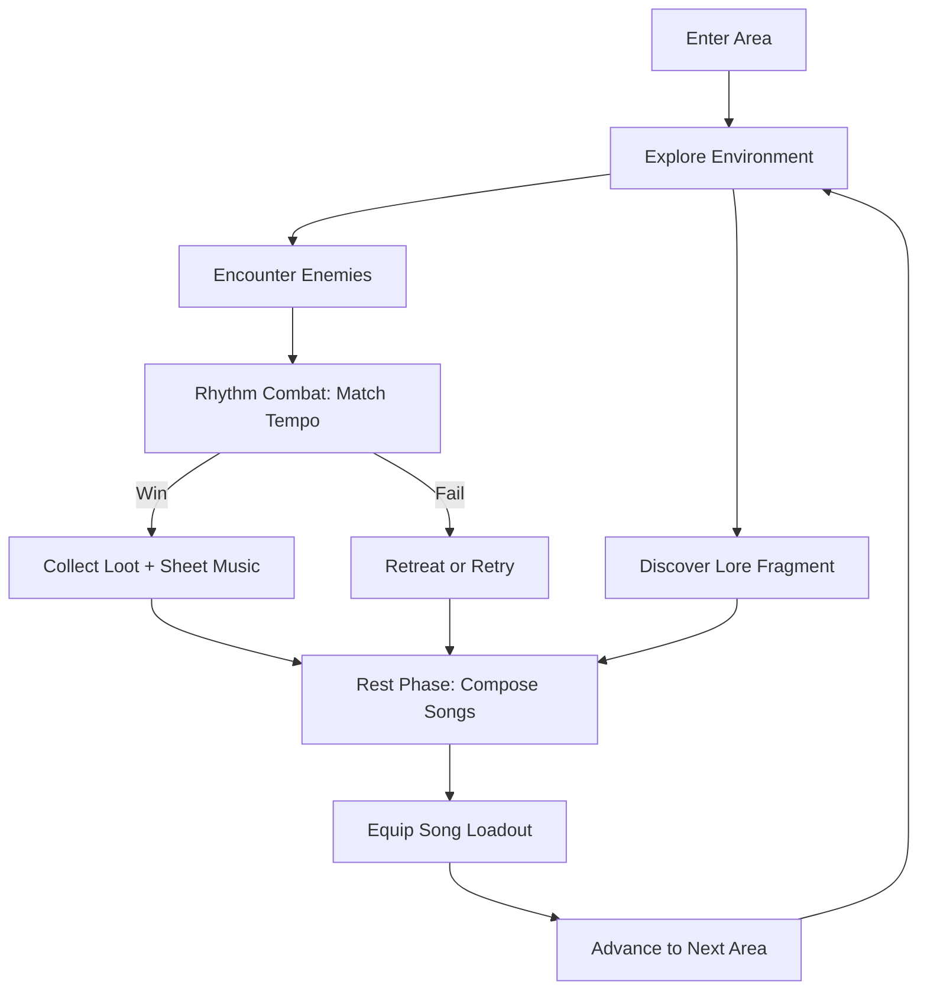
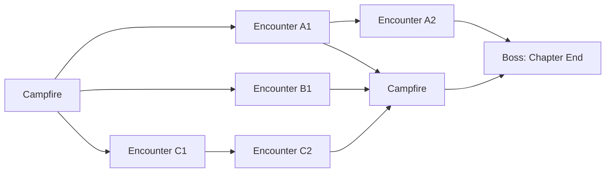

# Blood Bard Odyssey

## Title & Genre

| Attribute | Value |
|-----------|-------|
| **Title** | Blood Bard Odyssey |
| **Genre** | Rhythm Action RPG |
| **Engine** | Unity 2023 LTS (custom FMOD audio middleware) |
| **Platforms** | PC (Steam), PlayStation 5, Nintendo Switch |
| **Monetization** | Premium ($29.99 base) + paid DLC song packs ($7.99 each) |
| **Rating** | T (Teen) -- Fantasy Violence, Mild Language, Suggestive Themes |
| **Target Session** | 25-45 minutes |
| **Estimated Runtime** | 18-22 hours main story, 35-45 hours completionist |

---

## Vision Statement

Blood Bard Odyssey is a rhythm-driven dark fantasy RPG where combat is music and music is magic. The player controls a cursed bard whose songs literally reshape reality, fighting through a world of musical duels where every parry, spell, and dodge lands on the beat. The game exists at the intersection of *Crypt of the NecroDancer's* rhythmic precision and *Transistor's* narrative-driven combat elegance, wrapped in a painterly art style that shifts from warm watercolor to cold ink-wash as the curse deepens. It is built for the player who wants to stop thinking and start feeling -- to achieve a flow state where fingers, music, and strategy dissolve into a single performance.

---

## Core Loop

**Target session length: 25-45 minutes (2-3 encounters + 1 rest/craft phase)**

### Minute-to-Minute Breakdown

| Phase | Duration | Player Action |
|-------|----------|---------------|
| **Explore** | 2-4 min | Walk through environment, find lore fragments, hear ambient music foreshadowing the next encounter's tempo. No time pressure. Collect resonance crystals from breakable objects. |
| **Pre-Encounter** | 30 sec | The game shows the enemy's "sheet music" -- a preview of their rhythm pattern. Player selects which song from their loadout to perform (offensive march, defensive dirge, evasion waltz). |
| **Rhythm Combat** | 2-5 min | Match notes on 4 lanes (left, right, up, down) corresponding to attack, parry, shield, dodge. Timing windows: Perfect (+-30ms), Good (+-60ms), OK (+-100ms), Miss. Sustained notes for shields. Multi-press for combos. The enemy's attacks come on the beat -- if you parry on-time, you deal damage; if you miss, you take damage. |
| **Post-Encounter** | 30 sec | Score screen: accuracy %, combo count, rating (S/A/B/C/D). Rewards: sheet music fragments, resonance crystals, lore pages. S-rank grants a rare fragment. |
| **Rest/Compose** | 3-5 min | At campfires, arrange collected musical phrases into songs. A song is 4-8 phrases arranged in sequence. Each phrase determines a spell type (burst damage, sustain heal, debuff, area denial). The song plays during the next combat, cycling through phrases. |
| **Advance** | 30 sec | Choose next path on a branching map. Some paths are marked with tempo indicators (fast/slow/variable) and difficulty ratings. |

---

## Meta Loop

### What Carries Between Sessions

| System | Description | Growth Feel |
|--------|-------------|-------------|
| **Song Library** | Composed songs persist. Player unlocks new phrase types across chapters (12 phrase families, 96 total phrases). | Expanding toolkit -- each new phrase opens 5-10 new song combinations. |
| **Curse Level** | A permanent narrative meter (0-100) that increases with each boss killed. Unlocks new musical abilities (polyrhythm, double-time, half-time) but shifts the art style darker and changes NPC reactions. | Tension -- power comes at a visual and narrative cost. The player feels the weight of their progression. |
| **Instrument Upgrades** | Three instruments (lute, voice, drum), each upgradable via resonance crystals at campfires. Upgrades widen timing windows, add new note types, or increase spell potency. | Steady, predictable power growth. No randomness. |
| **Lore Codex** | Collected lore fragments fill a codex that provides backstory, enemy weaknesses, and hidden song recipes. 147 total entries. | Completionist satisfaction. Some codex entries unlock secret encounters. |
| **Encounter Records** | Every encounter tracked: best accuracy, highest combo, fastest clear, best rating. Per-encounter leaderboards (global + friends). | Replayability through mastery. No content is "done" until S-ranked. |

### Progression Axes

| Axis | Start | Mid-Game (Chapter 5) | End-Game (Chapter 10) |
|------|-------|----------------------|----------------------|
| Phrases Known | 8 (2 families) | 48 (7 families) | 96 (12 families) |
| Song Slots | 2 | 4 | 6 |
| Curse Level | 0 | 35-55 | 70-100 |
| Timing Window (Perfect) | +-30ms | +-30ms (unchanged) | +-30ms (unchanged) |
| Timing Window (OK) | +-100ms | +-80ms (instrument upgrade) | +-60ms (max upgrade) |
| Difficulty of Encounters | BPM 80-100, 4/4 time | BPM 100-140, 3/4 and 6/8 | BPM 120-180, polyrhythms, time signature changes |
| Max Combo Record | 0 | 150-400 | 400-2000 |

---

## Game Mechanics

### Primary Mechanic: Rhythm Combat

**Input System:** 4-lane rhythm (D-pad / left stick / face buttons on controller; DFJK on keyboard). Each lane maps to a combat action:

| Lane | Input | Action | Visual Cue |
|------|-------|--------|------------|
| Left | D / Left Arrow | Attack (deals damage on hit) | Red note, sharp shape |
| Right | F / Right Arrow | Parry (reflects enemy attack as damage) | Blue note, angular shape |
| Up | J / Up Arrow | Shield (sustain hold for damage reduction) | Green note, long bar |
| Down | K / Down Arrow | Dodge (avoids unblockable attacks) | Yellow note, flick shape |

**Timing Windows:**

| Rating | Window | Combat Effect |
|--------|--------|---------------|
| Perfect | +-30ms | 150% damage, 0% damage taken, +2 combo |
| Good | +-60ms | 100% damage, 25% damage taken, +1 combo |
| OK | +-100ms | 50% damage, 50% damage taken, combo continues |
| Miss | Outside | 0% damage, 100% damage taken, combo breaks |

**Combo System:** Consecutive non-miss hits build a combo meter. At thresholds, the player enters "Crescendo" states:

| Combo | Crescendo Level | Effect |
|-------|-----------------|--------|
| 10+ | Diminuendo | +10% spell power |
| 25+ | Andante | +25% spell power, visual aura |
| 50+ | Forte | +50% spell power, screen pulses with beat |
| 100+ | Fortissimo | +100% spell power, all hits count as Perfect timing |
| 200+ | Apotheosis | Full screen musical notation overlay, invincibility for 4 beats |

**Song Performance During Combat:** The player's equipped song plays as the backing track during combat. Each phrase in the song activates a spell effect when the player successfully hits notes during that phrase's measure:

| Phrase Family | Spell Effect | Note Pattern |
|---------------|-------------|--------------|
| March | Burst damage (scales with Perfect count) | Regular quarter notes |
| Dirge | Life drain (heal 5% per Good+ hit) | Slow half notes with sustains |
| Waltz | Evasion buff (+30% dodge window for 4 beats) | Triplets in 3/4 feel |
| Requiem | Debuff enemy (-25% speed for 4 beats) | Staccato bursts |
| Nocturne | Shield amplification (block 100% for 2 beats) | Long sustained notes |
| Sonata | Combo accelerator (+50% combo gain) | Ascending runs |
| Fugue | Multi-target damage | Alternating lanes rapidly |
| Lullaby | Stun enemy for 2 beats | Gentle, slow pattern |
| Rondo | Counter-attack (auto-parry next 2 hits) | Alternating attack/parry |
| Toccata | Berserk (+200% damage, +200% damage taken) | Fast, dense pattern |
| Aria | Heal 25% HP instantly | Sparse, held notes |
| Overture | Summon spectral ally (auto-attacks for 8 beats) | Dramatic opening pattern |

### Secondary Mechanics

**Song Crafting:** At campfires, the player arranges phrases into a song sequence. Constraints:
- Each song holds 4-8 phrases (starts at 4, unlocks up to 8)
- Phrases must be arranged in a valid musical sequence (the game enforces key/tempo compatibility -- adjacent phrases share at least one note in common)
- The player hears a preview of their composition before confirming
- Song name is auto-generated from phrase names (e.g., "March of the Silent Dirge")
- Each phrase costs "resonance" to equip -- total resonance budget increases with curse level

**Curse System:** After each boss kill, the curse meter increases by 8-12 points. At thresholds:

| Curse Level | Visual Change | Gameplay Change | New Ability |
|-------------|---------------|-----------------|-------------|
| 0-15 | Warm watercolor, bright palette | Standard combat | None |
| 16-30 | Colors begin to desaturate | Enemies speed up 10% | Unlock: Double-time phrases |
| 31-45 | Ink-wash bleeds into edges | Enemies gain 1 extra attack per measure | Unlock: Polyrhythm lane switching |
| 46-60 | Half the screen is ink-wash | Enemy patterns become less predictable | Unlock: Half-time (slow combat for 4 beats, costs HP) |
| 61-75 | Mostly ink-wash, watercolor only on Perfect hits | Enemies gain shield phases | Unlock: Dissonance (intentionally miss to deal burst damage) |
| 76-90 | Full ink-wash with blood-red accents | Enemy patterns can shift mid-encounter | Unlock: Counterpoint (play two lanes simultaneously) |
| 91-100 | World is near-monochrome | Final area unlocked | Unlock: The Last Symphony (narrative choice) |

**Exploration:** Between encounters, the player walks through 2D side-scrolling environments. Exploration is low-pressure and serves three purposes:
1. Collect resonance crystals from the environment (sparkle audio cue, no time pressure)
2. Find lore fragments (text + narration) that fill the codex
3. Hear ambient music that foreshadows the next encounter's tempo and key

### Difficulty Progression

| Chapter | BPM Range | Time Signatures | New Mechanic | Enemy Density |
|---------|-----------|-----------------|--------------|---------------|
| 1 (Prologue) | 72-88 | 4/4 | Basic 4-lane notes | 1 enemy |
| 2 | 80-100 | 4/4 | Sustained notes (shield) | 1-2 enemies |
| 3 | 88-108 | 4/4, 3/4 | Combo hold notes | 2 enemies |
| 4 | 96-116 | 4/4, 3/4, 6/8 | Polyrhythm preview (boss only) | 2-3 enemies |
| 5 | 100-128 | 4/4, 3/4, 6/8 | Lane switching mid-combat | 3 enemies |
| 6 | 108-140 | Mixed, changing mid-encounter | Dissonance enemy type | 3-4 enemies |
| 7 | 116-152 | Mixed + syncopation | Enemy shield phases | 3-4 enemies |
| 8 | 120-160 | All signatures | Double-speed sections | 4 enemies |
| 9 | 128-168 | All + polyrhythms | Counterpoint required for elites | 4-5 enemies |
| 10 (Finale) | 80-180 | All + free time | Symphony boss (5 min performance) | Boss only |

---

## World Design

### Map Structure

The game uses a **branching path structure** (similar to *Slay the Spire* meets *Castlevania: Symphony of the Night*). Each chapter presents a map with 2-3 branching routes. Routes converge at boss encounters. The player sees the full map at the start of each chapter and chooses their path.

**Area Count:** 10 chapters, 6-8 encounters each, totaling 62 encounters + 10 bosses + 4 hidden encounters = 76 total encounters.

### Environments by Chapter

| Chapter | Area Name | Visual Style | Ambient Palette | Music Key |
|---------|-----------|-------------|-----------------|-----------|
| 1 | The Meadow of First Songs | Watercolor, bright greens and golds | Warm, saturated | C Major |
| 2 | The Hollow Choir | Muted autumn, falling leaves | Orange-brown, soft | A Minor |
| 3 | The Brass Bazaar | Stylized marketplace, metallic sheen | Copper, teal accents | D Major |
| 4 | The Catacombs of Lost Carols | Underground, candlelit | Deep purple, gold light | F Minor |
| 5 | The Frozen Overture | Ice caverns, crystalline reflections | White, pale blue, silver | E-flat Major |
| 6 | The Infernal Conservatory | Twisted performance hall, infernal glow | Deep red, black, ember orange | B Minor |
| 7 | The Whispering Library | Infinite bookshelves, floating pages | Dusty gold, sepia, ink black | G Minor |
| 8 | The Clockwork Symphony | Mechanical gears, ticking pendulums | Brass, steel, amber light | A-flat Major |
| 9 | The Abyssal Cadence | Underwater void, bioluminescent | Dark blue, neon green, black | C-sharp Minor |
| 10 | The Silence Before the Song | Featureless white void, gradually fills with color | White to full color | All keys |

### Art Direction Pillars

1. **Music is visible.** Every spell, parry, and combo produces luminous musical notation that lingers in the air. Successful combos paint the screen with flowing staff lines and clefs. Misses cause the notation to shatter into dissonant shards.
2. **The curse is felt, not told.** The art style shifts gradually from warm watercolor to stark ink-wash. NPCs in early chapters are colorful and friendly; by late game they appear as ink sketches with hollow eyes. No UI element explicitly states "curse level" -- the player perceives it.
3. **Silence is terrifying.** Between encounters, the ambient music is always present. When it stops (only in Chapter 9 and the finale), the absence is the loudest sound in the game.

### Audio Progression

| Chapter | Instrumentation | Tempo Feel | Dynamic Range |
|---------|----------------|------------|---------------|
| 1 | Solo lute, soft strings | Gentle, predictable | Narrow (pp to mp) |
| 2 | Lute + choir | Melancholy, swells | Medium (pp to mf) |
| 3 | Full brass, percussion | Energetic, driven | Wide (p to f) |
| 4 | Organ, strings, whispered choir | Somber, reverent | Medium (pp to f) |
| 5 | Glass marimba, harp, wind | Crystalline, ethereal | Wide (ppp to ff) |
| 6 | Distorted guitar, heavy drums, dissonant choir | Aggressive, oppressive | Maximum (ppp to fff) |
| 7 | Solo piano, turning pages, whispered reading | Intimate, cerebral | Narrow (pp to mp) |
| 8 | Clockwork percussion, prepared piano, metronomes | Mechanical, relentless | Wide (p to ff) |
| 9 | Sub bass, whale song, distant choir, near-silence | Void-like, abyssal | Extreme (pppp to ff) |
| 10 | Full orchestra + all previous instruments | Everything, building to unity | Full (pppp to ffff) |

---

## Narrative

### Tone Spectrum (7-Axis)

| Axis | Position | Description |
|------|----------|-------------|
| **Hopeful vs. Despairing** | 65% despairing | The world is dying, but the bard's music is a genuine beacon. |
| **Lighthearted vs. Grim** | 70% grim | The subject matter is dark (loss, corruption, sacrifice) but the bard's personality keeps it from being nihilistic. |
| **Linear vs. Abstract** | 55% abstract | The story is straightforward, but the curse's effects on perception blur reality. |
| **Intimate vs. Epic** | 60% intimate | The scale is personal -- this is one bard's journey, not a world-saving prophecy. |
| **Rational vs. Emotional** | 75% emotional | Decisions are driven by feeling and memory, not logic and strategy. |
| **Grounded vs. Mythic** | 50/50 | The world has mundane elements (taverns, markets) alongside cosmic forces. |
| **Silent vs. Verbose** | 40% verbose | Lore fragments are plentiful and detailed, but cutscenes are short and musical. |

### Story Spine (8-Point Structure)

1. **Equilibrium:** The bard (unnamed, player-chosen pronoun) performs in a small village, loved by locals. Their music is beautiful but ordinary. They play at a tavern called The Restful Note.

2. **Inciting Incident:** During a performance, the bard discovers an ancient sheet music hidden inside their lute -- "The Unfinished Symphony." Upon playing even one measure, reality warps. A shadow entity called The Dissonance is released and bonds with the bard, cursing them. The village is silenced (literally -- all sound ceases).

3. **First Complication:** The bard learns from a spectral conductor (The Maestro) that The Dissonance was sealed by a composer centuries ago using the completed symphony. To break the curse, the bard must compose the missing movements by defeating 10 cursed musicians who each hold a fragment. But each fragment consumed deepens the curse, warping the bard's body and mind.

4. **Rising Action:** The bard travels through increasingly corrupted lands, defeating cursed musicians and absorbing their fragments. Each musician is a tragic figure who once tried and failed to complete the symphony. The bard's curse worsens: their left hand becomes shadow, their voice gains an echo, their reflection shows a different person.

5. **Midpoint Reversal (Chapter 5):** After defeating the fifth musician (The Frozen Virtuoso), the bard discovers that The Maestro has been lying. The symphony was never meant to be "completed" -- it was designed to be a sacrifice. The Maestro engineered the curse to create a vessel powerful enough to contain The Dissonance permanently. The bard is not breaking the curse; they are becoming the new prison.

6. **Crisis (Chapter 8-9):** The bard reaches the point of no return. Their body is mostly shadow. NPCs who were friendly now react with fear or pity. The Maestro offers mercy: stop now, retain what humanity remains, but The Dissonance will eventually consume the world. The alternative: continue, absorb the final fragments, and face the final choice.

7. **Climax (Chapter 10):** The Last Symphony. The bard confronts The Dissonance in the void. This is a 5-minute musical performance where The Dissonance plays against the bard. The player performs their composed songs against an enemy that counterpoints every melody. The outcome depends on performance (S-rank changes the ending).

8. **Resolution:** Two endings based on final choice:
   - **Break the Curse:** The bard completes the symphony and dissolves The Dissonance. Music returns to the world. The bard loses all magical ability and returns to being an ordinary musician. The world heals. Bittersweet.
   - **Keep the Music:** The bard absorbs The Dissonance fully, becoming an immortal being of pure music. They retain their power but lose their humanity. The world continues to hear their music, but the bard can never interact with it again. Tragic.
   - **Secret Ending (S-Rank required):** The bard discovers a third option -- they rewrite the symphony to share The Dissonance across all living things, diluting the curse so no single being bears it. The world gains a subtle magic. The bard remains human but changed. Hopeful.

### Character Table

| Character | Role | Theme | Encounters | Fate |
|-----------|------|-------|------------|------|
| The Bard | Protagonist | Sacrifice vs. self-preservation | All chapters | Player choice |
| The Dissonance | Antagonist / shadow self | The fear of losing oneself | Boss: Chapter 10 | Depends on ending |
| The Maestro | False mentor | Manipulation dressed as guidance | Campfires, Chapters 1-8 | Revealed as antagonist in Ch. 5 |
| The Hollow Choir (Ch. 2 Boss) | Cursed musician | Guilt of abandoned voices | Boss: Chapter 2 | Defeated, fragment absorbed |
| The Brass Tyrant (Ch. 3 Boss) | Cursed musician | Obsession with perfection | Boss: Chapter 3 | Defeated, fragment absorbed |
| The Silent Cantor (Ch. 4 Boss) | Cursed musician | Grief that silences | Boss: Chapter 4 | Defeated, fragment absorbed |
| The Frozen Virtuoso (Ch. 5 Boss) | Cursed musician | Beauty frozen to preserve it | Boss: Chapter 5 | Defeated, reveals truth |
| The Infernal Diva (Ch. 6 Boss) | Cursed musician | Ambition that consumes | Boss: Chapter 6 | Defeated, fragment absorbed |
| The Whispering Librarian (Ch. 7 Boss) | Cursed musician | Knowledge that isolates | Boss: Chapter 7 | Defeated, fragment absorbed |
| The Clockmaker (Ch. 8 Boss) | Cursed musician | Control through mechanism | Boss: Chapter 8 | Defeated, fragment absorbed |
| The Abyssal Singer (Ch. 9 Boss) | Cursed musician | Loneliness that echoes | Boss: Chapter 9 | Defeated, fragment absorbed |
| The First Composer (Lore only) | Ancient figure | The origin of the curse | Codex entries only | Died completing the original seal |

---

## Player Personas

### P-003: Hiroshi Tanaka -- "The RPG Addict"

**Why this game fits:** Blood Bard Odyssey is a systems-rich RPG with deep build variety (96 phrases, thousands of song combinations), completionist hooks (76 encounters each with S-rank tracking, 147 codex entries), and a progression curve that rewards mastery. Hiroshi treats every game as a completion project -- this game gives him 35-45 hours of content to master.

**Predicted experience:**
- Plays 3-4 hours daily, focusing on S-ranking every encounter before advancing
- Theorycrafts optimal song builds on Discord (which phrase combos maximize damage windows)
- Loves the phrase collection system -- 96 phrases across 12 families is exactly the kind of completion grid that drives him
- Skips the lore codex initially, returns to 100% it after beating the main story
- Will spend $7.99 on DLC song packs that include new phrases, extending his completion target

### P-008: David Park -- "The Achievement Hunter"

**Why this game fits:** Blood Bard Odyssey has a built-in achievement system through encounter records, combo tracking, and the S-rank system. David spreads playtime across multiple games (1-2 hours/day), and this game's 25-45 minute session length fits his rotation perfectly. The branching paths mean he needs multiple playthroughs for full completion.

**Predicted experience:**
- Rotates Blood Bard Odyssey with 4-5 other games, playing 30-minute sessions
- Methodically S-ranks each encounter using the encounter records screen as his checklist
- Maintains a spreadsheet tracking which paths he has taken and which encounters he has missed
- Will discover all 4 hidden encounters through systematic exploration
- Frustrated by the curse system's permanent consequences -- wants a way to undo curse choices for completionist purposes (this is a real design tension to address)

### P-001: Alex Rivera -- "The Ranked Grinder"

**Why this game fits:** Rhythm games attract competitive players. Alex treats every encounter as a leaderboard challenge. The global + friend leaderboards for each encounter give him the competitive outlet he needs. The skill ceiling is high enough (Perfect at +-30ms, polyrhythms, counterpoint) that mastery takes hundreds of hours.

**Predicted experience:**
- Blazes through the story in 15 hours, ignoring lore and song crafting
- Spends the next 30+ hours optimizing encounter scores and climbing global leaderboards
- Streams S-rank attempts, building a small Twitch audience around rhythm combat
- Engages deeply with the combo system -- chases Apotheosis (200+ combo) on every encounter
- Will buy DLC packs that add new encounters with higher skill ceilings

### P-020: Yuki Sato -- "The Language-Challenged Player"

**Why this game fits:** Blood Bard Odyssey communicates primarily through music and visual language. The lore codex is text-heavy, but the core gameplay (rhythm, visual cues, color-coded notes) is language-independent. Yuki will pay premium for quality Japanese localization, and this game's narrative-heavy content justifies the investment.

**Predicted experience:**
- Purchases the Japanese-localized version on Nintendo Switch
- Connects deeply with the narrative -- the bard's sacrifice story resonates with Japanese storytelling traditions
- Appreciates that combat requires no reading -- all information is conveyed through color, shape, and sound
- Will recommend the game on Japanese gaming forums if localization quality is high
- Frustrated if song phrase names are poorly translated (phrases like "March" and "Dirge" need culturally appropriate Japanese terms)

---

## User Stories

### Core Mechanics (8 stories)

1. **US-001** (P-003, P-008): As a rhythm combat player, I want to see the timing window feedback immediately after each note (Perfect/Good/OK/Miss with a color flash and sound cue), so that I can adjust my timing in real-time without looking at a separate HUD element.

2. **US-002** (P-001): As a competitive player, I want to see my encounter accuracy percentage, max combo, and global rank immediately after each combat, so that I can track my leaderboard position without navigating to a separate menu.

3. **US-003** (P-003, P-008): As a completionist, I want to browse my full song library with filter options (by phrase family, curse requirement, spell effect), so that I can theorycraft optimal builds for specific encounters.

4. **US-004** (P-003): As a song composer, I want to hear a full preview of my arranged song before confirming it, so that I can verify the musical flow and make sure adjacent phrases transition smoothly.

5. **US-005** (P-001): As a competitive player, I want a practice mode where I can replay any previously encountered enemy pattern at reduced speed (75%, 50%), so that I can learn complex polyrhythms before attempting them at full speed.

6. **US-006** (P-003, P-008): As a systems-focused player, I want to see the exact spell effects and numerical values for each phrase in my song before entering combat, so that I can make informed loadout decisions.

7. **US-007** (P-001, P-003): As a skilled player, I want the combo Crescendo system to provide visible and audible escalation (Diminuendo through Apotheosis), so that flow-state achievement feels tangible and rewarding.

8. **US-008** (P-008): As an achievement hunter, I want encounter records to track S-rank status, best combo, best accuracy, and fastest clear per encounter, so that I have clear mastery targets for every piece of content.

### Narrative (5 stories)

9. **US-009** (P-003, P-020): As a story-driven player, I want each boss encounter to be preceded by a 60-second musical cutscene showing the cursed musician's backstory, so that the combat has emotional stakes beyond gameplay.

10. **US-010** (P-020): As a non-native English speaker, I want full voice acting in Japanese (and other supported languages) with accurate localization of musical terminology, so that the narrative experience matches the English version in emotional impact.

11. **US-011** (P-003): As a lore collector, I want lore fragments found during exploration to be narrated aloud by the bard (in their internal monologue voice), so that reading lengthy text is not required to understand the world's backstory.

12. **US-012** (P-003, P-008): As a player invested in the curse system, I want visible, in-world feedback of my curse level through the environment, NPC behavior, and art style changes rather than a UI meter, so that the curse feels immersive rather than gamified.

13. **US-013** (P-003, P-008): As a player facing the final choice, I want the game to present the three endings (break curse, keep music, rewrite symphony) through a seamless gameplay sequence rather than a dialogue menu, so that the emotional weight matches the mechanical weight of the decision.

### Progression (5 stories)

14. **US-014** (P-003, P-008): As a progression-focused player, I want each chapter to unlock exactly one new phrase family (with 8 phrases inside it), so that I have a predictable cadence of new tools to experiment with.

15. **US-015** (P-003): As a build optimizer, I want instrument upgrades to provide clearly labeled numerical benefits (timing window expansion, spell potency increase), so that I can calculate the optimal upgrade path.

16. **US-016** (P-008): As a completionist, I want the branching map to visually indicate which paths I have completed and which I have not, so that I can plan subsequent playthroughs to cover all content.

17. **US-017** (P-001): As a competitive player, I want new curse abilities (polyrhythm, double-time, counterpoint) to be optional tools that I can activate or deactivate, so that I can choose whether to use them for score optimization or stick with the basekit.

18. **US-018** (P-003, P-008): As a player who wants to experiment, I want a "New Game+" mode that preserves my full song library and curse level while resetting encounter progress, so that I can try different narrative paths with my full toolkit.

### Exploration (4 stories)

19. **US-019** (P-003, P-020): As an explorer, I want resonance crystals to emit a soft audio pulse that grows louder as I approach them, so that I can find collectibles through sound without needing visual guides.

20. **US-020** (P-008): As a completionist, I want hidden encounters to be discoverable through lore codex clues rather than random exploration, so that finding all content feels earned rather than lucky.

21. **US-021** (P-003, P-008): As a player who appreciates environmental storytelling, I want each area's ambient music to subtly incorporate phrases from the upcoming boss's pattern, so that attentive players can prepare their loadout based on audio foreshadowing.

22. **US-022** (P-020): As a player who values atmosphere, I want exploration segments to have no time pressure and no fail states, so that I can enjoy the art direction and music at my own pace between intense combat encounters.

### Accessibility (4 stories)

23. **US-023** (P-020): As a player who struggles with rapid text, I want all critical gameplay information (note timing, spell effects, enemy patterns) to be conveyed through color, shape, and sound rather than text, so that I can play at full effectiveness regardless of language.

24. **US-024** (P-020): As a player in Japan, I want the game's rhythm notation to use the same visual language as Japanese rhythm games (note highways scrolling from top to bottom), so that the learning curve is familiar.

25. **US-025** (P-001, P-003): As a player with varying skill levels, I want an assist mode that broadens timing windows to +-150ms for OK without disabling leaderboards (flagged as "Assisted" on the board), so that I can enjoy the game at my skill level while still engaging with competitive features.

26. **US-026** (P-020): As a player who prefers console, I want full button remapping on all platforms (PC, PS5, Switch), so that I can customize the 4-lane inputs to my preferred controller layout.

### Social and Community (3 stories)

27. **US-027** (P-001): As a streamer, I want a clean spectator mode that shows the note highway, the bard character, and the combo meter without cluttering the screen with UI elements, so that my Twitch audience can follow the action.

28. **US-028** (P-001, P-003): As a competitive player, I want to share encounter replays (auto-recorded last 10 encounters) as exportable video clips, so that I can analyze my performance and share clutch moments.

29. **US-029** (P-003, P-008): As a community member, I want a song-sharing system where I can export my composed songs as shareable codes (alphanumeric strings), so that I can share builds with friends and on forums.

---

## Monetization

### Model: Premium + DLC

**Why premium fits this game:** Blood Bard Odyssey is a narrative-driven, single-player experience with a clear beginning, middle, and end. The curse system creates permanent consequences that would feel manipulative in a F2P model (paying to undo curse progression would undermine the game's thematic core). The target audience (P-003, P-008, P-001) willingly pays $20-40 for premium games with depth. Rhythm games historically perform well at premium price points (*Thumper* $19.99, *Sayonara Wild Hearts* $12.99, *Hi-Fi RUSH* $29.99).

### Pricing

| SKU | Price | Contents |
|-----|-------|----------|
| Base Game | $29.99 | Full 10-chapter story, 76 encounters, 96 phrases, 3 endings |
| Song Pack 1: "Elegy of Ash" | $7.99 | 1 new chapter (6 encounters + 1 boss), 12 new phrases, 1 new ending |
| Song Pack 2: "The Iron Nocturne" | $7.99 | 1 new chapter (6 encounters + 1 boss), 12 new phrases, 1 new ending |
| Song Pack 3: "Chorus of the Deep" | $7.99 | 1 new chapter (6 encounters + 1 boss), 12 new phrases, 1 new ending |
| Deluxe Edition | $49.99 | Base game + all 3 song packs (effectively $5.97 savings) |
| Soundtrack | $14.99 | Full OST (48 tracks, FLAC + MP3) |

### DLC Release Roadmap

| DLC | Release Window | New Content | Development Cost |
|-----|---------------|-------------|------------------|
| Song Pack 1: "Elegy of Ash" | Month 4 post-launch | 7 encounters, 12 phrases, 1 ending, 1 environment | $120K |
| Song Pack 2: "The Iron Nocturne" | Month 8 post-launch | 7 encounters, 12 phrases, 1 ending, 1 environment | $120K |
| Song Pack 3: "Chorus of the Deep" | Month 12 post-launch | 7 encounters, 12 phrases, 1 ending, 1 environment | $120K |

### Revenue Projections (4 Scenarios)

| Metric | Modest | Expected | Strong | Breakout |
|--------|--------|----------|--------|----------|
| Base units sold (Year 1) | 15,000 | 45,000 | 120,000 | 400,000 |
| Base revenue (70% net after platform) | $314,850 | $944,550 | $2,518,800 | $8,396,000 |
| DLC attach rate | 15% | 25% | 35% | 45% |
| DLC revenue (3 packs, Year 1) | $75,590 | $269,865 | $881,595 | $3,238,560 |
| Soundtrack sales | 2,000 | 5,000 | 15,000 | 50,000 |
| Soundtrack revenue | $20,990 | $52,475 | $157,425 | $524,750 |
| **Total Year 1 Revenue** | **$411,430** | **$1,266,890** | **$3,557,820** | **$12,159,310** |
| Breakeven (vs. $1.05M budget) | No | Yes | Yes | Yes |

### KPI Targets

| KPI | Target | Measurement |
|-----|--------|-------------|
| Steam rating | 85%+ positive | Steam review algorithm |
| Completion rate (main story) | 40%+ | Achievement tracking |
| Average session length | 30-40 minutes | Telemetry |
| DLC attach rate | 25%+ | Sales data |
| Refund rate | Under 8% | Platform data |
| Speed to first S-rank | Under 10 hours | Telemetry (engagement indicator) |

---

## Production Plan

### Team Composition

| Role | Count | Phase | Monthly Cost (Loaded) |
|------|-------|-------|----------------------|
| Game Director / Lead Designer | 1 | All phases | $12,000 |
| Programmer (Gameplay + Rhythm Engine) | 2 | All phases | $18,000 |
| Programmer (Audio Engine / FMOD Integration) | 1 | Phases 1-3 | $9,000 |
| Composer / Audio Director | 1 | All phases | $10,000 |
| Sound Designer | 1 | Phases 2-3 | $7,000 |
| 2D Artist (Characters + Environments) | 2 | Phases 1-3 | $14,000 |
| UI/UX Designer | 1 | Phases 1-2 | $8,000 |
| Technical Artist (Shaders, VFX) | 1 | Phases 2-3 | $9,000 |
| Writer / Narrative Designer | 1 | Phases 1-2 | $7,000 |
| QA Tester | 1 | Phase 3 | $5,000 |
| Producer / Project Manager | 1 | All phases | $9,000 |
| **Total** | **13** | | **$108,000/month** |

### Timeline (18 Months)

| Month | Phase | Milestone | Deliverable |
|-------|-------|-----------|-------------|
| 1 | Pre-Production | Engine prototype validated | Rhythm engine running with 4-lane input, timing windows functional, audio sync confirmed at 60fps and 120fps |
| 2 | Pre-Production | Core combat loop playable | Vertical slice of 1 encounter (Chapter 1 difficulty), basic note patterns, scoring system |
| 3 | Pre-Production | Song crafting prototype | Phrase arrangement system functional, preview playback working, 3 phrase families implemented |
| 4 | Production | Chapter 1-2 content complete | 2 environments, 12 encounters, 2 bosses, art style locked, Chapter 1 fully playable start to finish |
| 5 | Production | Curse system integrated | Visual curse progression (0-100) working, 2 curse thresholds implemented and tested |
| 6 | Production | Chapters 3-4 complete | 4 environments total, 28 encounters, 4 bosses, 4 phrase families, save system operational |
| 7 | Production | Midpoint narrative implemented | Maestro reveal cutscene, Chapter 5 boss, narrative branch system functional |
| 8 | Production | Chapters 5-7 complete | 7 environments, 48 encounters, 7 bosses, 8 phrase families, all mid-game mechanics |
| 9 | Production | Chapters 8-9 complete | 9 environments, 62 encounters, 9 bosses, all phrase families, polyrhythm and counterpoint mechanics |
| 10 | Production | Finale implemented | Chapter 10 void environment, final boss (5-minute symphony), 3 endings, secret ending trigger |
| 11 | Production | Content complete (Alpha) | All 76 encounters playable, all 96 phrases collectible, all lore entries written, full game completable |
| 12 | Production | Polish pass | Art polish (curse visual transitions), audio mixing, UI animations, screen shake tuning |
| 13 | QA / Beta | Internal QA | Full playthrough testing, timing window edge cases, save/load integrity, platform-specific testing |
| 14 | QA / Beta | Closed beta (500 players) | External playtest, rhythm difficulty calibration, balance pass on encounter scoring |
| 15 | QA / Beta | Open beta / demo (Steam Next Fest) | Public demo (Chapters 1-2), collect feedback, adjust difficulty curve based on telemetry |
| 16 | QA / Beta | Certification submission | Console certification (PS5, Switch), platform-specific compliance, age rating submissions |
| 17 | Launch Prep | Day-1 patch preparation | Bug fixes from beta feedback, final audio mastering, achievement/trophy integration |
| 18 | Launch | Release | PC (Steam), PS5, Switch simultaneous launch |

### Budget Breakdown

| Category | Amount | % of Total |
|----------|--------|------------|
| Salaries (13 people, 18 months, $108K/month) | $1,044,000 | 74.6% |
| Software Licenses (Unity Pro, FMOD, PS5/Switch dev kits) | $62,000 | 4.4% |
| Audio Production (recording, mixing, mastering, musicians) | $85,000 | 6.1% |
| Art Outsourcing (additional environment art, animation) | $65,000 | 4.6% |
| QA / Playtesting | $45,000 | 3.2% |
| Marketing (trailer, Steam page, press outreach, events) | $60,000 | 4.3% |
| Localization (JP, FR, DE, ES, PT-BR, KO, ZH-CN) | $35,000 | 2.5% |
| Contingency (10%) | $14,000 | 1.0% |
| **Total** | **$1,410,000** | **100%** |

### Risk Register

| Risk | Probability | Impact | Mitigation |
|------|------------|--------|------------|
| Rhythm engine audio latency on Switch | Medium | High | Prototype on Switch in Month 1; use FMOD low-latency API; budget a fallback "visual-only" mode |
| Curse system alienates players who dislike permanent consequences | Medium | Medium | Add an opt-in "Maestro's Mercy" toggle that softens curse visual changes without affecting gameplay |
| Audio file size exceeds Switch cartridge limits | Low | High | Use adaptive music streaming; compress ambient tracks to OGG Vorbis at 128kbps; boss tracks at 256kbps |
| Scope creep from narrative branches | Medium | Medium | Lock story structure in pre-production; 3 endings maximum; no branching before Chapter 5 |
| Composer bottleneck (all audio goes through 1 person) | High | Medium | Hire sound designer in Phase 2; composer focuses on melodies and boss themes, sound designer handles SFX and ambient |

---

## Technical Requirements

### Platform Specifications

| Spec | PC (Minimum) | PC (Recommended) | PlayStation 5 | Nintendo Switch |
|------|-------------|------------------|---------------|-----------------|
| **OS** | Windows 10 64-bit | Windows 10/11 64-bit | System software 23.0+ | OS 17.0+ |
| **CPU** | Intel i5-7400 / AMD Ryzen 5 1400 | Intel i7-8700 / AMD Ryzen 7 2700X | Custom AMD Zen 2 | Custom NVIDIA Tegra |
| **RAM** | 8 GB | 16 GB | 16 GB GDDR6 | 4 GB |
| **GPU** | NVIDIA GTX 960 / AMD RX 570 | NVIDIA RTX 2060 / AMD RX 5700 | Custom RDNA 2 | Custom NVIDIA |
| **Storage** | 15 GB SSD | 15 GB SSD | 12 GB | 10 GB |
| **Audio** | Stereo output | Stereo + headphone | Stereo + 3D Audio | Stereo |
| **Input** | Keyboard (DFJK) or gamepad | Keyboard or gamepad | DualSense (haptic feedback supported) | Joy-Con / Pro Controller |
| **Target FPS** | 60 fps | 120 fps (optional) | 60 fps (4K) / 120 fps (1080p) | 60 fps docked / 30 fps handheld |

### Key Technical Challenges

| Challenge | Description | Mitigation Strategy |
|-----------|-------------|---------------------|
| **Audio-Visual Sync** | Rhythm gameplay requires sub-frame audio precision. Even 10ms of drift makes Perfect timing feel wrong. | Use FMOD timeline sync API with custom clock. Run audio engine on a dedicated thread. Never tie audio playback to render frame rate. Test with high-speed camera (240fps) to verify actual vs displayed timing. |
| **Switch Performance** | The Switch Tegra X1 is 2015 hardware. Handheld mode runs at 30fps, which changes the rhythm feel fundamentally. | Handheld mode uses half-frame note scrolling (notes move every other frame but audio timing remains frame-independent). Target 60fps docked. If handheld cannot hold 30fps, reduce particle effects and note highway resolution. |
| **Dynamic Music Transitions** | Songs transition between phrases in real-time based on player performance. Crossfading must be musically seamless. | Pre-compose all transition points as 2-beat overlap regions. FMOD handles crossfades at the beat boundary. If the player misses a transition window, hold the current phrase for 2 extra beats (audible but not punitive). |
| **Curse Visual Shader Performance** | Real-time watercolor-to-ink-wash transition on all scene elements is GPU-intensive. | Use a fullscreen post-process pass with a look-up texture (LUT) that shifts based on curse level. Pre-bake 10 LUTs (curse 0-100 in steps of 10). Smoothly interpolate between LUTs. Cost: approximately 0.5ms per frame on GTX 960. |
| **Save System Integrity** | The curse system creates permanent progression that cannot be reverted. Save corruption would be devastating. | Triple-write save system (3 copies on disk). Save after every encounter and campfire. Cloud save sync on all platforms. Include a "save file repair" tool accessible from the title screen. |
| **Localization of Music Terminology** | Musical terms like "polyrhythm," "counterpoint," and "diminuendo" do not have direct equivalents in all languages. | Work with native-speaking musicians for localization. Create a shared glossary in Month 2. Japanese localization uses established terms from Japanese rhythm game tradition (e.g., terms from *Taiko no Tatsujin*, *Beatmania*). |

### Input Latency Budget

| Platform | Maximum Acceptable Input-to-Audio Latency | Target Latency |
|----------|-------------------------------------------|----------------|
| PC (wired controller) | 20ms | 8ms |
| PC (Bluetooth controller) | 30ms | 15ms |
| PC (keyboard) | 15ms | 5ms |
| PlayStation 5 (DualSense wired) | 20ms | 10ms |
| PlayStation 5 (DualSense wireless) | 25ms | 12ms |
| Switch docked (Pro Controller) | 25ms | 12ms |
| Switch handheld (Joy-Con) | 20ms | 10ms |

### Audio Format Specifications

| Audio Type | Format | Sample Rate | Bitrate | Channels |
|------------|--------|-------------|---------|----------|
| Boss battle music | OGG Vorbis | 48kHz | 256kbps | Stereo |
| Ambient / exploration | OGG Vorbis | 44.1kHz | 128kbps | Stereo |
| Sound effects (notes, impacts) | WAV (uncompressed) | 48kHz | 1411kbps | Mono |
| UI sounds | WAV (uncompressed) | 44.1kHz | 1411kbps | Mono |
| Voice acting | OGG Vorbis | 44.1kHz | 160kbps | Mono |
| Lore narration | OGG Vorbis | 44.1kHz | 192kbps | Mono |
