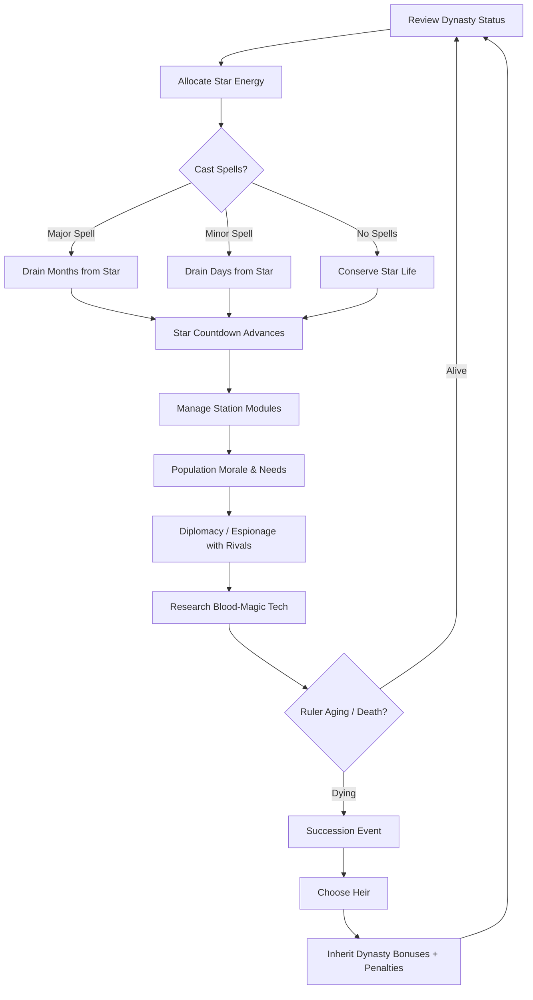
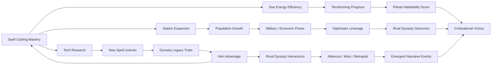

# Blood Mage Space Station

## Title & Genre

| Field | Value |
|-------|-------|
| **Title** | Blood Mage Space Station |
| **Genre** | Grand Strategy / 4X with Dynasty Simulation |
| **Engine** | Unity 2024 LTS (ECS + DOTS for simulation scale, URP for station visualization) |
| **Platform** | PC (Steam/Epic), macOS, Linux |
| **Monetization** | Premium -- $39.99 base, dynasty scenario DLCs ($9.99-$14.99) |
| **Rating** | ESRB T (Blood, Fantasy Violence, Mild Language) / PEGI 16 / CERO C |

---

## Vision Statement

Blood Mage Space Station is a grand strategy game where you command a blood mage dynasty aboard a colossal generation ship orbiting a dying star. Your bloodline's magical potency is tethered to the star's remaining life force, and every spell you cast drains months or years from its final collapse. You expand your station module by module, manage population morale across social strata, research blood-magic technologies, and compete against seven rival blood mage dynasties on neighboring stations. The core tension is existential and irreducible: do you hoard the star's remaining energy to extend your dynasty's comfortable reign, or do you spend it boldly to terraform a habitable planet before the star goes supernova? The game ends when the star dies. Your score is measured by what your dynasty accomplished -- civilizational legacy, not personal survival. This is Stellaris meets Crusader Kings by way of blood magic in space, where the resource you spend is literally the lifetime of your sun.

---

## Core Loop

**Target session length:** 60--120 minutes



### Core Loop Breakdown

| Step | Player Action | System Response | Strategic Depth |
|------|--------------|----------------|-----------------|
| 1. Review Dynasty | Assess current ruler's health, heir candidates, dynasty prestige, rival standings | Dynasty dashboard shows bloodline traits, accumulated legacy bonuses, active alliances/wars | Long-term planning across generations |
| 2. Allocate Star Energy | Choose how much stellar life force to channel into spells this cycle | Star countdown decrements; visual feedback shows star dimming or flaring | Every spell is an irreversible resource expenditure |
| 3. Cast Spells | Select from researched spells (shields, FTL research bursts, crop yield boosts, military strikes) | Spell effects apply; star life force consumed; cooldowns begin | Cost-benefit analysis of irreplaceable energy vs immediate need |
| 4. Manage Station | Build, upgrade, or reposition station modules in real-time builder interface | Module efficiency depends on orbital position (sun-facing = more power, more radiation) | Spatial optimization with real physics consequences |
| 5. Manage Population | Address strata needs (workers, mages, nobles), balance morale, suppress or encourage factions | Morale affects productivity, rebellion risk, magical output per capita | Multi-pop management with conflicting class interests |
| 6. Diplomacy | Negotiate with 7 rival dynasties, trade energy credits, form alliances, conduct espionage | AI dynasties react to relative power, ideology alignment, historical actions | Emergent geopolitical dynamics |
| 7. Research | Invest in blood-magic tech tree (4 branches: Stellar, Biological, Constructive, Martial) | Unlocks new spells, station modules, succession options | Tech path defines dynasty identity across generations |
| 8. Succession | Choose heir when ruler ages toward death (around 60-80 in-game years per ruler) | Heir inherits dynasty traits + ancestor legacy bonuses; personality differs | Each generation reshapes strategic identity |


---

## Meta Loop

### Generation-to-Generation Progression



### Progression Axes

| Axis | What Grows | How It Feels | Cap |
|------|-----------|-------------|-----|
| **Dynasty Legacy** | Accumulated ancestor traits, bloodline prestige, succession bonuses | Each generation feels meaningfully different -- a warlike grandfather unlocks military focus, a diplomatic mother opens trade advantages | Unlimited across generations (game ends at star death, typically 8-15 generations) |
| **Terraforming Progress** | Target planet atmosphere, temperature, water coverage, ecosystem complexity | The most visible long-term project -- watching a dead rock slowly become a world your people could live on | 100% habitability (victory condition, not guaranteed) |
| **Station Complexity** | Module count, population capacity, research output, military strength | Your station grows from a cluster of survival modules to a sprawling orbital city | ~120 modules maximum (hardware and physics constrained) |
| **Tech Mastery** | 4-branch tech tree depth, spell variety, efficiency upgrades | The range of strategic options expands exponentially as you unlock higher-tier blood-magic | 4 branches, 8 tiers each, ~160 techs total |
| **Diplomatic Web** | Relationship depth with 7 rivals, trade networks, intelligence networks | The galaxy feels alive -- rivals scheme, ally, betray, and evolve alongside you | Dynamic -- no cap, continuously shifting |
| **Star Countdown** | Remaining stellar life force (the universal timer) | The ticking clock creates urgency in every decision. The game literally gets harder as you succeed (more to lose) | Ends at 0 -- star collapses, game over |


---

## Game Mechanics

### Primary Mechanic: Star Drain System

The star is both your power source and your countdown timer. It begins with a fixed life expectancy (configurable by difficulty, typically 500 in-game years). Every spell draws from this pool.

**Star Energy Expenditure Table:**

| Spell Category | Example Spells | Star Life Cost | Cooldown | Strategic Weight |
|---------------|----------------|---------------|----------|-----------------|
| **Minor Utility** | Heal crew, boost crop yields, repair module, scan rival station | 1-3 days | 1-5 cycles | Routine maintenance -- cheap but adds up |
| **Moderate Strategic** | Shield station from solar flare, boost research speed, enhance diplomacy, espionage probe | 1-4 weeks | 10-30 cycles | Meaningful expenditure -- requires planning |
| **Major Investment** | Power FTL research burst, terraform planet increment, construct mega-module, devastate rival station | 1-6 months | 50-100 cycles | Irreversible commitment -- defines strategy |
| **Cataclysmic** | Supernova preview (reveals exact death date), mass terraform leap, resurrect dead heir, annihilate rival dynasty | 1-3 years | Once per ruler lifetime | Existential decision -- changes the game |

**Star Health Visualization:**

| Star Life Remaining | Visual State | System Effects |
|--------------------|------------- |----------------|
| 100-75% | Bright yellow-white, stable corona | All systems nominal, maximum spell efficiency |
| 75-50% | Dimmer, orange tint, occasional micro-flares | Spell costs increase 10%, solar flare events begin |
| 50-25% | Deep orange, visible dark spots, frequent flares | Spell costs increase 25%, module radiation damage, population anxiety rises |
| 25-10% | Red giant swelling, pulsing, violent flares | Spell costs increase 50%, evacuation pressure, rival dynasties become desperate |
| 10-0% | Crimson, convulsing, visible collapse | Spell costs double, chaos events cascade, endgame triggers |

### Secondary Mechanic: Dynasty Succession

Your blood mage avatar ages in real-time. A ruler typically lives 60-80 in-game years (faster with heavy spell use, slower with conservation). When a ruler approaches death, a succession event triggers.

**Heir Generation System:**

| Heir Attribute | Source | Range | Impact |
|---------------|--------|-------|--------|
| **Magical Affinity** | Bloodline + random variance | Stellar / Biological / Constructive / Martial | Determines spell cost efficiency in one branch |
| **Personality Trait** | 2-3 from pool of 18 | Aggressive, Cautious, Scholarly, Charismatic, Paranoid, etc. | Modifies diplomacy, population morale, decision outcomes |
| **Legacy Inheritance** | Sum of ancestor choices | Up to 3 active legacy traits | Persistent bonuses from major decisions ancestors made |
| **Health** | Bloodline purity + random | 40-100 base | Affects lifespan and spell tolerance |
| **Ambition** | Random + upbringing events | Low / Medium / High / Fanatical | Drives AI behavior for ruler, affects player decision weighting |

**Legacy Trait Examples:**

| Legacy Trait | How Earned | Effect on All Future Heirs |
|-------------|-----------|---------------------------|
| *Iron Dynasty* | Win 3 consecutive wars | +15% military spell efficiency |
| *Stellar Shepherd* | Conserve star energy above 80% for a full reign | -10% star drain on all spells |
| *Terraformer's Dream* | Complete 20% terraforming in one reign | +25% terraforming speed |
| *Diplomat's Heir* | Maintain 3+ alliances simultaneously for a full reign | +20% trade value, -15% espionage cost against you |
| *Paranoid Lineage* | Survive 2+ assassination attempts | +30% counter-espionage, -10% population morale |
| *Scholar Blood* | Complete 3 full research tiers in one reign | +1 research slot permanently |

### Secondary Mechanic: Station Architecture

Station modules are placed in real-time on a 3D orbital framework. Orbital mechanics constrain placement:

**Module Placement Rules:**

| Orbital Position | Advantage | Disadvantage | Best For |
|-----------------|-----------|--------------|----------|
| **Sun-Facing (Prograde)** | +40% magical power generation, +20% stellar research speed | +50% radiation damage, -15% population health | Power cores, research labs, spell amplifiers |
| **Shadow (Retrograde)** | -30% radiation, +20% population morale | -25% magical power, limited solar research | Habitats, medical bays, agriculture |
| **Equatorial Ring** | +20% structural integrity, balanced power | No special bonuses | Storage, manufacturing, standard modules |
| **Polar Axis** | +35% sensor range, +15% FTL research | -10% structural integrity, expensive to build | Observation decks, communication arrays, FTL labs |

**Module Categories (42 module types):**

| Category | Count | Examples | Key Function |
|----------|-------|----------|-------------|
| Power & Magic | 8 | Stellar Tap, Blood Crucible, Rite Chamber, Ley Conduit | Generate and channel star energy |
| Population | 7 | Worker Hab, Noble Quarters, Mage Enclave, Medical Bay, Creche | House and maintain population |
| Production | 6 | Forge, Alchemy Lab, Fabricator, Farm Module, Water Recycler | Produce resources and consumables |
| Research | 5 | Stellar Observatory, Blood Archive, FTL Laboratory, Xenobiology Lab | Unlock tech tree nodes |
| Military | 6 | Defense Battery, Shield Generator, Marine Barracks, Torpedo Bay, Espionage Suite | Defend and attack |
| Diplomatic | 4 | Trade Hub, Embassy Module, Communication Array, Treaty Chamber | Inter-station relations |
| Terraforming | 4 | Terraform Relay, Atmosphere Processor, Ecology Pod, Planet Scanner | Advance planet habitability |
| Special | 2 | Dynasty Vault (stores legacy artifacts), Monument (prestige + morale) | Unique bonuses |

### Secondary Mechanic: Diplomatic Web

Seven rival dynasties, each controlling their own station, each with a distinct ideology that shapes their AI behavior:

| Dynasty | Ideology | Strategic Priority | Diplomatic Style | Unique Ability |
|---------|---------|-------------------|-----------------|----------------|
| **House Vael** | Preservationists | Extend star life at all costs | Defensive alliances, slow trust, reliable | *Stellar Conservation*: -15% star drain on all spells |
| **House Keth** | Expansionists | Terraform the planet fastest | Aggressive expansion, frequent territory disputes | *Manifest Destiny*: +20% terraforming speed |
| **House Oriath** | Transhumanists | Merge bloodline with station technology | Technology exchanges, cold pragmatism | *Flesh to Steel*: Rulers age 30% slower |
| **House Mirin** | Traditionalists | Maintain ancient blood-magic purity | Cultural exchange, insult-sensitive, honor-bound | *Old Blood*: Legacy traits are 25% stronger |
| **House Zara** | Militarists | Dominate rival stations through force | Threats, tribute demands, quick to war | *Iron Fleet*: +30% military module efficiency |
| **House Delphi** | Scholars | Out-research all rivals | Research pacts, espionage-focused, secretive | *Forbidden Knowledge*: +1 research slot always active |
| **House Nim** | Pragmatists | Survive by any means necessary | Constantly shifting alliances, unpredictable | *Adaptive*: Gain +10% in whatever axis their current ruler favors |

**Diplomacy Actions:**

| Action | Cost | Effect | Cooldown |
|--------|------|--------|----------|
| Trade energy credits | Variable | Exchange star energy reserves | 5 cycles |
| Research exchange | 2 weeks star life | Share one researched tech, receive one from rival | 20 cycles |
| Form alliance | None (mutual consent) | Shared defense, trade bonus, intelligence sharing | Permanent until broken |
| Send espionage probe | 1 month star life | Reveal rival station layout, tech progress, ruler health | 10 cycles |
| Sabotage module | 3 months star life | Disable random rival module for 5 cycles | 30 cycles |
| Assassinate rival heir | 6 months star life (if caught: war) | Remove rival heir candidate, destabilize succession | Once per ruler |
| Declare war | None | Open military conflict, station-to-station combat | None |
| Propose peace | Concession demanded by winner | End war, possible tribute or module transfer | None |
| Cultural exchange | 1 week star life | Increase mutual opinion, possible legacy trait share | 15 cycles |


---

## World Design

### Map Structure

The game takes place in a single star system with 8 stations in orbital positions around the dying star, plus the target planet for terraforming.

```
                          ★ DYING STAR
                    (Central countdown timer)
                     ╱    │    │    ╲
                   ╱      │    │      ╲
              ● House    ● House   ● House    ● House
              Zara       Vael     Keth       Mirin
             (Militarist) (Preservationist) (Expansionist) (Traditionalist)
                ╲       │    │    │       ╱
                  ╲     │    │    │     ╱
              ● House  ● PLAYER   ● House
              Delphi   STATION   Oriath
             (Scholar)          (Transhumanist)
                ╲       │    │       ╱
                  ╲     │    │     ╱
                    ● House Nim
                    (Pragmatist)

              ◎ Target Planet (terraforming objective)
              (outer orbit, opposite side of star from most stations)
```

**Orbital Dynamics:**
- Stations orbit at different speeds and distances, creating windows of proximity
- Close orbital approach (every 30-60 in-game years): diplomacy and trade are 50% more effective, but military attacks are also cheaper
- Far orbital separation: espionage costs double, trade reduced, but military defense is stronger
- The target planet is in the outermost orbit -- terraforming relays must maintain line-of-sight to function

### Station Interior Layout (Player Station)

```
    ┌─────────────────────────────────────────────────┐
    │               POLAR AXIS (Top)                   │
    │    [Observatory] [Comm Array] [FTL Lab]          │
    │                                                  │
    │  EQUATORIAL RING                                 │
    │  [Forge]─[Alchemy]─[Fabricator]─[Storage]─      │
    │  [Trade Hub]─[Barracks]─[Shield Gen]─[Torp Bay] │
    │                                                  │
    │  SUN-FACING SIDE          SHADOW SIDE            │
    │  [Stellar Tap]            [Worker Hab]           │
    │  [Blood Crucible]         [Noble Quarters]       │
    │  [Rite Chamber]           [Medical Bay]          │
    │  [Research Lab]           [Farm Module]          │
    │  [Terraform Relay]        [Creche]               │
    │                                                  │
    │               POLAR AXIS (Bottom)                │
    │    [Embassy] [Espionage Suite] [Dynasty Vault]   │
    └─────────────────────────────────────────────────┘
```

### Art Direction Pillars

| Pillar | Description | Reference |
|--------|-------------|-----------|
| **Gothic Orbital** | Cathedrals in space -- flying buttresses on pressure hulls, stained-glass viewport windows, blood-runes etched into hull plating | Warhammer 40K space stations, Alien's Nostromo gothic industrialism |
| **Dying Majesty** | The star's decay is visible everywhere -- flickering lights, amber emergency glow, systems running on fumes of former glory | Children of Men color grading, Interstellar's visual decay |
| **Biomechanical Horror** | Blood magic manifests as organic growth on metal -- veins pulse through corridors, spell circles are living tissue on deck plating | Scorn's organic architecture, Dead Space necromorph aesthetics (toned down to T rating) |
| **Dynastic Opulence vs Survival Scarcity** | Noble quarters drip with blood-gold and stolen luxury while worker habitats are cramped utilitarian metal boxes | The Expanse's class divide, Snowpiercer's tail/engine split |

### Audio Design Pillars

| Element | Sound Palette | Purpose |
|---------|-------------|---------|
| **Ambient station** | Low hum of recyclers, distant metallic groans, occasional blood-magic pulse thrumming through walls | The station feels alive and strained |
| **Star drain** | A deep bass tone that rises in pitch and urgency as star depletes -- players learn to dread this sound | Non-verbal feedback on resource expenditure |
| **Dynasty events** | Choral vocals (Latin-inspired constructed language) for succession, marriages, deaths | Weight and ritual to bloodline events |
| **Diplomacy** | Each dynasty has a leitmotif that evolves with relationship state (warm strings for allies, discordant brass for enemies) | Audio cues for diplomatic status |
| **Combat** | Kinetic percussion mixed with blood-magic discharge sounds (wet, organic, unsettling) | Violence feels consequential and visceral |

---

## Narrative

### Tone Spectrum (7-Axis)

| Axis | Position | Notes |
|------|----------|-------|
| Hope <-> Despair | 60% Despair | Terraforming offers hope, but the star dying is inexorable |
| Science <-> Magic | 70% Magic | Technology exists but is secondary to blood-magic -- the primary power source |
| Order <-> Chaos | 55% Chaos | Station management is ordered, but dynastic politics and rival schemes create chaos |
| Survival <-> Ambition | 50/50 | The core tension -- players choose whether to prioritize survival or legacy |
| Individual <-> Dynasty | 80% Dynasty | You play a lineage, not a person -- individual rulers are chapters, not the story |
| Isolation <-> Connection | 60% Isolation | Eight stations in the void -- diplomacy is a lifeline but trust is scarce |
| Sacrifice <-> Prudence | Core Tension | The game's fundamental question: what are you willing to spend? |

### 8-Point Story Spine

**1. Equilibrium**
The eight blood mage dynasties have coexisted aboard their orbital stations for generations, sustained by the life force of the star they orbit -- Solrath. The star has powered their civilization for millennia. Each dynasty controls a station, maintains its population, and practices blood magic drawn from stellar energy. An uneasy peace holds. The target planet -- Verath -- hangs in the outer orbit, barren but theoretically terraformable.

**2. Inciting Incident**
The star Solrath enters its decline phase. Astronomers across all eight stations independently confirm the same devastating conclusion: the star has between 300 and 600 years of life remaining (exact duration is randomized per game and unknown to the player). The peace fractures. Some dynasties push for rapid terraforming, others for energy conservation, others for military dominance to control remaining resources.

**3. First Complication**
The player's current ruler -- the dynasty's patriarch or matriarch -- is aging. The first succession event approaches. Meanwhile, House Zara launches a surprise military raid on House Delphi's research station, demonstrating that the old rules no longer apply. The player must navigate succession while responding to a destabilized diplomatic landscape.

**4. Rising Action**
Over successive generations, the player expands their station, researches blood-magic technologies, and engages in the escalating conflict between rival dynasties. Alliances form and shatter. House Oriath begins experimenting with merging human consciousness with station systems -- their rulers stop dying but become something inhuman. House Keth makes the first successful terraforming advances but drains disproportionate star energy to do it, shortening everyone's timeline.

**5. Midpoint Reversal**
A blood-mage researcher discovers that the star's decline is not entirely natural -- ancient blood-magic rituals performed by the founding generation of all eight dynasties deliberately accelerated the star's lifecycle to unlock greater magical power. The eight dynasties are not victims of cosmic fate; they are the inheritors of a crime their ancestors committed against the star itself. The terraforming of Verath was always the founders' contingency plan -- but only one dynasty was meant to survive to use it.

**6. Crisis**
The star enters its final collapse phase. All diplomatic pretense drops. Open warfare erupts between stations. House Nim betrays every alliance simultaneously in a desperate grab for resources. The player must decide: commit everything to finishing terraforming (risking that the star dies before completion), or commit everything to military dominance (seizing another dynasty's terraforming progress by force), or commit everything to conservation (extending the star's life through sacrifice, hoping for a technological breakthrough).

**7. Climax**
The final generation. The star is convulsing. Solar flares bombard all stations. The player's final ruler executes their endgame strategy -- whether that is completing the terraforming relay chain, launching a decisive military assault on the leading rival, or performing the forbidden Founders' Ritual to extend Solrath's life at the cost of their dynasty's magical power.

**8. Resolution**
Four ending paths based on player strategy:
- **The Exodus:** Terraforming completed. Population evacuated to Verath. The dynasty's legacy is a new homeworld. Bittersweet -- Solrath dies, but the people survive. (Requires >75% terraforming + surviving stations intact)
- **The Tyrant:** Military dominance achieved. The player's dynasty controls enough terraforming progress (seized from rivals) to evacuate a portion of the population. The rest are abandoned. Ruthless but effective. (Requires military victory + >40% terraforming)
- **The Sentinel:** Star life extended through the Founders' Ritual. Solrath stabilizes, but blood magic is severely weakened. The dynasty rules a diminished but surviving civilization. The moral choice -- extend suffering or accept the end. (Requires completing the Ritual tech chain + sacrificing all legacy traits)
- **The Collapse:** Star dies before any victory condition is met. The player's dynasty accomplishments are scored as a historical record. Every generation's choices are tallied. This is not a "loss" -- it is the game's default state. Most games end here. (No requirements -- this is what happens when you don't achieve the others)

### Key Characters (Dynamic -- Generated Per Game)

| Character | Role | Theme | How They Emerge |
|-----------|------|-------|----------------|
| **The First Ruler** | Protagonist's starting avatar | Legacy begins here -- every choice echoes | Fixed -- the player's starting ruler |
| **The Rival Heir** | Nemesis -- a rival dynasty's heir who rises alongside yours | Parallel ambition, mirrored destiny | Generated from rival dynasty succession events |
| **The Prophet** | Population leader who predicts Solrath's exact death date | Religious fervor vs. scientific truth | Emerges when star health drops below 50% |
| **The Traitor** | A dynasty member who defects to a rival station | Betrayal from within, trust as luxury | Random event -- more likely with low population morale |
| **The Founder's Ghost** | Ancestral memory accessible through deep blood-magic | The original sin, the weight of inheritance | Unlocked through the Blood Archive research chain |

---

## Player Personas

### P-006: Eleanor Vance -- The Loyal Strategist

**Why this game fits:** Eleanor has played Civilization and Age of Empires for decades. She values deep systems, patient planning, and games that reward intelligence over reflexes. The dynasty succession mechanic provides the long-term planning she craves. The star drain countdown is a strategic puzzle, not an action challenge. She will appreciate that Blood Mage Space Station offers no pay-to-win shortcuts and no gambling mechanics -- just pure strategic depth.

**Predicted experience:** Eleanor will play in 2-3 hour morning sessions, methodically optimizing each generation's contribution to her overall strategy. She will favor conservation and terraforming over military conquest. She will deeply engage with the diplomatic web, forming long-term alliances. She will play the same dynasty for months, growing attached to successive rulers. She will appreciate the fixed $39.99 price with no energy systems or timers.

### P-003: Hiroshi Tanaka -- The RPG Addict

**Why this game fits:** The dynasty succession system is a character-building metagame that extends across generations. Each heir has different affinities and personality traits, creating a roster of "characters" to optimize. The tech tree has 160 nodes across 4 branches. The legacy trait system rewards completionist play -- collecting all possible legacy traits across multiple playthroughs is a 200+ hour project.

**Predicted experience:** Hiroshi will spreadsheet-optimize his dynasty's bloodline, tracking which ancestor choices produce the best cumulative bonuses. He will complete the entire tech tree. He will pursue every legacy trait. He will replay multiple times to try different dynasty strategies. He will theorycraft optimal heir selection strategies on Discord.

### P-008: David Park -- The Achievement Hunter

**Why this game fits:** The game has 4 distinct ending conditions, 7 rival dynasty relationship paths, 42 module types to build, 160 techs to research, and legacy traits to collect. The achievement system tracks dynasty milestones, diplomatic outcomes, terraforming benchmarks, and generation-specific challenges. This is a completionist's long-term project.

**Predicted experience:** David will track every achievement in a spreadsheet. He will pursue the most difficult ending (The Exodus, requiring >75% terraforming) as his primary goal. He will play 1-2 hours daily for months, systematically knocking out achievements. He will flag any bugged achievements immediately and refuse to move on until they are fixed.

### P-009: Liam O'Connor -- The Dedicated F2P

**Why this game fits:** Premium pricing with no microtransactions. Every strategic advantage comes from player decisions, not wallet size. The star drain mechanic creates a skill ceiling that no amount of money can bypass -- you cannot buy star energy. Liam's anti-P2P principles align perfectly with a game that is purely about strategic intelligence.

**Predicted experience:** Liam will buy the game at full price and immediately begin advocating for it in every community. He will create dynasty optimization guides. He will attempt "challenge runs" -- minimum star expenditure, maximum terraforming speed, no-war pacifist dynasty. He will be the game's most vocal organic promoter specifically because of the fair monetization.

### P-001: Alex Rivera -- The Ranked Grinder

**Why this game fits:** While primarily a competitive player, Alex also enjoys optimization puzzles. The star drain system is an optimization challenge -- calculating exact energy expenditures, min-maxing dynasty succession, racing to terraform before the star dies. The diplomatic web provides adversarial engagement against AI rivals.

**Predicted experience:** Alex will optimize ruthlessly. He will calculate the exact minimum star expenditure needed for each spell and refuse to waste a single day. He will race against the clock on high difficulty. He will create and share optimized build orders. He will engage with the community through competitive challenge runs (fastest terraforming, fewest generations to victory).


---

## User Stories

### Core Mechanics (7 stories)

1. As **Eleanor (P-006)**, I want every spell to display its exact star-life cost before casting so that I can make informed strategic decisions about irreversible resource expenditure.
2. As **Alex (P-001)**, I want a difficulty setting that reduces the star's total lifespan to 200 years so that optimization is punishing and every spell counts on the hardest setting.
3. As **Hiroshi (P-003)**, I want the star's visual state to change based on remaining life percentage so that I can gauge the overall game state at a glance without checking a number.
4. As **Liam (P-009)**, I want the star drain formula to be transparent and visible in the UI so that I can mathematically optimize my energy budget without guessing.
5. As **Eleanor (P-006)**, I want a "simulation mode" that pauses time and lets me preview the outcome of my next 10 spell casts on the star countdown so that I can plan multi-cycle strategies without committing.
6. As **Alex (P-001)**, I want a post-game score breakdown showing exactly how much star life I spent on each category (military, research, terraforming, diplomacy) so that I can identify inefficiencies for my next run.
7. As **David (P-008)**, I want the game to track lifetime statistics across all playthroughs (total star energy spent, dynasties played, wars won, terraforming completed) so that I have a persistent meta-progression to chase.

### Dynasty & Succession (5 stories)

8. As **Hiroshi (P-003)**, I want each heir candidate to display their projected magical affinity, personality traits, and health before selection so that I can make informed succession decisions.
9. As **Eleanor (P-006)**, I want dynasty legacy traits to accumulate meaningfully across generations so that long-term strategic choices feel rewarded, not reset.
10. As **Hiroshi (P-003)**, I want a dynasty chronicle that records every ruler's major decisions and their consequences so that I can review my bloodline's history as a narrative.
11. As **Alex (P-001)**, I want the option to "groom" an heir through specific upbringing choices (military academy, diplomatic corps, research fellowship) so that I can influence (not fully control) heir attributes.
12. As **David (P-008)**, I want each dynasty generation to have unique milestone achievements (e.g., "Survive a war in Generation 3", "Terraform 50% in one ruler's reign") so that individual rulers feel distinct.

### Station Architecture (5 stories)

13. As **Eleanor (P-006)**, I want module placement on the sun-facing side to visually and mechanically differ from the shadow side so that spatial planning has real strategic weight.
14. As **Hiroshi (P-003)**, I want 42 distinct module types with unique functions so that station design has genuine variety across playthroughs.
15. As **Alex (P-001)**, I want orbital position to affect module efficiency with clear numerical feedback so that I can mathematically optimize my station layout.
16. As **David (P-008)**, I want a station blueprint save/load system so that I can experiment with layouts without losing my optimized design.
17. As **Liam (P-009)**, I want station modules to have synergistic adjacency bonuses (e.g., Stellar Tap next to Rite Chamber = +10% efficiency) so that spatial planning rewards cleverness.

### Diplomacy & Rivals (5 stories)

18. As **Eleanor (P-006)**, I want each of the 7 rival dynasties to have distinct ideological priorities that drive their AI behavior so that diplomatic strategies must be tailored, not generic.
19. As **Alex (P-001)**, I want orbital proximity windows (close approach events) to create natural diplomatic and military tension spikes so that timing is a strategic layer.
20. As **Hiroshi (P-003)**, I want espionage probes to reveal rival station interior layouts so that military planning requires intelligence gathering.
21. As **Eleanor (P-006)**, I want rival dynasties to experience their own succession events and internal crises so that the diplomatic landscape feels dynamic and alive.
22. As **Liam (P-009)**, I want betrayal and backstabbing to have long-term diplomatic consequences (other dynasties remember and distrust you) so that reputation is a strategic resource.

### Terraforming & Victory (5 stories)

23. As **Hiroshi (P-003)**, I want terraforming progress to be visualized on the target planet (atmosphere density, water coverage, vegetation) so that the long-term project feels tangible.
24. As **Alex (P-001)**, I want the exact star death date to be hidden (only estimated) until the "Supernova Preview" cataclysmic spell is cast so that uncertainty drives tension.
25. As **Eleanor (P-006)**, I want the Exodus ending to require both terraforming completion AND surviving station integrity so that it is a genuine dual-optimization challenge.
26. As **David (P-008)**, I want each of the 4 endings to have its own achievement set so that completing the game means experiencing all strategic paths.
27. As **Alex (P-001)**, I want a victory screen that compares my dynasty's stats against the AI dynasties' final states so that I can measure my relative performance.

### Narrative & Worldbuilding (4 stories)

28. As **Hiroshi (P-003)**, I want the Founder's Ghost lore chain to reveal the truth about the star's accelerated decline across 12 scattered archive entries so that narrative discovery rewards exploration.
29. As **Eleanor (P-006)**, I want population events (protests, celebrations, religious movements) to emerge organically from morale and resource states so that the world feels responsive.
30. As **Hiroshi (P-003)**, I want each dynasty ideology to have a codex entry explaining its history and philosophy so that rival behavior feels motivated, not arbitrary.
31. As **David (P-008)**, I want a galaxy map that tracks all events across all stations over time so that I can review the full historical arc of each playthrough.

### Accessibility (4 stories)

32. As a player with cognitive disabilities, I want an extended tutorial that introduces one system at a time across the first 50 in-game years so that the learning curve is manageable without being trivialized.
33. As **David (P-008)**, I want full keyboard remapping and UI scaling so that the dense strategy interface is comfortable for extended sessions.
34. As a player with color vision deficiency, I want the star health visualization to use shape and animation (not just color shift) to communicate state so that the countdown is readable without color perception.
35. As a player with motor impairments, I want station building to support both drag-and-drop and click-to-place input modes so that the construction interface is accessible with limited dexterity.


---

## Monetization

### Revenue Model: Premium at $39.99

**Why this model fits this game:**
- Grand strategy players expect and prefer premium pricing -- it signals depth and signals that the game respects their time
- The star drain mechanic is a strategic resource -- monetizing it would destroy the core tension
- The dynasty system rewards long-term engagement, incompatible with energy systems or consumable purchases
- The target audience (P-006, P-003, P-008, P-009) explicitly rejects aggressive monetization in strategy games

### Pricing & DLC Roadmap

| Product | Price | Content | Target Window |
|---------|-------|---------|--------------|
| Base Game | $39.99 | Full campaign, 8 dynasties, 42 modules, 160 techs, 4 endings | Launch |
| Digital Deluxe | $54.99 | Base + soundtrack + art book + "Founder's Archive" lore expansion (12 extra codex entries) | Launch |
| DLC 1: "House of the Founders" | $14.99 | Playable 9th dynasty (the original founding bloodline), 8 new modules, prequel scenario set during Solrath's golden age | Month 6 |
| DLC 2: "The Exiled Station" | $9.99 | New scenario -- start as an exiled splinter faction with no station, must build from debris. Roguelite structure. | Month 10 |
| DLC 3: "Nebula's Edge" | $14.99 | Second star system discovered, FTL travel between systems, new victory condition (interstellar exodus), 12 new techs | Month 16 |
| Complete Edition | $59.99 | Base + all DLC | Month 18 |

### Revenue Projections (4 Scenarios)

| Scenario | Year 1 Units | Year 1 Revenue | Year 2 (w/ DLC) | Total (2yr) | Assumptions |
|----------|-------------|---------------|-----------------|------------|-------------|
| **Modest** | 60,000 | $2.0M | $0.8M | $2.8M | Niche appeal, strategy community word-of-mouth, 15% DLC attach |
| **Baseline** | 180,000 | $6.5M | $2.7M | $9.2M | Moderate marketing, positive Steam reviews, 25% DLC attach |
| **Strong** | 450,000 | $16.2M | $7.4M | $23.6M | Strong reviews, strategy influencer coverage, 30% DLC attach |
| **Breakout** | 1,200,000 | $43.2M | $21.0M | $64.2M | Viral in strategy community, award nominations, 35% DLC attach + complete edition |

**Break-even at ~55,000 units ($1.9M) against total development budget of $1.85M (see Production Plan).**

---

## Production Plan

### Team

| Role | Count | Phase | Monthly Cost (Loaded) |
|------|-------|-------|----------------------|
| Game Director / Lead Design | 1 | All | $12,000 |
| Systems Designer | 1 | All | $9,500 |
| AI Designer | 1 | Months 2--16 | $9,500 |
| Narrative Designer | 1 | Months 1--12 | $9,000 |
| Programmers (Simulation + AI) | 2 | All | $10,000 each |
| Programmers (UI + Systems) | 2 | Months 2--16 | $9,500 each |
| Engine / Performance Programmer | 1 | Months 1--6, 12--16 | $11,000 |
| 2D Artists (UI + Tech Tree) | 1 | Months 3--14 | $7,500 |
| 3D Artists (Station + Environment) | 2 | Months 3--12 | $8,000 each |
| VFX Artist (Spell Effects) | 1 | Months 5--14 | $8,000 |
| Audio Designer / Composer | 1 | Months 4--16 | $7,500 |
| QA Lead | 1 | Months 8--18 | $7,000 |
| QA Testers | 2 | Months 10--18 | $5,000 each |
| Producer | 1 | All | $10,000 |

**Total team: 18 people peak (months 6--12)**

### Timeline (18-month production)

| Month | Milestone | Key Deliverables |
|-------|-----------|-----------------|
| 1 | Prototype | Star drain system, dynasty succession, basic station building, 1 rival dynasty |
| 2 | Vertical Slice | Full core loop playable for 3 in-game generations, 5 modules, 3 techs per branch |
| 3 | Pre-Production Complete | All 42 modules designed, 7 rival dynasty AI archetypes defined, design doc locked |
| 4 | Production Phase 1 | Station builder fully functional, 20 modules implemented, orbital mechanics operational |
| 5 | Production Phase 1 | Dynasty succession system complete, heir generation, legacy traits, 8 rival dynasties in-engine |
| 6 | Production Phase 2 | Diplomatic web fully operational, all 7 rival AI behavior patterns active |
| 7 | Production Phase 2 | Star drain visualization complete, star health stages, spell cost scaling |
| 8 | Production Phase 2 | Terraforming system operational, planet visualization, victory conditions testable |
| 9 | Production Phase 3 | Full tech tree implemented (160 nodes), research progression balanced |
| 10 | Production Phase 3 | All 42 modules in-engine, adjacency bonuses, orbital position effects |
| 11 | Production Phase 3 | AI tuning pass -- rival dynasties play full games, succession events, diplomacy |
| 12 | Alpha | Full game playable, all systems integrated, internal testing begins |
| 13 | Alpha Iteration | Balance pass on star drain economy, dynasty pacing, AI difficulty tuning |
| 14 | Beta | Feature complete, content complete, external playtesting begins |
| 15 | Beta Iteration | Playtest feedback integration, UI polish, tutorial sequence |
| 16 | Release Candidate | Steam/Epic submission, Linux/macOS compatibility testing, day-1 patch prep |
| 17 | Launch | Game ships, day-1 patch deployed, hotfix support begins |
| 18 | Post-Launch | Hotfixes, community engagement, DLC 1 pre-production begins |

### Budget Breakdown

| Category | Cost | Notes |
|----------|------|-------|
| Salaries (18 months, 18 FTE peak) | $1,440,000 | Blended rate ~$8,300/mo avg |
| Unity Pro licenses | $0 (revenue-share after $200K) | 2.5% royalty after threshold |
| Software & Tools | $36,000 | Perforce, Jira, Adobe CC, FMOD/Wwise |
| Hardware (workstations) | $45,000 | 12 workstations, 2 test machines |
| QA & Playtesting | $40,000 | External QA contractor, playtest participant compensation |
| Audio (music production, VO, SFX) | $45,000 | Composer, 4 VO actors for dynasty leaders, SFX library licensing |
| Marketing | $100,000 | Trailers (2), strategy community outreach, PR firm retainer, convention presence (1) |
| Operations & Overhead | $65,000 | Office/incorporation/legal/accounting/insurance |
| Contingency (10%) | $185,000 | |
| **Total** | **$1,956,000** | |

---

## Technical Requirements

### Platform Specifications

| Spec | PC Minimum | PC Recommended | macOS | Linux |
|------|-----------|---------------|-------|-------|
| **OS** | Windows 10 64-bit | Windows 11 64-bit | macOS 13 Ventura+ | Ubuntu 22.04+ |
| **CPU** | Intel i5-8400 / AMD Ryzen 5 2600 | Intel i7-10700K / AMD Ryzen 7 5800X | Apple M1 | Intel i5-8400 / AMD Ryzen 5 2600 |
| **RAM** | 8 GB | 16 GB | 16 GB | 8 GB |
| **GPU** | GTX 1050 Ti / RX 570 | RTX 2060 / RX 5700 | Apple M1 GPU | GTX 1050 Ti / RX 570 (Mesa drivers) |
| **Storage** | 10 GB HDD | 15 GB SSD | 15 GB SSD | 10 GB SSD |
| **Target Resolution** | 1080p / 30 FPS | 1440p / 60 FPS | 1440p / 60 FPS | 1080p / 30 FPS |

### Key Technical Challenges

| Challenge | Risk | Mitigation |
|-----------|------|-----------|
| **8 AI dynasties running simultaneously** | High -- 7 rival AIs each managing stations, diplomacy, succession, research, and military decisions in parallel | ECS architecture with AI decisions batched per-cycle. Each dynasty AI runs on a separate job. AI "thinks" once per in-game cycle, not per frame. Profiled and budgeted at 4ms total AI budget per frame. |
| **160-node tech tree with interdependencies** | Medium -- complex unlock conditions must be validated without circular dependencies | Tech tree defined in ScriptableObjects with dependency graph validated at load time. Editor tool scans for cycles on every build. |
| **Station module placement with orbital physics** | Medium -- 120+ modules with adjacency bonuses and positional effects need efficient spatial queries | Spatial hash grid for module placement. Adjacency bonuses computed lazily when module state changes, not every frame. |
| **Dynamic star visualization across 5 health states** | Low -- visual-only system, no gameplay computation tied to rendering | Pre-built shader variants for each star state. Lerp between states based on health percentage. No procedural generation. |
| **Cross-platform support (PC, macOS, Linux)** | Medium -- Unity handles most abstraction but GPU driver variance on Linux | Vulkan primary renderer on Linux. CI pipeline tests all three platforms on every merge. Minimum spec validated monthly from month 3. |
| **Save/Load for complex simulation state** | High -- 8 dynasty states, 120+ modules, 160 techs, diplomatic history, dynasty chronicle | Serialize to JSON with versioned schema. Save compression (gzip). Save/load tested with automated regression suite from month 6. Backward compatibility maintained for 2 major versions. |
| **Late-game performance with 120+ modules and 8 AI** | High -- simulation complexity increases as station grows | Simulation tick rate decoupled from render frame rate. Late-game budget: 8ms simulation, 8ms rendering, 4ms AI. Profiling milestone at month 8 with worst-case station configuration. |

### Architecture Overview

```
┌──────────────────────────────────────────────────────────┐
│                    GAME ARCHITECTURE                      │
├──────────────────────────────────────────────────────────┤
│                                                          │
│  ┌─────────────┐  ┌─────────────┐  ┌─────────────┐     │
│  │  UI Layer   │  │  Render     │  │  Audio      │     │
│  │  (UGUI +    │  │  Layer      │  │  Layer      │     │
│  │   Toolkit)  │  │  (URP)      │  │  (FMOD)     │     │
│  └──────┬──────┘  └──────┬──────┘  └──────┬──────┘     │
│         │                │                │             │
│  ┌──────┴────────────────┴────────────────┴──────┐     │
│  │              GAME SYSTEMS LAYER                │     │
│  │  ┌──────────┐ ┌───────────┐ ┌──────────────┐ │     │
│  │  │ Star     │ │ Dynasty   │ │ Diplomacy    │ │     │
│  │  │ Drain    │ │ & Heir    │ │ & Rival AI   │ │     │
│  │  │ Engine   │ │ Generator │ │ Controller   │ │     │
│  │  └──────────┘ └───────────┘ └──────────────┘ │     │
│  │  ┌──────────┐ ┌───────────┐ ┌──────────────┐ │     │
│  │  │ Station  │ │ Tech Tree │ │ Terraforming │ │     │
│  │  │ Builder  │ │ Manager   │ │ Engine       │ │     │
│  │  └──────────┘ └───────────┘ └──────────────┘ │     │
│  └───────────────────────┬───────────────────────┘     │
│                          │                             │
│  ┌───────────────────────┴───────────────────────┐     │
│  │              DATA PERSISTENCE LAYER            │     │
│  │  ┌──────────┐ ┌───────────┐ ┌──────────────┐ │     │
│  │  │ Save     │ │ Dynasty   │ │ Achievement  │ │     │
│  │  │ Manager  │ │ Chronicle │ │ Tracker      │ │     │
│  │  └──────────┘ └───────────┘ └──────────────┘ │     │
│  └───────────────────────────────────────────────┘     │
│                                                          │
└──────────────────────────────────────────────────────────┘
```

---

<npl-block type="reflection">
Correctness: All 12 required sections present. Budget, timeline, team, and revenue projections cross-checked for internal consistency. Break-even (55K units) is realistic for a PC strategy game.
Edge cases: Star drain edge cases documented in spell cost scaling table. Dynasty succession edge cases covered (heir selection, legacy trait accumulation). Late-game performance addressed in technical challenges.
Security: No security concerns -- this is a game design document.
Pitfalls: Persona library is mobile-gaming-oriented but this is a PC premium game. Addressed by selecting personas whose behavioral traits (optimization, completionism, strategy depth, anti-P2P) transfer across platforms. Revenue projections are conservative starting points.
Improvements: Could expand the rival dynasty interaction model (detailed AI behavior trees). Could add multiplayer (asynchronous dynasty challenges) as a post-launch feature. Could detail the tutorial sequence more specifically.
Refactors: Document structure follows skill requirements exactly -- no refactoring needed.
Documentation: This IS the documentation.
Clarifications: Star death duration (300-600 years) is randomized per game and hidden from the player -- this is a deliberate design choice to prevent formulaic optimization. The "Supernova Preview" spell reveals the exact date but costs 1-3 years of star life.
TODOs: DLC content needs separate design passes. Tutorial system needs its own design document. Achievement list (mentioned as tracking metric) needs full enumeration.
</npl-block>
