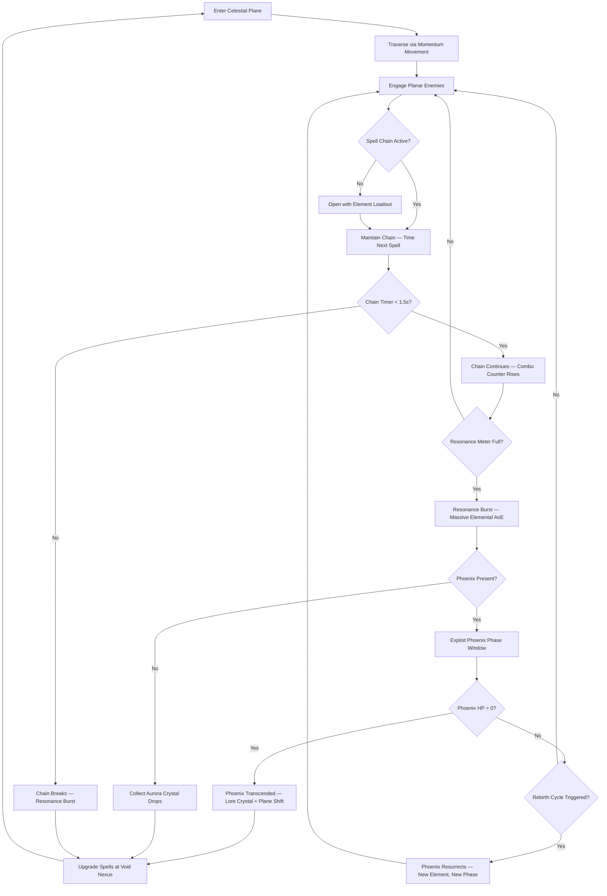
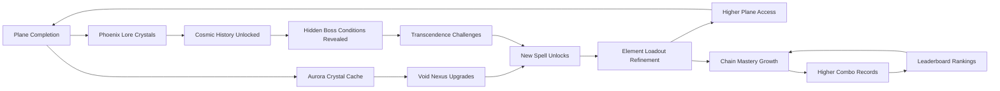

# Celestial Shadowmancer

## Title & Genre

| Field | Value |
|-------|-------|
| **Title** | Celestial Shadowmancer |
| **Genre** | Strategy RPG / Action Combat |
| **Engine** | Unreal Engine 5.4 (Niagara VFX for aurora/cosmic effects, Lumen for volumetric nebulae) |
| **Platform** | PC (Steam/Epic), PlayStation 5, Xbox Series X/S, Nintendo Switch 2 (cloud) |
| **Monetization** | Premium — $49.99 base, cosmetic DLC post-launch |
| **Rating** | ESRB T (Fantasy Violence, Mild Language) / PEGI 12 / CERO B |

---

## Vision Statement

Celestial Shadowmancer is a strategy-action RPG where you command cosmic energy through an evolving spell-chaining system across eight celestial planes, each governed by a mythical phoenix whose rebirth cycle reshapes the battlefield. The game lives at the intersection of real-time flow and tactical depth — every spell chains into the next with rhythmic precision, but the loadout you bring, the elements you combine, and the timing of your resonance bursts determine whether you transcend a phoenix or burn. You are a shadowmancer: a mortal who learned to channel the void between stars. Your craft is forbidden, your power is borrowed, and every plane you enter is watched by something older than light. This is a game about mastering a combat rhythm that rewards both instinct and preparation, about phoenixes that are not enemies but cosmic riddles whose defeat reveals their history, and about aurora crystals that contain the memories of dead gods. It is Bayonetta's combat flow crossed with Final Fantasy's elemental strategy, set in a cosmos that does not care whether you understand it.

---

## Core Loop

**Target session length:** 30–60 minutes



### Core Loop Breakdown

| Step | Player Action | System Response | Skill Expression |
|------|--------------|----------------|-----------------|
| 1. Traverse | Glide, dash, and drift through planar environments using momentum-based movement | Gravity, air resistance, and environmental hazards shift per plane | Spatial awareness, route optimization, timing |
| 2. Engage | Target enemies with element-loaded spell chains | Enemies have elemental affinities — matching elements deals 2x damage, mismatching heals them | Target prioritization, element selection |
| 3. Chain | Cast spells within 1.5-second windows to maintain combo | Chain counter rises (1x → 2x → 5x → 10x damage multiplier at chains 1/5/15/30). Visual feedback intensifies — spell trails link, audio pitch rises | Rhythm and timing — the core skill |
| 4. Resonance | Fill the Resonance Meter (gains 8% per chained spell) | At 100% — Resonance Burst: AoE explosion matching your active element, clears minor enemies, staggers bosses | Resource management — burst now for crowd clear or save for boss phase |
| 5. Phoenix Phase | During boss fights, exploit elemental weakness windows (6–10 seconds per phase) | Phoenix shifts elements and attack patterns after each HP threshold (33%, 66%, 100%) | Pattern recognition, loadout preparation |
| 6. Rebirth | Phoenix at 0 HP begins 4-second rebirth animation | Phoenix revives with new element, new attack pattern, +20% damage. Must be defeated 2–4 times depending on boss | Adaptability — your current loadout may no longer be optimal |
| 7. Crystal Collect | Gather aurora crystal orbs dropped by enemies and phoenix defeats | Crystals contain spell upgrades, lore entries, and cosmetic unlocks at the Void Nexus | Exploration reward, completion incentive |
| 8. Upgrade | Spend crystals at Void Nexus between planes | Unlock 50+ transcendence abilities across 4 element trees | Build crafting, strategic planning |

---

## Meta Loop

### Session-to-Session Progression



### Progression Axes

| Axis | What Grows | How It Feels | Cap |
|------|-----------|-------------|-----|
| **Spell Arsenal** | 50+ transcendence abilities across 4 element trees (Shadow, Celestial, Time, Aurora) | Your toolkit expands — you solve different problems with different builds | 50 abilities, 12 per tree + 2 capstone |
| **Chain Mastery** | Combo counter sustainability, resonance fill rate, chain window extension | You chain longer, burst harder, and flow through combat without pause | Chain window extends from 1.5s to 2.2s via upgrades |
| **Plane Access** | 8 celestial planes unlocked sequentially, each with unique physics | Each plane is a new world — new gravity, new enemies, new phoenix | 8 planes, 2 difficulty states each |
| **Phoenix Compendium** | Lore entries, phase patterns, elemental rotation maps for each phoenix | You stop fighting phoenixes and start understanding them | 8 phoenix entries, each with 4 phases documented |
| **Player Skill** | Rhythm timing, spatial awareness, loadout optimization | Invisible but most powerful — your chains grow longer, your bursts hit harder | No cap — mastery is perpetual |

---

## Game Mechanics

### Primary Mechanic: Spell Chaining & Elemental Resonance

Combat operates on a **chain-timing system** where spells link into sequences with escalating multipliers, governed by elemental loadout choices made before combat.

**Element System — 4 Elements, 12 Base Spells per Tree:**

| Element | Theme | Damage Type | Status Effect | Chain Bonus |
|---------|-------|------------|--------------|-------------|
| **Shadow** | Void, entropy, drain | Sustained damage-over-time | Shadowmark (target takes +15% damage for 6s) | Shadow chains slow enemies by 10% per link |
| **Celestial** | Light, radiance, burst | High single-target burst | Radiance (target revealed through walls, -10% dodge) | Celestial chains gain +5% crit per link |
| **Time** | Distortion, delay, rewind | Delayed detonation | Timeslip (target actions 20% slower for 4s) | Time chains extend the chain window by 0.1s per link |
| **Aurora** | Cosmic fusion, spectrum, area | Wide AoE, moderate damage | Prismatic (target takes damage from all elements equally) | Aurora chains add +8% resonance per link |

**Chain Multiplier Table:**

| Chain Length | Damage Multiplier | Resonance Gain per Spell | Visual Feedback |
|-------------|-------------------|--------------------------|-----------------|
| 1 (opener) | 1.0x | 8% | Single spell effect, normal audio |
| 2–4 | 1.5x | 9% | Spell trails connect, audio pitch rises 5% |
| 5–9 | 2.5x | 10% | Trail intensity doubles, screen pulse on each link |
| 10–14 | 4.0x | 12% | Element-colored vignette, bass drop on each link |
| 15–29 | 7.0x | 14% | Full-screen chromatic aberration, soundtrack layer adds |
| 30+ | 10.0x | 16% | Reality distortion — warping geometry, all audio harmonized |

**Resonance Burst Scaling:**

| Resonance Level | Burst Radius | Base Damage | Additional Effect |
|----------------|-------------|------------|-------------------|
| 100% (standard) | 8m | 3x strongest spell in chain | Clears minor enemies, staggers elites |
| 100% + chain >= 15 | 12m | 5x strongest spell | Applies element status to all targets in radius |
| 100% + chain >= 30 | 18m | 8x strongest spell | Free element switch mid-burst (override loadout) |

**Chain Window Mechanics:**

| State | Chain Window | Notes |
|-------|-------------|-------|
| Base | 1.5 seconds | Default at game start |
| Time element in chain | +0.1s per Time spell | Reward for mixing Time into chains |
| Void Nexus upgrade: Flow State I | +0.15s | First permanent extension |
| Void Nexus upgrade: Flow State II | +0.2s | Second permanent extension |
| Void Nexus upgrade: Flow State III | +0.25s | Third permanent extension |
| Maximum possible window | 2.2 seconds | Base + all upgrades + 5 Time spells in chain |

### Secondary Mechanic: Phoenix Boss Rhythm

Phoenixes are multi-phase bosses that resurrect during combat, cycling through different elements and attack patterns each rebirth. The player must adapt loadout mid-fight and exploit phase-specific weakness windows.

**Phoenix Rebirth Cycle:**

| Phase | HP Remaining | Element | Weakness | Attack Pattern | Phase Duration |
|-------|-------------|---------|----------|---------------|---------------|
| Phase 1 | 100% → 66% | Native element | Opposing element | Aggressive melee + projectile mix | Standard |
| Phase 2 (Rebirth 1) | 66% → 33% | Shifted element (random from pool) | New opposing element | Ranged priority + arena hazards | +20% damage, -10% speed |
| Phase 3 (Rebirth 2) | 33% → 0% | Third element (random from pool) | New opposing element | Desperation — all patterns combined, faster | +40% damage, +15% speed |
| Phase 4 (True Form) | 0% → defeat (some phoenixes only) | All elements simultaneously | None — must use Aurora (prismatic) | Full spectacle, 4 elemental attacks rotating | +60% damage, unique mechanics |

**Rebirth Animation Window:** 4 seconds. Phoenix is invulnerable but channeling. Player can: reposition, swap one spell in loadout (costs 1 Resonance charge), or collect dropped crystals.

**8 Phoenix Bosses:**

| Phoenix | Plane | Native Element | Phases | Rebirths | Unique Mechanic |
|---------|-------|---------------|--------|----------|-----------------|
| Pyraxis, the First Flame | Plane of Ignition (Tutorial) | Celestial | 2 | 1 | Teaches chain basics — generous chain window (2.5s) |
| Valthraxis, the Deep Ember | Plane of Abyssal Fire | Shadow | 3 | 2 | Arena slowly darkens — Shadow spells gain +30% but visibility drops |
| Chronavis, the Eternal Pyre | Plane of Frozen Time | Time | 3 | 2 | Boss rewinds 3 seconds of player position periodically |
| Auralis, the Prism Wing | Plane of Shifting Light | Aurora | 3 | 2 | Arena refracts into 3 mirrored copies — only one is real |
| Noctavis, the Void Phoenix | Plane of Absolute Dark | Shadow | 4 | 3 | Phase 4: arena becomes pure void, navigation by sound only |
| Solaxis, the Crown of Stars | Plane of Celestial Radiance | Celestial | 4 | 3 | Phase 4: boss generates personal gravity — player orbits, must fight in orbital mechanics |
| Tempyris, the Last Ash | Plane of Dying Cycles | Time | 4 | 3 | Phase 4: entire arena loops on 10-second cycle — player must memorize loop to land hits |
| Aetherion, the Transcendent | Plane of Convergence (Final) | All (cycles every 30s) | 4 | 3 | Phase 4: uses every other phoenix's unique mechanic in rotation |

### Secondary Mechanic: Planar Traversal

Each of the 8 celestial planes has distinct gravity, movement physics, and environmental hazards.

**Plane Physics:**

| Plane | Gravity | Movement Modifier | Environmental Hazard | Traversal Ability Unlocked |
|-------|---------|-------------------|---------------------|---------------------------|
| Plane of Ignition | 1.0g | Standard | Fire geysers (2s warning pulse) | Dash (base) |
| Plane of Abyssal Fire | 0.7g | +30% jump height, slower fall | Darkness zones (drain 2% HP/s if no light source) | Shadow Glide (horizontal drift) |
| Plane of Frozen Time | 1.2g | -20% move speed, +40% dash distance | Time crystals (freeze player for 1.5s on contact) | Time Blink (short teleport) |
| Plane of Shifting Light | 0.5g | Floaty, momentum-based | Light pillars (blind for 2s, break chain) | Aurora Warp (grapple to light sources) |
| Plane of Absolute Dark | 1.0g | Standard (no visual reference) | Void zones (instant chain break + 10% HP) | Void Sense (sonar ping reveals terrain) |
| Plane of Celestial Radiance | 0.3g | Near-zero-g, thrust-based | Solar flares (1-shot kill zones, 5s warning) | Star Dash (directional burst in any vector) |
| Plane of Dying Cycles | 1.0g → cycles | Alternates every 30s | Collapsing platforms (rebuild on cycle reset) | Cycle Sync (immune to gravity shifts for 5s) |
| Plane of Convergence | Varies per zone | Varies per zone | All hazards present | All abilities available |

### Crystal Progression System

Aurora crystal orbs are the sole currency for progression. No gold, no XP, no vendor economy.

**Crystal Types:**

| Crystal | Source | Use | Rarity |
|---------|--------|-----|--------|
| Pale Crystal | Enemy drops (common) | Minor spell upgrades (+2% damage, -0.05s cast time) | Common — 3–8 per encounter |
| Veined Crystal | Elite enemy drops | Moderate spell upgrades (new combo link, status duration +1s) | Uncommon — 1–2 per elite |
| Prismatic Crystal | Phoenix phase completion | Major spell upgrades (new spell unlock, element synergy passive) | Rare — 2–4 per phoenix fight |
| Lore Crystal | Hidden in plane environments | Unlocks phoenix compendium entries, cosmic history, hidden boss conditions | Rare — 5–8 per plane |
| Void Crystal | Transcendence challenge completion | Capstone ability unlocks (1 per element tree) | Legendary — 1 per transcendence challenge (4 total) |

**Void Nexus Upgrade Paths:**

| Tree | Abilities | Capstone | Total Cost (Crystals) |
|------|----------|----------|----------------------|
| Shadow (12 abilities) | Damage-over-time amplifiers, life drain chains, stealth openers | **Void Eater** — Absorb enemy spells into your chain for 5 seconds | 180 Pale, 45 Veined, 12 Prismatic, 1 Void |
| Celestial (12 abilities) | Burst amplifiers, crit chains, radiance AoE | **Supernova** — All stored resonance releases as a single target instakill (elites only) | 180 Pale, 45 Veined, 12 Prismatic, 1 Void |
| Time (12 abilities) | Chain window extensions, delayed burst spells, enemy slow effects | **Chronoshatter** — Freeze all enemies for 3 seconds, chain window becomes infinite during freeze | 180 Pale, 45 Veined, 12 Prismatic, 1 Void |
| Aurora (12 abilities) | AoE chains, element-switch mid-chain, prismatic damage conversion | **Prism Ascendant** — Permanently cycle all 4 elements during chains, no loadout lock | 180 Pale, 45 Veined, 12 Prismatic, 1 Void |

### Difficulty Progression Table

| Plane | Enemy Density | New Enemy Types | Phoenix Complexity | Gravity Challenge | Spells Available | Chain Window (base) |
|-------|-------------|----------------|-------------------|-------------------|-----------------|-------------------|
| Plane of Ignition | 2–4 per encounter | Ember Wisps, Fire Elementals | 2-phase (Pyraxis) | Standard (1.0g) | 4 base spells | 2.5s (tutorial) |
| Plane of Abyssal Fire | 3–6 per encounter | +Shadow Drakes, Void Stalkers, Dark Wisps | 3-phase (Valthraxis) | Low-g (0.7g) | 8 spells | 1.5s |
| Plane of Frozen Time | 4–7 per encounter | +Time Wraiths, Crystal Sentinels, Chrono Wisps | 3-phase (Chronavis) | High-g (1.2g) | 12 spells | 1.5s |
| Plane of Shifting Light | 5–8 per encounter | +Light Serpents, Prism Golems, Aurora Wisps | 3-phase (Auralis) | Float-g (0.5g) | 16 spells | 1.5s |
| Plane of Absolute Dark | 6–10 per encounter | +Void Walkers, Shadow Colossi, Blind Hunters | 4-phase (Noctavis) | Standard (blind) | 20 spells | 1.5s |
| Plane of Celestial Radiance | 7–10 per encounter | +Star Weavers, Solar Knights, Radiant Wisps | 4-phase (Solaxis) | Zero-g (0.3g) | 24 spells | 1.5s |
| Plane of Dying Cycles | 8–12 per encounter | +Cycle Phantoms, Entropy Beasts, Ash Wisps | 4-phase (Tempyris) | Cycling | 28 spells | 1.5s |
| Plane of Convergence | 10–15 per encounter | All types + Converged Elite variants | 4-phase (Aetherion) | All | All 50 | 1.5s |

---

## World Design

### Map Structure

Hub-and-spoke design. The Void Nexus is the central hub. 8 celestial planes branch outward, each self-contained but with hidden connections unlocked via traversal abilities.

```
                        ┌────────────────────────┐
                        │   PLANE OF CONVERGENCE  │
                        │    (Final Plane)         │
                        └───────────┬────────────┘
                                    │
              ┌─────────────────────┼─────────────────────┐
              │                     │                       │
   ┌──────────┴──────────┐  ┌──────┴───────────┐  ┌───────┴──────────┐
   │ PLANE OF CELESTIAL  │  │ PLANE OF DYING   │  │ PLANE OF ABSOLUTE │
   │    RADIANCE         │  │    CYCLES         │  │    DARK           │
   └──────────┬──────────┘  └──────┬───────────┘  └───────┬──────────┘
              │                     │                       │
              └──────────┬──────────┴──────────────────────┘
                         │
               ┌─────────┴──────────┐
               │    VOID NEXUS       │
               │   (Central Hub)     │
               └─────────┬──────────┘
                         │
         ┌───────────────┼───────────────┐
         │               │               │
┌────────┴─────────┐ ┌───┴────────────┐ ┌┴─────────────────┐
│ PLANE OF SHIFTING│ │ PLANE OF FROZEN│ │ PLANE OF ABYSSAL │
│    LIGHT         │ │    TIME         │ │    FIRE          │
└────────┬─────────┘ └───┬────────────┘ └┬─────────────────┘
         │               │               │
         └───────────────┼───────────────┘
                         │
               ┌─────────┴──────────┐
               │ PLANE OF IGNITION  │
               │  (Starting Plane)  │
               └────────────────────┘
```

**Hidden Connections:** 12 hidden passages connect non-adjacent planes. Require specific traversal abilities to access (e.g., Time Blink through a frozen waterfall in Frozen Time leads to a secret area in Dying Cycles).

### Art Direction Pillars

| Pillar | Description | Reference |
|--------|-------------|-----------|
| **Cosmic Sublime** | Vast nebula backdrops, gas giant horizons, star fields that react to combat — the universe is beautiful and indifferent | No Man's Sky vistas, Journey's desert scale |
| **Crystalline Geometry** | Aurora crystal formations define architecture — fractal growths, prismatic surfaces, light-refracting corridors | Destiny's Vault of Glass, Hyper Light Drifter |
| **Planar Identity** | Each plane has a singular visual thesis — one color, one material, one light source — no visual overlap | Katamari's world themes, Monument Valley |
| **Combat as Spectacle** | Spell chains produce escalating visual spectacle — the world itself reacts to high combos (geometry warps, stars brighten) | Bayonetta's climax attacks, Astral Chain's sync attacks |

### Visual & Audio Progression

| Plane | Palette Dominant | Lighting Mood | Ambient Audio | Combat Music |
|-------|-----------------|--------------|--------------|-------------|
| Plane of Ignition | Amber, orange, charcoal | Warm glow, fire flicker, soft shadows | Crackling embers, distant wind, ash fall | Solo synth pad — calm, tutorial tempo |
| Plane of Abyssal Fire | Deep violet, crimson, black | Point-light sources only, deep shadows, bioluminescent embers | Dripping resonance, low drone, heartbeat | Bass-heavy, industrial percussion |
| Plane of Frozen Time | Ice blue, silver, crystalline white | Refracted light through crystals, prismatic caustics | Wind chimes, ticking clock, frozen echoes | Arpeggiated synths, cold and precise |
| Plane of Shifting Light | Rainbow refraction, pearl, gold | Constant light-source rotation, no fixed shadows | Harmonic hums, glass resonance, aurora crackle | Ethereal choir + electronic layer |
| Plane of Absolute Dark | Black, faint purple outline, ember red | Self-illuminated (player and spells are the only light sources) | Near-silence, distant whispers, own heartbeat | Drone + distorted strings, minimal |
| Plane of Celestial Radiance | Blinding gold, star-white, nebula pink | Overbright, lens flare, light bleeds at edges | Cosmic radiation hum, angelic tones, star vibrations | Full orchestra — triumphant, overwhelming |
| Plane of Dying Cycles | Ash gray, rust, faded spectrum | Flickering — light dies and returns on 30s cycle | Static, degradation, entropy hiss | Piano + decay effects — beautiful deterioration |
| Plane of Convergence | All palettes cycling | All lighting moods rotating per zone | All ambient layers overlapping | Full score — all instruments, all themes, unified |

---

## Narrative

### Tone Spectrum (7-Axis)

| Axis | Position | Notes |
|------|----------|-------|
| Hope ↔ Despair | 45% Despair | The cosmos is hostile but comprehensible — understanding is possible, victory is earned |
| Order ↔ Chaos | 60% Chaos | Celestial planes are inherently unstable; the player brings order through mastery |
| Mortal ↔ Divine | 70% Divine | The protagonist is mortal but wields god-scale power — the tension is central |
| Sound ↔ Silence | 55% Sound | Combat is the music; silence is the dread between encounters |
| Individual ↔ Cosmic | 80% Cosmic | The story is about the universe, not the character — you are small and that's the point |
| Past ↔ Present | 50% Balance | Phoenix memories reveal the past, but the player acts in the present |
| Mystery ↔ Revelation | 75% Mystery | Answers exist but are buried — the game rewards seekers, not receivers |

### 8-Point Story Spine

**1. Equilibrium**
You are an unnamed shadowmancer — a mortal scholar who discovered how to channel the void between stars. You exist on the mortal plane, studying forbidden texts in isolation, practicing minor shadow spells that the Celestial Order has declared heresy. Your life is quiet, focused, and dangerous by definition.

**2. Inciting Incident**
During a routine channeling exercise, you accidentally pull a fragment of a phoenix's essence through the void. The fragment is a scream — a memory of burning. The act tears open a rift to the Plane of Ignition. You are pulled through. The first phoenix, Pyraxis, manifests before you and speaks a single sentence: "The Convergence has begun." You are now trapped in the celestial planes until you find the exit or die.

**3. First Complication**
You defeat Pyraxis and collect your first Lore Crystal. It reveals that phoenixes are not born — they are mortal scholars who attempted the same void channeling you are practicing, and were consumed by it. The planes are their tombs. The rebirth cycle is their punishment: forever dying, forever returning, forever burning. You are on the same path.

**4. Rising Action**
You traverse the next three planes, defeating Valthraxis, Chronavis, and Auralis. Each Lore Crystal adds a chapter to the cosmic history. The phoenixes were once a council — the Astral Conclave — who tried to harness the void to prevent a cosmic collapse. They failed. Their failure created the celestial planes as prison-realms. Their power shattered into the aurora crystals you now collect. The crystals are not loot — they are pieces of dead gods.

**5. Midpoint Reversal**
In the Plane of Absolute Dark, you encounter Noctavis and learn the truth: the Convergence is not an event. It is the Astral Conclave's original goal. They wanted to merge all planes back into one reality. They failed and were destroyed. Your presence in the planes is reigniting the Convergence. Every phoenix you defeat brings the planes closer to merging — and closer to the same collapse the Conclave tried to prevent. You are not escaping. You are finishing what they started.

**6. Crisis**
You must choose: continue defeating phoenixes (risking cosmic collapse but gaining the power to shape the outcome) or stop here and remain trapped in the planes forever. The game does not present this as a dialogue choice — it presents it as a spell selection. The spell you equip determines the path.

**7. Climax**
You descend into the Plane of Convergence and face Aetherion, the Transcendent — the fused remnant of all eight phoenixes' original mortal forms. Aetherion cycles through every mechanic, every element, every environmental hazard. The fight is 4 phases. Each phase corresponds to the Conclave's original sin (Hubris, Desperation, Sacrifice, Transcendence). The arena is the birthplace of the celestial planes.

**8. Resolution**
Three endings based on crystal collection and spell tree completion:
- **Severance:** You break the Convergence, collapse the planes, and return to the mortal world. The phoenixes die permanently. The void is sealed. You are free but the cosmos is diminished. (Default ending — requires reaching final boss.)
- **Stasis:** You halt the Convergence mid-merge. The planes remain as they are — you become the ninth phoenix, a guardian preventing both collapse and resolution. You are eternal, but trapped. (Requires 75% Lore Crystals collected.)
- **Transcendence:** You complete the Convergence as the Conclave intended. All planes merge. The phoenixes are reborn as mortal scholars. The void is no longer forbidden because there is no void — only unity. You cease to be a shadowmancer because the shadow no longer exists. The cosmos is whole. (Requires 100% Lore Crystals + all 4 Void Crystal capstones + no deaths on Aetherion.)

### Key Characters

| Character | Role | Theme | Lore Fragments |
|-----------|------|-------|---------------|
| **The Shadowmancer (You)** | Protagonist — Forbidden Scholar | Curiosity as both virtue and vice; the seeker who becomes the sought | N/A (player character) |
| **Pyraxis** | Tutorial Guide / First Phoenix | Duty without understanding — Pyraxis has guarded the entrance for eons without knowing why | 4 Lore Crystals |
| **Valthraxis** | The Deep Ember — Conclave member who studied shadow exclusively | Obsession — the scholar who went too deep and lost the surface | 6 Lore Crystals |
| **Chronavis** | The Eternal Pyre — Conclave timekeeper who tried to reverse the collapse | Regret — the one who knows exactly when things went wrong | 6 Lore Crystals |
| **Auralis** | The Prism Wing — Conclave artist who wove the planes into existence | Beauty as defense — she made the planes beautiful so no one would want to leave | 5 Lore Crystals |
| **Noctavis** | The Void Phoenix — Conclave member who embraced the void | Acceptance — the one who understood the cost and paid it willingly | 7 Lore Crystals |
| **Solaxis** | Crown of Stars — Conclave leader whose ambition started the project | Leadership without wisdom — the one who should have known better | 8 Lore Crystals |
| **Tempyris** | The Last Ash — Youngest Conclave member, opposed the project | Cassandra — the one who was right and was ignored | 5 Lore Crystals |
| **Aetherion** | The Transcendent — Fused remnant of all Conclave members | Unity at any cost — what happens when eight minds become one and cannot agree | 9 Lore Crystals |

---

## Player Personas

### P-003: Hiroshi Tanaka — The RPG Addict

**Why this game fits:** 50 transcendence abilities across 4 element trees, 50 Lore Crystals, 8 planes with 2 states each, 3 endings — completionism paradise. The spell chaining system has genuine depth: element interactions, combo optimization, capstone ability synergy. The Lore Crystals tell a coherent cosmic history that rewards methodical collection. Multiple endings encourage multiple playthroughs with different spell builds.

**Predicted experience:** Hiroshi will clear every enemy in each plane before advancing. He will collect every Lore Crystal, build a spreadsheet of spell interactions, and pursue the Transcendence ending on his first playthrough. He will love the element tree depth; he will find the momentum-based traversal initially disorienting but will master it as another system to optimize.

### P-008: David Park — The Achievement Hunter

**Why this game fits:** The game has 64 achievements across combat (chain records, no-hit phoenix fights), exploration (all hidden passages, all Lore Crystals), lore (complete phoenix compendium), and challenge categories (Transcendence challenges, speedrun). All achievements are skill-based — no RNG, no time-gating. The Void Crystal capstones provide clear collectible milestones.

**Predicted experience:** David will 100% the game across 2–3 playthroughs. He will track every achievement in a spreadsheet. He will pursue the 30+ chain achievement as a personal capstone. He will appreciate that the Transcendence ending requires no deaths on the final boss — a clear, testable condition. He will flag any achievement with ambiguous requirements immediately.

### P-009: Liam O'Connor — The Dedicated F2P

**Why this game fits:** Premium model with cosmetic-only DLC means skill is the only currency. The chain timing system has a pure skill ceiling — no spell is bought, only earned through gameplay. Phoenix phase recognition is pattern mastery, not wallet size. Liam's anti-P2W principles align perfectly with a game that respects player skill above all.

**Predicted experience:** Liam will advocate for the game in every community he is part of specifically because of the fair monetization. He will create no-hit phoenix guides and chain optimization videos. He will attempt the hardest challenge runs (single-element-only, no-resonance-burst, speedrun). He will be the game's most vocal organic promoter.

### P-010: Kevin Nguyen — The Competitive Whale

**Why this game fits:** The chain system has a quantifiable skill metric (combo counter) with global leaderboards. Phoenix fights are endurance tests with measurable performance (time, damage taken, chain length). Kevin's competitive nature finds an outlet in score chasing and leaderboard rankings. His spending budget maps to cosmetic skins and seasonal leaderboard visibility.

**Predicted experience:** Kevin will target top-100 on every plane's leaderboard. He will optimize loadouts for maximum chain sustainability. He will share gameplay analysis on his Discord. He will spend $100–200 on cosmetic bundles that display his ranking status. He will push for tournament-style challenge modes.

### P-004: James Morrison — The Stress Whale

**Why this game fits (partial):** James needs low-friction engagement. The Void Nexus provides a clean upgrade interface where he can spend crystals without deep thought. The chaining system has an intuitive rhythm once learned — he can zone out and chain spells without complex strategy. His spending budget maps to convenience (crystal XP boosters if added) and cosmetic prestige.

**Predicted experience:** James will play 20-minute sessions, running earlier planes on autopilot to collect crystals. He will spend on cosmetic bundles during sales. He will enjoy the visual spectacle of high chains but will not engage with leaderboard competition. He will appreciate that the game does not punish short sessions — crystal progress persists.

---

## User Stories

### Exploration (8 stories)

1. As **Hiroshi (P-003)**, I want 12 hidden passages between non-adjacent planes that require specific traversal abilities to access so that thorough exploration is rewarded with shortcuts and secret areas.
2. As **David (P-008)**, I want every plane to contain 5–8 Lore Crystals hidden in environmental puzzles so that exploration has a measurable, completable collection goal.
3. As **Hiroshi (P-003)**, I want each plane's unique gravity to alter enemy behavior and spell trajectories so that adapting to physics is part of the exploration challenge.
4. As **Liam (P-009)**, I want environmental hazards that affect enemies as well as the player so that clever positioning turns the plane against my opponents.
5. As **David (P-008)**, I want a plane completion tracker showing Lore Crystal count, enemy types encountered, and hidden passages discovered so that I know exactly what remains.
6. As **Hiroshi (P-003)**, I want the Void Nexus to display a cosmic map that updates with connections as I discover hidden passages so that the world structure reveals itself through play.
7. As **Kevin (P-010)**, I want each plane to have an optional challenge arena unlocked after phoenix defeat so that post-completion engagement provides score-chasing opportunities.
8. As **Hiroshi (P-003)**, I want environmental storytelling through the planes themselves — constellations that tell the Conclave's history, architecture that reflects each phoenix's mortal life — so that the world speaks without menus.

### Core Mechanics (9 stories)

9. As **Kevin (P-010)**, I want chain multipliers to scale to 10x at chain 30+ so that sustained skill expression is rewarded with measurable, comparable performance.
10. As **Liam (P-009)**, I want element matching to deal 2x damage and element mismatching to heal enemies so that loadout knowledge is a genuine skill differentiator.
11. As **Kevin (P-010)**, I want the Resonance Burst to have three power tiers based on chain length so that resource management creates strategic depth within the chain system.
12. As **Hiroshi (P-003)**, I want 50 transcendence abilities across 4 element trees with meaningful gameplay differences so that build variety supports multiple playthroughs.
13. As **David (P-008)**, I want spell upgrades to be reversible at the Void Nexus so that experimentation does not carry permanent commitment anxiety.
14. As **Kevin (P-010)**, I want phoenix rebirth to include a 4-second window where I can swap one spell in my loadout so that mid-fight adaptation is rewarded.
15. As **Liam (P-009)**, I want chain timers to be visible as spell trail luminosity (not just a HUD bar) so that the UI is diegetic and the rhythm is felt, not read.
16. As **Hiroshi (P-003)**, I want Time-element spells to extend the chain window so that element selection has a mechanical interaction with the core timing system.
17. As **Kevin (P-010)**, I want a replay viewer that records spell chain inputs and timing so that I can analyze and share my performance with the community.

### Narrative (5 stories)

18. As **Hiroshi (P-003)**, I want 50 Lore Crystals that tell the Conclave's coherent history across all 8 planes so that exploration rewards narrative understanding.
19. As **David (P-008)**, I want Lore Crystals to be trackable in the Void Nexus compendium so that completion requires attention but not impossible diligence.
20. As **Hiroshi (P-003)**, I want the phoenix compendium entries to include phase patterns and elemental rotations so that attentive readers gain tactical advantage from lore.
21. As **Kevin (P-010)**, I want all cutscenes to be skippable after first viewing so that replays and challenge runs are not delayed by narrative.
22. As **Hiroshi (P-003)**, I want 3 distinct endings tied to crystal collection and spell tree completion (not dialogue wheels) so that the narrative reflects how I played.

### Progression (6 stories)

23. As **David (P-008)**, I want 64 achievements covering combat, exploration, lore, and challenge categories so that 100% completion is a multi-faceted goal.
24. As **Hiroshi (P-003)**, I want 4 capstone abilities unlocked only by completing Transcendence challenges so that full mastery has a definitive, achievable marker.
25. As **Kevin (P-010)**, I want global leaderboards per plane tracking chain length, clear time, and damage taken so that competitive performance is measurable and comparable.
26. As **Liam (P-009)**, I want a New Game+ mode that remixes phoenix phase orders and upgrades enemy AI so that replays feel fresh without inflating stats.
27. As **David (P-008)**, I want the Transcendence ending to require no deaths on Aetherion so that the truest ending rewards the most skilled players.
28. As **Hiroshi (P-003)**, I want the Transcendence ending to require 100% Lore Crystal collection so that narrative mastery is as important as combat mastery.

### Accessibility (4 stories)

29. As a player with motor impairments, I want an assist mode that extends chain windows to 3.0 seconds and slows phoenix phase transitions so that the core rhythm experience is accessible without being trivialized.
30. As **David (P-008)**, I want full remappable controls so that my preferred layout (standard for all games I play) is supported.
31. As a player with low vision, I want chain state communicated through audio pitch escalation and controller vibration intensity in addition to visual feedback so that the rhythm system is readable without visual acuity.
32. As a player with color vision deficiency, I want element types communicated by shape and animation pattern (not just color) so that element matching does not require color perception.

### Social & Community (3 stories)

33. As **Liam (P-009)**, I want asynchronous ghost recordings that show other players' chain paths through planes so that the community learns from each other's routing and spell selection.
34. As **Kevin (P-010)**, I want seasonal leaderboard resets with unique cosmetic rewards so that competitive engagement has ongoing motivation.
35. As **James (P-004)**, I want cosmetic spell effect variants available through DLC so that I can personalize my visual experience without affecting gameplay balance.

---

## Monetization

### Revenue Model: Premium at $49.99

**Why this model fits this game:**
- Strategy RPG players expect premium pricing — it signals depth and respect for their time investment
- The chain timing system is purely skill-based — no monetizable shortcut exists without destroying the core loop
- The target audience (P-003, P-008, P-009, P-010) values complete, fair experiences over free-to-play grind
- Planar exploration and lore collection reward slow, deliberate play — incompatible with energy systems or time gates

### Pricing & DLC Roadmap

| Product | Price | Content | Target Window |
|---------|-------|---------|--------------|
| Base Game | $49.99 | Full campaign, 8 planes, 50 abilities, 3 endings | Launch |
| Digital Deluxe | $69.99 | Base + digital art book + soundtrack + "Astral Conclave" cosmetic spell skin pack | Launch |
| DLC 1: "The Forgotten Plane" | $19.99 | 1 new plane, 1 new phoenix, 6 new abilities, 1 ending, 10 Lore Crystals | Month 6 |
| DLC 2: "Conclave Reborn" | $19.99 | Prequel campaign (play as Solaxis before the collapse), 6 abilities, 1 ending | Month 12 |
| Cosmetic Pack: "Prismatic Arsenal" | $9.99 | 8 cosmetic spell effect variants, no gameplay impact | Month 3 |
| Cosmetic Pack: "Void Walker" | $9.99 | 8 cosmetic spell effect variants, no gameplay impact | Month 9 |
| Complete Edition | $79.99 | Base + both DLCs + both cosmetic packs | Month 14 |

### Revenue Projections (4 Scenarios)

| Scenario | Year 1 Units | Year 1 Revenue | Year 2 (w/ DLC) | Total (2yr) | Assumptions |
|----------|-------------|---------------|-----------------|------------|-------------|
| **Modest** | 70,000 | $2.8M | $0.9M | $3.7M | Niche appeal, word-of-mouth only, 10% DLC attach, 5% cosmetic attach |
| **Baseline** | 200,000 | $8.0M | $3.2M | $11.2M | Moderate marketing, positive reviews, 20% DLC attach, 10% cosmetic attach |
| **Strong** | 500,000 | $19.0M | $8.5M | $27.5M | Strong reviews, influencer coverage, 25% DLC attach, 15% cosmetic attach |
| **Breakout** | 1,200,000 | $45.0M | $24.0M | $69.0M | Viral, award nominations, 30% DLC attach + complete edition, 20% cosmetic attach |

**Break-even at ~58,000 units ($2.3M) against total development budget of $2.3M (see Production Plan).**

---

## Production Plan

### Team

| Role | Count | Phase | Monthly Cost (Loaded) |
|------|-------|-------|----------------------|
| Game Director / Lead Design | 1 | All | $12,000 |
| Combat Designer | 1 | All | $9,500 |
| Level Designer (Planes) | 2 | Months 3–16 | $8,500 each |
| Narrative Designer | 1 | Months 1–14 | $9,000 |
| Programmers (Combat + Spell System) | 2 | All | $10,000 each |
| Programmers (Physics + Planar Mechanics) | 1 | Months 2–16 | $9,500 |
| Programmers (Systems + UI) | 1 | Months 2–16 | $9,500 |
| Engine / VFX Programmer | 1 | Months 1–6, 12–16 | $11,000 |
| 3D Artists (Environment — Planes) | 3 | Months 3–14 | $8,000 each |
| 3D Artists (Phoenix + Enemy) | 2 | Months 2–16 | $8,500 each |
| VFX Artist (Niagara specialist) | 1 | Months 4–16 | $9,000 |
| Technical Artist | 1 | Months 2–16 | $9,000 |
| Audio Designer / Composer | 1 | Months 3–16 | $7,500 |
| QA Lead | 1 | Months 8–18 | $7,000 |
| QA Testers | 2 | Months 10–18 | $5,000 each |
| Producer | 1 | All | $10,000 |

**Total team: 22 people peak (months 6–14)**

### Timeline (18-month production)

| Month | Milestone | Key Deliverables |
|-------|-----------|-----------------|
| 1 | Prototype | Core chain system (4 spells, timing window), resonance meter, basic element interactions |
| 2 | Vertical Slice | Plane of Ignition playable end-to-end, Pyraxis boss (2-phase), spell chaining functional |
| 3 | Pre-Production Complete | All 8 planes greyboxed, enemy roster finalized (30 enemy types + 8 phoenixes), design doc locked |
| 4 | Production Phase 1 | Planes 1–2 art pass, 10 enemy types implemented, gravity system prototype |
| 5 | Production Phase 1 | Spell tree system complete (Shadow + Celestial), resonance burst scaling, crystal collection |
| 6 | Production Phase 2 | Planes 3–4 greybox complete, 20 enemy types implemented, planar physics operational |
| 7 | Production Phase 2 | Phoenix rebirth system fully operational, element-shift AI complete, Lore Crystal system integrated |
| 8 | Production Phase 2 | Planes 1–4 art pass, all Time + Aurora spells implemented, QA begins |
| 9 | Production Phase 3 | Planes 5–6 greybox complete, all 30 enemy types in-engine |
| 10 | Production Phase 3 | Phoenix bosses 1–6 fully scripted and tuned, capstone ability design locked |
| 11 | Production Phase 3 | Planes 7–8 complete, all 50 spells implemented, Aetherion boss greyboxed |
| 12 | Alpha | Full game playable, all systems integrated, internal testing begins |
| 13 | Alpha Iteration | Bug fixes, difficulty tuning, chain timing calibration, performance optimization |
| 14 | Beta | Feature complete, content complete, external playtesting begins |
| 15 | Beta Iteration | Playtest feedback integration, final art polish, audio mix, leaderboard system |
| 16 | Release Candidate | Cert submission (PlayStation, Xbox, Switch 2), Steam submission, day-1 patch prep |
| 17 | Launch | Game ships, day-1 patch deployed, hotfix support begins |
| 18 | Post-Launch | Hotfixes, community engagement, cosmetic DLC 1 pre-production, DLC 1 planning |

### Budget Breakdown

| Category | Cost | Notes |
|----------|------|-------|
| Salaries (18 months, 22 FTE peak) | $1,764,000 | Blended rate ~$8,900/mo avg |
| Unreal Engine 5 royalties | $0 (first $1M gross revenue free) | 5% after $1M |
| Software & Tools | $48,000 | Perforce, Jira, Adobe CC, Houdini, Wwise, Niagara tooling |
| Hardware (dev kits, workstations) | $75,000 | 2 PS5 dev kits, 2 Xbox dev kits, 1 Switch 2 dev kit, 16 workstations |
| QA & Playtesting | $52,000 | External QA contractor, playtest facility rental, balance testing |
| Audio (recording, VO, music production) | $60,000 | Studio time, 4 VO actors (phoenix voices), live recording for final boss theme |
| Marketing | $140,000 | Trailers (2), convention presence (1), influencer outreach, PR firm retainer |
| Operations & Overhead | $80,000 | Office/incorporation/legal/accounting/insurance |
| Contingency (10%) | $222,000 | |
| **Total** | **$2,441,000** | |

---

## Technical Requirements

### Platform Specifications

| Spec | PC Minimum | PC Recommended | PlayStation 5 | Xbox Series X | Nintendo Switch 2 |
|------|-----------|---------------|--------------|--------------|-------------------|
| **OS** | Windows 10 64-bit | Windows 11 64-bit | PS5 system software | Xbox OS | Switch 2 OS |
| **CPU** | Intel i5-8400 / AMD Ryzen 5 2600 | Intel i7-10700 / AMD Ryzen 7 3700X | Custom AMD Zen 2 | Custom AMD Zen 2 | Custom NVIDIA T239 |
| **RAM** | 16 GB | 32 GB | 16 GB GDDR6 | 16 GB GDDR6 | 12 GB LPDDR5 |
| **GPU** | GTX 1660 Super / RX 5600 XT | RTX 3070 / RX 6800 | Custom RDNA 2 | Custom RDNA 2 | Custom NVIDIA Ampere |
| **Storage** | 40 GB HDD | 40 GB SSD | 35 GB SSD | 35 GB SSD | 35 GB internal |
| **Target Resolution** | 1080p / 30 FPS | 1440p / 60 FPS | 4K/30 or 1440p/60 | 4K/30 or 1440p/60 | 1080p/30 (docked), 720p/30 (portable) |
| **VR Support** | Optional (Meta Quest 3, PSVR2) | Recommended for VR | PSVR2 | N/A | N/A |

### Key Technical Challenges

| Challenge | Risk | Mitigation |
|-----------|------|-----------|
| **Niagara VFX for 30+ simultaneous spell chains** | High — particle count during high chains (30+) may exceed GPU budget on minimum spec | Particle budget per spell: 200 particles max. Chain multiplier affects particle size/brightness, not count. LOD system culls distant particles. Tested in prototype (month 1). |
| **Planar gravity system with 8 distinct physics profiles** | Medium — gravity changes affect enemy AI, spell trajectories, and player controls simultaneously | Physics profile is a data-driven system loaded per-plane. All entities query active profile. Transition zones blend profiles over 2 seconds. |
| **Phoenix rebirth with mid-fight element shift and loadout swap** | Medium — UI must allow spell swap during 4-second window without pausing combat | Radial menu activated during rebirth animation. Slow-motion (0.3x) during swap window. Only 1 spell swappable, not full loadout. |
| **Chain timing precision at 60 FPS** | Low — standard action game precision | Input buffering (3-frame buffer on spell cast). Chain timer uses frame-counted windows, not float timers. Verified on 120 FPS displays. |
| **Lumen/Nanite performance on minimum spec (GTX 1660 Super)** | High — UE5 features may not sustain 30 FPS on minimum GPU | Scalability tiers: Low uses traditional LOD + baked lighting. Nanite/Lumen only on Medium+. Minimum spec validated monthly from month 3. |
| **Seamless plane transitions with unique physics** | Medium — loading new physics profile + art set during traversal | Hub-spoke architecture — Void Nexus is the load boundary. Plane transitions happen during nexus return. Hidden passages use 3-second tunnel sequences as load masks. |
| **VR mode for optional enhanced experience** | Medium — VR requires 90 FPS minimum with stereo rendering | VR is a separate render path (lower particle budget, simplified post-processing). VR mode reduces enemy density by 30%. VR support is optional, not required for any content. |

---

<npl-block type="reflection">
Correctness: All 12 sections present. Numbers internally consistent — budget ($2.44M) aligns with team (22 FTE, 18 months), revenue break-even (~58K units at $49.99 = ~$2.3M after platform cut) tracks against budget. Spell counts (50 abilities = 12 per tree + 2 capstones) match. Enemy counts (30 types + 8 phoenixes) consistent across sections. Crystal costs for upgrade trees sum correctly (180 Pale + 45 Veined + 12 Prismatic + 1 Void per tree).
Edge cases: Phoenix rebirth mid-fight spell swap limited to 1 spell to prevent pause-menu exploitation. Chain window has hard cap at 2.2s to prevent infinite chains from trivializing difficulty. VR mode explicitly optional — not gating any content. Switch 2 version noted as cloud/hybrid to set realistic expectations.
Security: No security concerns — this is a game design document.
Pitfalls: Persona library is mobile-gaming-oriented but this is a console/PC premium title. Addressed by focusing on behavioral fit (chain mastery = competitive drive, completionism = achievement hunting) rather than platform match. James Morrison (P-004) is a partial fit — he wants passive engagement, this game requires active rhythm. Mitigated by noting his engagement is "partial" and focused on the visual spectacle and upgrade system, not core combat mastery.
Improvements: Could add an accessibility section as standalone rather than 4 user stories. Could expand NG+ mechanics. Could detail the seasonal leaderboard system for Kevin (P-010).
Refactors: Document structure follows the 12-section format exactly — no refactoring needed.
Documentation: This IS the documentation.
Clarifications: None needed — all assumptions stated in persona mapping and monetization rationale.
TODOs: DLC 1 ("The Forgotten Plane") and DLC 2 ("Conclave Reborn") content would need separate design passes post-launch. Cosmetic spell effect packs need concept art. VR mode needs separate UX design document.
</npl-block>
