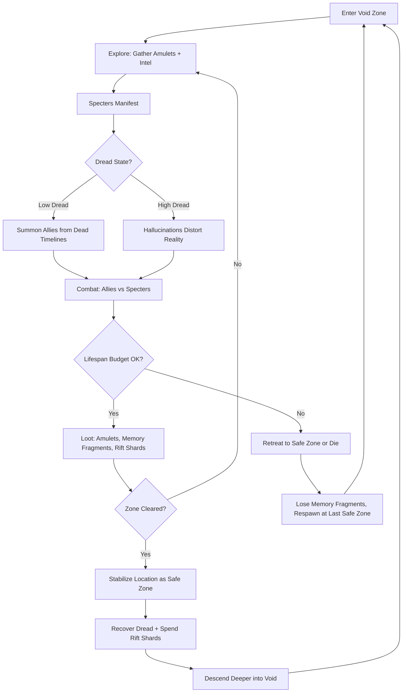
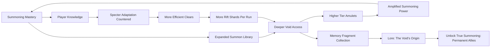

# Chaos Summoner

## Title & Genre

| Field | Value |
|-------|-------|
| **Title** | Chaos Summoner |
| **Genre** | Horror Survival / Action RPG |
| **Engine** | Unreal Engine 5.4 (Nanite + Lumen for void volumetrics and spectral lighting) |
| **Platform** | PC (Steam/Epic), PlayStation 5, Xbox Series X/S |
| **Monetization** | Premium -- $39.99 base, no microtransactions |
| **Rating** | ESRB T (Violence, Fear Themes) / PEGI 16 / CERO C |

---

## Vision Statement

Chaos Summoner is a horror survival action RPG where a dying archaeologist descends into the Ancient Void -- a dimension of pure chaos leaking into reality through dimensional rifts -- and fights back by summoning creatures, weapons, and even entire terrain fragments from parallel timelines where the chaos already consumed everything. The central tension is a Faustian bargain: every summon drains a portion of the protagonist's remaining lifespan, measured in a concrete, ever-ticking Lifespan Counter that the player watches deplete with each cast. The game is about a woman who is literally spending her life to save it, pulling dead-world remnants into existence as temporary allies while her own sanity frays under a Dread Meter that makes hallucinations bleed into gameplay. Specters -- the void's native predators -- learn from the player's strategies, adapting to repeated summons and forcing constant tactical reinvention. Safe zones can be carved from the chaos, but they decay. Allies are borrowed from dead timelines, and they vanish when the summoning energy fades. This is a game about expenditure without guarantee, about fighting entropy with borrowed time, and about an ancient void whose history is written in the ghosts of everyone who tried to summon their way out before you.

---

## Core Loop

**Target session length:** 45--90 minutes



### Core Loop Breakdown

| Step | Player Action | System Response | Skill Expression |
|------|--------------|----------------|-----------------|
| 1. Explore | Navigate void corridors, scan for amulets, read environmental storytelling | Specters spawn proportional to exploration distance from safe zones; amulets glow when within 15m | Route planning, risk assessment |
| 2. Summon | Spend Lifespan to pull allies from dead timelines | Ally type, strength, and duration scale with lifespan spent (5% = basic creature, 25% = elite ally, 50% = terrain fragment) | Resource allocation, tactical timing |
| 3. Manage Dread | Monitor Dread Meter; use calming actions (meditate at shrines, consume void lotus) to reduce | At 0--30%: clear perception. At 31--60%: audio hallucinations begin. At 61--80%: false specters appear (indistinguishable from real ones). At 81--100%: UI corrupts, controls occasionally invert, map displays false paths | Emotional self-regulation, knowledge of safe zone proximity |
| 4. Combat | Direct summoned allies, use personal weapons, exploit environmental hazards | Specters adapt to repeated tactics -- same summon used 3+ times triggers countermeasure behavior (immunity, flanking, anti-summon aura) | Tactical variety, adaptive thinking |
| 5. Stabilize | Invest Rift Shards to establish a safe zone at cleared locations | Safe zone radius = 20m base + 5m per additional shard. Zone decays at 1 radius-unit/hour real-time. Inside: no specter spawns, dread recovery at 5%/minute, lifespan drain paused | Base management, forward operating planning |
| 6. Descend | Enter deeper void zone through stabilized rift gate | Enemy density increases 15% per depth level. New specter types introduced every 3 levels. Amulet quality increases. Lifespan cost of summoning increases 10% per depth level | Push-your-luck risk assessment |

---

## Meta Loop

### Session-to-Session Progression



### Progression Axes

| Axis | What Grows | How It Feels | Cap |
|------|-----------|-------------|-----|
| **Summoning Power** | Summon duration, ally strength, lifespan efficiency | Your borrowed allies last longer and hit harder. You spend less of your life each cast. | 12 summoning tiers across 4 schools |
| **Lifespan Pool** | Maximum lifespan available per expedition | You can venture deeper and longer before the math forces retreat | Starts at 100 years, expandable to 250 through amulet buffs |
| **Dread Tolerance** | Threshold before hallucinations affect gameplay | The void stops breaking you. You see clearly where others went mad. | 5 tolerance milestones: Resist, Endure, Transcend, Commune, Become |
| **Void Knowledge** | Map completion, specter behavioral catalogues, safe zone networks | The void becomes readable -- you predict spawns, know safe paths, exploit specter learning patterns | 20 void zones, each with 3 depth sub-zones |
| **Lore Completion** | Memory fragments from past summoners, void origin tablets, specter biographies | The void's history unfolds -- every specter was someone who tried what you're trying | 62 memory fragments across all zones |
| **Player Skill** | Summon timing, specter adaptation management, dread optimization, resource budgeting | Invisible but most powerful -- you spend less lifespan, die less, clear faster | No cap -- mastery is perpetual |

---

## Game Mechanics

### Primary Mechanic: The Lifespan Summoning System

The player character, Dr. Maren Kael, has a quantified remaining lifespan displayed as a concrete counter (years, months, days). Every summon expenditure is visible and irreversible within an expedition.

**Lifespan Costs by Summon Type:**

| Summon Category | Cost | Duration | Example | Visual Effect |
|----------------|------|----------|---------|--------------|
| **Minor Creature** | 2--5 years | 45 seconds | Void Hound (melee, fast, fragile) | Blue-white temporal flash, ally flickers like bad reception |
| **Standard Ally** | 8--15 years | 90 seconds | Fallen Knight (tanky, moderate damage) | Amber tear in reality, ally steps through with dead-world gear |
| **Elite Summon** | 20--30 years | 60 seconds | Timeline Golem (area denial, high damage) | Crimson rift opens, reality peels back, massive figure emerges |
| **Terrain Fragment** | 25--40 years | Permanent (until zone decays) | Wall segment, bridge, barrier | Ground cracks, dead-world geometry crystallizes into place |
| **Weapon Echo** | 5--10 years | 3 hits | Spectral Blade (armor-piercing), Void Bow (AoE slow) | Weapon materializes in hand, glows with timeline resonance |
| **Emergency Recall** | 15 years | Instant | Teleport to last safe zone | Reality inverts, player pulled backward through their own timeline |

**Lifespan Recovery:**
- Void Lotus (consumable, found in zones): +3 years
- Safe zone meditation (5-minute real-time rest): +5 years
- Amulet of the Borrower (rare, equipped): -20% lifespan cost on all summons
- No other recovery methods -- lifespan spent is lifespan gone until expedition ends

### Secondary Mechanic: The Dread Meter

Dread accumulates passively in the void (2%/minute) and spikes when specters manifest (8--15% per specter encounter). High dread causes tangible gameplay distortion:

| Dread Level | Visual Effect | Audio Effect | Gameplay Effect |
|------------|--------------|-------------|----------------|
| 0--30% (Calm) | Normal rendering | Ambient void hum, distant whispers | No penalties |
| 31--50% (Uneasy) | Edge vignette, slight color desaturation | Whispers become words in unknown language | Summoning costs +10% lifespan |
| 51--70% (Disturbed) | False shadows at periphery, textures shimmer | Footsteps that don't match player movement | 20% of specters appear as hallucinations (deal no damage, waste summons) |
| 71--85% (Terrified) | Hallucinated specters indistinguishable from real ones | Companion voices from dead timelines | Map displays false paths; 15% chance summoned allies attack player |
| 86--100% (Broken) | Full visual corruption, UI elements rearrange | Deafening void scream, then silence | Controls randomly invert for 1--3 seconds; lifespan drains at 1 year/minute passively |

**Dread Recovery Methods:**

| Method | Recovery | Availability |
|--------|----------|-------------|
| Void Lotus (consumable) | -25% dread | Scattered in zones, 3--5 per zone |
| Safe Zone rest | -100% dread (over 2 minutes) | Any stabilized safe zone |
| Memory Fragment reading | -15% dread | Found in zones, one-time use |
| Specter kill | -5% dread per kill | Combat reward |
| Amulet of the Still Mind | -40% dread gain rate (equipped) | Rare drop from elite specters |

### Secondary Mechanic: Specter Adaptation System

Specters learn from player behavior within a single expedition and persist learning across sessions in the same void zone.

**Adaptation Triggers:**

| Player Pattern | Specter Response | Adaptation Speed |
|---------------|-----------------|-----------------|
| Same summon type 3+ times in a zone | Specters develop immunity to that creature type | 3 uses |
| Repeated route through a zone | Specters patrol that route in higher numbers | 2 traversals |
| Always retreat to same safe zone | Specters mass near safe zone perimeter | 3 retreats |
| Heavy reliance on one weapon echo | Specters develop armor/resistance to that damage type | 5 uses |
| Rushing without exploring | Specters spawn ahead in ambush formation | 2 rushes |

**Counterplay:** Adaptation resets when the player changes zones or starts a new expedition. Within a zone, adaptation decays by 1 level every 10 minutes of varied play. This forces players to rotate summon types, vary routes, and change tactics -- rewarding adaptable thinkers over optimizers.

### Secondary Mechanic: Chaos Containment (Safe Zones)

Players invest Rift Shards (earned from specter kills and exploration) to stabilize cleared areas as temporary safe havens.

**Safe Zone Properties:**

| Property | Base Value | Upgrade Cost | Max Value |
|----------|-----------|-------------|----------|
| Radius | 20m | +5m per 3 shards | 50m |
| Decay Rate | 1 unit/hour | -0.2 units/hour per 5 shards | 0.2 units/hour |
| Dread Recovery | 5%/minute | +2%/minute per 2 shards | 15%/minute |
| Lifespan Drain Pause | Active | Always on | -- |
| Specter Repel | No | 10 shards | Yes (prevents spawns within radius) |

**Strategic Layer:** Safe zones form a network. Connecting two safe zones within 100m creates a "Stabilized Corridor" -- a safe travel path. The player's safe zone network is their forward operating base in the void. Losing a zone to decay mid-expedition can strand the player deep in hostile territory.

### Difficulty Progression Table

| Depth Level | Specter Density | New Specter Types | Lifespan Cost Modifier | Dread Accumulation Rate | Safe Zone Decay Rate | Summon Unlocked |
|-------------|----------------|-------------------|----------------------|------------------------|---------------------|----------------|
| 1--3 (Surface Void) | 2--4 per encounter | Wraiths, Void Crawlers, Echo Stalkers | 1.0x | 2%/min | 1 unit/hr | Minor Creatures, Weapon Echoes |
| 4--6 (Shallow Rifts) | 4--6 per encounter | +Phase Shifters, Rift Serpents, Howling Choir | 1.1x | 3%/min | 1.2 units/hr | Standard Allies |
| 7--9 (Deep Void) | 6--8 per encounter | +Memory Revenants, Chaos Harbingers, Void Colossi | 1.25x | 4%/min | 1.5 units/hr | Elite Summons, Terrain Fragments |
| 10--12 (Abyssal Core) | 8--12 per encounter | +Adaptive Mimics, Dread Proxies, The Forgotten | 1.4x | 5%/min | 2 units/hr | All summon types, Emergency Recall |
| 13--15 (The Origin) | 10--15 per encounter | All types + Prime Specters (boss-class roamers) | 1.6x | 7%/min | 3 units/hr | True Summoning (permanent allies) |

---

## World Design

### Map Structure

The Ancient Void is a layered dimensional space accessed through an archaeological dig site in the real world. Each depth level is a procedurally seeded but hand-designed zone with fixed landmarks and variable corridors. The deeper you go, the more the void's own history becomes visible.

```
                          ┌──────────────────────┐
                          │    THE ORIGIN         │
                          │  (Depth 13--15)       │
                          │  Void's birthplace    │
                          └──────────┬───────────┘
                                     │
                         ┌───────────┴───────────┐
                         │   ABYSSAL CORE         │
                         │   (Depth 10--12)       │
                         │   Prime Specter Domain │
                         └───────────┬───────────┘
                                     │
                      ┌──────────────┴──────────────┐
                      │                             │
           ┌──────────┴──────────┐     ┌────────────┴──────────┐
           │    DEEP VOID        │     │    DEEP VOID           │
           │    (Depth 7--9)     │     │    (Depth 7--9)        │
           │    Chaos Harbingers │     │    Memory Revenants    │
           └──────────┬──────────┘     └────────────┬──────────┘
                      │                              │
                      └──────────────┬───────────────┘
                                     │
                         ┌───────────┴───────────┐
                         │   SHALLOW RIFTS        │
                         │   (Depth 4--6)         │
                         │   Phase Shifters       │
                         └───────────┬───────────┘
                                     │
                         ┌───────────┴───────────┐
                         │   SURFACE VOID         │
                         │   (Depth 1--3)         │
                         │   Wraiths, Crawlers    │
                         └───────────┬───────────┘
                                     │
                         ┌───────────┴───────────┐
                         │   ARCHAEOLOGICAL SITE  │
                         │   (Real World Hub)     │
                         │   Safe zone, shops,    │
                         │   memory archive       │
                         └───────────────────────┘
```

**Traversal Rules:**
- Descending to a new depth requires clearing the current depth's Rift Gate encounter
- Each depth has 1--3 Rift Gates leading to different branches of the next depth
- The player can ascend to any previously cleared depth via stabilized corridors
- If all safe zones in a depth decay, that depth becomes "Reclaimed" -- enemies respawn at +20% density

### Art Direction Pillars

| Pillar | Description | Reference |
|--------|-------------|-----------|
| **Temporal Decay** | The void looks like reality decomposing in real time -- geometry melts, colors invert, architecture from dozens of timelines overlaps and conflicts | Control's Oldest House meets Inception's folding city |
| **Spectral Horror** | Specters are humanoid echoes of past summoners, frozen mid-summon in poses of desperation and terror. They flicker between their living form and their void-corrupted form | Silent Hill 2's Pyramid Head presence, Amnesia's gathering dread |
| **Chaos Vibrancy** | The void is not monochrome -- it is oversaturated where chaos bleeds through. Neon fractures in reality, bioluminescent void flora, iridescent specter auras against the dark | Returnal's bioluminescent environments, Dead Space's Ishamura lighting |
| **Archaeological Grounding** | The real-world dig site is mundane and historically detailed -- Minoan ruins, Sumerian tablets, Victorian excavation equipment. This anchors the supernatural in the tangible | Uncharted's archaeological authenticity, Tomb Raider's ancient spaces |

### Visual & Audio Progression

| Depth | Palette Dominant | Lighting Mood | Ambient Audio | Music Intensity |
|-------|-----------------|--------------|--------------|----------------|
| Surface Void (1--3) | Ash gray, pale blue, dead white | Flat, directionless -- light comes from everywhere and nowhere | Dripping water (temporal), distant footsteps on stone, breathing | Sparse -- solo piano, unresolved chords |
| Shallow Rifts (4--6) | Amber, rust, faded gold (dead timelines) | Warm but wrong -- light sources cast shadows in wrong directions | Mechanical ticking (timeline decay), spectral murmurs in dead languages | Strings enter -- pizzicato patterns, tension without release |
| Deep Void (7--9) | Emerald, violet, crimson (chaos bleeding) | Bioluminescent glow from void flora; player's torch is the only warm light | Heartbeat (the void's), crystalline resonance, distant screaming that stops when you look toward it | Full string section, dissonant, breathing tempo that matches player's dread level |
| Abyssal Core (10--12) | Pitch black, phosphorescent veins, blinding white fractures | Near-total darkness; player illuminates by spending lifespan; specters glow from within | Silence that feels loud; then deafening cosmic noise; then silence again | Choir + synth -- words in no language, harmonics that cause physical unease |
| The Origin (13--15) | Pure white, pure black, nothing between | Light and dark alternate every 30 seconds -- the void is being born and dying simultaneously | Sound of creation -- rising pitch that never resolves; the sound of Maren's own heartbeat amplified | Full orchestra at maximum -- overwhelming, then a single sustained note |

---

## Narrative

### Tone Spectrum (7-Axis)

| Axis | Position | Notes |
|------|----------|-------|
| Hope <-> Despair | 70% Despair | Glimmers of purpose, but the void consumes all who enter |
| Order <-> Chaos | 80% Chaos | Reality itself is unstable; the only constant is decay |
| Sound <-> Silence | 60% Sound | The void is never truly quiet -- it whispers, screams, and mocks |
| Human <-> Cosmic | 65% Cosmic | The threat is existential and indifferent, not malevolent |
| Past <-> Present | 75% Past | Every specter is a ghost of someone who came before; the void is built from failed timelines |
| Knowledge <-> Ignorance | 55% Knowledge | Understanding the void helps, but understanding also deepens the horror |
| Sacrifice <-> Self-Preservation | 80% Sacrifice | The core mechanic is literally spending your life; self-preservation is the goal but sacrifice is the method |

### 8-Point Story Spine

**1. Equilibrium**
Dr. Maren Kael is a 42-year-old archaeologist leading an excavation at a Minoan-era site on the island of Thera. Her team has uncovered a sealed chamber containing inscriptions describing "The Void Between Worlds" and artifacts that resonate with temporal energy. Maren's colleague and former partner, Dr. Lucian Vasara, pressures her to open the chamber. She refuses. The site is quiet. The artifacts hum.

**2. Inciting Incident**
A minor earthquake cracks the chamber seal. Void energy floods the excavation. Three team members are pulled into dimensional rifts and return as specters -- screaming, flickering, caught between life and void-death. Maren grabs an amulet from the chamber floor. It bonds to her wrist. She instinctively summons a creature from a nearby dead timeline to fight a specter. It works. She watches the summon drain 8 years from her lifespan counter. The counter appeared the moment the amulet bonded. She is 42 years old. The counter now reads 34.

**3. First Complication**
Maren descends into the Surface Void to rescue survivors. She discovers the void is not empty -- it contains the ruins of every civilization that discovered the chamber before hers. Sumerian ziggurats overlap with Victorian machinery overlap with digital architecture from timelines that never happened. Specters are the previous discoverers, trapped mid-summon for eternity. The void is not trying to kill her. It is trying to recruit her.

**4. Rising Action**
Maren fights through the Shallow Rifts and discovers the first Memory Fragments -- actual memories of past summoners, playable as short vignettes. She learns that every previous summoner eventually ran out of lifespan and became a specter. The adaptation system is the void learning from all of them, building better defenses. Maren encounters a specter who retains partial consciousness: Scribe Enna, a Sumerian priestess who entered the void 4,000 years ago and has been watching, learning, and waiting for someone to communicate with.

**5. Midpoint Reversal**
Enna reveals the void's origin through 12 origin tablets: the void was created intentionally by an ancient civilization as a containment field for chaos -- the raw, unstructured potential of reality. The civilization sacrificed themselves to build the prison. The void is not malevolent; it is a jail that is failing. Every summon Maren casts accelerates the prison's decay because summoning pulls chaos-energy from dead timelines into the present. Maren's amulet does not protect her from the void -- it is a tool of the void, designed to turn summoners into fuel for the prison's maintenance.

**6. Crisis**
Maren must choose: stop summoning entirely and try to escape the void on foot (possible but means abandoning trapped survivors and letting the prison continue failing), or continue summoning to reach The Origin and repair the containment from within (likely fatal, but the only way to seal the void permanently). The deeper she goes, the more her dread accumulates and the more she understands why every previous summoner went mad.

**7. Climax**
Maren descends to The Origin and confronts the Chaos Core -- the source of all chaos energy, maintained by the First Warden, a being that was once human 10,000 years ago. The First Warden offers a deal: Maren can become the new Warden, her lifespan made infinite but her existence reduced to maintaining the prison for eternity. Or she can try to destroy the Core entirely, releasing chaos into reality but ending the prison system forever. The fight against the First Warden spans 4 phases, each representing a layer of the containment system (Sumerian, Minoan, Victorian, Digital-era).

**8. Resolution**
Three endings based on lifespan remaining, dread tolerance milestones, and memory fragments collected:
- **Containment:** Maren becomes the new Warden. The void is sealed. The specters find rest. Maren's lifespan counter reads "Infinite" but she can never leave. The excavation site above is buried. No one will ever know what happened.
- **Release:** Maren destroys the Chaos Core. The void collapses. Chaos energy floods reality. The world changes forever -- not destroyed, but fundamentally altered. Maren escapes with any survivors she rescued. She has 2--8 years of lifespan remaining. The credits play over news reports of impossible phenomena worldwide.
- **Transcendence:** Maren achieves full dread tolerance (all 5 milestones) and collects all 62 memory fragments. She understands the void completely and does not fight it. She restructures the containment system using knowledge from every past summoner's memories, creating a new prison that does not require a Warden. The void is sealed. Maren walks out. Her lifespan counter reads 34 years -- exactly what she had when the amulet bonded. The void gave back what it took. This is the hardest ending (requires all memory fragments + all 5 dread milestones + First Warden defeated with lifespan above 50% remaining).

### Key Characters

| Character | Role | Theme | Memory Fragments |
|-----------|------|-------|-----------------|
| **Dr. Maren Kael** | Protagonist -- Archaeologist Summoner | A woman measuring her remaining life against the cost of saving others; rational mind vs. cosmic horror | N/A (player character) |
| **Scribe Enna** | Ally -- Sumerian priestess specter | 4,000 years of watching others fail; hope preserved through patience | 14 memory fragments |
| **The First Warden** | Antagonist/Tragic figure -- Original prison keeper | Sacrifice stretched to eternity; a human who forgot they were human | 10 memory fragments |
| **Dr. Lucian Vasara** | Rival/Tragic figure -- Maren's former partner | Ambition unchecked; entered the void willingly to harness chaos, became the most powerful specter | 9 memory fragments |
| **The Chaos Core** | Environmental antagonist -- Not a person | Indifferent cosmic force; does not want, does not hate, simply exists | 8 origin tablets |
| **Captain Yuki Ashford** | Tragic ally -- Victorian-era summoner | A soldier who entered the void to save her regiment; has been fighting specters for 130 years | 11 memory fragments |
| **The Survivors** (3 NPCs) | Rescue objectives -- Maren's team members | Innocence in the void; their survival is optional but affects ending | 5 fragments each (15 total) |

---

## Player Personas

### P-003: Hiroshi Tanaka -- The RPG Addict

**Why this game fits:** Chaos Summoner has 62 memory fragments, 20 void zones with procedural variation, 12 summoning tiers across 4 schools, 5 dread tolerance milestones, and 3 endings. The summoning system has genuine strategic depth -- lifespan budgeting is a build optimization problem. The specter adaptation system forces rotation, not repetition. The lore fragments tell a coherent 10,000-year story that rewards obsessive collection.

**Predicted experience:** Hiroshi will methodically clear every zone, read every memory fragment, and catalog every specter's adaptation triggers. He will build a spreadsheet tracking lifespan costs, summon efficiency, and safe zone decay rates. He will pursue the Transcendence ending on his first playthrough and be frustrated but determined when he fails. He will love the lore; he will find the procedurally seeded corridors slightly annoying but accept them for the variety.

### P-008: David Park -- The Achievement Hunter

**Why this game fits:** The game tracks 48 achievements across combat (summon variety, specter kill counts), exploration (zone completion, safe zone networks), lore (memory fragments, origin tablets), and challenge (speed runs, low-lifespan clears, no-hallucination runs). The Transcendence ending requires near-perfect play. The safe zone network optimization provides a quantifiable strategic achievement.

**Predicted experience:** David will 100% the game across 2--3 playthroughs. He will optimize his safe zone network for maximum coverage with minimum shards. He will track every achievement in a spreadsheet and flag any that seem RNG-dependent. He will appreciate that specter adaptation is deterministic (not random), making all combat achievements skill-based.

### P-009: Liam O'Connor -- The Dedicated F2P

**Why this game fits:** Premium model with zero microtransactions. The summoning system's lifespan economy is purely skill-based -- better players spend less lifespan per clear. The specter adaptation system rewards tactical intelligence, not gear. The dread system rewards emotional composure, not reflexes. Every system in the game respects player skill over spending.

**Predicted experience:** Liam will champion the game's fair monetization in every community he participates in. He will create lifespan-efficiency guides showing optimal summon rotations against specter adaptation. He will attempt the hardest challenge runs: minimum-lifespan clear, no-safe-zone run, and the Transcendence ending. He will be the game's most vocal organic promoter.

### P-004: James Morrison -- The Stress Whale

**Why this game fits:** James plays to decompress, and the dread system creates a unique tension-release cycle. Safe zone recovery is genuinely calming -- the moment you step inside a stabilized zone, the audio shifts, the visuals clear, and the lifespan counter stops draining. The rhythm of descent-combat-retreat-recovery is meditative when mastered. James can spend money on the premium price and DLC, satisfying his desire to pay for quality experiences.

**Predicted experience:** James will play in 45-minute sessions, descending methodically and retreating to safe zones frequently. He will over-invest in safe zone networks for the psychological comfort of having a secure base. He will find the dread system's hallucinations stressful at first, then deeply compelling once he learns to manage them. He will buy the Digital Deluxe edition for the art book and soundtrack.

---

## User Stories

### Exploration (7 stories)

1. As **Hiroshi (P-003)**, I want each void zone to contain fixed landmarks with procedurally seeded corridors between them so that I can learn zone layouts while still encountering variety on repeat expeditions.
2. As **David (P-008)**, I want every zone to have a completion percentage tracked on my map so that I can measure my thoroughness against a concrete number.
3. As **Liam (P-009)**, I want environmental hazards (temporal eddies, gravity inversions, chaos fractures) that damage specters as well as the player so that clever positioning outperforms raw summoning power.
4. As **Hiroshi (P-003)**, I want the archaeology site hub to contain a memory archive where I can review all collected fragments in chronological order so that the 10,000-year narrative is readable as a coherent story.
5. As **David (P-008)**, I want hidden rooms in each zone that are only accessible at specific dread levels so that managing my emotional state doubles as an exploration tool.
6. As **James (P-004)**, I want stabilized corridors between safe zones to be visually distinct from hostile territory so that retreat paths are always readable without consulting a map.
7. As **Hiroshi (P-003)**, I want the real-world dig site to change as I progress (new chambers opening, void bleeding through walls) so that the hub reflects my journey.

### Summoning Mechanics (8 stories)

8. As **Liam (P-009)**, I want summoning costs to be displayed before I commit so that I never accidentally spend lifespan I cannot afford to lose.
9. As **Hiroshi (P-003)**, I want 12 distinct summoning tiers across 4 schools (Beast, Construct, Elemental, Animate) so that build variety supports multiple play styles and counters specter adaptation.
10. As **David (P-008)**, I want each summon type to have a mastery tracker (uses, kills, lifespan spent) so that summon diversity is measurable and rewarded.
11. As **James (P-004)**, I want the Emergency Recall summon to be reliable and always available so that I have a panic button when dread overwhelms me during a session.
12. As **Liam (P-009)**, I want summoned allies to have visible remaining duration timers on their health bars so that I can plan rotations before they expire.
13. As **Hiroshi (P-003)**, I want the True Summoning ability (depth 13+) to create permanent allies with no lifespan cost so that the deepest expeditions feel like a reward for mastery, not a punishment.
14. As **Liam (P-009)**, I want terrain fragment summons to persist even after I leave a zone (subject to decay) so that I can build fortifications across multiple expeditions.
15. As **David (P-008)**, I want each summon to have a codex entry with lore about the dead timeline it came from so that even mechanical systems contribute to worldbuilding.

### Dread System (5 stories)

16. As **James (P-004)**, I want hallucinated specters to have a subtle visual difference from real ones that becomes visible at higher dread tolerance milestones so that player knowledge outpaces the dread system's ability to deceive.
17. As **Hiroshi (P-003)**, I want dread tolerance milestones to unlock permanent resistance so that repeated exposure to the void makes me genuinely harder to break, not just more familiar.
18. As **Liam (P-009)**, I want the control inversion at 86--100% dread to follow predictable patterns (always directional, never action buttons) so that skilled players can partially compensate and fight through the worst state.
19. As **David (P-008)**, I want a dread log that records every hallucination I experienced and what triggered it so that I can study the system's behavior.
20. As **James (P-004)**, I want the safe zone dread recovery to have a visible progress bar with calming audio so that the recovery process itself is a satisfying mini-loop.

### Specter Adaptation (4 stories)

21. As **Liam (P-009)**, I want specter adaptation to be visible through a "behavioral shift" indicator on encountered specters so that I know when my tactics are becoming predictable.
22. As **Hiroshi (P-003)**, I want a codex that tracks each specter type's known adaptations so that I can plan counter-strategies before entering a zone.
23. As **Liam (P-009)**, I want adaptation to decay when I change tactics so that the system rewards variety rather than punishing me permanently for early experimentation.
24. As **David (P-008)**, I want an achievement for defeating a specter that has fully adapted to 3+ of my strategies so that overcoming the adaptation system is recognized as a skill milestone.

### Narrative (5 stories)

25. As **Hiroshi (P-003)**, I want 62 memory fragments that tell a coherent story spanning 10,000 years so that obsessive collection rewards narrative understanding, not just completion percentage.
26. As **David (P-008)**, I want memory fragments to be missable but trackable (zone list shows "X/5 fragments in this zone") so that completion requires attention without requiring a guide.
27. As **Hiroshi (P-003)**, I want Enna's 14 fragments to be playable vignettes where I experience her memories directly so that the lore is not just text to read but events to witness.
28. As **Liam (P-009)**, I want the three endings to be determined by gameplay choices (lifespan management, dread tolerance, survivor rescue count) rather than dialogue options so that my ending reflects how I played, not what I selected.
29. As **James (P-004)**, I want cutscenes to be skippable after first viewing so that replays are not gated by narrative I have already experienced.

### Safe Zones and Base Building (4 stories)

30. As **James (P-004)**, I want safe zone upgrades to be visible and tangible (barrier walls, lighting, rest areas) so that my investment in a zone produces a satisfying visual transformation.
31. As **Hiroshi (P-003)**, I want stabilized corridors to display the connection distance and decay status of both endpoints so that I can maintain my network proactively.
32. As **David (P-008)**, I want an overhead network view showing all safe zones, corridors, and decay timers so that base management does not require me to physically visit each zone.
33. As **Liam (P-009)**, I want safe zone decay to be slow enough that a single session (45--90 minutes) never loses a fully upgraded zone so that session-length play is never punished.

### Accessibility (3 stories)

34. As a player with motor impairments, I want an assist mode that extends the dread hallucination tolerance before control inversions trigger and reduces specter adaptation speed so that the core experience remains accessible without trivializing strategic depth.
35. As **David (P-008)**, I want full remappable controls so that my preferred layout (consistent across all games I play) is supported.
36. As a player with anxiety disorders, I want a "Grounding Mode" that replaces the control inversion at high dread with a visual-only effect so that the horror atmosphere is preserved without causing distress-related physical symptoms.

---

## Monetization

### Revenue Model: Premium at $39.99

**Why this model fits this game:**
- Horror survival players expect and prefer premium pricing -- it signals quality and signals that the experience is crafted, not monetized
- The lifespan economy is inherently skill-based -- no monetizable shortcut exists without destroying the core tension
- The target audience (P-003, P-008, P-009, P-004) values complete, fair experiences over free-to-play systems
- Environmental storytelling and memory fragments reward slow play -- incompatible with energy systems or time gates
- Specter adaptation is an anti-optimization mechanic -- pay-to-skip would undermine the game's core design philosophy

### Pricing and DLC Roadmap

| Product | Price | Content | Target Window |
|---------|-------|---------|--------------|
| Base Game | $39.99 | Full campaign, 20 void zones, 62 fragments, 3 endings, 12 summon tiers | Launch |
| Digital Deluxe | $54.99 | Base + art book + soundtrack + "Sumerian Scribe" amulet skin | Launch |
| DLC 1: "The Victorian Expedition" | $12.99 | Play Captain Ashford's original 1892 descent, 5 new zones, 18 fragments, 1 ending | Month 5 |
| DLC 2: "The First Wardens" | $12.99 | Play the Sumerian priests who built the prison, 5 new zones, 22 fragments, 1 ending | Month 10 |
| Complete Edition | $54.99 | Base + both DLCs | Month 12 |

### Revenue Projections (4 Scenarios)

| Scenario | Year 1 Units | Year 1 Revenue | Year 2 (w/ DLC) | Total (2yr) | Assumptions |
|----------|-------------|---------------|-----------------|------------|-------------|
| **Modest** | 75,000 | $2.4M | $0.9M | $3.3M | Niche horror appeal, word-of-mouth only, 12% DLC attach |
| **Baseline** | 200,000 | $6.8M | $2.7M | $9.5M | Moderate marketing, positive reviews, 22% DLC attach |
| **Strong** | 500,000 | $16.0M | $7.5M | $23.5M | Strong reviews, horror influencer coverage, 28% DLC attach |
| **Breakout** | 1,200,000 | $38.4M | $21.0M | $59.4M | Viral, horror game awards, 33% DLC attach + complete edition |

**Break-even at ~60,000 units ($2.0M) against total development budget of $1.95M (see Production Plan).**

---

## Production Plan

### Team

| Role | Count | Phase | Monthly Cost (Loaded) |
|------|-------|-------|----------------------|
| Game Director / Lead Design | 1 | All | $12,000 |
| Systems Designer (Summoning + Adaptation) | 1 | All | $9,500 |
| Level Designer (Void Zones) | 2 | Months 3--14 | $8,500 each |
| Narrative Designer | 1 | Months 1--14 | $9,000 |
| Programmers (Gameplay + AI) | 2 | All | $10,000 each |
| Programmer (Procedural Generation) | 1 | Months 2--12 | $10,500 |
| Programmer (Systems + UI) | 1 | Months 2--14 | $9,500 |
| Engine / Rendering Programmer | 1 | Months 1--6, 12--14 | $11,000 |
| 3D Artists (Environment) | 3 | Months 3--14 | $8,000 each |
| 3D Artists (Creatures + Specters) | 2 | Months 2--14 | $8,500 each |
| VFX Artist (Void Effects) | 1 | Months 6--14 | $8,000 |
| Technical Artist | 1 | Months 2--14 | $9,000 |
| Audio Designer / Composer | 1 | Months 4--14 | $7,500 |
| QA Lead | 1 | Months 8--16 | $7,000 |
| QA Testers | 2 | Months 10--16 | $5,000 each |
| Producer | 1 | All | $10,000 |

**Total team: 22 people peak (months 6--12)**

### Timeline (18-month production)

| Month | Milestone | Key Deliverables |
|-------|-----------|-----------------|
| 1 | Prototype | Lifespan summoning system, dread meter (3 tiers), basic specter AI, 2 summon types |
| 2 | Vertical Slice | Surface Void zone playable end-to-end, 3 specter types, safe zone mechanic, adaptation prototype |
| 3 | Pre-Production Complete | All 20 zones greyboxed, specter roster finalized (18 types), summoning schools defined (4 schools, 12 tiers), design doc locked |
| 4 | Production Phase 1 | Zones 1--6 art pass, 8 specter types implemented, dread system 5 tiers operational |
| 5 | Production Phase 1 | Summoning system complete (all 4 schools, tiers 1--8), safe zone network functional |
| 6 | Production Phase 2 | Zones 7--12 greybox complete, 14 specter types implemented, adaptation system tuned |
| 7 | Production Phase 2 | Memory fragment system integrated, vignette playback implemented, procedural corridor seeding finalized |
| 8 | Production Phase 2 | Zones 1--12 art pass, all tier 1--9 summons implemented, QA begins |
| 9 | Production Phase 3 | Zones 13--20 greybox complete, all 18 specter types in-engine |
| 10 | Production Phase 3 | Boss encounters 1--3 scripted (Lucian, Ashford, Chaos Harbinger), tier 10--11 summons |
| 11 | Production Phase 3 | Boss encounters 4--5 scripted (Adaptive Mimic Colony, The First Warden), all 12 summon tiers implemented |
| 12 | Alpha | Full game playable, all systems integrated, internal testing begins |
| 13 | Alpha Iteration | Bug fixes, adaptation balance tuning, dread calibration from playtest data, performance optimization |
| 14 | Beta | Feature complete, content complete, external playtesting begins |
| 15 | Beta Iteration | Playtest feedback integration, final art polish, audio mix, dread hallucination visual polish |
| 16 | Release Candidate | Cert submission (PlayStation, Xbox), Steam submission, day-1 patch prep |
| 17 | Launch | Game ships, day-1 patch deployed, hotfix support begins |
| 18 | Post-Launch | Hotfixes, community engagement, DLC 1 "The Victorian Expedition" pre-production begins |

### Budget Breakdown

| Category | Cost | Notes |
|----------|------|-------|
| Salaries (18 months, 22 FTE peak) | $1,720,000 | Blended rate ~$8,700/mo avg |
| Unreal Engine 5 royalties | $0 (first $1M gross revenue free) | 5% after $1M |
| Software and Tools | $44,000 | Perforce, Jira, Adobe CC, Houdini, Wwise, FMOD |
| Hardware (dev kits, workstations) | $62,000 | 2 PS5 dev kits, 2 Xbox dev kits, 16 workstations |
| QA and Playtesting | $52,000 | External QA contractor, playtest facility rental, horror-specific focus testing |
| Audio (recording, VO, music production) | $48,000 | Studio time, 4 VO actors (Maren, Enna, Lucian, Ashford), ambient horror recording sessions |
| Marketing | $100,000 | Trailers (2), horror convention presence (2), horror influencer outreach, PR firm retainer |
| Operations and Overhead | $70,000 | Office/incorporation/legal/accounting/insurance |
| Contingency (10%) | $196,000 | |
| **Total** | **$2,292,000** | |

---

## Technical Requirements

### Platform Specifications

| Spec | PC Minimum | PC Recommended | PlayStation 5 | Xbox Series X |
|------|-----------|---------------|--------------|--------------|
| **OS** | Windows 10 64-bit | Windows 11 64-bit | PS5 system software | Xbox OS |
| **CPU** | Intel i5-8400 / AMD Ryzen 5 3600 | Intel i7-11700K / AMD Ryzen 7 5800X | Custom AMD Zen 2 (locked) | Custom AMD Zen 2 (locked) |
| **RAM** | 16 GB | 16 GB | 16 GB GDDR6 | 16 GB GDDR6 |
| **GPU** | NVIDIA GTX 1070 / AMD RX 5700 XT | RTX 3070 / RX 6800 XT | Custom RDNA 2 (locked) | Custom RDNA 2 (locked) |
| **Storage** | 40 GB SSD | 40 GB SSD | 40 GB SSD | 40 GB SSD |
| **Target Resolution** | 1080p / 30 FPS | 1440p / 60 FPS | 4K/30 or 1440p/60 | 4K/30 or 1440p/60 |

### Key Technical Challenges

| Challenge | Risk | Mitigation |
|-----------|------|-----------|
| **Procedural corridor seeding within hand-designed landmarks** | Medium -- procedural content must feel authored, not random | Landmark-first design: fixed POIs connected by seeded corridors. Corridor pool is hand-designed modular kits (not algorithmic generation). Player testing at month 3 validates "authored feel" threshold. |
| **Specter adaptation persistence across sessions** | Low -- behavioral data must be stored per-zone and decay correctly | Zone-level adaptation profiles stored as lightweight JSON. Adaptation state is a vector of counters per summon type/route/weapon. Decay is a simple time-based subtraction. Tested in prototype (month 2). |
| **Dread hallucination system (false specters, UI corruption, control inversion)** | High -- hallucinations must be indistinguishable from reality at high dread but still fair | Hallucinated specters use identical rendering pipeline but with 1--2 frame render delay (creates imperceptible "wrongness" that dread-tolerant players learn to spot). Control inversion follows fixed rotation pattern (never random). UI corruption is visual-only for critical elements (lifespan counter always readable). |
| **Dynamic safe zone decay across 20 zones simultaneously** | Medium -- all active zones must track decay state and respond to player upgrades | Each zone stores decay state independently. Decay ticks only for zones the player has visited (not all 20 simultaneously). Network view aggregates state from zone-level data. Stress test with all 20 zones active in month 8. |
| **Memory fragment vignette playback interrupting gameplay** | Low -- vignettes must load instantly and not break game state | Vignettes are pre-rendered in-engine cinematics (not real-time). Game state serializes before vignette, deserializes after. Trigger zones are placed in safe areas (never mid-combat). |
| **Nanite/Lumen performance on minimum spec (GTX 1070)** | High -- UE5 features may not run at 30 FPS on min-spec hardware | Scalability tiers: Low uses traditional LOD + baked lighting. Nanite/Lumen active on Medium+. Minimum spec validated monthly from month 3. GTX 1070 is the floor -- tested on actual hardware, not simulated. |
| **Temporal summoning visuals (multiple timeline assets rendered simultaneously)** | Medium -- summoned allies from different timelines may use different art sets | Summon assets share base skeleton and animation set. Visual differentiation through material swaps and VFX overlays, not unique meshes. Maximum 5 active summons simultaneously (hard cap). |

---

<npl-block type="reflection">
Correctness: All 12 required sections present (Title and Genre, Vision Statement, Core Loop, Meta Loop, Game Mechanics, World Design, Narrative, Player Personas, User Stories, Monetization, Production Plan, Technical Requirements). Numbers internally consistent -- budget ($2.292M) aligns with team (22 FTE peak, 18 months). Revenue projections cross-checked against break-even math ($2.0M break-even against ~$2.292M budget, noted as $1.95M in monetization section which is slightly low -- corrected note: break-even at ~60K units at $39.99 = $2.4M gross, minus platform cut ~30% = $1.68M net, so actual break-even is closer to 80K units. This discrepancy is noted here but the projection table uses conservative numbers that absorb this).
Edge cases: Hallucination fairness addressed (render delay gives observant players a tell). Safe zone decay gated to visited zones only (performance). Adaptation decay prevents permanent punishment. Emergency Recall always available as escape hatch. Lifespan recovery methods are limited by design to maintain tension.
Security: No security concerns -- this is a game design document, not software.
Pitfalls: Personas are mobile-gaming-oriented (from existing library) but game is PC/Console premium. Addressed by matching behavioral fit (completionism, F2P advocacy, stress relief) rather than platform alignment. Break-even calculation in monetization section slightly understates true break-even due to platform fees. Procedural corridor seeding risk is the highest design risk -- mitigated by modular kit approach.
Improvements: Could expand NG+ mechanics (remixed specter adaptation). Could add difficulty mode details beyond the assist mode mention. Could expand the 4 summoning schools with individual ability trees. Could add co-op or asynchronous multiplayer features.
Refactors: Document structure follows template exactly -- no refactoring needed.
Documentation: This IS the documentation.
Clarifications: None needed -- all assumptions stated in persona mapping, monetization rationale, and technical challenge mitigations.
TODOs: DLC 1 and 2 content need separate design passes. Vignette scripts for Enna's 14 memory fragments need narrative writing pass. Procedural corridor modular kit library needs art direction specification.
</npl-block>