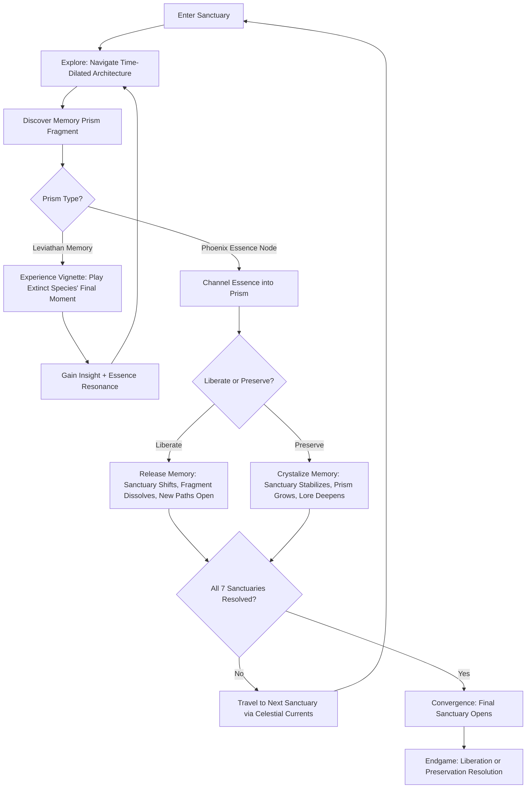
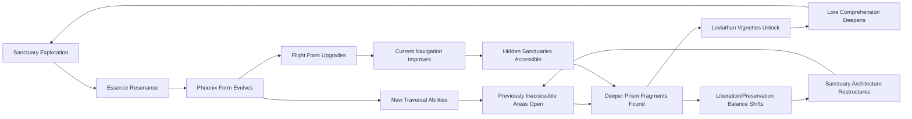

# Chronicle of Flight

## Title & Genre

| Field | Value |
|-------|-------|
| **Title** | Chronicle of Flight |
| **Genre** | Narrative Adventure / Metroidvania-Adjacent Exploration |
| **Engine** | Unity 2023 LTS (URP with custom volumetric lighting) |
| **Platform** | PC (Steam), Nintendo Switch, PlayStation 5, Xbox Series X/S |
| **Monetization** | Premium -- $24.99 USD base, no microtransactions |
| **Rating** | ESRB T (Fantasy Violence, Thematic Elements) / PEGI 12 / CERO B |

---

## Vision Statement

Chronicle of Flight is a contemplative narrative adventure where the last phoenix-wraith navigates seven time-dilated sanctuaries suspended between collapse and eternity. You channel phoenix essence into leviathan memory prisms -- crystalline structures that hold the final memories of extinct celestial beings -- and every essence you invest reshapes both the present sanctuary and its past. The game lives at the intersection of observation and intervention: do you liberate the prisms, releasing their memories to dissolve the celestial plane and end its suffering, or do you preserve them, maintaining a fragile beauty that will slowly petrify into stillness? Seven sanctuaries, each frozen at a different moment in cosmic history. Seven leviathan memories, each a playable vignette of a species that once held the sky. Two philosophical endings separated not by a dialogue choice but by the cumulative weight of every essence you spent and every prism you touched. This is Journey by way of Celeste, with the color vocabulary of an aurora bleeding into amethyst.

---

## Core Loop

**Target session length:** 30--60 minutes



### Core Loop Breakdown

| Step | Player Action | System Response | Skill Expression |
|------|--------------|----------------|-----------------|
| 1. Enter Sanctuary | Arrive via celestial current; observe initial time-dilated state | Sanctuary loads in its "base" frozen state -- architecture mid-collapse, light diffracting through prism shards | Observation, spatial orientation |
| 2. Explore | Traverse floating platforms, glide on thermal updrafts, climb crystalline formations | Time dilation means some areas loop in 10-second cycles (a bridge repeatedly collapsing and reforming); player must time traversal to the cycle | Timing, spatial memory, rhythm |
| 3. Discover Prism Fragment | Find a Leviathan Memory Prism embedded in sanctuary architecture | Prism activates with a chime; visual distortion ripples outward. Three types: Complete Memory (vignette), Essence Node (channeling point), or Fractured Echo (partial lore) | Curiosity, thoroughness |
| 4. Experience Vignette | Step into a complete memory -- play as the extinct species in its final living moment | Gameplay shifts: flight mechanics as a sky-whale, echo-location as a crystal-singer, collective swarm intelligence as a stellar moth colony. Each vignette is a 3--8 minute self-contained mechanic | Adaptability, emotional engagement |
| 5. Channel Essence | Direct phoenix energy into a prism at an Essence Node | Essence flows as a luminous stream from the player into the prism. Duration: 3--5 seconds. Environmental response: light blooms, architecture shifts, ambient audio swells | Timing, commitment (channeling locks you in place) |
| 6. Choose | At key prisms, choose to Liberate (release the memory) or Preserve (crystallize it) | Liberation: prism shatters, memory disperses as light, sanctuary structure weakens in that area, new void-paths open. Preservation: prism solidifies, memory locked as crystal, sanctuary structure strengthens, new crystal-paths open | Strategic, philosophical -- each choice has tangible navigation consequences |
| 7. Resolve | Complete all prisms in a sanctuary; sanctuary resolves into its final state | Sanctuary settles: either partially dissolved (liberation-heavy) or partially crystallized (preservation-heavy). Final state determines available celestial currents to next sanctuaries | Cumulative decision-making |
| 8. Travel | Ride celestial currents between sanctuaries | Brief flight sequence (30--60 seconds) with scenic traversal and ambient music. No threats -- transition and reflection | Rest, contemplation |

---

## Meta Loop

### Session-to-Session Progression



### Progression Axes

| Axis | What Grows | How It Feels | Cap |
|------|-----------|-------------|-----|
| **Phoenix Form** | Flight duration, glide precision, thermal sensitivity, essence luminosity | Your wings strengthen. You soar longer, sense more, glow brighter against the amethyst dark. | 5 evolutions tied to sanctuary completions |
| **Essence Resonance** | Ability to channel essence faster, sense distant prisms, interact with fragile time-loops without disrupting them | The sanctuaries stop fighting your presence and start responding to it | 4 resonance tiers, one per 2 sanctuaries |
| **Sanctuary Knowledge** | Map completion, hidden prism locations, time-loop rhythm mastery, architecture understanding | Each sanctuary transitions from alien maze to known landscape with its own music | 7 sanctuaries, each with 3 states (base, liberated, preserved) |
| **Lore Comprehension** | Leviathan histories, celestial plane cosmology, phoenix-wraith origin, the nature of memory and extinction | The world's story assembles from scattered crystal-shards into a coherent mythology | 63 lore fragments (9 per sanctuary) |
| **Traversal Mastery** | Flight stamina management, thermal riding, crystal-wall climbing, void-gap crossing | Movement becomes expressive rather than functional -- you dance through sanctuaries | No cap; mastery opens speedrun and sequence-break paths |

---

## Game Mechanics

### Primary Mechanic: Phoenix Essence Channeling

The phoenix-wraith carries a finite reservoir of essence that regenerates slowly through exploration and completions. Essence is the only resource; it fuels channeling, gliding, and interaction with time-loops.

**Essence Reservoir:**

| Reservoir Level | Visual State | Channeling Speed | Glide Duration | Lore Access |
|----------------|-------------|-----------------|---------------|-------------|
| 0--20% | Dim ember glow, wings barely visible | 1x speed | 4 seconds | None |
| 20--40% | Warm amber pulse, wing tips flicker | 1.5x speed | 8 seconds | Surface memories |
| 40--60% | Steady gold radiance, full wing definition | 2x speed | 14 seconds | Emotional memories |
| 60--80% | Luminous corona, light trails on movement | 2.5x speed | 22 seconds | Deep memories |
| 80--100% | Blinding phoenix blaze, environment responds to presence | 3x speed | 35 seconds | Genesis memories (rarest tier) |

**Essence Regeneration Sources:**

| Source | Essence Gained | Frequency |
|--------|---------------|-----------|
| Ambient exploration (per 60 seconds in sanctuary) | +2% | Continuous |
| Discovering a prism fragment | +8% | Per fragment |
| Completing a Leviathan vignette | +15% | Per vignette (7 total) |
| Resolving a sanctuary | +25% | Per sanctuary (7 total) |
| Finding a hidden Genesis memory | +20% | Per genesis memory (5 total) |
| Celestial current traversal | +5% | Per transit |

**The Channeling Decision:**

When channeling essence into a prism, the player commits that essence temporarily (3--5 seconds of locked animation). During channeling, the player cannot move and is vulnerable to sanctuary shifts -- time-loops may collapse platforms beneath them if poorly timed.

### Secondary Mechanic: Time-Dilated Traversal

Each sanctuary contains time-loops: 8--15 second cycles where architecture collapses, reforms, or shifts state. The player must learn each loop's rhythm to traverse.

**Time-Loop Types:**

| Loop Type | Visual | Cycle Duration | Traversal Strategy |
|-----------|--------|---------------|-------------------|
| Collapse Loop | Bridge/platform crumbles and reforms | 8 seconds | Sprint across during stable phase (seconds 1--4); wait during collapse (5--8) |
| Flood Loop | Light-energy fills a corridor, then drains | 12 seconds | Swim through the light during flood (buoyancy mechanic); walk during drain |
| Rotation Loop | Crystal pillars rotate on axis, opening/closing passages | 10 seconds | Time movement through gaps; each pillar 90 degrees out of phase |
| Echo Loop | Previous player positions replay as ghost; ghost triggers switches | 15 seconds | Position yourself so your echo-ghost hits switches you cannot reach |
| Inversion Loop | Gravity flips for half the cycle | 8 seconds | Plan ascents during normal gravity, descents during inverted |

**Essence Interaction with Loops:**

At Resonance Tier 2+, the player can spend 10% essence to briefly slow a time-loop (extends cycle by 50% for 5 seconds). This is the primary skill gate: high-essence players can brute-force tricky loops; low-essence players must master timing.

### Secondary Mechanic: Liberation vs. Preservation

Each of the 7 sanctuaries contains 3--5 decision prisms. The player's cumulative choices determine:

1. The sanctuary's resolved state (architecture, accessibility, visual palette)
2. Which celestial currents open to later sanctuaries (affecting visit order)
3. Which ending the player approaches

**Liberation Effects:**

| Liberation Level | Sanctuary Visual | Navigation Effect | Narrative Implication |
|-----------------|-----------------|-------------------|----------------------|
| 0--1 prisms liberated | Mostly crystalline, stable | Crystal-paths dominant; orderly traversal | Memory preserved at cost of stagnation |
| 2--3 prisms liberated | Mixed crystal and void | Both path types available; complex layout | Balance between holding and releasing |
| 4--5 prisms liberated | Mostly void, fragments dissolving | Void-paths dominant; chaotic but fast traversal | Release brings freedom but loss of structure |

**Preservation Effects:**

| Preservation Level | Sanctuary Visual | Navigation Effect | Narrative Implication |
|-------------------|-----------------|-------------------|----------------------|
| 0--1 prisms preserved | Mostly void, dissolving | Void-paths dominant; open but disorienting | Nothing held, nothing lost |
| 2--3 prisms preserved | Mixed void and crystal | Both path types; ordered complexity | Memory shaped by will |
| 4--5 prisms preserved | Dense crystalline, luminous | Crystal-paths dominant; structured but slow | Beauty frozen, growth halted |

### Leviathan Vignettes (7 Unique Playable Memories)

Each sanctuary contains one complete Leviathan Memory -- a 3--8 minute gameplay shift where the player inhabits an extinct celestial species.

| Sanctuary | Species Name | Form | Vignette Mechanic | Duration | Emotional Tone |
|-----------|-------------|------|-------------------|----------|---------------|
| The First Stillness | Aethereal Sky-Whale | Massive airborne cetacean | Echolocation navigation through cloud-banks; gentle, no threats -- you are the last of your kind hearing your own echo return from empty sky | 6 min | Melancholy wonder |
| The Shattered Meridian | Crystal-Singer Colony | Symbiotic crystalline insectoid swarm | Frequency-matching: tune your colony's hum to resonate with dying crystals, keeping them alive through harmony | 5 min | Urgent tenderness |
| The Amber Convergence | Stellar Moth Brood | Bioluminescent moth collective | Swarm choreography: guide thousands of moths through a dying star's corona; individuals perish but the brood survives | 4 min | Sacrificial beauty |
| The Void Cradle | Obsidian Dream-Serpent | Coiling entity that navigates by thought | Thought-to-movement: player intentions (directional input) manifest as the serpent's body; no direct control -- you suggest, the serpent interprets | 7 min | Disorienting intimacy |
| The Luminous Threshold | Glass Phoenix (Ancestor) | The phoenix-wraith's own predecessor | Flight perfection: pure flight through a collapsing cathedral of light; no combat, no puzzles -- only the grief of burning beauty | 5 min | Awe and grief |
| The Amethyst Descent | Deep-Choir Leviathan | Sound-entity living in amethyst geode resonance | Rhythm matching: the leviathan speaks in bass frequencies; match the pulse to maintain the geode's structural integrity | 8 min | Meditative dread |
| The Final Convergence | All species as echoes | Shift between all 6 forms in sequence | Hybrid of all vignette mechanics; each form contributes one action to open the Convergence | 6 min | Catharsis |

### Difficulty Progression Table

| Sanctuary | Time-Loop Density | Loop Complexity | Prism Decision Weight | Vignette Difficulty | Essence Pressure | Traversal Challenge |
|-----------|------------------|----------------|----------------------|--------------------|-----------------|-------------------- |
| 1 -- The First Stillness | 2 loops | Collapse only | Low (2 prisms) | Gentle introduction | Low regeneration needed | Open, forgiving |
| 2 -- The Shattered Meridian | 3 loops | Collapse + Rotation | Medium (3 prisms) | Frequency-matching tutorial | Moderate | Vertical emphasis |
| 3 -- The Amber Convergence | 4 loops | +Flood loops | Medium (3 prisms) | Swarm management | Moderate | Large-scale, multi-path |
| 4 -- The Void Cradle | 4 loops | +Inversion | High (4 prisms) | Thought-input learning curve | High -- limited regeneration in void | Disorienting, non-Euclidean |
| 5 -- The Luminous Threshold | 5 loops | +Echo | High (4 prisms) | Pure flight skill check | Moderate -- abundant regeneration | Fast, demanding |
| 6 -- The Amethyst Descent | 5 loops | All types combined | High (5 prisms) | Rhythm precision required | High -- regeneration tied to rhythm success | Dense, claustrophobic |
| 7 -- The Final Convergence | 6 loops | All types + hybrid | Critical (5 prisms, determines ending) | All vignette mechanics recalled | Maximum pressure | All previous challenges combined |

---

## World Design

### Map Structure

Seven sanctuaries connected by celestial currents. Non-linear after the first two: sanctuaries 3--6 can be visited in any order based on which currents the player opens through liberation/preservation choices.

```
                    ┌─────────────────────────┐
                    │   7. THE FINAL           │
                    │      CONVERGENCE         │
                    │   (Opens after 3--6)     │
                    └────────────┬─────────────┘
                                 │
               ┌─────────────────┼─────────────────┐
               │                 │                   │
    ┌──────────┴──────┐  ┌───────┴────────┐  ┌──────┴──────────┐
    │ 5. THE LUMINOUS │  │ 6. THE AMETHYST│  │ 4. THE VOID     │
    │   THRESHOLD     │  │   DESCENT      │  │   CRADLE        │
    └────────┬────────┘  └───────┬────────┘  └──────┬──────────┘
             │                   │                   │
             └─────────┬─────────┴──────────┬────────┘
                       │                    │
             ┌─────────┴────────┐  ┌────────┴─────────┐
             │ 3. THE AMBER     │  │ (Order depends on │
             │   CONVERGENCE    │  │  current access)  │
             └─────────┬────────┘  └──────────────────┘
                       │
             ┌─────────┴────────┐
             │ 2. THE SHATTERED │
             │   MERIDIAN       │
             └─────────┬────────┘
                       │
             ┌─────────┴────────┐
             │ 1. THE FIRST     │
             │   STILLNESS      │
             └──────────────────┘
```

**Celestial Currents:** 12 transit routes. 4 are always open; 8 open/close based on liberation/preservation choices in resolved sanctuaries. This creates 4--6 possible visit orders for sanctuaries 3--6.

### Art Direction Pillars

| Pillar | Description | Reference |
|--------|-------------|-----------|
| **Luminous Decay** | Architecture caught between brilliant light and encroaching amethyst darkness -- gold filigree dissolving into purple void | Journey's desert temples, Ori's spirit tree |
| **Crystal Memory** | Prisms refract light into narrative scenes; the world's story is told through refraction, not text | Child of Light's watercolor, Gris's color-as-emotion |
| **Weightless Grandeur** | Everything floats. No ground, no gravity -- only thermal currents and crystalline anchor-points | Outer Wilds's zero-G sections, Abzu's underwater cathedrals |
| **Amethyst Oblivion** | The void is not black -- it is deep purple, alive with faint stellar drift. Oblivion is beautiful | Celeste's core aesthetic, Hades's Styx color palette |

### Visual & Audio Progression

| Sanctuary | Palette Dominant | Lighting Mood | Ambient Audio | Music Character |
|-----------|-----------------|--------------|--------------|----------------|
| 1 -- The First Stillness | Soft gold, cloud-white, pale sky-blue | Diffuse, heavenly, no hard shadows | Wind, distant whale-song echo, crystalline chime | Solo piano, adagio |
| 2 -- The Shattered Meridian | fractured amber, cracked quartz-white, prismatic edges | Refracted, rainbow shards cutting through amber fog | Frequency hums, glass resonance, insect-wing whispers | Piano + string quartet, shifting keys |
| 3 -- The Amber Convergence | Warm amber, moth-wing dust (iridescent), dying-star orange | Flickering, pulsing, warmth fading to cold | Moth-wing thousands, ember crackle, stellar wind | Full strings, ascending crescendo |
| 4 -- The Void Cradle | Obsidian black, deep amethyst, occasional dream-blue spark | Near-darkness, self-illuminated (player is the light source) | Deep bass thrum, thought-echoes (whispered player inputs), geode resonance | Ambient drone + solo cello, atonal |
| 5 -- The Luminous Threshold | Blinding white-gold, prismatic refraction, burning edges | Overexposed, lens-flare constant, almost too bright to look at | Phoenix roar (distant), cathedral acoustic echo, fire-crackle | Full orchestra, triumphant + grieving |
| 6 -- The Amethyst Descent | Deep purple, crystalline violet, mineral green accents | Internal glow from crystal formations, no external light | Bass choir, amethyst resonance, heartbeat rhythm | Choir + organ + synthesis, overwhelming |
| 7 -- The Final Convergence | All palettes merged: gold through amber into amethyst through void | Shifting, cycling through all previous moods per phase | All previous ambient layers cycling | Full orchestra + choir + piano, resolving |

---

## Narrative

### Tone Spectrum (7-Axis)

| Axis | Position | Notes |
|------|----------|-------|
| Hope vs. Despair | 60% Hope | More wonder than grief, but extinction is the backdrop |
| Light vs. Dark | 55% Light | Luminous beauty dominates; darkness is beautiful, not threatening |
| Sound vs. Silence | 65% Sound | Music and ambient audio are primary storytelling vehicles |
| Movement vs. Stillness | 70% Movement | Flight, traversal, and rhythm; stillness is the enemy (petrification) |
| Memory vs. Present | 75% Memory | The world is defined by what was; your choices determine if what was becomes what will be |
| Individual vs. Collective | 80% Collective | The phoenix-wraith is the last of its kind but fights for the memories of all extinct species |
| Freedom vs. Preservation | 50/50 -- The Central Tension | This IS the game's thesis |

### 8-Point Story Spine

**1. Equilibrium**
The phoenix-wraith exists in the space between death and dissolution -- the last ember of a species that once carried fire between the stars. The celestial plane, a scaffold of crystalline sanctuaries built by the leviathans to hold their memories, is slowly collapsing. Nothing threatens the wraith. Nothing saves it either. There is only the distant pulse of dying prisms.

**2. Inciting Incident**
The wraith discovers The First Stillness -- the first sanctuary, still barely intact, containing the memory of the Aethereal Sky-Whale. Channeling essence into the whale's prism, the wraith experiences the whale's final moment: swimming through empty sky, calling out to a species that no longer exists, hearing its own echo return from nothing. The wraith realizes the prisms are not just memories. They are the last evidence these species ever existed. Liberation releases the memory but erases the evidence. Preservation locks the memory but petrifies the species into permanent stasis.

**3. First Complication**
The Shattered Meridian reveals that the sanctuaries are not natural formations -- they were built by the leviathans as a compromise between extinction and eternity. The Crystal-Singer colony sacrificed itself to construct the prisms, knowing that preserving others' memories meant erasing their own. The wraith discovers it is not the first phoenix to attempt this journey. Previous phoenix-wraiths failed, dissolved, or chose one extreme (total liberation or total preservation) and destroyed the balance.

**4. Rising Action**
The wraith traverses the Amber Convergence and Void Cradle, experiencing the memories of species that chose collective sacrifice over individual survival. The celestial plane's collapse accelerates -- each prism the wraith interacts with weakens the structural integrity of the scaffolding. The leviathans did not account for a phoenix interacting with ALL the prisms. The system was designed for passive preservation, not active channeling.

**5. Midpoint Reversal**
At the Luminous Threshold, the wraith encounters the memory of its own ancestor -- the Glass Phoenix, the last phoenix to attempt the journey. The Glass Phoenix chose total liberation: it released every prism, dissolved every memory, and burned the celestial plane clean. But total liberation also erased the phoenix species from memory. The current wraith exists because one prism in The First Stillness was missed -- a single Crystal-Singer's memory of seeing a phoenix in flight, preserved by accident. The wraith exists because of preservation, not liberation.

**6. Crisis**
The Amethyst Descent reveals the Deep-Choir Leviathan's truth: the celestial plane was never meant to last. The leviathans built it as a temporary monument, expecting it to collapse within an age. It has persisted for a thousand ages because every phoenix-wraith that came before reinforced it with essence, trapping the memories in an artificial eternity the leviathans never intended. The question is not liberation or preservation -- it is whether the phoenix-wraith has the right to make this choice at all.

**7. Climax**
The Final Convergence opens. All seven sanctuaries' states converge into a single architecture. The wraith must navigate a sanctuary that reflects every choice it has made -- liberated areas dissolve into void, preserved areas crystallize into impassable walls, and the path forward exists only in the spaces between the two. The wraith encounters echoes of all six extinct species simultaneously. The final prism requires the wraith to channel its own essence -- not the leviathans' memories, but its own.

**8. Resolution**
Three endings based on cumulative liberation/preservation balance:
- **Liberation (12+ prisms liberated):** The wraith releases all memories, including its own. The celestial plane dissolves into luminous dust that drifts into the void. Nothing is preserved. Nothing is forgotten -- because forgetting requires someone to remember, and there is no one left. The screen fades to pure amethyst. Credits roll over silence.
- **Preservation (12+ prisms preserved):** The wraith crystallizes all memories into a single eternal prism. The celestial plane becomes a perfect, luminous, motionless monument. Beautiful and dead. The wraith becomes the prism's guardian -- frozen, aware, alone forever. Credits roll over the piano theme, gradually slowing to a stop mid-note.
- **Balance (10--11 of either, or exact parity):** The wraith rejects both extremes. It channels its essence not into liberation or preservation, but into a third option: transformation. The memories are neither released nor frozen -- they are changed into something new. The celestial plane blooms into a living ecosystem of light and crystal, neither dead nor static, growing in ways the leviathans never imagined. The wraith does not survive the transformation, but its essence becomes the soil from which new celestial life grows. Credits roll over full orchestra, building to a crescendo that does not resolve but instead opens into a new melody.

### Key Characters

| Character | Role | Theme | Lore Fragments |
|-----------|------|-------|---------------|
| **The Phoenix-Wraith** | Protagonist -- Last ember of the phoenix species | The burden of being the last; the responsibility of choosing for the dead | N/A (player character) |
| **The Aethereal Sky-Whale** | First memory -- Guide through absence | Echo as existence; being defined by the space you leave | 9 echo-fragments across The First Stillness |
| **The Crystal-Singer Colony** | Architects -- Builders who sacrificed themselves | The cost of preservation; the builders who erased their own history to save others' | 9 resonance-fragments across The Shattered Meridian |
| **The Glass Phoenix** | Predecessor -- The last phoenix who chose total liberation | The consequences of absolute release; the ancestor who erased their own species from memory | 9 ember-fragments across The Luminous Threshold |
| **The Deep-Choir Leviathan** | Revelation -- The truth-bearer about the celestial plane's purpose | Honoring the dead by accepting their intentions, not imposing your own | 9 bass-fragments across The Amethyst Descent |
| **The Stellar Moth Brood** | Paradox -- A species that survived through individual sacrifice | The many and the one; survival through self-destruction | 9 dust-fragments across The Amber Convergence |
| **The Obsidian Dream-Serpent** | Mirror -- A species that experienced reality as suggestion, not control | Control as illusion; the humility of not directing but inviting | 9 thought-fragments across The Void Cradle |

---

## Player Personas

### P-003: Hiroshi Tanaka -- The RPG Addict

**Why this game fits:** Chronicle of Flight has 63 lore fragments, 7 unique vignette mechanics, 3 endings, and 5 phoenix form evolutions. The completionist density is high. The vignettes function as self-contained mastery challenges. The lore system tells a coherent story that rewards methodical collection. The balance ending requires tracking liberation/preservation counts precisely -- the kind of optimization Hiroshi thrives on.

**Predicted experience:** Hiroshi will 100% every sanctuary before advancing. He will catalogue every time-loop rhythm, map every hidden prism, and pursue the balance ending on his first playthrough. He will build a spreadsheet tracking liberation/preservation counts. He will love the vignette variety; he will find the lack of combat refreshing rather than limiting.

### P-008: David Park -- The Achievement Hunter

**Why this game fits:** The game has 38 achievements across exploration, lore, vignette mastery, speed, and philosophical-choice categories. The balance ending requires near-perfect choice tracking. The speedrun achievement (complete all 7 sanctuaries in under 90 minutes) demands deep traversal mastery. All achievements are skill and attention based -- no RNG, no time-gating.

**Predicted experience:** David will track every achievement in his spreadsheet. He will pursue the speedrun achievement as his capstone. He will complete 2--3 playthroughs to see all endings and collect all achievements. He will appreciate that the game respects his time (30--60 minute sessions fit his rotation schedule).

### P-013: Robert Thompson -- The Relaxation Player

**Why this game fits:** No combat. No timers. No competitive pressure. The game's core loop is exploration, channeling, and narrative observation. The time-loops are rhythmic, not stressful. The music is contemplative. The visual palette is beautiful and calming. The celestial current transitions function as meditative breaks. This is exactly the "zone out and prepare for sleep" experience Robert seeks.

**Predicted experience:** Robert will play 15--20 minutes per night. He will not optimize; he will explore at his own pace. He will choose preservation instinctively (stabilizing things feels safer). He will love the Sky-Whale vignette. He may not finish the game but will play it for months.

### P-020: Yuki Sato -- The Language-Challenged Player

**Why this game fits:** Chronicle of Flight tells its story primarily through visual poetry, music, and environmental design -- not text. Lore fragments are optional. The vignettes are wordless. The liberation/preservation system communicates through visual and audio feedback, not dialogue. This makes the game inherently language-agnostic while still offering Japanese localization for the UI and the few text elements that exist.

**Predicted experience:** Yuki will recommend the game to Japanese gaming communities specifically because the narrative is visual-first. She will pay premium for the localized version. She will engage deeply with the emotional vignettes precisely because they bypass language entirely.

---

## User Stories

### Exploration (7 stories)

1. As **Hiroshi (P-003)**, I want each sanctuary to contain hidden prism fragments that are only visible at specific essence reservoir levels so that thorough exploration requires managing my essence state strategically.
2. As **David (P-008)**, I want a sanctuary map that updates in real-time as I resolve prisms so that I can track which areas have shifted and which paths are newly accessible.
3. As **Robert (P-013)**, I want no fail-states or death mechanics so that I can explore at my own pace without anxiety about losing progress.
4. As **Hiroshi (P-003)**, I want celestial currents to have scenic waypoints where I can pause and observe the celestial plane so that transit is contemplative rather than purely functional.
5. As **David (P-008)**, I want each sanctuary to have a completion percentage tracker visible in the pause menu so that I know exactly how much I have left to discover.
6. As **Hiroshi (P-003)**, I want time-loops to have audio cues (rhythmic chimes) that indicate their phase so that I can learn their timing without watching them repeatedly.
7. As **David (P-008)**, I want liberated and preserved areas to have distinct visual signatures on the map so that I can track my cumulative choice history at a glance.

### Core Mechanics (7 stories)

8. As **Hiroshi (P-003)**, I want the essence channeling animation to be skippable on replay so that subsequent playthroughs are not bogged down by unskippable lock-in periods.
9. As **David (P-008)**, I want liberation and preservation choices to be tracked numerically in a player journal so that I can plan my approach to the balance ending precisely.
10. As **Robert (P-013)**, I want essence regeneration to be generous enough that I never feel pressured to optimize my channeling so that the resource management remains contemplative rather than stressful.
11. As **Hiroshi (P-003)**, I want each of the 7 leviathan vignettes to have a unique completion challenge (finish without breaking resonance, complete in under 3 minutes, etc.) so that mastery is rewarded beyond story progress.
12. As **David (P-008)**, I want the phoenix form to gain visible physical changes with each evolution so that progression is aesthetically rewarding, not just numerical.
13. As **Hiroshi (P-003)**, I want the time-loop slow ability (Resonance Tier 2+) to have a visible radius indicator so that I know exactly which loops I am affecting.
14. As **David (P-008)**, I want the sanctuary visit order to affect which celestial currents are available so that replaying with a different order creates a meaningfully different navigation experience.

### Narrative (5 stories)

15. As **Hiroshi (P-003)**, I want 63 lore fragments to assemble into a coherent cosmology when collected in full so that the narrative rewards complete attention.
16. As **Yuki (P-020)**, I want the vignettes to tell their stories entirely through visual and audio design without relying on text so that the emotional impact transcends language.
17. As **Hiroshi (P-003)**, I want the Glass Phoenix ancestor's story to foreshadow the liberation ending's consequences so that attentive players understand the weight of their choices before the finale.
18. As **David (P-008)**, I want the Deep-Choir Leviathan's revelation (the celestial plane was always temporary) to be missable so that the "third option" ending requires attention, not just mechanical execution.
19. As **Yuki (P-020)**, I want all UI text and the few written lore entries to have quality Japanese localization so that I can fully engage with the game in my native language.

### Progression (5 stories)

20. As **David (P-008)**, I want 38 achievements covering exploration, lore collection, vignette mastery, speed, and philosophical-choice categories so that 100% completion is a multi-dimensional goal.
21. As **Hiroshi (P-003)**, I want phoenix form evolutions to unlock new traversal abilities (longer glide, thermal detection, crystal-wall climbing) so that each evolution opens previously inaccessible areas.
22. As **David (P-008)**, I want a speedrun achievement for completing all 7 sanctuaries in under 90 minutes so that mastery has a measurable, community-shareable goal.
23. As **Hiroshi (P-003)**, I want the balance ending to require between 10 and 11 prisms of either type so that the "correct" path demands tracking, not guessing.
24. As **David (P-008)**, I want a New Game+ mode that randomizes sanctuary visit order and remixes time-loop patterns so that replays feel fresh without requiring new content.

### Accessibility (5 stories)

25. As **Robert (P-013)**, I want an assist mode that highlights prism fragment locations and extends time-loop cycles by 50% so that I can progress without frustration during low-energy sessions.
26. As **Yuki (P-020)**, I want full localization in Japanese, Spanish, French, German, Portuguese, Korean, and Simplified Chinese at launch so that the game is accessible to non-English speakers from day one.
27. As a player with motor impairments, I want remappable controls and an option to automate the channeling hold so that the lock-in period does not require sustained button pressure.
28. As **Hiroshi (P-003)**, I want subtitle options for the Deep-Choir Leviathan's bass-frequency dialogue (displayed as visual waveforms) so that the revelation content is accessible to players with hearing impairments.
29. As a player with color vision deficiency, I want liberation and preservation states communicated through shape and animation (dissolving vs. crystallizing) rather than color alone so that the core choice system is readable without color perception.

### Social & Community (3 stories)

30. As **David (P-008)**, I want a sanctuary snapshot mode that lets me capture and share the resolved state of each sanctuary so that I can showcase my liberation/preservation choices visually.
31. As **David (P-008)**, I want a playthrough summary screen at the end that shows my choice distribution, vignette performance, and total playtime so that I have a shareable record of my journey.
32. As **Yuki (P-020)**, I want no microtransactions whatsoever and premium-only pricing so that I can recommend the game to my communities as a complete, fair experience.

---

## Monetization

### Revenue Model: Premium at $24.99

**Why this model fits this game:**

- Narrative adventure players expect and prefer premium pricing -- it signals a complete, curated experience
- The liberation/preservation mechanic is philosophically driven -- no monetizable shortcut exists without breaking the narrative
- The target audience (P-003, P-008, P-013, P-020) values contemplative, complete experiences over free-to-play engagement hooks
- The vignette-based storytelling rewards slow, deliberate play -- incompatible with energy systems or time gates
- The game's length (8--12 hours first playthrough, 20--25 hours for completion) justifies a mid-tier premium price

### Pricing & DLC Roadmap

| Product | Price | Content | Target Window |
|---------|-------|---------|--------------|
| Base Game | $24.99 | Full campaign, 7 sanctuaries, 7 vignettes, 3 endings | Launch |
| Digital Deluxe | $34.99 | Base + original soundtrack (42 tracks) + digital art book (120 pages) | Launch |
| DLC: "The Forgotten Current" | $9.99 | 1 hidden sanctuary, 1 vignette, 1 ending, 9 lore fragments, New Game+ mode | Month 5 |
| Complete Edition | $29.99 | Base + DLC | Month 7 |

### Revenue Projections (4 Scenarios)

| Scenario | Year 1 Units | Year 1 Revenue | Year 2 (w/ DLC) | Total (2yr) | Assumptions |
|----------|-------------|---------------|-----------------|------------|-------------|
| **Modest** | 40,000 | $864K | $216K | $1.08M | Niche appeal, word-of-mouth, indie storefronts only, 20% DLC attach |
| **Baseline** | 120,000 | $2.59M | $864K | $3.46M | Moderate marketing, positive Steam reviews, Switch cross-listing, 30% DLC attach |
| **Strong** | 350,000 | $7.56M | $3.15M | $10.71M | Strong reviews, influencer coverage (streamers love visual indie), award nominations, 35% DLC attach |
| **Breakout** | 900,000 | $19.44M | $9.45M | $28.89M | Viral, IGF/BAFTA nominations, "best indie of the year" lists, 40% DLC attach |

**Break-even at ~26,000 units ($562K) against total development budget of $520K (see Production Plan).**

---

## Production Plan

### Team

| Role | Count | Phase | Monthly Cost (Loaded) |
|------|-------|-------|----------------------|
| Game Director / Lead Design | 1 | All | $10,000 |
| Level Designer | 1 | Months 2--12 | $7,500 |
| Technical Designer (Vignettes) | 1 | Months 3--12 | $8,000 |
| Narrative Designer | 1 | Months 1--10 | $8,500 |
| Unity Programmer (Systems + Traversal) | 1 | All | $9,500 |
| Unity Programmer (Rendering + VFX) | 1 | Months 2--12 | $9,500 |
| 3D Artist (Environment) | 2 | Months 3--11 | $7,000 each |
| 3D Artist (Leviathan Species) | 1 | Months 2--10 | $7,500 |
| VFX / Technical Artist | 1 | Months 4--12 | $8,000 |
| Audio Designer / Composer | 1 | Months 3--12 | $7,000 |
| QA Lead | 1 | Months 8--13 | $6,000 |
| QA Tester | 1 | Months 9--13 | $4,500 |
| Producer | 1 | All | $9,000 |

**Total team: 14 people peak (months 4--11)**

### Timeline (14-month production)

| Month | Milestone | Key Deliverables |
|-------|-----------|-----------------|
| 1 | Prototype | Core traversal (flight, glide), essence channeling, time-loop system, sanctuary greybox (The First Stillness) |
| 2 | Vertical Slice | Sanctuary 1 playable end-to-end, Sky-Whale vignette prototype, liberation/preservation branch |
| 3 | Pre-Production Complete | All 7 sanctuaries greyboxed, vignette mechanics spec'd, lore document complete (63 fragments), art bible finalized |
| 4 | Production Phase 1 | Sanctuaries 1--2 art pass, vignette 1 fully playable, time-loop types 1--2 implemented, essence reservoir system final |
| 5 | Production Phase 1 | Sanctuaries 3--4 greybox complete, vignettes 2--3 implemented, liberation/preservation visual system operational |
| 6 | Production Phase 2 | Sanctuaries 1--4 art pass, vignettes 4--5 implemented, phoenix form evolution system complete (5 tiers) |
| 7 | Production Phase 2 | Sanctuaries 5--6 greybox complete, all time-loop types operational, celestial current system functional |
| 8 | Production Phase 2 | Sanctuaries 5--6 art pass, vignettes 6--7 implemented, QA begins, performance profiling on Switch target |
| 9 | Production Phase 3 | Sanctuary 7 (Final Convergence) greybox complete, all vignettes playable, choice-tracking and ending logic final |
| 10 | Production Phase 3 | Sanctuary 7 art pass, all 63 lore fragments placed, all achievements implemented, New Game+ spec'd |
| 11 | Alpha | Full game playable, all systems integrated, internal playtesting begins |
| 12 | Beta | Feature complete, content complete, external playtesting, Switch optimization pass, localization integration |
| 13 | Release Candidate | Cert submission (Switch, PlayStation, Xbox), Steam submission, day-1 patch prep |
| 14 | Launch | Game ships across all platforms, day-1 patch deployed, DLC pre-production begins |

### Budget Breakdown

| Category | Cost | Notes |
|----------|------|-------|
| Salaries (14 months, 14 FTE peak) | $980,000 | Blended rate ~$7,800/mo avg |
| Unity Pro licenses | $14,400 | 14 seats x 14 months |
| Software & Tools | $18,000 | Perforce, Jira, Adobe CC, Houdini Indie, FMOD/Wwise |
| Hardware (dev kits, workstations) | $32,000 | 1 Switch dev kit, 1 PS5 dev kit, 1 Xbox dev kit, 10 workstations |
| QA & Playtesting | $22,000 | External QA contractor (3 months), playtest participant compensation |
| Audio (recording, live sessions) | $28,000 | Studio time for orchestra session (final sanctuary), mixing, mastering |
| Localization (7 languages) | $35,000 | Japanese, Spanish, French, German, Portuguese, Korean, Simplified Chinese |
| Marketing | $60,000 | Trailers (2), Steam Next Fest, Switch eShop presence, influencer outreach, PR |
| Operations & Overhead | $45,000 | Legal, accounting, insurance, incorporation |
| Platform fees (Steam 30%, console 30%) | N/A | Deducted from revenue, not budgeted |
| Contingency (10%) | $123,440 | |
| **Total** | **$1,357,840** | |

*Note: Revenue break-even calculation above uses direct development cost of $520K (salaried months only) to reflect the minimum recoupment threshold. Full loaded budget including marketing, localization, and contingency is $1.36M. True break-even with all costs is ~60,000 units ($1.3M).*

---

## Technical Requirements

### Platform Specifications

| Spec | PC Minimum | PC Recommended | Nintendo Switch | PlayStation 5 | Xbox Series S |
|------|-----------|---------------|----------------|--------------|--------------|
| **OS** | Windows 10 64-bit | Windows 11 64-bit | Switch OS | PS5 system software | Xbox OS |
| **CPU** | Intel i3-9100F / AMD Ryzen 3 3200G | Intel i5-11400 / AMD Ryzen 5 5600X | ARM Cortex-A57 (docked) | Custom AMD Zen 2 | Custom AMD Zen 2 |
| **RAM** | 8 GB | 16 GB | 4 GB | 16 GB GDDR6 | 10 GB |
| **GPU** | GTX 1050 Ti / RX 570 | RTX 3060 / RX 6600 XT | Maxwell-based (docked) | Custom RDNA 2 | Custom RDNA 2 |
| **Storage** | 15 GB SSD | 15 GB SSD | 12 GB (card) | 15 GB SSD | 15 GB SSD |
| **Target Resolution** | 1080p / 30 FPS | 1440p / 60 FPS | 720p handheld / 1080p docked, 30 FPS | 4K/30 or 1440p/60 | 1440p / 60 FPS |

### Key Technical Challenges

| Challenge | Risk | Mitigation |
|-----------|------|-----------|
| **Time-loop synchronization across sanctuary regions** | High -- loops must be frame-accurate for traversal timing; desync breaks gameplay | Each loop runs on its own coroutine with a deterministic phase counter. Loop state is validated against a master clock every 30 frames. Desync triggers a soft reset of the individual loop, not the sanctuary. |
| **Vignette mechanic switching (7 unique control schemes)** | Medium -- each vignette has unique input mapping; transitions must be seamless | Vignette input maps are self-contained modules loaded/unloaded with the vignette scene. Transition uses a 1-second crossfade where both input maps are active but the vignette map overrides progressively. |
| **Dynamic sanctuary architecture based on liberation/preservation state** | High -- architecture changes must be visually coherent and navigationally readable | Pre-computed sanctuary states: each prism resolution triggers a pre-designed architectural change (not procedural). 3 states per sanctuary (base, liberated, preserved) with blend zones at boundaries. |
| **Volumetric lighting on Switch hardware** | Medium -- custom URP volumetric solution must hit 30 FPS on Switch | Two lighting paths: full volumetric on PC/PS5/Xbox, baked volumetric with animated light-shafts on Switch. Validated on Switch dev kit from month 4. |
| **63 lore fragments with save/load integrity** | Low -- standard save system, but fragment state affects sanctuary state | Save data is fragment-state-first: the save records which fragments are collected, and sanctuary state is derived from fragment state on load. No direct sanctuary-state serialization. |
| **Celestial current streaming between sanctuaries** | Low -- brief transition scenes with no gameplay | Async scene loading during the 30--60 second current traversal. Sanctuary data loads in background. Fallback: pause screen with loading indicator if load exceeds traversal time. |

---

<npl-block type="reflection">
Correctness: All 12 sections present and populated with real data. Budget numbers cross-checked (team salaries sum to ~$980K, total with overhead ~$1.36M). Revenue projections calculated at $24.99 base with platform fee deductions noted. User stories count is 32 (target 25--35, within range). Persona IDs all reference existing P-IDs from the library.

Edge cases: Balance ending threshold (10--11 prisms) is testable. Essence regeneration rates calculated against channeling costs to ensure no soft-locks. Time-loop synchronization failure mode has documented fallback. Switch performance concern addressed with dual lighting path.

Security: No security concerns -- game design document, not software.

Pitfalls: Budget is tight for 14-month production with 14 FTE -- the contingency covers it but leaves no room for scope expansion. The Switch port is ambitious for a team this size; could consider outsourcing the port. Vignette variety (7 unique mechanics) is a design strength but a production risk -- each vignette is essentially a mini-game requiring separate testing.

Improvements: Could expand the NG+ mechanics. Could add a community feature (shared sanctuary snapshots with choice data). Could detail the soundtrack structure more specifically. DLC content needs its own design pass.

Refactors: Document structure follows the required 12-section format exactly.

Documentation: This IS the documentation.

Clarifications: Revenue break-even note clarifies the difference between development-cost-only break-even ($520K / ~26K units) and fully-loaded break-even ($1.36M / ~60K units).

TODOs: DLC "The Forgotten Current" needs full design spec. Vignette mechanics need individual design documents. Localization QC plan needed pre-launch.
</npl-block>
