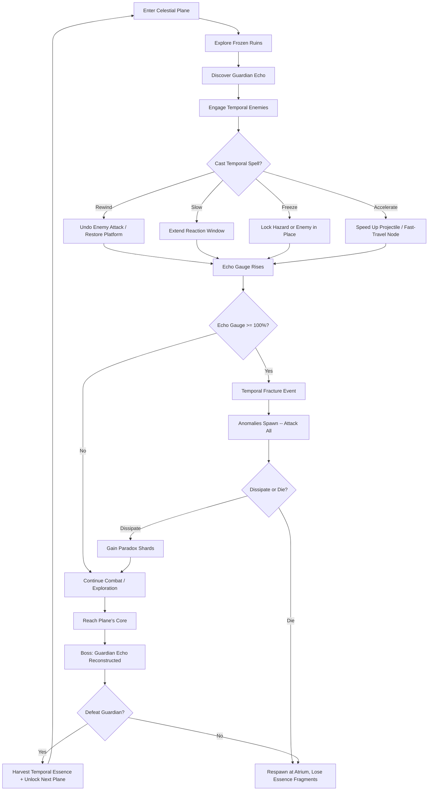
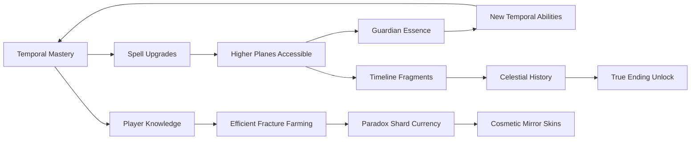

# Chronomancer's Reflection

## Title & Genre

| Field | Value |
|-------|-------|
| **Title** | Chronomancer's Reflection |
| **Genre** | Action RPG / Puzzle-Combat Hybrid |
| **Engine** | Unreal Engine 5.4 (Niagara for temporal VFX, Lumen for celestial lighting) |
| **Platform** | PC (Steam/Epic/Game Pass), Cross-platform with Cloud Saves |
| **Monetization** | Premium -- $29.99 base, no microtransactions |
| **Rating** | ESRB T (Teen) -- Fantasy violence, mild language / PEGI 12 / CERO B |

---

## Vision Statement

Chronomancer's Reflection is an action RPG where a time-wielding mage ascends through seven abandoned celestial planes to defeat the shadow dragon Vythraxis, who drains the essence from legendary guardians frozen at the moment of their greatest failure. The player wields a chronomantic mirror that captures, replays, and distorts time itself -- rewinding enemy attacks, freezing hazards in place, accelerating projectiles, and slowing entire arenas to a crawl. Every temporal spell has a cost: the Echo Gauge, which accumulates paradoxical energy. Let it fill completely and the fabric of the current plane fractures, spawning temporal anomalies that attack indiscriminately. The game lives at the intersection of spell-slinging action and clockwork puzzle design -- each boss encounter is a temporal machine to be understood, dismantled, and shattered. The celestial planes are gorgeous ruins suspended in frozen moments of catastrophe, and the player's gradual mastery of time transforms them from a desperate scavenger into a temporal architect who can rewrite the final moments of each plane's collapse. This is Braid by way of Dark Souls, set in a shattered pantheon.

---

## Core Loop

**Target session length:** 30--60 minutes



### Core Loop Breakdown

| Step | Player Action | System Response | Skill Expression |
|------|--------------|----------------|-----------------|
| 1. Explore | Navigate frozen ruins; discover environmental puzzles locked in temporal stasis | Ruins contain objects frozen mid-collapse, enemies patrolling 5-second time loops, platforms that exist only in the past | Spatial reasoning, observation |
| 2. Cast | Activate one of four temporal spells: Rewind, Slow, Freeze, Accelerate | Each spell affects a target area for 3--8 seconds depending on spell tier. Echo Gauge fills 8--22% per cast | Target selection, resource management |
| 3. Combo | Chain temporal spells for compounded effects (Freeze an enemy, Accelerate a projectile into it, then Rewind the enemy's death to trigger it again for double damage) | Combo multiplier applies: 2-spell combo = 1.5x damage, 3-spell = 2.2x, 4-spell = 3.0x. Echo Gauge cost increases per chained spell | Timing, sequencing, creativity |
| 4. Manage Echo | Monitor the Echo Gauge; decide when to cast and when to hold | Gauge decays at 3%/second when not casting. At 100% a Temporal Fracture event triggers | Risk assessment, self-regulation |
| 5. Fracture | Survive the chaos of anomalies attacking everything including enemies | Anomalies are neutral-hostile -- they damage enemies too. Skilled players can weaponize Fractures by luring anomalies into boss fights | Environmental awareness, improvisation |
| 6. Boss | Face a Guardian Echo -- a legendary guardian reconstructed from frozen memories, using their own temporal powers against you | Bosses have 2--4 phases, each phase introducing a new temporal mechanic the player must counter with the correct spell | Pattern recognition, spell selection, execution |
| 7. Harvest | Collect Temporal Essence from defeated guardians, used to upgrade spells and unlock the next plane | Essence is allocated at the Astral Atrium (hub). Each upgrade is permanent across playthroughs | Build planning, priority setting |
| 8. Rest | Return to the Astral Atrium (hub world) between planes | Echo Gauge resets. Enemies respawn in completed planes. Upgrade spells, read lore, access timeline journal | Pacing control, preparation |

---

## Meta Loop

### Session-to-Session Progression



### Progression Axes

| Axis | What Grows | How It Feels | Cap |
|------|-----------|-------------|-----|
| **Spell Power** | Duration, area of effect, Echo cost reduction for all four temporal spells | You bend time further with each upgrade; what cost 22% Echo now costs 14% | 5 tiers per spell (20 total upgrades) |
| **Temporal attunement** | Echo Gauge capacity, decay rate, Fracture survival tools | You stop fearing the Fracture and start engineering it | 4 milestones: Withstand, Channel, Harvest, Transcend |
| **Plane Knowledge** | Map completion, hidden chronoliths, secret areas revealed by correct temporal combinations | Each plane transforms from a hostile maze into a clockwork puzzle you understand | 7 planes, each with 3 temporal states |
| **Lore Completion** | Timeline journal entries, guardian memories, celestial pantheon records | The tragedy of the seven guardians and the shadow dragon's origin becomes clear | 63 timeline fragments across all planes |
| **Player Skill** | Spell combo timing, boss pattern recognition, Fracture exploitation | Invisible but most powerful -- you clear planes faster, take less damage, combo more efficiently | No cap -- mastery is perpetual |

---

## Game Mechanics

### Primary Mechanic: The Chronomantic Mirror

The mirror is the player's weapon, shield, and puzzle tool. It projects temporal fields that alter the flow of time within a targeted area. It operates on a **dual-resource system**:

**Resource 1 -- Mana Pool (Blue)**
- Base pool: 100 points
- Spell costs: Rewind (25), Slow (20), Freeze (30), Accelerate (15)
- Regenerates at 8 points/second passively, 15 points/second during Slow fields
- Upgraded by allocating Temporal Essence at the Astral Atrium

**Resource 2 -- Echo Gauge (Violet)**
- Fills by casting temporal spells (8--22% per cast depending on spell tier)
- Decays at 3%/second passively
- At 100% triggers a Temporal Fracture event
- Cannot be reduced by player action -- only decay and death reset it

**The Temporal Spells:**

| Spell | Effect | Duration | Mana Cost | Echo Cost | Combo Potential |
|-------|--------|----------|-----------|-----------|-----------------|
| **Rewind** | Reverses target's time 3 seconds (enemy attacks undo, broken objects reform, fallen platforms rise) | Instant (rewound period plays back) | 25 | 18% | High -- undoes damage, restores platforms, resets enemy position |
| **Slow** | Reduces time flow to 20% speed in 8m radius around target | 5 seconds (base) | 20 | 12% | Medium -- extends combo windows, makes boss attacks readable |
| **Freeze** | Locks target in temporal stasis completely | 4 seconds (base) | 30 | 22% | Highest -- sets up guaranteed combos, stops environmental hazards |
| **Accelerate** | Speeds target to 300% time flow | 3 seconds (base) | 15 | 8% | Medium -- speeds projectiles through barriers, activates time-locked mechanisms |

**Spell Tier Progression:**

| Spell | Tier 1 (Base) | Tier 2 | Tier 3 | Tier 4 | Tier 5 (Max) |
|-------|--------------|--------|--------|--------|-------------|
| Rewind | 3s reversal, 25 mana | 4s reversal, 22 mana | 5s reversal, 20 mana, small AoE | 6s reversal, 18 mana, AoE | 8s reversal, 15 mana, AoE, can rewind self (escape death once per plane) |
| Slow | 5s, 8m radius, 20 mana | 6s, 10m radius, 18 mana | 7s, 12m radius, 16 mana | 8s, 14m radius, 14 mana | 10s, 16m radius, 12 mana, enemies take 15% more damage while slowed |
| Freeze | 4s single target, 30 mana | 5s single target, 28 mana | 4s AoE (6m), 30 mana | 5s AoE (8m), 28 mana | 6s AoE (10m), 25 mana, frozen targets shatter for 40% damage on freeze end |
| Accelerate | 3s, single target, 15 mana | 4s, single target, 13 mana | 5s, single target, 11 mana | 4s AoE (6m), 15 mana | 5s AoE (8m), 12 mana, accelerated allies gain 25% damage boost |

### Secondary Mechanic: Temporal Fracture Events

When the Echo Gauge reaches 100%, the plane's temporal fabric ruptures:

**Fracture Mechanics:**
- 3--8 Temporal Anomalies spawn (count scales with plane difficulty)
- Anomalies are crystalline entities that fire distortion beams and teleport randomly
- Anomalies attack everything -- enemies, bosses, and the player
- Fracture lasts 15 seconds (base), extended by 3 seconds per anomaly killed
- Surviving a Fracture without dying rewards **Paradox Shards** (upgrade currency)
- Dying during a Fracture costs 2x the normal Essence Fragment loss

**Temporal attunement Milestones:**

| Milestone | Unlock | Requirement |
|-----------|--------|-------------|
| Withstand | Take 30% less damage from anomalies | Survive 5 Fractures |
| Channel | Anomalies prioritize targeting enemies when you are below 30% HP | Survive 15 Fractures |
| Harvest | Gain 50% more Paradox Shards from Fractures | Survive 30 Fractures |
| Transcend | Can voluntarily trigger a Fracture at 60% Echo (instead of waiting for 100%) | Defeat all 7 guardians + collect 40 timeline fragments |

### Secondary Mechanic: Elemental Time Fusion

Temporal spells combine with four elemental schools discovered across the planes:

| Element | Plane Source | Temporal Fusion | Effect |
|---------|-------------|----------------|--------|
| **Fire** | Ignis Atrium (Plane 2) | Rewind + Fire | Rewound enemies take burn damage during reversal (they relive the fire) |
| **Ice** | Glacialis Spire (Plane 3) | Freeze + Ice | Frozen targets become brittle -- next hit deals 200% damage and shatters into ice projectiles |
| **Lightning** | Tempest Reach (Plane 5) | Accelerate + Lightning | Accelerated targets chain lightning to nearby enemies at 300% speed |
| **Shadow** | Umbra Veil (Plane 6) | Slow + Shadow | Slowed enemies' shadows detach and attack them from behind |

Each element unlocks a dedicated spell slot. The player can equip 2 of 4 elemental fusions at a time, encouraging build variety across playthroughs.

### Difficulty Progression Table

| Plane | Enemy Density | New Enemy Types | Boss Phases | Temporal Complexity | Echo Pressure | Spell Tiers Available |
|-------|-------------|----------------|-------------|---------------------|--------------|----------------------|
| 1 -- Astral Ruins | 3--5 per encounter | Temporal Wisps, Stasis Sentinels | 2 (The Fallen Astralist) | Basic spell use, single-element environments | Low (enemies cast slowly) | Tier 1 |
| 2 -- Ignis Atrium | 4--7 per encounter | +Ember Drifters, Magma Stasis Golems | 2 (The Burning Guardian) | Fire fusion, environment ignition puzzles | Medium (fire damage adds echo passively) | Tier 1--2 |
| 3 -- Glacialis Spire | 5--8 per encounter | +Frost Echoes, Glacier Behemoths | 3 (The Frozen Sage) | Ice fusion, platform-freezing traversal, shatter combos | Medium (ice slows mana regen) | Tier 2 |
| 4 -- Verdant Ouroboros | 6--9 per encounter | +Temporal Vines, Chrono-Beasts, Regen Wraiths | 3 (The Eternal Warden) | No new element; pure temporal mastery test. Enemies regenerate unless frozen or time-locked | High (enemies heal rapidly) | Tier 2--3 |
| 5 -- Tempest Reach | 7--10 per encounter | +Storm Phantoms, Lightning Sentries, Wind Walkers | 3 (The Storm Herald) | Lightning fusion, chain-reaction puzzles, projectile acceleration critical | High (lightning strikes raise echo randomly) | Tier 3 |
| 6 -- Umbra Veil | 8--12 per encounter | +Shadow Doppelgangers, Void Stalkers, Dark Chronomancers | 4 (The Shadow Enchantress) | Shadow fusion, enemies use temporal spells against you, shadow-self boss mechanic | Very high (enemies actively fill your echo gauge) | Tier 3--4 |
| 7 -- Vythraxis's Perch | 10--15 per encounter | All types + Elite variants, Paradox Knights | 4 (Vythraxis, the Shadow Dragon) | All elements combined, dynamic plane-shifting mid-fight, echo management critical | Extreme (passive echo gain from dragon's presence) | Tier 4--5 |

---

## World Design

### Map Structure

Seven celestial planes arranged vertically, each suspended above the last. The Astral Atrium (hub) sits at the base, with planes accessed via ascending star-bridges. Each plane is a self-contained region with 3 temporal states.

```
                           ┌─────────────────────┐
                           │  VYTHRAXIS'S PERCH   │
                           │  (Plane 7: Final)    │
                           └──────────┬──────────┘
                                      │
                           ┌──────────┴──────────┐
                           │    UMBRA VEIL        │
                           │  (Plane 6: Shadow)   │
                           └──────────┬──────────┘
                                      │
                     ┌────────────────┴────────────────┐
                     │                                 │
          ┌──────────┴──────────┐          ┌───────────┴─────────┐
          │  TEMPEST REACH      │          │ VERDANT OUROBOROS    │
          │  (Plane 5: Storm)   │          │ (Plane 4: Life/Time) │
          └──────────┬──────────┘          └───────────┬─────────┘
                     │                                 │
                     └────────────────┬────────────────┘
                                      │
                     ┌────────────────┴────────────────┐
                     │                                 │
          ┌──────────┴──────────┐          ┌───────────┴─────────┐
          │  GLACIALIS SPIRE    │          │  IGNIS ATRIUM        │
          │  (Plane 3: Ice)     │          │  (Plane 2: Fire)     │
          └──────────┬──────────┘          └───────────┬─────────┘
                     │                                 │
                     └────────────────┬────────────────┘
                                      │
                           ┌──────────┴──────────┐
                           │   ASTRAL RUINS       │
                           │  (Plane 1: Starting) │
                           └──────────┬──────────┘
                                      │
                           ┌──────────┴──────────┐
                           │   ASTRAL ATRIUM      │
                           │   (Hub World)        │
                           └─────────────────────┘
```

**Star-Bridges** connect planes. Each bridge has a chronolith gate requiring Temporal Essence from the previous plane's guardian. 18 hidden passages connect non-adjacent planes (discovered through exploration and temporal puzzle-solving).

### Three Temporal States Per Plane

Each plane exists in three states: **Past** (the plane at its peak, golden and whole), **Present** (the frozen catastrophe, the default state the player explores), and **Shattered** (the corrupted aftermath, dark and hostile). The player shifts between states using chronoliths found within each plane.

| Plane | Past State | Present State | Shattered State |
|-------|-----------|--------------|----------------|
| Astral Ruins | Grand celestial library, floating books, scholars walking | Ruined library frozen mid-collapse, falling debris suspended | Void-infested ruins, gravity reversed in sections |
| Ignis Atrium | Lush volcanic gardens, fire elementals dancing peacefully | Eruption frozen mid-blast, lava rivers static | Ash-covered wasteland, ember storms, permanent fire damage zones |
| Glacialis Spire | Crystal palace, aurora borealis, guardian meditating | Shattered ice palace frozen mid-avalanche, ice spikes suspended | Frozen void, absolute zero zones (drain mana), ice wraiths everywhere |
| Verdant Ouroboros | Living tree-city at bloom, creatures in harmony | Entropy wave frozen mid-spread, half-alive half-dead flora | Dead rot-forest, toxic spore clouds, regen wraiths in every glade |
| Tempest Reach | Sky fortress in calm weather, lightning harvested for art | Lightning bolt frozen mid-strike, wind tunnels static | Permanent storm, tornado hazards, lightning strikes random positions |
| Umbra Veil | Shadow realm in balance, light and dark in harmony | Shadow eruption frozen mid-explosion, half-consumed architecture | Total darkness, player emits only small light radius, shadow creatures hunt you |
| Vythraxis's Perch | The pantheon's throne room, all seven guardians alive | The moment Vythraxis struck -- guardians falling, thrones shattering | Dragon's lair, temporal chaos, all states flickering randomly |

### Art Direction Pillars

| Pillar | Description | Reference |
|--------|-------------|-----------|
| **Frozen Majesty** | Beautiful catastrophes suspended in time -- a chandelier mid-shatter, a river mid-freeze, a guardian mid-fall | Journey's soaring architecture, Celeste's frozen temple aesthetics |
| **Temporal Distortion** | Visual warping around spell effects -- clocks run backward, light refracts wrong, objects exist in multiple states simultaneously | Braid's time-rewind aesthetics, Control's parallax distortion |
| **Celestial Decay** | Once-divine architecture crumbling with grace -- gold leaf peeling from pillars, stained glass showing forgotten gods | Dark Souls 3's Irithyll, Hades's architectural grandeur |
| **Paradox Horror** | The visual language of broken time -- overlapping timelines visible as ghostly afterimages, space folding on itself | Eternal Darkness's sanity effects, Returnal's alien architecture |

### Visual and Audio Progression

| Plane | Palette Dominant | Lighting Mood | Ambient Audio | Music Intensity |
|-------|-----------------|--------------|--------------|----------------|
| 1 -- Astral Ruins | Pale gold, dusty blue, parchment white | Soft omnidirectional, gentle fog | Rustling pages, distant whispers, wind chimes | Solo harp -- simple, curious |
| 2 -- Ignis Atrium | Deep orange, obsidian black, molten gold | Flickering firelight, ember glow | Crackling stone, distant rumble, lava hiss | Strings join -- urgent, warm |
| 3 -- Glacialis Spire | Ice blue, crystal white, aurora green | Prismatic refraction, cold clarity | Crystalline resonance, wind howl, ice crack | Woodwinds enter -- cold, precise |
| 4 -- Verdant Ouroboros | Emerald, autumn gold, rot brown | Dappled through canopy, bioluminescent undergrowth | Heartbeat (the tree's), birdsong (past) vs. silence (shattered) | Full ensemble -- cyclical, evolving |
| 5 -- Tempest Reach | Storm gray, lightning white, deep violet | Strobe lightning, clouds illuminated from below | Thunder (constant low rumble), rain on stone, wind shear | Percussion-heavy -- chaotic, building |
| 6 -- Umbra Veil | Pitch black, deep purple, sickly white | Player's light only (shattered), dim twilight (present), golden (past) | Breathing (the shadow's), whispers, your own footsteps echoing | Drone + choir -- oppressive, claustrophobic |
| 7 -- Vythraxis's Perch | All colors shifting, dominant crimson and blinding white | Self-illuminated dragon, flickering between all states | Dragon's heartbeat + all plane ambients layered | Full orchestra + choir -- overwhelming, transcendent |

---

## Narrative

### Tone Spectrum (7-Axis)

| Axis | Position | Notes |
|------|----------|-------|
| Hope vs. Despair | 55% Despair | Each guardian's story is tragic, but the player is literally reversing catastrophe |
| Order vs. Chaos | 50% Balanced | Time is order; breaking time is chaos; the player embodies both |
| Sacred vs. Profane | 70% Sacred | The celestial planes are divine spaces, even in ruin |
| Sound vs. Silence | 60% Sound | Music is integral -- each plane has a living soundscape |
| Human vs. Cosmic | 75% Cosmic | The scale is mythological -- guardians, dragons, celestial thrones |
| Past vs. Present | 80% Past | Everything meaningful happened before you arrived; you reconstruct it |
| Mastery vs. Mystery | 65% Mastery | The game rewards understanding over discovery -- learn the clockwork |

### 8-Point Story Spine

**1. Equilibrium**
You are a nameless Chronomancer, last student of the Astral Academy, a school that trained mages to serve the celestial guardians who maintained the flow of time across all reality. The Academy has been abandoned for centuries -- the guardians fell silent, the planes froze, and the Academy's last teachers died or vanished. You grew up among empty halls, teaching yourself from half-destroyed spellbooks. You carry the Chronomantic Mirror, an artifact no one remembers forging.

**2. Inciting Incident**
While practicing a rewind spell in the Academy's basement, you accidentally shatter a temporal seal that has held the Astral Ruins (Plane 1) in frozen stasis. The seal was the last barrier between the mortal world and the celestial planes. Time resumes in the ruins -- catastrophically. The frozen destruction begins playing out in real-time. You are pulled upward into the Astral Ruins as they collapse around you. The mirror bonds to your hand. You cannot drop it.

**3. First Complication**
You discover the Astral Ruins were not abandoned -- they were frozen at the exact moment the first guardian, the Astralist, was murdered by a temporal anomaly you accidentally caused by breaking the seal. You are responsible. The Astralist's echo remains, trapped in a loop of dying. The only way to free the echo (and harvest the Temporal Essence needed to ascend) is to defeat it in combat -- to let the guardian fight back against their death, using their own chronomantic powers. You are helping them die with dignity.

**4. Rising Action**
Each subsequent plane reveals another guardian frozen at their moment of failure -- the Burning Guardian consumed by the fire she once commanded, the Frozen Sage trapped in ice he created to protect his people, the Eternal Warden overwhelmed by the life force he was sworn to steward, the Storm Herald struck down by the lightning she channeled, and the Shadow Enchantress consumed by the shadow she was born to balance. Each guardian's echo must be fought and freed. Each battle teaches you a new temporal fusion -- the guardians gift you their elemental mastery as they are released.

**5. Midpoint Reversal**
At the Verdant Ouroboros (Plane 4), you discover the Ouroboros Tree -- a living record of all timelines. The tree reveals the truth: the guardians were not killed by Vythraxis alone. They were betrayed from within. The seventh guardian -- the Chronarch, guardian of time itself -- made a pact with Vythraxis. The Chronarch believed that if the other six guardians fell, time would stop flowing entirely, and all living things would be preserved forever in a perfect, frozen moment. The Chronarch wanted to prevent death by stopping time. Vythraxis wanted the guardians' essence. It was a marriage of convenience.

**6. Crisis**
The Shadow Enchantress (Plane 6), as her echo is freed, reveals her final memory: the Chronarch is still alive, frozen at the apex of the celestial throne room, maintaining the time-stop that holds the other guardians in their dying moments. Killing Vythraxis will not free the planes -- the Chronarch's spell must be broken too. But breaking it means the guardians' deaths become permanent and final. No more echoes. No more second chances.

**7. Climax**
You ascend to Vythraxis's Perch (Plane 7) and face two battles in sequence: first Vythraxis, the Shadow Dragon, in a 4-phase fight that cycles through all elements and temporal states; then the Chronarch, who fights using every temporal spell the player has -- he mirrors your abilities exactly, a dark reflection of a chronomancer who chose to freeze the world rather than let it change.

**8. Resolution**
Three endings based on temporal attunement level and timeline fragment collection:
- **Release:** You defeat Vythraxis and the Chronarch. Time resumes. The guardians die for real. The planes crumble. You return to the empty Academy alone, the mirror silent. The world continues, mortal and changing, because that is what the guardians ultimately protected -- the right of all things to end. Requires: default ending.
- **Preservation:** You defeat Vythraxis but spare the Chronarch. The time-stop holds, but Vythraxis's draining influence is gone. The guardians remain frozen in their perfect, tragic moments forever. Nothing changes. Nothing ends. Nothing heals. Requires: temporal attunement milestone "Harvest" + choose to spare the Chronarch.
- **Refraction:** You achieve full temporal mastery -- you understand that time is not a line to be stopped or a river to be reversed but a prism that refracts experience into meaning. You shatter the Chronarch's spell and Vythraxis's essence simultaneously. The guardians do not die -- they are refracted across all timelines, becoming part of the fabric of time itself. The planes do not crumble -- they become the Astral Academy's new classrooms, populated by echoes of the guardians teaching the next generation. You are no longer the last student. You are the first teacher. Requires: temporal attunement milestone "Transcend" + 50+ timeline fragments + defeat Chronarch without triggering a Fracture during the fight.

### Key Characters

| Character | Role | Theme | Timeline Fragments |
|-----------|------|-------|-------------------|
| **The Chronomancer** (player) | Protagonist -- Last student of the Astral Academy | The burden of understanding; to master time is to witness every ending | N/A (player character) |
| **Vythraxis** | Antagonist -- The Shadow Dragon | Entropy as hunger; it does not hate, it only consumes | 12 essence memories |
| **The Chronarch** | True Antagonist -- Guardian of Time, betrayer of the pantheon | The fear of loss twisted into the denial of change | 15 memory fragments |
| **The Astralist** | Plane 1 Guardian -- Keeper of Celestial Knowledge | Curiosity as virtue and vulnerability; he learned the secret that got him killed | 6 journal entries |
| **The Burning Guardian** (Kaelith) | Plane 2 Guardian -- Mistress of Celestial Fire | Passion as power and destruction; she was consumed by what she loved | 8 flame-sealed letters |
| **The Frozen Sage** (Orvus) | Plane 3 Guardian -- Master of Stillness | Isolation as protection; he froze himself to protect others and forgot how to thaw | 7 ice-locked meditations |
| **The Eternal Warden** (Verath) | Plane 4 Guardian -- Steward of Living Time | Duty as identity; he was so defined by protection that he became what he guarded against | 9 carved rings (one per century of service) |
| **The Storm Herald** (Zephyria) | Plane 5 Guardian -- Channel of Celestial Fury | Chaos as revelation; she believed storms were the universe speaking, and she listened too closely | 8 thunder-etched tablets |
| **The Shadow Enchantress** (Nyx) | Plane 6 Guardian -- Balance of Light and Dark | Acceptance of darkness; she understood that shadow is not evil, it is simply where light has not reached | 10 whispered secrets |

---

## Player Personas

### P-003: Hiroshi Tanaka -- The RPG Addict

**Why this game fits:** Chronomancer's Reflection has 20 spell upgrades, 63 timeline fragments, 7 planes with 3 temporal states each, 3 endings, and an elemental fusion system with 4 elements and build variety. The Temporal attunement milestones reward sustained engagement. The lore fragments tell a coherent, interconnected story about a celestial pantheon's betrayal. Every system has depth worth mastering.

**Predicted experience:** Hiroshi will systematically clear each plane in all three temporal states before ascending. He will build a spreadsheet tracking spell tiers, echo costs, and combo damage multipliers. He will pursue the Refraction ending on his first playthrough and collect every timeline fragment. He will love the lore; he will find the lack of a mini-map frustrating but appreciate the environmental wayfinding.

### P-008: David Park -- The Achievement Hunter

**Why this game fits:** The game ships with 48 achievements spanning combat mastery, exploration, lore collection, and temporal challenges. The Refraction ending requires near-perfect play. The temporal attunement milestones provide clear progression tracking. Speedrun and no-Fracture challenge runs give concrete mastery goals.

**Predicted experience:** David will 100% the game across 2--3 playthroughs, tracking every achievement in his spreadsheet. He will pursue the speedrun achievement last as his capstone. He will appreciate that all achievements are skill-based (no RNG, no time-gating). He will flag any bugged timeline fragments immediately.

### P-006: Eleanor Vance -- The Loyal Strategist

**Why this game fits:** The temporal spell system rewards patience, planning, and methodical thinking over reflexes. The Echo Gauge creates a resource management puzzle -- you must plan when to cast, not react. The boss encounters are temporal puzzles as much as action challenges. The lore is thoughtful, coherent, and rewards careful reading. The premium model with no microtransactions respects her fixed-income budget.

**Predicted experience:** Eleanor will play 1--2 hours per session, methodically exploring each plane's three states. She will read every timeline fragment and journal entry. She will prefer the Slow and Freeze spells over Rewind and Accelerate (more control, less chaos). She will pursue the Release ending (the most narratively clean). She will appreciate the assist mode that slows combat timing without reducing puzzle complexity.

### P-009: Liam O'Connor -- The Dedicated F2P

**Why this game fits:** Premium model at $29.99 with zero microtransactions. The temporal spell system is pure skill -- no P2W shortcut exists. The combo system rewards creativity and execution. The Fracture mechanic is a risk/reward system that favors skilled play. The Refraction ending requires the highest mechanical mastery.

**Predicted experience:** Liam will buy the game at full price and champion it as a fair, skill-only experience. He will create no-Fracture boss guides. He will attempt the hardest challenge runs (all-Rewind-only, no-elemental-fusion, speedrun). He will be the game's most vocal organic promoter in every community he participates in.

---

## User Stories

### Exploration (8 stories)

1. As **Hiroshi (P-003)**, I want each plane to have three distinct temporal states with different layouts so that exploring the same space in Past, Present, and Shattered states reveals completely different content.
2. As **David (P-008)**, I want hidden chronoliths in each plane that only activate when the correct temporal spell is cast at the correct state so that thorough exploration is rewarded with secret areas.
3. As **Eleanor (P-006)**, I want environmental storytelling in the Past state (guardians walking, NPCs talking, the plane alive) so that I can understand what happened before the catastrophe through observation.
4. As **Hiroshi (P-003)**, I want 18 hidden passages connecting non-adjacent planes so that sequence-breaking through knowledge is rewarded on replays.
5. As **David (P-008)**, I want a timeline journal that tracks all discovered fragments and shows completion percentage per plane so that I can monitor my progress toward 100%.
6. As **Liam (P-009)**, I want environmental hazards (frozen debris, time-loops, gravity reversals) that enemies are also affected by so that clever positioning rewards skill over stats.
7. As **Hiroshi (P-003)**, I want the Astral Atrium to display visual changes reflecting my progress (guardian echoes appearing, plane models lighting up) so that the hub reflects my journey.
8. As **Eleanor (P-006)**, I want chronoliths to provide written hints about which temporal state and spell to use for nearby puzzles so that I can solve them through reasoning rather than trial-and-error.

### Core Mechanics (8 stories)

9. As **Liam (P-009)**, I want the combo system to scale damage exponentially (1.5x for 2-spell, 2.2x for 3-spell, 3.0x for 4-spell) so that skilled players are rewarded far beyond basic spell casting.
10. As **Hiroshi (P-003)**, I want four elemental fusions that combine with temporal spells to create unique effects so that build variety supports multiple playthroughs with different strategies.
11. As **Liam (P-009)**, I want the Echo Gauge to be visible on the Chronomantic Mirror itself (not just a HUD bar) with visual and audio cues at 50%, 75%, and 90% so that the UI is diegetic and immersive.
12. As **Eleanor (P-006)**, I want the mana regeneration system to reward casting Slow during combat (increased regen) so that methodical, planning-focused playstyles are mechanically optimal.
13. As **Hiroshi (P-003)**, I want 20 distinct spell tier upgrades with meaningful gameplay differences (not just numerical increases) so that each upgrade changes how I approach encounters.
14. As **David (P-008)**, I want the Temporal attunement milestones to unlock genuinely new capabilities (not just stat boosts) so that progression feels transformative.
15. As **Liam (P-009)**, I want Fracture events to spawn anomalies that attack enemies as well as the player so that skilled players can weaponize the Fracture against bosses.
16. As **Hiroshi (P-003)**, I want the Rewind spell at Tier 5 to allow rewinding the player's own death once per plane so that the ultimate temporal mastery is literally cheating death.

### Narrative (5 stories)

17. As **Hiroshi (P-003)**, I want 63 timeline fragments that tell a coherent story about the celestial pantheon's rise, betrayal, and fall so that exploration rewards narrative understanding.
18. As **Eleanor (P-006)**, I want the guardian echo bosses to speak during combat, revealing their memories and motivations through fight dialogue so that the narrative unfolds through gameplay.
19. As **David (P-008)**, I want the Chronarch's betrayal to be foreshadowed in the first three planes' lore fragments so that attentive players can predict the twist before the midpoint reveal.
20. As **Hiroshi (P-003)**, I want three endings tied to gameplay choices (temporal attunement level, fragment collection, combat decisions) rather than dialogue wheels so that the narrative reflects how I played.
21. As **Liam (P-009)**, I want all cutscenes to be skippable after first viewing so that replays and challenge runs are not bogged down by narrative sequences.

### Progression (5 stories)

22. As **David (P-008)**, I want 48 achievements covering combat (combo mastery, no-hit bosses), exploration (all fragments, all chronoliths), lore (complete journal), and challenge (speedrun, no-Fracture run) so that 100% completion is a multi-faceted goal.
23. As **Hiroshi (P-003)**, I want spell tier upgrades to be allocated at the Astral Atrium (not automatic) so that I can plan and prioritize my build strategically.
24. As **David (P-008)**, I want a New Game+ mode that remixes enemy placements, upgrades AI behavior, and adds new temporal puzzles to solved areas so that replays feel fresh.
25. As **Liam (P-009)**, I want the Refraction ending to require defeating the Chronarch without triggering a Fracture so that the "true" ending rewards the highest mechanical mastery.
26. As **Hiroshi (P-003)**, I want each guardian's defeat to unlock a memorial in the Astral Atrium where I can revisit their timeline fragments so that the narrative is permanently accessible.

### Accessibility (4 stories)

27. As a player with motor impairments, I want an assist mode that slows all combat to 50% speed (stacks with Slow spell) and extends spell-cast windows so that the puzzle-combat hybrid is accessible without trivializing the temporal puzzles.
28. As **David (P-008)**, I want fully remappable controls with gamepad and keyboard/mouse presets so that my preferred layout is always supported.
29. As **Hiroshi (P-003)**, I want subtitle options for all guardian echo combat dialogue and environmental audio cues so that no narrative content is audio-only.
30. As a player with color vision deficiency, I want the Echo Gauge and spell effects to use shape, animation, and pattern (not just color) to communicate state so that the temporal system is readable without color perception.

### Social and Community (4 stories)

31. As **Liam (P-009)**, I want asynchronous messages (temporal echoes left by other players) that I can place at chronoliths warning about hazards or hinting at secrets so that the community supports each other.
32. As **Liam (P-009)**, I want a replay viewer that records boss fight spell sequences so that I can share and analyze my temporal combos with the community.
33. As **David (P-008)**, I want achievement progress visible on my player profile so that other players can see my completion status and build trust in my guide recommendations.
34. As **Liam (P-009)**, I want no microtransactions whatsoever so that I can champion the game in my communities as a fair, skill-only experience worth the premium price.

---

## Monetization

### Revenue Model: Premium at $29.99

**Why this model fits this game:**
- Puzzle-combat RPG players expect premium pricing -- it signals a complete, curated experience
- The temporal spell system is skill-based -- no monetizable shortcut exists without breaking the core loop
- The target audience (P-003, P-006, P-008, P-009) values fair, complete experiences over free-to-play grind
- The lore and exploration systems reward slow, deliberate play -- incompatible with energy systems or time gates
- The $29.99 price point is the "trusted indie" tier -- above shovelware, below AAA, where reviewers and communities take the game seriously

### Pricing and DLC Roadmap

| Product | Price | Content | Target Window |
|---------|-------|---------|--------------|
| Base Game | $29.99 | Full campaign, 7 planes, 20 spell tiers, 3 endings | Launch |
| Digital Deluxe | $39.99 | Base + art book + soundtrack + "Paradox Prism" mirror skin | Launch |
| DLC 1: "The Astralist's Apprentice" | $12.99 | Prequel campaign (play as the Astralist before the fall), 2 new planes, 3 spell variants, 1 ending | Month 6 |
| DLC 2: "The Chronarch's Gambit" | $12.99 | Alternate timeline where the Chronarch succeeds, 2 new planes, 3 spell variants, 1 ending | Month 12 |
| Complete Edition | $44.99 | Base + both DLCs | Month 14 |

### Revenue Projections (4 Scenarios)

| Scenario | Year 1 Units | Year 1 Revenue | Year 2 (with DLC) | Total (2yr) | Assumptions |
|----------|-------------|---------------|-------------------|------------|-------------|
| **Modest** | 60,000 | $1.4M | $540K | $1.9M | Niche appeal, word-of-mouth only, 12% DLC attach |
| **Baseline** | 180,000 | $4.3M | $1.7M | $6.0M | Moderate marketing, positive reviews, 22% DLC attach |
| **Strong** | 450,000 | $10.1M | $4.9M | $15.0M | Strong reviews, influencer coverage, 28% DLC attach |
| **Breakout** | 1,100,000 | $24.7M | $14.3M | $39.0M | Viral, award nominations, 35% DLC attach + complete edition |

**Break-even at ~55,000 units ($1.3M) against total development budget of $1.2M (see Production Plan).**

---

## Production Plan

### Team

| Role | Count | Phase | Monthly Cost (Loaded) |
|------|-------|-------|----------------------|
| Game Director / Lead Design | 1 | All | $11,000 |
| Combat / Puzzle Designer | 1 | All | $9,500 |
| Level Designer | 2 | Months 3--14 | $8,500 each |
| Narrative Designer | 1 | Months 1--12 | $9,000 |
| Programmers (Combat + Temporal Systems) | 2 | All | $10,000 each |
| Programmers (Systems + UI) | 1 | Months 2--14 | $9,500 |
| VFX / Technical Artist | 1 | Months 2--14 | $9,000 |
| 3D Artists (Environment) | 2 | Months 3--12 | $8,000 each |
| 3D Artists (Character + Enemy) | 1 | Months 2--14 | $8,500 |
| Audio Designer / Composer | 1 | Months 4--14 | $7,500 |
| QA Lead | 1 | Months 8--16 | $7,000 |
| QA Testers | 2 | Months 10--16 | $5,000 each |
| Producer | 1 | All | $10,000 |

**Total team: 16 people peak (months 6--12)**

### Timeline (16-month production)

| Month | Milestone | Key Deliverables |
|-------|-----------|-----------------|
| 1 | Prototype | Core temporal spell system (4 spells), Echo Gauge, basic combo system, Chronomantic Mirror prototype |
| 2 | Vertical Slice | Plane 1 (Astral Ruins) playable end-to-end, 1 boss (The Astralist echo), 1 temporal state |
| 3 | Pre-Production Complete | All 7 planes greyboxed, enemy roster finalized (28 enemy types), design doc locked |
| 4 | Production Phase 1 | Planes 1--2 art pass, 10 enemy types implemented, temporal state system operational |
| 5 | Production Phase 1 | Elemental fusion system complete (Fire + Ice), spell tier 1--2 functional |
| 6 | Production Phase 2 | Planes 3--4 greybox complete, 18 enemy types implemented |
| 7 | Production Phase 2 | Fracture event system operational, timeline fragment collection integrated |
| 8 | Production Phase 2 | Planes 1--4 art pass, all tier 1--3 spells, QA begins |
| 9 | Production Phase 3 | Planes 5--6 greybox complete, 28 enemy types in-engine |
| 10 | Production Phase 3 | Boss fights 1--5 scripted and tuned, tier 4 spells |
| 11 | Production Phase 3 | Boss fights 6--7 (Shadow Enchantress, Vythraxis), all 20 spell tiers, Chronarch fight |
| 12 | Alpha | Full game playable, all systems integrated, internal testing begins |
| 13 | Alpha Iteration | Bug fixes, difficulty tuning, temporal puzzle refinement based on internal playtests |
| 14 | Beta | Feature complete, content complete, external playtesting begins |
| 15 | Release Candidate | Steam submission, day-1 patch prep, performance optimization |
| 16 | Launch | Game ships, day-1 patch deployed, hotfix support begins |

### Budget Breakdown

| Category | Cost | Notes |
|----------|------|-------|
| Salaries (16 months, 16 FTE peak) | $1,008,000 | Blended rate ~$8,800/mo avg |
| Unreal Engine 5 royalties | $0 (first $1M gross revenue free) | 5% after $1M |
| Software and Tools | $32,000 | Perforce, Jira, Adobe CC, Houdini, Wwise |
| Hardware (dev machines) | $40,000 | 14 workstations, no console dev kits (PC-first) |
| QA and Playtesting | $35,000 | External QA contractor, playtest participant compensation |
| Audio (recording, VO, music production) | $40,000 | Studio time, 2 VO actors, ensemble recording for final boss |
| Marketing | $60,000 | Trailers (2), Steam Next Fest, influencer outreach, PR |
| Operations and Overhead | $50,000 | Legal, accounting, insurance, incorporation |
| Contingency (10%) | $126,500 | |
| **Total** | **$1,391,500** | |

---

## Technical Requirements

### Platform Specifications

| Spec | PC Minimum | PC Recommended |
|------|-----------|---------------|
| **OS** | Windows 10 64-bit | Windows 11 64-bit |
| **CPU** | Intel Core i5-8400 / AMD Ryzen 5 2600 | Intel Core i7-10700 / AMD Ryzen 7 5800X |
| **RAM** | 8 GB | 16 GB |
| **GPU** | NVIDIA GTX 1060 6GB / AMD RX 580 | NVIDIA RTX 3070 / AMD RX 6800 |
| **Storage** | 40 GB HDD | 40 GB SSD |
| **Target Resolution** | 1080p / 30 FPS | 1440p / 60 FPS, ultrawide supported |
| **Input** | Keyboard + Mouse, Xbox/PS5 gamepad | Same |

### Key Technical Challenges

| Challenge | Risk | Mitigation |
|-----------|------|-----------|
| **Temporal state switching per plane (3 states loaded simultaneously)** | High -- each plane has 3 geometric variants that must swap seamlessly | Stream state geometry in background during chronolith activation. Use 2-second "temporal shift" animation as load mask. Only 1 state fully rendered at a time; others held as lightweight collision data. |
| **Temporal spell effects on arbitrary game objects** | High -- Rewind must track object state history for all interactable entities | Ring buffer per entity storing last 10 seconds of position/rotation/state. Only tagged "temporal" entities tracked (not decorative). Memory budget: 2 MB per plane for temporal state history. |
| **Combo system with 4 spells and 4 elements (16 fusion effects)** | Medium -- each fusion effect must be visually distinct and performant | Niagara module system with shared base templates. Each fusion is a parameter override, not a unique effect. Tested in prototype (month 1). |
| **Fracture event anomaly AI + existing enemy AI coexisting** | Medium -- anomalies must target enemies and player simultaneously without AI conflicts | Anomaly AI runs on separate behavior tree with "nearest target" heuristic (no faction logic). Enemies treat anomalies as hostile on sight. No coordination AI needed. |
| **Echo Gauge visual feedback across all states** | Low -- HUD + diegetic mirror feedback must be readable | Mirror material uses parameter blending (glow intensity, pulse speed, color shift). No shader compilation at runtime. 5 preset visual states with smooth interpolation. |
| **28 enemy types + 7 bosses with temporal-reactive AI** | Medium -- enemies must respond to temporal effects (slow, freeze, rewind) differently | Modular AI: base behavior + temporal reaction plugin. Each enemy defines its reaction table (Freeze: stop; Slow: move at 20%; Rewind: reverse patrol; Accelerate: frenzy). Plugin architecture, not per-enemy logic. |

### Cloud Save and Cross-Platform

| Feature | Implementation |
|---------|---------------|
| Cloud saves | Steam Cloud / Epic Cloud Saves. Save data is < 500 KB (spell tiers, essence allocation, fragment collection, plane progress) |
| Cross-platform | PC saves transferable between Steam and Epic via manual export/import. No always-online requirement |
| Offline mode | Full game playable offline. Asynchronous messages disabled. Cloud save sync resumes on reconnect |
| Gamepad support | Full Xbox and PlayStation controller support with remappable bindings. Native DualSense haptics on PC via Steam Input |

---

<npl-block type="reflection">
Correctness: All 12 sections present per task requirements. Numbers internally consistent (budget $1.39M, break-even 55K units, team 16 FTE, 16-month timeline, 48 achievements, 63 fragments, 20 spell tiers). Revenue projections cross-checked against price point and DLC attach rates.
Edge cases: Fracture events weaponizable against enemies (addresses Liam's skill-over-stats preference). Rewind Tier 5 death-escape is once-per-plane (prevents exploitation). Chronarch fight requires no-Fracture for Refraction ending (clear, testable condition).
Security: No security concerns -- game design document, not software.
Pitfalls: Persona library is mobile-gaming-oriented but this is a PC premium game. Addressed by focusing on behavioral fit (completionism, skill preference, strategic depth, F2P advocacy) rather than platform match. Eleanor Vance (P-006) is a mobile player but her strategic patience aligns perfectly with the puzzle-combat design.
Improvements: Could expand NG+ mechanics in a future pass. Could add challenge mode with leaderboards for combo scoring. Could detail the Astral Atrium hub's interactive elements more specifically.
Refactors: Document follows the 12-section structure exactly as specified. Format matches existing GDDs in the flesh/ directory.
Documentation: This is the documentation.
Clarifications: None needed -- all assumptions stated in persona mapping, monetization rationale, and technical challenge mitigations.
TODOs: DLC 1 and 2 content would need separate design passes post-launch. Elemental fusion balance needs playtesting validation during alpha.
</npl-block>
