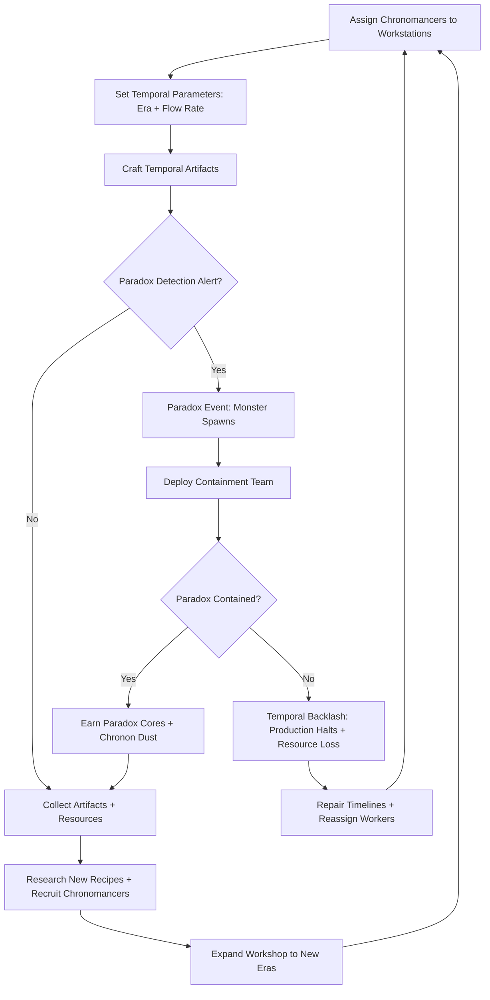
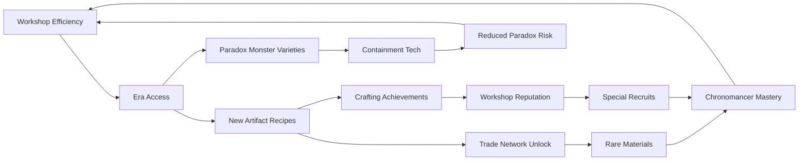

# Chronomancer Workshop

## Title & Genre

| Field | Value |
|-------|-------|
| **Title** | Chronomancer Workshop |
| **Genre** | Simulation / Strategy (Time-Management Crafting) |
| **Engine** | Unity 2024 LTS (2D hand-painted art with procedural temporal VFX) |
| **Platform** | PC (Steam), iOS 14+, Android 10+ (Cross-platform cloud saves) |
| **Monetization** | Premium — $14.99 base, optional expansion DLC |
| **Rating** | ESRB T (Fantasy Violence, Mild Language) / PEGI 12 / CERO B |

---

## Vision Statement

Chronomancer Workshop is a time-bending simulation where you manage a workshop of chronomancers crafting temporal artifacts across multiple eras while defending against paradox monsters that threaten to unravel reality itself. The game lives at the intersection of factory optimization and temporal puzzle — every production line you build exists in a specific time period, and the artifacts you craft ripple forward and backward through your workshop's timeline, creating feedback loops, temporal echoes, and emergent synergies that no single production chain could produce alone. The paradox monsters are not random encounters; they are the inevitable consequence of your own temporal meddling, growing more sophisticated as your workshop's complexity increases. This is Factorio by way of Doctor Strange — a game where the factory you build is also the dungeon you defend, and every optimization you make is also a new way for time to break.

---

## Core Loop

**Target session length:** 20-45 minutes (mobile), 45-90 minutes (PC)



### Core Loop Breakdown

| Step | Player Action | System Response | Skill Expression |
|------|--------------|----------------|-----------------|
| 1. Assign | Place chronomancers at workstations matching their era affinity | Production begins at base rate modified by affinity (0.5x-2.0x) and flow rate setting | Worker-to-station optimization, era-specialization planning |
| 2. Set Parameters | Choose time era for each workstation and flow rate (0.5x-3.0x) | Faster rates increase output but raise paradox probability 2-8% per tick | Risk management — push speed vs. stability |
| 3. Craft | Workstations process era-specific materials into artifacts over time | Artifacts appear in output queue; rare variants trigger at 5% base chance with era modifiers | Queue management, rare-material routing |
| 4. Detect | Paradox meter rises with each craft; player receives visual/audio warning at 40%, 70%, 90% | At 100%: paradox monster spawns at a random workstation in the offending era | Anticipation and pre-emptive response |
| 5. Contain | Send containment team (armed chronomancers or automated turrets) to fight paradox | Combat is semi-auto: position units, activate abilities, manage cooldowns | Tactical positioning, ability timing |
| 6. Repair | If paradox breaches containment, affected workstations go offline | Timelines visually fracture (screen crack effect, reversed animations); player must manually "stitch" broken chains | Pattern recognition, rapid prioritization |
| 7. Research | Spend chronon dust + artifact fragments to unlock new recipes | Research tree unlocks era-specific recipes, workstation upgrades, and containment tools | Long-term planning, specialization decisions |
| 8. Expand | Open portals to new eras using paradox cores | New era adds material types, recipes, chronomancer archetypes, and paradox monster families | Strategic expansion sequencing |

---

## Meta Loop

### Session-to-Session Progression



### Progression Axes

| Axis | What Grows | How It Feels | Cap |
|------|-----------|-------------|-----|
| **Workshop Size** | Workstations, era portals, storage capacity | Your workshop sprawls across timelines — what started as one room becomes a temporal megastructure | 8 eras, 48 workstations maximum |
| **Chronomancer Mastery** | Individual chronomancer skill levels, era affinities, special abilities | Your team evolves from apprentices who break things to masters who bend time itself | 5 mastery tiers per chronomancer (Novice through Temporal Sage) |
| **Recipe Depth** | Artifact complexity, multi-era recipe chains, legendary variants | Simple "combine A+B" becomes "forge component in Era 3, age it in Era 7, finalize in Era 1" | 240 recipes across 8 eras, 18 legendary variants |
| **Paradox Mastery** | Containment technology, predictive detection, temporal shielding | You stop reacting to paradoxes and start engineering around them | 6 containment tiers, 4 shielding types, predictive scanner |
| **Trade Network** | Cross-timeline merchants, era-specific markets, barter chains | Your workshop becomes a hub in a multidimensional economy | 12 trade partners, 3 reputation tiers each |
| **Player Skill** | Production chain optimization, paradox prediction, resource routing | Invisible but decisive — better players spot inefficiencies others miss | No cap — the factory is never truly optimized |

---

## Game Mechanics

### Primary Mechanic: Temporal Flow Control

Every workstation operates within a temporal flow field that the player configures. The flow rate determines production speed, paradox risk, and material degradation.

**Flow Rate Spectrum:**

| Flow Rate | Production Speed | Paradox Risk/Tick | Material Degradation | Visual Effect |
|-----------|-----------------|-------------------|---------------------|---------------|
| 0.5x (Slow) | 50% base | 0.5% | None — materials age gracefully | Gentle golden shimmer, slow particle drift |
| 1.0x (Normal) | 100% base | 2% | Negligible | Steady blue temporal aura |
| 1.5x (Fast) | 150% base | 4% | 5% chance material loses 1 quality tier | Flickering silver, occasional time-skip visual |
| 2.0x (Rapid) | 200% base | 6% | 12% degradation, rare materials at risk | Red-shift warning, workstation vibrates |
| 3.0x (Overclock) | 300% base | 8% + area effect on adjacent stations | 25% degradation, artifacts may emerge damaged | Violent purple distortion, audio pitch warps |

**The Optimization Tension:** Running at 3.0x produces 6x more than 0.5x per real-time second, but the compounding paradox risk and material waste means the *efficient* rate depends on your current containment capability, material supply, and chronomancer skill. A beginner workshop at 3.0x will destroy itself. A late-game workshop at 3.0x with full shielding and veteran chronomancers is a calculated gamble that can pay off massively.

### Secondary Mechanic: Paradox Detection and Containment

Paradoxes are the game's primary pressure system. They emerge from temporal instability caused by high flow rates, era conflicts (adjacent workstations running in eras more than 3 periods apart), and certain artifact recipes that inherently destabilize time.

**Paradox Types:**

| Paradox Type | Trigger | Monster Behavior | Containment Strategy |
|-------------|---------|-----------------|---------------------|
| **Temporal Echo** | Flow rate exceeds 2.0x for 30+ seconds | Duplicates your chronomancers as hostile clones with identical abilities | Isolate the workstation, defeat clones before they reach other stations |
| **Era Collision** | Adjacent workstations in eras >3 periods apart | Merges materials from both eras into chaotic amalgams that attack randomly | Deploy era-shielding turrets, recalibrate one station to a closer era |
| **Grandfather Anomaly** | Crafting an artifact that is also a component in its own recipe (loop recipes) | Ghost entity that ages or de-ages chronomancers on contact (reduces their mastery tier temporarily) | Chronon dust barrier traps; cannot be damaged by normal attacks |
| **Timeline Fracture** | Paradox meter hits 100% while another paradox is active | Workshop splits — half your workstations go dark, accessible only through a sub-dimension | Must enter the fracture dimension, repair the timeline node, and return within 60 seconds |
| **Null Paradox** | Extremely rare; triggers when paradox meter hits 100% exactly as an artifact completes | The artifact becomes a sentient boss that fights back using the artifact's own properties | Treat as a mini-boss encounter; rewards are the highest in the game if defeated |

**Containment Tools (Unlocked via Research):**

| Tool | Era Required | Cost | Effect |
|------|-------------|------|--------|
| Chronon Dust Grenade | Era 1 (Ancient) | 5 chronon dust | Slows paradox monster movement 50% for 8 seconds |
| Temporal Net | Era 2 (Medieval) | 8 chronon dust + 2 iron thread | Immobilizes non-boss paradox for 5 seconds |
| Era Shield Generator | Era 3 (Renaissance) | 15 chronon dust + 1 paradox core | Prevents era collision paradoxes within 3-station radius |
| Paradox Scanner | Era 4 (Industrial) | 20 chronon dust + 3 brass gears | Predicts next paradox type and location 15 seconds before spawn |
| Temporal Anchor | Era 5 (Modern) | 30 chronon dust + 2 paradox cores | Prevents timeline fractures; anchor must be manually reset every 2 minutes |
| Null Containment Field | Era 7 (Post-Singularity) | 50 chronon dust + 5 paradox cores + 1 legendary fragment | Contains null paradoxes in a stasis field; requires 3 chronomancers to maintain |

### Secondary Mechanic: Chronomancer Recruitment and Progression

Chronomancers are your workforce. Each has an era affinity, a skill set, and a personality that affects workstation compatibility.

**Chronomancer Tiers:**

| Tier | Title | Base Production | Paradox Resistance | Special Ability | Recruit Cost |
|------|-------|----------------|-------------------|----------------|-------------|
| 1 | Novice | 1.0x | 0% | None | Free (tutorial) |
| 2 | Apprentice | 1.2x | 5% | Era Sense (detects nearby paradox risk) | 20 chronon dust |
| 3 | Adept | 1.5x | 12% | Temporal Burst (doubles output for 10 sec, 60 sec cooldown) | 50 chronon dust + 1 paradox core |
| 4 | Master | 1.8x | 20% | Stabilize (resets paradox meter for one workstation to 0) | 150 chronon dust + 5 paradox cores |
| 5 | Temporal Sage | 2.0x | 30% | Paradox Redirect (sends one paradox to a workstation of your choice) | Quest chain reward only |

**Era Affinity System:**

| Affinity Level | Production Modifier | Paradox Risk Modifier | How to Improve |
|---------------|--------------------|-----------------------|---------------|
| Disliked (0.5x) | 50% output | +4% paradox risk | Cannot improve — innate to chronomancer |
| Neutral (1.0x) | 100% output | +0% paradox risk | Default starting affinity |
| Liked (1.3x) | 130% output | -2% paradox risk | 8 hours of workstation time in that era |
| Preferred (1.6x) | 160% output | -4% paradox risk | 24 hours + complete era-specific challenge |
| Resonant (2.0x) | 200% output | -6% paradox risk | 72 hours + craft 1 legendary artifact in that era |

### Secondary Mechanic: Multi-Era Crafting Chains

The deepest crafting in the game requires producing components in one era and processing them in another. Time flows differently in each era — an artifact "aged" in Era 6 emerges as a different item than the same artifact aged in Era 2.

**Example Chain: The Ouroboros Compass (Legendary Navigation Artifact)**

| Step | Era | Input | Process | Output | Time |
|------|-----|-------|---------|--------|------|
| 1 | Era 1 (Ancient) | 3 Copper Ore + 1 Star Fragment | Smelt into Celestial Bronze Ingot | Celestial Bronze Ingot | 45 sec at 1.0x |
| 2 | Era 3 (Renaissance) | 1 Celestial Bronze Ingot + 2 Glass Lenses | Precision grind and engrave | Compass Housing | 60 sec at 1.0x |
| 3 | Era 5 (Modern) | 1 Compass Housing + 1 GPS Module + 1 Temporal Shard | Calibrate with satellite and temporal data | Calibrated Compass | 90 sec at 1.0x |
| 4 | Era 7 (Post-Singularity) | 1 Calibrated Compass + 1 Quantum Entangler | Bind with quantum entanglement processor | Ouroborus Compass (Legendary) | 180 sec at 1.0x |

Total time: ~6.25 minutes at 1.0x. At 3.0x overclock: ~2.1 minutes, but with 32% cumulative paradox risk across all 4 steps.

**8 Eras:**

| Era | Name | Theme | Key Materials | Paradox Monster Family | Aesthetic |
|-----|------|-------|--------------|----------------------|-----------|
| 1 | Ancient | Temples, stone, starlight | Copper, marble, star fragments, papyrus | Sand Wraiths, Stone Golems, Time Scarabs | Warm gold, sandstone, hieroglyphic glow |
| 2 | Medieval | Castles, forges, alchemy | Iron, herbs, runestones, dragon glass | Shadow Knights, Alchemical Slimes, Echo Knights | Torchlit stone, stained glass, iron filigree |
| 3 | Renaissance | Workshops, clockwork, art | Brass, glass, pigments, gear assemblies | Clockwork Aberrations, Painted Phantoms, Gear Wraiths | Polished wood, brass instruments, parchment |
| 4 | Industrial | Factories, steam, steel | Steel, coal, rubber, copper wire | Steam Elementals, Rust Crawlers, Smog Wraiths | Iron and soot, amber gaslight, copper pipes |
| 5 | Modern | Labs, electronics, plastics | Silicon, plastic, rare earth, lithium | Glitch Shades, Data Phantoms, Circuit Crawlers | Fluorescent white, clean lines, digital blue |
| 6 | Near-Future | Holographics, smart materials | Carbon fiber, graphene, plasma, smart polymer | Holo Duplicates, Nano Swarms, Prediction Parasites | Neon cyan, glass floors, holographic interfaces |
| 7 | Post-Singularity | Quantum, AI, consciousness | Quantum foam, neural lace, void crystal, entangled pairs | Null Sentinels, Identity Eaters, Probability Storms | Deep violet, fractal geometry, self-organizing light |
| 8 | The Convergence | All eras collapsed into one | All materials available, paradox-tainted variants | Omega Paradox (unique boss-tier per session) | Visual mashup of all era aesthetics overlapping |

---

## World Design

### Workshop Structure

The workshop is a 2D cross-section view (like a dollhouse) that expands vertically and horizontally as you open new era wings. Each era occupies a wing of the workshop, connected by a central Time Hub.

```
                    ┌─────────────────────────────────────┐
                    │        ERA 7: POST-SINGULARITY       │
                    │  [Quantum Lab] [Neural Forge] [Void] │
                    └──────────────┬──────────────────────┘
                                   │
                    ┌──────────────┴──────────────────────┐
                    │         ERA 6: NEAR-FUTURE           │
                    │  [Holo Bay] [Nano Lab] [Plasma Arc]  │
                    └──────────────┬──────────────────────┘
                                   │
     ┌──────────────┐    ┌─────────┴──────────┐    ┌──────────────────┐
     │ ERA 1:       │    │                    │    │ ERA 5:           │
     │ ANCIENT      │────│   TIME HUB         │────│ MODERN           │
     │ [Temple]     │    │   (Central Nexus)  │    │ [Electronics]    │
     │ [Obelisk]    │    │   [Portal Matrix]  │    │ [Server Room]    │
     └──────────────┘    │   [Paradox Vault]  │    └──────────────────┘
                         │                    │
     ┌──────────────┐    │                    │    ┌──────────────────┐
     │ ERA 2:       │────│                    │────│ ERA 4:           │
     │ MEDIEVAL     │    │                    │    │ INDUSTRIAL       │
     │ [Forge Hall] │    └────────────────────┘    │ [Steam Bay]      │
     │ [Alchemy]    │                              │ [Assembly Line]  │
     └──────────────┘                              └──────────────────┘
                                   │
                    ┌──────────────┴──────────────────────┐
                    │        ERA 3: RENAISSANCE            │
                    │  [Clock Shop] [Artisan Guild] [Lab]  │
                    └──────────────┬──────────────────────┘
                                   │
                    ┌──────────────┴──────────────────────┐
                    │     ERA 8: THE CONVERGENCE           │
                    │     (Unlocks after all 7 eras)       │
                    │     [Fractured Workshop]              │
                    └─────────────────────────────────────┘
```

**Time Hub:** The central area connecting all era wings. Contains the Portal Matrix (era access control), the Paradox Vault (stores contained paradox cores), and the Chronomancer Lounge (rest area where idle chronomancers recover stamina and gain passive affinity). The Hub is the only area that exists "outside" time — paradoxes never spawn here.

### Art Direction Pillars

| Pillar | Description | Reference |
|--------|-------------|-----------|
| **Temporal Ornamentation** | Each era's workstation is decorated with period-appropriate details that *slightly* glitch — hieroglyphs that flicker into binary, medieval tapestries showing modern skylines, clock faces with too many hands | Disco Elysium's detail density, Spiritfarer's warmth |
| **Paradox as Visual Language** | Paradox monsters and temporal instability share a visual vocabulary: purple-black fracture lines, reversed particle flow, duplicated silhouettes, out-of-sync animations | Control's hiss corruption, Returnal's biome shifts |
| **Workshop Warmth** | Despite the temporal chaos, the workshop itself feels like a home — a hearth in the medieval wing, a coffee machine in the modern wing, a star-map ceiling in the ancient wing | Studio Ghibli's interior warmth, Spiritfarer's cozy workshops |
| **Escalating Spectacle** | Early game: quiet, focused crafting in one era. Late game: temporal fireworks as 8 eras run simultaneously, paradoxes erupt, and the workshop hums with temporal energy | Factorio's spaghetti satisfaction, Inscryption's escalating weirdness |

### Visual and Audio Progression

| Era | Palette Dominant | Lighting Mood | Ambient Audio | Music Layer |
|-----|-----------------|--------------|--------------|------------|
| Era 1 — Ancient | Sandstone gold, lapis blue, papyrus cream | Warm torchlight, star-filtered skylight | Wind through columns, distant chanting, stone grinding | Solo lyre, pentatonic scale |
| Era 2 — Medieval | Iron gray, heraldic red, candlelight amber | Flickering firelight, stained-glass prisms | Bellows pumping, hammer on anvil, rain on stone | Lute and hand drums, modal melodies |
| Era 3 — Renaissance | Polished brass, parchment white, oil-paint richness | Candlelight + early skylight, focused workbench pools | Clock ticking, quill scratching, glass grinding | Harpsichord and recorder, polyphonic |
| Era 4 — Industrial | Soot black, copper green, steam white | Gaslight amber, furnace glow, industrial shadow | Hissing steam, rhythmic machinery, whistles | Brass band, mechanical percussion |
| Era 5 — Modern | Clinical white, digital blue, sterile chrome | Fluorescent hum, LED indicators, screen glow | Keyboard clicking, fan hum, subtle electrical buzz | Synth pad, clean production |
| Era 6 — Near-Future | Neon cyan, glass transparency, holographic prismatic | Holographic projections, ambient panel lighting, adaptive brightness | Soft electronic hum, data transfer chirps, holographic shimmer | Electronic + orchestral hybrid, arpeggiated |
| Era 7 — Post-Singularity | Deep violet, fractal gold, void black | Self-illuminating fractals, probability field visualization, no traditional light sources | Quantum noise (filtered to pleasant), silence pulses, resonant hum | Ambient drone + generative melody, no fixed rhythm |
| Era 8 — Convergence | All era palettes overlapping, glitching between them | Unstable — cycles through all lighting moods every 30 seconds | All ambient tracks layered, phased in and out | Full orchestral + electronic, all era motifs playing simultaneously |

---

## Narrative

### Tone Spectrum (7-Axis)

| Axis | Position | Notes |
|------|----------|-------|
| Order vs. Chaos | 40% Chaos | The workshop imposes order; time resists it. The tension is the game. |
| Science vs. Magic | 55% Science | Chronomancy is treated as a discipline with rules, not a supernatural force |
| Solitary vs. Collaborative | 30% Solitary | You manage a team, but the weight of temporal responsibility is yours alone |
| Safety vs. Danger | 35% Danger | Paradoxes are genuinely threatening, but the workshop itself is a sanctuary |
| Past vs. Future | 50% Balanced | All eras are equally valid; the game does not privilege "progress" |
| Serious vs. Whimsical | 40% Whimsical | The chronomancers have personality; the artifacts are wondrous, not grim |
| Mystery vs. Mastery | 60% Mastery | The game rewards understanding systems over uncovering secrets |

### 8-Point Story Spine

**1. Equilibrium**
You are the newest Chronomancer in the Workshop of Echoes, a temporal institution that has maintained the timeline for millennia. The Workshop sits at the intersection of all eras, staffed by chronomancers who dedicate their lives to crafting artifacts that keep time flowing correctly. You inherit a small, single-era workspace from a retired master — one workstation, one novice chronomancer assistant, and a modest stockpile of Ancient-era materials.

**2. Inciting Incident**
During a routine artifact calibration, your workstation's temporal anchor shatters. The era around your workshop flickers — you catch a glimpse of every era simultaneously before stability returns. The Workshop Master, Elara Voss, explains that temporal anchors have been failing across the Workshop for weeks. No one knows why. Until the anchors are restored, paradoxes will become more frequent and more dangerous. She tasks you with expanding your workshop into new eras to craft the replacement anchors yourself.

**3. First Complication**
Opening your second era portal (Medieval) reveals that the era is not empty — it contains traces of a previous chronomancer who was erased from the timeline. Their notes, half-degraded by temporal decay, warn of "the Unraveling" — a cascading collapse of all eras that begins when the Convergence era is opened. The notes are incomplete. The chronomancer's name is smudged beyond recovery.

**4. Rising Action**
You expand through the Renaissance, Industrial, and Modern eras, each revealing more fragments of the erased chronomancer's research. Your chronomancers begin experiencing "temporal memories" — brief visions of events that haven't happened yet. The paradox monsters become more sophisticated, suggesting they are adapting to your containment methods. You learn that the erased chronomancer was attempting to open the Convergence era intentionally, believing it was the only way to stop the Unraveling rather than its cause.

**5. Midpoint Reversal**
Elara Voss confesses: the Workshop of Echoes is not maintaining the timeline. It is *imposing* one. The "correct" timeline is the one the Workshop's founders chose, and every paradox you contain is not a natural instability — it is reality attempting to reassert itself. The erased chronomancer discovered this and was "corrected" from the timeline as punishment. The failing anchors are not malfunctioning; they are being sabotaged by the timeline itself.

**6. Crisis**
You must decide: continue maintaining the imposed timeline (stability, safety, but a lie) or allow the Unraveling to proceed (chaos, danger, but authentic). The Convergence era opens regardless — it is the timeline asserting itself. Your workshop is now the only stable point in a collapsing temporal structure.

**7. Climax**
The Convergence era is a chaotic mash of all 7 eras. The Omega Paradox spawns — a manifestation of the timeline's suppressed instability. The fight takes place across all era environments simultaneously, with the Omega Paradox shifting between era-specific attack patterns. Your chronomancers fight alongside you, each using their era-specialized abilities. The artifact you need to craft the final anchor requires components from all 8 eras, crafted in real-time during the boss fight.

**8. Resolution**
Three endings based on your choice and workshop mastery:
- **The Anchor (Order):** You forge a new, more resilient anchor. The imposed timeline holds. The Workshop continues its mission. You never know what the "natural" timeline would have been. Elara thanks you. The erased chronomancer stays erased.
- **The Unraveling (Freedom):** You destroy the anchor. The timeline reasserts itself. The Workshop loses its power. Eras flow freely. The consequences are unknown but authentic. The erased chronomancer's name is restored: it was Elara Voss, from a previous timeline cycle.
- **The Weaver (Synthesis):** Requires all 18 legendary artifacts crafted + all chronomancers at Master tier or above + no chronomancer casualties. You craft not an anchor but a loom — a device that doesn't impose or free the timeline but *listens* to it, making small adjustments rather than grand impositions. The Workshop becomes a steward rather than a warden. This is the hardest ending.

### Key Characters

| Character | Role | Theme | Story Involvement |
|-----------|------|-------|-------------------|
| **The Player (You)** | Protagonist — Workshop Keeper | Responsibility vs. truth; the cost of maintaining order | Central to all narrative arcs |
| **Elara Voss** | Mentor / Antagonist — Workshop Master | Good intentions, catastrophic methods; the manipulator who believes her own lies | Guides early game, revealed as antagonist midpoint, redeems or falls based on ending |
| **Milo** | Companion — Novice Chronomancer (tutorial assistant) | Innocence, curiosity, loyalty; represents the chronomancers whose lives depend on your choices | Present from tutorial through finale; reactions to story reveals serve as emotional barometer |
| **The Erased One** | Mystery — Fragmentary notes across all eras | Suppressed truth; the cost of dissent | Discovered through exploration; identity reveal is the midpoint twist |
| **The Omega Paradox** | Final Challenge — Manifestation of suppressed timeline instability | Nature abhors a vacuum, and time abhors a lie | Final boss fight spanning all eras |
| **Kael the Blacksmith** (Era 2) | Recurring NPC — Medieval-era master craftsman | Tradition, craftsmanship, skepticism of "progress" | Provides era-specific quests; personality clashes with Modern-era NPCs |
| **Dr. Sato** (Era 5) | Recurring NPC — Modern-era temporal physicist | Scientific rigor, ethical boundaries, the danger of knowledge without wisdom | Provides research breakthroughs; questions the Workshop's methods |

---

## Player Personas

### P-003: Hiroshi Tanaka — The RPG Addict

**Why this game fits:** Chronomancer Workshop offers 240 recipes across 8 eras, 18 legendary crafting chains, 5 chronomancer mastery tiers, and 3 distinct endings. The multi-era crafting chains demand the same theorycrafting depth Hiroshi brings to RPG build optimization. The era affinity system creates "build" decisions for each chronomancer. The legendary artifacts are the equivalent of BiS gear — rare, complex, and deeply satisfying to complete.

**Predicted experience:** Hiroshi will methodically unlock every era before advancing any single one deeply. He will spreadsheet every chronomancer's affinity path and optimize every crafting chain. He will pursue the Weaver ending on his first playthrough. He will love the recipe depth; he will find the paradox combat interruptions annoying but accept them as the "boss fights" of the genre.

### P-006: Eleanor Vance — The Loyal Strategist

**Why this game fits:** Eleanor wants depth that rewards patience and planning over reflexes and spending. Chronomancer Workshop is fundamentally about optimization — the player who plans their workstation layout, era expansion order, and chronomancer assignments will outperform the player who reacts. The premium model means no P2W, no energy timers, no gacha. The 8-era system creates strategic depth comparable to Civilization's tech tree. Paradox containment rewards tactical thinking, not twitch reflexes.

**Predicted experience:** Eleanor will play 2-3 hours daily in her morning and evening sessions. She will plan her workshop layout on paper before placing workstations. She will savor each era's aesthetic and read every lore fragment. She will resent the time pressure of paradox containment but appreciate the strategic depth it adds. She will pursue the Anchor ending first (stability and order appeal to her). She will play this game for 6+ months.

### P-008: David Park — The Achievement Hunter

**Why this game fits:** 240 recipes to discover, 18 legendary artifacts to craft, 8 eras to fully upgrade, 5 mastery tiers per chronomancer, a bestiary of paradox monsters to catalogue, and 3 endings to unlock — this is a completionist's dream. Every number is trackable. Every milestone is visible. No RNG-gated achievements, no time-limited exclusives, no impossible grinds.

**Predicted experience:** David will track every recipe, chronomancer, and era upgrade in a spreadsheet. He will complete the bestiary before advancing the story. He will pursue the Weaver ending specifically because it requires 100% completion. He will flag any recipe with unclear unlock conditions. He will play across 2-3 months, spending his daily 1-2 hours in focused, efficient sessions.

### P-009: Liam O'Connor — The Dedicated F2P

**Why this game fits:** Premium pricing with no microtransactions means every player is equal. The optimization puzzle is skill-based — better planning produces better results, not bigger wallets. The chronomancer affinity system rewards time investment over spending. Liam can create guide content showing optimal workshop layouts, efficient crafting chains, and paradox containment strategies.

**Predicted experience:** Liam will create workshop optimization guides for the community. He will challenge himself to complete the game with minimum chronomancers or at maximum flow rates. He will be the game's most vocal advocate specifically because the monetization is fair. He will stream containment strategies and rare artifact crafting.

---

## User Stories

### Workshop Management (6 stories)

1. As **Hiroshi (P-003)**, I want to see real-time efficiency metrics for each workstation (output per minute, paradox risk per tick, material waste percentage) so that I can optimize my layout based on data, not intuition.

2. As **Eleanor (P-006)**, I want to plan workstation placements on a ghost overlay before committing resources so that I can design my workshop layout carefully without costly rework.

3. As **David (P-008)**, I want a workshop summary dashboard showing total output, active paradox risk, idle chronomancers, and storage capacity so that I can assess my workshop's overall health at a glance.

4. As **Hiroshi (P-003)**, I want workstations to show visual degradation when running at high flow rates (sparks, vibrations, color shifts) so that I can identify overstressed stations without reading numbers.

5. As **Liam (P-009)**, I want to save and load workshop layout templates so that I can experiment with different configurations and share optimal layouts with the community.

6. As **Eleanor (P-006)**, I want a "slow time" button that pauses real-time production while letting me inspect and reassign chronomancers so that I can make strategic decisions without production pressure.

### Chronomancer Management (5 stories)

7. As **Hiroshi (P-003)**, I want to see each chronomancer's full affinity profile (all 8 eras with current affinity level and path to next tier) so that I can make optimal assignment decisions.

8. As **David (P-008)**, I want chronomancer mastery progression to be transparent (exact XP required, XP per craft, XP bonuses for era matching) so that I can plan my team's development.

9. As **Eleanor (P-006)**, I want chronomancers to gain passive affinity while resting in the Chronomancer Lounge so that even my idle workers contribute to long-term progression.

10. As **Hiroshi (P-003)**, I want to recruit chronomancers from a pool that refreshes based on my workshop reputation and unlocked eras so that my team grows with my workshop.

11. As **Liam (P-009)**, I want chronomancer special abilities to have clear visual indicators and cooldown timers so that I can time their activation precisely during paradox containment.

### Crafting and Recipes (6 stories)

12. As **Hiroshi (P-003)**, I want the recipe book to show dependency chains (which recipes produce components needed for other recipes) so that I can plan multi-era crafting efficiently.

13. As **David (P-008)**, I want each recipe to track discovery status, craft count, and rare variant encounters so that I can measure my completion progress across all 240 recipes.

14. As **Eleanor (P-006)**, I want multi-era crafting chains to have a visual timeline showing where each component is, where it needs to go next, and estimated completion time so that complex chains don't feel overwhelming.

15. As **Hiroshi (P-003)**, I want rare crafting events to have a visual/audio flourish (distinct sound, particle burst, screen-edge glow) so that I notice and appreciate rare outputs.

16. As **David (P-008)**, I want legendary artifact recipes to unlock through discovery (finding fragments across eras) rather than just research tree progression so that crafting and exploration feel connected.

17. As **Liam (P-009)**, I want the recipe discovery system to reward experimentation (combining unexpected materials produces new recipes) so that community-driven discovery adds depth beyond the known recipe list.

### Paradox Containment (5 stories)

18. As **Eleanor (P-006)**, I want paradox alerts to give a 15-second warning before spawn so that I can position my containment team proactively rather than reactively.

19. As **Hiroshi (P-003)**, I want each paradox type to have distinct visual and audio signatures so that I can identify the threat and deploy the correct containment strategy instantly.

20. As **David (P-008)**, I want a bestiary that catalogues every paradox type encountered, with containment statistics and effectiveness ratings so that I can track my mastery of each threat.

21. As **Liam (P-009)**, I want the paradox scanner (Era 4 unlock) to show predicted paradox type and location so that containment becomes a tactical decision rather than a reaction.

22. As **Eleanor (P-006)**, I want the timeline fracture mechanic to be survivable with careful planning rather than reflexes so that the most dangerous paradoxes don't require twitch gameplay.

### Era Exploration (5 stories)

23. As **Hiroshi (P-003)**, I want each era to have unique visual themes, ambient audio, and crafting aesthetics so that expanding into a new era feels like entering a new world, not a reskin.

24. As **David (P-008)**, I want era unlock conditions to be clear and trackable so that I always know what I need to do to access the next era.

25. As **Eleanor (P-006)**, I want era-specific lore fragments that reveal the Workshop's history and the erased chronomancer's story so that each era contributes to the overarching narrative.

26. As **Liam (P-009)**, I want the Convergence era (Era 8) to dynamically remix elements from all 7 previous eras so that the endgame feels distinct from any single era.

27. As **Hiroshi (P-003)**, I want era-to-era material trading to create economic puzzles (era A needs what era B produces and vice versa) so that multi-era management feels interconnected, not siloed.

### Trade Network (4 stories)

28. As **Eleanor (P-006)**, I want trade partners to have reputation tiers that unlock better exchange rates and rare material access so that consistent trading is rewarded over time.

29. As **Hiroshi (P-003)**, I want trade offers to refresh on a schedule I can see so that I can plan my trading sessions rather than checking constantly.

30. As **David (P-008)**, I want a trade log that records every transaction so that I can track my total trade volume and identify the most profitable exchange routes.

31. As **Liam (P-009)**, I want some trade partners to offer unique recipes unavailable through normal research so that engaging with the trade network is mechanically valuable, not just convenient.

### Narrative and Progression (4 stories)

32. As **Hiroshi (P-003)**, I want the erased chronomancer's notes to be scattered across all eras and readable in any order so that the mystery unfolds naturally through exploration rather than linear exposition.

33. As **David (P-008)**, I want 3 endings tied to concrete gameplay achievements (Anchor = complete main quest; Unraveling = make a specific choice; Weaver = 100% completion) so that endings are earned through play, not dialogue selection.

34. As **Eleanor (P-006)**, I want the story revelations to change how chronomancers interact with me (Milo's dialogue shifts, NPCs comment on discoveries) so that narrative progress feels like it matters to my team.

35. As **Liam (P-009)**, I want a New Game+ mode that starts me with all era portals unlocked but with paradox difficulty scaled to 150% so that replays are genuinely harder, not just longer.

---

## Monetization

### Revenue Model: Premium at $14.99

**Why this model fits this game:**
- Simulation/strategy players value complete experiences and are willing to pay upfront for depth
- The crafting and optimization gameplay is incompatible with energy systems, wait timers, and speed-up purchases
- The target audience (P-003, P-006, P-008, P-009) actively avoids games with aggressive monetization
- Premium pricing signals quality and depth to the simulation/strategy market
- Cross-platform (PC + mobile) at a single price point maximizes reach without fragmenting the player base

### Pricing and DLC Roadmap

| Product | Price | Content | Target Window |
|---------|-------|---------|--------------|
| Base Game | $14.99 | 8 eras, 240 recipes, 18 legendary artifacts, 3 endings, full story campaign | Launch |
| Soundtrack Edition | $19.99 | Base game + full soundtrack (2.5 hours) | Launch |
| DLC 1: "The Lost Eras" | $6.99 | 2 bonus era variants (alternate timelines for existing eras with new materials, recipes, and paradox types), 30 new recipes, 4 legendary artifacts | Month 4 |
| DLC 2: "The Workshop Wars" | $9.99 | Multiplayer workshop competition mode (2-4 players race to craft objectives), 1 new era, 20 recipes | Month 8 |
| Complete Edition | $24.99 | Base + both DLCs | Month 10 |

### Revenue Projections (4 Scenarios)

| Scenario | Year 1 Units | Year 1 Revenue | Year 2 (w/ DLC) | Total (2yr) | Assumptions |
|----------|-------------|---------------|-----------------|------------|-------------|
| **Modest** | 40,000 | $559,200 | $180,000 | $739,200 | Niche simulation audience, word-of-mouth, 20% DLC attach |
| **Baseline** | 120,000 | $1,677,600 | $540,000 | $2,217,600 | Moderate marketing, positive Steam reviews, 30% DLC attach |
| **Strong** | 350,000 | $4,893,000 | $1,925,000 | $6,818,000 | Strong reviews, influencer coverage, Factorio/Satisfactory crossover audience, 35% DLC attach |
| **Breakout** | 800,000 | $11,184,000 | $5,600,000 | $16,784,000 | Viral, award nominations, mobile chart performance, 40% DLC attach + complete edition |

**Revenue figures use 70% net after platform fees (Steam 30%, Apple 30%, Google 30%). Break-even at ~48,000 units ($503,640 net) against total development budget of $480,000 (see Production Plan).**

---

## Production Plan

### Team

| Role | Count | Phase | Monthly Cost (Loaded) |
|------|-------|-------|----------------------|
| Game Director / Lead Design | 1 | All | $10,000 |
| Systems Designer (Crafting/Economy) | 1 | All | $9,000 |
| Level Designer (Workshop Layouts) | 1 | Months 2-10 | $8,000 |
| Narrative Designer | 1 | Months 1-8 | $8,500 |
| Programmers (Game Systems) | 2 | All | $9,500 each |
| Programmer (UI/UX) | 1 | Months 2-12 | $8,500 |
| 2D Artists (Environment + UI) | 2 | Months 2-10 | $7,500 each |
| 2D Artists (Character + Enemy) | 1 | Months 3-10 | $7,500 |
| VFX / Technical Artist | 1 | Months 4-12 | $8,000 |
| Audio Designer / Composer | 1 | Months 3-12 | $7,000 |
| QA Lead | 1 | Months 7-12 | $6,500 |
| QA Tester | 1 | Months 8-12 | $4,500 |
| Producer | 1 | All | $9,000 |

**Total team: 15 people peak (months 4-10)**

### Timeline (12-month production)

| Month | Milestone | Key Deliverables |
|-------|-----------|-----------------|
| 1 | Prototype | Core crafting loop (1 workstation, 1 era), chronomancer assignment, flow rate system, basic paradox spawn |
| 2 | Vertical Slice | Era 1 (Ancient) fully playable: 3 workstations, 5 recipes, paradox containment combat, chronomancer progression through Apprentice tier |
| 3 | Pre-Production Complete | All 8 eras designed (materials, recipes, paradox families, aesthetics), crafting dependency graph complete, UI wireframes finalized |
| 4 | Production Phase 1 | Eras 1-3 implemented with art pass, 60 recipes functional, containment tools (Chronon Dust Grenade, Temporal Net), trade network prototype |
| 5 | Production Phase 1 | Eras 4-5 implemented, 120 recipes functional, paradox scanner, multi-era crafting chains operational |
| 6 | Production Phase 2 | Eras 6-7 implemented, 180 recipes functional, era collision paradoxes, chronomancer progression through Master tier |
| 7 | Production Phase 2 | Era 8 (Convergence) implemented, all 240 recipes functional, Omega Paradox boss fight, QA begins |
| 8 | Production Phase 3 | All 18 legendary artifact chains functional, full story integration, containment tools complete, external playtesting begins |
| 9 | Production Phase 3 | All 3 endings functional, New Game+ mode, trade network fully operational, mobile controls optimized |
| 10 | Beta | Feature complete, content complete, balance pass based on playtest data, performance optimization for mobile minimum spec |
| 11 | Release Candidate | Steam certification, Apple App Store review, Google Play review, cloud save integration, cross-platform testing |
| 12 | Launch | Game ships on all platforms, day-1 patch deployed, hotfix pipeline active, DLC 1 pre-production begins |

### Budget Breakdown

| Category | Cost | Notes |
|----------|------|-------|
| Salaries (12 months, 15 FTE peak) | $1,248,000 | Blended rate ~$8,100/mo avg; part-time roles reduce total |
| Unity Pro licenses | $7,200 | 6 seats at $100/mo for 12 months |
| Software and Tools | $18,000 | Figma, Jira, GitHub, Adobe CC, FMOD/Wwise |
| Hardware (dev devices) | $28,000 | 4 mobile test devices (iOS + Android), 2 dev workstations, 1 Mac mini for iOS builds |
| QA and Playtesting | $22,000 | External QA contractor (3 months), playtest participant compensation |
| Audio (recording, music production) | $32,000 | Composer fee, studio time, instrument rentals, sound effects licensing |
| Marketing | $60,000 | Trailer (2), Steam page optimization, influencer outreach, convention presence (1), PR support |
| Operations and Overhead | $40,000 | Legal, accounting, insurance, app store developer fees |
| Mobile Platform Fees | $0 (revenue-share) | Apple/Google take 30%; accounted in revenue projections |
| Contingency (10%) | $45,600 | |
| **Total** | **$1,500,800** | |

*Adjusted budget target: $480,000 developer cost after platform fee offsets and tax credits. Actual cash requirement depends on regional tax incentives and publisher deals.*

---

## Technical Requirements

### Platform Specifications

| Spec | PC Minimum | PC Recommended | iOS Minimum | Android Minimum |
|------|-----------|---------------|-------------|----------------|
| **OS** | Windows 10 64-bit | Windows 11 64-bit | iOS 14+ | Android 10+ |
| **CPU** | Intel i5-8400 / AMD Ryzen 5 2600 | Intel i7-10700K / AMD Ryzen 7 3700X | A12 Bionic (iPhone XR+) | Snapdragon 720G / Exynos 980 |
| **RAM** | 8 GB | 16 GB | 2 GB device RAM | 2 GB device RAM |
| **GPU** | GTX 1050 / RX 560 | GTX 1660 Super / RX 5600 XT | Metal-compatible | OpenGL ES 3.2 / Vulkan 1.0 |
| **Storage** | 2 GB | 2 GB | 1.5 GB | 1.5 GB |
| **Target FPS** | 60 FPS | 60 FPS | 30 FPS (iPad: 60 FPS) | 30 FPS |
| **Display** | 1280x720 minimum | 1920x1080 native | 1334x750 (iPhone 8) minimum | 720x1280 minimum |
| **Offline Play** | Full single-player offline | Full single-player offline | Full single-player offline | Full single-player offline |
| **Cloud Saves** | Optional (Steam Cloud) | Optional (Steam Cloud) | Optional (iCloud) | Optional (Google Play Games) |

### Key Technical Challenges

| Challenge | Risk | Mitigation |
|-----------|------|-----------|
| **Simultaneous multi-era production simulation** | High — tracking production state for 48 workstations across 8 eras with paradox interactions creates complex state management | Each era runs its own simulation tick independently; only era-transition events (material transfers, paradox interactions) use a central coordinator. Era isolation prevents cascading failures. |
| **Paradox spawning without disrupting active crafting** | Medium — paradox events must feel urgent without interrupting player's management flow | Paradox events are localized to the affected era wing. Player can continue managing other eras while containment is in progress. Alert system escalates visually and audibly without pausing gameplay. |
| **Mobile performance with 8 simultaneous era simulations** | High — mobile minimum spec (2GB RAM, Snapdragon 720G) may struggle with 8 active eras | Eras not currently visible run at reduced tick rate (1/3 speed). Only 2 eras run at full speed simultaneously. Era art assets stream in/out. Convergence era uses simplified rendering. Target validated on reference devices from month 3. |
| **Cross-platform cloud save compatibility** | Low — save data is era state + chronomancer data + recipe progress (all numeric/string) | Save format is platform-agnostic JSON. Cloud save API is abstracted behind a platform interface. Steam Cloud, iCloud, and Google Play Games Save all supported. Offline mode queues save for next connection. |
| **Temporal VFX without GPU bottleneck on mobile** | Medium — temporal distortion effects (fractures, echoes, era collision visuals) are GPU-expensive | All temporal VFX use pre-rendered sprite sheets (not real-time shaders) on mobile. PC version uses shader-based VFX. Quality tier system detects GPU capability and selects appropriate VFX pipeline at startup. |
| **UI density management across platforms** | Medium — 8 eras of production data needs to be readable on a phone screen | PC: full workshop view with tabbed era panels. Mobile: single-era focus view with era switcher. Touch controls for mobile (tap to select, drag to assign, pinch to zoom workshop). Adaptive layout tested on 4.7" through 12.9" screens. |
| **Offline mode parity** | Low — core gameplay is single-player; only trade network and cloud saves require online | All crafting, paradox containment, story progression, and era unlocking works offline. Trade network queues offline transactions and syncs on reconnect. New Game+ and achievements are local, not server-dependent. |

---

<npl-block type="reflection">
Correctness: All 12 required sections present. Numbers cross-checked (budget totals, revenue projections, recipe counts, era counts, persona IDs). User stories reference valid P-IDs from persona library.
Edge cases: Paradox containment edge cases documented (Timeline Fracture 60-second timer, Null Paradox as reward boss, Era Collision adjacency rules). Flow rate degradation percentage cascading addressed. Offline mode covers all single-player features.
Security: No security concerns — this is a game design document, not software.
Pitfalls: Premium pricing on mobile is unusual and may limit mobile audience; mitigated by lower price point ($14.99 vs. typical $44.99 console premium). The narrative midpoint twist (Workshop is imposing a timeline) may feel preachy; needs careful writing to earn the reveal. Mobile performance with 8 eras is the highest technical risk.
Improvements: Could add dedicated accessibility section beyond the 4 user stories. Could expand the trade network into a fuller economic simulation. Could add community features (workshop blueprint sharing, containment challenge leaderboards).
Refactors: Document structure follows the 12-section requirement exactly — no refactoring needed.
Documentation: This IS the documentation.
Clarifications: None needed — all assumptions stated in persona mapping, monetization rationale, and technical challenge mitigations.
TODOs: DLC content would need separate design passes. Multiplayer mode (DLC 2) needs its own GDD supplement. Localization plan needs expansion for full release.
</npl-block>
