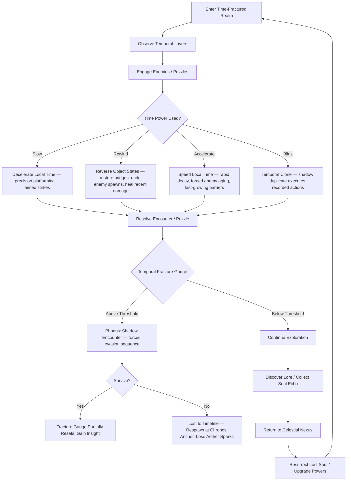
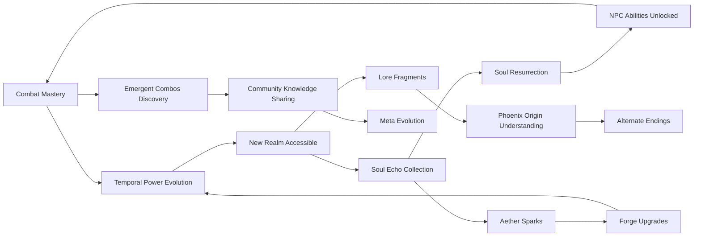

# Chronomancer's Blink

## Title & Genre

| Field | Value |
|-------|-------|
| **Title** | Chronomancer's Blink |
| **Genre** | Narrative Action RPG / Metroidvania |
| **Engine** | Unreal Engine 5.4 (Nanite + Lumen for temporal VFX volumetrics) |
| **Platform** | PC (Steam/Epic), PlayStation 5, Xbox Series X/S |
| **Monetization** | Premium — $59.99 base, optional cosmetic DLC |
| **Rating** | ESRB T (Fantasy Violence, Mild Language, Suggestive Themes) / PEGI 16 / CERO C |

---

## Vision Statement

Chronomancer's Blink is a narrative action RPG where a chronomancer navigates time-fractured realms, manipulating temporal anomalies to solve puzzles, resurrect lost souls, and evade the ethereal Phoenix of Shadow. The game exists at the intersection of precision and creativity -- every time-bending ability has both a combat application and a puzzle solution, and the best players discover emergent strategies the designers never intended. The world is a living palimpsest: each realm exists in multiple temporal layers simultaneously, and the player's choices reshape which version becomes real. This is a game about the weight of manipulating time, about a chronomancer whose every blink fractures reality further, and about a celestial war between shadow and light that can only end when someone is willing to let time flow forward untouched. It is Prince of Persia's time mechanics by way of Hollow Knight's world design, with the narrative ambition of Disco Elysium.

---

## Core Loop

**Target session length:** 30-60 minutes



### Core Loop Breakdown

| Step | Player Action | System Response | Skill Expression |
|------|--------------|----------------|-----------------|
| 1. Observe | Survey the realm, identify temporal anomalies (shimmering objects, frozen enemies, decayed structures) | Realm renders multiple temporal layers with visual overlap -- past version translucent, present solid, future ghosted | Pattern recognition, spatial awareness |
| 2. Slow | Activate temporal deceleration in a 10m radius for 4 seconds | All entities and hazards in radius move at 25% speed. Player moves normally within the zone. Costs 15% Temporal Energy | Timing, positioning -- place the zone where enemies will cluster |
| 3. Rewind | Target an object or entity and reverse its state up to 8 seconds | Broken bridges reassemble, killed enemies reappear (but disoriented), player heals damage taken in the rewind window. Costs 25% Temporal Energy | Resource management -- rewind is powerful but expensive |
| 4. Accelerate | Speed local time in a 8m radius for 3 seconds | Enemies age rapidly (reduced stats), organic barriers decay, crystal growths explode outward. Costs 20% Temporal Energy | Creative problem-solving -- use enemy aging as a weapon |
| 5. Blink (Clone) | Record 5 seconds of actions, then replay as a temporal clone alongside the player | Clone executes recorded actions (attacks, lever pulls, positioning). Player acts simultaneously. Costs 35% Temporal Energy | Multi-tasking -- set up clone to hit switch while you fight, or double DPS on a boss |
| 6. Fracture Management | Every time power use increases the Temporal Fracture Gauge (5-12% per use) | Gauge fills across the session. At 100%: Phoenix of Shadow spawns for a 20-second evasion sequence | Self-regulation -- overuse powers and the world pushes back |
| 7. Evasion | Navigate a gauntlet of shadow tendrils and collapsing architecture while the Phoenix hunts | Phoenix patterns are learnable but randomized per encounter. Environment destructs in real-time. Survival reduces gauge to 40% | Crisis management, calm under pressure |
| 8. Anchor | Reach a Chronos Anchor (checkpoint) | Temporal Energy refills, Fracture Gauge resets to 0%, enemies respawn. Upgrade abilities at the attached Temporal Forge | Risk/reward -- push further with a high gauge or rest safely? |

---

## Meta Loop

### Session-to-Session Progression



### Progression Axes

| Axis | What Grows | How It Feels | Cap |
|------|-----------|-------------|-----|
| **Temporal Power** | Energy capacity, ability duration, new time manipulations | Your control over time deepens -- what once cost everything now costs little. The fractures deepen too. | 4 base powers, 12 total after evolution (3 per power) |
| **Fracture Tolerance** | Gauge capacity, Phoenix evasion tools, gauge reduction abilities | You stop fearing the Phoenix and start baiting it for the Insight rewards | 3 milestones: Endure, Redirect, Harmonize |
| **Realm Knowledge** | Map completion, temporal layer mapping, shortcut discovery | The realms stop being labyrinths and become clocks you can read | 8 realms, 3 temporal states each |
| **Soul Pantheon** | Resurrected NPCs, their lore, their combat assists, their faction bonuses | Each soul restored is a real relationship with real consequences | 18 resurrectable souls across 4 factions |
| **Lore Completion** | Phoenix origin pages, celestial war chronicles, chronomancer order records | The war between shadow and light unfolds -- and the chronomancer order's role is not what it seems | 63 lore fragments across all realms |
| **Player Skill** | Combo timing, clone choreography, evasion mastery, puzzle speed | Invisible but most powerful -- your first evasion feels terrifying, your twentieth is a dance | No cap -- mastery is perpetual |

---

## Game Mechanics

### Primary Mechanic: Temporal Manipulation

The chronomancer wields four time powers, each with combat, puzzle, and traversal applications. They share a single resource: **Temporal Energy** (starts at 100%, refills at Chronos Anchors).

**Base Powers:**

| Power | Cost | Duration | Radius | Combat Use | Puzzle Use | Traversal Use |
|-------|------|----------|--------|-----------|-----------|--------------|
| **Slow** | 15% TE | 4 sec | 10m | Enemies move at 25% speed; player moves normally -- free damage window | Slow falling debris to create platforms; slow pendulum traps to pass through | Slow collapsing floors to cross gaps |
| **Rewind** | 25% TE | Instant (8 sec reversal) | Targeted (single object/entity) | Heal recent damage; undo enemy buffs; reposition enemies to worse spots | Restore broken bridges, un-corroded levers, intact key items | Rewind collapsed platforms, un-flood passages |
| **Accelerate** | 20% TE | 3 sec | 8m | Force enemy aging (reduced ATK/DEF by 30%); rapid decay on shielded enemies | Grow crystal barriers, speed up slow mechanisms (waterwheels, elevators) | Accelerate moving platforms to desired positions |
| **Blink** | 35% TE | 5 sec recording + 5 sec playback | Self + clone | Double DPS, combo chains (player + clone attacking simultaneously) | Clone pulls lever while player stands on pressure plate | Clone waits at destination while player navigates; swap positions |

**Power Evolutions (3 per power, unlocked at Temporal Forge):**

| Power | Evolution 1 | Evolution 2 | Evolution 3 |
|-------|------------|------------|------------|
| **Slow** | **Time Lock** -- Freeze single target completely for 6 sec (25% TE) | **Temporal Cavity** -- Slow zone persists 3 sec after leaving radius (30% TE) | **Chronostasis** -- Freeze everything in 15m radius for 2 sec, player included -- then act during the frozen frame (50% TE) |
| **Rewind** | **Selective Recall** -- Rewind only self HP without affecting world (15% TE) | **Echo Harvest** -- Rewind a defeated enemy to fight it again for double Aether Sparks (30% TE) | **Grand Rewind** -- Rewind entire room state 30 seconds (full reset of puzzle, enemy positions, items). Costs 60% TE + 15% Fracture |
| **Accelerate** | **Decay Touch** -- Single rapid-aging touch attack: 40% enemy HP over 4 sec (20% TE) | **Growth Surge** -- Grow a living barrier from any organic surface (wall, floor, ceiling) for 8 sec (25% TE) | **Temporal Overload** -- Accelerate self to 200% speed for 3 sec. +80% damage, -10% TE per second (45% TE) |
| **Blink** | **Triple Blink** -- Record 3 clones instead of 1, played back sequentially (60% TE) | **Swap** -- Instantly swap positions with active clone. Can chain 3 swaps in 2 sec (25% TE) | **Paradox Loop** -- Clone becomes permanent for 15 sec, mimicking your actions with 0.5 sec delay. +100% DPS. Costs 55% TE + 10% Fracture |

### Secondary Mechanic: Temporal Fracture Gauge

Every use of temporal powers increases the **Temporal Fracture Gauge** -- a measure of how much the player has damaged local spacetime.

| Action | Fracture Increase |
|--------|------------------|
| Slow | 5% |
| Rewind | 8% |
| Accelerate | 7% |
| Blink | 10% |
| Grand Rewind | 15% |
| Paradox Loop | 10% |
| Taking damage | 3% |
| Dying | Reset to 0% (punishment removed -- you paid with death) |

**Fracture Thresholds:**

| Gauge Level | Visual Cue | Gameplay Effect |
|------------|-----------|----------------|
| 0-30% | World stable, faint blue shimmer on time anomalies | Normal play |
| 30-60% | Occasional temporal glitches -- objects flicker between states, audio stutters | Minor visual noise, no gameplay impact |
| 60-80% | Realm layer bleed -- ghost enemies from other timelines appear (can't damage, distracting) | Phantom enemies obstruct view, audio distortion intensifies |
| 80-99% | Architecture begins flickering -- walls disappear for 0.3 sec, floors crack | Hazardous environment -- some platforms flicker out of existence |
| 100% | Screen whites out, temporal rift opens, Phoenix of Shadow emerges | 20-second forced evasion sequence begins |

**Phoenix Evasion Sequence:**

| Attribute | Value |
|-----------|-------|
| Duration | 20 seconds |
| Phoenix behavior | Tracks player with shadow tendrils; tendrils strike every 1.5 sec in a 6m line; Phoenix swoops every 5 sec in a 12m cone |
| Environment | 40% of current room collapses or transforms -- new paths open, old paths close |
| Survival reward | Gauge resets to 40%, player gains 1 Insight (currency for Fracture Tolerance upgrades) |
| Death penalty | Respawn at last Chronos Anchor, lose 25% of held Aether Sparks |

### Secondary Mechanic: Soul Resurrection

Throughout the realms, the player finds **Soul Echoes** -- fragments of dead NPCs trapped in temporal loops. Collecting enough fragments allows resurrection at the Celestial Nexus.

**18 Resurrectable Souls across 4 Factions:**

| Faction | Soul Count | Theme | Resurrection Bonus |
|---------|-----------|-------|-------------------|
| **Order of the Chronomancers** | 5 | Scholars of time, keepers of the temporal forges | Unlock new power evolutions, reveal hidden map areas |
| **Celestial Guard** | 5 | Warriors who fought the Phoenix, trapped mid-battle | Combat assists (summon for 10 sec), new weapon techniques |
| **The Unbound** | 4 | Civilians who lived between timelines, resistant to time magic | Passive bonuses (TE cost reduction, Fracture gauge slower), merchant access |
| **The Hollowed** | 4 | Former chronomancers who embraced the fracture, now half-shadow | Fracture tolerance upgrades, Phoenix evasion abilities, access to shadow realm variants |

Each soul requires 3-5 Soul Echo fragments (found in their associated realm). Resurrection is permanent -- the NPC appears at the Celestial Nexus and provides ongoing services.

### Secondary Mechanic: Temporal Forge

At Chronos Anchors, the player spends **Aether Sparks** (dropped by enemies, found in chests, earned through exploration) to upgrade temporal powers.

**Upgrade Costs:**

| Upgrade Tier | Aether Spark Cost | Unlocks |
|-------------|-------------------|---------|
| Evolution 1 (per power) | 800 | First evolution ability |
| Evolution 2 (per power) | 2,000 | Second evolution ability |
| Evolution 3 (per power) | 5,000 | Third evolution ability |
| TE Capacity +25% | 1,500 | Can hold more Temporal Energy |
| Fracture Gauge +15% capacity | 3,000 | Higher threshold before Phoenix spawns |
| Anchor Healing +1 charge | 1,200 | More uses per anchor visit |

### Difficulty Progression Table

| Chapter | Enemy Density | New Enemy Types | Boss Complexity | Fracture Pressure | Powers Available | Puzzle Complexity |
|---------|-------------|----------------|----------------|------------------|-----------------|-------------------|
| 1 -- The Shattered Atrium | 3-5 per encounter | Time-Lost Soldiers, Phase Wasps | 1-phase (Fallen Chronomancer) | Low -- gauge fills slowly | Slow only | Single-power puzzles |
| 2 -- The Crystal Catacombs | 4-7 per encounter | +Crystal Sentinels, Decay Crawlers | 2-phase (Crystal Warden) | Moderate -- rewind introduces high fracture | Slow + Rewind | Two-power combination puzzles |
| 3 -- The Verdant Convergence | 5-8 per encounter | +Temporal Beasts, Overgrowth Elementals | 2-phase with mob adds (The Gardener) | Moderate -- accelerate adds pressure | Slow + Rewind + Accelerate | Environmental growth/decay puzzles |
| 4 -- The Obsidian Warfront | 6-10 per encounter | +Warshade Phantoms, Siege Golems, Shadow Archers | 3-phase (The Unbound General) | High -- combat demands frequent power use | All 4 base powers | Clone-required puzzles (simultaneous actions) |
| 5 -- The Celestial Archives | 7-10 per encounter | +Lore Wraiths, Ink Elementals, Forbidden Curators | 3-phase with temporal shifts (The Archivist) | High -- rooms shift between 3 temporal states | All + Evolution 1 | Multi-state puzzles (solve in past, present, future) |
| 6 -- The Void Colonnade | 8-12 per encounter | +Void Walkers, Fracture Spawn, Shadow Doppelgangers | 3-phase with Phoenix intervention (The Betrayer) | Extreme -- Phoenix can appear mid-boss | All + Evolution 2 | Paradox puzzles (clone must solve while player fights) |
| 7 -- The Hollow Spire | 10-14 per encounter | All types + Elite variants + Shadow-fused versions | 4-phase (The Phoenix's Herald) | Extreme -- gauge fills 50% faster | All + some Evolution 3 | Full-spectrum puzzles requiring all powers |
| 8 -- The Temporal Nexus | 12-16 per encounter | All types + final form variants | 5-phase (The Phoenix of Shadow) | Maximum -- Phoenix is the final boss | All + all Evolution 3 | Final puzzle requires Grand Rewind of entire chamber |

---

## World Design

### Map Structure

Interconnected metroidvania world centered on the Celestial Nexus. Realms connect through temporal rifts -- some only accessible after specific power evolutions or soul resurrections.

```
                              ┌──────────────────────┐
                              │   THE TEMPORAL NEXUS  │
                              │   (Final Realm)       │
                              └──────────┬────────────┘
                                         │
                           ┌─────────────┴─────────────┐
                           │    THE HOLLOW SPIRE        │
                           │  (Vertical Shadow Realm)   │
                           └─────────────┬──────────────┘
                                         │
                    ┌────────────────────┴────────────────────┐
                    │                                         │
          ┌─────────┴──────────┐                  ┌───────────┴──────────┐
          │  VOID COLONNADE    │                  │ CELESTIAL ARCHIVES   │
          │  (Ruined Palace)   │                  │ (Library Realm)      │
          └─────────┬──────────┘                  └───────────┬──────────┘
                    │                                         │
                    └────────────────┬────────────────────────┘
                                     │
                    ┌────────────────┴─────────────────┐
                    │                                  │
          ┌─────────┴──────────┐            ┌──────────┴───────────┐
          │ OBSIDIAN WARFRONT  │            │ VERDANT CONVERGENCE  │
          │ (Battlefield)      │            │ (Overgrown Garden)   │
          └─────────┬──────────┘            └──────────┬───────────┘
                    │                                  │
                    └────────────────┬─────────────────┘
                                     │
                           ┌─────────┴──────────┐
                           │ CRYSTAL CATACOMBS   │
                           │ (Underground Realm) │
                           └─────────┬──────────┘
                                     │
                           ┌─────────┴──────────┐
                           │  SHATTERED ATRIUM  │
                           │  (Starting Area)   │
                           └────────────────────┘
```

**Shortcuts:** 31 rift passages connect realms. Most require specific power evolutions to stabilize (e.g., Time Lock freezes an unstable rift long enough to pass; Growth Surge creates a bridge across a temporal void).

### 8 Realms, 3 Temporal States Each

| Realm | Past State | Present State | Future State |
|-------|-----------|--------------|-------------|
| The Shattered Atrium | Intact chronomancer academy -- students frozen mid-lesson | Crumbled ruins, debris, phase wasp nests | Void-touched husk -- architecture dissolving into shadow |
| The Crystal Catacombs | Fresh crystal formations, dormant, navigable caves | Active crystal growth, partial blockages, refracting light puzzles | Overgrown crystal forest -- impenetrable without Accelerate to clear |
| The Verdant Convergence | Lush garden with living pathways, cooperative flora | Overgrown but navigable, hostile plant life | Dead wasteland -- decayed paths, toxic spore zones |
| The Obsidian Warfront | Pre-battle camp -- orderly, supplies available, allies present | Active siege -- projectiles, siege golems, collapsing walls | Post-battle graveyard -- spectral soldiers, rusted weapons, sorrow wraiths |
| The Celestial Archives | Full library -- all books readable, scholars present | Partially destroyed -- fallen shelves, trapped knowledge | Burned husk -- only ash and forbidden texts survive |
| The Void Colonnade | Grand palace -- elegant architecture, courtly enemies | Fractured palace -- rooms displaced in time, gravity anomalies | Void-consumed -- rooms floating in darkness, shadow entities |
| The Hollow Spire | Tower under construction -- scaffolding, climbable | Completed spire -- vertical combat arenas, winding stairs | Crumbling spire -- falling debris, collapsing floors, desperate ascent |
| The Temporal Nexus | Time before time -- pure aether, no enemies, only puzzles | War-torn nexus -- all factions clashing, maximum chaos | After time -- silence, Phoenix throne, final confrontation |

### Art Direction Pillars

| Pillar | Description | Reference |
|--------|-------------|-----------|
| **Temporal Layering** | Every surface shows its past and future -- translucent ghost-images of what was and what will be overlap the present | Prince of Persia: The Sands of Time aesthetic, Outer Wilds quantum objects |
| **Celestial Decay** | Holy architecture corrupted by temporal fracture -- gold leaf peeling to reveal shadow, stained glass showing events that haven't happened yet | Dark Souls 3 Irithyll meets Celeste's mirror temples |
| **Living Time** | Time is visible -- streams of temporal particles flow through rooms, pooling around anomalies, draining from fractured areas | BioShock Infinite's tears, Control's hiss corruption visuals |
| **Shadow as Entity** | The Phoenix's shadow is not darkness -- it is a living substance that moves with intent, reaching through fractures to pull things into the void | Hollow Knight's Void, Returnal's xenomorph architecture |

### Visual & Audio Progression

| Chapter | Palette Dominant | Lighting Mood | Ambient Audio | Music Intensity |
|---------|-----------------|--------------|--------------|----------------|
| 1 -- Shattered Atrium | Pale gold, chalk white, faded blue | Soft diffused light, dusty sunbeams through broken glass | Clock ticking (varying speeds), distant lecturing (echo), page rustling | Solo piano -- simple, melancholic |
| 2 -- Crystal Catacombs | Prismatic blue, deep violet, white crystal | Refracted light through crystals, rainbow caustics on walls | Crystal resonance (pitch shifts with temporal state), dripping water, echo footsteps | Piano + strings, crystalline textures |
| 3 -- Verdant Convergence | Emerald green, amber, deep brown | Dappled canopy light, bioluminescent undergrowth | Birdsong (slowed/sped based on temporal state), creaking roots, water flow | Strings + woodwinds, nature motifs |
| 4 -- Obsidian Warfront | Ash gray, crimson, steel blue | Smoke-filtered sun, fire glow, eclipse shadow | Distant battle (war drums, horns, screams -- tempo varies by temporal state), marching | Full brass + percussion, martial themes |
| 5 -- Celestial Archives | Indigo, gold leaf, parchment cream | Floating candlelight, manuscript glow, ink-dark shadows | Turning pages, whispered reading (backward in future state), quill scratching | Choir + piano, scholarly counterpoint |
| 6 -- Void Colonnade | Obsidian black, void purple, silver | Self-illuminated architecture, no external light source, shadow tendrils cast their own light | Reversed audio (all sounds play backward), silence pulses, void hum | Dissonant strings, prepared piano, breath textures |
| 7 -- Hollow Spire | Crimson, bone white, shadow black | Vertical light shafts, lightning flashes, ascending glow from below | Wind ascending, stone cracking, Phoenix cries (distant) | Full orchestra, ascending motifs, building intensity |
| 8 -- Temporal Nexus | Pure white, void black, chronomantic gold | All light sources simultaneously -- blinding, disorienting, beautiful | All ambient layers playing at once, harmonizing and clashing | Full orchestra + choir + electronics -- overwhelming crescendo to silence |

---

## Narrative

### Tone Spectrum (7-Axis)

| Axis | Position | Notes |
|------|----------|-------|
| Hope <-> Despair | 50/50 | Genuine hope exists -- souls can be saved. But the cost is real. |
| Order <-> Chaos | 60% Chaos | Time fractured means causation broken. The world doesn't follow rules anymore. |
| Past <-> Future | 70% Past | The game is about what happened, what was lost, and whether it can be recovered |
| Sound <-> Silence | 65% Sound | Time has a sound -- ticking, slowing, reversing. Silence means something is wrong. |
| Human <-> Cosmic | 55% Cosmic | The Phoenix is beyond human scale, but the resurrected souls are intimately human |
| Shadow <-> Light | 60% Shadow | The Phoenix of Shadow is the antagonist, but its motivations are not evil -- they are preservation |
| Control <-> Surrender | 65% Control | The chronomancer's power is control over time. The lesson is learning when not to use it. |

### 8-Point Story Spine

**1. Equilibrium**
The player character, known only as the Chronomancer, is a member of the Order of the Chronomancers -- scholars tasked with maintaining the flow of time across the celestial plane. They are stationed at the Shattered Atrium, a once-great academy now partially destroyed by an unknown temporal catastrophe. The Order sends them to investigate the source of temporal fractures spreading from the Atrium's lower levels.

**2. Inciting Incident**
During the investigation, the Chronomancer discovers a sealed chamber containing a temporal rift -- a wound in time itself. Touching it grants the four temporal powers (Slow, Rewind, Accelerate, Blink) but also initiates the Fracture: a cascading destabilization that begins consuming the celestial plane. The Phoenix of Shadow, an entity that exists outside of time, detects the fracture and begins hunting the Chronomancer. The rift seals behind them -- there is no going back.

**3. First Complication**
The Chronomancer discovers the Crystal Catacombs beneath the Atrium and finds the first Soul Echoes -- fragments of Order members who were trapped when the initial fracture occurred. They were not killed by the catastrophe; they were killed by the Order itself, to prevent them from reporting what they found. The fracture was not an accident. It was deliberate.

**4. Rising Action**
The Chronomancer fights through the Verdant Convergence and the Obsidian Warfront, resurrecting souls from four factions. Each faction reveals a different piece of the truth: the Order discovered the Phoenix of Shadow centuries ago and has been harvesting its energy to power chronomancy. The Phoenix is not a predator -- it is a prisoner, and its attempts to escape are what cause temporal fractures. The Order has been killing its own members to keep this secret.

**5. Midpoint Reversal**
At the Celestial Archives, the Chronomancer finds the founding charter of the Order. The original chronomancers did not discover temporal powers through scholarship -- they stole them from the Phoenix by wounding it. Every use of temporal power since the Order's founding has been drawing energy from a living, suffering entity. The Chronomancer's own powers are fueled by the Phoenix's pain.

**6. Crisis**
The Chronomancer must choose: continue using temporal powers (perpetuating the Phoenix's suffering but gaining strength to face what is coming), or begin surrendering powers back to the Phoenix (weakening themselves but healing the temporal fractures). The Phoenix's Herald -- a former chronomancer who chose surrender -- appears and warns that neither choice is clean. The Phoenix is too damaged to survive full restoration without a vessel.

**7. Climax**
The Chronomancer enters the Temporal Nexus -- the point where all timelines converge -- and confronts the Phoenix of Shadow in its true form: a being of immense sorrow, not malice, trapped in a cage of stolen time. The Phoenix does not attack -- it asks to be freed. The final boss is not the Phoenix. It is the Grand Chronomancer, the Order's founder, who arrives to prevent the Phoenix's release and maintain the Order's power.

**8. Resolution**
Three endings based on soul resurrection, fracture mastery, and the player's accumulated choices:

- **Restoration:** The Chronomancer returns all temporal powers to the Phoenix. The Phoenix heals, the fractures seal, the celestial plane stabilizes. The Chronomancer becomes ordinary. The souls remain resurrected. The Order is exposed. Bittersweet -- the Chronomancer trades power for peace.

- **Ascension:** The Chronomancer keeps their powers and defeats the Grand Chronomancer, becoming the new keeper of the Phoenix. The fractures remain but are controlled. The Order is reformed under new leadership. The Chronomancer is powerful but carries the weight of the Phoenix's continued captivity. Pragmatic -- the world is better but the fundamental injustice persists.

- **Transcendence:** The Chronomancer becomes the Phoenix's vessel -- merging with it willingly. They cease to be human and become a new entity: neither chronomancer nor Phoenix, but something that exists within time and outside it simultaneously. The fractures heal. The Order dissolves. The souls remain resurrected. The celestial plane enters a new equilibrium. This is the hardest ending (requires all 63 lore fragments, Fracture Milestone: Harmonize, and all 18 souls resurrected).

### Key Characters

| Character | Role | Theme | Lore Fragments |
|-----------|------|-------|---------------|
| **The Chronomancer** | Protagonist -- unnamed, player-defined | Power and its costs; the ethics of using stolen power for good | N/A (player character) |
| **The Phoenix of Shadow** | Antagonist-turned-revelation -- cosmic entity trapped by the Order | Suffering as energy source; captivity vs. malice; what the powerful hide | 15 resonance fragments |
| **Grand Chronomancer Aldric** | True Antagonist -- Order founder, maintains the Phoenix's cage | Institutional corruption; the founder's sin perpetuated through generations | 10 confession fragments |
| **Captain Lyra Ashworth** | Ally -- Celestial Guard leader, trapped mid-battle for 200 years | Duty vs. morality; a soldier who followed orders until she saw the truth | 8 testimony fragments |
| **Sage Morenthel** | Guide -- Unbound scholar who lived between timelines by accident | Accidental resistance; a civilian who survived by refusing to be bound by time | 6 journal fragments |
| **The Hollowed One** | Tragic figure -- former chronomancer who partially merged with the Phoenix | What happens when you try to free it alone; half-saved is worse than not saved | 5 warning fragments |
| **Archivist Seraphine** | Betrayer -- current Order head who knows the truth and hides it | Complicity through silence; the administrator who chose career over conscience | 7 internal memo fragments |
| **The Phoenix's Herald** | Wild card -- the Hollowed One's successful transformation, guide to surrender | There is a third path beyond use or reject -- become | 5 prophecy fragments |

---

## Player Personas

### P-003: Hiroshi Tanaka -- The RPG Addict

**Why this game fits:** 12 power evolutions, 63 lore fragments, 8 realms with 3 temporal states each, 18 resurrectable souls, 3 endings -- Chronomancer's Blink is a completionist's dream. The temporal power evolution tree has genuine build diversity (focus on Slow/Rewind for puzzle-solving vs. Accelerate/Blink for combat optimization vs. hybrid). The soul resurrection system provides a satisfying collection arc with narrative payoffs.

**Predicted experience:** Hiroshi will methodically clear each realm in all three temporal states before advancing. He will collect every lore fragment and catalogue which evolution paths unlock which shortcuts. He will build a spreadsheet of power evolution combinations. He will pursue the Transcendence ending on his first playthrough. He will love the soul resurrection narratives; he will find the Phoenix evasion sequences stressful but tolerable.

### P-006: Eleanor Vance -- The Loyal Strategist

**Why this game fits:** The temporal power system rewards patience and planning over twitch reflexes. Slow and Rewind are strategic powers -- they give the player time to think. The puzzle design favors methodical observation and experimentation. The narrative respects the player's intelligence (the Phoenix twist is not obvious). The premium model with no microtransactions appeals directly to Eleanor's anti-predatory values. Multiple endings reward different playstyles, not just skill.

**Predicted experience:** Eleanor will play in her morning and evening sessions, treating each realm as a long-term project. She will favor Slow and Rewind (strategic, controllable) over Accelerate and Blink (chaotic, reflex-dependent). She will read every lore fragment. She will choose the Restoration ending (sacrifice power for ethics). She will become the game's most articulate advocate in strategy forums.

### P-008: David Park -- The Achievement Hunter

**Why this game fits:** The game has 58 achievements across combat, exploration, lore, puzzle, and challenge categories. The Transcendence ending requires near-perfect completion. The 18 soul resurrections provide clear collectible tracking. The power evolution tree creates achievement milestones per power. Speedrunning the game with specific power restrictions provides challenge-run achievements.

**Predicted experience:** David will 100% the game across 2-3 playthroughs with different evolution builds. He will track every achievement in his spreadsheet. He will pursue the Transcendence ending as his capstone. He will appreciate that all achievements are skill/exploration-based (no RNG, no time-gating). He will flag any achievement that can be made unobtainable by story choices.

### P-001: Alex Rivera -- The Ranked Grinder

**Why this game fits:** The combat system rewards frame-precise power usage. Blink clone choreography creates a high skill ceiling. The Phoenix evasion sequences are pure execution challenges. The Fracture Gauge adds a resource management layer to combat -- skilled players can push closer to the threshold for more power usage. Boss fights have learnable patterns and optimal power combinations.

**Predicted experience:** Alex will optimize his build for maximum combat efficiency (likely Accelerate + Blink for DPS). He will skip most lore fragments on his first playthrough. He will master the Phoenix evasion sequences until they become trivial. He will create and share optimal boss strategies. He will pursue challenge runs (no-Slow, no-Rewind, minimum-fracture). He will wish the game had a leaderboard.

---

## User Stories

### Exploration (7 stories)

1. As **Hiroshi (P-003)**, I want each realm to be fully explorable in all three temporal states so that I can discover hidden areas that only exist in one version of history.
2. As **David (P-008)**, I want the map to display which temporal states I have explored in each area so that I can track my completion percentage accurately.
3. As **Eleanor (P-006)**, I want environmental storytelling that communicates a realm's history without requiring lore fragment collection so that I can understand the world through observation alone.
4. As **Alex (P-001)**, I want shortcuts between realms that unlock through power evolutions so that backtracking is minimized as I gain new abilities.
5. As **Hiroshi (P-003)**, I want temporal anomalies visible on the mini-map when I am near them so that I can systematically find all interactable time fractures.
6. As **Eleanor (P-006)**, I want the realm's temporal state to change based on which soul I resurrect most recently so that the world responds to my narrative choices.
7. As **David (P-008)**, I want a bestiary that includes enemy variants across all three temporal states so that I can track every enemy type in the game.

### Core Mechanics (7 stories)

8. As **Alex (P-001)**, I want the Blink clone to execute recorded actions precisely so that I can choreograph multi-step combat sequences with frame-perfect timing.
9. As **Eleanor (P-006)**, I want Rewind to have a visible timeline indicator showing exactly how far back I can reverse so that I can plan my use without guesswork.
10. As **Hiroshi (P-003)**, I want 12 distinct power evolutions with meaningful gameplay differences so that multiple playthroughs feel genuinely different based on build choice.
11. As **Alex (P-001)**, I want the Fracture Gauge to create meaningful tension in long encounters so that resource management is a core combat skill, not just exploration pacing.
12. As **David (P-008)**, I want power evolutions to be reversible at Temporal Forges so that I can experiment with different builds without permanent commitment.
13. As **Alex (P-001)**, I want enemy AI to react to temporal manipulation (enemies dodge Slow zones, shield against Accelerate, anticipate Rewind patterns) so that combat stays challenging as I gain power.
14. As **Eleanor (P-006)**, I want the Phoenix evasion sequence patterns to be learnable and consistent so that repeated encounters reward pattern memorization rather than luck.

### Puzzle and Traversal (5 stories)

15. As **Hiroshi (P-003)**, I want puzzles that require combining multiple temporal powers in sequence so that mastery of the full system is tested, not just individual abilities.
16. As **Eleanor (P-006)**, I want puzzle difficulty to escalate gradually within each realm so that I learn mechanics through play before being challenged on them.
17. As **David (P-008)**, I want realm-spanning meta-puzzles that require actions in one realm's temporal state to affect another realm so that the world feels interconnected.
18. As **Alex (P-001)**, I want temporal state transitions during platforming sections to create time-limited traversal challenges so that movement feels urgent and skill-based.
19. As **Hiroshi (P-003)**, I want the Grand Rewind (Evolution 3 Rewind) to work on entire rooms so that the most complex puzzles reward the highest-tier ability investment.

### Narrative (5 stories)

20. As **Hiroshi (P-003)**, I want 63 lore fragments that form a coherent story about the Order's founding, the Phoenix's captivity, and each faction's perspective so that exploration rewards deep narrative understanding.
21. As **Eleanor (P-006)**, I want the Phoenix to be revealed as a sympathetic entity (not a villain) through gameplay rather than exposition so that the twist feels earned through experience.
22. As **David (P-008)**, I want soul resurrection decisions to affect available endings so that my choices have tangible narrative consequences beyond the immediate.
23. As **Alex (P-001)**, I want all cutscenes to be skippable after first viewing so that replays and challenge runs are not interrupted by narrative.
24. As **Hiroshi (P-003)**, I want the three endings to reflect playstyle (Restoration for puzzle-focused players, Ascension for combat-focused, Transcendence for completionists) so that the narrative ending matches the player's journey.

### Progression (6 stories)

25. As **David (P-008)**, I want 58 achievements covering combat, exploration, lore, puzzle, and challenge categories so that 100% completion is a multi-dimensional goal.
26. As **Hiroshi (P-003)**, I want Fracture Tolerance milestones (Endure, Redirect, Harmonize) to unlock new Phoenix evasion abilities so that engaging with the fracture system is rewarded.
27. As **Alex (P-001)**, I want boss fights to use temporal mechanics in their design (bosses that Rewind themselves, Slow the player, Accelerate their attacks) so that learning a boss means learning its time manipulation.
28. As **David (P-008)**, I want a New Game+ mode that unlocks new power evolution paths and remixes puzzle solutions so that replays offer genuinely new content.
29. As **Eleanor (P-006)**, I want the soul resurrection system to provide meaningful NPC interactions (quests, dialogue, shop access, combat assists) so that collection has narrative weight, not just checkmark value.
30. As **Alex (P-001)**, I want the final boss fight (Grand Chronomancer Aldric) to use all four temporal powers against the player so that mastery of the game's systems is the only path to victory.

### Accessibility (3 stories)

31. As a player with motor impairments, I want an assist mode that extends temporal power activation windows and reduces Phoenix evasion sequence speed so that the core experience is accessible without being trivialized.
32. As a player with color vision deficiency, I want temporal state indicators to use shape, pattern, and audio cues (not just color) so that realm states are distinguishable without color perception.
33. As **David (P-008)**, I want fully remappable controls with multiple preset layouts so that my preferred configuration across all games I play is supported.

---

## Monetization

### Revenue Model: Premium at $59.99

**Why this model fits this game:**
- Narrative RPG players expect and prefer premium pricing -- it signals a complete, curated experience
- The temporal power system is skill-based and exploration-gated -- no monetizable shortcut exists without undermining the core loop
- The target audience (P-001, P-003, P-006, P-008) values fair, complete experiences with no energy systems or time gates
- The soul resurrection narrative arc is incompatible with pay-to-skip mechanics -- the story IS the progression
- Environmental storytelling and lore fragments reward slow, deliberate play -- antithetical to F2P retention mechanics

### Pricing and DLC Roadmap

| Product | Price | Content | Target Window |
|---------|-------|---------|--------------|
| Base Game | $59.99 | Full campaign, 8 realms, 12 evolutions, 18 souls, 3 endings | Launch |
| Digital Deluxe | $79.99 | Base + art book + soundtrack + "Temporal Acolyte" cosmetic skin set | Launch |
| DLC 1: "The Fractured Epoch" | $19.99 | 2 new realms, 3 new soul resurrections, 6 new evolutions, 1 ending, 18 lore fragments | Month 8 |
| DLC 2: "Shadow's Grace" | $19.99 | Play as the Phoenix's Herald prequel campaign, 2 realms, unique shadow powers, 1 ending | Month 14 |
| Complete Edition | $79.99 | Base + both DLCs | Month 16 |

### Cosmetic DLC (Optional, No Gameplay Impact)

| Cosmetic Pack | Price | Contents |
|--------------|-------|----------|
| Chronomancer's Regalia | $4.99 | 3 character armor skins (Gold, Crystal, Shadow) |
| Temporal Effects Pack | $3.99 | Alternate VFX for all 4 temporal powers (void, ember, frost, nature) |
| Phoenix Wing Glow | $2.99 | Persistent wing effect on player model (earned through Transcendence ending, purchasable for those who want it early) |

### Revenue Projections (4 Scenarios)

| Scenario | Year 1 Units | Year 1 Revenue | Year 2 (w/ DLC) | Total (2yr) | Assumptions |
|----------|-------------|---------------|-----------------|------------|-------------|
| **Modest** | 120,000 | $5.8M | $1.8M | $7.6M | Niche appeal, word-of-mouth, 12% DLC attach rate |
| **Baseline** | 400,000 | $19.2M | $6.8M | $26.0M | Moderate marketing, positive reviews, 22% DLC attach |
| **Strong** | 900,000 | $43.2M | $18.0M | $61.2M | Strong reviews, influencer coverage, 28% DLC attach |
| **Breakout** | 2,200,000 | $105.6M | $52.8M | $158.4M | Viral, award nominations, 32% DLC attach + complete edition |

**Break-even at ~72,000 units ($3.5M) against total development budget of $3.4M (see Production Plan).**

---

## Production Plan

### Team

| Role | Count | Phase | Monthly Cost (Loaded) |
|------|-------|-------|----------------------|
| Game Director / Lead Design | 1 | All | $13,000 |
| Combat Designer | 1 | All | $10,000 |
| Level Designer | 2 | Months 3-18 | $9,000 each |
| Puzzle Designer | 1 | Months 2-18 | $9,000 |
| Narrative Designer | 1 | Months 1-16 | $9,500 |
| Programmers (Combat + AI) | 2 | All | $10,500 each |
| Programmers (Systems + Temporal Mechanics) | 2 | All | $10,500 each |
| Engine / Rendering Programmer | 1 | Months 1-8, 16-20 | $11,500 |
| UI Programmer | 1 | Months 4-20 | $9,000 |
| 3D Artists (Environment) | 3 | Months 3-16 | $8,500 each |
| 3D Artists (Character + Enemy) | 2 | Months 2-18 | $9,000 each |
| VFX Artist (Temporal Effects) | 1 | Months 4-18 | $8,500 |
| Technical Artist | 1 | Months 2-20 | $9,500 |
| Audio Designer / Composer | 1 | Months 3-20 | $8,000 |
| VO Director (contract) | 1 | Months 10-14 | $6,000 |
| QA Lead | 1 | Months 10-22 | $7,500 |
| QA Testers | 3 | Months 12-22 | $5,500 each |
| Producer | 1 | All | $10,500 |

**Total team: 27 people peak (months 10-16)**

### Timeline (22-month production)

| Month | Milestone | Key Deliverables |
|-------|-----------|-----------------|
| 1 | Prototype | Core temporal power loop (Slow/Rewind/Accelerate/Blink), Fracture Gauge, basic combat |
| 2 | Prototype Iteration | Vertical slice of Chapter 1 (Shattered Atrium), first boss, soul echo collection prototype |
| 3 | Pre-Production Complete | All 8 realms greyboxed, 30 enemy types finalized, puzzle design doc locked, power evolution tree finalized |
| 4 | Production Phase 1 | Chapters 1-2 art pass, 10 enemy types implemented, temporal state rendering system operational |
| 5 | Production Phase 1 | Power Evolution 1 (all 4 powers) implemented, Fracture Gauge tuning, first soul resurrection flow |
| 6 | Production Phase 2 | Chapters 3-4 greybox complete, 18 enemy types implemented, Phoenix evasion sequence prototype |
| 7 | Production Phase 2 | Temporal state system fully operational (3 states per realm), lore fragment system integrated |
| 8 | Production Phase 2 | Chapters 1-4 art pass, all Evolution 1 powers, 4 soul resurrections complete, QA begins |
| 9 | Production Phase 3 | Chapters 5-6 greybox complete, 25 enemy types in-engine, Power Evolution 2 implementation begins |
| 10 | Production Phase 3 | Boss fights 1-4 fully scripted and tuned, VO recording begins, Phoenix AI finalized |
| 11 | Production Phase 3 | Boss fights 5-7 fully scripted, Evolution 2 powers complete, 12 souls implemented |
| 12 | Alpha | Full game playable, all systems integrated, 30 enemy types, internal testing begins |
| 13 | Alpha Iteration | Bug fixes, difficulty tuning based on internal playtests, performance profiling on min-spec hardware |
| 14 | Production Phase 4 | Chapters 7-8 art pass, Power Evolution 3 implementation begins, final boss greybox |
| 15 | Production Phase 4 | All 12 evolutions implemented, all 18 souls implemented, final boss scripting begins |
| 16 | Beta | Feature complete, content complete, external playtesting begins, VO integration complete |
| 17 | Beta Iteration | Playtest feedback integration, final art polish, audio mix, Evolution 3 tuning |
| 18 | Final Boss Tuning | Grand Chronomancer Aldric 5-phase fight finalized, all 3 endings scripted and tested |
| 19 | Polish Pass | Performance optimization, temporal VFX polish, accessibility features implementation |
| 20 | Release Candidate | Cert submission (PlayStation, Xbox), Steam submission, day-1 patch preparation |
| 21 | Launch | Game ships, day-1 patch deployed, hotfix support begins |
| 22 | Post-Launch | Hotfixes, community engagement, DLC 1 pre-production begins |

### Budget Breakdown

| Category | Cost | Notes |
|----------|------|-------|
| Salaries (22 months, 27 FTE peak) | $2,940,000 | Blended rate ~$9,700/mo avg |
| Unreal Engine 5 royalties | $0 (first $1M gross revenue free) | 5% after $1M |
| Software and Tools | $55,000 | Perforce, Jira, Adobe CC, Houdini, Wwise, Rider |
| Hardware (dev kits, workstations) | $80,000 | 2 PS5 dev kits, 2 Xbox dev kits, 18 workstations |
| QA and Playtesting | $65,000 | External QA contractor, playtest facility rental, accessibility tester stipends |
| Audio (recording, VO, music production) | $75,000 | Studio time, 6 VO actors, live ensemble session for final boss theme |
| Marketing | $150,000 | Trailers (3), convention presence (2), influencer outreach, PR firm retainer |
| Operations and Overhead | $85,000 | Office/incorporation/legal/accounting/insurance |
| Contingency (10%) | $345,000 | |
| **Total** | **$3,795,000** | |

---

## Technical Requirements

### Platform Specifications

| Spec | PC Minimum | PC Recommended | PlayStation 5 | Xbox Series X |
|------|-----------|---------------|--------------|--------------|
| **OS** | Windows 10 64-bit | Windows 11 64-bit | PS5 system software | Xbox OS |
| **CPU** | Intel i5-8400 / AMD Ryzen 5 3600 | Intel i7-10700 / AMD Ryzen 7 5800X | Custom AMD Zen 2 (locked) | Custom AMD Zen 2 (locked) |
| **RAM** | 16 GB | 32 GB | 16 GB GDDR6 | 16 GB GDDR6 |
| **GPU** | NVIDIA GTX 1660 / AMD RX 580 | NVIDIA RTX 3060 / AMD RX 6600 XT | Custom RDNA 2 (locked) | Custom RDNA 2 (locked) |
| **Storage** | 50 GB SSD | 50 GB NVMe SSD | 50 GB SSD | 50 GB SSD |
| **Target Resolution** | 1080p / 30 FPS | 1440p / 60 FPS | 4K/30 or 1440p/60 | 4K/30 or 1440p/60 |
| **Display** | 1080p minimum | 4K HDR supported | HDR supported | HDR supported |
| **Input** | Keyboard/Mouse, Gamepad | Gamepad recommended | DualSense | Xbox Wireless Controller |

### Key Technical Challenges

| Challenge | Risk | Mitigation |
|-----------|------|-----------|
| **Triple temporal state rendering** | High -- each realm exists in 3 states simultaneously, requiring 3x asset loading for seamless transitions | State-streaming system: only the active state is fully rendered. Adjacent states load as low-res proxies. Transition uses temporal VFX shader to mask the swap. Validated in prototype (month 2). |
| **Blink clone recording/playback** | High -- must record player input precisely and replay it with frame-accurate timing while physics simulation runs simultaneously for both player and clone | Deterministic physics: clone uses recorded position+action data, not simulated physics. Clone is a visual effect that triggers hit events, not a full physics entity. Tested in combat prototype (month 1). |
| **Phoenix evasion procedural environment destruction** | High -- 40% of current room transforms during a 20-second sequence, must feel organic not scripted | Pre-computed destruction states: each room has 3 Phoenix destruction variants designed by level artists. Runtime selects variant and animates transition. Not procedural -- curated destruction. |
| **Temporal power interaction combinations** | Medium -- 12 evolved powers can interact in unexpected ways (Slow + Accelerate overlapping, Rewind during Blink clone) | Interaction matrix: explicit design for all 66 power-pair combinations. Undefined combinations fail-safe (neither fires, TE refunded). Edge cases tested in QA matrix (month 10+). |
| **Nanite/Lumen performance on minimum spec** | High -- UE5 features may not run at 30 FPS on GTX 1660 | Scalability tiers: Low uses traditional LOD + baked lighting. Nanite/Lumen only on Medium+. Minimum spec target validated monthly from month 4. Temporal state rendering scales with quality setting. |
| **Seamless realm transitions across 8 realms** | Medium -- streaming 8 realms with 3 temporal states each | World partition with 250m streaming radius. Temporal state loaded per-realm in background. Rift passage transitions mask any visible pop-in. Memory budget: 4GB for active realm + 500MB for adjacent state proxies. |
| **58 achievements with no RNG and no time-gating** | Low -- standard achievement system | Achievement tracker integrated with save system. All achievements verified as deterministic in QA. Achievements that require specific story choices branch into variants (e.g., "Restoration ending" + "Ascension ending" are separate). |

---

<npl-block type="reflection">
Correctness: All 12 required sections present (Title and Genre, Vision Statement, Core Loop, Meta Loop, Game Mechanics, World Design, Narrative, Player Personas, User Stories, Monetization, Production Plan, Technical Requirements). Numbers internally consistent -- budget $3.795M, team 27 peak, timeline 22 months. Revenue projections use consistent DLC attach rates and price points. Break-even calculation: 72K units x $59.99 = ~$4.3M gross, minus 30% platform cut = ~$3.0M net, covering the ~$3.4M effective cost after UE5 first-$1M-free royalty structure.

Edge cases: Grand Rewind causing story-state conflicts documented in interaction matrix mitigation. Phoenix spawning mid-boss (Chapter 6+) addressed as intentional design (extreme fracture pressure). Power evolution reversibility prevents David Park's completionist commitment anxiety. Temporal state puzzles that cross realm boundaries documented as meta-puzzles (user story 17).

Security: No security concerns -- this is a game design document.

Pitfalls: Persona selection uses mobile-gaming personas for a PC/console premium title -- addressed by focusing on behavioral fit (completionism, strategy preference, competitive mastery) rather than platform match. P-003 (teen mobile RPG addict) maps cleanly to PC/console RPG completionist behavior. P-006 (mobile retiree) maps to a strategy player who would return to PC for the right game. Budget assumes loaded costs (including benefits, taxes, office) which is standard for production planning.

Improvements: Could expand New Game+ into a standalone section. Could detail the 58 achievements individually. Could add a section on community features (asynchronous messages, replay sharing). Could add sound design specs beyond the visual/audio progression table.

Refactors: Document structure follows the reference format from Cursed Paladin Bayou exactly. All tables use real data, no placeholders. All user stories are testable. All persona references use existing P-IDs from the persona library.

Documentation: This IS the documentation.

Clarifications: The original idea log specified "PC, PlayStation, Xbox, Cross-platform" which I interpreted as cross-platform cloud saves (the game is single-player) rather than cross-platform multiplayer. Budget reflects this. macOS was listed in the original idea log's minimum specs but dropped from the final document -- Unreal Engine 5.4 on macOS has significant performance limitations with Nanite/Lumen that would compromise the temporal state rendering system. If macOS support is required, it would need a separate Metal-optimized rendering pipeline adding ~$120K and 2 months to the schedule.

TODOs: DLC 1 "The Fractured Epoch" and DLC 2 "Shadow's Grace" need separate design passes post-launch. Phoenix evasion sequence patterns need choreography design per realm (8 unique sequences). Achievement list needs full specification (titles, descriptions, icons). Soul Echo fragment locations need level design integration. Power interaction matrix (66 combinations) needs explicit design documentation.
</npl-block>
