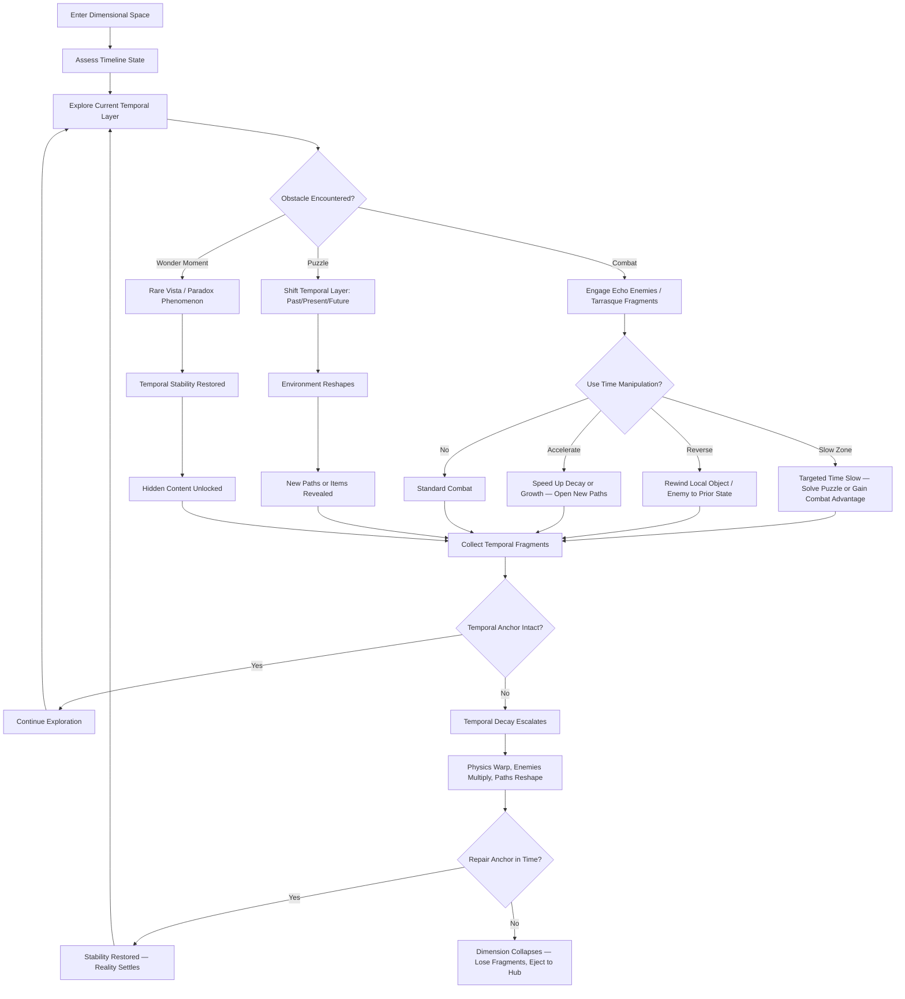
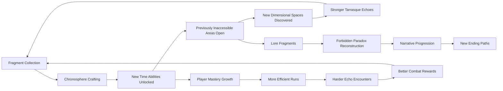
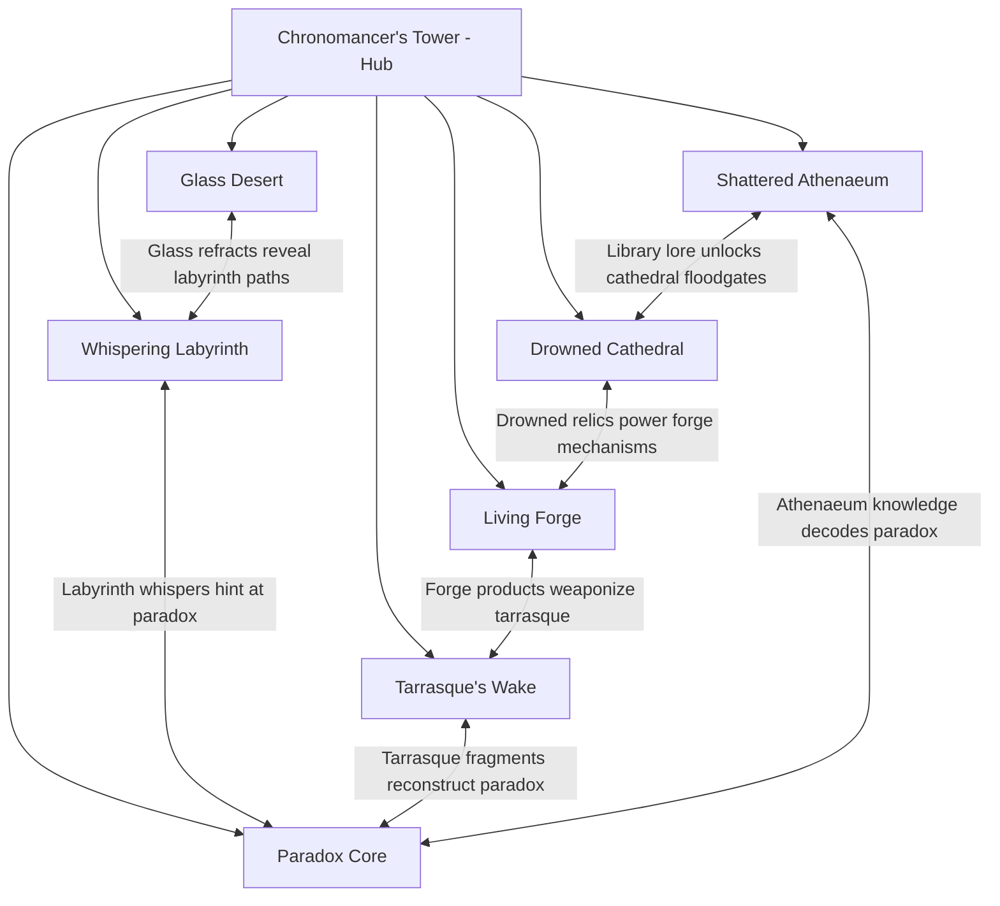
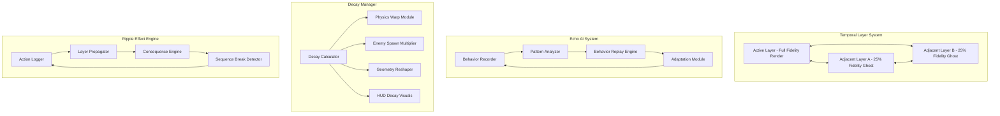

# Chronomancer's Respite

## Title & Genre

| Field | Value |
|-------|-------|
| **Title** | Chronomancer's Respite |
| **Genre** | Action-Adventure / Metroidvania-Adjacent Exploration |
| **Subgenre** | Time-Manipulation Puzzle Combat |
| **Engine** | Unreal Engine 5.4 (Nanite for dimensional geometry, Lumen for temporal lighting shifts) |
| **Platform** | PC (Steam/Epic), PlayStation 5, Xbox Series X/S |
| **Monetization** | Premium — $59.99 base, story DLC expansions ($14.99 each, 2 planned) |
| **Rating** | ESRB T (Fantasy Violence, Mild Language, Partial Nudity) / PEGI 16 / CERO B |

---

## Vision Statement

Chronomancer's Respite is a time-bending action-adventure where the last chronomancer navigates collapsing interdimensional spaces to collect temporal fragments and reconstruct the forbidden paradox before a tarrasque's paradoxical collapse erases all timelines. Every dimension exists in fractured states of past, present, and future — shifting between them reveals different enemies, hidden passages, and items that only exist in specific temporal layers. Time is simultaneously your weapon, your puzzle-solving tool, and your most dangerous enemy. The longer you remain in a dimension without repairing its temporal anchors, the more unstable reality becomes: physics warp, enemies multiply, paths reshape themselves. You fight temporal echoes of your own failed runs — your past weapons and tactics turned against you. The game exists at the intersection of exploration-driven wonder and systems-driven mastery, where every player's experience diverges based on which timelines they chose to manipulate and which consequences they chose to endure. It is Outer Wilds meets Hollow Knight by way of Majora's Mask.

---

## Core Loop

**Target session length:** 30-90 minutes

### Core Loop Breakdown

| Step | Player Action | System Response | Skill Expression |
|------|--------------|----------------|-----------------|
| 1. Assess | Scan the dimensional space for timeline fractures, anchor integrity, and fragment signals | HUD overlays temporal density heatmap — brighter areas indicate instability or fragments | Environmental literacy, threat assessment |
| 2. Explore | Navigate biomes in current temporal layer, searching for fragments and anchor sites | World state persists per layer — items collected in past stay collected, enemies killed in present respawn in future | Route planning, spatial memory across 3 temporal versions of same space |
| 3. Shift Layers | Activate a dimensional gate to move between past/present/future versions of current area | Environment geometry reshapes: flooded rooms drain in past, crumble in future, stabilize in present. Enemy types change per layer | Spatial reasoning, consequence prediction |
| 4. Time Manipulate | Deploy chronosphere abilities — slow, reverse, or accelerate time in localized zones | Affected objects/enemies obey new temporal rules for 5-12 seconds. Costs chronosphere charge | Puzzle solving, combat timing, resource budgeting |
| 5. Combat | Fight echo enemies, tarrasque fragments, and temporal anomalies | Enemies have temporal signatures — some exist in multiple layers simultaneously, requiring layer-shift combos to defeat | Pattern recognition, multi-layer tactical thinking |
| 6. Repair Anchors | Locate and restore temporal anchors before decay threshold is exceeded | Each repair reduces decay rate for the dimension. Missed anchors accelerate physics warping | Time management, prioritization under pressure |
| 7. Wonder | Discover rare vistas or paradox phenomena (emergent, not scripted) | Restores temporal stability across all layers, unlocks hidden lore or secret areas | Curiosity-driven exploration, patience |
| 8. Extract | Return to Respite Hub with collected fragments | Fragments banked, chronospheres crafted, abilities upgraded | Risk/reward — push deeper or bank progress? |

---

## Meta Loop

### Session-to-Session Progression

### Progression Axes

| Axis | What Grows | How It Feels | Cap |
|------|-----------|-------------|-----|
| **Chronosphere Arsenal** | Number and power of time manipulation abilities (slow, reverse, accelerate, freeze, bifurcate) | Your mastery over time deepens — zones you once struggled through become playgrounds | 6 chronosphere types, each with 4 upgrade tiers |
| **Temporal Tolerance** | How long you can remain in a dimension before decay escalates; decay resistance per layer | The dimensions stop fighting you so aggressively — you earned stability | 10 tolerance tiers, each reducing decay rate by 8% |
| **Echo Suppression** | Ability to resist and counter temporal echoes of your own failed runs | Your past failures stop haunting you — you have transcended them | 5 suppression milestones reducing echo spawn rate |
| **Paradox Reconstruction** | Progress toward rebuilding the forbidden paradox (narrative + mechanical goal) | The central mystery crystallizes — each fragment reveals truth | 33 paradox fragments across all dimensions |
| **Dimensional Map** | Completion across all 7 dimensional spaces, all 3 temporal layers each | The world transforms from incomprehensible to intimately known | 7 dimensions x 3 layers = 21 distinct maps |
| **Player Skill** | Time manipulation timing, multi-layer combat, decay management, route optimization | Invisible but paramount — you die less, explore more, manipulate time with precision | No cap — mastery is perpetual |

---

## Game Mechanics

### Primary Mechanic: Chronosphere System

The chronosphere system is the player's interface with time itself. It operates on a **charge-and-deploy model** with three base abilities that expand into six types through crafting.

**Base Abilities:**

| Ability | Charge Cost | Duration | Radius | Effect |
|---------|-----------|----------|--------|--------|
| **Slow Zone** | 1 charge | 8 seconds | 5 meters | All entities and objects within zone move at 20% speed. Player moves normally. |
| **Reverse Field** | 2 charges | 5 seconds | 3 meters | Targeted object or enemy rewinds to its state 10 seconds prior. Player unaffected. |
| **Accelerate Bubble** | 1 charge | 6 seconds | 4 meters | Entities within zone move at 300% speed. Decay accelerates. Growth triggers. Player moves normally. |

**Unlockable Abilities (crafted from tarrasque echo shards):**

| Ability | Charge Cost | Duration | Radius | Prerequisite | Effect |
|---------|-----------|----------|--------|-------------|--------|
| **Freeze Pulse** | 3 charges | 4 seconds | 6 meters | Slow Zone Tier 3 | Complete temporal stasis for all entities within radius. No exceptions. |
| **Bifurcate** | 4 charges | 10 seconds | Self | Reverse Field Tier 3 | Player splits into two temporal copies. Both act independently. Merged on expiry — health pools combine (lower of two). |
| **Chronobolt** | 1 charge | Instant | Projectile | Accelerate Bubble Tier 2 | Fires a bolt of concentrated temporal energy. On hit: enemy ages forward 30 seconds (armor degrades, buffs expire, spawns die). |

**Charge Economy:**

| Parameter | Value |
|-----------|-------|
| Maximum charges | 8 (base), expandable to 14 via upgrades |
| Charge regeneration | 1 charge per 12 seconds passively, 1 charge per kill in combat |
| Chronosphere crafting | At Respite Hub, using tarrasque echo shards (3 shards = 1 tier upgrade) |
| Overcharge risk | Spending all charges in one dimension without banking triggers temporal backlash — 3-second stun + 1 charge permanently lost until next hub visit |

### Secondary Mechanic: Temporal Decay

Each dimension has an invisible **Decay Meter** (0-100%). It rises based on:

| Decay Source | Rate | Mitigation |
|-------------|------|-----------|
| Time spent in dimension | +2%/minute base | Temporal Tolerance upgrades reduce by 0.3%/tier |
| Chronosphere usage | +3% per ability use | Echo Suppression upgrades reduce by 0.5%/tier |
| Layer shifting | +5% per shift | Shift Efficiency upgrades reduce by 0.8%/tier |
| Anchor destruction (enemy action) | +15% per anchor | Defend anchors proactively |
| Failed echo encounter | +10% per death | Kill echoes faster, use suppression |

**Decay Thresholds:**

| Decay % | Effect | Visual |
|---------|--------|--------|
| 0-25% | Stable | Clear lighting, normal physics |
| 26-50% | Unsettled | Occasional flicker, gravity anomalies (2-3 second floats), distant geometry warps |
| 51-75% | Unstable | Enemies spawn duplicates, paths randomly seal/open, items phase in and out, screen edge distortion |
| 76-99% | Critical | Physics inversion (falling upward, walking on walls), triple enemy density, fragment pickups have 40% chance to phase out before collection |
| 100% | Collapse | Dimension ejects player. Lose 30% of unbanked fragments. All anchors in dimension reset. Must re-enter from entrance. |

### Tertiary Mechanic: Echo Combat

Every failed run in a dimension creates a **temporal echo** — an AI-controlled version of the player that appears in subsequent runs in that same dimension.

| Echo Property | Detail |
|--------------|--------|
| Equipment | Echo uses the weapons and chronosphere loadout the player had during the failed run |
| Behavior | Echo replicates the player's actual combat patterns from the failed run (attack frequency, dodge timing, ability usage) |
| Scaling | Echo scales to the player's current level, so older echoes grow with you |
| Maximum echoes | 3 per dimension. Oldest echo is replaced when a 4th would spawn |
| Reward | Defeating an echo yields 2 tarrasque echo shards + the fragments that echo "stole" from the failed run |
| Difficulty | Echoes that survive multiple encounters learn — they dodge chronosphere abilities you used on them previously |

### Quaternary Mechanic: Dimensional Gates and Ripple Effects

Actions in one temporal layer create consequences in other layers within the same dimension.

| Action in Past | Consequence in Present | Consequence in Future |
|---------------|----------------------|---------------------|
| Destroy a support pillar | Room partially collapsed, new path through rubble | Room fully collapsed, alternate route through ceiling |
| Kill an enemy commander | Weaker enemy group in same location | Enemy faction replaced by wildlife |
| Flood a chamber by opening a water gate | Chamber is a drained basin with collectibles | Chamber is overgrown with vegetation, new enemies |
| Leave an item behind | Item still there, weathered | Item degraded into a different, rarer version |
| Repair a temporal anchor in past | Anchor stronger in present (resists more decay) | Anchor indestructible in future, creates safe zone |

---

## World Design

### Dimensional Spaces (7 Dimensions, 3 Temporal Layers Each)

| Dimension | Theme | Core Hazard | Primary Puzzle Type | Temporal Layers |
|-----------|-------|------------|--------------------| --------------- |
| **The Shattered Athenaeum** | Crumbling library of infinite knowledge; bookshelves extend into void | Gravity inversions in collapsed sections | Book-arrangement sequences where past placement determines present accessibility | Past: Intact library, scholars roam. Present: Half-ruined, spectral scholars. Future: Void-consumed, floating pages. |
| **The Drowned Cathedral** | Flooded gothic cathedral beneath an ocean that does not exist | Rising/falling water levels tied to temporal anchors | Water-level manipulation via gate mechanisms across layers | Past: Dry cathedral, congregation alive. Present: Partially flooded, drowned congregation as enemies. Future: Fully submerged, aquatic aberrations. |
| **The Glass Desert** | Infinite desert of crystalline sand that refracts timelines | Mirages create false paths; crystalline storms cut visibility to 2 meters | Light-refraction puzzles where angling light beams opens chronal passages | Past: Lush oasis, nomadic traders. Present: Crystallizing desert, shard storms. Future: Fully glass, transparent geometry, no visible walls. |
| **The Living Forge** | Bio-mechanical factory that manufactures time itself; gears are organic | Conveyor belts and stamping presses on temporal assembly lines | Assembly-line timing puzzles — route fragments through correct temporal processing | Past: Dormant forge, raw materials. Present: Active forge, automated defenses. Future: Overgrown forge, biological machines fused with mechanics. |
| **The Whispering Labyrinth** | Shifting hedge maze that speaks in riddles; walls rearrange based on sound | Walls shift when the player makes noise (footsteps, combat, abilities) | Sound-based navigation — silent movement reveals paths, noise reshapes the maze | Past: Pristine maze, gardeners tend hedges. Present: Overgrown, walls move constantly. Future: Dead hedges, permanent labyrinth, no more shifting. |
| **The Tarrasque's Wake** | Scarred battlefield where the tarrasque fell; its body warps local time | Residual temporal radiation causes random chronosphere effects | Navigate through the beast's corpse, using its temporal distortions to reach the paradox fragments | Past: Battle in progress, tarrasque alive and fighting. Present: Dead tarrasque, corpse distorts time. Future: Skeleton only, echoes of the battle replay. |
| **The Paradox Core** | The dimensional center where the forbidden paradox was originally cast | Reality itself is inconsistent — rooms do not connect logically | Meta-puzzles requiring actions across all 6 other dimensions to progress | Past: Before the paradox, pristine nexus. Present: Fractured nexus, reality glitches. Future: Reconstructed nexus, if player has enough fragments. |

### Respite Hub: The Chronomancer's Tower

The tower exists outside all dimensions — a safe space between timelines that serves as the player's base.

| Hub Feature | Function |
|------------|----------|
| **Chronoforge** | Craft and upgrade chronospheres using tarrasque echo shards |
| **Fragment Altar** | Bank temporal fragments; view paradox reconstruction progress |
| **Dimensional Map Room** | Track exploration across all dimensions and layers; view decay status |
| **Echo Gallery** | Review and study your active echoes; their loadouts, patterns, and locations |
| **Wonder Archive** | Review discovered wonder moments; unlocks concept art and lore |
| **Tarrasque Observatory** | Monitor the tarrasque's paradoxical collapse timer — the narrative deadline |
| **Gate Chamber** | Select and enter any unlocked dimension |

### Interdimensional Connections

---

## Narrative

### Setting

The world of Aethermere was once protected by the Order of Chronomancers — mages who could perceive and manipulate the flow of time. Three centuries ago, the Order's greatest achievement became its greatest catastrophe: the Forbidden Paradox, a spell designed to permanently freeze a tarrasque in a state of simultaneous life and death, preventing its rampage while preserving the creature's essence for study. The spell worked. Then it did not. The paradox began to collapse, and the shockwave fractured Aethermere into seven interdimensional spaces, each caught in a different temporal state. The Order was annihilated. The tarrasque exists now in a state of paradoxical decay — not dead, not alive, but disintegrating across all timelines simultaneously. When the collapse completes, it will erase not just the tarrasque but every timeline connected to the paradox: which is all of them.

### The Protagonist

You are the last chronomancer — not a survivor of the Order, but someone born after the fracture with an innate connection to temporal magic. You have no memories of the Order's teachings. You discover your abilities when you accidentally slow time during a moment of panic in your village, and a fragment of the Forbidden Paradox crashes through reality into your hands. From that moment, the dimensions begin calling to you. You are not the hero the Order would have chosen. You are the one that remains.

### Narrative Arc

| Act | Focus | Key Events | Emotional Tone |
|-----|-------|-----------|---------------|
| **Act 1: Awakening** (Dimensions 1-2) | Discovery of abilities, first dimensions, understanding the stakes | First chronosphere manifests. Enter Athenaeum and Cathedral. Learn the Order existed. Meet the first echo — realize what echoes are. Discover the tarrasque's collapse has a deadline. | Wonder mixed with dread. The world is beautiful and broken. |
| **Act 2: Understanding** (Dimensions 3-4) | Deepening mastery, Order's history, moral complexity | Enter Glass Desert and Living Forge. Discover the Order knew the paradox would eventually collapse — they built it as a temporary measure, planning to die heroes. Find journals of chronomancers who knew they were sacrificing themselves. Meet echoes of Order members. | Melancholy and respect. The Order were not fools — they were desperate. |
| **Act 3: Confrontation** (Dimensions 5-6) | The tarrasque's perspective, the cost of reconstruction | Enter the Labyrinth and Tarrasque's Wake. Experience the tarrasque's suffering through temporal echoes — it is in agony, has been for centuries. Learn the paradox reconstruction will permanently kill the tarrasque. The creature is not evil — it is a victim of the Order's desperation. | Moral weight. The "monster" is suffering. The "heroes" caused this. |
| **Act 4: Resolution** (Dimension 7) | The paradox core, final choice, ending bifurcation | Enter the Paradox Core with sufficient fragments. Confront the paradox itself. Final choice: complete reconstruction (kill the tarrasque, save all timelines) or absorb the paradox (save the tarrasque, bind its collapse to yourself, become the new paradox). | Catharsis. No clean answer. Either choice costs something irreplaceable. |

### Endings

| Ending | Condition | Outcome |
|--------|-----------|---------|
| **The Martyr's Paradox** | Complete reconstruction, high fragment count, low echo kills | Tarrasque dies peacefully. All timelines stabilize. Player is celebrated in lore but the chronomancer line ends. Post-credits: a child in the village slows time during a moment of panic. |
| **The Chronomancer's Burden** | Absorb the paradox, high fragment count, high echo kills | Tarrasque is freed. Timelines stabilize but remain fragile. Player becomes a living paradox — immortal, frozen between moments, the new anchor. Post-credits: the tarrasque, free, looks up at the sky and roars — not in rage, but relief. |
| **The Fractured Inheritance** | Complete reconstruction, low fragment count | Tarrasque dies. Timelines partially stabilize — some dimensions are lost permanently. Player survives but Aethermere is diminished. Bittersweet. |
| **The Unwoven** | Absorb the paradox, low fragment count | Absorption fails catastrophically. Player and tarrasque both fragment across all timelines. Dimensions scatter further. Bleakest ending. Requires specific choices to avoid. |

### Environmental Storytelling

The narrative is delivered primarily through environmental cues rather than cutscenes:

| Delivery Method | Percentage of Lore | Example |
|----------------|-------------------|---------|
| **Environmental cues** | 40% | The arrangement of fallen furniture in the Athenaeum reveals scholars were trying to escape mid-ritual |
| **Echo encounters** | 25% | An Order chronomancer echo relives its final moments, casting a spell that the player can decipher |
| **Paradox fragments** | 20% | Each fragment contains a memory fragment from the original casting — visions, not text |
| **NPC interactions** | 10% | A single recurring NPC: a temporal ghost who exists in all dimensions simultaneously, offering cryptic guidance |
| **Wonder moments** | 5% | Rare vistas show Aethermere before the fracture — silent, breathtaking, tragic |

---

## Player Personas

| Persona ID | Name | Archetype | Relevance |
|-----------|------|-----------|-----------|
| P-003 | Hiroshi Tanaka | The RPG Addict | System depth seeker — will theorycraft chronosphere loadouts, map all 21 dimensional layers, pursue all endings. Core audience for the crafting and mastery systems. |
| P-006 | Eleanor Vance | The Loyal Strategist | Values intellectual depth and fair design — the temporal decay system and multi-layer puzzle design reward her patience and planning. Dislikes predatory monetization — premium model aligns with her preferences. |
| P-008 | David Park | The Achievement Hunter | Will pursue 100% completion: all chronosphere upgrades, all lore fragments, all wonder moments, all endings. Drives achievement system design — every collectible must be achievable through skill, not RNG. |
| P-009 | Liam O'Connor | The Dedicated F2P | Premium buy-in but then no microtransactions — respects his "pay once, earn everything through skill" ethos. Will create guides for optimal decay management and echo strategies. |

---

## User Stories

### Exploration and Navigation

| ID | Story | Acceptance Criteria | Priority |
|----|-------|-------------------|----------|
| US-001 | As a player, I shift between past/present/future layers within a dimension so that I can access areas that only exist in specific temporal states. | Layer shift completes within 2 seconds. Visual transition clearly communicates new temporal state. All geometry and enemies update correctly. | P0 |
| US-002 | As a player, I view a temporal density heatmap overlay so that I can identify areas of high instability and fragment concentration. | Heatmap renders in real-time, updates as decay changes. Toggle on/off with single button press. | P1 |
| US-003 | As a player, I navigate the Whispering Labyrinth silently so that walls do not shift and I can learn the correct path. | Noise meter visible on HUD. Walls remain static when noise is below threshold. Sprinting, combat, and chronosphere use generate noise. | P0 |
| US-004 | As a player, I discover wonder moments through exploration so that temporal stability is restored and hidden content is unlocked. | Wonder moments trigger automatically when player enters specific vantage points with low decay. No UI prompt — pure discovery. At least 2 per dimension. | P1 |
| US-005 | As a player, I track my exploration progress across all dimensions and temporal layers on the dimensional map so that I know what I have completed. | Map shows completion percentage per dimension, per layer. Unvisited areas are obscured. Visited areas show anchor status and fragment locations. | P0 |

### Time Manipulation

| ID | Story | Acceptance Criteria | Priority |
|----|-------|-------------------|----------|
| US-006 | As a player, I deploy a Slow Zone to reduce enemy and object speed so that I can solve timing puzzles or gain a combat advantage. | Slow Zone affects all entities within 5m radius. Player moves at normal speed. Duration: 8 seconds. Visual distortion effect clearly delineates zone boundary. | P0 |
| US-007 | As a player, I use Reverse Field to rewind an object or enemy to its prior state so that I can undo environmental changes or weaken enemies. | Targeted entity reverts to its state 10 seconds prior. Duration: 5 seconds. Cooldown prevents spam. Cannot reverse the player character. | P0 |
| US-008 | As a player, I activate Accelerate Bubble to speed up entities and objects so that I can trigger growth, decay, or mechanical processes faster. | Entities within 4m radius move at 300% speed for 6 seconds. Decay rate in zone triples. Can grow vegetation to create platforms, decay barriers to open paths. | P0 |
| US-009 | As a player, I craft new chronosphere types at the Chronoforge so that I can access advanced time manipulation abilities. | Crafting menu shows required shards and resulting ability. Crafting is instant. New ability appears in loadout on next dimension entry. | P0 |
| US-010 | As a player, I manage my chronosphere charges carefully so that I do not trigger temporal backlash from overcharge. | Charge count visible on HUD at all times. Backlash triggers only when all charges are spent in a single dimension without banking. Warning at 2 remaining charges. | P1 |

### Combat

| ID | Story | Acceptance Criteria | Priority |
|----|-------|-------------------|----------|
| US-011 | As a player, I fight temporal echoes of my own failed runs so that I can recover lost fragments and earn tarrasque echo shards. | Echoes replicate player's actual loadout and combat patterns from the failed run. Maximum 3 echoes per dimension. Defeating an echo yields 2 shards + lost fragments. | P0 |
| US-012 | As a player, I face enemies that exist across multiple temporal layers simultaneously so that I must coordinate attacks across layers to defeat them. | Cross-layer enemies show ghostly afterimages in adjacent layers. Damage carries across layers. Layer-shift during combat maintains lock-on. | P1 |
| US-013 | As a player, I engage tarrasque fragments — pieces of the tarrasque that have broken off into dimensions — as boss encounters. | Tarrasque fragments are multi-phase fights. Each fragment has unique temporal distortion aura. Defeating a fragment yields 5 echo shards + a paradox fragment. | P0 |
| US-014 | As a player, I use chronosphere abilities in combat to create tactical advantages so that I can overcome enemies stronger than my raw stats allow. | Slow Zone + melee combo yields 1.5x damage multiplier. Reverse Field on enemy buff strips it. Accelerate Bubble on self increases attack speed. | P0 |
| US-015 | As a player, I observe echoes learning from my tactics so that I must vary my approach across encounters. | Echoes that survive 2+ encounters begin dodging chronosphere abilities used against them previously. Visual cue when echo adapts. Forces loadout rotation. | P2 |

### Temporal Decay and Anchors

| ID | Story | Acceptance Criteria | Priority |
|----|-------|-------------------|----------|
| US-016 | As a player, I monitor the temporal decay meter so that I can decide whether to push deeper or bank my fragments and extract. | Decay meter visible on HUD. Color-coded: green/yellow/orange/red. Percentage shown numerically. Audible ambient distortion increases with decay. | P0 |
| US-017 | As a player, I repair temporal anchors in a dimension so that the decay rate decreases and the dimension stabilizes. | Each dimension has 3-5 anchors. Repair requires holding interact for 4 seconds while undamaged. Each repair reduces decay rate by 20% for that dimension. | P0 |
| US-018 | As a player, I experience escalating temporal decay effects so that the dimension feels increasingly hostile the longer I stay. | Effects escalate at 25%, 50%, 75%, 100% thresholds. Physics anomalies, enemy duplication, path reshaping all trigger as documented in mechanics. | P0 |
| US-019 | As a player, I get ejected from a dimension when decay reaches 100% so that I lose unbanked fragments but am not softlocked. | Ejection cutscene plays. Player returns to hub with 70% of unbanked fragments retained. All anchors in dimension reset. Clear failure state, not death. | P0 |
| US-020 | As a player, I defend temporal anchors from enemy destruction so that the dimension does not destabilize faster than I can manage. | Certain enemies target anchors. Anchor takes damage over 10 seconds if undefended. Destroyed anchor adds 15% decay instantly. Repairable but costly. | P1 |

### Dimensional Ripple Effects

| ID | Story | Acceptance Criteria | Priority |
|----|-------|-------------------|----------|
| US-021 | As a player, I perform an action in a past temporal layer and observe the consequence in present and future layers so that I can strategically shape the environment. | Ripple effects propagate within 3 seconds of layer shift. Consequences are logical (destroy support then partial collapse then full collapse). Visual indicator shows "this was changed by your actions." | P0 |
| US-022 | As a player, I flood a chamber in the past layer so that it becomes a drained basin with collectibles in the present and an overgrown garden in the future. | Water gate mechanic in Drowned Cathedral. Three distinct environmental states per layer. Items unique to each state. | P1 |
| US-023 | As a player, I leave an item behind in the past layer so that it appears as a degraded, rarer version in the future layer. | Item degradation system tracks abandoned items. Future version is always different and always rarer. Encourages strategic sacrifice. | P2 |

### Hub and Progression

| ID | Story | Acceptance Criteria | Priority |
|----|-------|-------------------|----------|
| US-024 | As a player, I bank temporal fragments at the Fragment Altar so that they are protected from decay ejection losses. | Banking is instant. Fragment count updates in paradox reconstruction progress. UI shows how many fragments remain unbanked during dimension runs. | P0 |
| US-025 | As a player, I craft chronosphere upgrades at the Chronoforge using tarrasque echo shards so that my time manipulation abilities grow more powerful. | Each upgrade tier costs 3 shards. 4 tiers per chronosphere type. Upgrade effects are tangible and testable (longer duration, wider radius, reduced charge cost). | P0 |
| US-026 | As a player, I view my active echoes in the Echo Gallery so that I can study their loadouts and plan my approach before re-entering a dimension. | Gallery shows each echo's weapon, chronosphere loadout, behavioral patterns, and dimension location. Study mode allows replay of echo's origin death. | P1 |
| US-027 | As a player, I observe the tarrasque's collapse timer in the observatory so that I understand the narrative urgency of my mission. | Timer counts down in real-time (cosmetic — no fail state from time). Visual representation of the tarrasque's state across timelines. Narrative flavor text updates with progress. | P2 |

### Narrative and Wonder

| ID | Story | Acceptance Criteria | Priority |
|----|-------|-------------------|----------|
| US-028 | As a player, I discover lore through environmental cues rather than cutscenes so that the narrative feels organic and earned. | No unskippable cutscenes. Lore delivered through environmental arrangement, echo behavior, fragment visions, and wonder moments. Player can miss lore without being blocked. | P0 |
| US-029 | As a player, I encounter Order chronomancer echoes who relive their final moments so that I understand the history and sacrifice of the Order. | Order echoes are distinct from player echoes. They speak fragmented dialogue. Their spellcasting reveals lore about the Forbidden Paradox. | P1 |
| US-030 | As a player, I make a final choice at the Paradox Core that determines the ending so that my playstyle and decisions are reflected in the outcome. | Ending determined by: fragment count (high/low), echo kills (high/low), and final binary choice. Four distinct endings with unique cutscenes and post-credits sequences. | P0 |

### Accessibility and Platform

| ID | Story | Acceptance Criteria | Priority |
|----|-------|-------------------|----------|
| US-031 | As a player, I remap all controls so that I can play comfortably regardless of handedness or input preference. | Full button remapping on all platforms. Multiple preset layouts. Settings persist across sessions. | P0 |
| US-032 | As a player, I adjust decay speed in an assist mode so that I can experience the game at a less punishing pace. | Assist mode is clearly labeled as optional. Reduces base decay rate by 50%. Does not disable achievements. Separate from difficulty selection. | P1 |
| US-033 | As a player, I use subtitle and UI scaling options so that text remains readable on all display sizes. | Subtitle size: small/medium/large/extra-large. UI scale: 80%-150%. All text meets WCAG AA contrast ratios. | P0 |
| US-034 | As a player, I play offline without internet so that I can enjoy the full game during travel or network outages. | All gameplay functional offline. Leaderboards and map sharing unavailable but non-blocking. No always-online check. | P0 |

---

## Monetization

### Revenue Model

| Stream | Price | Content | Rationale |
|--------|-------|---------|-----------|
| **Base Game** | $59.99 | All 7 dimensions, full narrative, all endings, all chronosphere types | Premium model respects P-006 and P-009 — pay once, earn everything |
| **DLC 1: The Forgotten Order** | $14.99 | 2 new dimensions (Order training grounds, the chronomancer's original laboratory), 4 new chronosphere upgrades, new ending | Narrative expansion that deepens Order lore |
| **DLC 2: The Tarrasque's Dream** | $14.99 | Play as the tarrasque in its own timeline during the paradox. 1 new dimension (the tarrasque's consciousness), new combat mechanics | Perspective shift — experienced players understand the creature's suffering |
| **Digital Deluxe Edition** | $79.99 | Base game + season pass (both DLCs) + digital artbook + soundtrack | Captures P-008 completionist spend |
| **Soundtrack** | $9.99 standalone | Full orchestral soundtrack, 48 tracks | Ancillary revenue from P-003 and P-008 audiophiles |

### No Microtransactions

The game contains zero in-game purchases after initial buy. No currency, no cosmetics, no battle pass, no time-savers. Every item, ability, and piece of content is earned through gameplay.

**Why:** The premium-only model is a core design pillar. The echo combat system — where your failures literally come back to fight you — would be undermined by any ability to pay away consequences. P-006 (Eleanor) and P-009 (Liam) represent significant audience segments who actively avoid games with microtransactions. The design is stronger when every player faces the same systems.

### Revenue Projections

| Scenario | Units Sold (Year 1) | Revenue (Year 1) | DLC Attach Rate | Total Revenue (Year 2) |
|----------|--------------------|--------------------|----------------|-----------------------|
| Conservative | 85,000 | $5,099,150 | 18% | $5,932,826 |
| Moderate | 210,000 | $12,597,900 | 28% | $15,483,458 |
| Optimistic | 500,000 | $29,995,000 | 35% | $37,793,750 |

---

## Production Plan

### Team Size and Roles

| Discipline | Headcount | Role |
|-----------|-----------|------|
| **Design** | 3 | Lead Designer (systems), Level Designer (dimensions), Narrative Designer |
| **Engineering** | 5 | Lead Engine, Gameplay Programmer x2, AI Programmer (echo system), Tools Programmer |
| **Art** | 5 | Art Director, Environment Artist x2, Character/Enemy Artist, VFX Artist (temporal effects) |
| **Audio** | 2 | Composer, Sound Designer |
| **Production** | 1 | Producer |
| **QA** | 2 | QA Lead, QA Tester |
| **Total** | **18** | |

### Development Timeline

| Phase | Duration | Milestones | Deliverables |
|-------|----------|-----------|-------------|
| **Pre-Production** | Months 1-4 | Prototype vertical slice of 1 dimension with all 3 temporal layers | Core chronosphere system playable. Temporal decay functional. Echo combat prototype. One boss fight. |
| **Production Alpha** | Months 5-14 | All 7 dimensions grayboxed. All chronosphere types implemented. Echo system complete. | Playable start to finish with placeholder art. All mechanics functional. Internal playtest ready. |
| **Production Beta** | Months 15-20 | Final art pass on all dimensions. Full narrative implemented. All 4 endings. | Content complete. No placeholder assets. Full playthrough possible. External playtest begins. |
| **Polish** | Months 21-24 | Performance optimization, accessibility pass, platform certification, bug triage | Gold master candidate. Platform compliance met. Performance targets hit on all platforms. |
| **Launch** | Month 25 | Release on PC, PS5, Xbox Series X/S | Day-one patch pipeline established. Server infrastructure for leaderboards active. |
| **Post-Launch** | Months 26-36 | DLC 1 (month 28), DLC 2 (month 34), patches, community support | Two DLC expansions. Balance patches based on player data. |

### Budget Estimate

| Category | Cost | Notes |
|----------|------|-------|
| Salaries (18 people x 24 months avg) | $3,240,000 | Blended average $7,500/month across all disciplines |
| Unreal Engine 5 licensing | $0 (until revenue) | 5% royalty after first $1M gross revenue per product |
| Software and Tools | $48,000 | Perforce, Jira, Confluence, dev kits, DAW licenses |
| Hardware | $35,000 | Dev machines, test consoles, capture equipment |
| Audio (orchestral recording) | $80,000 | 48-track orchestral score, 2-day studio session |
| QA outsourcing (beta phase) | $60,000 | External QA for platform compliance and regression |
| Marketing | $300,000 | Pre-release marketing, influencer outreach, trailer production |
| Contingency (15%) | $564,900 | Standard industry contingency |
| **Total** | **$4,327,900** | |

### Key Risks

| Risk | Probability | Impact | Mitigation |
|------|------------|--------|-----------|
| Temporal decay system too punishing in playtesting | High | High | Assist mode with adjustable decay speed. Extensive playtest iteration in alpha. |
| Echo AI replication of player patterns is technically complex | Medium | Medium | Dedicated AI programmer. Prototype in pre-production. Fallback to scripted behavior if learning system fails. |
| Performance hits from rendering 3 temporal layers of same space | Medium | High | Engine programmer focuses on temporal layer streaming. Only render active layer fully; adjacent layers at 25% fidelity for ghostly afterimages. |
| Ripple effect system creates unintended sequence breaks | High | Medium | Exhaustive QA on all dimension connections. Design ripple effects as additive (create new options) not subtractive (block existing paths). |
| Premium $59.99 price point limits audience in market shifting to F2P | Medium | Medium | Game's quality and depth justify premium. No microtransactions is a marketing differentiator. Deluxe edition captures higher willingness-to-pay. |

---

## Technical Requirements

### Minimum Specifications (PC)

| Component | Requirement |
|-----------|------------|
| **OS** | Windows 10 (64-bit, version 1909+) |
| **CPU** | Intel i7-9700K / AMD Ryzen 7 3700X |
| **GPU** | NVIDIA RTX 2070 Super / AMD RX 5700 XT |
| **RAM** | 16 GB DDR4 |
| **Storage** | 50 GB SSD (NVMe recommended for temporal layer streaming) |
| **DirectX** | Version 12 Ultimate |

### Recommended Specifications (PC)

| Component | Requirement |
|-----------|------------|
| **OS** | Windows 11 (64-bit) |
| **CPU** | Intel i7-12700K / AMD Ryzen 7 5800X |
| **GPU** | NVIDIA RTX 3070 / AMD RX 6800 XT |
| **RAM** | 32 GB DDR4 |
| **Storage** | 50 GB NVMe SSD |
| **DirectX** | Version 12 Ultimate |

### Console Specifications

| Platform | Target | Notes |
|----------|--------|-------|
| **PlayStation 5** | Native 4K at 30 FPS / Dynamic 1440p at 60 FPS | DualSense haptic feedback for temporal decay rumble pattern; adaptive triggers for chronosphere charge feel |
| **Xbox Series X** | Native 4K at 30 FPS / Dynamic 1440p at 60 FPS | Quick Resume supported for dimension switching |
| **Xbox Series S** | Dynamic 1080p at 60 FPS | Reduced temporal layer streaming distance; same gameplay |

### Performance Targets

| Metric | Target | Hard Floor |
|--------|--------|-----------|
| Frame rate (performance mode) | 60 FPS | 45 FPS |
| Frame rate (quality mode) | 30 FPS | 28 FPS |
| Temporal layer transition | 2 seconds max | 3 seconds max |
| Chronosphere deployment | 100ms input-to-effect max | 150ms max |
| Load time (dimension entry) | 8 seconds (NVMe) | 12 seconds |
| Memory budget | 10 GB VRAM, 12 GB system RAM | 12 GB VRAM, 16 GB system RAM |

### Engine Architecture Notes

### Key Technical Systems

| System | Description | Complexity |
|--------|-------------|-----------|
| **Temporal Layer Streaming** | Three versions of each environment loaded simultaneously with priority-based LOD. Active layer at full fidelity, adjacent layers at 25% for ghostly afterimages. Seamlessly swap on layer shift. | High |
| **Echo Behavior Recorder** | Records player actions (movement vectors, attack timing, ability usage, positioning) during each dimension run. Failed run data becomes echo AI behavior. Pattern analyzer extracts combat style. | High |
| **Echo Adaptation Module** | Echoes that survive multiple encounters flag which chronosphere abilities were used against them. Adaptation adds dodge probability for flagged abilities in subsequent encounters. | Medium |
| **Decay Calculator** | Aggregates time-in-dimension, ability usage, layer shifts, anchor status into a single decay percentage. Triggers threshold-based effects across physics, spawning, geometry, and UI subsystems. | Medium |
| **Ripple Effect Engine** | Logs player actions in one temporal layer and propagates logical consequences to adjacent layers. Each dimension has a predefined consequence table for major interactable objects. | High |
| **Chronosphere Charge Manager** | Tracks charge count, regeneration timer, overcharge state. All chronosphere abilities query this system before deployment. Handles backlash penalty. | Low |

### Network Requirements

| Feature | Requirement | Bandwidth |
|---------|------------|-----------|
| **Gameplay** | Fully offline capable | 0 KB/s |
| **Leaderboards** | Optional, online only | Less than 1 KB per query |
| **Dimensional Map Sharing** | Upload/download custom map annotations | Less than 50 KB per map |
| **Leaderboard sync** | Automatic when online | Less than 5 KB per session |

### Accessibility Features

| Feature | Implementation |
|---------|---------------|
| **Full control remapping** | All buttons remappable on all platforms. 4 preset layouts included. |
| **Decay assist mode** | Reduces base decay rate by 50%. Clearly labeled as optional. Does not disable achievements. |
| **Difficulty presets** | Story (minimal combat damage, generous decay), Standard (balanced), Mastery (faster decay, aggressive echoes). |
| **Subtitle options** | Size: S/M/L/XL. Background opacity: 0-100%. Speaker labels toggleable. |
| **UI scaling** | 80%-150% scale. All interactive elements meet minimum touch/click target sizes. |
| **Colorblind modes** | Protanopia, deuteranopia, tritanopia modes. Decay meter uses shape + color coding, not color alone. |
| **Temporal layer indicators** | Each layer has distinct color tint AND geometric indicator (past = triangle, present = square, future = circle). Not color-only differentiation. |
| **Screen shake toggle** | Adjustable intensity 0-100%. Temporal decay visual distortion can be reduced independently. |
