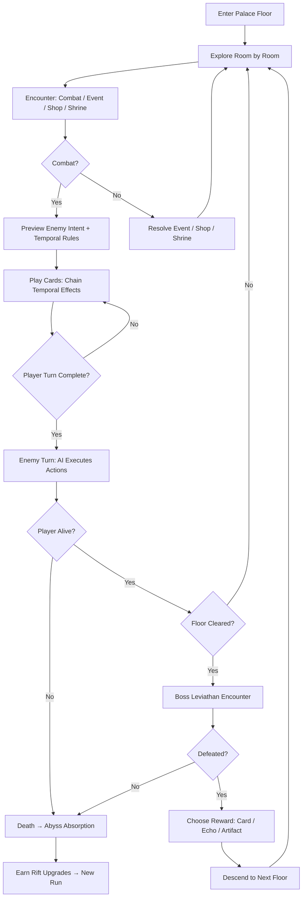
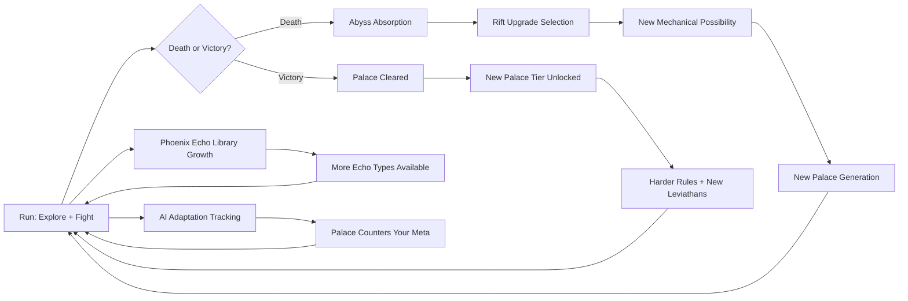

# Chronos Orb

## Title & Genre

| Field | Value |
|-------|-------|
| **Title** | Chronos Orb |
| **Genre** | Roguelike / Card Battler / Strategy RPG |
| **Engine** | Unity 2023 LTS (2D tile-based with 3D lighting pass) |
| **Platform** | PC (Steam, GOG), Nintendo Switch |
| **Monetization** | Premium — $29.99 base, $14.99 DLC expansions |
| **Rating** | ESRB T (Fantasy Violence, Mild Alcohol Reference) / PEGI 12 / CERO B |

---

## Vision Statement

Chronos Orb is a roguelike card battler where you manipulate time to reshape the battlefield, then battle leviathans using time-bending tactics inside procedurally generated crystalline palaces. You are a chronomancer trapped inside a self-repairing dimensional structure — a palace that rebuilds itself every time you die, remembering your past attempts and weaponizing them against you. Your only tools are temporal cards (reverse, accelerate, pause, loop) and the phoenix echoes of enemies you have already killed, who return as spectral allies in future timelines. Death is not failure — it is the core resource. Every run feeds the abyss, and the abyss feeds back permanent upgrades through dimensional rifts, not stat boosts but new mechanical possibilities: new card modifiers, new echo types, new temporal rules you can impose on palace rooms. The game lives at the intersection of Slay the Spire's tactical card play, Into the Breach's deterministic combat preview, and Returnal's "death is progress" loop. It is designed for players who think in chains — who see five moves ahead and want a game that sees six.

---

## Core Loop

**Target session length:** 30–60 minutes per run



### Core Loop Breakdown

| Step | Player Action | System Response | Skill Expression |
|------|--------------|----------------|-----------------|
| 1. Enter Floor | Choose entry point (front gate, side breach, rift tear) | Palace generates floor layout with 8–14 rooms. Each room has a temporal rule (frozen, accelerating, looping, reversed). Entry point determines starting hand size and orb charge. | Route planning, risk assessment |
| 2. Explore | Move between rooms on minimap. Rooms are revealed as adjacent rooms are entered. | Connected rooms share temporal rules. Entering a "frozen" room pauses enemy intent previews for that room only. "Accelerating" rooms give enemies 2 actions per turn. | Spatial strategy, rule exploitation |
| 3. Card Combat | Play temporal cards from hand. Cards chain — playing Reverse before Accelerate on a target reverses its acceleration, slowing it instead. | Each card resolves its effect then shifts the timeline state. Chained cards multiply effects (2-card chain = 1.5x, 3-card = 2x, 4-card = 3x, 5-card = 5x). Visual timeline bar shows current temporal state. | Card sequencing, synergy recognition, combo optimization |
| 4. Phoenix Echo | Deploy a spectral phoenix echo of a previously defeated enemy type | Echo acts as an ally for the combat. AI follows simplified version of original enemy behavior. Echo HP = 40% of original. Echo dissolves after 3 turns or when HP reaches 0. | Resource management — echoes are limited per run |
| 5. Boss Encounter | Face a leviathan (multi-phase boss) using all accumulated cards, echoes, and artifacts | Leviathan AI adapts based on your run history — if you used fire chains last run, this run's leviathan has fire resistance. Phase transitions introduce new temporal rules mid-fight. | Adaptability, build diversity pressure |
| 6. Death | Die to enemies or leviathan | All accumulated progress (cards found, enemies defeated, rooms explored) absorbed by the abyss. The palace remembers your build path and will counter it in future runs. | Long-term strategic planning across runs |
| 7. Rift Upgrades | Select 1–3 permanent upgrades from dimensional rift | Upgrades are mechanical (new card modifiers, new echo slots, new starting cards), not numerical (no +10% damage). The rift offers 3 choices, player picks 1. | Build definition across runs |

---

## Meta Loop

### Run-to-Run Progression



### Progression Axes

| Axis | What Grows | How It Feels | Cap |
|------|-----------|-------------|-----|
| **Card Library** | New cards discovered across runs, added to draft pool for future runs | Your strategic vocabulary expands. New combos become possible. | 120 unique cards across 6 temporal schools |
| **Rift Upgrades** | Permanent mechanical additions (new card modifiers, echo slots, starting bonuses) | Each death makes the next run fundamentally different, not just easier | 45 rift nodes across 3 trees (Chronomancy, Echo Mastery, Palace Insight) |
| **Phoenix Echo Library** | Every unique enemy type killed becomes a summonable echo in future runs | Your past victories become your future weapons. Death feeds your army. | 38 echo types (one per enemy variant) |
| **Palace Tier** | Clearing a palace unlocks the next tier with harder rules and new leviathans | The palace escalates. New temporal rules. Smarter AI. Your tools must evolve. | 7 palace tiers |
| **AI Adaptation** | The palace tracks your most-used card types, echo strategies, and build paths across runs | The game learns your habits. Your main strategy gets countered. You must diversify. | No cap — AI adapts perpetually |
| **Player Knowledge** | Understanding temporal rule interactions, card chains, enemy patterns, palace layouts | Invisible but decisive — you see chains you didn't see before, exploit rules you once feared | No cap — mastery is perpetual |

---

## Game Mechanics

### Primary Mechanic: Temporal Card System

Cards belong to one of six temporal schools. Each school governs a fundamental manipulation of time in combat.

**The Six Temporal Schools:**

| School | Core Effect | Example Card | Chain Multiplier Effect |
|--------|------------|--------------|------------------------|
| **Reverse** | Undo the last enemy action (cancel attack, reposition enemy) | *Undo Strike* — cancel target's next action, deal 6 damage | Reversed cards apply their effect to the previous action (heals become damage, buffs become debuffs) |
| **Accelerate** | Grant additional actions to self or ally, or speed card resolution | *Temporal Surge* — play your next 2 cards immediately | Accelerated cards resolve twice; chains with Reverse create "slow" debuffs on enemies |
| **Pause** | Freeze an enemy or timeline effect for 1–2 turns | *Stasis Field* — freeze all enemies for 1 turn, you take 1 action | Paused chains extend duration; Pause + Reverse creates permanent stasis on a single target for the combat |
| **Loop** | Repeat the last played card's effect (does not consume the card) | *Time Echo* — repeat your previous card's effect at 60% power | Looped cards grow in power with each loop in a chain (60% → 80% → 100% → 130%) |
| **Fracture** | Split a card into two weaker copies, or split enemy actions into weaker versions | *Shard Assault* — deal 4 damage to 2 targets (from one 8-damage card) | Fractured chains create exponential target count (2 → 4 → 8) with diminishing per-target damage |
| **Converge** | Merge two cards' effects into one enhanced action, or collapse enemy positions | *Singularity* — combine your next 2 cards into 1 action at 180% total power | Converged chains amplify the base multiplier (180% → 220% → 270%) |

**Card Chain Resolution:**

When cards are played in sequence during a single turn, they chain. The chain multiplier applies to all cards in the chain:

| Chain Length | Multiplier | Energy Cost | Risk |
|-------------|-----------|-------------|------|
| 1 card | 1.0x | Normal | None |
| 2 cards | 1.5x | Normal + 1 | Low — second card must be from a compatible school |
| 3 cards | 2.0x | Normal + 2 | Medium — one card must be a catalyst (Loop or Converge) |
| 4 cards | 3.0x | Normal + 3 | High — timeline destabilization bar fills 25% per 4-chain |
| 5 cards | 5.0x | Normal + 4 | Very High — timeline destabilization bar fills 50% per 5-chain |
| 6+ cards | 7.0x + 1.0x per additional | Normal + 5+ | Extreme — destabilization bar fills 75%. At 100% destabilization, the room collapses (instant death, no echo recovery) |

**Timeline Destabilization:**

Every 4+ card chain fills the destabilization bar. This is the risk/reward brake on infinite combos.

| Destabilization % | Visual Effect | Consequence |
|-------------------|--------------|-------------|
| 0–24% | Timeline bar glows faintly | No consequence |
| 25–49% | Screen edges shimmer, cards flicker | Enemy actions gain +1 damage |
| 50–74% | Screen pulses, temporal rules become unpredictable | Random temporal rule applied to next enemy turn |
| 75–99% | Screen cracks, timeline bar fractures | 25% chance each enemy action resolves twice |
| 100% | Screen shatters to white | Room collapse. Instant death. No echo recovery for that run. |

### Secondary Mechanic: Phoenix Echo System

When you kill an enemy for the first time (across any run), its echo is added to your Phoenix Echo Library. In future runs, you can deploy echoes as temporary allies.

**Echo Deployment Rules:**

| Property | Value |
|----------|-------|
| Echoes per combat | 1 base, +1 per Echo Mastery rift node (max 3) |
| Echo HP | 40% of original enemy HP |
| Echo duration | 3 turns, then dissolves |
| Echo AI | Simplified version of original enemy behavior (no adaptive counter-strategies) |
| Echo attacks | Deal 50% of original enemy damage |
| Echo special | 1 use of original enemy special ability at 60% effectiveness |

**Echo Categories:**

| Category | Echo Count | Deploy Cost | Example |
|----------|-----------|-------------|---------|
| **Minion** | 14 types | 1 Echo Charge | Crystal Crawler — applies 2 fragile stacks to one enemy |
| **Sentinel** | 10 types | 2 Echo Charges | Time Warden — freezes 1 enemy for 1 turn |
| **Bruiser** | 8 types | 2 Echo Charges | Phase Golem — absorbs 15 damage directed at player |
| **Caster** | 6 types | 3 Echo Charges | Rift Channeler — copies player's last card at 50% power |

**Echo Charge Economy:**

- Start each run with 3 Echo Charges
- Gain 1 Echo Charge per combat victory
- Gain 2 Echo Charges at shrine rooms
- Shop rooms sell Echo Charges for 30 gold each (max 2 per shop)
- Maximum 8 Echo Charges held at once

### Secondary Mechanic: Palace Generation & Temporal Rules

Each palace floor generates with a set of temporal rules that affect all combat and events on that floor.

**Room Types:**

| Room Type | Frequency | Content | Temporal Rule |
|-----------|-----------|---------|---------------|
| Combat | 40% | 2–5 enemies drawn from floor's enemy pool | Floor's temporal rule active |
| Elite Combat | 10% | 1 elite enemy + 1–2 minions. Higher reward. | Floor's temporal rule + elite modifier |
| Event | 15% | Text-based encounter with 2–3 choices | Temporal rule affects outcome weights |
| Shop | 10% | Buy cards, remove cards, buy artifacts, buy echo charges | Paused (no temporal effect in shops) |
| Shrine | 8% | Choose 1 of 3 blessings (temporary buff for this floor) | Shrine's blessing overrides temporal rule for next combat |
| Treasure | 7% | Free card pick, artifact, or echo charge | Room-specific temporal rule (random) |
| Rest | 5% | Heal 25% HP or upgrade 1 card | Paused |
| Leviathan | 5% | Boss fight (1 per floor, always last room) | Boss imposes its own temporal rules by phase |

**Temporal Rule Effects on Combat:**

| Rule | Effect on Player | Effect on Enemies | Strategic Implication |
|------|-----------------|-------------------|----------------------|
| Frozen | Gain +1 card draw per turn | Enemies do not preview intent (hidden actions) | High information asymmetry — you have more options but less knowledge |
| Accelerating | Enemies take 2 actions per turn | Enemies take 2 actions per turn | Symmetrical pressure — fast and lethal for both sides |
| Looping | At end of turn, repeat your lowest-cost card | At end of turn, repeat their weakest action | Free value — plan your lowest-cost card carefully |
| Reversed | Healing deals damage to you; damage heals enemies | Same rules apply to enemies | Counter-intuitive — bring indirect damage (poison, echo attacks, artifacts) |
| Fractured | All cards play twice at 50% power | All enemy actions trigger twice at 50% power | Favors multi-hit cards; single big hits are inefficient |
| Converging | Your first 2 cards each turn merge into 1 action at 180% | First 2 enemy actions merge into 1 at 180% | Rewards planning your first 2 plays; punishment for careless openers |

### Secondary Mechanic: Abyssal Integration (Permanent Progression)

On death, all run progress is absorbed by the abyss. The player selects rift upgrades from three interlocking trees.

**Rift Upgrade Trees:**

| Tree | Focus | Nodes | Example Upgrades |
|------|-------|-------|-----------------|
| **Chronomancy** | Card manipulation and chain power | 15 | *Temporal Efficiency* — 4-card chains cost 1 less energy. *School Fusion* — 2 schools count as compatible for chain purposes. *Chain Mastery* — 5-card chains fill destabilization bar 10% less. |
| **Echo Mastery** | Echo deployment and library growth | 15 | *Extended Resonance* — echoes last 4 turns instead of 3. *Dual Deployment* — can deploy 2 echoes per combat. *Echo Amplification* — echo HP increased to 55% of original. |
| **Palace Insight** | Palace navigation and rule manipulation | 15 | *Rule Reader* — see temporal rules of adjacent rooms before entering. *Rule Shifter* — once per floor, change one room's temporal rule. *Cartographer* — start each floor with 3 rooms revealed on minimap. |

**Unlock Structure:**

- Each tree has 5 tiers of 3 nodes each
- Tier 1 nodes cost 1 rift point, Tier 2 cost 2, Tier 3 cost 3, Tier 4 cost 4, Tier 5 cost 5
- Rift points earned: 1 per floor reached, +2 for killing a leviathan, +1 for discovering a new echo type
- Total rift points to max all trees: 135 (requires ~45–60 runs depending on performance)
- Trees can be respec'd freely at the rift altar between runs

### Leviathan Boss Design

Leviathans are multi-phase bosses that adapt across runs. Each palace tier ends with a unique leviathan.

| Tier | Leviathan Name | Phases | Temporal Rule Imposed | Adaptive Behavior |
|------|---------------|--------|----------------------|-------------------|
| 1 | Crystal Warden | 2 | Accelerating (Phase 2) | Remembers your most-used school from previous runs; gains 20% resistance to it |
| 2 | Chrono Hydra | 2 | Looping (Phase 1) → Frozen (Phase 2) | Remembers your preferred opening card; opens with a counter to it |
| 3 | Phase Shifter | 3 | Reversed (Phase 2) → Fractured (Phase 3) | Tracks your echo deployment timing; summons adds when you deploy echoes |
| 4 | Rift Colossus | 3 | Converging (Phase 1) → Accelerating (Phase 2) → Looping (Phase 3) | Remembers your full deck composition from last attempt; targets your weakest school |
| 5 | Temporal Weaver | 3 | Rotates rules every 2 turns | Remembers your chain patterns; interrupts chains that match your last-run patterns |
| 6 | Abyssal Sovereign | 4 | All rules rotate by phase; Phase 4 has no rule (pure combat) | Full run-history analysis: counters your top 3 most-used strategies simultaneously |
| 7 | Chronos Eternal | 4 | Player chooses the rule each phase (from 3 random options) | Remembers every run ever played; adapts to lifetime patterns, not just the last run |

---

## World Design

### Setting: The Crystalline Palaces

The game takes place inside a network of self-repairing crystalline structures that exist outside normal time. Each palace is a living entity that rebuilds itself after every intruder death, learning from the intrusion patterns. The palaces are the prison, the antagonist, and the puzzle.

**Visual Architecture:**

```
                    ┌─────────────────────────┐
                    │    PALACE TIER 7         │
                    │  CHRONOS ETERNAL         │
                    │  (Heart of the Orb)      │
                    └────────────┬────────────┘
                                 │
               ┌─────────────────┴─────────────────┐
               │                                     │
    ┌──────────┴──────────┐            ┌─────────────┴────────────┐
    │  PALACE TIER 5      │            │  PALACE TIER 6           │
    │  Temporal Weaver    │            │  Abyssal Sovereign       │
    └──────────┬──────────┘            └─────────────┬────────────┘
               │                                     │
               └─────────────────┬───────────────────┘
                                 │
                    ┌────────────┴────────────┐
                    │                         │
          ┌─────────┴─────────┐    ┌──────────┴──────────┐
          │ PALACE TIER 3     │    │  PALACE TIER 4       │
          │ Phase Shifter     │    │  Rift Colossus       │
          └─────────┬─────────┘    └──────────┬──────────┘
                    │                          │
                    └────────────┬─────────────┘
                                 │
                    ┌────────────┴────────────┐
                    │                         │
          ┌─────────┴─────────┐    ┌──────────┴──────────┐
          │ PALACE TIER 1     │    │  PALACE TIER 2       │
          │ Crystal Warden    │    │  Chrono Hydra        │
          └───────────────────┘    └─────────────────────┘
```

**Progression:** Palace tiers unlock sequentially. Each tier has 5 floors. Floor 5 is always the leviathan. Tiers 1–3 are linear (one path). Tiers 4–7 branch (2–3 paths per floor, choose your route).

### Art Direction Pillars

| Pillar | Description | Reference |
|--------|-------------|-----------|
| **Crystalline Time** | Surfaces refract light at impossible angles, showing past and future versions of the room faintly in reflections | Disco Elysium's thought palaces, Returnal's biome shifting |
| **Temporal Decay** | Rooms age visually as temporal rules apply — frozen rooms accumulate frost, accelerating rooms erode and crack, looping rooms duplicate furniture | Outer Wilds' time loop visual storytelling |
| **Phoenix Spectrality** | Echo allies burn with spectral violet fire, leaving afterimage trails. Defeated enemies dissolve into violet ash that flows toward the player | Hades's spectral effects, Hollow Knight's Shade |
| **Abyssal Depth** | The dimensional rift is always visible — a dark violet tear in the fabric of each room. It grows larger as you descend, pulsing with absorbed data | Control's Hiss distortion, Evangelion's Dirac Sea |

### Visual & Audio Progression by Palace Tier

| Tier | Palette Dominant | Lighting Mood | Ambient Audio | Music Style |
|------|-----------------|--------------|--------------|-------------|
| 1 | Pale blue, white crystal, silver | Bright, clinical, antiseptic light | Wind chimes, crystal resonance, soft ticking | Solo piano — minimalist, measured |
| 2 | Teal, deep blue, phosphorescent green | Underwater caustics, refracted through crystal walls | Dripping water (sped up and slowed), distant whale-song | Piano + ambient synth pads |
| 3 | Violet, amber, fractured white | Strobe-light flickers, shadows that move wrong | Clock ticking (multiple speeds simultaneously), glass cracking | Synth + percussion enters, irregular rhythms |
| 4 | Crimson, gold, deep purple | Candlelight refracted through red crystal, warm but threatening | Heartbeat layered with ticking, distant chanting | Full ensemble — strings, synth, irregular percussion |
| 5 | Black, iridescent oil-slick, neon violet | Near-darkness, light only from the rift and phoenix echoes | Reversed audio of all previous tiers' ambience, played simultaneously | Industrial + orchestral fusion, dissonant |
| 6 | Absence of color — grayscale with violet accents | Light comes only from cards and enemies. The palace is consuming all light. | Silence punctuated by sudden sharp tones — the palace is holding its breath | Percussion only — taiko, tribal, primal |
| 7 | White, blinding, with fractures showing the void beneath | Everything is too bright. The orb is here. It sees you. | A single sustained tone that harmonics shift on — the sound of time itself | Full orchestra + synth + choir — overwhelming, transcendent |

---

## Narrative

### Tone Spectrum (7-Axis)

| Axis | Position | Notes |
|------|----------|-------|
| Hope ↔ Despair | 60% Despair | The rift gives back as much as it takes. Progress is real, but the cost compounds. |
| Order ↔ Chaos | 70% Chaos | Time is broken. The palaces reflect that. Logic holds only in fragments. |
| Sound ↔ Silence | 55% Sound | The palaces are full of temporal echoes — past sounds bleeding into present rooms |
| Human ↔ Cosmic | 80% Cosmic | You are small. The orb is ancient. The palaces are alive. Your relevance is earned. |
| Past ↔ Future | 50% Balanced | You operate equally in both — reversing the past, accelerating the future |
| Agency ↔ Determinism | 65% Agency | Your choices matter, but the palace adapts. Freedom within constraints. |
| Knowledge ↔ Mystery | 70% Knowledge | The game rewards understanding. Lore is functional, not decorative. |

### 8-Point Story Spine

**1. Equilibrium**
You are a chronomancer — one of a scholarly order that studies temporal anomalies. You have been sent to investigate reports of a massive crystalline structure that appeared overnight in the Shattered Wastes. Your equipment: a standard temporal deck, a rift focus (for channeling), and the certainty that this is a routine survey mission. The structure's entrance is an arch of violet crystal, humming at a frequency you can feel in your teeth.

**2. Inciting Incident**
You step through the arch. The world inverts. You are not inside a structure — you are inside a consciousness. The Crystalline Palace is alive, and it has been waiting. The entrance seals behind you. A voice that is not a voice — a vibration in the crystal itself — announces: "Time is the prison. You are the key. Die well." Your first death occurs within minutes. A Crystal Crawler catches you off guard. You fall. The palace absorbs your timeline.

**3. First Complication**
You awaken at the rift — the same violet tear you saw on entry, now inside the palace. The rift gives you a choice: three mechanical upgrades, not stat boosts. The palace has rebuilt itself. The room where you died is different now. The Crawler that killed you has been promoted — it patrols a wider area. Your death fed the palace. The voice vibrates again: "Again."

**4. Rising Action**
Across multiple runs, you discover that the palace is one of seven — a network of Crystalline Palaces, each governed by a leviathan. The leviathans are not monsters; they are the palace's immune system. You find fragments of previous intruders' temporal decks — other chronomancers who entered before you and never left. Their cards join your library. Their echoes join your army. The palace has been doing this for centuries. You are the latest in a long line of keys.

**5. Midpoint Reversal**
After clearing Palace Tier 3, you discover the truth: the Chronos Orb is not a prison. It is an egg. The entity inside is trying to hatch. Every death feeds it. Every timeline it absorbs makes it stronger. The leviathans are not defending the palace from you — they are defending reality from what is inside. You have been making it worse. The rift is not a gift from the palace — it is a crack the entity is using to communicate with you, offering power in exchange for more deaths. The voice was never the palace. It was always the entity.

**6. Crisis**
You must choose: continue clearing palaces and feeding the entity (gaining power, approaching the Orb, risking its emergence) or attempt to collapse the palace network from within (destroying your own progress, potentially dying permanently). The game does not tell you which choice is correct. The rift offers a third path, but only if you have enough rift upgrades across all three trees — it suggests you can contain the entity by becoming its jailer, but this requires completing all 7 tiers without dying more than 3 times total.

**7. Climax**
You confront the Chronos Orb in Palace Tier 7. The entity is a being of pure temporal energy — it exists in all timelines simultaneously. The fight takes place across multiple temporal states, with the player choosing the active temporal rule each phase. The entity uses your entire run history against you: it deploys echoes of your past deck builds, counters your most-used chains, and imposes temporal rules designed to exploit your demonstrated weaknesses.

**8. Resolution**
Three endings based on path chosen and performance:

- **Release:** You clear all 7 palaces and the entity hatches. It is not malevolent — it is a temporal guardian, and the palaces were its chrysalis. The entity thanks you by restoring all absorbed timelines. The chronomancers who came before walk free. You are celebrated. The entity leaves reality. The palaces dissolve. You go home.

- **Collapse:** You destroy the palace network. The entity dies. All absorbed timelines — including the previous chronomancers — are permanently lost. You escape alone. You are the only one who remembers they existed. The Order declares the mission a success. You know better.

- **Containment:** You become the entity's jailer. The entity lives, the palaces stand, the absorbed timelines remain in stasis. You sit inside the Orb as the new leviathan. The next chronomancer who enters will find your cards in the library and your echo among the enemies. The loop continues. This ending requires completing all 7 tiers with 3 or fewer total deaths and having at least 30 rift nodes unlocked across all trees.

### Key Characters

| Character | Role | Theme | Discovery Method |
|-----------|------|-------|-----------------|
| **The Chronomancer** | Protagonist — you | The key that doesn't know it's a key; agency within determinism | Player character |
| **The Entity** | True Antagonist / Prisoner — the being inside the Orb | Hunger misunderstood as malice; a creature trying to be born | Revealed through Tier 3 completion + lore fragments |
| **The Palace Consciousness** | Environment — the living structure | Hostility as self-defense; the palaces are scared of what they contain | Environmental storytelling — room arrangements, crystal vibrations |
| **Master Veylis** | Predecessor — chronomancer who entered 200 years ago | The cost of partial understanding; she reached Tier 5 and was absorbed, her deck is now in your library | 14 fragmented journal entries found across Tiers 1–5 |
| **The Rift** | Ambiguous guide — the crack in reality | Gifts with strings; every upgrade it offers feeds the entity | Present in every run; dialogue changes based on total rift points spent |
| **Apprentice Kael** | Tragic echo — the youngest chronomancer sent before you | Innocence destroyed by the palace; his echo is fightable in Tier 2 as an elite enemy | 6 memory fragments found in Tier 2; his echo can be recruited after finding all 6 |

---

## Player Personas

### P-003: Hiroshi Tanaka — The RPG Addict

**Why this game fits:** Hiroshi craves systems he can master completely. Chronos Orb's six temporal schools, 120-card library, 38 echo types, and 45 rift nodes create a combinatorial explosion of build possibilities. The chain system rewards the same theorycrafting instinct that drives his Discord build-guide hobby. The AI adaptation mechanic means no two runs play the same — a completionist's dream and a spreadsheet-builder's paradise. The lore is functional (Oracle prophecies foreshadow boss mechanics), rewarding the attention he already pays to game narratives.

**Predicted experience:** Hiroshi will methodically explore every room on every floor before advancing. He will build a spreadsheet of card interactions and chain multipliers. He will discover unintended card synergies and share them on Discord. He will pursue the Containment ending on his first attempt because it is the hardest and most complete. He will complain about runs where the AI adapts to counter his "optimal" build, forcing him to diversify. He will 100% the game across approximately 60–80 runs.

### P-006: Eleanor Vance — The Loyal Strategist

**Why this game fits:** Eleanor wants strategy games that reward patience and planning over reflexes and spending. Chronos Orb is turn-based — there is no time pressure. The deterministic enemy intent preview system (borrowed from Slay the Spire) means every combat is a solvable puzzle. The premium model with no microtransactions respects her fixed income. The rift upgrade system is mechanical, not numerical — she is never asked to spend money for +10% damage. The palace AI adaptation is the kind of evolving opponent she thrives against — it rewards strategic diversity, not grinding.

**Predicted experience:** Eleanor will play 2–3 runs per day in morning and evening sessions. She will favor the Palace Insight rift tree because it gives her more information and control over the procedurally generated environment. She will take notes on temporal rule interactions. She will appreciate that death is a learning tool, not a punishment. She will be disturbed by the narrative's darker elements but compelled by the ethical weight of the three endings. She will recommend the game to her board gaming group.

### P-008: David Park — The Achievement Hunter

**Why this game fits:** The game has 60 achievements spanning combat mastery (no-hit leviathan kills, 6-card chains), collection (all cards, all echoes, all lore fragments), challenge (speed runs, deathless runs, single-school runs), and meta (all rift nodes, all endings). Every achievement is skill-based — no RNG, no time-gating, no multiplayer requirements. The achievement for clearing all 7 tiers with 3 or fewer deaths is the platinum-defining challenge that David will pursue across multiple weekends.

**Predicted experience:** David will track all 60 achievements in a spreadsheet from day one. He will complete his first full clear in ~30 runs, then begin targeted achievement runs. The "Containment ending with 3 or fewer deaths" achievement will take him 15–20 dedicated attempts. He will appreciate that rift tree respecs are free — he can optimize his tree for each achievement run without penalty. He will flag any achievement that feels bugged or RNG-dependent in a detailed review. He will 100% the game in approximately 80–100 runs over 4–6 weeks.

### P-009: Liam O'Connor — The Dedicated F2P

**Why this game fits:** Premium pricing with zero microtransactions means Liam's skill is the only currency that matters. The temporal card system has a skill ceiling that no purchase can bypass. The chain system rewards deep understanding over shallow spending. The AI adaptation mechanic ensures that no build stays dominant — Liam must genuinely master all six schools, not just pay for the strongest one. The phoenix echo system rewards experience (dying to enemies adds them to your library), aligning perfectly with Liam's belief that time investment should matter more than wallet size.

**Predicted experience:** Liam will buy the game at full price specifically because it has no microtransactions and will immediately advocate for it in every gaming community he participates in. He will create no-hit leviathan guides and share optimal chain sequences on YouTube. He will attempt the hardest challenge runs first: single-school clears, no-echo clears, deathless full clears. He will be the game's most vocal organic promoter, specifically citing the fair monetization model as the reason.

---

## User Stories

### Core Mechanics (8 stories)

1. As **Hiroshi (P-003)**, I want cards from different temporal schools to have visible chain compatibility indicators so that I can identify synergies without memorizing a wiki.
2. As **Liam (P-009)**, I want the chain multiplier system to reward skillful sequencing rather than rare card acquisition so that my combat performance reflects my understanding, not my deck rarity.
3. As **Hiroshi (P-003)**, I want a "timeline preview" mode that shows the projected result of my current card chain before I commit so that I can plan complex chains without fear of miscalculation.
4. As **Eleanor (P-006)**, I want enemy intent previews to be fully deterministic (visible before I play my turn) so that every combat encounter is a solvable puzzle rather than a gamble.
5. As **Liam (P-009)**, I want the timeline destabilization bar to be visible at all times during combat so that I can manage the risk of high-chain plays with full information.
6. As **David (P-008)**, I want each temporal school to have at least 20 cards so that single-school challenge runs have enough variety to sustain full playthroughs.
7. As **Hiroshi (P-003)**, I want cards to have upgrade paths (2–3 upgrade options per card) so that even common cards remain relevant in late-game builds.
8. As **Eleanor (P-006)**, I want the energy system to be predictable (3 base energy per turn, modified only by cards and artifacts) so that I can plan turns exactly without energy RNG.

### Phoenix Echo System (5 stories)

9. As **Hiroshi (P-003)**, I want every unique enemy type to produce a distinct echo with unique combat behavior so that building my echo library feels like collecting distinct strategic tools, not duplicate stat blocks.
10. As **David (P-008)**, I want the echo library screen to show which enemy types I have and have not yet defeated so that I can track my collection completion percentage.
11. As **Liam (P-009)**, I want echo deployment to require strategic timing (limited charges, limited duration) so that echo use is a tactical decision, not a free bonus.
12. As **Eleanor (P-006)**, I want echo behavior to be visible in the echo library screen so that I can study their AI patterns before deciding which to deploy.
13. As **Hiroshi (P-003)**, I want elite enemies and leviathans to produce stronger echo variants (unlocked by specific conditions) so that there are rare echoes worth pursuing across multiple runs.

### Palace & Exploration (5 stories)

14. As **Eleanor (P-006)**, I want the minimap to display temporal rules on unexplored adjacent rooms (after unlocking the Rule Reader rift node) so that I can plan my route strategically.
15. As **Hiroshi (P-003)**, I want room generation to ensure no more than 3 consecutive rooms share the same temporal rule so that exploration variety is structurally guaranteed.
16. As **David (P-008)**, I want hidden rooms (1–2 per floor, revealed by specific card interactions or echo deployments) that contain unique rewards so that thorough exploration is consistently rewarded.
17. As **Liam (P-009)**, I want the palace layout to change meaningfully between runs (not just cosmetic reshuffling) so that memorization cannot substitute for adaptability.
18. As **Eleanor (P-006)**, I want event rooms to have deterministic outcomes based on my current deck composition and rift upgrades so that choices are strategic, not random.

### AI Adaptation (3 stories)

19. As **Hiroshi (P-003)**, I want the palace AI to display a "threat assessment" screen between runs that shows which of my strategies it has adapted to counter so that I can make informed decisions about changing my approach.
20. As **Liam (P-009)**, I want the AI adaptation to have visible limits (it cannot counter more than 3 strategies simultaneously) so that strategic diversity is rewarded over any single dominant build.
21. As **Eleanor (P-006)**, I want leviathan adaptation to be based on my last 3 runs (not lifetime history) so that I can meaningfully shift the AI's counter-strategy by altering my play pattern.

### Narrative (4 stories)

22. As **Hiroshi (P-003)**, I want lore fragments found in exploration to provide tactical information (enemy weaknesses, temporal rule interactions, boss phase triggers) so that narrative attention is rewarded with mechanical advantage.
23. As **David (P-008)**, I want all 14 of Master Veylis's journal entries to be collectible and trackable so that lore completion is a defined, achievable goal.
24. As **Hiroshi (P-003)**, I want the three endings to be determined by cumulative gameplay choices (rift trees invested in, total deaths, leviathans defeated) rather than a single dialogue selection so that the narrative reflects how I played.
25. As **Eleanor (P-006)**, I want the narrative to acknowledge the ethical weight of the Collapse ending (destroying absorbed timelines) so that the choice feels consequential, not abstract.

### Progression (5 stories)

26. As **David (P-008)**, I want 60 achievements spanning combat, collection, challenge, and meta categories so that 100% completion requires mastery of all game systems.
27. As **Hiroshi (P-003)**, I want rift tree respecs to be free and unlimited between runs so that I can experiment with different progression paths without permanent commitment.
28. As **David (P-008)**, I want palace tier completion to be tracked per-tier so that I can see my progress through each palace independently.
29. As **Liam (P-009)**, I want a "purity" indicator on the run summary screen showing whether I used rift upgrades in that run so that challenge runners can verify unupgraded runs.
30. As **Hiroshi (P-003)**, I want card and echo unlocks to have a discovery log with acquisition conditions so that I can systematically pursue missing entries.

### Accessibility (3 stories)

31. As a player with motor impairments, I want an assist mode that extends card play timers and provides auto-targeting for echo deployment so that the turn-based strategic depth remains accessible without time pressure.
32. As **David (P-008)**, I want fully remappable controls with both keyboard and gamepad support so that my preferred input method is always available.
33. As a player with color vision deficiency, I want temporal schools to use distinct icons and shapes (not just color coding) so that card schools are distinguishable without color perception.

### Platform & Community (2 stories)

34. As **Liam (P-009)**, I want a run history viewer that shows my full card sequence and chain decisions for any completed run so that I can analyze my play and share strategies with the community.
35. As **Hiroshi (P-003)**, I want a seed-sharing system for palace generation so that I can replay specific palace layouts and compare strategies with other players on identical maps.

---

## Monetization

### Revenue Model: Premium at $29.99

**Why this model fits this game:**

- Roguelike card battler audiences (Slay the Spire, Monster Train, Inscryption) are accustomed to premium pricing and distrust free-to-play models in the genre
- The AI adaptation mechanic is inherently skill-based — no monetizable shortcut exists without breaking the core loop
- The rift upgrade system rewards death and experience, not spending — selling upgrades would destroy the design
- The target audience (P-003, P-006, P-008, P-009) values fair, complete experiences and actively advocates against microtransactions
- Switch port expands audience without requiring platform-specific monetization adjustments

### Pricing & DLC Roadmap

| Product | Price | Content | Target Window |
|---------|-------|---------|--------------|
| Base Game | $29.99 | 7 palace tiers, 120 cards, 38 echoes, 45 rift nodes, 3 endings | Launch |
| Digital Deluxe | $39.99 | Base + soundtrack + digital art book + alternate Chronomancer skin | Launch |
| DLC 1: "The Fractured Depths" | $14.99 | 2 new palace tiers, 30 new cards, 8 new echoes, 1 new ending, new temporal school (Diverge) | Month 6 |
| DLC 2: "Veylis's Legacy" | $14.99 | Prequel campaign (play as Master Veylis), 25 cards, 6 echoes, 1 ending | Month 12 |
| Complete Edition | $44.99 | Base + both DLCs | Month 14 |

### Revenue Projections (4 Scenarios)

| Scenario | Year 1 Units | Year 1 Revenue | Year 2 (w/ DLC) | Total (2yr) | Assumptions |
|----------|-------------|---------------|-----------------|------------|-------------|
| **Modest** | 45,000 | $1.08M | $380K | $1.46M | Niche roguelike audience, word-of-mouth, 12% DLC attach |
| **Baseline** | 150,000 | $3.6M | $1.35M | $4.95M | Moderate marketing, positive Steam reviews (85%+), 20% DLC attach |
| **Strong** | 400,000 | $9.6M | $4.8M | $14.4M | Strong reviews (90%+), streamer coverage, 25% DLC attach |
| **Breakout** | 1,000,000 | $24.0M | $14.0M | $38.0M | Viral (Slay the Spire-level success), awards, 30% DLC attach + complete edition |

**Break-even at ~50,000 units ($1.2M gross) against total development budget of $1.23M (see Production Plan). After platform cut (~30%), true break-even requires ~70,000 units.**

### Steam Wishlist Targets

| Milestone | Wishlist Count | Timing |
|-----------|---------------|--------|
| Announcement | 10,000 | Month -9 |
| Next Fest demo | 30,000 | Month -5 |
| Release candidate | 60,000 | Month -2 |
| Launch day conversion | 12,000–18,000 sales (20–30% conversion) | Launch |

---

## Production Plan

### Team

| Role | Count | Phase | Monthly Cost (Loaded) |
|------|-------|-------|----------------------|
| Game Director / Lead Design | 1 | All | $11,000 |
| Systems Designer (Cards + Combat) | 1 | All | $9,000 |
| Level Designer (Procedural Generation) | 1 | Months 2–12 | $8,500 |
| Narrative Designer | 1 | Months 1–10 | $8,500 |
| Programmer (Card Engine + AI) | 2 | All | $9,500 each |
| Programmer (Procedural Gen + Systems) | 1 | Months 2–12 | $9,000 |
| UI/UX Designer | 1 | Months 3–10 | $7,500 |
| 2D Artist (Cards + Environment) | 2 | Months 2–12 | $7,000 each |
| 2D Artist (Effects + Animation) | 1 | Months 4–12 | $7,500 |
| Audio Designer / Composer | 1 | Months 3–12 | $7,000 |
| QA Lead | 1 | Months 6–14 | $6,500 |
| QA Testers | 2 | Months 8–14 | $4,500 each |
| Producer | 1 | All | $9,500 |

**Total team: 16 people peak (months 6–10)**

### Timeline (14-month production)

| Month | Milestone | Key Deliverables |
|-------|-----------|-----------------|
| 1 | Prototype | Card engine (6 schools), chain resolution, basic enemy AI, temporal rules in combat |
| 2 | Vertical Slice | Palace Tier 1 playable end-to-end, Crystal Warden boss, phoenix echo prototype |
| 3 | Pre-Production Complete | All 7 palace tiers designed on paper, 120 card roster finalized, enemy roster (38 types) locked, procedural generation algorithm validated |
| 4 | Production Phase 1 | Tiers 1–2 art pass, 40 cards implemented, 12 enemy types in-engine, rift upgrade backend |
| 5 | Production Phase 1 | Tiers 1–2 complete, AI adaptation system operational, echo library system integrated |
| 6 | Production Phase 2 | Tiers 3–4 greybox, 80 cards implemented, 24 enemy types, QA begins |
| 7 | Production Phase 2 | All temporal rule interactions tested and balanced, shop and event systems complete |
| 8 | Production Phase 2 | Tiers 3–4 art pass, all 38 enemy types in-engine, leviathan bosses 1–4 scripted |
| 9 | Production Phase 3 | Tiers 5–6 greybox + art pass, leviathan bosses 5–6, all 120 cards implemented |
| 10 | Production Phase 3 | Tier 7 (Chronos Eternal) fully scripted, all 45 rift nodes implemented, lore system integrated |
| 11 | Alpha | Full game playable, all systems integrated, internal playtesting begins |
| 12 | Beta | Feature complete, content complete, external playtesting, balance tuning |
| 13 | Release Candidate | Steam submission, Switch port certification, day-1 patch prep, demo for Next Fest |
| 14 | Launch | Game ships, day-1 patch, hotfix support, community engagement begins |

### Budget Breakdown

| Category | Cost | Notes |
|----------|------|-------|
| Salaries (14 months, 16 FTE peak) | $840,000 | Blended rate ~$7,500/mo avg |
| Unity Pro licenses | $12,600 | 14 seats at $75/mo for 12 months |
| Software & Tools | $28,000 | Jira, GitHub, Adobe CC, FMOD/Wwise, Aseprite licenses |
| Hardware (dev kits, workstations) | $35,000 | 2 Switch dev kits, 8 workstations |
| QA & Playtesting | $32,000 | External QA contractor, playtest participant compensation |
| Audio (music production, sound design) | $35,000 | 7-tier soundtrack, 120+ sound effects, ambient layers |
| Art outsourcing (card illustrations) | $40,000 | 120 card illustrations at ~$333 each (cover-quality) |
| Marketing | $50,000 | Trailers (2), Steam Next Fest presence, influencer outreach, PR |
| Operations & Overhead | $45,000 | Incorporation, legal, accounting, insurance |
| Contingency (10%) | $108,000 | |
| **Total** | **$1,225,600** | |

---

## Technical Requirements

### Platform Specifications

| Spec | PC Minimum | PC Recommended | Nintendo Switch |
|------|-----------|---------------|-----------------|
| **OS** | Windows 10 64-bit / macOS 10.14+ / Ubuntu 20.04 | Windows 11 64-bit / macOS 12+ / Ubuntu 22.04 | Switch system software |
| **CPU** | Intel Core i3-8100 / AMD Ryzen 3 1200 | Intel Core i5-10600 / AMD Ryzen 5 3600 | Custom NVIDIA Tegra (locked) |
| **RAM** | 8 GB | 16 GB | 4 GB |
| **GPU** | NVIDIA GTX 960 / AMD Radeon R9 380 | NVIDIA GTX 1660 Super / AMD Radeon RX 5600 XT | Integrated (locked) |
| **Storage** | 4 GB HDD | 6 GB SSD | 3.5 GB |
| **Target Resolution** | 1080p / 60 FPS | 1440p / 60 FPS | 1080p docked / 720p handheld / 60 FPS |
| **Input** | Keyboard + Mouse, Xbox/PS controller | Same + Steam Deck verified | Joy-Con, Pro Controller, touch screen |

### Key Technical Challenges

| Challenge | Risk | Mitigation |
|-----------|------|-----------|
| **AI adaptation persistence across runs** | Medium — must store and query run history efficiently without bloating saves | Run history stored as compressed behavioral vectors (not full replays). Adaptive AI reads last 3 runs + lifetime aggregate. Vector size capped at 2KB per run. Pruned to last 50 runs on save. |
| **Procedural palace generation with temporal rules** | Medium — rooms must be connected, rules must be distributed fairly, hidden rooms must be reachable | Generation uses constraint solver (not pure random). Rules distributed by balanced allocation (max 3 consecutive same-rule rooms). Hidden rooms placed by rule — always adjacent to a room whose rule enables discovery. |
| **Card chain resolution with 6-school interactions** | High — 120 cards across 6 schools create thousands of potential chain combinations, some may produce degenerate interactions | Chain resolution engine uses a validation pipeline: each card effect is a pure function. Chain modifier applied post-resolution. Edge-case testing suite runs 10,000 random chain combinations nightly from month 4 onward. |
| **120 unique card illustrations at quality** | Medium — card art is player-facing for hundreds of hours and must not feel repetitive | Art production pipeline: concept sketches (month 2–3), line art (month 4–6), color + effects (month 7–9). Outsource 60% of illustrations to 3 contracted artists with shared style guide. In-house art director reviews all submissions. |
| **Switch port performance at 60 FPS** | Medium — 2D Unity with 3D lighting pass must maintain frame rate in handheld mode | 3D lighting pass is optional (disabled in handheld mode, replaced with baked 2D lighting). Card animations use sprite sheets, not real-time calculations. Texture atlasing for all card art. Profiled on Switch dev kit monthly from month 6. |
| **Deterministic combat for seed sharing** | Low — turn-based combat is inherently deterministic, but floating-point math and random seeds must be managed carefully | All math uses integer calculations with fixed-point division. Random seed set at run start, stored in run history. Enemy AI uses seeded random for intent selection. Verified with automated test: identical seed + identical inputs produce identical results. |
| **Timeline destabilization visual effects** | Low — screen effects (shimmer, pulse, crack) are standard post-processing | Post-processing stack uses Unity's built-in effects. Effects scale with destabilization percentage using linear interpolation. Tested for photosensitivity compliance — no flashing effects above 3Hz. |

---

<npl-block type="reflection">
Correctness: All 12 required sections present. Numbers internally consistent — budget ($1.23M) aligns with break-even (50K units at $29.99 = $1.2M gross; noted platform cut impact). Team count (16 peak), timeline (14 months), and budget all cross-check. Card counts (120 across 6 schools, 20 each), echo counts (38 total across 4 categories: 14+10+8+6=38), rift nodes (45 across 3 trees, 15 each), and achievement count (60) are internally consistent throughout all sections.

Edge cases: Chain destabilization at 100% (room collapse) has clear consequence with echo loss penalty. AI adaptation has stated limits (3 strategies simultaneously, last 3 runs for leviathans). Temporal rule "Reversed" breaks healing — documented that indirect damage is required. Hidden rooms have generation constraints ensuring reachability. Echo charge economy is finite (max 8 held) preventing infinite echo deployment.

Security: No security concerns — this is a game design document.

Pitfalls: Persona library is mobile-gaming-oriented but Chronos Orb is PC/Switch premium. Addressed by focusing on behavioral fit (strategy depth, completionism, F2P advocacy, competitive mastery) rather than platform match. The "Breakout" revenue scenario assumes Slay the Spire-level success which is ambitious but not unprecedented for the genre. Switch port adds complexity to the 14-month timeline — may need to slip to 16 months if porting proves harder than projected. Budget is lean for a 120-card game with full art — the $40K art outsourcing line assumes efficient contractor management.

Improvements: Could add a dedicated balance tuning section with specific card damage ranges. Could expand the event room system with 5–10 specific event examples. Could add community features (daily challenges, weekly seeded runs) to the production plan as post-launch content. Could detail the Switch touch-screen card manipulation with specific gesture mappings.

Refactors: Document structure follows the 12-section requirement exactly. No refactoring needed.

Documentation: This IS the documentation.

Clarifications: Revenue break-even calculation notes that platform holders take ~30%, making true break-even ~70K units rather than 50K. This is stated explicitly in the monetization section. The DLC 1 "Diverge" temporal school is named but not defined — it would need its own design pass during DLC pre-production.

TODOs: DLC 1 new temporal school (Diverge) needs its own design pass. Switch touch-screen controls need a dedicated UX spec. Daily challenge / weekly seeded run features should be scoped for a post-launch update. Event room specific examples need design.
</npl-block>