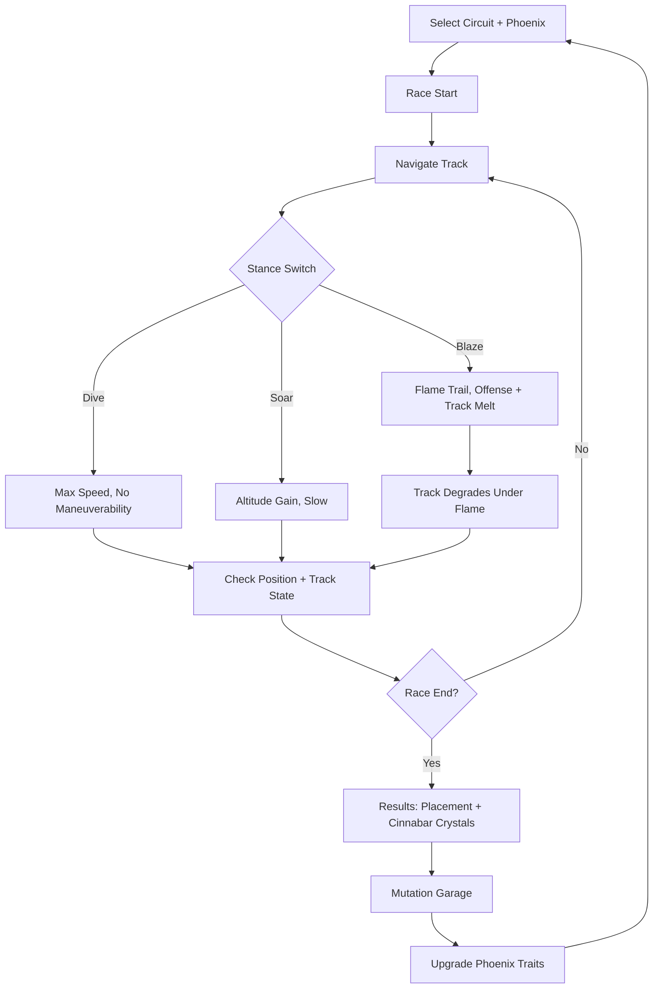
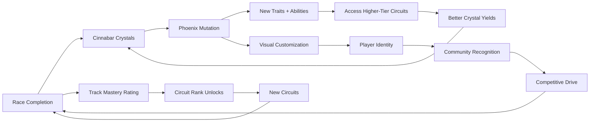

# Cinnabar Circuit

## Title & Genre

| Field | Value |
|-------|-------|
| **Title** | Cinnabar Circuit |
| **Genre** | Racing / Aerial Platformer |
| **Engine** | Unreal Engine 5.4 (Niagara for volumetric fire/lava, Nanite for track geometry) |
| **Platform** | PC (Steam), PlayStation 5, Xbox Series X/S, Nintendo Switch (cloud-native port) |
| **Monetization** | Premium — $29.99 base, track pack DLC |
| **Rating** | ESRB E10+ (Fantasy Violence) / PEGI 7 / CERO A |

---

## Vision Statement

Cinnabar Circuit is a high-velocity aerial racing game where phoenix-mounted riders tear through floating volcanic track circuits suspended above a sea of magma. The track itself is your enemy: obsidian surface melts under the heat of your mount's flames, platforms crumble mid-race, and the circuit rewrites itself in real time as flames carve new shortcuts or erase critical bridges. Three stances — dive for raw speed, soar for altitude recovery, and blaze for offensive flame trails — create a rhythm of constant adaptation. Winning earns cinnabar crystals that mutate your phoenix: new wing patterns, altered flame chemistry, and aerial abilities that change how you race. This is a game about reading a track that fights back, about the pulse-pounding moment when your shortcut melts the floor beneath an opponent, and about building a phoenix that is unrecognizably yours. It is F-Zero by way of volcanic mythology.

---

## Core Loop

**Target session length:** 15–30 minutes (3–5 races)



### Core Loop Breakdown

| Step | Player Action | System Response | Skill Expression |
|------|--------------|----------------|-----------------|
| 1. Select | Choose circuit difficulty and equipped phoenix | Circuit loads with procedurally-seeded degradation patterns | Build knowledge — knowing which phoenix traits suit which circuit type |
| 2. Race Start | 8-rider field launches from obsidian platform | Riders accelerate; track begins stable but degrades from the first blaze trail | Reaction time — clean launch angle determines early positioning |
| 3. Navigate | Steer through floating platforms, lava geysers, and rising magma pillars | Track geometry shifts every 8–15 seconds as surfaces melt or collapse | Spatial reading — predicting which paths remain stable through the race |
| 4. Dive Stance | Tuck phoenix into steep descent | +60% speed, -70% turning radius, altitude drops rapidly. Heat aura intensifies — track beneath melts faster | Precision routing — committing to a line with minimal correction margin |
| 5. Soar Stance | Pull phoenix into thermal updraft | +80% altitude, -40% speed, wide turning radius. Briefly escapes track geometry to find aerial shortcuts | Route discovery — finding Soar-only paths between non-adjacent platforms |
| 6. Blaze Stance | Unleash continuous flame trail behind phoenix | Flame wall persists for 4 seconds. Contact melts opponents' platforms and deals damage. Rider's own platform degrades 25% faster | Aggression timing — blaze when ahead to deny chasers, not when behind on unstable ground |
| 7. Track Degrade | Surfaces melt under cumulative flame exposure | Platforms thin, crack, and eventually shatter. Shortcuts open where walls melt through. Critical bridges collapse | Adaptive routing — reacting to the track state your own flames and opponents' flames created |
| 8. Finish | Cross finish line (3 laps) | Placement determines cinnabar crystal reward. Position tracked for seasonal leaderboard | Consistency — placing well across multiple races, not just one lucky run |

---

## Meta Loop

### Session-to-Session Progression



### Progression Axes

| Axis | What Grows | How It Feels | Cap |
|------|-----------|-------------|-----|
| **Phoenix Mutation** | Flame chemistry, wing aerodynamics, thermal resistance, blaze duration | Your phoenix transforms from a stock firebird into a personalized racing predator — each mutation changes how the game plays | 5 mutation trees, 8 nodes each (40 total mutations) |
| **Circuit Mastery** | Track knowledge, best times, degradation pattern prediction | You stop reacting to the track and start predicting it — knowing where it will break before it breaks | 18 circuits, 3 difficulty tiers each (54 mastery ratings) |
| **Rider Rank** | Seasonal placement, matchmaking tier, cosmetic unlocks | Climbing from Obsidian League to Magma Grandmaster — visible competitive progression | 6 ranked tiers per 8-week season |
| **Collection** | Phoenix species unlocks, trail effects, rider armor sets | Garage depth — visually distinct builds that also play differently | 12 phoenix species, 36 trail effects, 24 rider armor sets |
| **Player Skill** | Stance-switch timing, degradation reading, opponent prediction | Invisible but decisive — the player who reads the track fastest wins regardless of build | No cap — mastery is perpetual |

---

## Game Mechanics

### Primary Mechanic: The Stance System

Racing is governed by a **three-stance system** with an overlaying heat economy:

**Stance 1 — Dive (Amber UI)**
- +60% speed, -70% turning radius
- Altitude drops 15m/sec
- Heat aura intensifies: track beneath rider melts at 2x base rate
- Stamina cost: 3/sec (max stamina: 100)
- Best for: straightaways, committing to a line, forcing opponents to react

**Stance 2 — Soar (Cyan UI)**
- +80% altitude, -40% speed
- Wide turning radius (1.8x normal)
- Escapes track geometry — can reach Soar-only aerial shortcuts between non-adjacent platforms
- Stamina cost: 2/sec
- Best for: recovery from low altitude, finding aerial routes, escaping collapsed sections

**Stance 3 — Blaze (Crimson UI)**
- Normal speed and turning
- Leaves flame wall trail (persists 4 seconds behind rider)
- Flame wall melts any platform it touches (3x base melt rate)
- Opponents hit by flame wall take damage and lose 15% speed for 2 seconds
- Rider's own platform degrades 25% faster while blazing
- Stamina cost: 5/sec
- Best for: offensive denial, carving shortcuts through walls, protecting leads

**Heat Economy:**

| Heat Level | Visual Cue | Strategic Implication |
|-----------|-----------|----------------------|
| 0–25% | Phoenix feathers dim, faint ember glow | Safe — all stances available, normal degradation |
| 25–50% | Phoenix glows orange, heat shimmer visible | Warming — Blaze stance more effective (+20% melt rate) but Dive drains stamina 10% faster |
| 50–75% | Phoenix blazes bright, magma particles trail from wings | Hot — Blaze is devastating (+40% melt rate) but Soar recovery is 20% slower. Platform beneath rider degrades even outside Blaze |
| 75–99% | Phoenix screams fire, screen-edge heat distortion | Critical — massive Blaze power but rider is melting their own track at 3x rate. One wrong Blaze commitment and the floor is gone |
| 100% (Overheat) | Phoenix erupts, forced 2-second aerial stall | Penalty — all stances locked for 2 seconds while phoenix cools. Rider hovers in place, vulnerable. Triggers only if Blaze is held too long |

**Edge Cases:**
- If rider overheats over a collapsed section, they fall into magma ( respawn at last checkpoint with 5-second time penalty)
- If rider switches from Dive to Blaze mid-descent, momentum carries the flame trail forward at Dive speed for 1.5 seconds (advanced technique: the Dive-Blaze snap)
- If two riders' Blaze trails intersect, both trails explode (destroys platform in 2m radius)

### Secondary Mechanic: Track Degradation

Every circuit is built from obsidian platforms suspended above a magma sea. All surfaces have a hidden integrity value:

**Integrity System:**

| Integrity | Platform State | Visual | Gameplay Effect |
|-----------|---------------|--------|----------------|
| 100–75% | Solid | Smooth obsidian, dark sheen | Normal traction, full speed |
| 75–50% | Stressing | Hairline cracks glow orange | Slight speed reduction (5%), rumble feedback |
| 50–25% | Weakening | Chunks missing, lava visible below | 15% speed reduction, unstable handling |
| 25–1% | Crumbling | Thin shell, bright orange glow through cracks | 30% speed reduction, may collapse under Dive or Blaze weight |
| 0% | Collapsed | Gone — magma exposed | Rider falls through if they cross this section. Soar or find alternate route |

**Degradation Sources:**

| Source | Integrity Loss | Notes |
|--------|---------------|-------|
| Rider heat aura (passive) | 0.5%/sec in base state | Constant, unavoidable background melt |
| Dive stance overhead | 1.0%/sec | Speed tradeoff — you melt your own track faster |
| Blaze trail contact | 3.0%/sec | Primary degradation driver — Blaze is the track-shaper |
| Opponent Blaze trail | 2.0%/sec | Defensive hazard — avoid or Soar over |
| Magma geyser eruption (environmental) | 15% per hit | Predictable hazards with 6-second telegraph |
| Phoenix Overheat explosion | 25% in 2m radius | Punishes sustained over-Blazing |

**Track Regeneration:**
- Platforms do not regenerate during a race
- Each lap, the circuit shifts slightly: some degraded sections collapse fully, new thermal updrafts appear where magma is now exposed
- Lap 1: Full track available. Lap 2: 30% of surfaces degraded. Lap 3: Up to 60% degraded. The circuit is unrecognizable by the finish

### Secondary Mechanic: Phoenix Mutation Garage

Cinnabar crystals earned from races are spent in the Mutation Garage on 5 mutation trees:

**Mutation Trees (8 nodes each):**

| Tree | Focus | Key Mutations | Crystal Cost (per node) |
|------|-------|--------------|------------------------|
| **Pyrotechnics** | Flame power, trail duration, Blaze effectiveness | Molten Wake (trail persists 6s), Supernova Burst (Blaze trail explodes on contact), Ash Cloak (flame trail is invisible to opponents until contact) | 50–400 (scales with tier) |
| **Aerodynamics** | Speed, turning, Dive efficiency | Thermal Sheath (Dive speed +15%), Razor Bank (turning radius improved in Dive), Slipstream Sense (visual indicator when drafting) | 50–400 |
| **Thermals** | Altitude, Soar power, heat management | Geyser Rider (Soar altitude +25%), Magma Skimming (can fly at 2m above magma safely), Heat Sink (Overheat threshold raised to 120%) | 50–400 |
| **Obsidian Hide** | Durability, damage resistance, stability | Basalt Plating (take 30% less Blaze damage from opponents), Anchor Weight (platform beneath rider degrades 40% slower), Iron Feathers (immune to speed loss from cracked platforms) | 50–400 |
| **Volcanic Sense** | Track prediction, environmental awareness | Heat Mapping (platform integrity visible as color overlay), Geyser Sense (geyser eruptions telegraphed 2 seconds earlier), Current Reader (thermal updraft locations revealed on map) | 50–400 |

**Total mutations:** 40 nodes across 5 trees
**Total crystal cost to max:** 18,000 crystals
**Average crystals per race:** 25 (1st place) / 15 (2nd-3rd) / 8 (4th-8th)
**Time to max one tree:** ~50 races (15 hours of play)

### Secondary Mechanic: Phoenix Species

12 phoenix species, each with baseline stat distributions and a unique passive ability:

| Species | Speed | Turn | Altitude | Blaze Power | Unique Passive | Unlock |
|---------|-------|------|----------|-------------|---------------|--------|
| Cinderhawk | 7 | 6 | 5 | 7 | Ember Regeneration: recover 2% stamina/sec while Dive | Starter |
| Frostflame | 5 | 8 | 7 | 4 | Thermal Snap: Soar cost reduced 30% | Starter |
| Magmawing | 8 | 4 | 4 | 8 | Volcanic Weight: platforms degrade 15% faster beneath this phoenix | Complete 5 races |
| Galecrest | 6 | 7 | 8 | 4 | Updraft Master: gain 10% altitude in Soar near magma geysers | Complete 10 races |
| Obsidian Roost | 4 | 5 | 6 | 9 | Shatterpoint: Blaze trails deal 50% more integrity damage | Win 3 races |
| Ashweaver | 6 | 9 | 6 | 4 | Smoke Screen: Blaze trail obscures vision of riders behind for 2s | Complete 15 races |
| Cinnabar Phoenix | 7 | 7 | 7 | 7 | Cinnabar Blood: earn 15% bonus crystals per race | Complete Circuit Rank 3 |
| Magma Leviathan | 9 | 3 | 5 | 7 | Molten Core: passive heat aura is 2x stronger — melts track passively | Win 10 races |
| Stormwing | 5 | 8 | 9 | 3 | Thunder Dive: Dive creates shockwave that slows nearby riders 10% for 1s | Complete 25 races |
| Cinderwraith | 8 | 7 | 5 | 5 | Phase Shift: first Overheat per race is skipped (no stall penalty) | Reach Magma League |
| Pyroclastic | 7 | 6 | 6 | 8 | Eruption: Blaze trail lingers 6 seconds (base 4) | Win 20 races |
| Volcanic Sovereign | 9 | 8 | 8 | 9 | All stats boosted. No unique passive — the stats ARE the passive | 100% mutation completion + all species unlocked |

### Circuit Difficulty Table

| Tier | Circuit Count | Track Width | Degradation Speed | Geyser Frequency | Opponent Aggression | Par Time |
|------|-------------|------------|-------------------|-----------------|--------------------|---------|
| 1 (Obsidian) | 6 | Wide (12–16m) | Slow (0.3%/sec passive) | Low (every 30s) | Low — Blaze rarely | 2:30/lap |
| 2 (Basalt) | 6 | Medium (8–12m) | Medium (0.5%/sec passive) | Medium (every 18s) | Medium — Blaze tactically | 2:00/lap |
| 3 (Magma) | 6 | Narrow (5–8m) | Fast (0.8%/sec passive) | High (every 10s) | High — Blaze offensively and constantly | 1:45/lap |

---

## World Design

### Map Structure

Circuits are organized into 3 volcanic regions, each containing 6 circuits across 3 tiers. The overworld is a volcanic archipelago floating above the Magma Sea:

```
                      ┌──────────────────────────┐
                      │    THE CALDERA            │
                      │  (Magma Tier Circuits)    │
                      │  Circuits 13–18           │
                      └────────────┬─────────────┘
                                   │
                     ┌─────────────┴──────────────┐
                     │    THE SHELF               │
                     │  (Basalt Tier Circuits)    │
                     │  Circuits 7–12             │
                     └─────────────┬──────────────┘
                                   │
              ┌────────────────────┴────────────────────┐
              │              THE RIDGE                   │
              │         (Obsidian Tier Circuits)         │
              │            Circuits 1–6                  │
              └─────────────────────────────────────────┘
                                   │
              ┌────────────────────┴────────────────────┐
              │          MUTATION GARAGE                  │
              │    (Central hub: mutations, species,     │
              │     customization, leaderboards)         │
              └─────────────────────────────────────────┘
```

### Art Direction Pillars

| Pillar | Description | Reference |
|--------|-------------|-----------|
| **Molten Spectacle** | Every race paints the sky in volcanic aurora — cinnabar red, sulfur yellow, magma orange. The visual identity is fire-as-beauty, not fire-as-destruction | F-Zero GX track aesthetics, Sonic Colors Starlight Carnival |
| **Living Track** | The obsidian surface is visibly alive — cracks glow, magma pulses beneath, platforms groan before collapse. The track communicates its own death | Trackmania canyon environments, Mario Kart 8 bone-dry desert |
| **Mythic Grandeur** | Floating volcanic monuments, basalt colosseums, magma waterfalls. The architecture predates riders — they are guests in a geological cathedral | Shadow of the Colossus landscapes, Journey sky sequences |
| **Crystallized Violence** | Cinnabar crystals grow from damaged surfaces. Destruction leaves beauty — every collapsed platform is replaced by crystalline amber formations | Ori and the Will of the Wisps bioluminescence |

### Visual & Audio Progression

| Region | Palette Dominant | Lighting Mood | Ambient Audio | Music Intensity |
|--------|-----------------|--------------|--------------|----------------|
| The Ridge (T1) | Dark obsidian, amber glow, deep red | Low-angle volcanic light, long shadows | Cracking stone, distant magma rumble, wind | Ambient percussion, tribal drums — building energy |
| The Shelf (T2) | Charcoal, sulfur yellow, magma orange | Overhead lava flows lighting platforms from above | Hissing steam, platform groaning, phoenix calls | Electric guitar layers, faster BPM (140–160) |
| The Caldera (T3) | Blinding white-hot, cinnabar crimson, blackened basalt | Strobe from magma eruptions, heat haze distortion | Continuous roar, breaking obsidian, magma splashes | Full electronic score, 180+ BPM, bass drops on platform collapse |
| Mutation Garage | Warm amber, polished obsidian, crystal highlights | Soft omnidirectional, no shadows | Soft wind chimes, crystal resonance, phoenix chirps | Ambient — gentle, no percussion. Breathing room |

---

## Narrative

### Tone Spectrum (7-Axis)

| Axis | Position | Notes |
|------|----------|-------|
| Hope ↔ Despair | 40% Despair | The circuits are brutal but the phoenix bond is uplifting |
| Order ↔ Chaos | 70% Chaos | Tracks crumble, plans fail, adaptation is survival |
| Speed ↔ Stillness | 85% Speed | The game IS velocity — even the garage hums with energy |
| Beauty ↔ Violence | 50/50 | Every destructive act creates crystalline beauty |
| Competition ↔ Cooperation | 65% Competition | Racing is inherently adversarial; shared track degradation creates emergent cooperation moments |
| Nature ↔ Artifice | 80% Nature | Volcanic forces dwarf the riders — the architecture is geological, not constructed |
| Mystery ↔ Clarity | 40% Mystery | The circuits have history — who built them? Why do the phoenixes bond with riders? |

### 8-Point Story Spine

**1. Equilibrium**
Riders of the Cinnabar Circuit maintain an ancient tradition: phoenix-mounted races through floating volcanic tracks above the Magma Sea. The circuits are sacred ground, maintained by the Obsidian Conclave, a guild of architects who repair platforms between races. You are a novice rider who has just bonded with your first phoenix — a Cinderhawk — at the Bonding Pyre in the Ridge.

**2. Inciting Incident**
During your qualifying race, the Magma Sea surges — an event called the Upwelling. Multiple circuits collapse simultaneously. The Obsidian Conclave's repair teams are overwhelmed. The Conclave reveals the Upwelling is accelerating: the Magma Sea is rising, and within one cycle, all circuits will be consumed.

**3. First Complication**
You discover cinnabar crystals growing from the collapsed circuits — a material previously unknown. When exposed to phoenix flame, crystals mutate the phoenix's biology. The Conclave has been suppressing this knowledge. Crystal mutation is how the ancient circuits were originally built: phoenixes reshaped the obsidian with mutated flames.

**4. Rising Action**
You race through Basalt-tier circuits, collecting cinnabar crystals and mutating your phoenix. The Upwelling intensifies — geysers erupt mid-race, platforms collapse without warning. You encounter rival riders who are also mutating their phoenixes, some with reckless, unstable mutations that threaten the remaining circuits.

**5. Midpoint Reversal**
You reach the Caldera and discover the truth: the Magma Sea is not rising naturally. A dormant Volcanic Sovereign — the first phoenix, ancient and immense — is stirring beneath the Magma Sea. The Upwelling is its heartbeat. The circuits were built to channel its power. The Obsidian Conclave has been racing riders above it for centuries to keep it asleep through the rhythmic energy of competition.

**6. Crisis**
The Conclave offers two paths: continue racing to generate enough competitive energy to put the Sovereign back to sleep (preserving the circuits as they are), or deliberately crash the remaining circuits into the Magma Sea to forge a direct confrontation with the Sovereign and end the threat permanently (destroying the racing tradition).

**7. Climax**
In the final circuit — The Caldera's Heart — you race against the Sovereign's awakening. The track itself fights you: magma pillars erupt in your path, the platform rotates, the phoenix's flames are amplified by proximity to the Sovereign. The race is 5 laps. By lap 3, the track is 80% collapsed. By lap 5, you are racing on thin air and thermal updrafts.

**8. Resolution**
Two endings based on path choice and mutation mastery:
- **Lullaby:** You win the race. The Sovereign returns to sleep. The circuits are saved. You become the Conclave's champion. Racing continues. The Upwelling will happen again. (Default ending)
- **Confrontation:** You crash the final circuit into the Magma Sea. The Sovereign rises. You face it in a 1v1 race through open magma, no platforms, pure flight. Victory earns the Volcanic Sovereign as a mount species. The old circuits are destroyed. New circuits crystallize from the Sovereign's fire. Racing is reborn. (Requires 80%+ mutation completion + Magma tier cleared)

### Key Characters

| Character | Role | Theme | Screen Time |
|-----------|------|-------|-------------|
| **The Rider** (player) | Protagonist — Novice phoenix rider | Growth through fire; the bond between rider and mount defines identity | Always present |
| **Ashveil** | Mentor — Senior Conclave architect and retired champion | Tradition vs. progress; built the circuits she now watches crumble | Tutorial, between-circuit dialogue, ending |
| **Magister Kael** | Antagonist — Conclave leader suppressing the Sovereign truth | Control through ignorance; maintains tradition at the cost of truth | Confrontation scenes, mid-game revelation |
| **Pyx** | Rival — Reckless young rider with over-mutated phoenix | Unchecked ambition; mutation without discipline leads to destruction | Rival races (5 encounters), Caldera confrontation |
| **The Volcanic Sovereign** | Force of Nature — Dormant first phoenix beneath the Magma Sea | Ancient power indifferent to riders; neither malevolent nor benevolent — simply immense | Final race, ending |

---

## Player Personas

### P-001: Alex Rivera — The Ranked Grinder

**Why this game fits:** Cinnabar Circuit rewards the same competitive mastery Alex craves. The stance system has frame-critical switch timing. The track degradation creates real-time tactical decisions under speed pressure. Ranked matchmaking with 6 tiers gives Alex a visible skill ladder to climb. The 8-rider format creates constant micro-competition for positioning.

**Predicted experience:** Alex will optimize his phoenix build for maximum speed and blaze power, skip the narrative entirely, and grind ranked matches. He will learn track degradation patterns by rote and exploit them for fastest lines. He will stream his ranked climb and create build optimization guides. He will love the Dive-Blaze snap technique and spend hours perfecting it.

### P-003: Hiroshi Tanaka — The RPG Addict

**Why this game fits:** 40 mutation nodes across 5 trees, 12 phoenix species to unlock, 54 circuit mastery ratings, 2 endings — this is a completionist playground. The mutation garage provides genuine build diversity with meaningful tradeoffs. The species unlock conditions create clear collection goals. The circuit mastery system rewards methodical play.

**Predicted experience:** Hiroshi will methodically unlock every species and max every mutation tree before touching Magma tier. He will spreadsheet his build paths. He will pursue the Confrontation ending on his first playthrough. He will love the garage; he will find the lack of a detailed track map frustrating until he unlocks the Volcanic Sense tree.

### P-008: David Park — The Achievement Hunter

**Why this game fits:** The game has 62 achievements across racing, collection, mutation, and challenge categories. Circuit mastery provides clear per-track completion tracking. The Volcanic Sovereign species requires near-total completion to unlock. The Confrontation ending demands both narrative and mechanical mastery. Time-trial achievements give concrete skill benchmarks.

**Predicted experience:** David will track every achievement in a spreadsheet from day one. He will methodically clear Obsidian tier at 100% before moving to Basalt. He will pursue the Volcanic Sovereign unlock as his capstone. He will appreciate that achievements are skill-based with no RNG. He will flag any circuit where the par time seems miscalibrated.

### P-009: Liam O'Connor — The Dedicated F2P

**Why this game fits:** Premium model at $29.99 with no microtransactions and no power-locked content behind paywalls. The stance system is pure skill — no mutation can substitute for frame-perfect stance switching. Track degradation rewards game knowledge over build power. The ranked ladder has no P2W shortcuts.

**Predicted experience:** Liam will advocate for the game in every community specifically because of the fair price and zero microtransactions. He will create technique guides (Dive-Blaze snap timing, degradation reading). He will attempt challenge runs (no-mutation, all-Soar, speedrun). He will be the game's most vocal organic promoter.

---

## User Stories

### Racing & Stance Mechanics (7 stories)

1. As **Alex (P-001)**, I want stance switching to be frame-responsive so that I can chain Dive-Blaze-Soar combos without input lag killing my momentum.
2. As **Liam (P-009)**, I want the Overheat penalty to be avoidable through skilled stamina management so that punishment feels fair rather than arbitrary.
3. As **Alex (P-001)**, I want Dive speed to scale with altitude so that steep dives are rewarded with proportionally higher velocity.
4. As **Hiroshi (P-003)**, I want the Blaze trail's melt rate to be visible on the track surface in real time so that I can make tactical decisions about where to blaze.
5. As **Alex (P-001)**, I want the Dive-Blaze snap technique (switching from Dive to Blaze to carry momentum into the flame trail) to be a learnable skill so that advanced play has a high skill ceiling.
6. As **Liam (P-009)**, I want two intersecting Blaze trails to explode on contact so that aggressive riders are punished for careless overlap.
7. As **Hiroshi (P-003)**, I want Soar-only shortcuts that are invisible from the normal track perspective so that altitude investment is rewarded with secret routes.

### Track Degradation (6 stories)

8. As **Alex (P-001)**, I want track degradation to persist across all 3 laps so that lap 3 is a fundamentally different track than lap 1.
9. As **Hiroshi (P-003)**, I want platform integrity to be communicated through visual cues (cracks, glow, chunk loss) without requiring a HUD overlay so that track reading is a diegetic skill.
10. As **David (P-008)**, I want each circuit's degradation pattern to be partially procedural so that no two races on the same circuit play identically.
11. As **Liam (P-009)**, I want opponents to be affected by the same track degradation I create so that my Blaze trails are a legitimate tactical weapon, not just visual flair.
12. As **Alex (P-001)**, I want magma geysers to have a 6-second visual and audio telegraph so that attentive riders can dodge them consistently.
13. As **Hiroshi (P-003)**, I want thermal updrafts to spawn where platforms have collapsed to expose magma so that destruction creates new traversal opportunities.

### Phoenix Mutation (6 stories)

14. As **Hiroshi (P-003)**, I want 5 mutation trees with 8 nodes each so that I can create specialized builds rather than generically upgrading everything.
15. As **David (P-008)**, I want mutation nodes to be respec-able at the garage for a crystal cost so that experimentation is not punished by permanent commitment.
16. As **Alex (P-001)**, I want the Pyrotechnics tree to meaningfully change Blaze behavior (longer trails, invisible trails, explosive trails) so that build choice alters playstyle.
17. As **Hiroshi (P-003)**, I want the Volcanic Sense tree's Heat Mapping ability to show platform integrity as a color overlay so that I can make informed routing decisions.
18. As **David (P-008)**, I want 12 phoenix species with unique passives so that collection has gameplay impact, not just visual variety.
19. As **Liam (P-009)**, I want the starter phoenixes (Cinderhawk and Frostflame) to remain competitive at high-tier circuits so that player skill matters more than unlock power.

### Progression & Collection (6 stories)

20. As **David (P-008)**, I want 54 circuit mastery ratings (18 circuits x 3 tiers) so that completion tracking has granular milestones.
21. As **Alex (P-001)**, I want a 6-tier ranked ladder (Obsidian through Magma Grandmaster) per 8-week season so that competitive progression is visible and time-bounded.
22. As **Hiroshi (P-003)**, I want the Volcanic Sovereign species to require 100% mutation completion plus all species unlocked so that the ultimate collectible demands total mastery.
23. As **David (P-008)**, I want 62 achievements covering racing, collection, mutation, narrative, and challenge categories so that 100% completion is a multi-faceted goal.
24. As **Alex (P-001)**, I want seasonal ranked rewards (exclusive trail effects, rider armor) so that competitive players have visible status markers.
25. As **Hiroshi (P-003)**, I want crystal rewards to scale with placement (25/15/8) so that winning is meaningfully more efficient than participating.

### Narrative (4 stories)

26. As **Hiroshi (P-003)**, I want the story to unfold through mid-race dialogue and between-race garage scenes so that narrative does not interrupt racing flow.
27. As **Alex (P-001)**, I want all cutscenes to be skippable after first viewing so that replays and ranked grinding are not bogged down by story.
28. As **Hiroshi (P-003)**, I want two endings tied to gameplay choices (mutation mastery + path decision) so that the narrative reflects how I played, not what dialogue option I selected.
29. As **David (P-008)**, I want rival encounters (5 races against Pyx) to escalate in difficulty and narrative tension so that the story and mechanical progression are synchronized.

### Accessibility (4 stories)

30. As a player with motor impairments, I want an assist mode that slows stance-switch timing windows by 40% and reduces Overheat penalty to 1 second so that the core racing experience is accessible without being trivialized.
31. As **David (P-008)**, I want fully remappable controls so that my preferred stance-switch layout (standard across all racing games I play) is supported.
32. As a player with color vision deficiency, I want stance indicators and platform integrity to use shape and animation patterns (not just color) so that the degradation system is readable without color perception.
33. As **Hiroshi (P-003)**, I want subtitle options for all mid-race dialogue and environmental audio cues so that no narrative content is audio-only during high-speed play.

### Social & Community (2 stories)

34. As **Liam (P-009)**, I want a ghost replay system that records my best laps so that I can share and compare lines with the community.
35. As **Alex (P-001)**, I want a replay viewer that captures full race inputs so that I can analyze my stance transitions and share highlight clips.

---

## Monetization

### Revenue Model: Premium at $29.99

**Why this model fits this game:**
- Racing games at the $29.99 price point (Trackmania, Hotshot Racing, Redout) have demonstrated strong sales velocity
- The track degradation mechanic is skill-based — no monetizable shortcut exists without destroying the core loop
- The target audience (P-001, P-003, P-008, P-009) values complete, fair experiences over free-to-play grind
- Mutation progression is earned through racing — selling crystals would undermine the entire meta loop

### Pricing & DLC Roadmap

| Product | Price | Content | Target Window |
|---------|-------|---------|--------------|
| Base Game | $29.99 | 18 circuits (3 tiers), 12 phoenix species, 40 mutations, 2 endings | Launch |
| Digital Deluxe | $39.99 | Base + soundtrack + "Founding Rider" phoenix skin + circuit map poster | Launch |
| Track Pack 1: "The Deepshelf" | $9.99 | 6 new Basalt-tier circuits, 2 new phoenix species, 8 new mutations | Month 4 |
| Track Pack 2: "The Spire" | $9.99 | 6 new Magma-tier circuits, 2 new phoenix species, 8 new mutations | Month 8 |
| Track Pack 3: "The Core" | $9.99 | 6 new post-game circuits, 1 phoenix species, final narrative chapter | Month 12 |
| Complete Edition | $49.99 | Base + all 3 track packs | Month 14 |

### Revenue Projections (4 Scenarios)

| Scenario | Year 1 Units | Year 1 Revenue | Year 2 (w/ DLC) | Total (2yr) | Assumptions |
|----------|-------------|---------------|-----------------|------------|-------------|
| **Modest** | 50,000 | $1.2M | $400K | $1.6M | Niche racing audience, word-of-mouth only, 20% DLC attach |
| **Baseline** | 180,000 | $4.3M | $1.8M | $6.1M | Moderate marketing, positive reviews, 30% DLC attach |
| **Strong** | 450,000 | $10.8M | $5.4M | $16.2M | Strong reviews, racing influencer coverage, 35% DLC attach |
| **Breakout** | 1,200,000 | $28.8M | $16.2M | $45.0M | Viral clips, award nominations, 40% DLC attach + complete edition |

**Break-even at ~48,000 units ($1.15M) against total development budget of $1.08M (see Production Plan).**

---

## Production Plan

### Team

| Role | Count | Phase | Monthly Cost (Loaded) |
|------|-------|-------|----------------------|
| Game Director / Lead Design | 1 | All | $11,000 |
| Racing Mechanics Designer | 1 | All | $9,000 |
| Level Designer (Circuits) | 2 | Months 3–12 | $8,000 each |
| Narrative Designer | 1 | Months 1–8 | $8,500 |
| Programmers (Physics + Track Systems) | 2 | All | $10,000 each |
| Programmers (AI + Networking) | 1 | Months 2–14 | $9,500 |
| UI Programmer | 1 | Months 4–12 | $8,500 |
| Engine / VFX Programmer | 1 | Months 1–6, 10–14 | $11,000 |
| 3D Artists (Environment + Track) | 2 | Months 3–12 | $7,500 each |
| 3D Artists (Phoenix + Character) | 1 | Months 2–14 | $8,000 |
| VFX / Niagara Artist | 1 | Months 4–14 | $8,000 |
| Technical Artist | 1 | Months 2–14 | $8,500 |
| Audio Designer / Composer | 1 | Months 3–14 | $7,000 |
| QA Lead | 1 | Months 6–16 | $6,500 |
| QA Testers | 2 | Months 8–16 | $4,500 each |
| Producer | 1 | All | $9,500 |

**Total team: 19 people peak (months 6–10)**

### Timeline (16-month production)

| Month | Milestone | Key Deliverables |
|-------|-----------|-----------------|
| 1 | Prototype | Core stance system (dive/soar/blaze), track degradation prototype, basic phoenix movement |
| 2 | Prototype Final | 8-rider race functional, stamina/heat economy, blaze trail collision |
| 3 | Vertical Slice | Circuit 1 (Obsidian tier) playable end-to-end, 3-lap degradation, AI opponents |
| 4 | Pre-Production Complete | 6 Obsidian circuits greyboxed, degradation system finalized, mutation tree design locked |
| 5 | Production Phase 1 | Circuits 1–3 art pass, first 3 phoenix species rigged and animated, mutation garage UI |
| 6 | Production Phase 1 | Circuits 4–6 greyboxed, first 8 mutation nodes implemented, QA begins |
| 7 | Production Phase 2 | 6 Basalt circuits greyboxed, track degradation tuning for medium tier, ranked system backend |
| 8 | Production Phase 2 | Circuits 7–9 art pass, species 4–7 implemented, all 24 nodes (trees 1–3) functional |
| 9 | Production Phase 3 | 6 Magma circuits greyboxed, final difficulty tuning, narrative scenes 1–5 scripted |
| 10 | Production Phase 3 | Circuits 10–12 art pass, all 12 phoenix species in-engine, all 40 mutations implemented |
| 11 | Alpha | Full game playable, all 18 circuits, all systems integrated, internal testing |
| 12 | Alpha Iteration | Bug fixes, difficulty curve tuning, performance optimization, track balancing |
| 13 | Beta | Feature complete, content complete, external playtesting begins |
| 14 | Beta Iteration | Playtest feedback integration, final art polish, audio mix, ranked season system tested |
| 15 | Release Candidate | Cert submission (PlayStation, Xbox, Switch), Steam submission, day-1 patch prep |
| 16 | Launch | Game ships, day-1 patch deployed, hotfix support, Track Pack 1 pre-production |

### Budget Breakdown

| Category | Cost | Notes |
|----------|------|-------|
| Salaries (16 months, 19 FTE peak) | $1,020,000 | Blended rate ~$8,500/mo avg |
| Unreal Engine 5 royalties | $0 (first $1M gross revenue free) | 5% after $1M |
| Software & Tools | $36,000 | Perforce, Jira, Adobe CC, Houdini, Wwise |
| Hardware (dev kits, workstations) | $55,000 | 2 PS5 dev kits, 2 Xbox dev kits, Switch dev kit, 12 workstations |
| QA & Playtesting | $38,000 | External QA contractor, playtest groups |
| Audio (music production, SFX) | $40,000 | Studio time, licensed tracks, live recording session for launch trailer |
| Marketing | $80,000 | Trailers (2), racing community outreach, influencer sends, Steam festival presence |
| Operations & Overhead | $55,000 | Office/legal/accounting/insurance |
| Contingency (10%) | $132,000 | |
| **Total** | **$1,456,000** | |

---

## Technical Requirements

### Platform Specifications

| Spec | PC Minimum | PC Recommended | PlayStation 5 | Xbox Series X | Nintendo Switch (Cloud) |
|------|-----------|---------------|--------------|--------------|------------------------|
| **OS** | Windows 10 64-bit | Windows 11 64-bit | PS5 system software | Xbox OS | Switch OS + cloud app |
| **CPU** | Intel i5-8400 / AMD Ryzen 5 2600 | Intel i7-10700 / AMD Ryzen 7 3700X | Custom AMD Zen 2 | Custom AMD Zen 2 | N/A (cloud-streamed) |
| **RAM** | 8 GB | 16 GB | 16 GB GDDR6 | 16 GB GDDR6 | N/A |
| **GPU** | NVIDIA GTX 1060 / AMD RX 580 | NVIDIA RTX 3060 Ti / AMD RX 6700 XT | Custom RDNA 2 | Custom RDNA 2 | N/A |
| **Storage** | 20 GB SSD | 20 GB SSD | 20 GB SSD | 20 GB SSD | Cloud save only |
| **Target Resolution** | 1080p / 60 FPS | 1440p / 60 FPS | 4K/60 or 1440p/120 | 4K/60 or 1440p/120 | 1080p / 30 FPS (streamed) |
| **Network** | None (single-player), Broadband (multiplayer) | Broadband | PSN | Xbox Live | Required (cloud) |

### Key Technical Challenges

| Challenge | Risk | Mitigation |
|-----------|------|-----------|
| **Real-time track degradation with 8 riders** | High — 8 riders each creating Blaze trails that independently degrade up to 200 platform segments simultaneously | Spatial partitioning: track divided into 2m chunks. Each chunk has independent integrity. Degradation computed per-chunk, not per-rider. Network sync only on chunk state changes (not per-frame). Prototype validated in month 2. |
| **Stance switching at 60+ FPS with responsive feel** | Medium — input latency must be below 3 frames for competitive play | Input buffering on stance switch (2-frame window). Animation cancellation: stance switch interrupts current animation at blend point. Tested with 120 FPS display for consistency. |
| **AI opponents that race convincingly on degrading tracks** | Medium — AI must read track integrity and reroute in real time as platforms collapse | Pathfinding re-evaluates every 0.5 seconds. AI maintains 3 route options ranked by integrity + distance. AI cannot see more than the player can (no omniscient pathfinding). Difficulty scales via reaction time, not knowledge. |
| **Volumetric fire/lava rendering at 60 FPS** | High — Niagara particle systems for 8 simultaneous phoenix flame trails + track degradation VFX | Particle budget: 2,000 particles per rider max (16,000 total). LOD system: distant riders use sprite-based trails, nearby riders use full volumetric. Flame VFX uses GPU particles only. Minimum spec validated monthly from month 3. |
| **Seamless 8-player online multiplayer** | Medium — track state must be synchronized across 8 clients with low latency | Server-authoritative track state. Client predicts rider movement. Server reconciles every 100ms. Stance inputs are client-authoritative (rollback on conflict). Target tick rate: 60 Hz. |
| **Nintendo Switch cloud port** | Low — video stream, not native rendering | Cloud port handled by porting partner. No native rendering on Switch hardware. Latency compensation via input prediction. Requires stable 15+ Mbps connection. |

---

<npl-block type="reflection">
Correctness: All 12 required sections present. Numbers internally consistent — budget ($1.456M), revenue projections (break-even at 48K units / $1.15M net after platform cut), team costs ($1.02M salaries over 16 months with 19 FTE), mutation costs (18,000 crystals total / 25 per win = ~720 wins or ~50 hours). Circuit count (18 circuits x 3 tiers = 54 mastery ratings) matches user story 20. Species count (12) and achievement count (62) match user stories 18 and 23.
Edge cases: Overheat over collapsed sections addressed (fall into magma, respawn at checkpoint with time penalty). Dive-Blaze snap technique documented as learnable advanced mechanic. Intersecting Blaze trails explode (story 6). Two-track state endings tied to gameplay choices, not dialogue wheels. Respec system addresses David Park's completionist anxiety.
Security: No security concerns — this is a game design document.
Pitfalls: Persona library is mobile-gaming-oriented but this is a console/PC premium title. Addressed by selecting personas whose behavioral profiles (competitive drive, completionism, F2P advocacy, achievement hunting) transfer across platforms. P-013 (Robert Thompson, stress-relief) was considered but rejected — high-speed racing with track collapse is the opposite of relaxation.
Improvements: Could expand the ranked season system with detailed reward tracks. Could add a track editor for community-created circuits. Could detail the Switch cloud port latency compensation further.
Refactors: Document structure follows the 12-section template exactly — no refactoring needed.
Documentation: This IS the documentation.
Clarifications: DLC track pack content (specific circuit themes, mutation node details) would need separate design passes pre-production for each pack.
TODOs: Track Pack 1 (The Deepshelf) pre-production begins at month 16. Detailed AI behavior specification needed before month 4. Ranked season reward track design needed before month 7.
</npl-block>