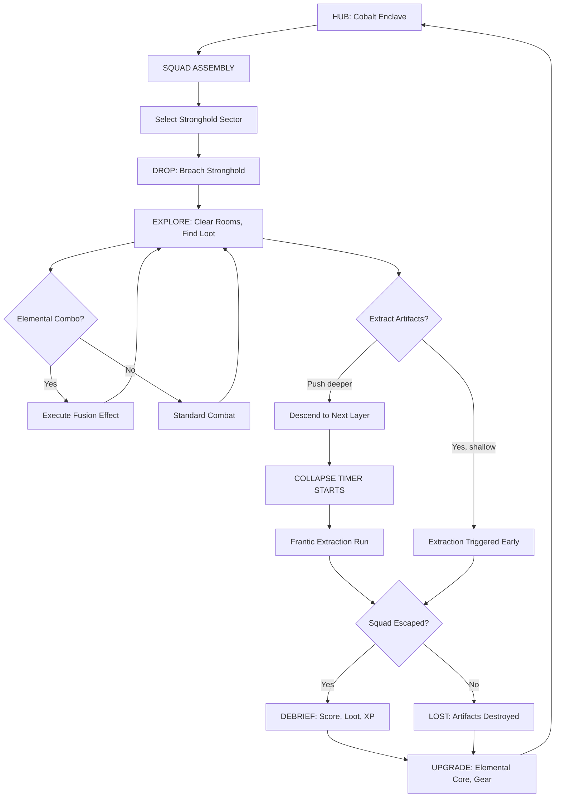
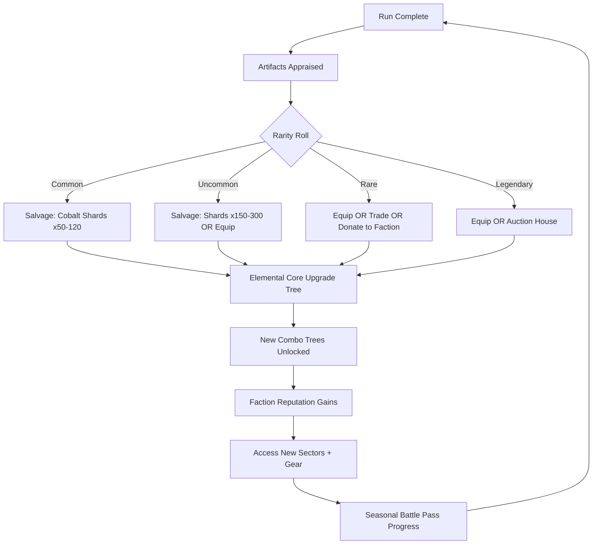

# Cobalt Crusade

## Title & Genre

| Field | Value |
|-------|-------|
| **Title** | Cobalt Crusade |
| **Genre** | Co-op Extraction Shooter |
| **Sub-genres** | Procedural Dungeon Crawl, Elemental Action |
| **Perspective** | Third-person, over-the-shoulder camera |
| **Platform** | PC (Steam), PlayStation 5, Xbox Series X/S |
| **Rating** | Teen (T) -- Fantasy Violence, Mild Language |
| **Price** | Premium $29.99 USD |
| **Players** | 1-4 (solo with AI, co-op squad) |

Cobalt Crusade is a cooperative extraction shooter where squads of elemental mercenaries dive into procedurally generated abyssal strongholds, combine elemental powers in real-time to defeat hostile forces, extract cobalt-infused artifacts, and escape before the stronghold collapses. It sits at the intersection of Deep Rock Galactic's cooperative procedural missions, Risk of Rain 2's emergent chaos, and Apex Legends' ability-combo design philosophy.

---

## Vision Statement

Cobalt Crusade answers a question no extraction shooter has asked: *what if your squad's most powerful weapon was each other?*

The genre's current landscape splits between punishingly solo experiences (Tarkov, Hunt: Showdown) and class-based co-op with rigid ability trees (Deep Rock Galactic, Helldivers 2). Neither rewards the moment-to-moment creative improvisation that happens when four friends discover a new combo in the middle of a firefight and yell across voice chat to try it again.

The Elemental Synergy Engine makes every encounter a collaborative puzzle. Fire plus void is not a fixed skill on a hotbar -- it is the emergent result of two players choosing to overlap their fields at the same moment, in the same space, with timing that rewards practice and punishes sloppiness. Ten fusion effects across four elements means every squad composition plays differently, and no guide captures every interaction because the geometry of each stronghold reshapes how those interactions land.

The Abyssal Collapse Timer ensures no run overstays its welcome. Every extraction is a timed escalation from cautious exploration to desperate sprint, with collapsing geometry creating new terrain and closing old paths. Greed is the primary antagonist: the deeper you push for rarer artifacts, the less time you have to get out.

The design target is a 25-40 minute run that produces stories worth retelling.

---

## Core Loop



| Phase | Duration | Player Activity | Emotional Arc |
|-------|----------|-----------------|---------------|
| Hub & Squad Assembly | 2-5 min | Browse upgrades, customize loadout, form squad | Anticipation, theory-crafting |
| Drop & Breach | 1-2 min | Entry animation, initial sweep | Adrenaline spike |
| Explore & Extract | 15-25 min | Room clearing, combo execution, artifact collection | Flow state, discovery |
| Collapse Escape | 3-8 min | Timed extraction with collapsing geometry | Panic, clutch plays |
| Debrief & Upgrade | 2-5 min | Score screen, loot appraisal, core upgrades | Satisfaction or resolve |

### Loop Failure State

When a squad fails to extract, all artifacts from the run are lost. Players retain a flat 15% of the XP earned during the run and any "Cobalt Dust" (a secondary currency collected from kills, not artifact-dependent). This prevents total loss from being soul-crushing while maintaining extraction stakes. Players who disconnect mid-run have 90 seconds to reconnect; after that, their character is controlled by AI and their share of loot is distributed among survivors.

---

## Meta Loop



### Progression Systems

**Elemental Core Tree** -- The permanent progression backbone. Each element has a 3-branch tree (Offense, Synergy, Survival) with 8 nodes per branch. Spending Cobalt Shards unlocks nodes. Key gates:

| Element | Offense Branch | Synergy Branch | Survival Branch |
|---------|---------------|----------------|-----------------|
| Fire | Burn radius +15% per node | Fusion duration +0.5s per node | Heatshield: fire damage reduced 8% per node |
| Ice | Freeze duration +0.3s per node | Fusion area +12% per node | Frost Armor: shield regen +5% per node |
| Lightning | Chain targets +1 per 2 nodes | Fusion cooldown -8% per node | Static Field: auto-shock nearby enemies on low HP |
| Void | Gravity pull radius +10% per node | Fusion potency +10% per node | Void Step: brief teleport on dodge (3-node gate) |

Fully upgrading one element costs approximately 14,000 Cobalt Shards. A successful deep extraction yields 400-700 shards. Average time to max one element: 30-40 runs (~20 hours of playtime).

**Faction Reputation** -- Three factions offer parallel gear tracks:

| Faction | Philosophy | Unique Reward | Reputation Source |
|---------|-----------|---------------|-------------------|
| Ashen Consortium | Profit above all -- extract maximum value | Artisan salvage tools (+25% shard yield) | Extracting artifacts, completing contracts |
| Depth Wardens | Honor the abyss -- push as deep as possible | Abyssal lanterns (reveal hidden rooms) | Reaching deep layers, completing collapse escapes |
| Cobalt Circle | Mastery of elements -- perfect combo execution | Elemental tuning forks (reduce fusion cooldown 15%) | Executing fusion combos, discovering new synergies |

Reputation ranks: Stranger (0) -> Acquaintance (500) -> Ally (1500) -> Trusted (3500) -> Sworn (7000). Each rank unlocks gear and narrative content.

**Seasonal Battle Pass** -- 100 tiers, approximately 80 hours to complete. Free track contains Cobalt Shards, one weapon skin per element, and a faction token. Premium track ($9.99/season) contains cosmetic armor sets, weapon effects, emotes, and a Legendary artifact skin at tier 100. No gameplay power in premium track.

---

## Game Mechanics

### Elemental Synergy Engine

The central mechanic. Each player selects one of four elements at the start of a run. Elements are fixed for the duration of that run. When two players' elemental fields overlap, a fusion effect triggers with a 6-second internal cooldown per pair.

| Pair | Fusion Name | Effect | Duration | Cooldown | Tactical Role |
|------|-------------|--------|----------|----------|---------------|
| Fire + Ice | Thermal Shock | Instant shatter of frozen enemies; AoE burst dealing 200% base damage | Instant | 8s | Burst damage on frozen targets |
| Fire + Lightning | Plasma Storm | Fire+lightning tornado that travels slowly, dealing 80 DPS and stunning | 5s | 10s | Area denial, crowd control |
| Fire + Void | Black Flame | Persistent DoT field (45 DPS) that ignores armor and heals void player 20% of damage | 8s | 12s | Sustained damage, sustain |
| Ice + Lightning | Cryo-Chain | Freeze-shock that chains between up to 5 enemies, freezing each for 1.5s | Instant | 8s | Multi-target lockdown |
| Ice + Void | Gravity Well | Frozen gravity vortex: pulls enemies to center, slows 60%, shatters on expiry | 6s | 10s | Positioning control |
| Lightning + Void | Rift Surge | Void lightning bolt that teleports enemies hit to a random position within 10m | Instant | 9s | Chaos, displacement |
| Fire + Fire | Inferno | Double fire player channel: massive AoE burn (120 DPS) requiring both players to stand still | 4s | 15s | Boss damage window |
| Ice + Ice | Glacier | Double ice channel: 8m ice wall that blocks enemies and projectiles | 6s | 12s | Defensive barrier |
| Lightning + Lightning | Overcharge | Double lightning channel: all squad weapons gain +40% fire rate for | 5s | 14s | DPS burst window |
| Void + Void | Singularity | Double void channel: massive gravity well that crushes enemies for 300% base damage over 3s | 3s | 18s | Ultimate combo, boss killer |

Fusion execution requires both players to be within 8 meters and to activate their elemental ability within 0.75 seconds of each other. A visual cue (elemental thread connecting the two players) appears when fusion is available. Mis-timed activations waste the ability cooldown without triggering fusion.

### Combat System

| Mechanic | Detail |
|----------|--------|
| Health | 100 HP base, regenerates 2 HP/s out of combat after 4s delay |
| Shield | 50 shield base, regenerates 5/s after 2s of no damage |
| Elemental Ability | One active ability per element, 12s base cooldown |
| Fusion Ability | Triggered by overlapping with teammate, 8-18s pair-specific cooldown |
| Primary Weapon | One equipped firearm (SMG, shotgun, rifle, sniper, pistol) |
| Secondary Weapon | Sidearm slot (pistol only, unlimited reserve ammo) |
| Melee | Quick melee (30 damage, 1s animation) -- last resort, not a build path |
| Reload | Weapon-specific (1.2s pistol to 3.1s sniper) |
| Movement | Sprint (1.6x speed, 8s duration, 3s cooldown), dodge roll (0.4s i-frames) |

### Weapon Archetypes

| Weapon | Damage | Fire Rate | Reload | Range | Special |
|--------|--------|-----------|--------|-------|---------|
| Assault Rifle | 18 | 600 RPM | 2.1s | 50m | Balanced, no weaknesses |
| SMG | 12 | 900 RPM | 1.6s | 25m | High DPS close range, damage falloff past 20m |
| Shotgun | 8x8 pellets | 80 RPM | 2.4s | 10m | One-shot potential on frozen targets |
| Sniper Rifle | 85 | 40 RPM | 3.1s | 100m | 2.5x headshot multiplier |
| Pistol (primary) | 22 | 300 RPM | 1.2s | 35m | Mobility bonus: +10% sprint speed |

### Abyssal Collapse System

Every stronghold has a Structural Integrity meter (100% at entry). Extraction of artifacts, use of fusion abilities, and destruction of structural elements all reduce integrity:

| Action | Integrity Loss |
|--------|----------------|
| Extract artifact (Common) | 2% |
| Extract artifact (Uncommon) | 4% |
| Extract artifact (Rare) | 7% |
| Extract artifact (Legendary) | 12% |
| Fusion ability activation | 1% |
| Destroying structural pillar | 5% |
| Time (per minute, after first artifact) | 1% |

At integrity thresholds, the stronghold escalates:

| Threshold | Effect |
|-----------|--------|
| 75% | Warning alarms; minor tremors; some side paths collapse |
| 50% | Major collapses; new enemies spawn (Collapse Sentinels); extraction route partially blocked |
| 25% | Full collapse imminent; all remaining enemies enrage (+30% damage, +50% speed); extraction route shifts to emergency shaft |
| 10% | 60-second final countdown; geometry actively crumbling; screen shake; ambient fire |
| 0% | Stronghold sealed; squad wiped; all artifacts lost |

### Procedural Generation

Strongholds are assembled from modular room templates organized into layers:

| Layer | Depth | Room Count | Enemy Density | Loot Quality | Collapse Multiplier |
|-------|-------|-----------|---------------|-------------|-------------------|
| Surface | 1 | 4-6 | Low (3-5/room) | Common + Uncommon | 0.5x |
| Upper Warrens | 2 | 5-8 | Medium (5-8/room) | Uncommon + Rare | 0.8x |
| Deep Warrens | 3 | 6-10 | High (8-12/room) | Rare | 1.0x |
| Abyssal Core | 4 | 3-5 | Extreme (15+/room) | Rare + Legendary | 1.5x |

Each run selects a biome variant that modifies room templates and enemy types:

| Biome | Visual Theme | Environmental Hazard | Unique Enemy |
|-------|-------------|---------------------|--------------|
| Molten Foundry | Lava rivers, iron catwalks | Lava geysers (40 damage, 2s telegraph) | Forge Walkers (fire-immune, heavy armor) |
| Frozen Cavern | Ice crystals, frozen waterfalls | Ice spikes from ceiling (30 damage, AoE) | Frost Wraiths (phase through walls, ice attacks) |
| Storm Vault | Tesla coils, humming conduits | Lightning arcs between conductive surfaces | Spark Hounds (fast, chain lightning on death) |
| Void Rift | Shifting geometry, purple-black void tears | Gravity inversions (players walk on ceiling for 5s) | Rift Stalkers (teleport, ambush from void tears) |

### Enemy Types

| Enemy | HP | Damage | Behavior | Counter |
|-------|----|--------|----------|---------|
| Cobalt Drone | 30 | 8 (ranged) | Hovering, strafing, fires in bursts of 3 | Any; ice freeze prevents strafing |
| Warren Crawler | 50 | 15 (melee) | Rushes in packs of 4-6, flanking patterns | Fire AoE, lightning chain |
| Forge Walker | 200 | 25 (melee) | Slow advance, heavy swing, fire immune | Ice + lightning (Cryo-Chain lockdown) |
| Frost Wraith | 80 | 20 (ranged) | Phases through walls, shoots ice shards | Fire primary, void pull to prevent phasing |
| Spark Hound | 45 | 12 (melee) | Fast pack hunters, chain lightning on death | Kill from range; ice freeze prevents death chain |
| Rift Stalker | 120 | 30 (ambush) | Teleports behind players, heavy backstab | Void + void (Singularity prevents teleport) |
| Collapse Sentinel | 300 | 35 (melee) | Spawns at 50% integrity, guards extraction points | Requires full squad focus; any fusion combo for damage window |
| Abyssal Warden (Boss) | 2500 | 50 (varied) | Layer 4 boss; 3 phases with element-specific weakness | Phase-appropriate fusions; boss cycles weakness every 30s |

---

## World Design

### Setting: The Abyssal Frontier

A subterranean continent discovered beneath the ocean floor during a deep-sea mining operation in 2087. The abyss is saturated with Cobalt-7, a reactive isotope that warps physics and breeds hostile biological and mechanical entities. The surface nations formed mercenary companies to extract Cobalt-7 artifacts from self-reconstructing strongholds that the abyss builds around concentrated deposits.

### The Cobalt Enclave (Hub World)

A fortified platform city suspended over the abyss. Players spawn here between runs. The hub is a social space supporting up to 24 simultaneous players.

| District | Function | Interactive Elements |
|----------|----------|---------------------|
| The Crucible | Elemental Core upgrade station | Spend shards, view skill trees, reset builds |
| The Market | Trading post and auction house | Buy/sell rare artifacts, browse faction wares |
| The War Room | Squad assembly and mission select | Choose sector, view intel, form/fire squads |
| The Foundry | Weapon customization | Apply artifact mods to weapons, preview skins |
| The Cantina | Social space | Emotes, mini-games (darts, arm wrestling), squad recruitment board |
| The Archives | Lore and codex | Unlock narrative entries, view bestiary, replay cutscenes |

### Stronghold Sectors

Eight sectors at launch, each with a narrative identity and biome preference:

| Sector | Depth | Primary Biome | Narrative Hook | Unlock Requirement |
|--------|-------|---------------|----------------|-------------------|
| Shallow Breach | 2 layers | Molten Foundry | Training ground; first expedition | Default |
| Iron Descent | 3 layers | Molten Foundry | Abandoned mining rig; corporate secrets | Complete 3 Shallow Breach runs |
| Frost Hollow | 3 layers | Frozen Cavern | Frozen research station; lost expedition | Reach Ashen Consortium rank: Acquaintance |
| Howling Deep | 3 layers | Frozen Cavern | Wind-tunnel warren; echo-based navigation | Complete 5 Frost Hollow runs |
| Storm Spire | 4 layers | Storm Vault | Electrified spire rising from abyss floor | Reach Depth Wardens rank: Ally |
| Conduit Maze | 4 layers | Storm Vault | Tesla's forgotten laboratory; lightning puzzles | Complete 5 Storm Spire runs |
| Void Maw | 4 layers | Void Rift | Entrance to the abyss proper; reality warps | Reach Cobalt Circle rank: Trusted |
| The Heart | 5 layers | Void Rift | Source of all cobalt; endgame challenge | Complete all other sectors on Tier 3 difficulty |

### Lore Structure

Narrative is delivered through 120 collectible lore entries found as artifacts within strongholds, divided into four threads:

| Thread | Entry Count | Focus | Unlock Rate |
|--------|-------------|-------|-------------|
| The Mining Company | 35 | Corporate logs, expedition reports, cover-ups | ~1 per run from Surface/Upper Warrens |
| The Lost Expedition | 30 | Personal journals, audio logs, final transmissions | ~1 per run from Upper/Deep Warrens |
| The Abyss Itself | 35 | Environmental storytelling, alien geometries, consciousness hints | ~1 per run from Deep Warrens/Core |
| The Cobalt Circle | 20 | Faction philosophy, training texts, mastery secrets | Only from Cobalt Circle reputation rewards |

---

## Narrative

### Premise

In 2087, the deep-sea mining vessel *Tethys Pioneer* broke through the ocean floor into a cavity that should not exist: a subterranean continent of impossible scale, saturated with Cobalt-7. The isotope warped the excavation crew within hours. Some gained limited elemental manipulation. Others became something else.

The surface response was swift and predictable. Cobalt-7 was valuable. Mercenary companies were cheaper than military deployment. The Cobalt Enclave was built -- a platform city hovering above the abyss, staffed by those who survived initial exposure and developed stable elemental affinities.

The player is a newly contracted mercenary arriving at the Enclave for the first time. They have no memory of the journey from the surface. Their elemental affinity manifested during the descent, and the Cobalt Circle -- the faction that controls mercenary licensing -- has classified their manifestation pattern as "unusually reactive."

### Three-Act Structure (Delivered Across Seasons)

| Act | Season | Theme | Climax |
|-----|--------|-------|--------|
| Act I: Descent | Season 1-2 | The abyss as resource; mercenary life; first encounters with intelligent abyssal entities | Discovery that strongholds are not random -- they are built *for* the mercenaries |
| Act II: Convergence | Season 3-4 | The abyss responds; Cobalt-7 begins affecting the Enclave itself; faction civil war | The Void Maw opens wider; contact with an abyssal intelligence |
| Act III: Communion | Season 5-6 | The abyss is alive; elemental power has a cost; the surface world intervenes | The player chooses: seal the abyss or merge with it |

### Key Characters

| Character | Role | Faction | Voice Acting |
|-----------|------|---------|-------------|
| Commander Elara Voss | Mission control; gives briefings and debriefs | Depth Wardens | Full VO, all missions |
| Merchant Kael | Trading post operator; sardonic, has been here longest | Ashen Consortium | Full VO, hub only |
| Archon Sera | Elemental trainer; explains fusion mechanics | Cobalt Circle | Full VO, tutorials + upgrades |
| The Whisper | Occasional voice during deep runs; source unknown | None | Ambient VO, unclear if real |
| Director Hargrove | Corporate overseer from the surface; antagonist | Mining Company (NPC faction) | Full VO, story missions |

---

## Player Personas

The following personas from the project persona library are the primary and secondary targets for Cobalt Crusade:

### Primary Targets

| Persona | Archetype | Why They Fit |
|---------|-----------|-------------|
| **P-001** (Alex Rivera) | The Ranked Grinder | Competitive extraction runs appeal to his leaderboard drive; squad combo mastery rewards skill investment; premium model means no P2W frustration |
| **P-005** (Marcus Johnson) | The Competitive MOBA Player | Squad-based coordination maps directly to his MOBA habits; elemental combos parallel champion synergy; 4-player squads match his existing friend group |
| **P-010** (Kevin Nguyen) | The Competitive Whale | Will invest in battle pass cosmetics and seasonal skins; trains for mastery of fusion timing; tournament-ready design appeals to esports aspirations |
| **P-009** (Liam O'Connor) | The Dedicated F2P | Premium $29.99 entry is his ceiling; no P2W monetization means his skill can shine; will become vocal community advocate for fair design |

### Secondary Targets

| Persona | Archetype | Why They Fit |
|---------|-----------|-------------|
| **P-012** (Jessica Lee) | The Friend-Follower | Drop-in co-op matches her "only with friends" pattern; no permanent disadvantage from missed sessions; 25-40 min runs fit evening sessions |

### Persona Frustration Mitigation

| Persona | Key Frustration | Mitigation in Cobalt Crusade |
|---------|----------------|------------------------------|
| P-001 | P2W players with better loadouts | Premium model; all gameplay power earned in-game; cosmetics only in premium track |
| P-005 | Meta shifts forcing relearning | Four elements remain constant; fusion effects expand horizontally, not by power-scaling old ones |
| P-010 | Season resets erasing progress | Elemental Core progression is permanent across seasons; seasonal content is additive |
| P-009 | Energy systems forcing spending | No energy system; unlimited runs per session; flat 15% XP on failed runs prevents total loss |
| P-012 | Falling behind from missed sessions | Faction reputation is play-rate neutral (no decay); catch-up mechanics in seasonal events |

---

## User Stories

### Squad & Social

| ID | As a... | I want to... | So that... | Priority |
|----|---------|-------------|------------|----------|
| US-001 | P-005 (squad leader) | invite up to 3 friends to my squad from the Enclave hub | we can coordinate element selection before dropping | P0 |
| US-002 | P-012 (social joiner) | drop into a friend's in-progress run as a replacement for a disconnected player | I don't miss the session if I'm late | P1 |
| US-003 | P-005 (squad member) | see my teammates' element selection and cooldown status on the HUD | I can time my fusion activations to match theirs | P0 |
| US-004 | P-001 (solo player) | queue into a public match with matchmaking based on elemental core tier | I can play even when my friends are offline | P0 |
| US-005 | P-005 (squad leader) | set a squad-wide ping on an artifact or enemy | my team can see the target without voice chat | P0 |
| US-006 | P-012 (casual player) | see a "recommended squad composition" prompt when forming a group | I don't feel pressure to theory-craft optimal element combos | P2 |

### Elemental Synergy

| ID | As a... | I want to... | So that... | Priority |
|----|---------|-------------|------------|----------|
| US-007 | P-001 (competitive player) | see a visual indicator when I am within fusion range of a teammate | I know when combo execution is possible | P0 |
| US-008 | P-010 (combo trainee) | practice fusion timing against target dummies in the Enclave Crucible | I can build muscle memory for 0.75s activation windows | P0 |
| US-009 | P-009 (experimenter) | discover fusion effects in-game without consulting a wiki | the discovery moment feels earned and exciting | P1 |
| US-010 | P-001 (competitive player) | view a post-run breakdown of which fusions were executed and their accuracy rate | I can measure improvement in my combo timing | P1 |
| US-011 | P-005 (squad coordinator) | assign element roles before a run and see them displayed in the loadout screen | our squad covers the fusion combinations we want | P1 |
| US-012 | P-010 (aspiring pro) | see the internal cooldown timer for each active fusion pair on the HUD | I can optimize rotation timing during combat | P2 |

### Combat & Extraction

| ID | As a... | I want to... | So that... | Priority |
|----|---------|-------------|------------|----------|
| US-013 | P-001 (shooter player) | switch between primary and secondary weapons instantly with a single button press | I can adapt to range changes mid-fight | P0 |
| US-014 | P-005 (tactical player) | see the stronghold's structural integrity percentage and current threshold effects on the HUD | I can decide when to push deeper vs. start extraction | P0 |
| US-015 | P-009 (budget player) | earn Cobalt Shards even on failed runs (via the 15% flat XP and dust collection) | no run feels like a total waste of time | P0 |
| US-016 | P-001 (extraction specialist) | see a dynamic extraction route on the minimap that updates as geometry collapses | I can navigate during the frantic collapse phase | P0 |
| US-017 | P-010 (challenge seeker) | see a "deepest extraction" leaderboard ranked by lowest integrity percentage on successful escape | I have a competitive metric beyond artifact value | P1 |
| US-018 | P-005 (squad protector) | revive a downed teammate by holding interact for 4 seconds within melee range | my squad can recover from mistakes without wiping | P0 |
| US-019 | P-009 (frugal player) | carry over my weapon modifications between runs without re-equipping | I spend more time playing and less time in menus | P1 |

### Progression & Economy

| ID | As a... | I want to... | So that... | Priority |
|----|---------|-------------|------------|----------|
| US-020 | P-010 (dedicated grinder) | see exactly how many Cobalt Shards each node in my Elemental Core tree costs before spending | I can plan my upgrade path efficiently | P0 |
| US-021 | P-001 (faction player) | track my reputation with each faction and see what the next rank unlocks | I know which contracts to prioritize | P0 |
| US-022 | P-009 (F2P advocate) | complete the free track of the battle pass and earn meaningful rewards (shards, skins) without spending | I feel the game respects my budget | P0 |
| US-023 | P-012 (casual spender) | purchase a single cosmetic item directly instead of only through loot boxes | I know exactly what I'm getting for my money | P1 |
| US-024 | P-005 (squad earner) | see a post-run comparison of each squad member's contribution (damage, combos, artifacts) | we can discuss strategy for the next run | P2 |
| US-025 | P-010 (whale) | buy a seasonal premium battle pass that includes exclusive cosmetic armor sets at tiers 25, 50, 75, and 100 | I have visible status indicators for my investment | P1 |
| US-026 | P-001 (veteran) | respec my Elemental Core tree for a flat shard cost (50% of invested shards returned) | I can experiment with different builds without permanent commitment | P1 |

### World & Navigation

| ID | As a... | I want to... | So that... | Priority |
|----|---------|-------------|------------|----------|
| US-027 | P-005 (explorer) | see which rooms I have and have not explored on the layer map | I don't miss loot rooms before descending | P1 |
| US-028 | P-009 (solo player) | play solo with 3 AI squadmates who execute basic fusion combos | I can experience the core synergy mechanic without multiplayer | P1 |
| US-029 | P-001 (speedrunner) | see my run timer and extraction time on the debrief screen | I can compete for fastest clear times | P2 |

### Accessibility & Onboarding

| ID | As a... | I want to... | So that... | Priority |
|----|---------|-------------|------------|----------|
| US-030 | P-012 (new player) | complete a 10-minute tutorial run that teaches movement, shooting, and one fusion combo | I feel competent before joining a real squad | P0 |
| US-031 | P-012 (low-pressure player) | adjust difficulty tier (1-3) on each sector for reduced enemy HP and slower collapse timers | I can enjoy the game at my skill level without frustration | P1 |
| US-032 | P-001 (competitive player) | remap all keybindings and adjust sensitivity per-weapon | my controls match my muscle memory from other shooters | P0 |
| US-033 | P-009 (returning player) | see a "what changed" summary when returning after a patch or season update | I don't feel lost after being away | P2 |

### Social & Community

| ID | As a... | I want to... | So that... | Priority |
|----|---------|-------------|------------|----------|
| US-034 | P-005 (squad player) | see my squad's match history and win/loss record across the current season | we can track our improvement as a team | P2 |
| US-035 | P-010 (content creator) | export a highlight reel of fusion combo kills from the post-run replay viewer | I can create content for my community without third-party tools | P2 |

---

## Monetization

### Revenue Model

| Stream | Mechanism | Price Point | Projected Revenue Share |
|--------|-----------|-------------|------------------------------|
| Base Game | One-time premium purchase | $29.99 | 65% of total revenue |
| Seasonal Battle Pass (Premium) | 100-tier cosmetic track | $9.99/season (4 seasons/year) | 20% of total revenue |
| Direct Cosmetic Purchases | Individual skins, emotes, weapon effects | $2.99-$14.99 per item | 10% of total revenue |
| Faction Starter Packs | One-time bundle: element skin + 2000 shards + faction boost | $7.99 (available once per element) | 5% of total revenue |

### Design Principles

1. **No gameplay power for sale.** Every weapon, element, fusion effect, and progression node is earned through play. Premium purchases are cosmetic only.
2. **No loot boxes.** All cosmetic items are available for direct purchase at a listed price. No randomness.
3. **No energy system.** Players can run unlimited strongholds per session.
4. **No pay-to-skip.** Progression speed is not purchasable. Cobalt Shards cannot be bought with real money.
5. **Premium battle pass content does not expire.** If a player buys a seasonal pass, they keep access to its track permanently (they just stop earning progress when the season ends).

### Unit Economics (Year 1 Projections)

| Metric | Value | Source/Basis |
|--------|-------|-------------|
| Target units sold (Year 1) | 180,000 | Mid-tier co-op shooter benchmark (Deep Rock Galactic: 500K in 1 year at similar price; conservative 36% of that) |
| Average battle pass attach rate | 28% | Industry average for premium games with seasonal passes (Helldivers 2 benchmark: 25-35%) |
| Average cosmetic spend per paying user | $12/season | Conservative estimate for direct-purchase cosmetics |
| Projected Year 1 gross revenue | $6.2M | (180K x $29.99) + (50K x $9.99 x 4 seasons) + (50K x $12 x 4 seasons) + faction packs |
| Projected Year 1 net (after platform 30% cut) | $4.34M | $6.2M x 0.70 |

### Seasonal Content Calendar

| Season | Duration | Theme | New Content |
|--------|----------|-------|-------------|
| Season 1 | 12 weeks | Descent | 8 sectors, 4 biomes, base game launch |
| Season 2 | 12 weeks | Mutation | 1 new biome (Toxic Bloom), 2 new sectors, 4 new enemy types |
| Season 3 | 12 weeks | Convergence | 1 new biome (Crystal Lattice), 1 new sector, narrative Act II begins |
| Season 4 | 12 weeks | Communion | Endgame sector (The Heart expanded), narrative conclusion, 2 new enemy types |

---

## Production Plan

### Team Composition

| Role | Count | Responsibility |
|------|-------|---------------|
| Game Director | 1 | Vision, design approval, sprint planning |
| Lead Designer | 1 | Systems design, balance, progression math |
| Systems Designer | 1 | Elemental Synergy Engine, procedural generation rules |
| Level Designer | 1 | Room templates, biome layouts, collapse scripting |
| Combat Designer | 1 | Enemy AI, weapon feel, damage tuning |
| Narrative Designer | 1 | Lore entries, character arcs, dialogue |
| Lead Programmer | 1 | Architecture, networking, performance |
| Gameplay Programmer | 2 | Combat systems, procedural gen, AI behavior |
| Network Programmer | 1 | Peer-to-peer networking, matchmaking, reconnect system |
| UI Programmer | 1 | HUD, menus, post-run screens |
| Technical Artist | 1 | Shader development, VFX for elemental effects |
| 3D Artist (Characters) | 1 | Player characters, enemy models, boss design |
| 3D Artist (Environments) | 1 | Room modules, biome assets, hub world |
| VFX Artist | 1 | Fusion effects, collapse particles, elemental fields |
| Audio Designer | 1 | Weapons, enemies, ambient, fusion sounds |
| Composer | 1 | Soundtrack, hub music, combat music |
| QA Lead | 1 | Test planning, regression, automation |
| QA Tester | 1 | Playtesting, bug verification |
| Producer | 1 | Sprint management, milestone tracking, stakeholder communication |
| **Total** | **20** | |

### Milestone Schedule

| Phase | Duration | Milestone | Deliverable |
|-------|----------|-----------|-------------|
| Pre-Production | Months 1-3 | M0: Vertical Slice | 1 playable room, 2 elements, 1 fusion, basic enemies, extraction trigger |
| Production Alpha | Months 4-10 | M1: Feature Complete | All 4 elements, all 10 fusions, 3 sectors, procedural gen, hub world, progression |
| Production Beta | Months 11-14 | M2: Content Complete | All 8 sectors, 4 biomes, all enemy types, boss, full progression tree, narrative entries |
| Polish & QA | Months 15-17 | M3: Release Candidate | Performance optimization, bug fixing, difficulty tuning, accessibility pass |
| Launch | Month 18 | M4: Gold Master | Day-1 patch, server infrastructure, marketing push |
| Post-Launch S1 | Months 19-21 | Season 1 Live Ops | Hotfixes, balance patches, community events, Season 2 development begins |

### Budget Estimate (18-Month Development)

| Category | Annual Cost | Total (18 months) |
|----------|-------------|-------------------|
| Salaries (20 people, avg $75K/year blended) | $1,500,000 | $2,250,000 |
| Software & Tools (Unity/Unreal license, Perforce, Jira, etc.) | $80,000 | $120,000 |
| Infrastructure (Build servers, playtest servers, CI/CD) | $40,000 | $60,000 |
| Audio (Studio time, voice acting, music recording) | $60,000 | $60,000 |
| QA & Playtesting (External testing firm for M2-M3) | $50,000 | $75,000 |
| Marketing (Pre-launch campaign, influencer outreach, events) | $200,000 | $300,000 |
| Contingency (15%) | -- | $429,750 |
| **Total** | -- | **$3,294,750** |

Break-even point: approximately 157,000 units sold at $29.99 (after 30% platform cut) = $3.3M net revenue.

### Risk Register

| Risk | Probability | Impact | Mitigation |
|------|-------------|--------|------------|
| Fusion timing feels too punishing for casual players | Medium | High | Add a "Fusion Assist" accessibility option that widens the activation window to 1.5s (with a visible indicator that assist is active) |
| Procedural generation produces repetitive runs | Medium | Medium | Target 200+ room templates at launch; add template injection rules that guarantee 2 "unique" rooms per run |
| Network instability in 4-player peer-to-peer | Medium | High | Designate host migration within 3 seconds; 90-second reconnect window; AI takeover for disconnects |
| Post-launch content cadence too slow | Low | High | Pre-produce Season 2 content during Polish phase; modular enemy/room pipeline enables rapid content creation |
| Community reaction to $29.99 premium + battle pass | Medium | Medium | Free trial weekends (2 sectors, no progression); battle pass cosmetics are clearly non-power; communicate model upfront in all marketing |

---

## Technical Requirements

### Engine & Platform

| Specification | Value |
|--------------|-------|
| Engine | Unreal Engine 5.4 |
| Networking | Peer-to-peer with host migration; dedicated servers for ranked/tournament mode (post-launch) |
| Platform Target | PC (Steam), PlayStation 5, Xbox Series X/S |
| Cross-Play | Supported at launch (PC <-> Xbox); PlayStation cross-play in Season 2 |
| Cross-Progression | Supported via account linking (all platforms) |

### System Requirements

| Spec | Minimum | Recommended |
|------|---------|-------------|
| OS | Windows 10 64-bit | Windows 11 64-bit |
| Processor | Intel i5-9400F / AMD Ryzen 5 3600 | Intel i7-11700K / AMD Ryzen 7 5800X |
| Memory | 8 GB RAM | 16 GB RAM |
| Graphics | NVIDIA GTX 1660 / AMD RX 590 | NVIDIA RTX 3070 / AMD RX 6800 XT |
| Storage | 25 GB SSD | 25 GB NVMe SSD |
| DirectX | Version 12 | Version 12 |
| Network | Broadband (5 Mbps+) | Broadband (15 Mbps+) |

### Performance Targets

| Metric | Minimum Hardware | Recommended Hardware |
|--------|-----------------|---------------------|
| Frame Rate | 30 FPS (locked) | 60 FPS (locked) |
| Resolution | 1080p | 1440p (4K with dynamic resolution) |
| Load Time (Hub to Run) | < 25 seconds | < 12 seconds |
| Load Time (Run to Debrief) | < 10 seconds | < 5 seconds |
| Network Latency Tolerance | Functional up to 150ms ping | Optimal under 60ms ping |
| Server Tick Rate | 30 Hz (peer-to-peer host) | 60 Hz (dedicated server, post-launch) |

### Technical Architecture

```
┌─────────────────────────────────────────────────────┐
│                   GAME CLIENT                        │
│  ┌───────────┐ ┌───────────┐ ┌───────────────────┐  │
│  │ Rendering │ │ Audio     │ │ Input Manager     │  │
│  │ (Nanite + │ │ (Wwise)   │ │ (Remappable)      │  │
│  │  Lumen)   │ │           │ │                   │  │
│  └─────┬─────┘ └─────┬─────┘ └────────┬──────────┘  │
│        │              │                 │             │
│  ┌─────▼──────────────▼─────────────────▼──────────┐ │
│  │           GAMEPLAY SYSTEMS LAYER                 │ │
│  │  ┌────────────┐ ┌────────────┐ ┌─────────────┐  │ │
│  │  │ Elemental  │ │ Combat     │ │ Procedural  │  │ │
│  │  │ Synergy    │ │ System     │ │ Generation  │  │ │
│  │  │ Engine     │ │ (Weapons,  │ │ (Room       │  │ │
│  │  │ (Fusion    │ │  Damage,   │ │  Assembly,  │  │ │
│  │  │  Detection,│ │  Enemy AI) │ │  Biomes)    │  │ │
│  │  │  Effects)  │ │            │ │             │  │ │
│  │  └────────────┘ └────────────┘ └─────────────┘  │ │
│  │  ┌────────────┐ ┌────────────┐ ┌─────────────┐  │ │
│  │  │ Collapse   │ │ Progression│ │ Inventory   │  │ │
│  │  │ System     │ │ (Core Tree,│ │ (Artifacts, │  │ │
│  │  │ (Integrity,│ │  Factions, │ │  Shards,    │  │ │
│  │  │  Geometry) │ │  Battle    │ │  Weapons)   │  │ │
│  │  │            │ │  Pass)     │ │             │  │ │
│  │  └────────────┘ └────────────┘ └─────────────┘  │ │
│  └──────────────────────────────────────────────────┘ │
│                        │                              │
│  ┌─────────────────────▼────────────────────────────┐ │
│  │           NETWORK LAYER                          │ │
│  │  ┌────────────┐ ┌────────────┐ ┌─────────────┐  │ │
│  │  │ Session    │ │ State      │ │ Matchmaking │  │ │
│  │  │ Manager    │ │ Sync       │ │ Service     │  │ │
│  │  │ (P2P Host  │ │ (Determin- │ │ (ELO-based, │  │ │
│  │  │  Migration)│ │  istic)    │ │  Cross-play)│  │ │
│  │  └────────────┘ └────────────┘ └─────────────┘  │ │
│  └──────────────────────────────────────────────────┘ │
│                        │                              │
│  ┌─────────────────────▼────────────────────────────┐ │
│  │           BACKEND SERVICES                       │ │
│  │  ┌────────────┐ ┌────────────┐ ┌─────────────┐  │ │
│  │  │ Player     │ │ Economy    │ │ Leaderboard │  │ │
│  │  │ Profile    │ │ (Battle    │ │ Service     │  │ │
│  │  │ (Progress, │ │  Pass,     │ │ (Seasonal,  │  │ │
│  │  │  Inventory)│ │  Cosmetics)│ │  Lifetime)  │  │ │
│  │  └────────────┘ └────────────┘ └─────────────┘  │ │
│  └──────────────────────────────────────────────────┘ │
└─────────────────────────────────────────────────────┘
```

### Key Technical Risks & Mitigations

| Risk | Mitigation |
|------|-----------|
| Fusion detection across network (two players activating within 0.75s) | Deterministic simulation with host authority; client-side prediction with server rollback (max 2 frames); visual cue renders on prediction, effect triggers on confirmation |
| Procedural room assembly performance | Room templates are pre-validated for navigation mesh; assembly occurs during load screen; no runtime mesh generation -- all geometry is modular static meshes |
| 4-player peer-to-peer host bandwidth | Network budget: 1200 bytes/player/update at 30Hz = ~144 KB/s host upstream; well within broadband capacity; bandwidth test on session start with warning if insufficient |
| Cross-platform input balance | No aim assist differences between platforms; identical weapon stats; controller players get configurable aim assist (strength 0-100%); no aim assist in ranked mode |
