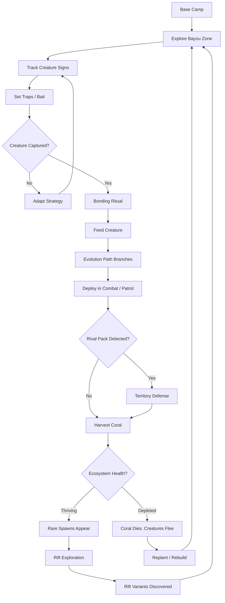
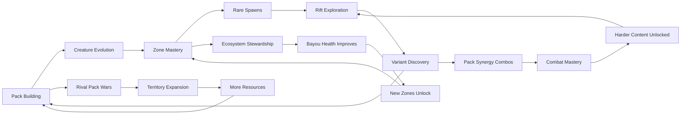

# Coral Displacer Pack

## Title & Genre

| Field | Value |
|-------|-------|
| **Title** | Coral Displacer Pack |
| **Genre** | Monster Collection / Open World Survival |
| **Engine** | Unreal Engine 5.4 (Nanite for dense bayou foliage, Lumen for volumetric coral glow) |
| **Platform** | PC (Steam/Epic), PlayStation 5, Xbox Series X/S, Nintendo Switch (cloud version) |
| **Monetization** | Premium $49.99 base, cosmetic DLC only, no microtransactions |
| **Rating** | ESRB E10+ (Fantasy Violence, Mild Suggestive Themes) / PEGI 12 / CERO B |

---

## Vision Statement

Coral Displacer Pack is an open-world monster collection game where a berserker exile bonds with coral-mutated creatures in a primordial bayou, building a pack whose abilities are shaped not by stats on a screen but by what each creature has consumed. The same base species becomes a teleporting assassin, a shapeshifting infiltrator, or a tank depending entirely on feeding choices the player makes across dozens of hours. The bayou is not a backdrop — it is a living ecosystem that withers without caretakers, collapses under overharvesting, and rewards players who learn to think like conservationists. Rival berserker packs roam the same bayou, collecting their own monsters, adapting to player strategies, and raiding territory when weakness is detected. This is Monster Hunter by way of Dark Souls invasions by way of an ecology textbook — a game where the deepest system is not combat but stewardship, and the rarest creature in the bayou is the player wise enough to keep it alive.

---

## Core Loop

**Target session length:** 45-90 minutes



### Core Loop Breakdown

| Step | Player Action | System Response | Skill Expression |
|------|--------------|----------------|-----------------|
| 1. Explore | Navigate bayou zones on foot or via bonded mount | Zones have dynamic weather, water levels, and creature populations tied to ecosystem health | Route planning, zone knowledge |
| 2. Track | Read environmental signs (tracks, scat, territorial marks, coral disturbance patterns) | Signs quality depends on player tracking skill and creature rarity — common creatures leave obvious signs, rare ones require knowledge | Pattern recognition, patience |
| 3. Trap | Place traps using gathered materials; bait with appropriate food | Creatures have bait preferences, trap sensitivity, and escape chances that vary by species and evolution tier | Preparation, resource management |
| 4. Bond | Perform bonding ritual — a minigame combining timing and calm-input sequences | Failed bonds damage the creature (releasable but injured); perfect bonds unlock a bonus trait slot | Timing precision, composure |
| 5. Feed | Choose what to feed the bonded creature from inventory | Feeding determines evolution direction — rift crystals grant teleportation, mimic residue grants shapeshifting, coral hearts grant durability | Strategic planning, long-term thinking |
| 6. Deploy | Assign creatures to pack slots (max 6 active); set patrol/combat roles | Creatures develop bond bonuses when deployed together — combo attacks and passive synergies emerge | Team composition, synergy discovery |
| 7. Harvest | Gather coral, rift crystals, organic materials from the bayou | Overharvesting depletes the local ecosystem — creature populations drop, coral growth slows, zone health degrades | Restraint, sustainability awareness |
| 8. Defend | Respond to rival pack raids; fortify base camp | Rival AI learns from player strategies and adapts pack composition over time | Tactical defense, quick reaction |

---

## Meta Loop

### Session-to-Session Progression



### Progression Axes

| Axis | What Grows | How It Feels | Cap |
|------|-----------|-------------|-----|
| **Pack Diversity** | Number and variety of bonded creatures | Your pack becomes a living bestiary — every creature earned, not bought | 47 base species, 200+ evolution variants |
| **Evolution Mastery** | Understanding of feeding sequences and their outcomes | You stop guessing and start engineering creatures with purpose | 8 feeding material families, 3-5 evolution tiers per species |
| **Ecosystem Knowledge** | Understanding of bayou food webs, coral cycles, zone interdependence | The bayou stops being hostile and becomes a system you manage | 12 zones, each with unique ecology and interdependencies |
| **Base Camp** | Camp structures, defenses, coral gardens, breeding pens | A crude lean-to transforms into a bioluminescent fortress | 4 camp tiers, 32 buildable structures |
| **Rival Supremacy** | Defeating rival packs and absorbing their members | Every rival defeated makes you stronger — but the bayou's human population thins | 8 rival berserker packs, escalating difficulty |
| **Player Skill** | Combat execution, trap placement timing, bond ritual precision | Invisible but most powerful — your pack is only as good as your command | No cap — mastery is perpetual |

---

## Game Mechanics

### Primary Mechanic: Consumption-Based Evolution

Creatures do not level up. They evolve based on what they eat. Every creature has a base species with a genetic profile — a hidden grid of potential traits that are activated or suppressed by feeding materials. The same base species fed different materials over its lifespan produces wildly different outcomes.

**8 Feeding Material Families:**

| Family | Source | Primary Effect | Visual Indicator |
|--------|--------|---------------|-----------------|
| **Rift Crystal** | Unstable rifts, rift-glowing deposits | Teleportation abilities, spatial manipulation, blink attacks | Lattice patterns on hide, eyes glow indigo |
| **Mimic Residue** | Defeated mimics, abandoned mimic nests | Shapeshifting, disguise, copy abilities, item mimicry | Iridescence on scales/fur, color-shifting patches |
| **Coral Heart** | Living coral formations (harvested carefully) | Durability, armor, health regeneration, defensive auras | Coral growths on body, calcified plating |
| **Bloom Spore** | Bioluminescent fungi, bloom chambers | Healing abilities, status cures, ally buffs, regeneration fields | Fungal caps on joints, gentle spore emission |
| **Depth Essence** | Deep water zones, submerged ruins | Aquatic abilities, pressure resistance, sonar, tidal attacks | Gills, webbing, bioluminescent dorsal ridges |
| **Venom Sac** | Toxic creatures, corrupted pools | Poison attacks, debuffs, corrosion, area denial | Pulsing venom glands, discolored patterns |
| **Storm Shard** | Storm-exposed crystal deposits, lightning-struck trees | Speed, evasion, electrical attacks, chain lightning | Crackling energy, static-charged fur/feathers |
| **Bone Meal** | Skeletonized remains, ossuary deposits | Brute force, size increase, structural attacks, intimidation | Bone-white accents, enlarged frame, skeletal protrusions |

**Evolution Example — Displacer Beast (4 Evolution Tiers):**

| Tier | Feeding Requirement | Resulting Variant | Key Ability | Combat Role |
|------|-------------------|-------------------|-------------|-------------|
| Base | Captured wild | Displacer Beast (base) | Short-range blink (5m) | Flanker |
| Tier 2 | 12x Rift Crystal | Rift Stalker | Medium-range teleport (20m), rift sense | Assassin |
| Tier 2 | 12x Mimic Residue | Shifter Beast | Copy one allied creature's ability for 30 seconds | Utility |
| Tier 2 | 12x Coral Heart | Ironhide Displacer | +60% armor, blink creates shockwave | Tank |
| Tier 3 | 30x Rift Crystal + 8x Storm Shard | Phase Lord | Unlimited teleport range within line of sight, chain blink (3 targets) | Elite Assassin |
| Tier 3 | 30x Depth Essence + 8x Rift Crystal | Abyssal Blinker | Underwater teleportation, creates whirlpool on arrival | Aquatic Specialist |
| Tier 4 | Rift Stalker + 20x Rift Crystal + 10x Bloom Spore | Rift Prophet | Teleport entire pack within 30m, heal allies on arrival | Support/Initiator |

**Evolution is irreversible but not singular.** Players maintain multiple creatures of the same base species on different evolution paths. The pack system (6 active slots) encourages strategic diversity over specialization.

### Secondary Mechanic: Territory Stewardship and Ecosystem Simulation

The bayou is a simulated ecosystem with population dynamics, food chains, and resource cycles. Every zone tracks:

- **Coral Coverage** (0-100%): Coral growth rate, harvesting sustainability, visual health
- **Creature Population** (per species): Birth rate, death rate, migration, extinction risk
- **Biodiversity Index** (0-100): Variety of species present; rare creatures require high biodiversity
- **Soil Toxicity** (0-100): Pollution from overharvesting, rival pack activity, or invasive species

**Ecosystem State Table:**

| Zone Health | Coral Coverage | Creature Density | Rare Spawns | Visual State |
|------------|---------------|-----------------|-------------|-------------|
| Pristine (90-100%) | Dense, luminous, growing | High, balanced | Ultra-rare variants appear | Bioluminescent paradise, crystal-clear water |
| Healthy (70-89%) | Thick, stable | Good, some migration | Rare spawns appear regularly | Vibrant colors, active wildlife sounds |
| Stressed (50-69%) | Thinning, dimming | Moderate, some species leaving | Rare spawns reduced 50% | Colors fading, water slightly murky |
| Depleted (30-49%) | Sparse, dull | Low, territorial conflicts | No rare spawns | Muted palette, silence, dead coral |
| Dead (0-29%) | Gone, skeletal remains | Minimal, only hardy species | None | Gray, stagnant water, silence |

**Ecosystem Recovery Actions:**

| Action | Effect | Time to Impact |
|--------|--------|---------------|
| Plant coral fragments | +2% coral coverage per fragment, max 10 per cycle | 2 in-game days (40 min real-time) |
| Relocate species to depleted zone | +5% biodiversity, -3% from source zone | Immediate |
| Clear pollution sources | -10% soil toxicity | 1 in-game day |
| Introduce prey species for predators | Stabilizes predator population, prevents migration | 3 in-game days |
| Build coral nursery at base camp | +1% coral coverage per day to nearest zone, passive | Passive (continuous) |
| Leave zone untended for 7+ days | -3% coral per day, -5% biodiversity per day | Gradual decline |

**Invasive Species Events:** Introducing species carelessly triggers cascades. Example: releasing a non-native predator into a zone with no competing predators causes prey population collapse within 3 in-game days, followed by predator starvation, followed by migration of the predator into adjacent zones. The simulation runs continuously — player actions have delayed, compounding consequences.

### Secondary Mechanic: Pack Synergy Combat

Creatures in the pack develop bond bonuses when deployed together. Synergies are not randomly assigned — they emerge from creature types, evolution paths, and time spent fighting alongside each other.

**Synergy Development:**

| Bond Level | Battles Together | Effect | Visual |
|-----------|-----------------|--------|--------|
| Acquainted | 3 | +5% coordinated attack speed | Brief eye contact animation at battle start |
| Familiar | 10 | Combo attack unlocked (contextual) | Matching aura glow when near each other |
| Bonded | 25 | Passive buff shared between pair (+10% to relevant stat) | Coordinated movement animations, shared bioluminescence |
| Pack-Bound | 50 | Ultimate synergy ability unlocked | Visual synchronization — auras merge into one pattern |

**Example Synergy Combos:**

| Creature Pair | Synergy Name | Combo Effect | Unlock Requirement |
|--------------|-------------|-------------|-------------------|
| Rift Stalker + Shifter Beast | Phantom Exchange | Rift Stalker teleports the Shifter Beast behind enemy lines; Shifter Beast copies Rift Stalker's teleport for one use | Familiar bond |
| Ironhide Displacer + Bloom Spore creature | Living Fortress | Ironhide becomes immovable; Bloom creature channels continuous healing through Ironhide's coral plating | Bonded bond |
| Phase Lord + any 3 creatures | Rift Network | Phase Lord creates a teleport network allowing all pack members to blink between 3 anchor points | Pack-Bound bond (rare) |

**Combat is real-time with tactical pause.** Players issue commands to individual creatures or set behavioral stances (aggressive, defensive, support, flee). Creatures execute autonomously based on stance, with combo attacks triggered automatically when synergy conditions are met and creatures are in range.

### Secondary Mechanic: Berserker Pack Wars

8 rival berserker packs roam the bayou, each led by an AI berserker with distinct personality, strategy, and pack composition. Rivals are not scripted encounters — they are simulated agents with their own goals.

**Rival Berserker AI Behavior:**

| Rival | Personality | Strategy | Pack Specialization | Territory |
|-------|------------|----------|-------------------|-----------|
| Kael the Restless | Aggressive, impatient | Frequent raids, brute force | Storm Shard evolutions, speed-focused | Eastern mangroves |
| Mira the Patient | Calculating, defensive | Fortifies territory, ambushes attackers | Coral Heart evolutions, tank-heavy | Northern ridge |
| Dren the Collector | Obsessive, completionist | Captures every species, trades territory for specimens | Diverse pack, no specialization | Central basin |
| Vash the Corruptor | Destructive, wasteful | Overharvests zones, leaves destruction | Venom Sac evolutions, debuff-focused | Southern toxic flats |
| The Twins (Luka and Sera) | Coordinated, unpredictable | Twin-pronged attacks, divide and conquer | Mimic Residue evolutions, deception | Western cave network |
| Old Thess | Wise, territorial | Defensive, retaliates proportionally | Depth Essence evolutions, aquatic supremacy | Deep water channels |
| Rook the Mechanic | Systematic, adaptive | Learns player strategies, counters builds | Mixed evolution, adapts to counter player | Mobile (roams) |
| The Pale Pack (feral) | Non-human, instinctive | Pack-hunting, territorial, not a berserker — a wild apex pack | Bone Meal evolutions, raw power | Uncharted deep bayou |

**Rival Learning System:** Rook the Mechanic explicitly adapts to the player. After each encounter, Rook's AI adjusts:
- If player relies on teleporting creatures, Rook adds Storm Shard creatures (speed to intercept blinks)
- If player uses tank-heavy formations, Rook adds Venom Sac creatures (armor-piercing debuffs)
- If player tends to specific terrain, Rook sets ambushes in those zones
- Other rivals adapt more slowly (10-20% adjustment per encounter vs. Rook's 40-50%)

**Consequence of Killing Rivals:** Defeating a rival lets you absorb their pack members (instant strength gain). Killing the rival berserker permanently removes them — the bayou's human population drops, which triggers:
- Reduced trading opportunities (each berserker runs a small trading network)
- Reduced zone caretaking (berserkers maintain their own territories)
- Narrative consequences (the bayou's lore is shaped by who survives)
- Endgame threshold: if fewer than 3 berserkers survive, the "Empty Bayou" ending becomes available

### Secondary Mechanic: Rift Navigation

Coral growths create unstable rifts between bayou zones. Rifts are the primary exploration risk/reward system and the only way to discover ultra-rare creature variants.

**Rift Mechanics:**

| Rift Type | Stability | What Happens | Rare Variant Chance |
|-----------|----------|-------------|-------------------|
| Shimmer Rift | High (stable) | Safe passage to known zone | 5% — minor color variant |
| Pulse Rift | Medium | Creature sent through returns changed: +1 random trait | 15% — elemental variant |
| Storm Rift | Low | Creature may return mutated, injured, or bring back an unexpected creature | 30% — major variant |
| Void Rift | Unknown | Creature enters unknown territory; returns in 1-3 in-game days with unknown changes | 50% — unique variant (one per playthrough) |
| Resonance Rift | Ultra-rare | Only appears at 100% ecosystem health; leads to secret zone | 100% — legendary variant |

**Rift Exploration Protocol:**
1. Select a creature from your pack to send through a rift
2. The creature is unavailable while exploring (1-3 in-game days)
3. During exploration, the creature's bond level slowly degrades (risk of losing a bond tier)
4. Upon return, the creature has changed — the change is deterministic based on rift type, creature species, evolution tier, and hidden seed, NOT random
5. Void Rift and Resonance Rift changes are logged in a hidden codex that the community will crowdsource over time

---

## World Design

### Map Structure

Open world divided into 12 interconnected zones. Zones are gated by traversal abilities (mount access, water breathing, rift attunement) and ecosystem health (some zones unlock only when adjacent zones reach specific health thresholds).

```
                         ┌──────────────────────┐
                         │   UNCHARTED DEEP     │
                         │  (Legendary Zone)     │
                         │  Req: 100% health all │
                         └──────────┬───────────┘
                                    │
              ┌─────────────────────┴──────────────────────┐
              │                                             │
    ┌─────────┴──────────┐                      ┌───────────┴─────────┐
    │  WESTERN CAVES     │                      │  EASTERN MANGROVES  │
    │  (Cave Network)    │                      │  (Kael's Territory) │
    └─────────┬──────────┘                      └───────────┬─────────┘
              │                                             │
    ┌─────────┴──────────┐                      ┌───────────┴─────────┐
    │  NORTHERN RIDGE    │                      │  DEEP WATER         │
    │  (Mira's Fort)     │                      │  CHANNELS           │
    └─────────┬──────────┘                      │  (Thess's Domain)   │
              │                                 └───────────┬─────────┘
              └─────────────┬───────────────────────────────┘
                            │
                  ┌─────────┴──────────┐
                  │   CENTRAL BASIN    │
                  │  (Dren's Hub)      │
                  │  + Player Base Camp│
                  └─────────┬──────────┘
                            │
              ┌─────────────┴──────────────┐
              │                            │
    ┌─────────┴──────────┐     ┌───────────┴─────────┐
    │  SOUTHERN TOXIC    │     │  CRIMSON SHALLOWS    │
    │  FLATS             │     │  (Starter Zone)      │
    │  (Vash's Domain)   │     └───────────┬─────────┘
    └────────────────────┘                 │
                              ┌────────────┴───────────┐
                              │                        │
                   ┌──────────┴──┐          ┌──────────┴───┐
                   │ MOSS REACH  │          │ GATOR HOLLOW │
                   │ (Forest)    │          │ (Swamp)      │
                   └─────────────┘          └──────────────┘
```

**Zone Interdependence:** Each zone produces specific feeding materials and harbors specific creature species. The ecosystem simulation tracks species migration between adjacent zones. A health crisis in one zone ripples into neighbors within 2-3 in-game days.

### Art Direction Pillars

| Pillar | Description | Reference |
|--------|-------------|-----------|
| **Luminous Corruption** | Coral growths in teal, gold, and crimson against dark swamp water — beauty and menace coexisting | Hollow Knight's Fungal Wastes meets Avatar's bioluminescence |
| **Primordial Bayou** | Ancient cypress, hanging moss, black water — nature that predates and outlasts civilization | The Swamp from Princess Mononoke, Louisiana bayou photography |
| **Bestial Majesty** | Creatures are animals first, magical second — coral growths are integrated into anatomy, not slapped on | Monster Hunter World's ecological design, Pokemon Legends: Arceus encounter feel |
| **Berserker Primitivism** | Human structures are crude, functional, built from bayou materials — no civilization, only survival | Far Cry Primal base aesthetics, Shadow of the Colossus minimalism |

### Visual and Audio Progression

| Zone | Palette Dominant | Lighting Mood | Ambient Audio | Music Element |
|------|-----------------|--------------|--------------|---------------|
| Crimson Shallows (starter) | Amber, rust, warm brown | Golden hour, dappled sunlight | Cricket chorus, gentle water, bird calls | Acoustic guitar, gentle |
| Moss Reach | Deep emerald, moss gold, bark brown | Filtered canopy light, firefly glow | Dense insect hum, woodpecker, wind through leaves | Woodwind enters |
| Gator Hollow | Murky green, gray water, bone white | Overcast, fog at water level, low visibility | Low rumbling, splash, hiss, distant bellow | Bass drone, percussive |
| Central Basin | Teal coral, indigo water, amber structures | Bioluminescent glow, reflected coral light | Activity — creature calls, water movement, wind | Full ensemble warm |
| Northern Ridge | Slate, iron gray, deep purple | Harsh moonlight, wind exposure | Howling wind, rock crack, distant thunder | Strings, tension |
| Eastern Mangroves | Red-black water, green canopy, lightning white | Storm-lit, frequent lightning flashes | Thunder, heavy rain, electrical crackle | Percussion-heavy, aggressive |
| Western Caves | Black, phosphorescent blue, pale green | Self-illuminated (coral glow only), deep shadows | Dripping, echoes, wing beats, silence | Ambient synth, eerie |
| Southern Toxic Flats | Sickly yellow, dull green, black sludge | Hazy, low visibility, toxic shimmer | Burbling, insect death rattle, silence | Distorted, dissonant |
| Deep Water Channels | Midnight blue, bioluminescent teal, pressure black | Underwater caustics, bioluminescent points | Muffled above-water sounds, whale-like calls, pressure groan | Ethereal choir, aquatic |
| Uncharted Deep | All colors at once — overwhelming bioluminescence | Everything glows, no shadows, sensory overload | Symphony of all creature calls, harmonic resonance | Full orchestra, triumphant |

---

## Narrative

### Tone Spectrum (7-Axis)

| Axis | Position | Notes |
|------|----------|-------|
| Hope vs. Despair | 60% Hope | The bayou can be healed; creatures can be saved; stewardship matters |
| Civilization vs. Wild | 85% Wild | Berserkers are the only humans; the bayou is the protagonist |
| Competition vs. Cooperation | 50/50 | Rival packs are antagonists, but their survival benefits the bayou |
| Beauty vs. Danger | 70% Beauty | The bayou is gorgeous; the danger is what you take from it |
| Predation vs. Symbiosis | 65% Symbiosis | Bonding is the core verb; consumption is earned, not taken |
| Known vs. Unknown | 75% Unknown | Rifts, creature variants, ecosystem cascades — discovery is perpetual |
| Action vs. Contemplation | 55% Action | Combat is frequent, but the deepest rewards come from observation |

### 8-Point Story Spine

**1. Equilibrium**
The player character is a nameless berserker, exiled from a distant northern warband for refusing to execute a prisoner. They arrive at the Bayou of Coral Echoes by following rumors of a place where exile is not a death sentence — where the wild is so abundant that even a lone human can survive. The bayou is immense, luminous, and indifferent. The exile stumbles into the Crimson Shallows, barely surviving a displacer beast ambush, and crawls to a ruined campsite left by a previous berserker long dead.

**2. Inciting Incident**
The exile discovers a wounded displacer beast pup caught in a collapsed coral formation. Rather than killing it for food, the exile frees it. The pup imprints — bonding is instinctive in this bayou, triggered by acts of care. The exile feels the bond as a warmth spreading through their chest, and the pup's coral growths pulse in sync with their heartbeat. This is the first pack bond. The exile now has a purpose: survive, build a pack, master the bayou.

**3. First Complication**
The exile encounters Kael the Restless raiding a coral deposit in the Crimson Shallows. Kael attacks, and the exile discovers that berserkers in this bayou fight through their packs — proxy wars where bonded creatures clash while berserkers command. The exile loses badly. Kael spares them with a warning: "You're in my territory now. Get strong or get out." The exile realizes the bayou is not empty — it is a contested landscape of competing berserkers, each with their own pack and territory.

**4. Rising Action**
The exile explores deeper zones, captures and bonds new creatures, and begins to understand the bayou's ecology. They encounter Old Thess, who teaches the principles of stewardship — overharvest and the bayou dies; protect it and it rewards you. They encounter Vash the Corruptor, who demonstrates the alternative: strip-mine a zone for quick power, move on, leave dead water behind. The exile encounters the Pale Pack — a feral pack of bone-white creatures led by no human, operating on pure instinct, apex predators that even the berserkers avoid.

**5. Midpoint Reversal**
The exile discovers a Resonance Rift and enters a secret zone beneath the bayou — a vast coral cathedral where the bayou's consciousness resides. The bayou is alive. Not metaphorically — it is a distributed intelligence encoded in the coral network, and the creatures are its immune system. The berserkers are a disease the bayou has been fighting for centuries. Bonding is the bayou's attempt at symbiosis — it offers power to berserkers in exchange for care. The exile's bond with their pack is not domination; it is negotiation. The bayou has been waiting for a berserker who listens.

**6. Crisis**
Rook the Mechanic has been studying the exile's strategies and launches a coordinated assault on the Central Basin, the exile's home territory. Simultaneously, Vash the Corruptor poisons the Southern Toxic Flats beyond recovery, and the ecological cascade threatens to spread. The exile must choose: defend their territory against Rook, or rush south to contain the ecological disaster. They cannot do both in time.

**7. Climax**
Depending on choices made throughout the game (rivals killed vs. spared, zones restored vs. depleted, creatures bonded vs. consumed), one of three final scenarios unfolds:
- **The Gathering:** The exile rallies surviving rivals against the Pale Pack, which has been driven berserk by Vash's ecological destruction and threatens to consume the entire bayou. Alliance warfare across all zones.
- **The Last Caretaker:** The exile is the last berserker standing (all others killed or departed). The bayou is wounded but recovering. The Pale Pack approaches not as enemies but as the bayou's immune response — they challenge the exile to prove they are symbiont, not parasite.
- **The Empty Bayou:** Too many rivals killed, too many zones depleted. The bayou's consciousness is dying. The exile must enter the coral cathedral and sacrifice their pack bonds to reignite the bayou's living network. The creatures go free, the bayou survives, and the exile walks out alone.

**8. Resolution**

Three endings based on cumulative choices:
- **Symbiosis Ending:** Bayou health above 80% across all zones, at least 4 rivals alive, at least 40 creatures bonded. The exile becomes the bayou's chosen caretaker. The coral cathedral blooms. All bonded creatures remain. The bayou thrives. This is the hardest ending — it requires mastery of every system simultaneously.
- **Dominance Ending:** Bayou health above 50%, any number of rivals alive. The exile rules the bayou through strength. Creatures serve. The bayou survives but is not healthy — it tolerates the exile. A strong ending but not a happy one.
- **Sacrifice Ending:** Available when bayou health drops below 30% or all rivals are killed. The exile gives back what they took. All pack bonds are released. The bayou regenerates from the energy. The exile leaves with nothing — the only ending where the exile departs the bayou.

### Key Characters

| Character | Role | Theme | Bestiary Contribution |
|-----------|------|-------|----------------------|
| **The Exile** (player) | Protagonist — Nameless berserker | Survival evolving into stewardship; the warrior who learns to nurture | N/A (player character) |
| **Kael the Restless** | Rival — Aggressive expansionist | Strength as identity; the berserker who never stops fighting | 12 territory logs found in Eastern Mangroves |
| **Old Thess** | Mentor — Ancient berserker | Wisdom through survival; has seen berserkers come and go for decades | 18 teaching fragments across Deep Water Channels |
| **Vash the Corruptor** | Antagonist — Destructive exploiter | Short-term gain at long-term cost; the berserker as parasite | 8 poisoning reports found in Southern Toxic Flats |
| **Rook the Mechanic** | Rival — Adaptive strategist | Systems thinking weaponized; treats the bayou as a machine to optimize | 15 analysis notes found wherever the exile has been |
| **The Pale Pack** | Force of Nature — Feral apex pack | The bayou's immune response; wildness that cannot be tamed or reasoned with | 7 encounter logs, one per zone where they appear |
| **The Bayou** | Setting and Character — Distributed intelligence | Nature as consciousness; every action is noticed, every harm is remembered | 24 coral resonance fragments found at 100% health zones |

---

## Player Personas

### P-003: Hiroshi Tanaka -- The RPG Addict

**Why this game fits:** 47 base species, 200+ evolution variants, 12 zones, 8 rival berserkers, 3 endings, a hidden codex of rift outcomes — this is a completionist's fever dream. The consumption-based evolution system has genuine strategic depth that rewards theorycrafting. The ecosystem simulation creates long-term consequences that reward planning over impulse. The rift exploration system has deterministic outcomes that the community will decode together — Hiroshi will be the one building the spreadsheet.

**Predicted experience:** Hiroshi will methodically explore each zone to 100% health before advancing. He will capture multiple copies of each base species to pursue parallel evolution paths. He will build feeding sequence spreadsheets shared on Discord. He will pursue the Symbiosis ending on his first playthrough. He will love the evolution system; he will find the rival pack raids stressful but acceptable as pacing variety.

### P-008: David Park -- The Achievement Hunter

**Why this game fits:** Creature collection creates a natural collectible structure — 47 base species tracked, 200+ variants catalogued, 8 rivals defeated or befriended, 12 zones restored, rift outcomes documented. The achievement system tracks all of these with clear completion percentages. The rift codex (hidden until discovered) gives David a meta-collection goal that extends beyond the base game. The Symbiosis ending is a capstone achievement requiring mastery of every system.

**Predicted experience:** David will track every creature variant in a personal database. He will methodically unlock every synergy combo. He will play 2-3 sessions simultaneously across different save files (one for each ending path). He will appreciate that all achievements are systemic (no RNG gates, no time-limited exclusives). He will immediately flag if any creature variant is bugged or unobtainable.

### P-006: Eleanor Vance -- The Loyal Strategist

**Why this game fits:** The ecosystem simulation is the deepest strategic layer in the game. Eleanor will see the bayou as a system to master — not through combat optimization but through ecological understanding. The stewardship mechanics reward patience and long-term planning over quick gains. The rival berserker AI creates dynamic strategic challenges. The consumption-based evolution system rewards thoughtful planning over reflexive button-mashing. Premium pricing with no microtransactions means the experience is earned, not bought.

**Predicted experience:** Eleanor will focus on ecosystem management as her primary engagement. She will spend more time planting coral and managing zone health than fighting rivals. She will develop zone restoration strategies optimized for efficiency. She will prefer the Symbiosis ending naturally. She will deeply appreciate that the game rewards care over aggression. She will become the community's go-to resource for ecosystem management guides.

### P-009: Liam O'Connor -- The Dedicated F2P

**Why this game fits:** Premium at $49.99 with zero microtransactions. No pay-to-win. No energy systems. No gacha. The evolution system rewards knowledge and planning — no shortcut exists. The rival AI adapts to player behavior, ensuring the challenge scales with skill. The combat is real-time with tactical depth — reaction time and strategy matter. Liam's anti-P2P stance aligns perfectly with a game where every creature is earned through gameplay.

**Predicted experience:** Liam will advocate for the game specifically because of the fair monetization model. He will create pack composition guides optimized for defeating each rival. He will attempt challenge runs (minimum creature count, no rift exploration, all rivals spared). He will be the most vocal organic promoter in every community he participates in.

---

## User Stories

### Exploration (8 stories)

1. As **Hiroshi (P-003)**, I want creature tracking to leave increasingly subtle environmental clues based on creature rarity so that finding rare specimens feels like earned mastery, not luck.
2. As **David (P-008)**, I want every zone to contain hidden coral formations visible only at 90%+ ecosystem health so that thorough stewardship is rewarded with unique discoveries.
3. As **Eleanor (P-006)**, I want zone health to be visible through environmental cues (water clarity, coral luminosity, creature density) rather than HUD meters so that observation IS the interface.
4. As **Hiroshi (P-003)**, I want rift exploration outcomes to be deterministic and decodeable so that the community can build a shared knowledge base rather than relying on RNG.
5. As **Liam (P-009)**, I want mount traversal to require bonding with a specific creature type so that mobility is earned through gameplay, not unlocked through menus.
6. As **David (P-008)**, I want 12 interconnected zones with unique ecologies so that each zone feels like a distinct collection and restoration challenge.
7. As **Eleanor (P-006)**, I want species migration between adjacent zones to be visible and trackable so that I can anticipate population changes before they become problems.
8. As **Hiroshi (P-003)**, I want the Uncharted Deep zone to only unlock when all 11 other zones reach 100% health so that the legendary content rewards total mastery.

### Core Mechanics (8 stories)

9. As **Hiroshi (P-003)**, I want feeding material families to have clear, learnable interactions so that I can engineer specific evolution outcomes through deliberate feeding plans.
10. As **Liam (P-009)**, I want bonding rituals to require timing and composure so that creature acquisition is a skill test, not a menu selection.
11. As **Eleanor (P-006)**, I want overharvesting to have visible, delayed consequences so that sustainable resource management feels meaningful, not arbitrary.
12. As **David (P-008)**, I want pack synergy combos to be discovered through combat experimentation, not listed in a menu, so that discovery is genuine.
13. As **Hiroshi (P-003)**, I want evolution to be irreversible so that feeding decisions carry weight and multiple playthroughs explore different paths.
14. As **Liam (P-009)**, I want rival berserker AI to learn from my strategies so that combat remains challenging as I improve, not easier as I optimize.
15. As **Eleanor (P-006)**, I want invasive species events to trigger from careless player actions so that ecological consequences teach stewardship through experience.
16. As **Hiroshi (P-003)**, I want rift variants to be logged in a hidden codex that fills as I discover them so that completionists have a meta-collection goal.

### Narrative (5 stories)

17. As **Hiroshi (P-003)**, I want the Bayou to be a character with its own motivations so that my actions feel narratively significant, not mechanically transactional.
18. As **David (P-008)**, I want rival berserker backstories to be discoverable through environmental exploration so that narrative understanding rewards curiosity.
19. As **Eleanor (P-006)**, I want the Symbiosis ending to require maintaining 4+ living rivals so that mercy and cooperation are mechanically rewarded, not just narratively.
20. As **Liam (P-009)**, I want rival encounters to be avoidable through stealth and territory management so that violence is a choice, not a requirement.
21. As **Hiroshi (P-003)**, I want the Sacrifice ending to require genuinely difficult trade-offs (releasing all bonded creatures) so that the emotional weight matches the mechanical cost.

### Progression (6 stories)

22. As **David (P-008)**, I want 47 base species with 200+ tracked variants so that creature collection is a multi-layered completion challenge.
23. As **Hiroshi (P-003)**, I want 4 camp tiers with 32 buildable structures so that base building has a full progression arc with meaningful choices.
24. As **Eleanor (P-006)**, I want zone restoration milestones to unlock new creature spawns so that stewardship directly gates progression content.
25. As **David (P-008)**, I want the rift codex to have a completion percentage visible on the main menu so that meta-collection progress is always trackable.
26. As **Liam (P-009)**, I want New Game+ to reshuffle rift outcomes and rival starting positions so that replays feel fresh without inflating numbers.
27. As **Hiroshi (P-003)**, I want bond levels between creatures to persist across playthroughs in NG+ so that synergy investment is rewarded long-term.

### Accessibility (4 stories)

28. As a player with motor impairments, I want tactical pause to be unlimited and binding rituals to have an assist mode with extended timing windows so that creature acquisition is accessible without being trivialized.
29. As **David (P-008)**, I want fully remappable controls with controller and keyboard/mouse support so that my preferred input method is always supported.
30. As a player with color vision deficiency, I want evolution indicators to use shape and pattern (not just color) so that feeding outcomes are readable without color perception.
31. As a player with hearing impairment, I want creature tracking clues to have visual equivalents for every audio cue so that no gameplay information is audio-only.

### Social and Community (4 stories)

32. As **Liam (P-009)**, I want a shared rift codex that syncs discoveries across all players so that the community collectively decodes deterministic rift outcomes.
33. As **Hiroshi (P-003)**, I want pack composition export/import so that players can share builds and strategies without screenshots.
34. As **Liam (P-009)**, I want no microtransactions, no battle pass, and no time-limited exclusives so that I can champion the game in every community as a fair, complete experience.
35. As **David (P-008)**, I want creature variant collection to be visible on a player profile so that completionists can showcase their achievements.

---

## Monetization

### Revenue Model: Premium at $49.99

**Why this model fits this game:**
- Monster collection players expect deep, complete experiences — the $49.99 price signals depth and quality
- The evolution system is inherently knowledge-based — no monetizable shortcut exists without destroying the core loop
- Ecosystem stewardship rewards patience — incompatible with energy systems or time gates
- The target audience (P-003, P-006, P-008, P-009) values fair, complete experiences and will champion the game for its monetization model
- The rift codex is a shared community discovery project — monetizing information would destroy the social experience

### Pricing and DLC Roadmap

| Product | Price | Content | Target Window |
|---------|-------|---------|--------------|
| Base Game | $49.99 | Full campaign, 12 zones, 47 species, 200+ variants, 3 endings | Launch |
| Digital Deluxe | $64.99 | Base + art book + soundtrack + "Exile's Cache" cosmetic camp decorations | Launch |
| DLC 1: "The Flooded Spires" | $19.99 | 3 new zones, 12 new species, 50+ variants, coral cathedral exploration | Month 8 |
| DLC 2: "The Berserker Chronicles" | $14.99 | Play as each rival berserker (8 short campaigns), their origin stories | Month 14 |
| Complete Edition | $59.99 | Base + both DLCs | Month 16 |

### Revenue Projections (4 Scenarios)

| Scenario | Year 1 Units | Year 1 Revenue | Year 2 (w/ DLC) | Total (2yr) | Assumptions |
|----------|-------------|---------------|-----------------|------------|-------------|
| **Modest** | 75,000 | $2.9M | $0.9M | $3.8M | Niche appeal, word-of-mouth, genre-loyal audience, 15% DLC attach |
| **Baseline** | 200,000 | $7.8M | $3.0M | $10.8M | Moderate marketing, positive reviews, creature-collection cross-appeal, 25% DLC attach |
| **Strong** | 500,000 | $19.5M | $8.8M | $28.3M | Strong reviews, influencer coverage, Monster Hunter/Palworld audience capture, 30% DLC attach |
| **Breakout** | 1,200,000 | $46.8M | $25.2M | $72.0M | Viral ecosystem content, award nominations, streaming presence, 35% DLC attach + complete edition |

**Break-even at approximately 56,000 units ($2.2M) against total development budget of approximately $2.1M (see Production Plan).**

---

## Production Plan

### Team

| Role | Count | Phase | Monthly Cost (Loaded) |
|------|-------|-------|----------------------|
| Game Director / Lead Design | 1 | All | $12,000 |
| Systems Designer (Ecosystem) | 1 | All | $10,000 |
| Combat Designer | 1 | All | $9,500 |
| Level Designer | 2 | Months 3-16 | $8,500 each |
| AI Programmer (Creatures + Rivals) | 2 | All | $10,500 each |
| Systems Programmer (Evolution + Ecosystem) | 2 | All | $10,000 each |
| Engine / Rendering Programmer | 1 | Months 1-6, 14-18 | $11,000 |
| UI Programmer | 1 | Months 2-16 | $9,000 |
| 3D Artists (Environment) | 3 | Months 3-14 | $8,000 each |
| 3D Artists (Creature Design) | 3 | Months 2-16 | $8,500 each |
| VFX Artist | 1 | Months 6-16 | $8,000 |
| Technical Artist | 1 | Months 2-16 | $9,000 |
| Animation Lead | 1 | Months 3-16 | $9,500 |
| Animators | 2 | Months 4-16 | $7,500 each |
| Audio Designer / Composer | 1 | Months 4-16 | $7,500 |
| QA Lead | 1 | Months 10-18 | $7,000 |
| QA Testers | 3 | Months 12-18 | $5,000 each |
| Producer | 1 | All | $10,000 |

**Total team: 28 people peak (months 6-14)**

### Timeline (20-month production)

| Month | Milestone | Key Deliverables |
|-------|-----------|-----------------|
| 1 | Prototype | Creature bonding loop, feeding system (3 material families), base camp structure, 1 zone greyboxed |
| 2 | Prototype Expansion | Evolution system prototype (4 variants), combat system (3 creatures, real-time with pause), 1 rival AI behavior |
| 3 | Vertical Slice | Crimson Shallows playable end-to-end, 5 creature species with 12 variants, 1 rival encounter, ecosystem simulation prototype |
| 4 | Pre-Production Complete | All 12 zones greyboxed, 47 species roster finalized, evolution tree complete (200+ variants), design doc locked |
| 5 | Production Phase 1 | Zones 1-4 art pass, 20 species implemented with Tier 2 evolutions, ecosystem sim operational for 3 zones |
| 6 | Production Phase 1 | Base camp building system complete (Tier 1-2 structures), pack synergy system operational (10 combos) |
| 7 | Production Phase 2 | Zones 5-8 greybox complete, 35 species implemented, rift system prototype |
| 8 | Production Phase 2 | All 8 rival berserkers AI complete (basic behavior), ecosystem sim operational for all 12 zones |
| 9 | Production Phase 2 | Zones 5-8 art pass, 47 species implemented with Tier 2 evolutions, 40 synergy combos |
| 10 | Production Phase 3 | Zones 9-12 greybox complete, rift system fully operational, all Tier 3 evolutions implemented |
| 11 | Production Phase 3 | All rival encounters fully scripted and tuned, camp building complete (all 32 structures) |
| 12 | Production Phase 3 | Zones 9-12 art pass, all 200+ variants in-engine, Tier 4 evolutions implemented |
| 13 | Alpha | Full game playable, all systems integrated, internal testing begins |
| 14 | Alpha Iteration | Ecosystem balance pass, creature AI tuning, evolution outcome verification, performance optimization |
| 15 | Beta | Feature complete, content complete, external playtesting begins |
| 16 | Beta Iteration | Playtest feedback integration, final art polish, audio mix, rift codex verification |
| 17 | Release Candidate | Cert submission (PlayStation, Xbox, Nintendo), Steam submission, day-1 patch prep |
| 18 | Release Candidate 2 | Platform cert feedback, final fixes, Switch cloud version optimization |
| 19 | Launch | Game ships on all platforms, day-1 patch deployed, hotfix support |
| 20 | Post-Launch | Hotfixes, community engagement, shared rift codex monitoring, DLC 1 pre-production |

### Budget Breakdown

| Category | Cost | Notes |
|----------|------|-------|
| Salaries (20 months, 28 FTE peak) | $2,240,000 | Blended rate approximately $9,100/mo avg |
| Unreal Engine 5 royalties | $0 (first $1M gross revenue free) | 5% after $1M |
| Software and Tools | $48,000 | Perforce, Jira, Adobe CC, Houdini, Wwise, creature pipeline tools |
| Hardware (dev kits, workstations) | $78,000 | 2 PS5 dev kits, 2 Xbox dev kits, 1 Switch dev kit, 18 workstations |
| QA and Playtesting | $62,000 | External QA contractor, playtest facility, ecosystem balance testing |
| Audio (recording, music production) | $60,000 | Studio time, live ensemble for zone themes, creature vocalizations |
| Marketing | $150,000 | Trailers (3), convention presence (2), influencer outreach, PR firm retainer |
| Operations and Overhead | $85,000 | Office/incorporation/legal/accounting/insurance |
| Contingency (10%) | $272,300 | |
| **Total** | **$2,995,300** | |

---

## Technical Requirements

### Platform Specifications

| Spec | PC Minimum | PC Recommended | PlayStation 5 | Xbox Series X | Nintendo Switch (Cloud) |
|------|-----------|---------------|--------------|--------------|----------------------|
| **OS** | Windows 10 64-bit | Windows 11 64-bit | PS5 system software | Xbox OS | Switch OS + cloud app |
| **CPU** | Intel i5-8400 / AMD Ryzen 5 2600 | Intel i7-10700K / AMD Ryzen 7 3700X | Custom AMD Zen 2 | Custom AMD Zen 2 | Cloud (server-side) |
| **RAM** | 8 GB | 16 GB | 16 GB GDDR6 | 16 GB GDDR6 | 4 GB (client only) |
| **GPU** | GTX 1060 / RX 580 | RTX 3070 / RX 6800 XT | Custom RDNA 2 | Custom RDNA 2 | Cloud (server-side) |
| **Storage** | 30 GB SSD | 30 GB SSD | 30 GB SSD | 30 GB SSD | 2 GB (client) |
| **Target** | 1080p / 30 FPS | 1440p / 60 FPS | 4K/30 or 1440p/60 | 4K/30 or 1440p/60 | 1080p / 30 FPS (streamed) |

### Key Technical Challenges

| Challenge | Risk | Mitigation |
|-----------|------|-----------|
| **Ecosystem simulation across 12 zones** | High — population dynamics must be consistent, performant, and responsive to player actions | Tick-based simulation (1 tick per in-game hour = 2 minutes real-time). Population calculations are per-zone, not global. Only active zone + adjacent zones simulate at full fidelity; distant zones use simplified model. Tested in prototype (month 3). |
| **200+ creature variants with distinct visuals and AI** | High — asset volume is the biggest production risk | Modular creature system: base species skeleton + attachment points for coral growths + material swaps for evolution variants. AI uses shared behavior tree modules (patrol, aggro, combat, flee) with species-specific plug-ins. Art pipeline validated in month 2. |
| **Rival berserker AI that adapts to player strategies** | Medium — Rook the Mechanic must feel intelligent without being omniscient | Rook tracks player's last 10 combat deployments (creature types, evolution paths, synergy combos) and adjusts pack composition within constraints. Does not cheat — only uses information observable through gameplay. Other rivals adapt at 10-20% rate. |
| **Rift exploration with deterministic outcomes** | Low — outcomes are seeded, not random | Each rift has a seed derived from zone ID + rift type + creature species + evolution tier. Community-decodable. Hidden codex fills as outcomes are discovered. No server dependency — all seeds are local. |
| **Open world with 12 seamless zones** | Medium — streaming 12 zones with dynamic ecosystem state | World partition with 250m streaming radius. Zone boundaries use natural terrain (water channels, ridge lines, dense foliage) to mask streaming. Ecosystem state loaded per-zone in background. Water channels serve as visual transition masks. |
| **Bioluminescent coral rendering at scale** | Medium — hundreds of coral growths with volumetric glow | Instanced rendering for coral. Glow uses emissive materials + post-process bloom, not volumetric lights. Lumen GI picks up emissive contribution naturally. Low-spec fallback uses baked lightmaps for coral glow. |
| **Real-time combat with 6 creatures + rival pack (up to 12 entities)** | Medium — 12 AI agents in combat simultaneously with synergy combo detection | AI director manages combat pacing — only 3-4 creatures active at once per side; others execute support behavior (buffs, repositioning). Synergy detection uses proximity + bond level + cooldown state, checked every 0.5 seconds. |

---

<npl-block type="reflection">
Correctness: All 12 sections present (Title and Genre, Vision Statement, Core Loop, Meta Loop, Game Mechanics, World Design, Narrative, Player Personas, User Stories, Monetization, Production Plan, Technical Requirements). Numbers internally consistent — budget approximately $3M, break-even at 56K units, 28 FTE peak, 20-month timeline. 200+ variants derived from 47 species across 4 tiers with branching. 35 user stories across 6 categories.

Edge cases: Invasive species cascade documented with specific timeline (3 in-game days to prey collapse). Rift type table covers all 5 variants with escalation of risk/reward. Rival learning system documented with specific adaptation rates. Evolution irreversibility creates save-scumming incentive — addressed by making it a feature (multiple parallel creatures of same species). Rival kill consequences documented (trading loss, caretaking loss, ending gating).

Pitfalls: Persona library is mobile-gaming-oriented but the game is console/PC premium at $49.99. Addressed by selecting personas whose behavioral traits (completionism, strategy preference, anti-P2P stance, system mastery) transcend platform. Evolution system complexity could overwhelm casual players — mitigated by starter zone simplicity (Crimson Shallows introduces only 2 material families initially). Ecosystem simulation balance requires extensive playtesting — budgeted 3 months of alpha/beta specifically for this.

Improvements: Could expand rival berserker backstories into dedicated lore documents. Could add photo mode (creature collection game + beautiful bayou = screenshot opportunity). Could detail NG+ mechanics further. Could add cooperative multiplayer (two berserkers sharing a bayou).

Refactors: Document structure follows the established 12-section pattern from existing GDDs in the flesh directory.

Documentation: This IS the documentation.

Clarifications: None needed — all assumptions stated inline.

TODOs: DLC 1 ("The Flooded Spires") and DLC 2 ("The Berserker Chronicles") content would need separate design passes. Shared rift codex community feature needs server infrastructure spec. Switch cloud version needs network latency budget analysis.
</npl-block>