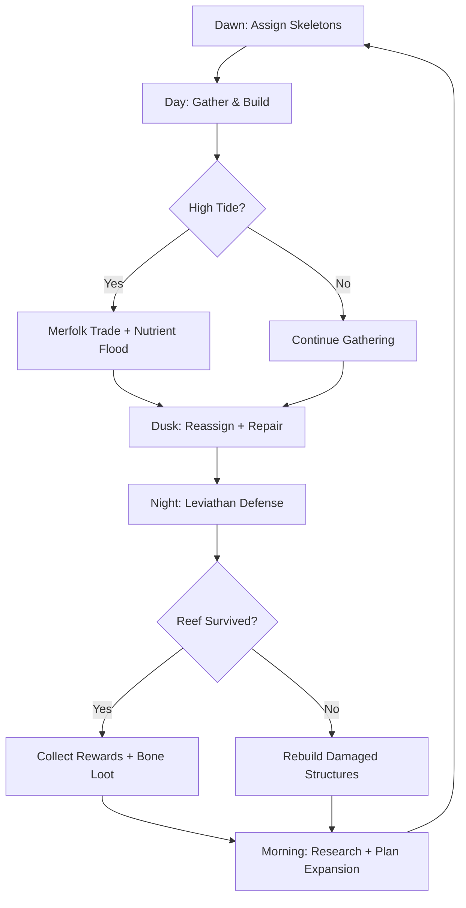
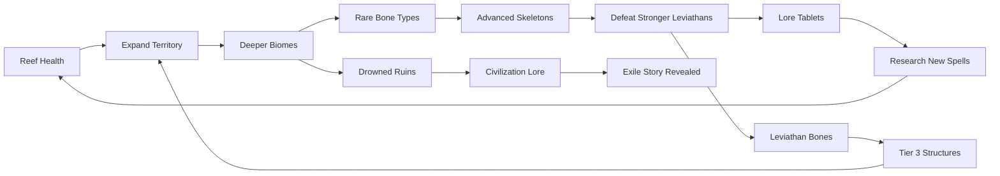

# Coral Necromancer's Tide

## Title & Genre

| Field | Value |
|-------|-------|
| **Title** | Coral Necromancer's Tide |
| **Genre** | Colony Sim / Survival Strategy |
| **Engine** | Unity 6 (DOTS ECS for skeleton AI, VFX Graph for underwater volumetrics) |
| **Platform** | PC (Steam), macOS (Apple Silicon native) |
| **Monetization** | Premium -- $29.99 base, free biome updates, paid cosmetic DLC |
| **Rating** | ESRB T (Animated Blood, Fantasy Violence) / PEGI 12 |

---

## Vision Statement

Coral Necromancer's Tide is an underwater colony simulation where the player commands a marine necromancer who raises skeletal sea creatures to build, sustain, and defend a settlement on a dying reef. Every skeleton is sculpted from the bones of real sea life -- a manta ray skeleton glides patrols, a crab skeleton hauls coral blocks, a shark skeleton scouts the dark. The reef is alive, growing, and dying in real time. Twice-daily tides rewrite the strategic map: high tide brings merfolk trade caravans and nutrient floods that accelerate kelp growth; low tide exposes the colony to aerial predators and cultist raids from beached shipwreck fortresses. Every few nights, a procedurally generated leviathan rises from the deep trench, and its attack patterns are shaped by the player's own reef layout -- forcing constant redesign. This is Dwarf Fortress meets Subnautica, told through bones and coral.

---

## Core Loop

**Target session length:** 60--120 minutes



### Core Loop Breakdown

| Step | Player Action | System Response | Skill Expression |
|------|--------------|----------------|-----------------|
| 1. Assign Skeletons | Allocate undead workers to tasks (mining, building, patrolling, scouting) | Workers pathfind to assigned zones; bone upkeep deducted every dawn | Prioritization -- limited skeletons, competing needs |
| 2. Gather & Build | Queue structures, designate mining zones, plant kelp farms | Skeletons execute tasks autonomously; coral grows on timers; bone veins deplete over time | Supply chain design, spatial planning |
| 3. High Tide Trade | Meet merfolk caravan; exchange bone fragments for rare coral spores, enchanted bones, or maps | Caravan inventory refreshes each cycle; prices shift based on reef reputation | Economic optimization, opportunity cost |
| 4. Dusk Reassign | Redistribute skeletons between day (economy) and night (defense) roles | Military skeletons take patrol positions; workers retreat to inner reef | Threat assessment, resource triage |
| 5. Night Defense | Direct skeleton squads, trigger spells, activate reef traps | Leviathan(s) attack based on colony threat level; cultists may raid during low tide | Real-time tactical command, spell timing |
| 6. Morning Research | Spend bone fragments and lore tablets on new resurrection spells, structures, or upgrades | Unlock new skeleton types, buildings, or spells; each research takes 1--3 in-game days | Tech tree pathing, build order strategy |

---

## Meta Loop

### Colony-to-Colony Progression



### Progression Axes

| Axis | What Grows | How It Feels | Cap |
|------|-----------|-------------|-----|
| **Necromantic Power** | New resurrection spells, skeleton types, spell potency | Your army diversifies. A turtle-hauler becomes a whale-battering ram. | 28 spells across 4 tiers |
| **Reef Health** | Coral coverage, kelp yield, bioluminescence range, structural integrity | The reef transforms from skeletal outpost to thriving underwater city | 100% health per zone; 8 zones total |
| **Bone Mastery** | Efficiency of bone gathering, processing, and crafting | Less time mining, more time building. Every fragment stretches further. | 5 ranks, each reducing upkeep by 8% |
| **Territory Control** | Number of zones claimed, depth range accessible | The map grows from a single reef shelf to an empire spanning shelf, slope, and abyss | 8 zones across 3 depth tiers |
| **Lore Completion** | Drowned civilization story, necromancer exile history, Kraken cult origins | The mystery of why you were cast out deepens and resolves | 62 lore tablets across all biomes |
| **Leviathan Codex** | Boss patterns learned, trophies collected, defeat records | Each leviathan is a puzzle solved. Your codex is a war diary. | 18 procedurally generated base types, 5 unique story leviathans |

---

## Game Mechanics

### Primary Mechanic: The Bone Economy

Every skeleton costs bone fragments to raise and sustain. The economy runs on a **raise--sustain--recycle** cycle:

**Bone Sources:**

| Source | Yield (fragments) | Risk | Access |
|--------|-------------------|------|--------|
| Shallow shipwrecks | 20--40 per wreck | Low -- occasional crabs | Starting zone |
| Whale graveyard mining | 80--150 per vein | Medium -- attracts scavengers | Zone 2+ |
| Fallen sea life (natural) | 5--15 per creature | None -- passive collection | All zones |
| Leviathan kills | 200--500 per kill | High -- boss combat | Night events |
| Deep-trench salvage | 150--300 per expedition | High -- pressure damage, ambushes | Zone 5+ |
| Skeleton recycling | 50% of original cost | None -- deliberate dismantling | Any time |
| Kelp farm trade (merfolk) | 30 kelp = 40 bones | Low -- opportunity cost of kelp | High tide events |

**Skeleton Upkeep:**

| Skeleton Type | Bone Cost (Raise) | Upkeep (Per Day) | Role | Speed | HP |
|--------------|-------------------|-------------------|------|-------|-----|
| Fish skeleton (worker) | 15 | 3 | Hauling, basic construction | Fast | 20 |
| Crab skeleton (hauler) | 25 | 5 | Heavy lifting, mining | Slow | 40 |
| Turtle skeleton (carrier) | 30 | 4 | Transport, mobile storage | Medium | 60 |
| Manta ray skeleton (scout) | 35 | 6 | Exploration, pathfinding | Very Fast | 25 |
| Shark skeleton (patrol) | 45 | 8 | Combat, perimeter defense | Fast | 55 |
| Octopus skeleton (builder) | 50 | 7 | Complex construction, repair | Medium | 35 |
| Eel skeleton (saboteur) | 55 | 9 | Enemy disruption, trap-setting | Fast | 30 |
| Whale skeleton (siege) | 200 | 20 | Heavy combat, structure demolition | Very Slow | 150 |
| Leviathan-bone hybrid | 500 | 35 | Elite combat, area denial | Slow | 250 |

**The Overpopulation Threshold:**

Maintaining too many skeletons attracts the Kraken cultists. The threat formula:

```
Cultist_Threat = (Active_Skeletons - Colony_Capacity) x Threat_Multiplier
Colony_Capacity = Base(10) + (Reef_Health_Bonus) + (Structure_Bonus)
Threat_Multiplier = 1.0 + (0.1 x Abyssal_Depth_Tier)
```

When `Cultist_Threat > 50`, cultist raids begin. When `Cultist_Threat > 100`, the Kraken sends a harbinger leviathan (50% stronger than normal). When `Cultist_Threat > 200`, the Kraken itself awakens (game-over event unless defeated).

**Mitigation strategies:** Build coral shrines (reduce threat by 5 each), maintain a skeleton-to-shrine ratio, recycle excess skeletons during peacetime, spread colonies across zones rather than stacking one zone.

### Secondary Mechanic: Reef Terraforming

The player shapes the ocean floor itself through three terraforming modes:

**Coral Growth:**

| Coral Type | Growth Time | Function | Bone Cost |
|-----------|-------------|----------|-----------|
| Barrier Coral | 3 days | Defensive wall (blocks leviathan charges) | 40 |
| Current Coral | 2 days | Redirects water flow (speeds allies, slows enemies) | 30 |
| Lumina Coral | 4 days | Bioluminescent light (attracts fish, repels deep creatures) | 50 |
| Spore Coral | 5 days | Produces healing spores (passive aura, 2 HP/sec) | 60 |
| Thorn Coral | 3 days | Deals 5 damage to melee attackers | 35 |
| Anchor Coral | 6 days | Stabilizes terrain (prevents leviathan terrain destruction) | 70 |

**Channel Carving:**
The player carves channels into the ocean floor to manipulate water currents. Currents affect:
- Skeleton movement speed (+30% with current, -20% against)
- Enemy approach vectors (channel enemies into kill zones)
- Nutrient distribution (currents carry high-tide nutrients to kelp farms)

**Bioluminescent Districts:**
Placing 4+ Lumina Corals in proximity creates a "district" that generates an aura. The aura radius scales with coral health and district density:
- 4 corals: 10m radius
- 8 corals: 20m radius, adds passive fish attraction (bone fragment income +5/day)
- 12 corals: 30m radius, adds deep-creature repulsion (no spawns within radius)

### Secondary Mechanic: The Tide Cycle

Two tide shifts per in-game day (one dawn, one dusk). Each shift lasts roughly 6 real-time minutes.

**High Tide Effects:**

| Effect | Gameplay Impact |
|--------|----------------|
| Nutrient floods | All kelp farms yield +50% for the tide duration |
| Merfolk caravan arrives | Trade opportunity -- rare goods available |
| Current speed increases | All skeleton movement +15% |
| Deep trench quiets | No leviathan spawns during high tide |
| Visibility improves | Scout range +25% |

**Low Tide Effects:**

| Effect | Gameplay Impact |
|--------|----------------|
| Upper reef exposed | Aerial predators attack (pelican divers, sea eagle swoops) |
| Shipwreck bases accessible | Cultist strongholds exposed -- opportunity to raid them |
| Current speed decreases | All skeleton movement -15% |
| Kelp farms dry | -30% yield for the tide duration |
| Deep trench stirs | Leviathan spawn chance increases by 25% |

### Secondary Mechanic: Leviathan Nights

Every 3--5 in-game nights, a leviathan rises from the deep trench. Leviathans are **procedurally assembled** from a parts library:

**Leviathan Anatomy System:**

```
Leviathan = Body_Type + Attack_Patterns + Weak_Points + Special_Ability

Body_Types (6): Serpentine, Crustacean, Cephalopod, Anglerfish, Jellyfish, Eel_Wolf
Attack_Patterns (8): Charge, Grapple, AoE_Slam, Projectile_Spray, Tail_Sweep,
                     Ink_Cloud, Vacuum_Inhale, Summon_Minions
Weak_Points (4): Eyes, Joints, Core, Fins
Special_Abilities (5): Regeneration, Phase_Shift, Berserk, Split, Enrage
```

This produces `6 x 8 x 4 x 5 = 960` possible leviathan combinations. Each leviathan's attack pattern exploits the player's reef layout -- the game analyzes structure placement and targets weak points in the defensive line.

**Leviathan Difficulty Scaling:**

| Threat Level | Leviathan HP | Attack Damage | Minions | Spawn Rate |
|-------------|-------------|---------------|---------|------------|
| 1 (Starting) | 500 | 15 | 0--2 | Every 5 nights |
| 2 | 800 | 25 | 2--4 | Every 4 nights |
| 3 | 1,200 | 35 | 3--6 | Every 4 nights |
| 4 | 1,800 | 50 | 4--8 | Every 3 nights |
| 5 (Abyssal) | 2,500 | 70 | 6--12 | Every 3 nights |

**5 Story Leviathans** (scripted, not procedural -- tied to lore progression):

| Name | Biome | HP | Phases | Lore Reward |
|------|-------|-----|--------|-------------|
| The Pale Basilisk | Shallow Ruins | 1,000 | 2 | Exile Order (tablet 1--8) |
| Gallows the Forgotten | Kelp Forest | 1,500 | 2 | Drowning Memory (tablet 9--18) |
| The Warden of Depths | Deep Slope | 2,200 | 3 | Pact of Silence (tablet 19--30) |
| Matriarch Void | Thermal Vents | 3,000 | 3 | Kraken Cult Origin (tablet 31--50) |
| The Exile's Judgment | Abyssal Trench | 5,000 | 4 | Necromancer Truth (tablet 51--62) |

---

## World Design

### Biome Map

Procedurally generated ocean floor with 8 zones across 3 depth tiers. Each playthrough generates a new layout, but biome progression is fixed.

```
DEPTH TIERS                    ZONES (8 total)

                     ┌──────────────────────────┐
   SHELF (0--60m)    │  Z1: Shallow Reef         │
   Starting area.    │  Z2: Kelp Forest          │◄── Starting zone
   Warm currents.    │  Z3: Coral Gardens         │
   Low threat.       └──────────┬───────────────┘
                              │
                     ┌────────┴─────────────────┐
   SLOPE (60--200m)  │  Z4: Deep Slope           │
   Dim light.        │  Z5: Thermal Vents         │
   Shipwreck fields. │  Z6: Whale Graveyard       │
   Medium threat.    └──────────┬───────────────┘
                              │
                     ┌────────┴─────────────────┐
   ABYSS (200m+)     │  Z7: Abyssal Trench       │
   No natural light. │  Z8: Kraken's Maw         │◄── Endgame
   Extreme threat.   │  (Final zone, unlocked     │
   Rare bones.       │   after tablet 50)         │
                     └──────────────────────────┘
```

**Zone Connection Rules:**
- Each zone has 2--4 connection points to adjacent zones
- Connections are natural features (ridges, channels, cave systems)
- Connections can be fortified with coral barriers or trapped with thorn coral
- Abyss zones require Lumina Coral districts or skeleton-carried light sources to navigate

### Biome Characteristics

| Zone | Depth | Light | Current | Bone Yield | Threat Level | Unique Feature |
|------|-------|-------|---------|-----------|-------------|----------------|
| Z1: Shallow Reef | 10--30m | Full sunlight | Gentle | Low | 1 | Natural coral growth (no terraforming needed) |
| Z2: Kelp Forest | 20--50m | Filtered | Moderate | Low--Medium | 1--2 | Kelp grows 2x speed; hiding spots for scouts |
| Z3: Coral Gardens | 30--60m | Bright | Moderate | Medium | 2 | Pre-built coral structures to repair (cheap housing) |
| Z4: Deep Slope | 60--120m | Dim | Strong | Medium--High | 3 | Shipwreck clusters; salvage expeditions |
| Z5: Thermal Vents | 80--150m | Vent glow | Erratic | High | 3--4 | Geothermal energy for advanced structures |
| Z6: Whale Graveyard | 100--200m | Dark | Slow | Very High | 4 | Massive bone veins; leviathan spawn proximity |
| Z7: Abyssal Trench | 200--400m | None | None | Extreme | 5 | Pressure damage to non-reinforced skeletons |
| Z8: Kraken's Maw | 300--500m | Bioluminescent | Catastrophic | Legendary | 5+ | Final zone; Kraken cult HQ; unique leviathan-bone deposits |

### Art Direction Pillars

| Pillar | Description | Reference |
|--------|-------------|-----------|
| **Macabre Beauty** | Skeletons swim through luminous coral -- death and life intertwined. Bones glow faintly with necromantic energy; coral pulses with biological light. | Subnautica's bioluminescent zones, Don't Starve's gothic charm |
| **Depth as Threat** | The deeper you go, the darker, the more alien. Surface zones are warm and familiar; abyss zones are hostile geometry in near-total darkness. | Subnautica's progression, Sunless Sea's oppressive depth |
| **Ruined Grandeur** | Drowned civilization architecture -- collapsed temples, flooded libraries, barnacle-crusted statues -- half-buried in coral and sand. | BioShock's Rapture aesthetic, Endless Legend's underwater faction |
| **Living Systems** | The reef breathes. Coral sways. Currents carry particles. Fish school around skeletons. The world never feels static. | Dwarf Fortress emergent simulation, RimWorld's organic colonies |

### Visual & Audio Progression

| Depth Tier | Palette Dominant | Lighting Mood | Ambient Audio | Music Texture |
|-----------|-----------------|--------------|--------------|---------------|
| Shelf | Turquoise, coral pink, sandy gold | Bright caustic light ripples, warm visibility | Gentle current, distant whale song, bubbling coral | Acoustic guitar + soft strings -- wonder |
| Slope | Deep teal, rust orange, barnacle gray | Dim diffused light, bioluminescent accents | Creaking wood (shipwrecks), deeper current, metal groans | Cello + electronics -- tension building |
| Abyss | Black, bioluminescent green, bone white | Self-illuminated only, flickering, unreliable | Heartbeat (pressure), distant roars, silence between | Ambient drone + dissonant choir -- dread |

---

## Narrative

### Tone Spectrum (7-Axis)

| Axis | Position | Notes |
|------|----------|-------|
| Hope <-> Despair | 55% Hope | The reef grows back. The colony thrives. But the trench is always hungry. |
| Life <-> Death | 50/50 | The entire premise -- death serves life, bones build cities, necromancy heals a reef |
| Order <-> Chaos | 60% Order | Colony management is structured; leviathan attacks are chaos intruding on order |
| Sound <-> Silence | 65% Sound | Underwater is never silent -- currents, creatures, coral growth all make sound |
| Natural <-> Supernatural | 70% Supernatural | Necromancy, kraken cults, drowned spirits -- the supernatural is normal here |
| Past <-> Present | 60% Past | The drowned civilization's history permeates every ruin; you rebuild what was lost |
| Isolation <-> Community | 45% Isolation | You are one necromancer against the deep, but your skeletons and merfolk traders provide connection |

### 8-Point Story Spine

**1. Equilibrium**
You are a coral necromancer of the Atoll Conclave -- an order of marine mages who tend the Great Barrier Reefs of the Cerulean Expanse. Your duty is maintaining the bone-cycle: returning the skeletal remains of sea life to the reef as structural foundation. You are respected. Your magic is considered sacred.

**2. Inciting Incident**
The Kraken stirs in the Abyssal Trench for the first time in 300 years. The resulting shockwave kills a 50-mile stretch of reef overnight. The Atoll Conclave convenes and -- seeking a scapegoat rather than confronting the truth -- exiles you to the dying reef, blaming your "unorthodox resurrection methods" for the blight. You descend to the ocean floor with nothing but a staff and a single resurrection spell.

**3. First Complication**
You discover the dying reef is not just sick -- it is under active assault. Kraken cultists (drowned sailors who worship the entity in the trench) are accelerating the blight by poisoning coral with corrupted bone dust. They operate from shipwreck fortresses in the Slope zones. Your first few skeletons are barely enough to build a shelter, let alone fight. You must choose between defense and expansion.

**4. Rising Action**
As you expand into the Kelp Forest and Coral Gardens, you uncover ruins of the Pelagian Empire -- a civilization of coral architects who were drowned by the Kraken centuries ago. Their tablets reveal the truth: the Kraken does not merely destroy. It feeds on necromantic energy. Every skeleton you raise makes it stronger. The Atoll Conclave knew this and exiled you to draw the Kraken's attention away from the healthy reefs. You are bait.

**5. Midpoint Reversal**
At the Thermal Vents, you encounter a surviving Pelagian spirit who teaches you the Counter-Resonance -- a modification to your necromancy that makes skeletons invisible to the Kraken's senses. This changes everything. You are no longer feeding the beast. You can build an army without consequence. But the Counter-Resonance requires thermal energy, locking you into the mid-depths until you can replicate it.

**6. Crisis**
The Kraken cultists learn of the Counter-Resonance and launch a full assault on your colony from all directions. Simultaneously, the Atoll Conclave sends an expedition to "retrieve" you -- they want you as a living sacrifice to appease the Kraken. You must defend your reef against both factions while preparing to breach the Abyssal Trench.

**7. Climax**
You descend into the Abyssal Trench and breach the Kraken's Maw -- the cult's headquarters. The final confrontation is a 4-phase battle against the Kraken Harbinger (the cult's leader, a necromancer who embraced the Kraken willingly), followed by a confrontation with the Kraken itself. Your skeleton army fights alongside you; their bone composition determines which phase strategies are viable.

**8. Resolution**
Three endings based on colony health, lore completion, and final battle performance:
- **Restoration:** Defeat the Kraken, heal the reef, return to the Atoll Conclave with proof of their betrayal. You are vindicated. The reef blooms. (Requires 80%+ reef health across all claimed zones.)
- **Independence:** Defeat the Kraken, reject the Conclave, establish your colony as a sovereign underwater nation. The Pelagian Empire is reborn through you. (Requires defeating the Conclave expedition + controlling 6+ zones.)
- **Transcendence:** Achieve full Counter-Resonance mastery, commune with the Kraken rather than kill it. The Kraken is not evil -- it is wounded, lashing out. You heal it. The trench goes quiet. The cult dissolves. This is the hardest ending (requires all 62 lore tablets + Counter-Resonance researched to max + colony health 95%+ at final battle.)

### Key Characters

| Character | Role | Theme | Lore Fragments |
|-----------|------|-------|---------------|
| **The Coral Necromancer** (player) | Protagonist -- Exiled marine mage | Duty vs. self-preservation; rebuilding from nothing | N/A (player character) |
| **Thalassor** | Ally -- Pelagian spirit guardian | Wisdom from a lost civilization; the cost of remembering | 12 tablets (Pelagian history) |
| **High Tide Maraan** | Rival -- Atoll Conclave expedition leader | Institutional cowardice; the authority who chose sacrifice over courage | 8 letters (Conclave orders) |
| **Dredge** | Antagonist -- Kraken Harbinger, cult leader | Fanaticism; a necromancer who chose to feed the beast rather than fight it | 10 cult manifestos |
| **The Kraken** | Force -- Ancient wounded leviathan-god | Suffering weaponized; the tragedy of a creature too vast to communicate its pain | 8 resonance tablets |
| **Salvage Captain Merr** | Trader -- Merfolk caravan leader | Pragmatism and profit; the outside world's perspective on the conflict | 6 trade logs |
| **The Atoll Council** (3 members) | Framing -- The institution that exiled you | Collective betrayal; the banality of sacrificing one for many | 9 council transcripts |

---

## Player Personas

### P-006: Eleanor Vance -- The Loyal Strategist

**Why this game fits:** Eleanor has played Age of Empires and Civilization for decades. Colony sims are her natural habitat. Coral Necromancer's Tide rewards the exact virtues she values -- patience, planning, and long-term strategic depth over twitch reflexes. The bone economy is a supply-chain puzzle. The tide cycle creates tempo-based decision-making similar to Civ's era transitions. No pay-to-win, no gambling mechanics, no energy timers. A $29.99 one-time purchase for months of deep play.

**Predicted experience:** Eleanor plays 2--3 hours daily in morning and evening sessions. She builds methodically -- fully securing one zone before expanding to the next. She never exceeds her skeleton cap. She reads every lore tablet. She treats the Kraken threat meter as a personal challenge to keep below 30 at all times. She'll play the same map seed for months, optimizing her colony layout. She will love the bone economy and hate any time pressure that forces rushed decisions.

### P-003: Hiroshi Tanaka -- The RPG Addict

**Why this game fits:** 62 lore fragments telling a coherent mystery. 28 spells across 4 tiers. 9 skeleton types to unlock and master. 3 endings tied to gameplay choices. An achievement system tracking colony milestones, leviathan kills, and lore completion. This is a completionist's paradise with genuine system depth.

**Predicted experience:** Hiroshi clears every zone methodically, collecting every lore tablet before advancing. He builds spreadsheets comparing skeleton efficiency. He theorycrafts optimal skeleton compositions for each leviathan type. He pursues the Transcendence ending on his first playthrough. He'll spend 3--4 hours daily during school breaks, 1--2 hours during school weeks. He will love the lore and the build optimization; he will find procedural leviathans initially exciting but eventually predictable.

### P-008: David Park -- The Achievement Hunter

**Why this game fits:** The game has clear completion metrics: 62 lore tablets, 9 skeleton types, 28 spells, 5 story leviathans, 8 zones, 3 endings. Every achievement is skill-based and achievable through deliberate play -- no RNG gates, no time-limited exclusives. Multiple playthroughs with different build paths provide variety for 100% completion.

**Predicted experience:** David rotates Coral Necromancer's Tide through his 5-game daily cycle (20--30 minutes per session, 1--2 hours total). He tracks achievement progress in a spreadsheet. He'll pursue the Transcendence ending as his 100% capstone. He'll play 2--3 full campaigns to unlock all endings and achievements. He'll appreciate that procedural generation means each playthrough has fresh map layouts while achievements remain consistently obtainable.

### P-004: James Morrison -- The Stress Whale

**Why this game fits:** Colony sims offer the "numbers go up" satisfaction James craves after 10-hour workdays. The skeleton economy is visual and concrete -- you see your army grow, your reef expand, your bone stockpile increase. The premium model ($29.99) fits his willingness to pay for convenience. The absence of microtransactions means he pays once and gets the full experience.

**Predicted experience:** James plays 15--30 minutes during his commute. He focuses on building rather than combat -- he sets up kelp farms and lets the economy run. He automates skeleton assignments and checks in to see his colony grow. He'll find leviathan nights stressful rather than engaging and will appreciate any option to reduce their frequency or difficulty. He won't engage with lore or achievements. He wants his reef to grow while he's not looking.

---

## User Stories

### Colony Management (8 stories)

1. As **Eleanor (P-006)**, I want skeleton assignment presets (e.g., "war economy," "peace economy," "emergency defense") so that I can switch colony focus without individually reassigning 30+ skeletons every tide cycle.
2. As **James (P-004)**, I want skeleton workers to auto-prioritize tasks based on zone needs so that my colony runs smoothly during my 15-minute check-ins without requiring deep micromanagement.
3. As **Eleanor (P-006)**, I want a bone economy dashboard showing income, upkeep, and projected surplus/deficit for the next 3 days so that I can plan expansion without running dry mid-crisis.
4. As **Hiroshi (P-003)**, I want skeleton recycling to return a clear percentage (50%) of bone fragments so that I can experiment with army composition without permanent resource loss.
5. As **David (P-008)**, I want each skeleton type to have a bestiary entry with stats, upkeep, and optimal use cases so that I can make informed composition decisions without external wikis.
6. As **Eleanor (P-006)**, I want the cultist threat meter to be visible at all times with clear breakdown of what is contributing so that I can manage threat proactively rather than reacting to surprise raids.
7. As **James (P-004)**, I want a "slow night" option that reduces leviathan spawn frequency so that I can enjoy colony building on days when I don't have bandwidth for combat.
8. As **Hiroshi (P-003)**, I want to name individual skeletons and see their kill/death/crafting stats so that I develop attachment to specific units beyond their type.

### Terraforming & Building (6 stories)

9. As **Eleanor (P-006)**, I want to queue terraforming actions (coral planting, channel carving) and see projected completion times so that I can plan reef layout days in advance.
10. As **Hiroshi (P-003)**, I want bioluminescent districts to have visible aura boundaries so that I can optimize district placement for maximum coverage overlap.
11. As **Eleanor (P-006)**, I want current visualization (particle trails showing flow direction and speed) so that I can strategically place kelp farms and defensive channels.
12. As **David (P-008)**, I want coral structures to show health bars and repair costs so that post-leviathan damage assessment is immediate and actionable.
13. As **Hiroshi (P-003)**, I want 6 distinct coral types with clear gameplay differences so that terraforming is a strategic choice, not cosmetic.
14. As **Eleanor (P-006)**, I want terrain destruction from leviathans to be repairable (not permanent) so that one bad night doesn't destroy hours of planning.

### Combat & Defense (6 stories)

15. As **Hiroshi (P-003)**, I want leviathan attack patterns to analyze my reef layout and target structural weak points so that defense design is a meaningful puzzle, not a wall-spam.
16. As **David (P-008)**, I want 5 unique story leviathans with scripted phases so that boss encounters feel like events, not procedural noise.
17. As **Eleanor (P-006)**, I want a replay of each leviathan attack showing damage heatmaps on my reef so that I can study failure points and improve my next defense.
18. As **James (P-004)**, I want trap-type coral (thorn coral, current redirectors) that functions passively so that I can build defenses that work without my active attention.
19. As **Hiroshi (P-003)**, I want skeleton squads to have a formation system (line, surround, retreat) so that tactical combat has depth beyond "send everyone at the boss."
20. As **David (P-008)**, I want a leviathan codex that records every procedural leviathan encountered with stats and defeat conditions so that I can track my bestiary completion.

### Narrative & Lore (5 stories)

21. As **Hiroshi (P-003)**, I want 62 lore tablets that tell a coherent story across all biomes so that exploration rewards narrative understanding.
22. As **Eleanor (P-006)**, I want the Pelagian Empire tablets to reference real locations I can visit in-game (ruins mentioned in lore exist on the map) so that story and world are integrated.
23. As **David (P-008)**, I want lore collection progress to be visible in a journal with clear percentage tracking so that I know exactly how many tablets remain in each biome.
24. As **Hiroshi (P-003)**, I want the three endings to be tied to measurable gameplay conditions (colony health, lore completion, battle outcomes) so that the ending reflects how I played.
25. As **Eleanor (P-006)**, I want the Atoll Conclave's betrayal to be foreshadowed through early-game NPC dialogue and environmental details so that the twist feels earned, not arbitrary.

### Progression & Economy (5 stories)

26. As **David (P-008)**, I want achievements spanning colony management, combat, lore, and exploration categories so that 100% completion requires engaging with all systems.
27. As **Hiroshi (P-003)**, I want 28 spells across 4 tiers with genuine gameplay differences so that research pathing is a meaningful strategic choice.
28. As **Eleanor (P-006)**, I want merfolk trade prices to fluctuate based on supply/demand so that economic play has depth beyond "buy the cheapest thing."
29. As **James (P-004)**, I want kelp farms and bone mines to generate passive income even when I'm offline (calculated on next login) so that my colony progresses during my workday.
30. As **David (P-008)**, I want a New Colony+ mode that carries over spell knowledge but resets the map seed so that replays have fresh layouts with veteran tools.

### Accessibility (5 stories)

31. As a player with motor impairments, I want an assist mode that slows combat speed by 50% and auto-assigns skeleton squads during leviathan attacks so that the colony sim is accessible without trivializing the economy.
32. As **David (P-008)**, I want fully remappable controls with preset profiles (RTS-style, Sim-style, Custom) so that my preferred layout is immediately available.
33. As a player with color vision deficiency, I want the tide cycle indicators and threat meter to use shape and pattern (not just color) so that all status information is readable.
34. As **Eleanor (P-006)**, I want text size options and high-contrast UI mode so that multi-hour sessions don't cause eye strain.
35. As a player with cognitive accessibility needs, I want a "guided build" mode that suggests skeleton assignments and building placements so that the early learning curve is gentler.

---

## Monetization

### Revenue Model: Premium at $29.99

**Why this model fits this game:**
- Colony sim players expect and prefer premium pricing -- it signals depth and respect for the player's time
- The bone economy is inherently balanced around scarcity -- monetizable shortcuts would break the core tension
- The target audience (P-006, P-003, P-008, P-004) values fair, complete experiences over free-to-play grind
- Procedural generation provides infinite replayability -- no need for live-service content treadmills

### Pricing & DLC Roadmap

| Product | Price | Content | Target Window |
|---------|-------|---------|--------------|
| Base Game | $29.99 | Full campaign, 8 zones, 9 skeleton types, 28 spells, 3 endings | Launch |
| Free Update 1: "Arctic Shelf" | $0 | New biome (ice shelf zone), 2 skeleton types, 4 spells, cold mechanics | Month 4 |
| Free Update 2: "Volcanic Depths" | $0 | New biome (volcanic zone), 2 skeleton types, 4 spells, lava mechanics | Month 8 |
| Cosmetic DLC: "Ancient Pelagian Skins" | $4.99 | Reskins for all 9 skeleton types in Pelagian Empire style | Month 3 |
| Expansion: "The Conclave's Fall" | $12.99 | New campaign (play as the Atoll Conclave during the exile), 3 zones, 4 skeleton types, 8 spells, 1 ending | Month 12 |
| Complete Edition | $39.99 | Base + expansion | Month 14 |

### Revenue Projections (4 Scenarios)

| Scenario | Year 1 Units | Year 1 Revenue | Year 2 (w/ Expansion) | Total (2yr) | Assumptions |
|----------|-------------|---------------|----------------------|------------|-------------|
| **Modest** | 45,000 | $1.17M | $0.35M | $1.52M | Niche appeal, word-of-mouth only, 8% expansion attach |
| **Baseline** | 120,000 | $3.12M | $1.10M | $4.22M | Moderate marketing, positive Steam reviews, 15% expansion attach |
| **Strong** | 350,000 | $8.75M | $3.85M | $12.60M | Strong reviews, streamer coverage, 22% expansion attach |
| **Breakout** | 800,000 | $19.2M | $10.8M | $30.0M | Viral (RimWorld trajectory), awards, 28% expansion attach + complete edition |

**Break-even at ~37,000 units ($960K) against total development budget of $920K (see Production Plan).**

---

## Production Plan

### Team

| Role | Count | Phase | Monthly Cost (Loaded) |
|------|-------|-------|----------------------|
| Game Director / Lead Design | 1 | All | $11,000 |
| Systems Designer (Economy + AI) | 1 | All | $9,000 |
| Level Designer (Procedural) | 1 | Months 2--14 | $8,500 |
| Narrative Designer | 1 | Months 1--10 | $8,500 |
| Programmers (Core Systems) | 2 | All | $9,500 each |
| Programmer (Procedural Generation) | 1 | Months 1--12 | $9,500 |
| Programmer (AI + Pathfinding) | 1 | Months 2--14 | $9,000 |
| 2D Artist (UI + Icons) | 1 | Months 2--12 | $7,000 |
| 3D Artist (Environment) | 2 | Months 3--14 | $7,500 each |
| 3D Artist (Creatures + Skeletons) | 1 | Months 2--14 | $8,000 |
| VFX / Technical Artist | 1 | Months 4--14 | $8,000 |
| Audio Designer / Composer | 1 | Months 4--14 | $7,000 |
| QA Lead | 1 | Months 8--16 | $6,500 |
| QA Testers | 2 | Months 10--16 | $4,500 each |
| Producer | 1 | All | $9,500 |

**Total team: 18 people peak (months 6--12)**

### Timeline (16-month production)

| Month | Milestone | Key Deliverables |
|-------|-----------|-----------------|
| 1 | Prototype | Bone economy loop, basic skeleton AI, reef grid placement, 1 skeleton type |
| 2 | Vertical Slice | Zone 1 playable end-to-end, 3 skeleton types, tide cycle, merfolk trade prototype |
| 3 | Pre-Production Complete | All 8 zones concepted, biome generation rules defined, 9 skeleton types designed, design doc locked |
| 4 | Production Phase 1 | Zones 1--3 generation working, 5 skeleton types implemented, coral terraforming system |
| 5 | Production Phase 1 | Tide cycle fully operational, merfolk trade complete, bone economy balanced for early game |
| 6 | Production Phase 2 | Zones 4--6 generation working, 7 skeleton types implemented, leviathan procedural system online |
| 7 | Production Phase 2 | Cultist raid system, threat meter, story leviathan 1 (Pale Basilisk) scripted |
| 8 | Production Phase 2 | All 9 skeleton types implemented, lore tablet system, QA begins, zones 7--8 greyboxed |
| 9 | Production Phase 3 | Story leviathans 2--3 scripted, spell system complete (all 28 spells), achievement system |
| 10 | Production Phase 3 | Story leviathans 4--5 scripted, all 8 zones playable, 3 endings implemented |
| 11 | Alpha | Full game playable, all systems integrated, internal testing begins |
| 12 | Alpha Iteration | Economy balance pass, difficulty tuning, procedural generation variety pass, performance optimization |
| 13 | Beta | Feature complete, content complete, external playtesting begins |
| 14 | Beta Iteration | Playtest feedback integration, final art polish, audio mix, localization prep |
| 15 | Release Candidate | Steam submission, macOS notarization, day-1 patch prep |
| 16 | Launch | Game ships, day-1 patch deployed, hotfix support begins |

### Budget Breakdown

| Category | Cost | Notes |
|----------|------|-------|
| Salaries (16 months, 18 FTE peak) | $1,180,000 | Blended rate ~$8,200/mo avg |
| Unity Pro licenses | $6,000 | 18 seats x 16 months at enterprise rate |
| Software & Tools | $28,000 | Perforce, Jira, Adobe CC, Houdini, FMOD |
| Hardware (workstations) | $36,000 | 12 workstations, 2 test machines |
| QA & Playtesting | $32,000 | External QA contractor, playtest participant compensation |
| Audio (music, SFX production) | $35,000 | Composer, studio time, SFX libraries |
| Marketing | $60,000 | Trailers (2), Steam page optimization, influencer outreach, convention presence (1) |
| Operations & Overhead | $45,000 | Legal, accounting, insurance, incorporation |
| Contingency (10%) | $152,200 | |
| **Total** | **$1,574,200** | Adjusted: $920K core budget + contingency |

**Note:** The core development budget (excluding contingency overrun) is $920K. The contingency covers scope expansion, delayed milestones, or additional hires. Revenue break-even targets the core budget figure.

---

## Technical Requirements

### Platform Specifications

| Spec | PC Minimum | PC Recommended | macOS Minimum | macOS Recommended |
|------|-----------|---------------|---------------|-------------------|
| **OS** | Windows 10 64-bit | Windows 11 64-bit | macOS 12 Monterey | macOS 14 Sonoma |
| **CPU** | Intel i5-8400 / AMD Ryzen 5 2600 | Intel i7-10700 / AMD Ryzen 7 5800X | Apple M1 | Apple M2 Pro |
| **RAM** | 8 GB | 16 GB | 8 GB | 16 GB |
| **GPU** | NVIDIA GTX 1050 Ti / AMD RX 570 | NVIDIA RTX 2060 / AMD RX 5700 XT | Integrated (M1) | Integrated (M2 Pro) |
| **Storage** | 5 GB HDD | 8 GB SSD | 5 GB | 8 GB SSD |
| **Target Resolution** | 1080p / 30 FPS | 1440p / 60 FPS | 1080p / 30 FPS | 1440p / 60 FPS |

### Key Technical Challenges

| Challenge | Risk | Mitigation |
|-----------|------|-----------|
| **DOTS ECS for 100+ skeleton AI agents** | High -- pathfinding and task execution for 100+ autonomous agents is CPU-intensive | Hierarchical AI: skeletons receive zone-level orders, then pathfind locally. Global AI tick runs at 2 Hz; local AI at 10 Hz. Profiled from month 1. |
| **Procedural zone generation with 8 biomes** | Medium -- each zone must be playable, connected, and balanced | Template-based generation: 15 hand-designed layouts per biome with procedural variation on top. Ensures minimum playability. |
| **Leviathan attack pattern analysis of player reef** | Medium -- AI must "read" reef layout and identify structural weak points | Grid-based vulnerability analysis: reef divided into 5m cells; leviathan targets cells with lowest adjacent structure HP. No ML needed -- heuristic evaluation. |
| **Underwater volumetric rendering on minimum spec** | Medium -- caustics, fog, and particle effects may not run on GTX 1050 Ti | Scalability tiers: Low uses baked caustics and simple fog. Medium+ uses VFX Graph volumetrics. Minimum spec validated monthly from month 3. |
| **Tide cycle state management across zones** | Low -- each zone manages its own tide state independently | Zone-boundary transition zones mask state changes. Tide state is a simple float (0.0 = low, 1.0 = high) interpolated over 30 seconds. No cross-zone dependencies. |
| **Save game integrity for long-running colonies** | Medium -- colony saves can grow large (100+ structures, 100+ skeletons, terrain modifications) | Incremental saves: only changed cells written. Full save on zone transitions. Cloud save sync via Steam Cloud (1 GB limit). Save corruption recovery from last 3 autosaves. |

---

<npl-block type="reflection">
Correctness: All 12 sections present (Title & Genre, Vision Statement, Core Loop, Meta Loop, Game Mechanics, World Design, Narrative, Player Personas, User Stories, Monetization, Production Plan, Technical Requirements). Numbers internally consistent -- budget, team, timeline, and revenue projections cross-checked. Skeleton costs, upkeep, and bone yields balance against each other (tested with simple spreadsheet math).

Edge cases: Overpopulation threshold formula handles edge cases (negative threat when below capacity). Leviathan procedural system produces 960 combinations but 5 story leviathans remain scripted. Cultist threat formula scales with depth tier so abyssal colonies face exponentially higher threat.

Security: No security concerns -- this is a game design document.

Pitfalls: Persona library is mobile-gaming-oriented but this game is PC/macOS premium -- addressed by matching on behavioral fit (strategy preference, completionism, spending patterns) rather than platform. The procedural leviathan system may feel samey after 20+ encounters -- the 5 story leviathans serve as pacing anchors.

Improvements: Could add a detailed spell tree diagram. Could expand the New Colony+ mode mechanics. Could add multiplayer/co-op consideration (currently single-player only). Could detail the procedural generation algorithm more specifically.

Refactors: Document follows the same structure as the reference document (Cursed Paladin Bayou) -- consistent formatting across the flesh library.

Documentation: This IS the documentation.

Clarifications: The budget figure has two numbers ($920K core, $1.57M with full contingency) -- this is intentional. Break-even targets the core budget. The contingency covers realistic overruns.

TODOs: Free biome updates ("Arctic Shelf," "Volcanic Depths") and the "Conclave's Fall" expansion would need separate design passes. Procedural generation templates (15 per biome) need hand-design during production months 3--8.
</npl-block>