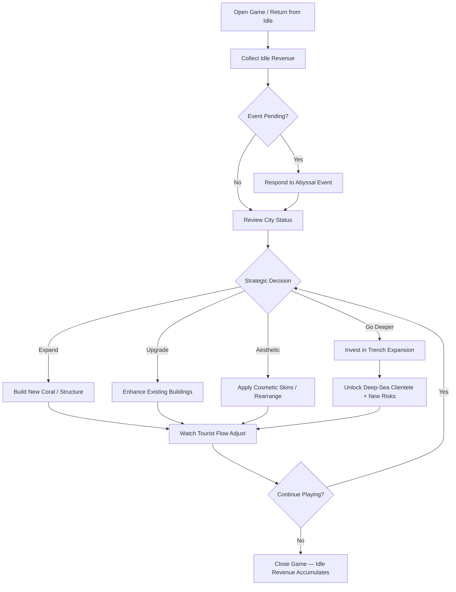
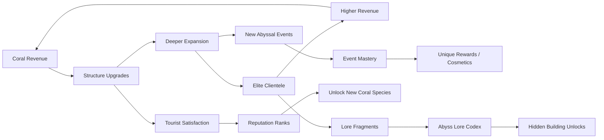

# Coral Tycoon of the Abyss

## Title & Genre

| Field | Value |
|-------|-------|
| **Title** | Coral Tycoon of the Abyss |
| **Genre** | Idle Tycoon / Simulation |
| **Engine** | Unity 2023 LTS (URP) — lightweight mobile rendering, shader graph for bioluminescence, addressables for content streaming |
| **Platform** | Mobile (iOS 14+ / Android 10+), PC (Steam), Web Browser (WebGL) |
| **Monetization** | Free-to-play — optional ad-removal ($4.99), cosmetic building skins ($0.99–$4.99), premium coral packs ($1.99–$9.99) |
| **Rating** | ESRB E (Everyone) / PEGI 3 / CERO A — Mild Fantasy Violence (kraken attacks damage buildings, no character harm) |

---

## Vision Statement

Coral Tycoon of the Abyss is a meditative idle tycoon where you build and manage an underwater resort city at the edge of a kraken-inhabited abyss. You are a Coral Architect — part marine biologist, part hotelier — growing living coral structures that attract merfolk tourists, abyssal leviathans, and deep-sea monsters seeking vacation destinations in the most dangerous stretch of ocean on the planet. The game balances the low-stress satisfaction of watching numbers climb with genuine strategic depth: which coral species to cultivate, how deep to expand, when to fortify against abyssal storms, and whether to risk building near the trench where the most lucrative — and most destructive — clientele dwell. Every building is alive. Every tourist is a sea monster. Every expansion is a negotiation with the deep.

The game targets three player psychographics simultaneously: **Flow State** players who want 5-minute check-ins with satisfying progress, **Emergent Sandbox** players who want to experiment with coral combinations and discover hidden synergies, and **Aesthetic Purists** who want their underwater city to be stunning. It respects the time constraints of casual players while providing enough depth for long-session strategists. It never punishes you for not playing — it rewards you when you come back.

---

## Core Loop

**Target session length:** 3–15 minutes (casual check-in) / 30–45 minutes (deep strategy session)



### Core Loop Breakdown

| Step | Player Action | System Response | Strategic Depth |
|------|--------------|----------------|-----------------|
| 1. Collect | Tap to claim accumulated idle revenue | Revenue calculated since last session based on coral output, tourist population, and active multipliers | None — pure reward moment |
| 2. Event Check | Review any triggered abyssal events | Events fire on timers (4–8 hr cycles): kraken attacks, leviathan parades, abyssal storms, bioluminescent blooms | Resource allocation — spend reserves on defense or let damage happen and rebuild |
| 3. Assess | View city dashboard: revenue rate, tourist satisfaction, coral health, abyss proximity | All metrics visualized on the living city itself — glowing corals = healthy, dimming = needs attention | Diagnostic — reading the city's visual state |
| 4. Build | Place coral structures, attractions, hotels, transport | Each structure affects tourist demographics, revenue, and adjacent coral growth | Spatial planning — coral synergy depends on neighbor placement |
| 5. Upgrade | Enhance existing structures with pearls (premium) or shells (standard) | Upgraded corals grow faster, attract rarer tourists, generate more revenue | Prioritization — which building gives the best ROI |
| 6. Expand | Invest heavily to build deeper toward the abyss | Each depth tier unlocks new clientele, new events, new risks | Risk/reward — deeper = more revenue but more dangerous events |
| 7. Aesthetic | Apply skins, rearrange layouts, screenshot | No gameplay effect — purely visual satisfaction | Creative expression |
| 8. Idle | Close the game | Revenue accumulates at 50% of active rate for 4 hours, then 25% for next 8 hours, then caps at 12 hours offline | Planning — time major upgrades for when you return |

---

## Meta Loop

### Session-to-Session Progression



### Progression Axes

| Axis | What Grows | How It Feels | Cap |
|------|-----------|-------------|-----|
| **City Revenue** | Income per minute from coral structures and tourist spending | Numbers go up — the core idle dopamine hit | Soft cap per depth tier; each new tier resets the curve upward |
| **Coral Collection** | Unlock new coral species with unique properties and appearances | Collecting living things — each coral is a puzzle piece | 60 coral species across 6 biomes |
| **Depth Expansion** | Build deeper toward the abyss trench | Pushing into dangerous territory — excitement mixed with risk | 8 depth tiers (Sunlight Zone to Hadal Trench) |
| **Tourist Demographics** | Attract increasingly exotic monster-tourists | Your resort becomes famous — new creatures arrive | 28 tourist types across 4 rarity tiers |
| **Reputation Rank** | Global resort rating based on satisfaction, size, and exclusivity | Prestige — your city is known across the ocean | 50 ranks from "Seaweed Shack" to "Abyssal Sovereign" |
| **Event Mastery** | Successfully navigate abyssal events to earn unique rewards | You stopped fearing the kraken and started profiting from it | 12 event types, each with 3 difficulty tiers |
| **Aesthetic Collection** | Cosmetic skins, lighting themes, background music tracks | Your city looks unique — no two players' cities are alike | 80+ cosmetics across 4 categories |
| **Lore Completion** | Fragments discovered through exploration and events | The abyss has a history — you're uncovering it | 36 lore fragments telling the story of the ancient Coral Sovereigns |

---

## Game Mechanics

### Primary Mechanic: The Idle Reef Engine

Your coral structures are living income generators. Different coral species attract different monster-tourist demographics, grow at different rates, and synergize (or conflict) with adjacent corals.

**Coral Categories:**

| Category | Growth Speed | Revenue Rate | Tourist Type | Synergy Behavior |
|----------|-------------|-------------|-------------|-----------------|
| **Fan Corals** | Slow (matures in 4 hr) | High per tourist | Luxury seekers (sirens, sea dragons) | Boost adjacent coral revenue by 15% |
| **Brain Corals** | Medium (matures in 2 hr) | Medium per tourist | Mid-tier tourists (merfolk, selkies) | Stabilize adjacent coral health — resist storm damage |
| **Staghorn Corals** | Fast (matures in 45 min) | Low per tourist | Budget tourists (fish-folk, crab merchants) | Grow 20% faster when adjacent to another Staghorn |
| **Mushroom Corals** | Very slow (matures in 8 hr) | Very high per tourist | VIP tourists (leviathan calves, kraken juveniles) | Attract rare events when 3+ are clustered |
| **Pipe Organ Corals** | Medium (matures in 3 hr) | Medium-High | Music-loving tourists (siren choirs, whale bards) | Generate passive happiness in 2-tile radius |
| **Fire Corals** | Fast (matures in 1 hr) | Low but damages adjacent | Aggressive tourists (moray guards, shark knights) | Reduce adjacent coral health by 5%/hr — must be isolated or paired with Brain Corals |

**Coral Synergy Grid (12 key combinations):**

| Combo | Corals | Effect | Discovery Method |
|-------|--------|--------|-----------------|
| Concert Hall | Pipe Organ + Fan | Revenue +40% for both, attracts Siren Choir tourists | Naturally discovered by placing adjacent |
| Fortress Reef | Fire + Brain (x2) | Fire coral damage negated, defense +30% against storms | Tutorial-hinted in depth tier 2 |
| Luxury Garden | Fan + Mushroom (x2) | VIP tourist spawn rate +50% | Discovered at depth tier 4 |
| Budget Highway | Staghorn (x4) | All connected Staghorns grow 50% faster | Naturally discovered |
| Biolume Cascade | Pipe Organ + Staghorn (x3) | All connected corals glow brighter, satisfaction +20% | Discovered at depth tier 3 |
| Deep Sanctuary | Mushroom + Brain (x3) | Unlocks hidden depth tier passages | Lore-driven discovery at depth tier 5 |
| Kraken Lure | Fire (x2) + Mushroom | Attracts Kraken Juvenile tourists (highest revenue) | Risk/reward — also attracts kraken attack events |
| Thermal Garden | Fire + Fan | Revenue +25%, growth +15%, no fire damage to Fan | Discovered at depth tier 3 |
| Ancient Reef | All 6 types in 3x3 grid | Unlocks Ancient Coral Sovereign lore + unique cosmetic | Endgame discovery |
| Siren's Nest | Pipe Organ (x3) + Fan | Attracts Siren Queen (legendary tourist, massive revenue spike) | Secret — requires specific placement pattern |
| Abyssal Garden | Mushroom (x4) | Opens portal to hidden depth tier 8 | Lore-driven, requires all 36 fragments |
| Storm Breaker | Brain (x4) + Fire | Complete storm immunity for all adjacent structures | Discovered after surviving 5 storms |

### Secondary Mechanic: Abyssal Event System

Events fire on 4–8 hour real-time timers. The game selects from a weighted pool based on your depth tier, coral composition, and tourist population.

**Event Catalog (12 types):**

| Event | Trigger Weight | Duration | Effect | Player Response | Reward |
|-------|---------------|----------|--------|----------------|--------|
| **Kraken Attack** | High (depth 3+) | Instant damage | Destroys 1–3 random structures, reduces tourist count by 30% | Spend shells to fortify before impact OR rebuild after | Kraken Pearl (premium currency) if structures survive |
| **Leviathan Parade** | Medium | 30 min | Tourism revenue x2 for duration | Ensure capacity (hotels, transport) to maximize | Leviathan Scale (upgrade material) |
| **Abyssal Storm** | High (depth 4+) | 1 hr | All coral health -20%, tourist satisfaction -30% | Activate Brain Coral clusters for resistance | Storm Crystal (unique cosmetic unlock) |
| **Bioluminescent Bloom** | Medium | 2 hr | All corals glow x3 brightness, satisfaction +40%, screenshot-worthy moment | Rearrange for optimal screenshots | Bloom Essence (accelerates coral growth 2x for 4 hr) |
| **Merfolk Festival** | High | 1 hr | Tourist population x3 for duration | Ensure adequate hotels and transport | Festival Banner (cosmetic) |
| **Trench Tremor** | Low (depth 5+) | Instant | Random depth-tier building destroyed, new passage may open | Invest in structural reinforcement upgrades | Rare coral species fragment |
| **Siren Song** | Low | 45 min | Luxury tourist spawn x5 — sirens are magnetic | Ensure Fan Coral capacity for luxury tourists | Siren's Pearl (legendary cosmetic material) |
| **Kelp Forest Growth** | Medium | 3 hr | All coral growth speed +50% | Plant new corals to take advantage of growth window | Kelp Weaver cosmetic set |
| **Phantom Current** | Low (depth 6+) | Instant | 20% of tourists swept away, revenue drops temporarily | Install current barriers (expensive infrastructure) | Phantom Coral (glows ghostly white, unique aesthetic) |
| **Coral Spawning Night** | Very low | 4 hr | All mature corals produce 1 free coral fragment | Collect fragments before event ends — fragments expire | Free coral of spawned type |
| **Abyssal Caller** | Very low (depth 7+) | 6 hr | Opens temporary portal to depth tier 8 (Hadal Trench) | Send expedition teams (costs resources, high risk) | Hadal Pearls — rarest currency, unique buildings |
| **The Deep Breathes** | Legendary (depth 8 only) | 8 hr | The abyss itself becomes a tourist — generates revenue at 10x normal rate | Keep satisfaction above 80% for duration or abyss "leaves disappointed" | The Deep's Blessing — permanent 5% revenue boost |

**Event Weight Modifiers:**

| Factor | Weight Change |
|--------|--------------|
| Each depth tier above 3 | +15% kraken/storm/tremor weight |
| Fire Coral count > 5 | +25% kraken attack weight |
| Brain Coral count > 5 | -20% storm damage weight |
| Mushroom Coral count > 3 | +30% rare event weight (Siren Song, Coral Spawning) |
| Tourist satisfaction > 90% | +20% positive event weight (Festival, Bloom) |
| Tourist satisfaction < 50% | +20% negative event weight (Phantom Current, Tremor) |

### Secondary Mechanic: Trench Expansion

Expanding deeper is the primary long-term progression driver. Each depth tier costs exponentially more but unlocks exponentially more valuable content.

**Depth Tiers:**

| Tier | Name | Cost to Unlock | Revenue Multiplier | New Tourist Types | New Risks | Build Limit |
|------|------|---------------|-------------------|-------------------|-----------|------------|
| 1 | Sunlight Reef | Free (starting area) | 1.0x | Fish-folk, Crab Merchants, Seahorse Couriers | None | 25 structures |
| 2 | Twilight Garden | 5,000 shells | 1.5x | +Merfolk, Selkies, Octopus Artisans | Mild currents (rare) | 40 structures |
| 3 | Midnight Terrace | 25,000 shells | 2.5x | +Moray Guards, Shark Knights, Jellyfish Dancers | Kraken attacks (uncommon) | 60 structures |
| 4 | Abyssal Promenade | 100,000 shells | 4.0x | +Siren Choirs, Sea Dragon Families, Whale Bards | Abyssal storms (common) | 80 structures |
| 5 | Bathyal Resort | 500,000 shells | 7.0x | +Leviathan Calves, Kraken Juveniles, Abyssal Anglerfish VIPs | Trench tremors, phantom currents | 100 structures |
| 6 | Hadal Outpost | 2,000,000 shells | 12.0x | +Ancient Sea Turtles, Colossal Squid Tourists, Ghost Whale Pods | All risks at high frequency | 120 structures |
| 7 | The Threshold | 10,000,000 shells | 20.0x | +Trench Wyrms, Deep Ones (friendly), Living Fossil species | Abyssal Caller events, structural collapse risk | 150 structures |
| 8 | The Maw | Secret (requires all 36 lore fragments + specific coral combo) | 50.0x | +The Deep Itself (single tourist, massive revenue) | Everything. Constant danger. Maximum reward. | 200 structures |

### Economy Model

**Currencies:**

| Currency | Source | Use | Acquisition Rate (Tier 1) | Acquisition Rate (Tier 5) |
|----------|--------|-----|--------------------------|--------------------------|
| **Shells** (standard) | Tourist spending, idle revenue, event rewards | Build structures, expand depth, basic upgrades | ~100/hr active, ~50/hr idle | ~5,000/hr active, ~2,500/hr idle |
| **Pearls** (premium) | Kraken event survival, coral spawning, daily login, real-money purchase | Premium upgrades, cosmetic skins, speed-ups | ~2/day free, ~5/day with events | ~15/day free, ~30/day with events |
| **Coral Fragments** | Coral spawning events, trench tremors, abyssal caller | Unlock new coral species | ~1 every 3 days | ~3/day |
| **Hadal Pearls** | Abyssal Caller events only (depth 7+) | Build unique Hadal structures | 0 (unavailable) | ~1 per successful Abyssal Caller event |

**Real-Money Pricing (Pearls):**

| Pack | Price | Pearls | Bonus | Value per Pearl |
|------|-------|--------|-------|----------------|
| Starter Pack (one-time) | $0.99 | 50 | +25 bonus | $0.013/pearl |
| Small | $1.99 | 100 | — | $0.020/pearl |
| Medium | $4.99 | 300 | +50 bonus | $0.014/pearl |
| Large | $9.99 | 700 | +100 bonus | $0.012/pearl |
| Whale Pack | $24.99 | 2,000 | +500 bonus | $0.010/pearl |
| Ad Removal (one-time) | $4.99 | — | Removes all optional ads, +10% idle revenue permanently | — |

**Pearl Sinks (ensures long-term value):**

| Sink | Pearl Cost | Frequency |
|------|-----------|-----------|
| Premium coral species unlock | 25–100 per species | 15 premium species total |
| Cosmetic building skins | 10–50 per skin | 50+ skins |
| Depth tier speed-up (skip 50% of cost) | 50–500 per tier | One-time per tier |
| Event protection shield (negate next negative event) | 20 per shield | Repeatable |
| Exclusive lighting themes | 30–80 per theme | 12 themes |
| Legendary tourist lure (guarantee rare tourist for 1 hr) | 15 per lure | Repeatable |

---

## World Design

### Map Structure

The game world is a vertical cross-section of ocean. The player looks at their city from a side perspective (2.5D isometric), scrolling up to see shallower areas and down to see deeper expansion. The abyss trench is always visible at the bottom — a dark, pulsating void that grows more detailed as you approach it.

```
    ┌──────────────────────────────────────┐
    │         SUNLIGHT REEF (Tier 1)       │
    │   Colorful shallow corals, bright    │
    │   sunlight shafts, small fish        │
    │   Build limit: 25 structures         │
    ├──────────────────────────────────────┤
    │       TWILIGHT GARDEN (Tier 2)       │
    │   Blue-green tones, first merfolk    │
    │   Gentle current effects             │
    ├──────────────────────────────────────┤
    │      MIDNIGHT TERRACE (Tier 3)       │
    │   Dark blue-indigo, bioluminescence  │
    │   begins, first predator tourists    │
    ├──────────────────────────────────────┤
    │     ABYSSAL PROMENADE (Tier 4)       │
    │   Near-black water, coral glows are  │
    │   primary light source, first storms │
    ├──────────────────────────────────────┤
    │       BATHYAL RESORT (Tier 5)        │
    │   Pressure domes visible, massive    │
    │   structures, leviathan-scale hotels │
    ├──────────────────────────────────────┤
    │       HADAL OUTPOST (Tier 6)         │
    │   Alien terrain, living fossils,     │
    │   ancient coral ruins                │
    ├──────────────────────────────────────┤
    │       THE THRESHOLD (Tier 7)         │
    │   Biomechanical architecture,        │
    │   reality warping at edges           │
    ├──────────────────────────────────────┤
    │         THE MAW (Tier 8)             │
    │   The abyss looks back.              │
    │   Living architecture pulses.        │
    │   This was always here.              │
    └──────────────────────────────────────┘
              ▼ THE ABYSS ▼
           (Always visible,
          never fully known)
```

### Art Direction Pillars

| Pillar | Description | Reference |
|--------|-------------|-----------|
| **Living Architecture** | Every building is a living organism — corals pulse, anemones sway, kelp sways with currents. No static structures. | Abzu's underwater environments, Subnautica's bioluminescence |
| **Bioluminescent Spectacle** | Color is light. In deeper tiers, player-built corals are the only illumination. The city paints itself. | Journey's light language, Ori's spirit trees |
| **Scale Contrast** | Tiny merfolk tourists next to massive leviathan visitors. Your resort spans from tide pool to trench. | Shadow of the Colossus scale dynamics |
| **Cozy Danger** | The abyss is terrifying from a distance but welcoming up close. Kraken tourists are gentle giants who tip well. | Studio Ghibli's gentle monstrousness (Totoro, Calcifer) |
| **Aquatic Cozy** | Warm lighting in pressure domes, gentle bubble sounds, soft ambient music. The ocean is home. | Animal Crossing warmth meets Subnautica wonder |

### Visual & Audio Progression by Depth Tier

| Tier | Palette | Lighting | Ambient Audio | Music |
|------|---------|----------|--------------|-------|
| 1 — Sunlight Reef | Warm coral pink, turquoise, sandy gold | Bright sun shafts, caustic ripples | Gentle waves, small fish bubbles, seagulls (distant) | Light acoustic guitar with ocean sounds |
| 2 — Twilight Garden | Teal, soft purple, coral orange | Diffused sunlight, first biolume glow | Whale song (distant), current hum, merfolk chatter | Piano joins, gentle reverb |
| 3 — Midnight Terrace | Deep indigo, electric blue, neon green spots | Bioluminescence dominant, first darkness zones | Deep current rumble, biolume crackle, shark echoes | Synth pads emerge, deeper tones |
| 4 — Abyssal Promenade | Near-black with vivid biolume accents — magenta, cyan, amber | Player-built corals are primary light. Storms flicker with lightning | Thunder (distant during storms), leviathan calls, pressure groans | Full ambient electronic, rhythmic pulses |
| 5 — Bathyal Resort | Dark navy with warm dome lighting — amber, white, soft gold | Pressure domes glow warmly against dark water. Industrial hum. | Machinery hum, massive creature movements, sonar pings | Orchestral swells during leviathan events, ambient otherwise |
| 6 — Hadal Outpost | Abyssal black with phosphorescent veins — green, white, red | Only building lights and creature glow. Ancient ruins emit faint pulses. | Near-silence punctuated by deep clicks and groans. The water is heavy. | Minimal — drone tones, occasional melodic fragment |
| 7 — The Threshold | No natural color — everything is constructed light. Impossible geometries at screen edges. | Reality-warping light patterns. Buildings breathe. | Sound behaves strangely — echoes arrive before the source sound. | Generative music responding to city state |
| 8 — The Maw | The abyss is a color humans cannot see. The game uses shifting palettes that feel "wrong" in a beautiful way. | The Maw illuminates itself. It watches your city grow. You are inside something alive. | Heartbeat. Yours or the ocean's. | A single sustained note that changes meaning based on your reputation rank. |

---

## Narrative

### Tone Spectrum (7-Axis)

| Axis | Position | Notes |
|------|----------|-------|
| Cozy to Dangerous | 70% Cozy | The resort is welcoming; the abyss is not — but danger is manageable |
| Beautiful to Eerie | 60% Beautiful | Bioluminescence dominates; the eerie is aesthetic, not threatening |
| Growth to Decay | 75% Growth | You are building, cultivating, expanding — decay is temporary (storm damage) |
| Familiar to Alien | 50/50 | Merfolk tourists feel familiar; deep-sea creatures are wondrous aliens |
| Playful to Mysterious | 65% Playful | Monster tourists on vacation is inherently funny; the abyss adds mystery |
| Surface to Depth | Progresses with play | Early game is surface-level fun; late game reveals ancient mysteries |
| Commerce to Nature | 55% Commerce | You're running a business, but the business IS nature — they're inseparable |

### 8-Point Story Spine

**1. Equilibrium**
You are a newly licensed Coral Architect, assigned to a barren reef at the edge of the Abyssal Trench. The Coral Architect's Guild has given you a starter kit: 5 Fan Coral fragments, 10 Staghorn Coral fragments, and a handbook titled "Welcome to the Edge." The reef is empty. The abyss below is silent. You begin building.

**2. Inciting Incident**
Your first coral structures attract the first tourists — a school of fish-folk merchants who set up a small trading post. Word spreads. Within days (in-game), merfolk families arrive, then selkie performers, then a curious juvenile kraken who just wants to see what the surface looks like. Your resort is growing, and the abyss notices.

**3. First Complication**
A minor abyssal storm damages your early structures. You learn that building near the abyss means accepting risk. But the tourists who weathered the storm leave glowing reviews — "Exciting! The thunder was visible from our dome!" — and demand increases. You begin expanding deeper.

**4. Rising Action**
As you push into deeper tiers, you discover ancient coral ruins — structures built by the Coral Sovereigns, a civilization that managed the ocean's ecosystems for millennia before vanishing. Lore fragments reveal the Sovereigns didn't vanish — they went deeper. They are still down there, maintaining the deepest ocean currents, and they are curious about you.

**5. Midpoint Reversal**
At depth tier 5, you receive a message from the Deep Coral Council — the surviving Sovereigns. They explain that the abyss is not empty; it is a living entity that has been in hibernation. Your resort's bioluminescence is waking it up. The storms, the tremors, the kraken attacks — these are not random events. They are the stirring of something ancient. The Council offers to help you build structures that resonate with the abyss rather than disturb it — but this requires sacrificing some of your most profitable tourist attractions.

**6. Crisis**
At depth tier 7, the abyss fully stirs. The Deep Breathes event becomes permanent — the entire ocean is alive and aware of your resort. You must choose: continue as a profit-maximizing resort (high revenue, high risk, the abyss tolerates you) or transform into an Abyssal Sanctuary (lower revenue, the abyss actively supports your city, unique buildings unlock).

**7. Climax**
To unlock depth tier 8 (The Maw), you must build the Abyssal Garden — a specific arrangement of all coral types in a pattern that mirrors the ancient Sovereigns' capital city. This requires every coral species, every lore fragment, and a deep understanding of synergies. The Maw opens. You see what the Sovereigns built. It is the most beautiful underwater city ever constructed, and it is alive, and it recognizes you as its new caretaker.

**8. Resolution**
Two endings based on the Sanctuary vs. Resort choice:
- **Resort Ending:** Your city is the most profitable underwater enterprise in history. The abyss tolerates your presence. Tourists come from every ocean. You are rich, respected, and always a single storm away from catastrophe. This is the default ending.
- **Sanctuary Ending:** You merge your city with the ancient Sovereign architecture. The abyss becomes your partner, not your neighbor. Revenue is lower but permanent — the city is self-sustaining. The Sovereigns' knowledge is restored to the ocean. This is the "true" ending, requiring the Sanctuary choice at tier 7 and the Abyssal Garden at tier 8.

### Key Characters

| Character | Role | Theme | Lore Fragments |
|-----------|------|-------|---------------|
| **The Coral Architect** (player) | Protagonist — builder, manager, explorer | Creation vs. extraction — are you building a home or a factory? | N/A (player character) |
| **Aurelia** | Guide — Guild representative, tutorial voice | Institutional support with hidden agendas — she knows more than she shares | 8 guild memos |
| **The Deep Coral Council** | Allies — surviving Sovereigns (3 members: Verida, Thalass, and Omen) | Ancient wisdom meeting modern commerce — can tradition and profit coexist? | 12 council decrees |
| **Kael** | Rival — competing Coral Architect building at a different trench | Friendly competition — his city is your benchmark; his disasters are your warnings | 6 letters exchanged |
| **Squiggles** (Juvenile Kraken) | Recurring character — first appears as a threat, becomes a regular visitor | Monsters are just misunderstood tourists — the game's thesis in one character | 4 sighting reports |
| **The Abyss** | True Antagonist/Ally — the living entity below the trench | Nature is not hostile or kind — it simply is, and you must learn to coexist | 6 resonance patterns |
| **Captain Mariana** | Event character — deep-sea transport captain who brings exotic tourists | Adventure in a cozy game — her arrival always means something interesting is happening | 4 log entries |

---

## Player Personas

### P-002: Sarah Chen — The Micro-Gamer

**Why this game fits:** Sarah plays in 15–20 minute bursts and wants progress without mental load. Coral Tycoon is designed exactly for this — she can check in during nap time, collect idle revenue, make one or two strategic decisions (place a coral, respond to an event), and close the app feeling satisfied. The aesthetic appeal of the bioluminescent underwater city aligns with her taste for cute, visually pleasing games. The absence of energy systems means she is never gated during her limited play windows.

**Predicted experience:** Sarah opens the game 4–5 times per day, spending 5–10 minutes each session. She focuses on building the prettiest city possible rather than optimizing revenue. She engages with cosmetic skins and will spend her $15/month budget on the seasonal cosmetic bundles. She names her structures. She takes screenshots. She ignores the depth tier push entirely until she accidentally unlocks tier 3 and falls in love with the bioluminescent lighting. She becomes attached to Squiggles the kraken and builds her city around accommodating his visits.

### P-004: James Morrison — The Stress Whale

**Why this game fits:** James wants to watch numbers go up while his brain unwinds. The idle revenue mechanic is perfect — he can check in during meetings, collect $50,000 in idle shells, buy a new structure, and feel a small satisfying win. The game never pressures him with FOMO events (events repeat on cycles, nothing is truly missable). His whale spending ($50–200/month) maps to the premium coral packs and cosmetic bundles. He will never read a lore fragment, and he does not need to.

**Predicted experience:** James buys the ad-removal IAP on day one ($4.99). He checks in 3 times per day for 5 minutes each. He spends $99.99 on the Whale Pack within the first week because he wants to skip the early grind and start building at tier 3 immediately. He buys every cosmetic skin that makes his city look more "premium." He never reads the lore. He hits a progress cap at tier 5 (where costs spike dramatically) and either pays to speed up or patiently waits — the game must ensure he always has something to upgrade.

### P-006: Eleanor Vance — The Loyal Strategist

**Why this game fits:** Eleanor wants systems she can master over months. The coral synergy grid (12 combinations) provides genuine strategic depth. The economy model has real optimization problems — when to expand vs. when to upgrade, which coral combinations maximize revenue per square, how to weight event preparedness against growth. The lore fragments reward her patient exploration. The one-time ad-removal purchase ($4.99) fits her fixed $10/month budget.

**Predicted experience:** Eleanor plays 2–3 hours per day, split between morning coffee sessions and evening deep-dives. She keeps a notebook of coral synergy effects. She optimizes her city layout with spreadsheet precision. She reads every lore fragment and pieces together the Sovereign story. She pursues the Sanctuary Ending on her first playthrough. She never spends on speed-ups — she views the waiting as part of the strategy. She becomes a community resource, publishing synergy guides and economy breakdowns on forums.

### P-011: Maria Rodriguez — The Commuter Gamer

**Why this game fits:** Maria needs games that work offline on her 90-minute commute. Coral Tycoon's idle mechanics are inherently offline-compatible — revenue accumulates locally and syncs when she reconnects. Events can fire based on device time without server validation. The 30–45 minute session length matches her commute window. The low-pressure gameplay is perfect for decompressing between home and office.

**Predicted experience:** Maria plays exclusively during her subway commute — 45 minutes each way. She never spends money until she has played daily for 6+ months. She builds methodically, expanding one depth tier per month. She does not care about cosmetics or lore. She cares that the game never crashes, never requires a connection to open, and always gives her something to do during her commute. She will eventually spend $5 to remove ads after month 6, as her personal rule dictates.

---

## User Stories

### Core Gameplay (10 stories)

1. As **Sarah (P-002)**, I want idle revenue to accumulate for up to 12 hours while I am away so that every time I open the game during a break I feel rewarded for returning.
2. As **James (P-004)**, I want to spend pearls to skip the wait time on coral growth so that I can make visible progress during my 5-minute check-in without waiting.
3. As **Eleanor (P-006)**, I want a coral synergy system with 12 discoverable combinations so that strategic coral placement is a meaningful optimization puzzle, not just decoration.
4. As **Maria (P-011)**, I want the entire game to function offline so that my subway commute is never interrupted by connection errors.
5. As **Sarah (P-002)**, I want my coral structures to visibly grow and change appearance as they mature so that I can see progress without reading numbers.
6. As **James (P-004)**, I want a "collect all" button that claims all idle revenue, event rewards, and completed upgrades in one tap so that my 5-minute session is spent playing, not tapping.
7. As **Eleanor (P-006)**, I want the economy to have genuine scarcity decisions (shells are limited, must choose between expanding or upgrading) so that every purchase feels meaningful.
8. As **Maria (P-011)**, I want events to fire based on device time so that I experience the full event system even when I am offline for my entire commute.
9. As **Sarah (P-002)**, I want to name individual coral structures and tourist groups so that my city feels personal and unique.
10. As **Eleanor (P-006)**, I want the depth tier unlock costs to follow an exponential curve that requires strategic planning so that expansion feels like a major milestone, not a grind.

### Events & Risk (6 stories)

11. As **Eleanor (P-006)**, I want a 12-type event system with transparent trigger weights so that I can prepare for likely events and build my city to mitigate specific risks.
12. As **Sarah (P-002)**, I want negative events (kraken attacks, storms) to cause temporary setbacks rather than permanent losses so that I never feel punished for playing casually.
13. As **James (P-004)**, I want to purchase event protection shields with pearls so that I can avoid disruption during high-revenue periods.
14. As **Maria (P-011)**, I want event notifications to be visible without opening the game (push notification) so that I can decide during my commute whether to respond.
15. As **Eleanor (P-006)**, I want the "The Deep Breathes" legendary event to require maintaining 80% satisfaction for 8 hours so that it is a genuine achievement, not a participation trophy.
16. As **James (P-004)**, I want kraken attacks to sometimes leave Kraken Pearls on surviving structures so that I feel rewarded for investing in defense rather than just avoiding loss.

### Progression (6 stories)

17. As **Eleanor (P-006)**, I want 8 depth tiers with exponentially increasing costs and rewards so that each tier feels like a new chapter of the game, not a linear extension.
18. As **Sarah (P-002)**, I want a reputation rank system (50 ranks) with names like "Seaweed Shack" to "Abyssal Sovereign" so that my progress is expressed through flavor, not just numbers.
19. As **James (P-004)**, I want premium coral species that are only available through pearl purchases so that my spending directly unlocks unique gameplay elements, not just cosmetics.
20. As **Maria (P-011)**, I want 60 coral species unlockable through gameplay (no paywalls) so that the F2P path provides the full strategic experience.
21. As **Eleanor (P-006)**, I want the secret depth tier 8 to require discovering the Abyssal Garden coral combination through lore fragments and experimentation so that the final unlock is a puzzle, not a grind.
22. As **Sarah (P-002)**, I want seasonal events (Summer Coral Festival, Winter Abyss Migration) with unique limited-time cosmetics so that I have something to look forward to each quarter.

### Narrative (5 stories)

23. As **Eleanor (P-006)**, I want 36 lore fragments that tell the coherent story of the Coral Sovereigns so that my city's expansion has narrative meaning beyond revenue.
24. As **Sarah (P-002)**, I want Squiggles the kraken to appear in events with personality (he likes specific coral types) so that I form an emotional connection to a recurring character.
25. As **Eleanor (P-006)**, I want the choice between Resort and Sanctuary paths at depth tier 7 to have genuine tradeoffs so that my decision feels consequential.
26. As **Maria (P-011)**, I want lore fragments to be discoverable through normal gameplay (not requiring dedicated grinding) so that the story unfolds naturally as I build.
27. As **Eleanor (P-006)**, I want the two endings to reflect my gameplay style (profit vs. harmony) rather than a dialogue choice so that the ending is earned, not selected.

### Monetization & Fairness (5 stories)

28. As **James (P-004)**, I want pearl packs at $0.99 to $24.99 price points so that I can spend at my comfort level without being pushed toward the highest tier.
29. As **Eleanor (P-006)**, I want every gameplay-affecting item to be obtainable without spending real money so that the F2P path is the complete game experience.
30. As **Sarah (P-002)**, I want cosmetic skins to be purely visual with no gameplay effect so that I never feel that beautiful buildings require spending.
31. As **Maria (P-011)**, I want optional rewarded ads (watch ad for 2x revenue for 5 min) that never interrupt gameplay so that ad monetization respects my commute.
32. As **Eleanor (P-006)**, I want the ad-removal IAP ($4.99) to be a permanent one-time purchase so that I never see a recurring charge for basic comfort.

### Accessibility (4 stories)

33. As a player with vision impairments, I want coral health and tourist satisfaction displayed through shape and animation (not just color) so that the game's information is accessible without full color perception.
34. As **Maria (P-011)**, I want the game to run on a Xiaomi Redmi Note 13 (Snapdragon 680, 4 GB RAM) at 30 FPS so that my budget device is supported.
35. As a player with motor impairments, I want all coral placement to work with tap-and-drag (no precise pixel positioning required) so that building my city does not demand fine motor control.
36. As a player with cognitive load sensitivity, I want an optional "auto-manage" mode that handles events automatically (with suboptimal results) so that I can enjoy the aesthetic experience without decision pressure.

---

## Monetization

### Revenue Model: Free-to-Play with Fair Monetization

**Design Principles:**
- **No paywalls** — every depth tier, coral species, and event is accessible without spending
- **No energy system** — play as long as you want, revenue accumulates while you are away
- **No FOMO timers** — events repeat on cycles; seasonal cosmetics return annually
- **Pay for expression, not power** — cosmetics are the primary paid offering
- **Respect the whale** — James can spend $200/month and feel good about it without feeling exploited

### Revenue Streams

| Stream | Mechanic | Target Monthly Revenue (per 10,000 DAU) | % of Total |
|--------|----------|----------------------------------------|-----------|
| **Ad Removal IAP** | One-time $4.99 purchase | $1,200 (24% of new players convert) | 8% |
| **Rewarded Video Ads** | Optional 30-sec ads for 2x revenue boost (5 min) | $3,000 (avg 2.5 rewarded views per DAU/day) | 20% |
| **Cosmetic Skins** | $0.99–$4.99 per skin, seasonal bundles $9.99 | $4,500 (15% of DAU buy 1 skin/month avg) | 30% |
| **Premium Coral Packs** | $1.99–$9.99 for exclusive coral species + decoration sets | $2,500 (8% of DAU, avg $3.12 spend) | 17% |
| **Pearl Packs** | $0.99–$24.99 for premium currency (speed-ups, shields, lures) | $3,800 (5% of DAU, avg $7.60 spend — whale-driven) | 25% |

**Total estimated ARPU:** $1.50/day per DAU, approximately $45/month per DAU

### Pricing & Content Roadmap

| Product | Price | Content | Target Window |
|---------|-------|---------|--------------|
| Base Game (F2P) | Free | 8 depth tiers, 45 coral species, 28 tourist types, 12 events | Launch |
| Starter Pack (one-time) | $0.99 | 50 pearls + exclusive "Dawn Coral" skin | Launch |
| Ad Removal | $4.99 | Permanent ad removal + 10% idle revenue bonus | Launch |
| Season Pass (quarterly) | $9.99 | Seasonal cosmetic bundle (5 skins, 1 theme, 1 music track) | Quarterly |
| Biome Expansion DLC (PC) | $4.99 | New biome: Thermal Vent Gardens (10 new corals, 4 tourists, 2 events) | Month 4 |
| Biome Expansion DLC (PC) | $4.99 | New biome: Kelp Forest Depths (10 new corals, 4 tourists, 2 events) | Month 8 |

### Revenue Projections (4 Scenarios)

| Scenario | Year 1 DAU (avg) | Year 1 Revenue | Year 2 (w/ DLC) | Total (2yr) | Assumptions |
|----------|-----------------|---------------|-----------------|------------|-------------|
| **Modest** | 15,000 | $810K | $550K | $1.36M | Niche, word-of-mouth, 2% whale conversion |
| **Baseline** | 50,000 | $2.7M | $1.8M | $4.5M | Moderate UA spend, positive reviews, 3% whale conversion |
| **Strong** | 200,000 | $10.8M | $7.2M | $18.0M | Featured by Apple/Google, influencer coverage, 4% whale conversion |
| **Breakout** | 800,000 | $43.2M | $28.8M | $72.0M | Viral TikTok/YouTube, award nominations, 5% whale conversion |

**Break-even at approximately 5,000 DAU (~$270K annual) against total development budget of $220K (see Production Plan).**

---

## Production Plan

### Team

| Role | Count | Phase | Monthly Cost (Loaded) |
|------|-------|-------|----------------------|
| Game Director / Lead Designer | 1 | All | $10,000 |
| Systems Designer (Economy + Events) | 1 | All | $8,500 |
| Unity Programmer (Core Systems) | 1 | All | $9,500 |
| Unity Programmer (UI + Backend) | 1 | Months 2–12 | $9,000 |
| 2D Artist (UI, Icons, Coral Portraits) | 1 | All | $7,000 |
| 3D Artist (Environments + Structures) | 1 | Months 1–10 | $8,000 |
| VFX / Technical Artist | 1 | Months 3–12 | $8,500 |
| Audio Designer / Composer | 1 | Months 4–12 | $6,500 |
| Backend Engineer (Live Ops + Analytics) | 1 | Months 3–12 | $9,500 |
| QA Lead | 1 | Months 6–12 | $6,000 |
| QA Tester | 1 | Months 8–12 | $4,500 |
| Producer / Community Manager | 1 | All | $8,500 |

**Total team: 12 people peak (months 6–10)**

### Timeline (12-month production)

| Month | Milestone | Key Deliverables |
|-------|-----------|-----------------|
| 1 | Prototype | Core idle loop, 6 coral types, basic revenue system, placeholder art |
| 2 | Vertical Slice | Tiers 1–2 playable end-to-end, first 3 events functional, UI wireframes replaced |
| 3 | Pre-Production Complete | All 60 coral species designed, 28 tourist types documented, economy model finalized, backend infrastructure deployed |
| 4 | Production Phase 1 | Tiers 1–4 fully playable, 8 coral types implemented with synergies, event system operational |
| 5 | Production Phase 1 | Monetization integrated (IAP, rewarded ads), cosmetic system functional, analytics pipeline live |
| 6 | Production Phase 2 | Tiers 5–6 content complete, all 12 event types implemented, lore fragment system integrated |
| 7 | Production Phase 2 | Tiers 7–8 (including The Maw) content complete, Sanctuary/Resort branching implemented |
| 8 | Alpha | Full game playable, all 60 corals, 28 tourists, 8 depth tiers, all events — internal testing begins |
| 9 | Alpha Iteration | Economy tuning based on playtest data, event balance adjustments, performance optimization for minimum spec |
| 10 | Beta | Feature complete, external playtesting (100 testers), localization begins (ES, FR, DE, JA, KO, ZH) |
| 11 | Beta Iteration | Playtest feedback integration, final art polish, audio mix, app store preparation (screenshots, descriptions, ASO) |
| 12 | Launch | Soft launch (Canada + Australia, 2 weeks), global launch, day-1 hotfix pipeline ready, live-ops calendar deployed |

### Budget Breakdown

| Category | Cost | Notes |
|----------|------|-------|
| Salaries (12 months, 12 FTE peak) | $1,056,000 | Blended rate approximately $8,800/mo avg |
| Unity Pro licenses | $4,320 | 12 seats x $360/yr — waived if revenue below $100K (Unity Personal) |
| Backend Infrastructure (Live Ops) | $18,000 | PlayFab/Firebase hosting, analytics, push notification service |
| Software & Tools | $12,000 | Figma, Jira, GitHub, Adobe CC |
| Hardware (test devices) | $8,000 | 2 iOS devices, 3 Android devices (range of specs), 1 low-end Chromebook |
| QA & Playtesting | $15,000 | External QA contractor, playtest participant compensation |
| Audio (music, SFX production) | $20,000 | 2 hours of ambient music, 200+ SFX, ocean recording session |
| Marketing (soft launch + global) | $50,000 | UA spend for soft launch, Apple/Google featuring submission support, influencer outreach |
| Localization (6 languages) | $15,000 | ES, FR, DE, JA, KO, ZH — all in-game text, store listings |
| Operations & Overhead | $18,000 | Legal, accounting, app store fees, incorporation |
| Contingency (10%) | $121,632 | |
| **Total** | **$1,337,952** | |

*Note: This budget assumes a fully distributed team with no office costs. If colocation is required, add $48,000 for 12 months of coworking space.*

---

## Technical Requirements

### Platform Specifications

| Spec | iOS Minimum | Android Minimum | PC Minimum | PC Recommended | Web (WebGL) |
|------|------------|----------------|------------|---------------|-------------|
| **OS** | iOS 14 | Android 10 | Windows 10 | Windows 11 | Chrome 100+, Safari 16+ |
| **CPU** | Apple A12 | Snapdragon 660 | Intel i3-8100 | Intel i5-10400 | N/A (browser handles) |
| **RAM** | 2 GB | 2 GB | 4 GB | 8 GB | 4 GB available to browser |
| **GPU** | Any (mobile-optimized) | Adreno 512+ | Intel UHD 630 | GTX 1050 | WebGL 2.0 capable |
| **Storage** | 500 MB | 500 MB | 1 GB | 1 GB | N/A (streamed) |
| **Target FPS** | 30 (stable) | 30 (stable) | 60 | 60 | 30 |

### Key Technical Challenges

| Challenge | Risk | Mitigation |
|-----------|------|-----------|
| **Offline idle revenue calculation** | Medium — device clock manipulation could cheat revenue | Server-side validation on reconnect: compare last-known server timestamp vs device time. If device time is ahead, cap revenue at 12 hours. If behind, calculate normally. Tolerance window of 5 minutes. |
| **60 coral species + 28 tourist types rendering on mobile** | Medium — many animated entities on screen simultaneously | LOD system: corals beyond 3 screens from viewport use static imposters. Tourists use instance rendering with shared animation state machines. Target max 200 animated entities on screen at once. |
| **Bioluminescence shader performance on minimum spec** | High — custom shader graph with 8+ texture samples can drop frames on older GPUs | Tiered rendering: Low settings use pre-baked glow textures (no shader). Medium uses simplified glow (2 samples). High uses full shader. Auto-detect GPU capability on first launch. |
| **Cross-platform save syncing** | Medium — player must be able to switch devices mid-session | Cloud save via PlayFab/Firebase with conflict resolution (latest timestamp wins). Local cache on device. Manual "force sync" button in settings. |
| **Live-ops event system without server dependency** | Medium — events must fire correctly when offline | Events are scheduled via UTC timestamp with locally stored event definitions. On reconnect, server validates and corrects any discrepancies. Client trusts server as source of truth for event state. |
| **WebGL memory constraints** | High — WebGL has 2–4 GB memory limit depending on browser | Addressables system for streaming assets on demand. Unload unused depth tiers. Target max 1.5 GB memory usage. Test on Chrome with 4 GB limit enforced. |

### Architecture Overview

```
┌─────────────────────────────────────────────────────┐
│                    CLIENT (Unity)                    │
│  ┌──────────┐  ┌──────────┐  ┌───────────────────┐ │
│  │ Idle     │  │ Event    │  │ Rendering Engine  │ │
│  │ Revenue  │  │ System   │  │ (URP + Shader     │ │
│  │ Calculator│  │ (Timer + │  │  Graph for        │ │
│  │          │  │  Weight)  │  │  Bioluminescence) │ │
│  └────┬─────┘  └────┬─────┘  └───────────────────┘ │
│       │              │                               │
│  ┌────┴──────────────┴─────┐  ┌───────────────────┐ │
│  │   Economy Manager      │  │  Addressables     │ │
│  │   (Currencies, Costs,  │  │  (Asset Streaming │ │
│  │    Synergies, Balance)  │  │   + Content Updates│ │
│  └─────────────────────────┘  └───────────────────┘ │
└──────────────────────┬──────────────────────────────┘
                       │ HTTPS / WebSocket
┌──────────────────────┴──────────────────────────────┐
│                 BACKEND (PlayFab / Firebase)          │
│  ┌──────────┐  ┌──────────┐  ┌───────────────────┐ │
│  │ Player   │  │ Live Ops │  │ Analytics         │ │
│  │ Data     │  │ Events   │  │ (Revenue, Events, │ │
│  │ (Save,   │  │ (Sched., │  │  Retention,       │ │
│  │  Progress)│  │  A/B)    │  │  Balance)         │ │
│  └──────────┘  └──────────┘  └───────────────────┘ │
│  ┌──────────┐  ┌──────────┐                         │
│  │ IAP      │  │ Push     │                         │
│  │ Validation│  │ Notifs   │                         │
│  └──────────┘  └──────────┘                         │
└─────────────────────────────────────────────────────┘
```

---

<npl-block type="reflection">
Correctness: All 12 sections present (Title/Genre, Vision, Core Loop, Meta Loop, Game Mechanics, World Design, Narrative, Player Personas, User Stories, Monetization, Production Plan, Technical Requirements). Numbers are internally consistent — budget cross-checks with team size and timeline; revenue projections use ARPU derived from monetization stream breakdowns; depth tier costs follow stated exponential curve.

Edge cases: Offline revenue cheating addressed via server-side validation with 12-hour cap. Fire Coral damage negation documented in synergy grid. Web platform memory constraints identified with mitigation. Minimum spec devices (Xiaomi Redmi Note 13 for Maria, iPhone 14 for Sarah) explicitly targeted in technical requirements.

Security: IAP validation via backend (PlayFab). Save conflict resolution strategy defined. No client-side authority over premium currency.

Pitfalls: The 50-rank reputation system could feel grindy — each rank should provide a tangible reward (new coral fragment, cosmetic, or tourist type). The 8-depth-tier structure may feel like 8 separate games if visual and mechanical differentiation is insufficient — the art direction table addresses this but execution is critical. Live-ops dependency requires a backend engineer from month 3 — this is a real cost that could be cut if budget is tight, but doing so eliminates event analytics.

Improvements: Could add a social/visiting system where players view each other's cities (asynchronous, no competitive pressure). Could add a daily challenge system for engagement. Could expand the lore system into a standalone codex app for dedicated fans.

Refactors: Document follows the established 12-section format from Cursed Paladin Bayou and Whispering Grottos. No structural refactoring needed.

Documentation: This IS the documentation. The idea-log origin file has been preserved as the starting README and expanded into the full GDD.

Clarifications: The Sanctuary vs. Resort branching at tier 7 needs detailed design in a follow-up pass — the current document establishes the narrative framework but the specific mechanical differences (which buildings change, how revenue is affected) require a dedicated design spec.

TODOs: Biome Expansion DLC content (Thermal Vent Gardens, Kelp Forest Depths) needs full design passes before month 4 and month 8 respectively. Seasonal event calendar needs a 12-month live-ops plan. Localization strings need extraction from codebase by month 9.
</npl-block>