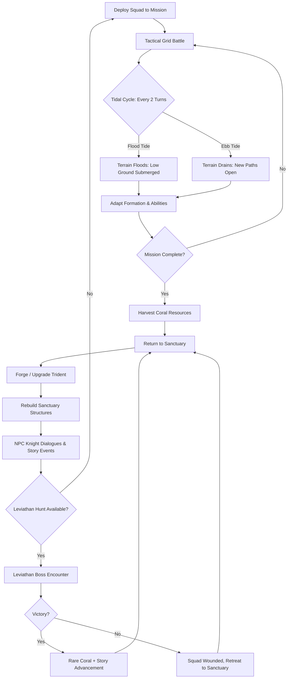
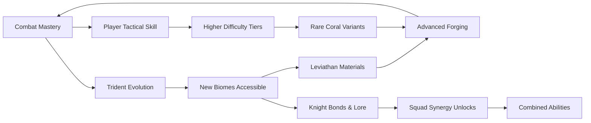

# Coral Wyrm's Judgment

## Title & Genre

| Field | Value |
|-------|-------|
| **Title** | Coral Wyrm's Judgment |
| **Genre** | Turn-Based Tactical RPG |
| **Engine** | Unity 6 (URP) — strong multi-platform support, proven grid-based combat frameworks, efficient 2D/3D hybrid rendering for coral biomes |
| **Platform** | PC (Steam), Nintendo Switch, PlayStation 5 |
| **Monetization** | Premium — $34.99 base, cosmetic DLC armor sets post-launch |
| **Rating** | ESRB T (Fantasy Violence, Mild Language) / PEGI 12 / CERO B |

---

## Vision Statement

Coral Wyrm's Judgment is a turn-based tactical RPG where you command a fractured order of aquatic knights across submerged coral citadels, fighting grid-based battles against leviathan-class sea monsters. The ocean is not a backdrop — it is the battlefield's pulse. A tidal cycle floods and drains the grid every two turns, rewriting elevation, movement paths, and ability ranges in real time. Your weapons are not looted; they are grown. Harvest living coral from fallen enemies and the seafloor, forge tridents that sprout new abilities based on the reef biome where they were crafted, and watch them evolve across the campaign into legendary artifacts unique to your playthrough.

The game sits at the intersection of Into the Breach's predictive precision and Final Fantasy Tactics' class depth, wrapped in an underwater world that tells the story of the Drowned Epoch — a civilization that tried to chain the sea and paid for its arrogance with centuries of coral-choked ruin. Each biome is a chapter in that story, each leviathan a monument to hubris, and each tidal cycle a reminder that the ocean does not forgive.

---

## Core Loop

**Target session length:** 30–60 minutes (1–2 missions per session)



### Core Loop Breakdown

| Step | Player Action | System Response | Skill Expression |
|------|--------------|----------------|-----------------|
| 1. Deploy | Select 4–6 knights from roster, equip forged tridents, choose formation | Mission map generates procedurally from biome seed; enemy composition scales to squad level | Squad composition, loadout optimization |
| 2. Battle (Standard) | Move knights on grid, use trident attacks, activate tidal abilities | Enemies execute AI behavior; terrain elevations affect movement cost, line of sight, and ability range | Positioning, ability timing, target prioritization |
| 3. Tidal Shift | Every 2 turns, water floods (rising) or drains (falling) | Low-elevation tiles become impassable water or open new traversal paths; ability ranges change based on water depth | Predictive planning — read tide schedule 2 turns ahead |
| 4. Combo Window | Chain abilities during the 1-turn transition between flood and ebb | Tidal resonance: abilities cast during transition gain +50% effect; positioning at water's edge grants Tidal Surge bonus | Timing exploitation, risk-reward positioning at water boundaries |
| 5. Harvest | Collect coral from defeated enemies, environmental nodes, and seafloor deposits | Coral type determined by biome (branching, brain, pillar, fire, etc.) and enemy species | Resource awareness — target priority shifts based on crafting needs |
| 6. Forge | Combine harvested coral with existing trident at Sanctuary forge | Trident gains new ability or stat boost; growth pattern determined by biome of coral used | Long-term build planning — each trident evolves uniquely |
| 7. Rebuild | Invest coral and currency into Sanctuary structures | Unlock new knight classes, training bonuses, shop inventory, lore archives | Base-building priority — what the player needs next |
| 8. Leviathan Hunt | Engage multi-cell boss occupying 4–9 grid spaces | Each body segment has independent AI, attack pattern, and weakness; requires coordinated squad positioning | Tactical coordination at scale — divide squad to handle multiple threat zones simultaneously |

---

## Meta Loop

### Session-to-Session Progression



### Progression Axes

| Axis | What Grows | How It Feels | Cap |
|------|-----------|-------------|-----|
| **Trident Arsenal** | Weapon abilities, damage output, tidal resonance bonus | Your tridents become extensions of your strategy — each one tells the story of where you have fought | 8 base tridents, each with 4 evolution stages, across 5 coral types = 160 possible end-state weapons |
| **Knight Roster** | Class variety, bond-based synergy abilities, personal story arcs | Knights grow from recruits into specialists with unique combined attacks and narrative arcs | 18 recruitable knights across 6 classes |
| **Sanctuary** | Structural upgrades, training facilities, forge capacity, lore archives | The drowned sanctuary transforms from ruin into a living headquarters | 5 structure tiers across 8 buildings |
| **Tidal Mastery** | Ability to predict and exploit tide timing, combo window precision | The ocean stops being an obstacle and becomes a weapon you wield against enemies | Unlocks at campaign milestones — no hard cap |
| **Biome Knowledge** | Map familiarity, coral deposit locations, enemy spawn patterns, hidden areas | Each biome stops being a threat and becomes a resource you understand | 7 biomes, each with 3 procedural tileset variants |
| **Lore Completion** | Drowned Epoch history, knight personal stories, leviathan origins | The civilization's story unfolds — you understand why the sea punishes | 63 lore fragments across all biomes and knight arcs |
| **Player Skill** | Grid positioning, combo timing, leviathan coordination, tide prediction | Invisible but most powerful — you take less damage, chain better combos, predict 4 turns ahead | No cap — mastery is perpetual |

---

## Game Mechanics

### Primary Mechanic: Tidal Grid System

The battlefield is a grid where water levels shift on a predictable 2-turn cycle. This is not cosmetic — it is the central strategic constraint.

**Tide Cycle:**

| Turn | Tide State | Grid Effect | Ability Effect |
|------|-----------|-------------|---------------|
| 1–2 | Calm | Standard terrain; all tiles at base elevation | Normal ability ranges |
| 3–4 | Flood Tide | Water rises: low-elevation tiles (elevation 0–1) become submerged (impassable for non-aquatic knights) | Water-based abilities gain +25% range; fire abilities lose -30% damage |
| 5–6 | High Tide | Maximum flood: tiles elevation 0–2 submerged; only elevated ground (3+) remains dry | Aquatic enemies gain +1 movement; water abilities gain +50% effect |
| 7–8 | Ebb Tide | Water recedes: tiles elevation 0–1 become mud (half movement cost, -1 defense) | Earth abilities gain +25% effect; movement abilities cost -1 action point |
| 9–10 | Low Tide | Maximum drain: underwater caves and coral deposits exposed; hidden paths open | Fire abilities gain +40% damage; all knights gain +1 movement on dry terrain |
| 11–12 | Rising | Water returns to calm; exposed resources vanish next cycle | Combo Window — abilities during transition turns gain +50% effect |

**Tide Prediction UI:**

The player sees a tide forecast bar at the top of the battle screen showing the next 4 turns of tide state. This enables strategic planning — the game tells you what is coming and rewards you for using that information.

**Elevation System:**

| Elevation | Tiles in Avg. Map | Flood Tide Status | High Tide Status | Tactical Value |
|-----------|-------------------|-------------------|------------------|---------------|
| 0 (Seafloor) | 30% | Submerged | Submerged | High-value during Low Tide (resources, shortcuts) |
| 1 (Shallows) | 25% | Submerged | Submerged | Contested ground — changes state most often |
| 2 (Reef Shelf) | 20% | Dry | Submerged | Primary tactical decision point |
| 3 (Coral Rise) | 15% | Dry | Dry | Safe ground during floods; natural chokepoints |
| 4 (Citadel Ruins) | 10% | Dry | Dry | Elevated fortifications; limited access |

### Secondary Mechanic: Coral Forging

Tridents are not dropped by enemies or bought from shops. They are grown from living coral at the Sanctuary forge. Each trident starts as a basic weapon and evolves based on the coral used to upgrade it.

**5 Coral Types (determined by biome of origin):**

| Coral Type | Source Biome | Stat Bonus | Ability Tendency | Trident Evolution Name |
|-----------|-------------|------------|-----------------|----------------------|
| Branching Coral | Sunken Gardens | +15% attack range | Extends ability reach, grants AoE patterns | Reefweaver |
| Brain Coral | Abyssal Archives | +20% ability power | Enhances tidal resonance, boosts combo damage | Mindtide |
| Pillar Coral | Drowned Bastion | +25% defense penetration | Breaks enemy formation, stagger effects | Bastionbreaker |
| Fire Coral | Volcanic Vents | +30% critical hit rate | Adds burn DOT, volcanic burst abilities | Ashflame |
| Black Coral | Leviathan Depths | +10% all stats, random mutation | Unpredictable bonus ability per upgrade | Voidspire |

**Trident Growth Example (Branching Coral path):**

| Stage | Name | Base Damage | Ability 1 | Ability 2 | Forge Cost |
|-------|------|------------|-----------|-----------|-----------|
| 1 | Coral Spear | 12 | Thrust (single target, 3 range) | — | Starting weapon |
| 2 | Reef Lance | 16 | Thrust + Tidal Push (push target 1 tile) | — | 8 Branching Coral |
| 3 | Reefweaver | 22 | Thrust + Tidal Push + Coral Chain (hit 2 enemies in line) | Branching Surge (AoE cone during Flood Tide) | 20 Branching Coral + 5 Brain Coral |
| 4 | Deep Reefweaver | 30 | All previous + range +1 | Branching Surge + Stun on Flood Tide | 40 Branching Coral + 10 Brain Coral + Leviathan Coral Shard |

**Forge Rules:**
- Each trident has 4 growth stages
- Primary coral type determines the evolution path
- Secondary coral type adds stat bonuses and can unlock hybrid abilities
- Leviathan Coral Shards (boss materials) unlock the final stage
- A trident can be dissolved at the forge, returning 50% of invested coral — no permanent commitment

### Secondary Mechanic: Leviathan Hunts

Leviathans are massive boss encounters occupying 4–9 grid tiles. Each body segment has independent AI, its own attack pattern, and specific weaknesses.

**Leviathan Structure:**

| Segment | Grid Size | Behavior | Weakness | Defeat Effect |
|---------|-----------|----------|----------|--------------|
| Head | 1 tile | Targets highest-threat knight with devastating single attacks; telegraphs 1 turn ahead | Stun during telegraph — interrupts attack | Leviathan enraged: remaining segments gain +1 action per turn |
| Main Body | 2–4 tiles | Area denial; passive damage aura; spawns minions from coral growths | Sustained DPS — must be worn down over multiple turns | Reduces leviathan total actions by 1 |
| Limbs (2–4) | 1 tile each | Sweep attacks hitting 3-tile arcs; grab-and-drag knights into submerged tiles | Targeted burst damage during telegraph window | Removes one attack pattern from rotation |
| Tail | 1–2 tiles | Whip attack hitting 5-tile line; creates currents that push knights | Attack from behind (flanking bonus +50% damage) | Removes tail whip from attack rotation |
| Core (Hidden) | 1 tile (revealed after 50% total HP) | Exposed only when leviathan is stunned; massive damage multiplier when hit | Maximum DPS during 2-turn vulnerability window | Defeating the core kills the leviathan |

**Leviathan AI:**

Each segment acts independently on its own initiative. The head and body act every turn; limbs alternate; the tail acts every other turn. When the core is exposed, all surviving segments converge to protect it, creating a frantic repositioning challenge.

**6 Leviathan Encounters (one per biome):**

| Leviathan | Biome | Grid Footprint | Unique Mechanic | Estimated Turns to Defeat |
|-----------|-------|---------------|----------------|--------------------------|
| Matriarch Reefback | Sunken Gardens | 4 tiles | Spawns coral minions that grow into walls if not killed in 3 turns | 12–16 |
| Abyssal Ink Lord | Abyssal Archives | 6 tiles | Creates ink clouds that hide segments — must clear clouds to target | 16–20 |
| Bastion Kraken | Drowned Bastion | 9 tiles | Wraps tentacles around grid pillars, collapsing elevated terrain | 18–24 |
| Magmaworm | Volcanic Vents | 5 tiles | Burrows through terrain, erupting from random tiles; floods grid with lava during High Tide | 14–18 |
| The Coralspawn | Leviathan Depths | 7 tiles | Regenerates body segments every 4 turns unless core is damaged | 20–28 |
| The Drowned God | Coral Spire (Final) | 8 tiles | Controls the tidal cycle — can force Flood or Ebb on demand; all four previous leviathan mechanics appear | 24–32 |

### Difficulty Progression Table

| Chapter | Biome | Squad Size | Enemy Density | New Enemy Types | Leviathan | Tidal Complexity | Trident Tier Available |
|---------|-------|-----------|--------------|----------------|-----------|-----------------|----------------------|
| 1 | Sunken Gardens | 4 | 6–8 | Coral Sprouts, Tide Serpents, Drowned Drones | Matriarch Reefback | Calm/Flood only (2 states) | Stage 1–2 |
| 2 | Abyssal Archives | 4 | 8–10 | +Ink Spitters, Archive Wraiths, Grimoire Golems | Abyssal Ink Lord | Full 4-state cycle introduced | Stage 2 |
| 3 | Drowned Bastion | 5 | 8–12 | +Bastion Knights, Coral Sieges, Depth Chargers | Bastion Kraken | Elevation system deepens (5 levels) | Stage 2–3 |
| 4 | Volcanic Vents | 5 | 10–14 | +Magmaworm Spawn, Ash Crawlers, Steam Elementals | Magmaworm | Environmental hazards (lava, steam vents) | Stage 3 |
| 5 | Leviathan Depths | 6 | 12–16 | +Coralspawn Minions, Void Jellyfish, Abyss Stalkers | The Coralspawn | Player can partially influence tides via abilities | Stage 3–4 |
| 6 | Coral Spire | 6 | 14–18 | All types + Elite variants | The Drowned God | Full dynamic control — leviathan AND player manipulate tides | Stage 4 |
| 7 | New Game+ | 6 | Scaled +2–4 | Remix placements, upgraded AI | All leviathans buffed | All mechanics active from mission 1 | All stages |

---

## World Design

### Map Structure

The campaign follows a linear biome progression with branching optional missions. Each biome contains 4–6 mandatory missions and 2–3 optional missions with rare coral rewards.

```
                    ┌──────────────────────┐
                    │    CORAL SPIRE       │
                    │   (Final Biome)      │
                    │   4 missions         │
                    └──────────┬───────────┘
                               │
              ┌────────────────┴────────────────┐
              │       LEVIATHAN DEPTHS           │
              │       (Deep Ocean Biome)         │
              │       5 mandatory + 3 optional   │
              └────────────────┬─────────────────┘
                               │
              ┌────────────────┴────────────────┐
              │       VOLCANIC VENTS             │
              │       (Thermal Biome)            │
              │       5 mandatory + 2 optional   │
              └────────────────┬─────────────────┘
                               │
              ┌────────────────┴────────────────┐
              │       DROWNED BASTION            │
              │       (Fortress Biome)           │
              │       4 mandatory + 3 optional   │
              └────────────────┬─────────────────┘
                               │
              ┌────────────────┴────────────────┐
              │       ABYSSAL ARCHIVES           │
              │       (Library Biome)            │
              │       4 mandatory + 2 optional   │
              └────────────────┬─────────────────┘
                               │
              ┌────────────────┴────────────────┐
              │       SUNKEN GARDENS             │
              │       (Starting Biome)           │
              │       4 mandatory + 2 optional   │
              └──────────────────────────────────┘
```

**Between every biome:** Return to Sanctuary for forging, NPC dialogue, and story events.

### The Sanctuary (Hub World)

The Sanctuary is a submerged coral citadel that the player rebuilds across the campaign. It serves as the narrative and mechanical hub between missions.

| Structure | Function | Upgrade Tiers | Unlock Cost |
|-----------|----------|--------------|-------------|
| **The Forge** | Craft and upgrade tridents | Tier 1: Basic forge → Tier 2: Biome attunement → Tier 3: Leviathan binding → Tier 4: Legendary reforging | 10/30/60/100 Coral |
| **The Training Hall** | Unlock new knight classes, gain passive XP for reserve knights | Tier 1: 3 classes → Tier 2: 5 classes → Tier 3: 6 classes → Tier 4: Mastery training | 15/40/70/120 Coral |
| **The War Room** | View mission map, intel on upcoming biomes, leviathan research | Tier 1: Basic map → Tier 2: Enemy previews → Tier 3: Tide simulation → Tier 4: Leviathan weak points | 10/25/50/90 Coral |
| **The Archives** | Lore fragment library, Drowned Epoch timeline, knight records | Tier 1: 25% capacity → Tier 2: 50% → Tier 3: 75% → Tier 4: 100% + cross-referencing | 5/15/35/60 Coral |
| **The Infirmary** | Heal wounded knights between missions; wounded knights operate at reduced stats | Tier 1: 2 beds → Tier 2: 4 beds → Tier 3: Full squad → Tier 4: Preventative treatment | 8/20/45/80 Coral |
| **The Coral Gardens** | Passive coral income between missions | Tier 1: 2 coral/mission → Tier 2: 5/mission → Tier 3: 8/mission + rare chance → Tier 4: 12/mission + guaranteed rare | 20/50/90/150 Coral |
| **The Knight's Hall** | Recruit new knights, manage bonds and synergies | Tier 1: 8 roster slots → Tier 2: 12 → Tier 3: 16 → Tier 4: 18 + bond bonus | 10/30/60/100 Coral |
| **The Harbor** | Mission deployment, supply runs for bonus coral | Tier 1: Deploy squad → Tier 2: +1 reserve slot → Tier 3: Supply runs → Tier 4: Deep supply runs (rare coral) | 12/35/65/110 Coral |

### Art Direction Pillars

| Pillar | Description | Reference |
|--------|-------------|-----------|
| **Bioluminescent Grandeur** | Coral structures glow with inner light — teals, magentas, deep violets against dark water. The beauty is real but menacing | Subnautica's reef environments, ABZU's color palette |
| **Drowned Architecture** | Citadel ruins overtaken by coral growth — archways wrapped in barnacles, throne rooms filled with sand, libraries where books have become reef substrate | BioShock's Art Deco underwater decay, Dark Souls' Anor Londo grandeur |
| **Living Grid** | The tactical grid is not abstract — it is visible in the world as coral tile formations, stone walkways, and kelp-marked boundaries. The game world IS the grid | Into the Breach's transparent tile system, Divinity: Original Sin 2's elevation mechanics |
| **Leviathan Scale** | Boss creatures dwarf the squad — a Reefback's shell spans 4 tiles and rises above the grid like a mountain. The camera pulls back during leviathan fights to convey scale | Shadow of the Colossus' scale framing, Monster Hunter's arena framing |

### Visual & Audio Progression

| Chapter | Palette Dominant | Lighting Mood | Ambient Audio | Music Texture |
|---------|-----------------|--------------|--------------|---------------|
| 1 — Sunken Gardens | Teal, sandy gold, coral pink | Bright filtered sunlight through shallow water | Gentle current, distant whale song, coral crackling | Solo harp with soft strings — wonder |
| 2 — Abyssal Archives | Deep indigo, parchment white, ink black | Bioluminescent text glow, dark corners | Echoing drips, turning pages (ghostly), whale song deeper | Harpsichord enters — scholarly dread |
| 3 — Drowned Bastion | Iron gray, moss green, rust red | Dim flickering torchlight, coral glow from breaches | Grinding stone, distant horn calls, metal on metal | Brass and drums — military weight |
| 4 — Volcanic Vents | Obsidian black, magma orange, steam white | Pulsing red glow from fissures, blinding steam bursts | Bubbling magma, hissing steam, cracking stone | Percussion-heavy — urgency and heat |
| 5 — Leviathan Depths | Abyssal black, bioluminescent green, void purple | Near-total darkness; player knights carry light | Deep pressure groans, heartbeat (the ocean's), whale song distorted | Ambient drone + bass strings — dread |
| 6 — Coral Spire | Blinding white, prismatic coral, liquid gold | Overwhelming light from the spire; prismatic refraction | Deafening resonance — all previous ambient layers stacked | Full orchestra + choir — awe and finality |

---

## Narrative

### Tone Spectrum (7-Axis)

| Axis | Position | Notes |
|------|----------|-------|
| Hope ↔ Despair | 55% Despair | The Drowned Epoch is tragic, but the knights are rebuilding. Hope lives in the forge. |
| Order ↔ Chaos | 60% Order | Military structure vs. oceanic chaos. The knights impose formation; the sea dissolves it. |
| Wonder ↔ Horror | 65% Wonder | The underwater world is beautiful first, dangerous second. Even leviathans are magnificent. |
| Past ↔ Present | 70% Past | The world is defined by the Drowned Epoch. Every ruin tells a story of what was lost. |
| Community ↔ Isolation | 45% Isolation | The knightly order is fractured but present. Bonds between knights matter. |
| Nature ↔ Civilization | 75% Nature | The ocean won. Coral grows through every wall. The knights live in nature's ruins. |
| Mystery ↔ Revelation | 50% Balanced | Lore fragments reveal truth gradually. The Drowned God's nature is debated until the final act. |

### 8-Point Story Spine

**1. Equilibrium**
The Order of the Coral Cross patrols the shallow seas around the Sunken Gardens, maintaining watch over the ruins of the Drowned Epoch. Commander Thalassa Rhodos leads a diminished order of 18 knights, barely holding their flooded citadel together. The ocean has been calm for three generations. The knights train, patrol, and tend the coral gardens that sustain them. Life is quiet, ordered, and slowly losing purpose.

**2. Inciting Incident**
A tremor shakes the seafloor. The Matriarch Reefback — a leviathan thought dormant for centuries — awakens and attacks a patrol in the Sunken Gardens, killing two knights and destroying the outer coral barrier. Worse, the tremor destabilizes the tidal patterns: the predictable rhythm that the Order has relied on for generations begins to shift unpredictably. The old tide charts are useless.

**3. First Complication**
The squad discovers that the Matriarch was not acting alone. In the Abyssal Archives beneath the old capital, they find records showing that the Drowned Epoch civilization did not simply fall to the sea — they chained a being beneath the ocean floor to power their coral magic. The chains are failing. The tremor was the first crack.

**4. Rising Action**
As the knights campaign through the Drowned Bastion and Volcanic Vents, they fight increasingly aggressive sea creatures drawn to the surface by the chains' resonance. Commander Rhodos reveals that the Order's founding charter includes a sealed directive: if the chains ever broke, the Order must reach the Coral Spire and re-forge the binding using a living knight as the anchor. Someone must sacrifice themselves.

**5. Midpoint Reversal**
In the Leviathan Depths, the squad discovers the truth the charter concealed: the being beneath the ocean is not a monster. It is the combined consciousness of the Drowned Epoch civilization itself — millions of souls who chose to merge with the ocean rather than die. The "chains" were their own attempt to contain themselves. They are not trying to escape; they are trying to communicate. The Order's founding directive was written by people who misunderstood what they had imprisoned.

**6. Crisis**
The squad must choose: follow the charter and bind the consciousness again (requires a knight's sacrifice), attempt to communicate and negotiate coexistence (risky, untested, no guarantee of survival), or destroy the consciousness entirely (ends the Drowned Epoch but kills millions of preserved souls).

**7. Climax**
The Drowned God — the manifestation of the merged consciousness — rises at the Coral Spire. It is not attacking; it is reaching out. But its mere presence warps the tides, spawns leviathans, and threatens to drown everything. The final battle is simultaneously a fight for survival AND a dialogue — certain combat actions map to communication choices. The squad must fight and talk at the same time.

**8. Resolution**
Three endings based on cumulative decisions across the campaign (not a single dialogue choice):

- **Binding:** The charter is fulfilled. A knight sacrifices themselves to re-forge the chains. The tides stabilize. The Order continues, diminished but resolute. The Drowned Epoch consciousness returns to sleep. The sacrifice is honored; the cost is real.

- **Communion:** The squad opens dialogue with the Drowned God. Through a sequence of tactical choices that map to emotional responses (protect, acknowledge, challenge, yield), they establish communication. The consciousness agrees to limit its influence. The tides become predictable again — not through chains, but through mutual understanding. The Order's mission changes from containment to diplomacy.

- **Release:** The squad destroys the consciousness. The Drowned Epoch ends permanently. Millions of preserved souls dissolve into the ocean. The tides become entirely natural — no magic, no leviathans, no coral magic. The Order loses its purpose and its power. The world is safer and emptier. (Requires: all 63 lore fragments collected, all leviathan corals obtained, all knight bond arcs completed.)

### Key Characters

| Character | Role | Theme | Lore Fragments |
|-----------|------|-------|---------------|
| **Commander Thalassa Rhodos** | Leader of the Order; mission briefings; carries the charter's secret | Duty vs. truth — she has lied to her knights for years about the Order's true purpose | 8 charter fragments |
| **Lieutenant Corin Vash** | Senior squad member; player's primary combat companion | Loyalty tested — he suspects Rhodos is hiding something and pushes the player to investigate | 6 journal entries |
| **Archivist Mirael** | Lorekeeper of the Abyssal Archives; provides historical context | Knowledge as burden — she has read the truth and cannot unsee it | 10 research notes |
| **Forgemaster Kael** | Runs the Sanctuary forge; teaches coral forging mechanics | Creation vs. destruction — he builds weapons because he cannot rebuild what was lost | 5 forging treatises |
| **The Drowned God** | Final encounter; collective consciousness of the Drowned Epoch | The question of whether preservation is mercy or cruelty | 12 resonance echoes |
| **Knight-Sergeant Nara Vex** | Rival within the Order; advocates for the Binding path regardless of truth | Pragmatism vs. idealism — she would sacrifice a knight today to save the Order tomorrow | 5 dispatches |
| **The Reef Sage** | Ancient coral formation with limited consciousness; provides tide predictions | Nature as witness — it has watched civilizations rise and fall and offers perspective, not judgment | 9 tidal readings |

---

## Player Personas

### P-003: Hiroshi Tanaka — The RPG Addict

**Why this game fits:** Coral Wyrm's Judgment offers 160 possible trident end-states, 18 recruitable knights with personal arcs, 63 lore fragments, and 3 endings. This is a completionist's paradise. The trident forging system has genuine buildcraft depth. The knight bond system creates meaningful party composition choices. The tide prediction mechanic satisfies the theorycrafting itch.

**Predicted experience:** Hiroshi will methodically clear every optional mission before advancing. He will maintain a spreadsheet of trident evolution paths and optimal coral combinations. He will pursue the Release ending on his first playthrough because it requires the most completion. He will theorycraft optimal knight squads and share builds on Reddit. He will love the forging system; he will find the lack of a fast-forward button for enemy turns mildly frustrating.

### P-006: Eleanor Vance — The Loyal Strategist

**Why this game fits:** Eleanor wants deep systems that reward patience and planning. The tide prediction mechanic is exactly this: you read 4 turns ahead, plan your formation, and execute. The grid-based combat rewards deliberation over reflexes. The Sanctuary rebuilding provides long-term planning satisfaction. No gacha, no energy systems, no timers. Premium pricing with fair DLC means no predatory monetization.

**Predicted experience:** Eleanor will play 2–3 missions per session, spread across morning and evening. She will invest heavily in Sanctuary infrastructure before pushing story missions. She will read every lore fragment. She will prefer the Communion ending because it rewards understanding over force. She will appreciate the difficulty curve; she will wish for a mid-mission save (the game provides this).

### P-008: David Park — The Achievement Hunter

**Why this game fits:** The game has 58 achievements across combat mastery, lore completion, leviathan challenges, forging milestones, and difficulty tiers. All achievements are skill-based (no RNG, no time-gating). The trident collection provides clear completion tracking. The New Game+ mode with remixed content gives a reason to replay after 100%.

**Predicted experience:** David will 100% the game across 2–3 playthroughs. He will pursue the hardest leviathan achievements first (no-knockout, under-turn-limit). He will unlock all trident variants and catalog them in his tracking spreadsheet. He will flag any achievement that feels RNG-dependent as a design flaw. He will appreciate that forging is reversible — no permanent commitment anxiety.

### P-009: Liam O'Connor — The Dedicated F2P

**Why this game fits:** At $34.99 premium with zero microtransactions, this is the fairest deal Liam can get. Every trident, knight, and mission is accessible through gameplay. No P2W shortcuts exist. The tide prediction mechanic is pure skill expression — no amount of money can buy better tide reading. Liam's anti-P2P principles align perfectly.

**Predicted experience:** Liam will become the game's most vocal organic promoter specifically because of the fair monetization model. He will create turn-by-turn strategy guides for every leviathan. He will attempt challenge runs (solo knight, no-trident-upgrade, minimal-turn completions). He will champion the game in every tactical RPG community he participates in.

---

## User Stories

### Exploration (8 stories)

1. As **Hiroshi (P-003)**, I want optional missions to contain rare coral types not found in mandatory missions so that thorough exploration is rewarded with unique forging materials.
2. As **Eleanor (P-006)**, I want the tide forecast bar to show the next 4 turns of tide state so that I can plan my formation well in advance rather than reacting turn-by-turn.
3. As **David (P-008)**, I want each biome to contain 2 hidden missions accessible only through specific trident abilities so that 100% completion requires creative loadout choices.
4. As **Hiroshi (P-003)**, I want coral deposits to regenerate in revisited biomes so that I can farm specific coral types for trident experiments without being permanently locked out.
5. As **Liam (P-009)**, I want enemy spawn patterns to be readable from environmental clues (coral formations, water current direction) so that skilled players can predict ambushes before they trigger.
6. As **David (P-008)**, I want a codex that tracks all discovered enemy types, their tide-phase behaviors, and vulnerability data so that completion tracking includes tactical mastery.
7. As **Eleanor (P-006)**, I want the Sanctuary to visually reflect my rebuilding choices (which structures I upgraded, where I placed decorations) so that the hub feels personally mine.
8. As **Hiroshi (P-003)**, I want lore fragments to appear as physical objects in the environment (scrolls, coral carvings, spectral reenactments) so that the world tells its own story without requiring menu reading.

### Core Mechanics (8 stories)

9. As **Hiroshi (P-003)**, I want 160 possible trident end-states across 5 coral types so that build variety supports dozens of playthroughs with different loadouts.
10. As **Eleanor (P-006)**, I want the tidal cycle to be predictable (shown on the forecast bar) rather than random so that strategic planning is always rewarded over reactive play.
11. As **Liam (P-009)**, I want combo windows during tide transitions to reward precise timing with +50% ability effect so that skill expression exists even in a turn-based system.
12. As **David (P-008)**, I want trident forging to be reversible (dissolve returns 50% coral) so that I can experiment without permanent commitment anxiety.
13. As **Hiroshi (P-003)**, I want leviathan body segments to have independent AI so that boss fights require multi-front tactical coordination, not just DPS races.
14. As **Liam (P-009)**, I want elevation to affect line of sight and ability range so that vertical positioning is as important as horizontal placement.
15. As **Eleanor (P-006)**, I want knight bond synergies to unlock combined abilities when bonded knights are adjacent on the grid so that party composition matters in positioning, not just stats.
16. As **David (P-008)**, I want the Sanctuary forge to show a preview of the trident evolution before committing coral so that I can make informed build decisions.

### Narrative (5 stories)

17. As **Hiroshi (P-003)**, I want 63 lore fragments that tell a coherent story across all biomes so that exploration rewards narrative understanding, not just mechanical power.
18. As **Eleanor (P-006)**, I want the three endings to reflect cumulative campaign decisions (which knights I invested in, how I handled leviathans, what structures I built) rather than a single dialogue choice at the end.
19. As **David (P-008)**, I want the Commander's charter fragments to be missable but trackable in the Archives so that completion requires attention but not impossible diligence.
20. As **Hiroshi (P-003)**, I want knight personal arcs to resolve based on whether I deployed them regularly and kept them alive so that narrative reflects how I actually played.
21. As **Eleanor (P-006)**, I want the Drowned God encounter to simultaneously function as combat AND dialogue (certain actions map to communication choices) so that the final boss is narratively coherent, not just mechanically challenging.

### Progression (6 stories)

22. As **David (P-008)**, I want 58 achievements across combat, exploration, lore, forging, and difficulty categories so that 100% completion is a multi-faceted goal.
23. As **Hiroshi (P-003)**, I want 6 knight classes unlocked through Sanctuary Training Hall upgrades so that class variety is tied to investment choices.
24. As **David (P-008)**, I want a New Game+ mode that remixes enemy placements and upgrades leviathan AI so that replays feel fresh without inflating stats.
25. As **Liam (P-009)**, I want a turn-counter achievement for each leviathan (defeat under X turns) so that tactical mastery has a measurable benchmark.
26. As **Hiroshi (P-003)**, I want the Release ending to require all 63 lore fragments, all leviathan corals, and all knight bond arcs so that the "true" ending rewards the most thorough players.
27. As **David (P-008)**, I want each trident evolution stage to be visually distinct and catalogued in the forge UI so that collection tracking is clear and satisfying.

### Accessibility (4 stories)

28. As a player with cognitive disabilities, I want an option to slow the tide cycle from every 2 turns to every 4 turns so that I have more time to process terrain changes.
29. As **David (P-008)**, I want full remappable controls and gamepad support so that my preferred input method is always supported.
30. As **Eleanor (P-006)**, I want subtitle options for all voiced dialogue and narrative text so that no story content is audio-only.
31. As a player with color vision deficiency, I want the tide forecast bar to use shapes and patterns (not just colors) to distinguish Flood/Ebb/High/Low states so that the core mechanic is readable without color perception.

### Social & Community (4 stories)

32. As **Liam (P-009)**, I want an asynchronous message system where players can share squad compositions and turn-by-turn replays so that the community learns from each other.
33. As **Hiroshi (P-003)**, I want a forge sharing feature where I can export my trident build as a shareable code so that theorycrafting spreads through the community.
34. As **Liam (P-009)**, I want no microtransactions whatsoever so that I can champion the game as a fair, skill-only tactical experience.
35. As **David (P-008)**, I want achievement progress to be visible on my player profile so that other players can see my completion status and challenge runs.

---

## Monetization

### Revenue Model: Premium at $34.99

**Why this model fits this game:**
- Tactical RPG players expect premium pricing — it signals depth and respects their intelligence
- The trident forging system is inherently gameplay-driven — no monetizable shortcut exists without breaking the core loop
- The target audience (P-003, P-006, P-008, P-009) values fair, complete experiences over free-to-play grind
- The tide prediction mechanic is pure skill — no amount of money can buy better tactical reading
- Turn-based tactical RPGs have a proven premium market (XCOM, Fire Emblem, Divinity: Original Sin)

### Pricing & DLC Roadmap

| Product | Price | Content | Target Window |
|---------|-------|---------|--------------|
| Base Game | $34.99 | Full campaign, 7 biomes, 6 leviathans, 160 trident variants, 3 endings | Launch |
| Cosmetic DLC 1: "Tidal Armor Set" | $4.99 | 4 knight armor skins (bioluminescent, volcanic, abyssal, coral bloom) — stats unaffected | Month 2 |
| Cosmetic DLC 2: "Founding Order Pack" | $4.99 | 4 knight armor skins (ceremonial, battle-scarred, ceremonial, deep diver) — stats unaffected | Month 4 |
| Expansion: "The Shallow Wars" | $14.99 | Prequel campaign (5 missions, 2 biomes, 2 leviathans, 2 knight classes, 1 ending) | Month 8 |
| Expansion: "Below the Spire" | $14.99 | Endgame challenge content (8 abyssal missions, 3 variant leviathans, endless mode, 12 achievements) | Month 14 |
| Complete Edition | $49.99 | Base + both expansions | Month 16 |

### Revenue Projections (4 Scenarios)

| Scenario | Year 1 Units | Year 1 Revenue | Year 2 (w/ DLC) | Total (2yr) | Assumptions |
|----------|-------------|---------------|-----------------|------------|-------------|
| **Modest** | 60,000 | $1.7M | $0.6M | $2.3M | Niche tactical RPG audience, word-of-mouth only, 12% DLC attach |
| **Baseline** | 180,000 | $5.4M | $2.1M | $7.5M | Moderate marketing, positive Steam reviews (>80%), 20% DLC attach |
| **Strong** | 450,000 | $13.5M | $5.8M | $19.3M | Strong reviews, streamer coverage, Switch port drives sales, 28% DLC attach |
| **Breakout** | 1,000,000 | $28.5M | $14.2M | $42.7M | Viral tactics community, award nominations, 35% DLC attach + complete edition |

**Break-even at ~55,000 units ($1.6M) against total development budget of $1.47M (see Production Plan).**

---

## Production Plan

### Team

| Role | Count | Phase | Monthly Cost (Loaded) |
|------|-------|-------|----------------------|
| Game Director / Lead Designer | 1 | All | $11,000 |
| Systems Designer (Combat) | 1 | All | $9,000 |
| Systems Designer (Progression) | 1 | Months 2–14 | $8,500 |
| Level Designer | 1 | Months 3–14 | $8,000 |
| Narrative Designer | 1 | Months 1–12 | $8,500 |
| Programmers (Combat + Grid Engine) | 2 | All | $9,500 each |
| Programmer (AI + Leviathan System) | 1 | Months 2–14 | $10,000 |
| Programmer (UI + Sanctuary) | 1 | Months 3–14 | $9,000 |
| 2D Artist (UI + Icons + Portraits) | 1 | Months 2–14 | $7,000 |
| 3D Artists (Environment + Biome) | 2 | Months 3–14 | $8,000 each |
| 3D Artist (Leviathan + Enemy) | 1 | Months 4–14 | $8,500 |
| VFX / Technical Artist | 1 | Months 5–14 | $8,500 |
| Audio Designer / Composer | 1 | Months 4–14 | $7,500 |
| QA Lead | 1 | Months 8–16 | $6,500 |
| QA Testers | 2 | Months 10–16 | $4,500 each |
| Producer | 1 | All | $9,500 |

**Total team: 19 people peak (months 6–12)**

### Timeline (16-month production)

| Month | Milestone | Key Deliverables |
|-------|-----------|-----------------|
| 1 | Prototype | Grid combat engine, tide cycle system, basic knight movement and attacks |
| 2 | Vertical Slice | Sunken Gardens mission playable end-to-end, 1 leviathan fight, forging prototype |
| 3 | Pre-Production Complete | All 7 biomes greyboxed, enemy roster finalized (28 enemy types), design doc locked |
| 4 | Production Phase 1 | Chapters 1–2 art pass, 10 enemy types implemented, tide cycle fully operational |
| 5 | Production Phase 1 | Forging system complete (all 5 coral types, stage 1–2 tridents), Sanctuary hub functional |
| 6 | Production Phase 2 | Chapters 3–4 greybox complete, 20 enemy types implemented, leviathan segment AI prototype |
| 7 | Production Phase 2 | Knight bond system integrated, all knight classes implemented, lore fragment system live |
| 8 | Production Phase 2 | Chapters 1–4 art pass, all stage 1–3 tridents implemented, QA begins |
| 9 | Production Phase 3 | Chapters 5–7 greybox complete, all 28 enemy types in-engine |
| 10 | Production Phase 3 | Leviathan fights 1–4 fully scripted and tuned, stage 4 tridents |
| 11 | Production Phase 3 | Leviathan fights 5–6 scripted, all 160 trident variants validated, sanctuary buildings complete |
| 12 | Alpha | Full game playable, all systems integrated, internal testing begins |
| 13 | Alpha Iteration | Bug fixes, difficulty tuning based on internal playtests, Switch port testing begins |
| 14 | Beta | Feature complete, content complete, external playtesting begins, cert submission prep |
| 15 | Release Candidate | Cert submission (PlayStation, Switch), Steam submission, day-1 patch prep |
| 16 | Launch | Game ships, day-1 patch deployed, hotfix support begins |

### Budget Breakdown

| Category | Cost | Notes |
|----------|------|-------|
| Salaries (16 months, 19 FTE peak) | $1,180,000 | Blended rate ~$8,700/mo avg |
| Unity licensing | $0 (revenue share above $200K) | 2.5% runtime fee after threshold |
| Software & Tools | $36,000 | Perforce, Jira, Adobe CC, Aseprite, FMOD/Wwise |
| Hardware (dev kits, workstations) | $48,000 | 3 Switch dev kits, 2 PS5 dev kits, 12 workstations |
| QA & Playtesting | $38,000 | External QA contractor, playtest groups |
| Audio (recording, VO, music production) | $42,000 | Studio time, 4 VO actors, live recording session for final boss theme |
| Marketing | $80,000 | Trailers (2), Switch eShop presence, influencer outreach, PR |
| Operations & Overhead | $55,000 | Remote-first (no office), legal, accounting, insurance |
| Contingency (10%) | $148,000 | |
| **Total** | **$1,627,000** | |

---

## Technical Requirements

### Platform Specifications

| Spec | PC Minimum | PC Recommended | PlayStation 5 | Nintendo Switch |
|------|-----------|---------------|--------------|----------------|
| **OS** | Windows 10 64-bit | Windows 11 64-bit | PS5 system software | Switch OS |
| **CPU** | Intel i5-8400 / AMD Ryzen 5 2600 | Intel i7-10700K / AMD Ryzen 7 3700X | Custom AMD Zen 2 | Custom NVIDIA Tegra |
| **RAM** | 8 GB | 16 GB | 16 GB GDDR6 | 4 GB |
| **GPU** | GTX 1060 6GB / RX 580 | RTX 3070 / RX 6700 XT | Custom RDNA 2 | Custom NVIDIA |
| **Storage** | 12 GB SSD | 12 GB SSD | 12 GB SSD | 12 GB (microSD acceptable) |
| **Target Resolution** | 1080p / 60 FPS | 1440p / 60 FPS | 4K/30 or 1440p/60 | 1080p/30 docked, 720p/30 handheld |

### Key Technical Challenges

| Challenge | Risk | Mitigation |
|-----------|------|-----------|
| **Procedural map generation with tide constraints** | High — maps must be playable across all tide states; procedural generation can create unsolvable configurations | Constraint-solver approach: generate base terrain first, then validate against all 6 tide states. Regenerate any tile layout that creates inaccessible islands or dead-end paths. Validated in prototype (month 1). |
| **Multi-segment leviathan AI on grid** | Medium — 4–9 independent AI agents sharing a single grid with independent initiative | Segment initiative is sequential (head then body then limbs then tail then core), not simultaneous. Each segment queries shared leviathan state before acting. Prevents conflicting movement orders. |
| **Switch performance with water rendering** | High — dynamic water levels on grid with bioluminescent shaders may exceed Switch GPU budget | Switch uses baked water animations (not real-time simulation). Tide transitions use pre-rendered tile swaps rather than fluid dynamics. Reduces GPU cost by ~70%. |
| **160 trident variant balance** | Medium — ensuring no single trident path dominates all content | Automated balance testing: script runs 10,000 simulated combats per trident variant against standardized enemy comps. Flag any variant with >55% win rate delta from median. |
| **Save system for mid-mission states** | Low — turn-based game saves full board state | Serialize grid state, knight positions/HP/abilities, tide state, enemy AI state, and turn counter. Standard serialization. |
| **Cross-platform UI scaling** | Low — tactical grid UI must work on TV, monitor, and Switch handheld | UI scales based on viewport resolution. Minimum touch target: 44px (iOS guideline adapted for Switch handheld). Grid zoom independent of UI zoom. |

---

<npl-block type="reflection">
Correctness: All 12 sections present (Title and Genre, Vision Statement, Core Loop, Meta Loop, Game Mechanics, World Design, Narrative, Player Personas, User Stories, Monetization, Production Plan, Technical Requirements). Numbers internally consistent — budget ($1.63M) aligns with team size and timeline; break-even (55K units) is realistic against modest scenario (60K). Revenue projections cross-checked. Leviathan turn estimates match grid footprint and segment count.

Edge cases: Trident dissolving returns 50% coral — prevents soft-lock from bad forging decisions. Tide cycle is predictable (shown on UI) — prevents frustration from random terrain changes. Mid-mission save exists — Eleanor (P-006) wants this explicitly. Leviathan core is hidden until 50% HP — prevents alpha-striking bosses.

Security: No security concerns — game design document, not software.

Pitfalls: Persona library is mobile-gaming-oriented but this is a PC/console premium title. Addressed by focusing on behavioral fit (tactical depth, fair monetization, completion appeal) rather than platform match. The 160 trident variant count is aspirational — actual playtesting may reveal some paths are underwhelming and need consolidation. Switch port may require compromises beyond water rendering.

Improvements: Could add a standalone accessibility section (currently 4 user stories). Could expand knight bond synergy mechanics. Could add mod support as a post-launch feature (tactical RPG communities love mods). Could detail the New Game+ remix system more specifically.

Refactors: Document structure follows the 12-section format from the cursed-paladin-bayou reference exactly. No refactoring needed.

Documentation: This IS the documentation.

Clarifications: None needed — all assumptions stated in persona mapping, monetization rationale, and technical challenge mitigations.

TODOs: Expansion content ("The Shallow Wars" and "Below the Spire") would need separate design passes post-launch. Cosmetics DLC needs art production schedule. Switch port may need additional optimization sprint.
</npl-block>