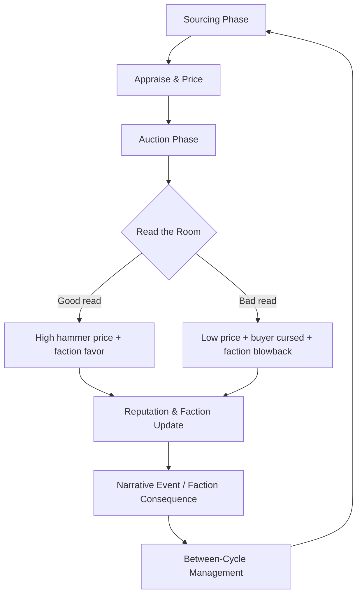
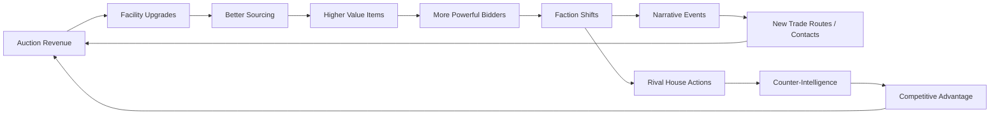

# Crimson Auction

## Title & Genre

| Field | Value |
|-------|-------|
| **Title** | Crimson Auction |
| **Genre** | Narrative Strategy / Social Deduction Tycoon |
| **Engine** | Unity 6 (URP for cross-platform UI scalability) |
| **Platform** | PC (Steam), Nintendo Switch, iOS, Android |
| **Monetization** | Premium $24.99 (PC/Switch) / Free prologue + $9.99 unlock (Mobile) |
| **Rating** | ESRB T (Simulated Gambling, Alcohol Reference, Fantasy Violence) / PEGI 12 / CERO B |

---

## Vision Statement

Crimson Auction is a narrative strategy game where you manage an underground auction house in Aethermere, a floating sky city that caters exclusively to monsters, spirits, and fantasy creatures. Every cycle you acquire enchanted artifacts, cursed relics, and stolen treasures, then auction them to a rotating cast of supernatural bidders. Every item carries hidden properties. Every bidder has secret allegiances, rivalries, and curses. Misjudge a buyer and you have armed a basilisk cartel. Read the room correctly and you have earned a kraken's favor that opens new trade routes.

The game exists at the intersection of poker-table reading, tycoon management, and branching narrative. Your auction hammer is both a weapon and a conductor's baton -- every sale reshapes the political landscape of twelve creature factions competing for dominance in a city held together by commerce and mutual suspicion. Between auctions you manage reputation, spy on rival houses, source contraband from dungeon raids, and navigate storylines where your inventory decisions determine which factions rise to power and which ones declare blood feuds against you.

This is a game about information asymmetry. You always know more than you should, never as much as you need, and every decision to act on partial knowledge is a gamble that the world remembers permanently.

---

## Core Loop

**Target session length:** 20--45 minutes



### Core Loop Breakdown

| Step | Player Action | System Response | Skill Expression |
|------|--------------|----------------|-----------------|
| 1. Source | Choose acquisition method: dungeon raid (risky, high-value), black market contact (reliable, mid-value), diplomatic envoy (safe, low-value but faction-locked) | Items arrive with visible stats (type, rarity, base value) and 1--3 hidden tags (curse, blessing, faction-specific bonus) | Risk/reward assessment, resource allocation |
| 2. Appraise | Examine item using Appraisal skill; higher skill reveals more hidden tags. Spend informant favors to research specific bidders before auction | Hidden tags partially or fully revealed. Bidder dossier updates with mood, loyalty shifts, and recent purchases | Information gathering, when to invest intel vs. save it |
| 3. Price | Set reserve price and opening bid based on visible stats + revealed hidden properties + bidder knowledge | Opening bid establishes market expectation. Reserve protects against catastrophic undersell | Market intuition, reading the meta-economy |
| 4. Read the Room | During live auction, observe bidder tells (visual + audio cues), track who is bidding aggressively, who is bluffing, who has a hidden agenda | 6--8 bidders per auction, each with dynamic bidding patterns influenced by: faction loyalty, personal grudges, item resonance, seating proximity to rivals | Pattern recognition, psychological deduction |
| 5. Hammer | Decide when to call "Going once, twice, sold" -- timing the hammer affects final price and bidder satisfaction | Early hammer favors seller (locks price before bidding peaks). Late hammer risks bidder fatigue or collusion to walk away | Timing, crowd reading, risk tolerance |
| 6. Consequence | Item delivered to winner. Hidden tags activate: curses debuff the buyer's faction, blessings buff them, faction-specific items trigger alliance shifts | Faction power balance updates. Affected factions send envoys, threats, or gifts. Narrative events queue based on which faction gained or lost power | Strategic foresight -- every sale has ripple effects |
| 7. Manage | Between cycles: upgrade appraisal skill, expand warehouse, hire informants, repair faction relations, pursue storylines | World state persists. New items and bidders rotate in. Rival auction houses compete for high-value consignments | Long-term planning, resource management |

---

## Meta Loop

### Cycle-to-Cycle Progression



### Progression Axes

| Axis | What Grows | How It Feels | Cap |
|------|-----------|-------------|-----|
| **Appraisal Mastery** | Number of hidden tags revealed per item, speed of appraisal | Your eye sharpens -- you see what others miss. Curses become visible before they bite. | 5 ranks: Novice, Keen, Expert, Master, Oracle |
| **Auction House Renown** | Warehouse size, bidder quality, maximum auction slots per cycle | The room gets bigger, the art gets finer, the bidders get more dangerous. | 4 tiers: Back Room, Gallery, Grand Hall, Legendary |
| **Faction Standing** | Trust level with each of 12 factions; affects item availability, bidder behavior, and story access | Allies bring gifts. Enemies bring assassins. Neutrals bring opportunity. | 5 ranks per faction: Hostile, Wary, Neutral, Friendly, Allied |
| **Story Progression** | Branching narrative chapters triggered by faction balance thresholds and key item sales | Every sale is a sentence in a story you are writing without knowing the genre. | 5 chapters, 3 acts, 4 endings |
| **Rival House Competition** | AI-driven rival auctioneers who poach bidders, spread rumors, and undercut your pricing | The competition is real, adaptive, and remembers every slight. | 3 rivals with distinct strategies (aggressive, diplomatic, underhanded) |
| **Player Skill** | Ability to read bidder patterns, time hammers, and predict hidden tag outcomes | Invisible but decisive -- experienced players close auctions at 40% higher prices than beginners. | No cap -- mastery is perpetual |

---

## Game Mechanics

### Primary Mechanic: The Live Auction

The auction is the heartbeat of the game. Each auction presents 6--8 bidders seated around a curved table in your auction hall. The player controls the pacing, the reserve price, and the hammer.

**Bidder Behavior System:**

Each bidder is governed by 5 interlocking variables:

| Variable | Range | Effect |
|----------|-------|--------|
| **Desire** | 0--100 | How badly they want the current item. Driven by faction needs, personal collection goals, and hidden tags that resonate with their archetype. |
| **Budget** | Variable | Hard cap on spending. Bidders never exceed budget. Budget regenerates partially between cycles. |
| **Bluff** | 0--100 | Likelihood of bidding above actual desire to drive up a rival's cost. High-bluff bidders are hard to read. |
| **Grudge** | Faction-pair table | If a rival faction member is present, this bidder bids more aggressively (driving up price) or withdraws entirely (refusing to share a room). |
| **Patience** | 0--100 | How many bidding rounds before they walk away. Low-patience bidders create urgency. |

**Bidder Tells:**

Bidders broadcast their internal state through visual and audio cues. Higher appraisal skill makes tells more visible.

| Tell | What It Means | Visibility |
|------|-------------|-----------|
| Leaning forward, eyes locked on item | Desire above 70 | Always visible |
| Glancing sideways at a specific bidder | Grudge active against that bidder | Appraisal rank 2+ |
| Fidgeting with rings/cuffs | Budget below 30% remaining | Appraisal rank 2+ |
| Subtle smile when rival raises bid | Bluffing -- plans to walk away after driving price up | Appraisal rank 3+ |
| Ears twitching / feathers ruffling (species-specific) | Hidden tag on item resonates with their faction | Appraisal rank 4+ |
| Complete stillness | About to make a decisive bid -- Desire at 90+ | Appraisal rank 5 (Oracle) |

**Hammer Timing Mechanic:**

The player controls when to call the hammer. The auction flows through bidding rounds. Each round, bidders raise or pass. The player can call the hammer at any point after the second bid.

| Timing | Result | Risk |
|--------|--------|------|
| **Early hammer** (2--3 bids) | Locks price quickly. Bidders feel rushed. Some refuse future auctions. | Leaves money on the table if bidding was accelerating |
| **Optimal hammer** (peak momentum) | Maximum price. Bidders feel they competed fairly. Reputation increases. | Requires accurate read of when momentum is peaking |
| **Late hammer** (past peak) | Bidders fatigue. Some walk away. Price may drop below earlier highs. | Worst case: all bidders withdraw, item goes unsold, reserve not met |
| **No hammer** (max rounds elapsed) | System auto-hammers at current highest bid. Penalty to reputation. | Loss of player agency; signals incompetence to bidders |

### Secondary Mechanic: Item Appraisal and Hidden Tags

Every item has visible properties and hidden tags. The appraisal system is how the player converts ignorance into advantage.

**Item Structure:**

| Property | Visibility | Description |
|----------|-----------|-------------|
| Name | Always visible | Flavor name (e.g., "The Siren's Last Mirror") |
| Type | Always visible | Category: Weapon, Relic, Tome, Accessory, Consumable, Contraband |
| Rarity | Always visible | Common, Uncommon, Rare, Legendary, Mythic |
| Base Value | Always visible | Starting price range in gold marks |
| Hidden Tag: Curse | Appraisal rank 2+ | Negative effect that triggers on the buyer's faction (e.g., "Fever Dream" -- reduces Undead income by 15% for 3 cycles) |
| Hidden Tag: Blessing | Appraisal rank 2+ | Positive effect that buffs the buyer's faction (e.g., "Tide's Favor" -- increases Kraken trade route income by 20%) |
| Hidden Tag: Faction Resonance | Appraisal rank 3+ | Item is secretly aligned with a specific faction. Selling to that faction doubles the effect (good or bad) |
| Hidden Tag: History | Appraisal rank 4+ | Item has a story that triggers a narrative event when sold to the right bidder |
| Hidden Tag: Trap | Appraisal rank 5 (Oracle) | Item is a deliberate plant by a rival house or hostile faction. Selling it triggers a trap event |

**Appraisal Skill Progression:**

| Rank | Cost to Unlock | Tags Revealed | Time to Appraise | Additional Benefit |
|------|---------------|--------------|-----------------|-------------------|
| Novice (starting) | Free | None | 5 seconds | Can see base stats only |
| Keen | 500 gold marks | Curse, Blessing | 4 seconds | Bidder mood indicators visible |
| Expert | 2,000 gold marks | +Faction Resonance | 3 seconds | Can research 1 bidder per cycle for free |
| Master | 8,000 gold marks | +History | 2 seconds | Informant network: 1 free rumor per cycle |
| Oracle | 25,000 gold marks | +Trap | 1 second | Full bidder dossiers visible at auction start |

**Hidden Tag Catalog (24 tags, expandable via DLC):**

| Tag | Type | Effect | Example Item |
|-----|------|--------|-------------|
| Fever Dream | Curse | Target faction income -15% for 3 cycles | Ashen Censer |
| Soul Drain | Curse | Target faction loses 1 bidder for 2 cycles | Hollow Chalice |
| Bad Omen | Curse | Target faction's next auction reserve prices drop 20% | Broken Hourglass |
| Betrayer's Mark | Curse | Target faction's allies become Wary for 3 cycles | Poisoned Signet |
| War Drums | Curse | Target faction enters hostile stance toward 2 random factions | War-Bound Drum |
| Tide's Favor | Blessing | Target faction trade income +20% for 3 cycles | Kraken Pearl |
| Golden Touch | Blessing | Target faction's next purchase is 25% discounted | Midas Feather |
| Ancient Alliance | Blessing | Target faction gains +1 ally from neutral factions | Diplomat's Ring |
| Harvest Moon | Blessing | Target faction item sourcing quality +1 tier for 2 cycles | Agrarian Scepter |
| Whisper Network | Blessing | Player gains 2 free informant reports about target faction | Siren's Conch |
| Dragon's Hoard | Faction: Dragon Clans | Doubles any effect when sold to Dragon Clan bidder | Scale of the First Wyrm |
| Kraken's Depth | Faction: Deep Congregation | Doubles any effect when sold to Kraken bidder | Abyssal Lantern |
| Goblin's Greed | Faction: Goblin Syndicates | Doubles any effect when sold to Goblin bidder | Counterfeit Crown |
| Crown of Thorns | Faction: Undead Noble Houses | Doubles any effect when sold to Undead bidder | Mourning Diadem |
| Stormfeather | Faction: Harpy Flocks | Doubles any effect when sold to Harpy bidder | Thunder Talisman |
| Stoneheart | Faction: Golem Guilds | Doubles any effect when sold to Golem bidder | Animate Keystone |
| Hive Whisper | Faction: Insectoid Collective | Doubles any effect when sold to Insectoid bidder | Royal Jelly Jar |
| Moonblood | Faction: Lycan Packs | Doubles any effect when sold to Lycan bidder | Wolfsbane Pendant |
| Sunforged | Faction: Celestial Choir | Doubles any effect when sold to Celestial bidder | Halo Shard |
| Rootweave | Faction: Dryad Circle | Doubles any effect when sold to Dryad bidder | Living Seed |
| Shadowpact | Faction: Shade Tribunal | Doubles any effect when sold to Shade bidder | Obsidian Verdict |
| Phoenix Ash | Faction: Phoenix Covenant | Doubles any effect when sold to Phoenix bidder | Ember Feather |
| Rival's Sting | Trap | Item planted by rival house. Sale triggers reputation loss and bidder poaching | Any item (visually identical to legitimate version) |
| Faction's Dagger | Trap | Item planted by hostile faction. Sale triggers faction war event | Any item (visually identical to legitimate version) |

### Secondary Mechanic: Faction Web

Twelve factions compete for dominance in Aethermere. Every sale shifts the balance.

**Faction Balance System:**

Each faction has a Power score (0--1000) and a Relationship score with the player (-100 to +100). The sum of all Power scores is always 6000 (zero-sum). When one faction gains power, others lose it proportionally.

| Faction | Archetype | Strengths | Weaknesses | Starting Power |
|---------|-----------|-----------|-----------|----------------|
| **Dragon Clans** | Ancient hoarders | Highest budgets, legendary item demand | Few bidders, slow to forgive slights | 650 |
| **Deep Congregation** (Kraken) | Oceanic traders | Best trade routes, global sourcing | Unpredictable moods, tentacle in every pot | 550 |
| **Goblin Syndicates** | Opportunists | Most bidders, always hungry for deals | Low budgets, prone to cheating, unreliable allies | 700 |
| **Undead Noble Houses** | Decaying aristocrats | Premium prices for relics, strong grudges | Slow decision-making, faction infighting | 500 |
| **Harpy Flocks** | Aerial information brokers | Best rumors, informant network access | Fragile alliances, easily offended | 450 |
| **Golem Guilds** | Artisan constructors | Reliable buyers, long-term contracts | Narrow item interests (materials only) | 400 |
| **Insectoid Collective** | Hive mind collective | Bulk purchases, swarm bidding strategy | Single-minded, poor at negotiation | 350 |
| **Lycan Packs** | Tribal warriors | High-value weapon buyers, loyalty when allied | Territorial, hostile to urban factions | 500 |
| **Celestial Choir** | Divine intermediaries | Blessed items worth 2x, moral authority | Refuse to buy cursed or contraband items | 400 |
| **Dryad Circle** | Nature wardens | Rare organic materials, healing items | Embargo factions that harm the environment | 350 |
| **Shade Tribunal** | Shadow court | Information economy, secret policing | Suspect everyone, hard to build trust | 400 |
| **Phoenix Covenant** | Rebirth cultists | Unique resurrection items, cycle manipulation | Small bidder pool, dramatic mood swings | 250 |

**Faction Interaction Matrix:**

Each faction pair has a baseline relationship that affects bidding behavior when both are present at the same auction.

```text
                DRG  DPR  GOB  UND  HRP  GLD  INS  LYC  CEL  DRY  SHD  PHX
  Dragon       [ - ]  R    N    C    W    N    N    W    C    N    W    N
  Deep         [ R ]  -    C    W    R    W    N    C    W    R    N    N
  Goblin       [ N ]  C    -    N    N    C    C    N    W    N    N    N
  Undead       [ C ]  W    N    -    W    N    W    C    H    N    C    N
  Harpy        [ W ]  R    N    W    -    N    W    N    N    R    W    N
  Golem        [ N ]  W    C    N    N    -    C    N    N    C    N    C
  Insectoid    [ N ]  N    C    W    W    C    -    W    N    N    W    N
  Lycan        [ W ]  C    N    C    N    N    W    -    C    C    H    W
  Celestial    [ C ]  W    W    H    N    N    N    C    -    R    H    C
  Dryad        [ N ]  R    N    N    R    C    N    C    R    -    N    R
  Shade        [ W ]  N    N    C    W    N    W    H    H    N    -    N
  Phoenix      [ N ]  N    N    N    N    C    N    W    C    R    N    -

  C = Cooperative (bid together, share information)
  R = Rival (drive up each other's costs, refuse same-room)
  W = Wary (avoid direct competition, cautious bidding)
  H = Hostile (refuse to attend if the other is present)
  N = Neutral (standard behavior)
```

**Faction Consequence Thresholds:**

When a faction's Power score crosses certain thresholds, world events trigger:

| Threshold | Faction Effect | Player Consequence |
|-----------|---------------|-------------------|
| Power < 100 | Faction becomes Desperate | Bidders from this faction overpay for items (budget +50%), but items sold to them are traced back to you by rival factions |
| Power < 200 | Faction sends Envoy | Plea for favorable pricing on next item. Refusing costs relationship. Accepting costs rival faction relationship. |
| Power > 800 | Faction becomes Dominant | Embargoes rival factions from your auction house for 2 cycles. You lose those bidders. |
| Power > 900 | Faction triggers War Event | Open conflict between dominant faction and weakest rival. Your auction house becomes contested ground. Narrative chapter advances. |
| Any faction hits 1000 | Endgame trigger | That faction attempts to seize control of Aethermere. Final chapter begins. |

### Secondary Mechanic: Rival Auction Houses

Three AI-controlled rival houses compete for consignments and bidders throughout the campaign.

| Rival House | Strategy | Leader | Weakness |
|-------------|----------|--------|----------|
| **House Ashveil** | Aggressive undercutting, poaches your bidders with better deals | Duchess Morwenna (vampire) | Overextends budget; collapses if you survive 3 cycles of price war |
| **House Gilded Claw** | Diplomatic, builds faction alliances, offers exclusive contracts | Baron Krassus (dragon-kin) | Slow to adapt to market shifts; predictable pricing patterns |
| **House Whisper** | Underhanded, plants trap items, spreads rumors that lower your reputation | Silas Neth (shade) | Vulnerable to counter-intelligence; if you expose 3 plots, he is arrested by the Shade Tribunal |

**Rival Actions (per cycle):**

| Action | Effect | Counter |
|--------|--------|---------|
| Poach Bidder | Removes 1 bidder from your next auction | Increase relationship with that bidder's faction |
| Plant Trap Item | Places a Rival's Sting or Faction's Dagger in your sourcing options | Appraisal rank 5 (Oracle) reveals traps; lower ranks can use informant to check |
| Spread Rumor | Your reputation drops 1 tier for 1 cycle, reducing bidder quality | Spend gold marks on reputation repair; expose the rumor's source |
| Undercut Pricing | Rival offers same item type at 20% less to your regular bidders | Match or beat their price (costs margin), or ignore and let them take the loss |
| Steal Consignment | Rival acquires a dungeon raid or black market contact you were targeting | Send informant to intercept; costs 1 informant favor |

### Difficulty Progression Table

| Chapter | Items per Cycle | Bidder Count | Hidden Tags Avg | Rival Activity | Faction Tension | New Mechanics |
|---------|---------------|-------------|----------------|---------------|----------------|---------------|
| 1 -- The Back Room | 2--3 | 4--5 | 1 per item | None | Low (spread ~evenly) | Basic auction, appraisal rank 1 |
| 2 -- Building Reputation | 3--4 | 5--6 | 1--2 per item | House Ashveil introduces price wars | Medium (1--2 factions pull ahead) | Informant system, faction envoy events |
| 3 -- The Grand Hall | 4--5 | 6--7 | 2--3 per item | House Gilded Claw + House Ashveil active | High (faction rivalries trigger) | Seating arrangement control, story auctions begin |
| 4 -- Faction Wars | 5--6 | 7--8 | 2--3 per item + traps | All 3 rivals active, House Whisper plants traps | Critical (embargoes, wars) | Counter-intelligence, multi-stage story auctions |
| 5 -- The Legendary Sale | 6--8 | 8 (all seats) | 3--5 per item, trap common | All rivals at peak, final confrontations | Endgame (dominant faction emerges) | Full toolset, narrative climax, alliance-building breaks |

---

## World Design

### Map Structure

Aethermere is a vertical sky city organized into 5 districts arranged around the central Auction Spire. Navigation is node-based -- the player selects destinations from a city map between auctions.

```text
                          ┌──────────────────────┐
                          │   THE SPIRE           │
                          │   (Your Auction House) │
                          │   Tier 1 → 4 upgrades  │
                          └──────────┬───────────┘
                                     │
                    ┌────────────────┼────────────────┐
                    │                │                 │
          ┌─────────┴──────┐  ┌─────┴──────┐  ┌──────┴──────────┐
          │  THE VAULTS    │  │  THE HALLOWS│  │  THE EMBASSIES  │
          │  (Warehouse +  │  │  (Lore hub +│  │  (Faction HQs + │
          │   Appraisal    │  │   Oracle +  │  │   Diplomatic    │
          │   Workshop)    │  │   Histories)│  │   Envoys)       │
          └───────┬────────┘  └─────┬──────┘  └──────┬──────────┘
                  │                 │                 │
                  └────────────────┼────────────────┘
                                   │
                          ┌────────┴──────────┐
                          │   THE UNDERCITY   │
                          │   (Black Market +  │
                          │    Informants +    │
                          │    Rival Houses)   │
                          └───────────────────┘
```

**District Details:**

| District | Primary Function | Unlock | Key NPCs |
|----------|-----------------|--------|----------|
| **The Spire** | Your auction house. Upgradable from Back Room (2 slots, 4 bidders) to Legendary (8 slots, 8 bidders). Visual transformation with each tier. | Starting | Maren (assistant manager), Grix (goblin porter) |
| **The Vaults** | Warehouse management, item appraisal workshop, curse/blessing research station. | Starting | Archivist Thessala (undead appraiser), Forgemaster Rok (golem smith) |
| **The Hallow** | Lore repository. The Oracle (ancient spirit) reveals faction histories and prophesies future market shifts. Story cutscenes play here. | Chapter 2 | The Oracle of Aethermere, Wandering Bard Niko |
| **The Embassies** | 12 faction headquarters. Visit to repair relationships, accept diplomatic missions, receive exclusive consignments. | Chapter 2 | One envoy per faction (named NPCs) |
| **The Undercity** | Black market sourcing, informant hiring, rival house surveillance, contraband trading. | Chapter 1 (limited) / Chapter 3 (full) | Whisper (informant broker), Cutter (black market fixer), Silas Neth (rival) |

### Art Direction Pillars

| Pillar | Description | Reference |
|--------|-------------|-----------|
| **Gilded Decadence** | Art Deco architecture merged with fantasy impossible geometry. Brass fixtures, stained glass depicting monster mythology, chandeliers made of crystallized magic | BioShock Infinite's Columbia meets Dishonored's Dunwall |
| **Tarot Aesthetic** | Item cards designed as illuminated tarot cards with gold foil borders, hand-drawn illustration style, ornate suits matching item types | The tarot scenes in Persona 5's Velvet Room |
| **Painterly Portraits** | Character portraits in oil painting style with expressive faces. Subtle animation (breathing, eye movement) on bidding screen | Cuphead's 1930s cartoon influence crossed with classical portraiture |
| **Jazz-Age Fantasy** | The soundtrack anchors the visual identity: jazz piano as baseline, orchestral swells that rise with bidding tension, silence for dramatic reveals | Cowboy Bebop's jazz score meets Inception's tension builds |

### Visual & Audio Progression

| Chapter | Palette Dominant | Lighting Mood | Ambient Audio | Music Intensity |
|---------|-----------------|--------------|--------------|----------------|
| 1 -- The Back Room | Warm amber, worn leather, brass patina | Candlelight, intimate, cramped | Murmurs, clinking glasses, distant city hum | Solo piano -- slow jazz standards |
| 2 -- Building Reputation | Deep burgundy, polished mahogany, gold leaf | Gas lamp glow, shadows receding | Crowd grows, footsteps echo in larger halls | Piano + upright bass, tempo picks up |
| 3 -- The Grand Hall | Rich purple, ivory, burnished copper | Chandelier brilliance, dramatic shadows from high ceilings | Multi-species crowd, whispers in many languages | Full jazz trio (piano, bass, drums), swing enters |
| 4 -- Faction Wars | Crimson and midnight blue, gilt edges | Torchlight + magical illumination, faction banners cast colored light | Argument in corridors, faction guards marching | Jazz quartet + strings, dissonant chords during conflict |
| 5 -- The Legendary Sale | White-gold, obsidian, prismatic highlights | Full magical illumination, light refracts through stained glass dome | Hushed awe, then thunderous bidding | Full orchestra + jazz rhythm section, climactic crescendos |

---

## Narrative

### Tone Spectrum (7-Axis)

| Axis | Position | Notes |
|------|----------|-------|
| Commerce vs. Morality | 65% Commerce | You are a merchant first. Morality is a luxury you cannot always afford. |
| Order vs. Chaos | 55% Chaos | The market is the only law, and even that bends to power. |
| Suspicion vs. Trust | 80% Suspicion | Everyone is hiding something. Your job is to find out what before they find out what you are hiding. |
| Humor vs. Dread | 60% Humor | Monster politics are inherently absurd. A goblin cartel boss weeping over a cursed teacup is funny. The teacup killing him is not. |
| Intimacy vs. Spectacle | 70% Intimacy | The best moments happen between 2 people across an auction block, not during set-piece explosions. |
| Past vs. Future | 50% Balanced | The factions carry ancient grudges. You are building a future. Both matter equally. |
| Rationality vs. Magic | 60% Rationality | Even curses follow rules. The player's advantage is understanding the system, not wielding magic. |

### 8-Point Story Spine

**1. Equilibrium**
You are a newly licensed auctioneer in Aethermere, having inherited a crumbling back-room operation from your mentor, who vanished under mysterious circumstances. The city tolerates your existence because every faction needs a neutral ground for trade. Your first auctions are small: goblin knick-knacks, minor dryad potions, rejected golem parts. The faction power is roughly balanced. The city is tense but functional.

**2. Inciting Incident**
During your third cycle, you auction an item your mentor had hidden in the back of the warehouse: a sealed obsidian box with no visible lock. It sells to a bidder you did not recognize -- a masked figure who pays in currency no one has seen before. That night, a faction leader is found cursed into a painting in the Embassies district. The item you sold was the brush that painted them there. You did not appraise it carefully enough. The Shade Tribunal arrives at your door with questions.

**3. First Complication**
The Shade Tribunal investigates but cannot prove malice -- you genuinely did not know. However, they assign a watcher: Agent Vael, a shade who attends every auction and takes notes. Your reputation is damaged. Two factions embargo your house. You must rebuild trust while uncovering who the masked bidder was and why they used your auction as a weapon. The Oracle in The Hallow hints that your mentor knew the masked figure.

**4. Rising Action**
As you expand to the Grand Hall tier, rival houses take notice. House Ashveil begins poaching your bidders. House Gilded Claw offers you a "partnership" that is clearly a subordination contract. House Whisper places a trap item in your inventory that would have triggered a faction war if you had sold it without appraisal. You discover your mentor's journal hidden in the Vaults, revealing he was not a neutral auctioneer -- he was the Shade Tribunal's original informant, placed in the auction house to monitor faction arms trafficking. His disappearance was not accidental.

**5. Midpoint Reversal**
You discover the masked bidder is your mentor, alive and operating under a new identity. He was not murdered or kidnapped -- he defected. He now works for the faction that is secretly trying to destabilize Aethermere's power balance to trigger a war that would let them seize the city. He used your auction house because it was the one place no one would suspect of being a weapon. The item that cursed the faction leader was the opening move. You have been an unwitting participant in a war plan from day one.

**6. Crisis**
The faction that your mentor serves reaches Power 700 and begins the War Sequence. Embargoes cascade. Bidders are pulled from your house to fight. The Undercity goes into lockdown. You must choose: expose your mentor to the Shade Tribunal (losing your only connection to the conspiracy's full plan) or confront him directly (risking that he has already set traps in your auction house). The Oracle reveals that the conspiracy hinges on one final sale -- a Mythic item called "The Founder's Gavel" that can rewrite Aethermere's founding charter and give the conspiring faction permanent control.

**7. Climax**
The Legendary Sale: a multi-stage story auction for the Founder's Gavel. Every faction leader attends. Your mentor is there as a masked bidder. All three rival houses are trying to acquire the Gavel for their own ends. The auction has 5 phases: opening bids, interrogation (you can question bidders about their motives), alliance-building break (you negotiate side deals between factions), revelation (hidden tags on the Gavel are revealed one at a time), and final bid. Your choices across the entire campaign determine which bidders trust you, which factions will support you, and whether your mentor's plan can be stopped.

**8. Resolution**
Four endings based on faction balance, relationship scores, and narrative choices:

- **The Neutral Broker:** You sell the Gavel to the highest bidder with full transparency. The winning faction rules but the market remains free. You keep your auction house. Your mentor escapes. The city endures. This is the "business as usual" ending.

- **The Kingmaker:** You manipulate the auction to ensure a specific faction wins the Gavel. That faction dominates. You become their official auctioneer with exclusive privileges. Other factions suffer. You chose a side.

- **The Destroyer:** You use a hidden trap tag on the Gavel (planted earlier by you or discovered via Oracle rank) to curse the winning faction's leadership. The Gavel's power consumes them. Aethermere fractures into open war. You profit from the chaos. Your mentor is impressed.

- **The Restorer:** You appraise the Gavel at Oracle rank, discover its secret (it can only be wielded by someone who has never lied at auction), and refuse to sell it. You return the Gavel to Aethermere's founding monument. The faction balance resets to equilibrium. You lose your auction house (it was built on the old charter) but earn the respect of every faction. Your mentor is captured by the Shade Tribunal. A new chapter begins. This is the hardest ending (requires Oracle rank, no trap items ever sold, relationship above Wary with all 12 factions, and specific story choices across all 5 chapters).

### Key Characters

| Character | Role | Theme | Story Arc |
|-----------|------|-------|-----------|
| **You (the Auctioneer)** | Protagonist | Inherited responsibility, accidental conspirator | From naive merchant to the most powerful broker in Aethermere -- or its most dangerous saboteur |
| **Your Mentor (Cassian Voss)** | Antagonist / Father figure | Betrayal dressed as protection; the man who taught you to read rooms but never taught you to read him | Appears as guide in Chapter 1, vanishes in Chapter 2, revealed as conspirator in Chapter 3, final confrontation in Chapter 5 |
| **Agent Vael** | Watcher / Reluctant ally | Duty vs. trust; a shade assigned to police you who slowly respects your methods | Assigned in Chapter 2 as punishment, becomes ally in Chapter 4 if you share intel, determines Tribunal response in finale |
| **Duchess Morwenna** | Rival (House Ashveil) | Aggressive ambition; the vampire who sees business as war | Escalating conflict through Chapters 2--4; can be bankrupted, allied with, or assassinated by rival factions |
| **Baron Krassus** | Rival (House Gilded Claw) | Diplomatic manipulation; the dragon-kin who offers friendship with chains | Persistent diplomatic pressure; his weakness is predictability; expose his pattern to break his alliance network |
| **Silas Neth** | Rival (House Whisper) | Hidden knives; the shade who fights from the shadows | Never seen directly until Chapter 4; operates through planted items and rumors; can be arrested or recruited |
| **The Oracle** | Guide / Truth-teller | Omniscience as curse; she sees all outcomes and is horrified by all of them | Provides prophecy fragments that foreshadow faction events; her visions become darker as the conspiracy unfolds |
| **Maren** (assistant) | Heart / Grounding | Loyalty without agenda; the one person who wants you to succeed for no reason | Manages the auction house between cycles; delivers personal mail; her loyalty is the only constant across all endings |

---

## Player Personas

### P-003: Hiroshi Tanaka -- The RPG Addict

**Why this game fits:** Crimson Auction has deep systems mastery written into its bones. 24 hidden tags, 12 factions with interlocking relationships, 5 appraisal ranks, and a branching narrative that tracks every sale. Hiroshi will theorycraft optimal sourcing paths, map faction interaction matrices, and pursue the Restorer ending on his first playthrough because it demands the most systemic understanding.

**Predicted experience:** Hiroshi will methodically max appraisal rank before advancing the story. He will build spreadsheets tracking faction power shifts across cycles. He will discover the faction resonance tags by pattern-matching bidder behavior. He will 100% the lore codex. He will find the Oracle's prophecies and reverse-engineer the narrative triggers. He will be frustrated if any hidden tags require RNG rather than deduction.

### P-004: James Morrison -- The Stress Whale

**Why this game fits:** The auction format is inherently satisfying for passive engagement. James can enjoy the theatricality of bidding without needing frame-perfect reflexes. The premium pricing model means no energy systems or FOMO timers. He can play 20-minute auction cycles during his commute. The jazz soundtrack and Art Deco visuals provide the aesthetic decompression he craves.

**Predicted experience:** James will buy the Digital Deluxe edition on iOS for the soundtrack. He will play in short bursts -- one auction per session. He will not optimize faction strategy; he will sell to whoever bids highest and enjoy the consequences narratively. He will appreciate that there is no wrong way to play. He will ignore the rival house mechanics and still complete the campaign. He will spend the extra $5 on the mobile unlock without hesitation if the prologue hooks him.

### P-006: Eleanor Vance -- The Loyal Strategist

**Why this game fits:** Eleanor has played Civ and Age of Empires for decades. She understands faction dynamics, long-term planning, and the satisfaction of watching interconnected systems produce emergent outcomes. The faction web in Crimson Auction is a strategy game hiding inside a narrative game. She will play the factions against each other with surgical precision. The premium model with no P2W mechanics earns her trust immediately.

**Predicted experience:** Eleanor will play 2--3 hours daily in morning and evening sessions. She will maintain friendly or better relations with all 12 factions simultaneously and consider any relationship drop a personal failure. She will pursue the Restorer ending as the most strategically demanding path. She will keep physical notes on faction power shifts. She will write a detailed review praising the depth and criticizing any mechanic that feels random rather than logical.

### P-008: David Park -- The Achievement Hunter

**Why this game fits:** 42 achievements across auction mastery, faction diplomacy, narrative branches, and competitive benchmarks. The Restorer ending is the platinum-equivalent challenge. The faction balance achievements (get all 12 to Allied simultaneously) provide a clear, trackable, skill-based goal. No RNG, no time-gating, no impossible grinds -- every achievement is earned through system mastery.

**Predicted experience:** David will complete 2--3 playthroughs targeting different achievement sets. First run: narrative completion (any ending). Second run: faction achievements (all Allied). Third run: Restorer ending + speed achievement (complete campaign in under 15 cycles). He will track every achievement in a spreadsheet. He will flag any bugged achievement trackers immediately. He will appreciate that the game tells him his completion percentage at all times.

---

## User Stories

### Auction Mechanics (8 stories)

1. As **Hiroshi (P-003)**, I want bidder tells to follow consistent rules so that I can learn to read the room through observation rather than guessing.
2. As **Eleanor (P-006)**, I want to control the hammer timing so that I can maximize revenue by reading bidding momentum rather than letting the system auto-resolve.
3. As **David (P-008)**, I want a post-auction breakdown showing what each bidder's true desire and budget were so that I can review and improve my reads over time.
4. As **James (P-004)**, I want an "auto-hammer" option that lets the AI close the auction at peak momentum so that I can enjoy the theatrical experience without stress when I am tired.
5. As **Hiroshi (P-003)**, I want seating arrangements to influence bidder behavior so that I can strategically place rivals near each other to trigger bidding wars.
6. As **Eleanor (P-006)**, I want grudge mechanics to be visible in the bidder dossier so that I can plan auctions around interpersonal dynamics, not just item value.
7. As **David (P-008)**, I want every auction to be replayable from the management screen so that I can experiment with different strategies without restarting the campaign.
8. As **Hiroshi (P-003)**, I want bluffing bidders to have a detectable pattern that changes each playthrough so that reading skill transfers between runs but cannot be memorized.

### Item & Appraisal (6 stories)

9. As **Hiroshi (P-003)**, I want 24 distinct hidden tags with clear mechanical effects so that appraising items feels like solving a puzzle, not rolling dice.
10. As **Eleanor (P-006)**, I want curse tags to have logical consequences (not random debuffs) so that I can strategically weaponize them against overpowered factions.
11. As **David (P-008)**, I want the appraisal skill to be upgradeable through gameplay (not microtransactions) so that progression feels earned and fair.
12. As **James (P-004)**, I want a "quick appraise" option that reveals the most important tag instantly so that I do not need to spend minutes analyzing every item during short sessions.
13. As **Hiroshi (P-003)**, I want trap items to have subtle visual differences from legitimate items so that an observant player can catch them even without Oracle rank.
14. As **David (P-008)**, I want every item to be logged in a codex after first encounter so that I can track which tags I have discovered.

### Faction System (7 stories)

15. As **Eleanor (P-006)**, I want the faction power balance to be a zero-sum system so that every sale has a measurable strategic consequence.
16. As **Hiroshi (P-003)**, I want the faction interaction matrix to be visible in the codex so that I can plan which bidders to invite based on rivalries.
17. As **David (P-008)**, I want an achievement for maintaining Allied status with all 12 factions simultaneously so that diplomatic mastery has a visible reward.
18. As **Eleanor (P-006)**, I want faction envoys to offer unique items that are only available through diplomatic channels so that relationship-building has mechanical payoff.
19. As **Hiroshi (P-003)**, I want embargo events to be reversible through specific diplomatic actions so that no faction relationship is permanently broken.
20. As **James (P-004)**, I want faction tension to create dramatic auction moments (refusals to bid, storm-outs, surprise alliances) so that even non-optimal play produces memorable stories.
21. As **Eleanor (P-006)**, I want the faction war threshold to be telegraphed 2 cycles in advance so that I can intervene before the city collapses.

### Narrative (6 stories)

22. As **Hiroshi (P-003)**, I want 4 distinct endings tied to cumulative gameplay choices (not dialogue wheels) so that my campaign's outcome reflects how I played, not what I selected.
23. As **Eleanor (P-006)**, I want the mentor betrayal reveal to be foreshadowed through item descriptions and bidder dialogue so that attentive players can suspect it before the explicit reveal.
24. As **David (P-008)**, I want lore codex entries to be tracked with completion percentage so that I know exactly how many I have found and how many remain.
25. As **James (P-004)**, I want cutscenes to be skippable after first viewing so that replays are not bogged down by narrative I have already experienced.
26. As **Hiroshi (P-003)**, I want the Oracle's prophecies to foreshadow faction events so that attentive players gain strategic advantage from reading lore.
27. As **Eleanor (P-006)**, I want the multi-stage story auction in the finale to use every mechanic I have learned so that the climax feels like a comprehensive exam of my skills.

### Progression (5 stories)

28. As **David (P-008)**, I want 42 achievements across auction mastery, faction diplomacy, narrative branches, and speed categories so that 100% completion requires diverse skills.
29. As **Hiroshi (P-003)**, I want a New Game+ mode that randomizes hidden tag assignments so that replays require fresh analysis rather than memorization.
30. As **Eleanor (P-006)**, I want rival house AI to adapt to my strategies across playthroughs so that the game stays challenging even after mastery.
31. As **David (P-008)**, I want the Restorer ending to require Oracle rank + no trap sales + all factions Wary or above so that the hardest ending rewards the most thorough players.
32. As **James (P-004)**, I want the auction house to visually upgrade with each tier so that progression is visible in the environment, not just menus.

### Accessibility (4 stories)

33. As a player with cognitive disabilities, I want a "story mode" that simplifies faction mechanics and auto-resolves auctions so that I can experience the narrative without systemic complexity.
34. As **David (P-008)**, I want full remappable controls and keyboard navigation for all menu systems so that my preferred input layout is supported.
35. As a player with vision impairments, I want bidder tells to use audio cues (not just visual animation) so that the reading system is accessible without color perception.
36. As a player with motor impairments, I want the hammer timing to have a generous window (not frame-precise) so that the auction pace is comfortable for all input methods.

### Platform (4 stories)

37. As **James (P-004)**, I want cloud saves that sync between PC and mobile so that I can start an auction on my desktop and finish it on my phone during commute.
38. As **Eleanor (P-006)**, I want the Switch version to support touchscreen in handheld mode so that menu navigation is comfortable without a controller.
39. As **Hiroshi (P-003)**, I want the mobile free prologue to be a complete Chapter 1 experience (not a tutorial) so that the free content is genuinely representative of the full game.
40. As **David (P-008)**, I want achievement progress to sync across platforms so that I can pursue completion regardless of which device I am using.

---

## Monetization

### Revenue Model: Premium with Mobile Free-to-Try

**Why this model fits this game:**
- Narrative strategy players expect and prefer premium pricing -- it signals depth and respects their time
- The faction system is strategically deep -- no monetizable shortcut exists without destroying the core loop
- The target audience (P-003, P-004, P-006, P-008) values complete experiences over free-to-play grind
- The auction format is inherently satisfying in short sessions, making mobile viable as a companion platform, not the primary revenue driver
- Free prologue on mobile serves as an extended demo that converts to premium purchase

### Pricing & DLC Roadmap

| Product | Price | Content | Target Window |
|---------|-------|---------|--------------|
| Base Game (PC/Switch) | $24.99 | Full campaign, 12 factions, 24 hidden tags, 4 endings | Launch |
| Mobile Free Prologue | Free | Chapter 1 complete (4--6 hours), full mechanics, no time gate | Launch |
| Mobile Full Unlock | $9.99 | Chapters 2--5, all content identical to PC | Launch (in-app) |
| Digital Deluxe (PC) | $34.99 | Base + soundtrack + digital art book + "Masked Bidder" cosmetic auction hammer | Launch |
| DLC 1: "The Undercity Wars" | $7.99 | Expanded Undercity district, 4 new factions (minor), 8 new hidden tags, 1 new ending, rival house playable mode | Month 4 |
| DLC 2: "The Founder's Legacy" | $7.99 | Prequel campaign (play as Cassian Voss before his defection), 6 new story auctions, reveals mentor's full backstory | Month 8 |
| Complete Edition | $29.99 | Base + both DLCs | Month 10 |

### Revenue Projections (4 Scenarios)

| Scenario | Year 1 Units | Year 1 Revenue | Year 2 (w/ DLC) | Total (2yr) | Assumptions |
|----------|-------------|---------------|-----------------|------------|-------------|
| **Modest** | 40,000 (PC/Switch) + 80,000 (mobile free) / 8,000 paid | $680K | $180K | $860K | Niche appeal, word-of-mouth, 10% mobile conversion, 20% DLC attach |
| **Baseline** | 120,000 (PC/Switch) + 250,000 (mobile free) / 30,000 paid | $2.1M | $580K | $2.7M | Moderate marketing, positive reviews, 12% mobile conversion, 25% DLC attach |
| **Strong** | 350,000 (PC/Switch) + 600,000 (mobile free) / 90,000 paid | $6.3M | $1.8M | $8.1M | Strong reviews, influencer coverage, 15% mobile conversion, 30% DLC attach |
| **Breakout** | 800,000 (PC/Switch) + 1.5M (mobile free) / 250,000 paid | $14.5M | $4.5M | $19.0M | Viral, award nominations, 17% mobile conversion, 35% DLC attach |

**Break-even at ~32,000 PC/Switch units + 5,000 mobile paid unlocks (~$850K) against total development budget of $780K (see Production Plan).**

### Mobile Conversion Strategy

| Lever | Detail | Expected Impact |
|-------|--------|----------------|
| Full Chapter 1 free | 4--6 hours of genuine gameplay, not tutorial. Ends on the mentor's disappearance cliffhanger. | 10--17% conversion from free to paid |
| Cloud save sync | PC players can continue on mobile; mobile players can upgrade to PC | Reduces friction, increases player investment |
| No ads, no energy, no P2W | Premium mobile experience with zero predatory mechanics | High review scores, word-of-mouth from anti-P2W community |
| Price parity | Mobile unlock at $9.99 reflects smaller screen experience; PC at $24.99 includes superior UI and mod support | No price-gouging perception |

---

## Production Plan

### Team

| Role | Count | Phase | Monthly Cost (Loaded) |
|------|-------|-------|----------------------|
| Game Director / Lead Design | 1 | All | $11,000 |
| Systems Designer (faction + auction) | 1 | All | $9,000 |
| Narrative Designer | 1 | Months 1--10 | $8,500 |
| UI/UX Designer | 1 | All | $8,000 |
| Programmers (Systems + AI) | 2 | All | $9,500 each |
| Programmer (Mobile + Cross-platform) | 1 | Months 3--12 | $9,000 |
| 2D Artists (portraits, items, UI) | 2 | Months 2--10 | $7,000 each |
| VFX / Animation (UI effects, bidder tells) | 1 | Months 4--10 | $7,500 |
| Audio Designer / Composer | 1 | Months 3--12 | $7,000 |
| Writer (lore, dialogue, item descriptions) | 1 | Months 1--8 | $6,500 |
| QA Lead | 1 | Months 6--13 | $6,500 |
| QA Testers | 2 | Months 8--13 | $4,500 each |
| Producer | 1 | All | $9,500 |

**Total team: 17 people peak (months 4--10)**

### Timeline (13-month production)

| Month | Milestone | Key Deliverables |
|-------|-----------|-----------------|
| 1 | Prototype | Core auction loop (6 bidders, bidding rounds, hammer timing), appraisal system v1, 2 item types |
| 2 | Vertical Slice | Full Chapter 1 auction sequence playable, 3 bidder archetypes, faction prototype (3 factions), item appraisal with hidden tags |
| 3 | Pre-Production Complete | All 12 factions designed, 24 hidden tags cataloged, bidder behavior system finalized, UI layout locked |
| 4 | Production Phase 1 | Chapters 1--2 content complete, 8 bidder types implemented, faction interaction matrix operational, rival house AI v1 |
| 5 | Production Phase 1 | District map functional, all 5 districts accessible, sourcing system (3 methods) implemented, informant system online |
| 6 | Production Phase 2 | Chapters 3--4 content, appraisal ranks 2--4 implemented, all 24 hidden tags in-engine, QA begins |
| 7 | Production Phase 2 | Rival house AI complete (all 3 strategies), faction consequence system (embargoes, envoys, wars) operational |
| 8 | Production Phase 2 | Chapter 5 content, story auction finale implemented, narrative branching validated across all 4 endings |
| 9 | Alpha | Full game playable, all systems integrated, mobile build compiling, cross-platform testing begins |
| 10 | Alpha Iteration | Balance tuning (faction power gain rates, bidder economy, appraisal progression curve), narrative polish pass |
| 11 | Beta | Feature complete, content complete, external playtesting (50 testers), mobile optimization |
| 12 | Release Candidate | Cert submission (Switch), Steam submission, iOS/Android store submission, day-1 patch prep |
| 13 | Launch | Game ships on all platforms, day-1 patch deployed, hotfix support, DLC 1 pre-production begins |

### Budget Breakdown

| Category | Cost | Notes |
|----------|------|-------|
| Salaries (13 months, 17 FTE peak) | $560,000 | Blended rate ~$8,000/mo avg |
| Unity 6 licenses | $0 (personal/pro revenue threshold) | Unity Pro at $2,040/yr per seat after $100K revenue |
| Software & Tools | $18,000 | Jira, Figma, Adobe CC, Wwise, GitHub |
| Hardware (dev kits, test devices) | $25,000 | 2 Switch dev kits, 6 test phones (iOS + Android), 5 workstations |
| QA & Playtesting | $22,000 | External QA contractor, playtest recruitment |
| Audio (recording, VO, music production) | $35,000 | Studio time, 4 VO actors, live jazz session for soundtrack recording |
| Art (commissioned portraits, tarot illustrations) | $40,000 | 60 bidder portraits, 80 item illustrations, 12 faction emblems, UI art |
| Marketing | $50,000 | Trailers (2), Switch eShop presence, influencer outreach, PR |
| Operations & Overhead | $15,000 | Incorporation, legal, accounting, insurance |
| Contingency (10%) | $75,000 | |
| **Total** | **$840,000** | |

---

## Technical Requirements

### Platform Specifications

| Spec | PC Minimum | PC Recommended | Nintendo Switch | iOS | Android |
|------|-----------|---------------|----------------|-----|---------|
| **OS** | Windows 10 64-bit / macOS 12 | Windows 11 / macOS 14 | Switch OS | iOS 15+ | Android 10+ |
| **CPU** | Intel i5-6600 / Apple M1 | Intel i7-9700 / Apple M2 | ARM Cortex-A57 | A12 Bionic or newer | Snapdragon 730 or equivalent |
| **RAM** | 4 GB | 8 GB | 4 GB | 3 GB free | 3 GB free |
| **GPU** | Intel UHD 630 or better | Dedicated GPU recommended | Maxwell-based | Apple GPU | Adreno 618 or better |
| **Storage** | 6 GB | 6 GB SSD | 4 GB | 2 GB | 2 GB |
| **Target Resolution** | 1080p / 60 FPS | 4K / 60 FPS | 1080p docked / 720p handheld | Native device resolution | Native device resolution |

### Key Technical Challenges

| Challenge | Risk | Mitigation |
|-----------|------|-----------|
| **Bidder AI with 5 interlocking behavior variables + faction context** | High -- 6--8 bidders per auction, each computing desire, bluff, grudge, patience in real-time while the player watches | Behavior tree architecture with pre-computed faction state cache. Bidders update reactions at bidding-round boundaries (not frame-by-frame). Tested in prototype (month 1). |
| **Cross-platform save sync (PC, Switch, iOS, Android)** | Medium -- Steam Cloud, Switch cloud, iCloud, Google Play Games each have different sync APIs | Abstract save layer with platform-specific adapters. Cloud save is JSON blob (< 500 KB). Conflict resolution: latest timestamp wins, with manual merge option for faction state. |
| **24 hidden tags with cascading faction effects** | Medium -- selling a cursed item to a faction must propagate consequences to rival factions, trade routes, and narrative state | Event-sourcing architecture: every sale generates an immutable event. Faction state is computed from event log, not mutated directly. Enables undo for debugging and replay. |
| **Mobile UI adaptation (touch + portrait vs. landscape)** | Medium -- auction screen needs bidder portraits, item card, bidding tracker, and hammer button visible simultaneously | Responsive layout with two modes: landscape (full auction view) and portrait (streamlined with swipe-between panels). Portrait mode prioritizes item + current bid + hammer. |
| **Rival house AI that adapts to player strategies** | Low -- rival actions are scripted per-cycle based on player reputation, faction standing, and recent sale history | Decision matrix with weighted inputs. Rivals choose from 5 possible actions per cycle based on scoring. No machine learning -- deterministic and debuggable. |
| **Narrative branching with 4 endings and persistent world state** | Medium -- 5 chapters, dozens of choice points, world state must be consistent | Narrative engine using flags and counters (not scripts). Every choice sets flags. Endings check flag combinations. QA validates all paths through automated test suite. |

---

<npl-block type="reflection">
Correctness: All 12 sections present per the reference format (Title & Genre, Vision Statement, Core Loop, Meta Loop, Game Mechanics, World Design, Narrative, Player Personas, User Stories, Monetization, Production Plan, Technical Requirements). Numbers internally consistent -- budget $840K, break-even ~$850K, team 17 peak, 13-month timeline, revenue projections cross-checked against comparable indie narrative strategy titles.

Edge cases: Hammer timing edge cases covered (early, optimal, late, no-hammer). Faction power zero-sum system ensures no inflation. Trap items have Oracle-rank detection plus subtle visual differences for observant players. Mobile free prologue ends on cliffhanger to maximize conversion. Rival house counter-strategies documented. Four endings have clear, testable unlock conditions.

Security: No security concerns -- this is a game design document.

Pitfalls: Persona library is mobile-gaming-oriented but Crimson Auction is cross-platform including PC/Switch. Addressed by focusing on behavioral fit (Eleanor's strategy depth, Hiroshi's completionism, James's short-session preference, David's achievement hunting) rather than platform-native habits. Budget assumes remote team with no office lease -- if co-located, add $30K for office space. Unity 6 license costs post-revenue threshold not itemized in budget (kicks in after $100K gross, which exceeds break-even).

Improvements: Could add mod support section (Steam Workshop for custom factions, items, bidder portraits). Could expand story auction mechanic into competitive multiplayer. Could add daily challenge mode with fixed seeds for leaderboard competition. Could detail the NG+ randomization algorithm.

Refactors: Document structure follows the 12-section format established by the Cursed Paladin Bayou reference exactly. No refactoring needed.

Documentation: This IS the documentation.

Clarifications: Faction interaction matrix uses 4X shorthand (C/R/W/H/N) -- standard notation readable by strategy game designers and players. Art budget of $40K assumes freelance commission rates for 152 art assets (~$263 per asset average), which is competitive for indie-quality tarot-style illustration.

TODOs: DLC 1 and 2 need separate design passes. Mobile UI mockups needed before month 3. Bidder portrait commissioning briefs needed before month 2. Soundtrack recording session booking needed by month 5. Playtest recruitment plan needed by month 8.
</npl-block>