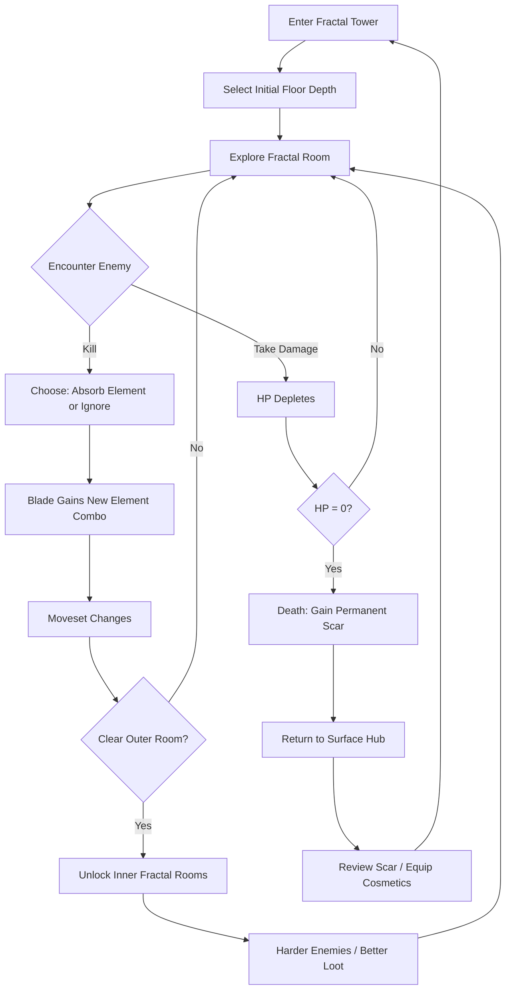
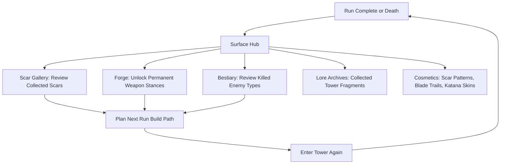

# Crimson Spellblade

**Genre:** Roguelite / Action / Shooter
**Platform:** PC (Steam), PlayStation 5, Xbox Series X|S
**Rating:** Mature (Blood and Gore, Intense Violence)
**Price:** Premium $24.99

---

## Vision Statement

Crimson Spellblade is a roguelite action game where every kill rewires your weapon. You descend an inverted fractal tower -- a structure that contains smaller copies of itself at every scale -- wielding a crimson katana that absorbs the elemental properties of every enemy you slay. The game targets players who want flow-state combat that never repeats: no two runs share the same moveset, the same room layout, or the same path to the exit. Permanent scars from each death make the next run feel different without making it easier. The game rewards mechanical mastery, creative build expression, and pattern recognition in equal measure.

**Unique selling points:**
1. The blade itself is your build -- 300+ elemental pairings recombine every run
2. Fractal dungeon geometry creates infinite depth within a finite structure
3. Death-as-a-resource design where scars reshape play without inflating stats
4. Mimic-everything tension where any object in the tower can be hostile

---

## Core Loop

| Phase | Duration | Player Action | Reward |
|-------|----------|---------------|--------|
| Descent entry | 1 min | Select depth tier, review scars | Challenge calibration |
| Room combat | 3-5 min | Clear outer fractal room, kill enemies | Element absorption offers |
| Inner recursion | 2-4 min | Enter nested room copies for harder fights | Rare elements, lore fragments |
| Blade synthesis | Ongoing | Combine absorbed elements into combos | New moveset (slash, projectile, AoE, buff) |
| Boss floor | 5-8 min | Fight floor guardian every 10 floors | Unique scar pattern, guaranteed rare element |
| Death | 30 sec | Watch scar formation animation | 1 permanent passive scar (random from pool) |

---

## Meta Loop

| Meta System | Unlock Condition | Effect |
|-------------|-----------------|--------|
| Scars (passive) | Die during a run | Permanent minor passive: faster dodge, wider slash arc, extended element duration (+5-12%) |
| Weapon stances | Reach floor 10/30/50/70/90 with that element active | Persistent combat style option for run start |
| Bestiary entries | Kill 1/10/50 of a species | Enemy weakness hints, mimic tell guides |
| Lore fragments | Clear inner fractal rooms | World-building text, unlocks tower origin cutscene at 100% |
| Cosmetic scar patterns | Boss kills, achievement milestones | Visual-only overlays on character model |
| Blade trails | Crafted from duplicate element absorptions | Visual-only effects on katana swing arcs |
| Depth monuments | First player to reach a new depth tier (async) | Name engraved in tower entrance hall |

---

## Game Mechanics

### Elemental Absorption Blade

The katana has 5 element slots. Each enemy killed offers its element for absorption. You choose to absorb or discard. Absorbing replaces the oldest element if all 5 slots are full.

**Base elements (6):**

| Element | Source Enemy | Primary Effect | Secondary Effect |
|---------|-------------|----------------|------------------|
| Fire | Ash Crawler, Magma Tick | Burning DoT (3s, 8 dmg/s) | Ignites flammable environment objects |
| Water | Tide Wraith, Pressure Slug | High-pressure jet (15m range) | Drenches enemies, doubles lightning damage |
| Lightning | Spark Drake, Storm Hare | Chain lightning (3 targets, 20 dmg) | Stuns drenched enemies for 1.5s |
| Void | Null Shade, Rift Phantom | Miniature black hole on crit (2s pull) | Nullifies enemy projectiles in radius |
| Melody | Resonance Moth, Echo Siren | Rhythmic damage bonus (+40% on beat) | Pacifies beast-type enemies for 3s |
| Wonder | Prism Sprite, Miracle Bloom | Random high-damage burst (15% chance, 3x) | Creates light sources in dark rooms |

**Elemental pairings (15 unique combos, 6 self-stack, total 21 base combos):**

| Pairing | Combo Name | Effect | Synergy Type |
|---------|-----------|--------|-------------|
| Fire + Water | Steam Blade | AoE steam cloud (4m radius, 12 dmg/s, blinds enemies) | Offensive |
| Fire + Lightning | Plasma Arc | Continuous beam between slashes (18 dmg/s contact) | Offensive |
| Fire + Void | Singularity Brand | Marked enemies explode on death (40 dmg AoE) | Offensive |
| Fire + Melody | Pyro Rhythm | Beats ignite flame pillars that persist for 5s | Hybrid |
| Fire + Wonder | Chaos Flame | Random elemental burst on each strike | Offensive |
| Water + Lightning | Storm Surge | Each slash creates a 3m lightning puddle (2s duration) | Offensive |
| Water + Void | Abyssal Maw | Water jet pulls enemies toward void point | Control |
| Water + Melody | Tidal Crescendo | Combo builds wave size with consecutive beats | Offensive |
| Water + Wonder | Prismatic Spray | Rainbow cone attack hitting all elements simultaneously | Offensive |
| Lightning + Void | Thunder Rift | Lightning arcs through void portals, teleporting hits | Hybrid |
| Lightning + Melody | Thunder Beat | Stun pulse on every beat, 0.5s per beat | Control |
| Lightning + Wonder | Arc Lightning | Unpredictable bouncing bolts (6 targets, 22 dmg each) | Offensive |
| Void + Melody | Null Crescendo | Silences all enemy abilities in 6m radius for 2s on beat | Control |
| Void + Wonder | Event Horizon | Creates temporary constellation that deals random DoT | Hybrid |
| Melody + Wonder | Euphony Blade | Each strike generates a note; 5-note melody triggers 80 dmg burst | Offensive |
| Fire + Fire | Inferno Edge | Base fire damage doubled, 16 dmg/s DoT | Self-stack |
| Water + Water | Pressure Cannon | Jet becomes continuous beam, 10m range | Self-stack |
| Lightning + Lightning | Overcharge | Chain hits 6 targets instead of 3 | Self-stack |
| Void + Void | Gravity Well | Black hole persists 5s instead of 2s | Self-stack |
| Melody + Melody | Symphony | Beat window widens from 0.3s to 0.6s tolerance | Self-stack |
| Wonder + Wonder | Miracle Worker | Burst chance increases to 30%, damage to 4x | Self-stack |

**Triple combos (element + element + element):** 56 additional combinations. Triple combos are discovered through gameplay and recorded in the bestiary. Example: Fire + Water + Lightning = "Typhoon Engine" -- the blade becomes a rotating storm that deals all three element types in a 4m spinning vortex. Triple combos require 3 specific elements active simultaneously.

### Fractal Floor Generation

Each floor is a room containing 1-4 smaller copies of itself. The outer room must be cleared to unlock inner rooms. Inner rooms contain harder enemies with better element drops. Maximum recursion depth is 5 levels (room within room x5).

| Recursion Level | Enemy HP Multiplier | Enemy Speed Multiplier | Element Drop Rarity | Floor Appearance |
|----------------|--------------------|-----------------------|--------------------|-----------------| 
| 0 (outer) | 1.0x | 1.0x | Common | Full-scale architecture |
| 1 | 1.4x | 1.1x | Common + Uncommon (20%) | 60% scale, first distortion |
| 2 | 2.0x | 1.25x | Uncommon (50%) | 35% scale, geometry warping |
| 3 | 3.0x | 1.4x | Uncommon + Rare (30%) | 20% scale, gravity shifts |
| 4 | 4.5x | 1.6x | Rare (60%) | 12% scale, rooms overlap visually |
| 5 | 7.0x | 1.8x | Rare + Legendary (25%) | 7% scale, visual collapse |

### Scar Legacy System

Every death creates a permanent scar from a pool of 120 scars. Each scar provides a minor passive bonus. Multiple scars stack. By run 50, a character has approximately 35-50 scars.

| Scar Category | Example Scars | Bonus Range | Visual Effect |
|---------------|--------------|-------------|---------------|
| Mobility | Phantom Step, Gale Ankles | Dodge speed +5-8% | Shimmer on dodge trails |
| Offense | Serrated Edge, ember Wrist | Slash arc width +5-10% | Red glow on blade hand |
| Elemental | Flux Veins, Conductor Bones | Element duration +8-12% | Colored veins on arms |
| Survival | Iron Skin, Deep Breath | I-frame window +0.05-0.1s | Thickened skin texture |
| Perception | Third Eye, Mimic Sense | Mimic tells 10-15% more visible | Faint glow on forehead |

Scars are visible on the character model and accumulate into a unique visual history of every death the player has experienced.

### Mimic System

Any object in the tower can be a mimic. Mimics have subtle visual tells that become easier to read with experience and bestiary unlocks.

| Mimic Type | Visual Tell | Damage on Trigger | Mimic Tell Difficulty |
|-----------|-------------|-------------------|-----------------------|
| Chest Mimic | Lid seams are 2px too wide | 30 dmg + grab (2s) | Easy |
| Door Mimic | Frame is slightly asymmetric | 25 dmg + teleport to random room | Medium |
| Save Point Mimic | Crystal hums at wrong pitch (audio cue) | 40 dmg + stun 3s | Hard |
| Exit Mimic | Floor arrow points 3 degrees off true | 50 dmg + floor reset | Very Hard |
| NPC Ghost Mimic | Ghost moves against player movement | 35 dmg + element drain (lose 1 slot) | Expert |
| Floor Tile Mimic | Tile pattern has one extra motif | 20 dmg + trip (1s stun) | Medium |
| Wall Mimic | Brick pattern has impossible tessellation | 15 dmg per second in contact | Hard |

### Combat System

| Mechanic | Detail |
|----------|--------|
| Primary attack | Katana slash (5-hit combo chain, 12/14/16/18/25 dmg) |
| Secondary attack | Blade element discharge (varies by element, 2s cooldown) |
| Dodge | I-frame dodge roll (0.4s invincibility, 0.8s total animation) |
| Parry | Deflect window 0.2s, success stuns enemy 1.5s and refunds element discharge |
| Absorb | Hold button on kill to absorb element (1.5s vulnerable animation) |
| Surge | Activate all 5 elements simultaneously (45s cooldown, 8s duration, 2x all effects) |

---

## World Design

### The Fractal Tower

The tower is an inverted structure extending downward from a surface hub. It was built by a civilization that discovered recursion as a physical law rather than a mathematical concept. The deeper you go, the more the architecture folds into itself.

| Depth Range | Theme | Dominant Elements | Visual Style | Enemies |
|-------------|-------|-------------------|--------------|---------|
| Floors 1-10 | The Surface Ruins | Fire, Wonder | Crumbling stone, open sky visible, warm light | Ash Crawlers, Prism Sprites, basic Mimics |
| Floors 11-20 | The Crystal Corridors | Lightning, Melody | Refracting crystal walls, constant hum, prismatic light | Spark Drakes, Resonance Moths, Crystal Mimics |
| Floors 21-30 | The Flooded Stratum | Water, Void | Knee-deep water, bioluminescent algae, distorted reflections | Tide Wraiths, Null Shades, Water Mimics |
| Floors 31-40 | The Echoing Halls | Melody, Lightning | Vast concert halls, instruments embedded in walls, sonic waves | Echo Sirens, Storm Hares, Sound Mimics |
| Floors 41-50 | The Pressure Deep | Water, Fire | Boiling geysers, steam vents, claustrophobic tunnels | Pressure Slugs, Magma Ticks, Steam Mimics |
| Floors 51-60 | The Null Expanse | Void, Wonder | Empty white rooms, occasional color explosions, silence | Rift Phantoms, Miracle Blooms, Invisible Mimics |
| Floors 61-70 | The Convergence | All elements | Rooms shift between all themes, unstable geometry | Hybrid enemies, multi-element Mimics |
| Floors 71-80 | The Recursive Core | All elements, amplified | Rooms contain themselves at every scale, visual overload | Advanced hybrids, recursive Mimics |
| Floors 81-90 | The Descent into Madness | All elements, chaotic | Non-Euclidean geometry, rooms fold in impossible directions | Elite variants, Mimics of the player's own scars |
| Floors 91-99 | The True Bottom | All elements, pure | Minimalist void, single room, single enemy type, maximum difficulty | The Architect (final boss variant per run) |

### Hub: The Surface

A camp at the tower entrance. Contains:
- **Scar Gallery:** View all collected scars, plan builds
- **The Forge:** Unlock weapon stances, craft cosmetics from duplicate elements
- **Bestiary:** Enemy data, mimic tell guides, element combo recipes
- **Lore Archives:** Collected fragments, tower origin story
- **Depth Monuments:** Leaderboard engravings visible to all players (async)
- **Training Dummy:** Test current blade combos before descending

---

## Narrative

### Premise

You are the last Spellsword -- a warrior caste that once maintained the Fractal Tower. The tower was a containment engine built to trap a recursive anomaly called "The Fold." When the Spellsword order was destroyed from within, the Fold began expanding. You descend to reach the True Bottom and seal the Fold before it recursively consumes reality.

### Lore Structure

Lore is delivered through fragment pickups in inner fractal rooms. Collecting all 200 fragments unlocks the true ending.

| Fragment Set | Count | Theme | Unlocks |
|-------------|-------|-------|---------|
| The Builders | 30 | Civilization that constructed the tower | Tower origin cutscene |
| The Spellswords | 40 | History of the warrior order | Stance lore, combat philosophy |
| The Fold | 35 | Nature of the recursive anomaly | True ending requirement |
| The Mimic Queen | 25 | Origin of mimics in the tower | Mimic tell enhancement scar |
| The Scarred One | 30 | The previous spellsword who descended | Secret boss encounter |
| The Architect | 40 | The entity at the bottom of the tower | Final boss phase 2 dialogue |

### Characters

| Character | Role | Location | Purpose |
|-----------|------|----------|---------|
| The Spellsword (player) | Protagonist | Surface Hub / descending | Seal the Fold |
| The Forge Master | NPC, mentor | Surface Hub | Unlocks stances, provides weapon lore |
| The Scarred One | Ghost NPC | Appears on death floors 30+ | Hints, lore fragments, guilt theme |
| The Mimic Queen | Antagonist, sub-boss | Floors 50, 70, 90 | Controls mimics, blocks progression |
| The Architect | Final boss | Floor 99 | Created the Fold, maintains the recursion |
| Player Ghosts | Async multiplayer | Random floors | Recorded runs of other players, can be mimics |

---

## Player Personas

| P-ID | Name | Archetype | Relevance to Crimson Spellblade |
|------|------|-----------|-------------------------------|
| P-001 | Alex Rivera | The Ranked Grinder | Core audience -- competitive depth runs, depth monuments, skill-based combat with dodge/parry mastery |
| P-003 | Hiroshi Tanaka | The RPG Addict | System mastery -- 300+ element combos, bestiary completion, theorycrafting optimal builds |
| P-008 | David Park | The Achievement Hunter | Completionist -- 200 lore fragments, 120 scars, 56 triple combos, full bestiary |
| P-009 | Liam O'Connor | The Dedicated F2P | Premium model eliminates P2W concern entirely; scar system rewards persistence over spending |
| P-010 | Kevin Nguyen | The Competitive Whale | Challenge runs, speedrun depth monuments, competitive self-imposed constraints |

### Persona-Feature Mapping

| Feature | P-001 | P-003 | P-008 | P-009 | P-010 |
|---------|-------|-------|-------|-------|-------|
| Depth monuments (leaderboard) | High | Low | Low | High | High |
| Element combo theorycrafting | Medium | High | High | High | Medium |
| Scar collection completion | Low | High | High | Medium | Low |
| Mimic tell mastery | High | Medium | Medium | High | High |
| Fractal recursion challenge | High | Medium | Low | High | High |
| Speedrun/true descent | High | Low | Low | High | High |

---

## User Stories

### Combat and Core Loop (US-001 to US-007)

| ID | Story | Acceptance Criteria | Priority |
|----|-------|-------------------|----------|
| US-001 | As a player, I slash my katana in a 5-hit combo chain so that I have a rhythmic combat baseline | Pressing attack 5 times executes hits dealing 12/14/16/18/25 damage with 0.4s between inputs; combo resets after 1.2s of no input | P0 |
| US-002 | As a player, I absorb an enemy element on kill so that my blade gains new properties | Holding absorb within 2m of a fresh kill triggers 1.5s animation; element appears in next empty slot or replaces oldest; blade visual updates within 0.3s | P0 |
| US-003 | As a player, I dodge-roll through enemy attacks so that I avoid damage | Pressing dodge during any state triggers 0.4s invincibility roll; 0.8s total animation; 0.3s cooldown between rolls | P0 |
| US-004 | As a player, I parry enemy attacks so that I stun them and refund my element discharge | Pressing parry within 0.2s window of enemy attack telegraph deflects; enemy stunned 1.5s; element discharge cooldown reset to 0 | P0 |
| US-005 | As a player, I activate Surge to unleash all 5 elements simultaneously | Pressing Surge with 5 elements active triggers 8s buff; all element effects at 2x; 45s cooldown; screen-wide visual flash | P1 |
| US-006 | As a player, I discharge my blade element as a ranged attack so that I can fight at distance | Pressing secondary fires element projectile or cone (varies by element); 2s cooldown; deals 20-35 damage based on element | P0 |
| US-007 | As a player, I see my current 5 element slots on the HUD so that I can plan my build | HUD shows 5 slots top-center; empty slots are hollow; filled slots show element icon and combo name below | P0 |

### Elemental System (US-008 to US-014)

| ID | Story | Acceptance Criteria | Priority |
|----|-------|-------------------|----------|
| US-008 | As a player, I combine Fire + Water to create a Steam Blade so that I deal AoE damage | With Fire and Water active simultaneously, blade emits 4m steam cloud dealing 12 dmg/s for 3s on each slash | P0 |
| US-009 | As a player, I combine Melody + any element to create beat-synchronized attacks so that combat becomes rhythmic | Melody combo activates a visible beat marker; attacks on beat gain +40% damage; beat window is 0.3s (0.6s with self-stack) | P0 |
| US-010 | As a player, I discover triple combos by experimenting so that I find hidden powerful builds | Equipping 3 specific elements unlocks a named triple combo; combo name flashes on screen; effect is 1.5x stronger than best dual combo of those elements | P1 |
| US-011 | As a player, I discard an offered element after a kill so that I keep my current build intact | On kill, element offer appears for 3s; pressing discard closes offer without changing slots; pressing absorb triggers swap | P0 |
| US-012 | As a player, I see combo recipes in the bestiary after first discovery so that I can recreate builds | Bestiary entry shows combo name, required elements, and effect description after first activation; locked entries show "???" | P1 |
| US-013 | As a player, I self-stack an element by absorbing duplicates so that I amplify that element's power | Absorbing same element as an existing slot doubles that element's base effect (damage, duration, or range); replaces oldest slot as normal | P1 |
| US-014 | As a player, I see my current active combo effects listed so that I understand what my blade does | Pause menu shows all active pairings with effect descriptions and remaining duration for temporary buffs | P1 |

### Fractal Dungeon (US-015 to US-019)

| ID | Story | Acceptance Criteria | Priority |
|----|-------|-------------------|----------|
| US-015 | As a player, I clear an outer fractal room to unlock inner rooms so that I access harder content | Killing all enemies in outer room triggers visual unlock of 1-4 inner doorways; inner rooms are smaller copies at 60% scale | P0 |
| US-016 | As a player, I descend to deeper recursion levels within a floor so that I find rarer elements | Each recursion level increases enemy HP by listed multiplier and element rarity by listed percentage; room scale decreases per table | P0 |
| US-017 | As a player, I reach a boss floor every 10 floors so that I fight a guardian for unique rewards | Floors 10/20/30/40/50/60/70/80/90 contain boss encounters; bosses drop unique scar patterns and guaranteed rare element | P0 |
| US-018 | As a player, I see the fractal geometry shift as I move so that the tower feels alive | Room architecture distorts visually based on dominant element; Fire rooms crack and glow, Void rooms stretch, Water rooms reflect | P1 |
| US-019 | As a player, I navigate rooms with shifting gravity at recursion level 3+ so that spatial awareness becomes a challenge | Rooms at recursion 3+ alter gravity direction based on dominant element; Void reverses gravity, Lightning randomizes on entry | P2 |

### Mimic System (US-020 to US-023)

| ID | Story | Acceptance Criteria | Priority |
|----|-------|-------------------|----------|
| US-020 | As a player, I identify a chest mimic by visual tells so that I avoid its grab attack | Chest mimic has 2px wider lid seams than real chests; attacking it triggers mimic form; real chests do not trigger on attack | P0 |
| US-021 | As a player, I encounter an exit mimic that resets my floor progress so that I learn to verify exits | Exit mimic has floor arrow pointing 3 degrees off; triggering it deals 50 damage and resets current floor to entry | P1 |
| US-022 | As a player, I encounter an NPC ghost mimic that steals an element slot so that I learn not to trust everything | Ghost mimic moves against player movement; triggering it deals 35 damage and drains 1 random element slot; real ghosts move with player | P1 |
| US-023 | As a player, I unlock mimic tell enhancements in the bestiary so that tells become easier to spot | Killing 10/50 of a mimic type increases tell visibility by 10%/15% as listed in scar system; enhanced tells glow subtly | P1 |

### Scar and Meta Progression (US-024 to US-029)

| ID | Story | Acceptance Criteria | Priority |
|----|-------|-------------------|----------|
| US-024 | As a player, I die and gain a permanent scar so that my next run plays differently | On death, scar selection screen shows 1 random scar from pool; scar applies permanent passive bonus; character model updates within 2s | P0 |
| US-025 | As a player, I view my collected scars in the gallery so that I can plan my build approach | Scar gallery shows all collected scars with stat bonuses; sorted by category; total bonuses summarized at bottom | P0 |
| US-026 | As a player, I unlock a weapon stance after reaching certain floors so that I have new run-start options | Reaching floor 10/30/50/70/90 with a specific element active unlocks a stance; stances modify starting combo at run begin | P1 |
| US-027 | As a player, I see my scars physically on my character so that my journey is visually told | Each scar adds a visible mark to the character model; scars layer and combine into unique patterns; 50 scars creates a distinct appearance | P1 |
| US-028 | As a player, I collect lore fragments in inner rooms so that I learn the tower's history | Inner fractal rooms contain glowing lore pickups; collecting adds to archives; 200 total fragments; 100% unlocks origin cutscene | P2 |
| US-029 | As a player, I see depth monuments from other players so that I feel part of a community | Tower entrance hall displays top 10 depth records per tier; first player to reach each new tier gets permanent monument; data fetched async | P2 |

### Monetization and Cosmetics (US-030 to US-033)

| ID | Story | Acceptance Criteria | Priority |
|----|-------|-------------------|----------|
| US-030 | As a player, I purchase cosmetic blade trail effects so that my katana looks unique | Blade trails are visual-only; purchased from surface hub store using premium currency or crafted from duplicate elements; no gameplay effect | P2 |
| US-031 | As a player, I equip cosmetic scar pattern overlays so that my death marks look intentional | Cosmetic scars overlay on top of gameplay scars; purely visual; do not affect scar count or passive bonuses | P2 |
| US-032 | As a player, I receive free content season updates so that the game stays fresh | Every 8 weeks: new enemy type, 2 new element combos, 1 new boss, 10 new lore fragments; no paid season pass required | P2 |
| US-033 | As a player, I buy alternate katana skins so that my weapon has a different silhouette | Katana skins change weapon model and sheath animation only; no hitbox or damage changes; available in store and as boss drops | P2 |

---

## Monetization

### Model: Premium + Cosmetic DLC

| Revenue Stream | Price | Content | Target Persona |
|---------------|-------|---------|---------------|
| Base game | $24.99 | Full game, all content, all future seasons free | All |
| Crimson Cosmetics Pack | $7.99 | 5 blade trails, 3 scar overlays, 1 katana skin | P-003, P-010 |
| Void Architect Pack | $12.99 | 10 blade trails, 6 scar overlays, 3 katana skins, exclusive Forge diorama | P-010 |
| Soundtrack | $9.99 | Full OST, 35 tracks | P-003, P-008 |
| Art Book (digital) | $14.99 | 200-page PDF, concept art, enemy designs, tower blueprints | P-008 |

### Season Content (Free, Every 8 Weeks)

| Season | New Content | Duration to Produce |
|--------|------------|-------------------|
| Season 1 | Frost element (new base element + 5 pairings + 2 triple combos), 1 boss, 10 lore fragments | 6 weeks |
| Season 2 | New depth tier (floors 100-110), new stratum theme, 1 boss | 8 weeks |
| Season 3 | New mimic type (Weapon Rack Mimic), 2 new element combos, new cosmetic set | 5 weeks |

### Revenue Projections (Year 1)

| Metric | Conservative | Moderate | Optimistic |
|--------|-------------|----------|------------|
| Units sold (Year 1) | 28,000 | 65,000 | 140,000 |
| Gross revenue (base game) | $699,720 | $1,624,350 | $3,498,600 |
| DLC attach rate | 8% | 15% | 25% |
| DLC revenue | $67,170 | $146,194 | $349,860 |
| Total Year 1 revenue | $766,890 | $1,770,544 | $3,848,460 |
| Platform cut (30%) | -$230,067 | -$531,163 | -$1,154,538 |
| Net revenue | $536,823 | $1,239,381 | $2,693,922 |

---

## Production Plan

### Team (Core: 9 people)

| Role | Count | Responsibility |
|------|-------|---------------|
| Creative Director | 1 | Vision, combat feel, fractal design |
| Lead Programmer | 1 | Architecture, fractal generation, combat systems |
| Gameplay Programmer | 2 | Element system, mimic AI, scar system |
| Technical Artist | 1 | Shader effects, fractal rendering, element VFX |
| Environment Artist | 1 | Tower strata, hub, fractal room sets |
| Character Artist | 1 | Spellsword, enemies, bosses, scar models |
| Composer / Sound Designer | 1 | OST, combat audio, mimic tells (audio cues) |
| QA / Community | 1 | Testing, balance, community management |

### Milestones

| Phase | Duration | Deliverable | Team Size |
|-------|----------|-------------|-----------|
| Prototype | Months 1-3 | Core combat loop, 2 elements, 1 fractal room type, basic mimic | 4 |
| Vertical Slice | Months 4-7 | Full combat system, all 6 elements, 15 pairings, 3 strata, scar system | 7 |
| Alpha | Months 8-14 | All 99 floors, all enemies, full mimic system, meta progression, hub | 9 |
| Beta / Balance | Months 15-18 | Full balance pass, all 56 triple combos, all 120 scars, lore complete | 9 |
| Polish | Months 19-21 | VFX polish, sound pass, accessibility, localization (EN, JA, KO, ZH, DE, FR, ES, PT) | 9 |
| Launch | Month 22 | Steam, PS5, Xbox Series X/S simultaneous release | 9 |
| Live Season 1 | Month 24 | Frost element, new boss, 10 lore fragments | 6 |

### Budget Estimate

| Category | Cost |
|----------|------|
| Salaries (9 people x 22 months) | $1,782,000 |
| Software / Engine licenses | $18,000 |
| Hardware (dev kits, test machines) | $24,000 |
| QA outsourcing (3 months) | $45,000 |
| Marketing (pre-launch + launch) | $120,000 |
| Localization (8 languages) | $36,000 |
| Audio outsourcing ( Foley, mastering) | $15,000 |
| Contingency (10%) | $204,000 |
| **Total** | **$2,244,000** |

### Break-Even Analysis

At $2,244,000 total budget with $17.49 net per unit ($24.99 minus 30% platform cut): **128,074 units** to break even on base game alone. Including DLC attach at moderate rates: break-even at approximately **100,000 units**.

---

## Technical Requirements

### Engine and Platforms

| Component | Choice | Rationale |
|-----------|--------|-----------|
| Game engine | Unreal Engine 5.4 | Nanite/Lumen for fractal geometry rendering, robust particle systems for element VFX |
| Physics | Chaos Physics (built-in) | Destructible fractal rooms, ragdoll on kill, element projectile simulation |
| Audio | Wwise | Dynamic music system for Melody element beat sync, 3D spatial audio for mimic tells |
| Networking | REST API (async only) | Leaderboards, ghost uploads, depth monuments -- no real-time multiplayer |
| Build pipeline | CI/CD via GitHub Actions | Automated builds for PC/PS5/Xbox, platform compliance checks |

### Minimum System Requirements

| Spec | Requirement |
|------|-------------|
| OS | Windows 10 64-bit |
| Processor | Intel i5-8600 / AMD Ryzen 5 3600 |
| Memory | 8 GB RAM |
| Graphics | NVIDIA GTX 1070 / AMD RX 580 |
| Storage | 18 GB SSD |
| DirectX | Version 12 |

### Recommended System Requirements

| Spec | Requirement |
|------|-------------|
| OS | Windows 11 64-bit |
| Processor | Intel i7-12700K / AMD Ryzen 7 5800X3D |
| Memory | 16 GB RAM |
| Graphics | NVIDIA RTX 3080 / AMD RX 6800 XT |
| Storage | 18 GB SSD |
| DirectX | Version 12 |

### Console Targets

| Console | Target Resolution | Target Frame Rate | Notes |
|---------|------------------|-------------------|-------|
| PlayStation 5 | 1440p (dynamic 4K) | 60 fps (120 fps performance mode) | DualSense haptics for element absorption |
| Xbox Series X | 1440p (dynamic 4K) | 60 fps (120 fps performance mode) | Quick Resume supported |
| Xbox Series S | 1080p | 60 fps | Reduced particle density for element VFX |

### Performance Budgets

| System | Budget | Measurement |
|--------|--------|-------------|
| Frame time | < 16.67ms (60 fps) | GPU + CPU combined per frame |
| Fractal room generation | < 200ms | Time from room entry to playable state |
| Element swap VFX | < 100ms | Blade visual update on absorption |
| Scar application | < 500ms | Character model update on death screen |
| Memory (in-game) | < 6 GB VRAM, < 10 GB system RAM | Peak usage during boss rooms with 5 active elements |
| Save file size | < 2 MB | Local save including all scar/bestiary/lore data |
| Leaderboard query | < 2s | Async fetch for depth monuments |

### Accessibility

| Feature | Implementation |
|---------|---------------|
| Difficulty modes | Story (1.5x I-frames, 0.5x enemy damage) / Standard / Hardcore (permadeath, no scar saves) |
| Colorblind modes | Protanopia, Deuteranopia, Tritanopia -- element colors remapped to distinct patterns + shapes |
| Subtitle system | Full subtitles for all audio cues (critical for Melody mimic tells); adjustable size |
| Input remapping | Full keyboard/mouse and controller remapping; multiple control scheme presets |
| Text-to-speech | All lore fragments and menu text readable by screen readers (PC only) |
| Reduced motion | Option to disable fractal geometry warping, simplify element VFX, disable screen shake |

### Data Persistence

| Data Type | Storage | Sync |
|-----------|---------|------|
| Save progress | Local + Steam Cloud / PlayStation Plus / Xbox Cloud | Auto-sync on run end |
| Leaderboards | Remote server | Async, 30s poll |
| Ghost data | Local recording, upload on death or run end | Upload to server, download for other players |
| Scar state | Embedded in save file | Synced with save |
| Settings | Local config file | Not synced |
