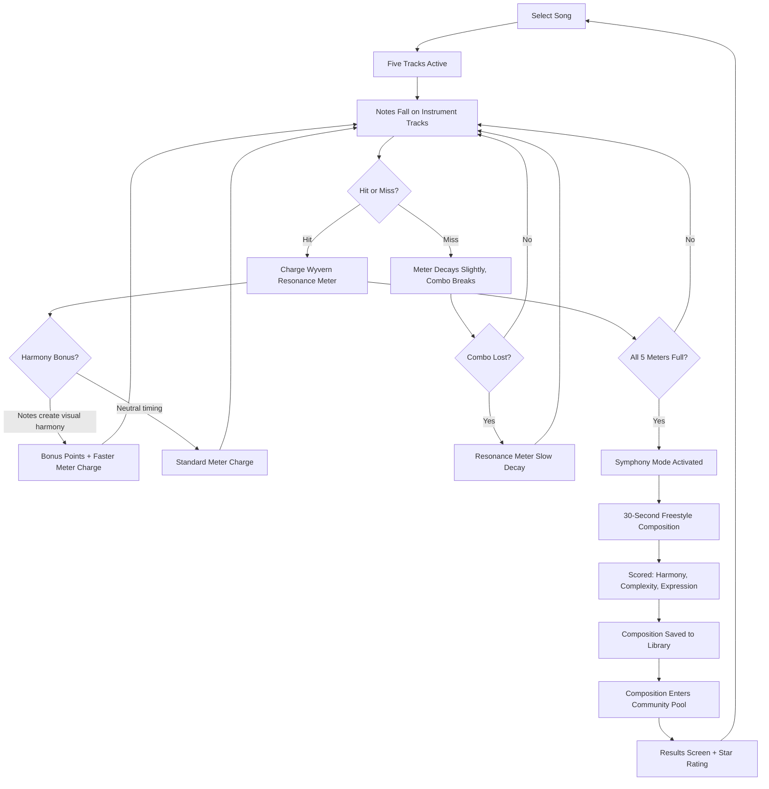
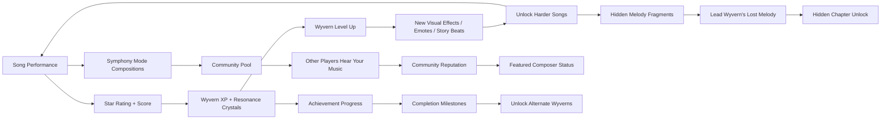

# Crystal Wyvern Symphony

**Rhythm Action / Music Creation**

---

## Title & Genre

| Field | Value |
|-------|-------|
| **Title** | Crystal Wyvern Symphony |
| **Genre** | Rhythm Action / Music Creation |
| **Engine** | Unity (URP) -- strong multi-platform support, Audio DSP graph, shader graph for crystal resonance visuals |
| **Platform** | PC (Steam/Epic), Nintendo Switch, PlayStation 5, Mobile (iOS/Android) |
| **Monetization** | Premium -- $29.99 base, song pack DLC at $7.99 per 10-song pack |
| **Rating** | ESRB E (Everyone) / PEGI 3 / CERO A -- Mild Fantasy Themes |

---

## Vision Statement

Crystal Wyvern Symphony is a rhythm action game where you conduct an orchestra of five crystal wyverns, each embodying an instrument family -- strings, brass, percussion, woodwinds, and voice. Notes cascade down five parallel tracks. Every hit charges that wyvern's crystal resonance meter. When all five meters are full, you trigger Symphony Mode: a 30-second freestyle composition section where you weave a melody from accumulated energy. That composition is scored on harmony, complexity, and emotional expression, and it becomes a permanent addition to the game's soundtrack for future playthroughs by you and by other players.

The game sits at the intersection of precision rhythm action (Osu!, Guitar Hero) and creative music composition (Electroplankton, Beatoraja). The resonance physics system makes harmony and dissonance visually legible -- crystal wyverns glow in instrument-specific colors, waveforms emanate and crash into each other, constructive interference patterns look like living stained glass. The Composer's Legacy system means the soundtrack grows with its community. Each wyvern has a personality and backstory that unfolds through the songs they perform. The lead wyvern (voice track) is searching for a lost melody that, when played correctly in Symphony Mode, reveals a hidden chapter.

This is a game about the discipline of performance rewarded by the freedom of creation. You earn your solo through accuracy, and your solo becomes part of everyone else's world.

---

## Core Loop

**Target session length:** 20-45 minutes (2-4 songs)

### Core Loop Breakdown

| Step | Player Action | System Response | Skill Expression |
|------|--------------|----------------|-----------------|
| 1. Track Reading | Watch five simultaneous note lanes (strings, brass, percussion, woodwinds, voice) | Notes fall at tempo-determined speed; color-coded by instrument | Lane-switching speed, peripheral vision, anticipation |
| 2. Note Execution | Tap/press the correct input as notes cross the hit line | Perfect (within 33ms) = full charge + 10% bonus; Good (within 80ms) = full charge; Miss = 0 charge, combo break | Timing precision, rhythmic consistency |
| 3. Resonance Charging | Each successful note fills that wyvern's resonance meter (0-100%) | Meter fills at ~3% per Perfect hit, ~2% per Good hit. Five meters (one per instrument) | Sustained accuracy across all five tracks |
| 4. Harmony Detection | Hit notes on multiple tracks simultaneously or in musically consonant intervals | System calculates interval quality. Consonant intervals (octave, fifth, third) trigger constructive interference visuals and award 15-25% meter bonus | Musical intuition, understanding of intervals (system teaches this implicitly) |
| 5. Symphony Trigger | All five meters reach 100% simultaneously | Screen transitions to Symphony Mode. Background music shifts to a sustained chord. Five wyverns circle the screen. 30-second timer starts | Mastery of sustained accuracy across all tracks |
| 6. Freestyle Composition | Tap any combination of five tracks freely. Hold notes for sustain. Vary rhythm and density | System records your performance as a MIDI-like composition. Real-time feedback shows harmony/dissonance waveforms | Musical creativity, expression, risk-taking within musical constraints |
| 7. Composition Scoring | Freestyle ends at 30 seconds | Scored on Harmony (consonant intervals used, 0-40 pts), Complexity (note density, rhythmic variation, 0-30 pts), Expression (dynamic range, emotional contour, 0-30 pts). Max 100 | Composition quality under time pressure |
| 8. Legacy Integration | Composition is saved to your library | Composition enters the shared community pool. Other players may hear your composition as background music during their playthroughs, attributed to your username | Creative contribution to the game world |

---

## Meta Loop

### Session-to-Session Progression

### Progression Axes

| Axis | What Grows | How It Feels | Cap |
|------|-----------|-------------|-----|
| **Player Skill** | Timing precision, multi-track reading, harmony recognition | Notes that felt impossible become instinct. Five tracks stop feeling overwhelming and start feeling like conducting. | No cap -- mastery is perpetual, ranked leaderboards |
| **Wyvern Bond** | Each wyvern levels up through successful performances, unlocking new visual resonance effects, story beats, and emote animations | Your wyverns become yours -- they glow brighter, their resonance patterns become more elaborate, they react to your playing | Level 50 per wyvern (5 wyverns = 250 total levels) |
| **Song Library** | Complete songs at 3+ stars to unlock higher difficulty tiers; earn Resonance Crystals to purchase song packs | The library grows with your skill. Easy songs teach mechanics, hard songs test mastery, DLC songs expand the repertoire | 60 base songs + DLC song packs |
| **Composer Legacy** | Freestyle compositions rated by other players; featured compositions displayed in the Concert Hall | Your creative voice enters the game. Other players hear your work. You build a portfolio within the game world | No cap -- ongoing community contribution |
| **Story Progression** | Complete specific song sequences and collect Melody Fragments to unlock the Lead Wyvern's backstory and the Hidden Chapter | Each wyvern's personality emerges through their instrument's role in songs. The voice wyvern's search for the Lost Melody drives narrative discovery | 1 hidden chapter (post-game), 5 wyvern backstories, 12 Melody Fragments |
| **Achievement Completion** | Performance achievements, composition achievements, exploration achievements, community achievements | Clear, trackable goals across every system. No RNG, no time-gating, all skill/exploration-based | 74 achievements across 6 categories |

---

## Game Mechanics

### Primary Mechanic: Five-Track Rhythm System

Five crystal wyverns are arranged on screen, each representing an instrument family. Notes fall on five parallel lanes. The player uses five inputs (keys/buttons mapped to each lane) to hit notes as they cross the hit line at the bottom of the screen.

**Note Types:**

| Note Type | Visual | Input | Effect |
|-----------|--------|-------|--------|
| Standard | Glowing crystal shard | Tap | +3% resonance (Perfect), +2% (Good) |
| Hold | Elongated crystal beam | Hold for duration | +3% initial + 0.5% per beat held |
| Slide | Connected crystals arcing between lanes | Swipe from lane to lane | +4% resonance; tests lane-switching |
| Chord | Cluster of 2-3 simultaneous notes | Multi-tap | Charges multiple meters simultaneously; high harmony potential |
| Wild | Shimmering prismatic note | Any input | +5% resonance to whichever meter needs it most; catch-up mechanic |

**Timing Windows (at 1x speed):**

| Rating | Window | Resonance | Score Multiplier |
|--------|--------|-----------|-----------------|
| Perfect | +/- 33ms | Full | 1.5x |
| Good | +/- 80ms | Standard | 1.0x |
| OK | +/- 120ms | Reduced (1%) | 0.5x |
| Miss | Outside 120ms | 0, combo break | 0x |

**Speed Tiers:**

| Difficulty | Note Speed | Notes Per Minute (avg) | Symphony Trigger Frequency |
|-----------|-----------|----------------------|--------------------------|
| Beginner | 200 px/s | 120 | Every 90 seconds |
| Standard | 320 px/s | 200 | Every 60 seconds |
| Advanced | 450 px/s | 300 | Every 45 seconds |
| Virtuoso | 600 px/s | 420 | Every 35 seconds |
| Maestro | 750 px/s | 550 | Every 25 seconds |

### Secondary Mechanic: Resonance Physics

Each wyvern's crystal body resonates at the frequency of the instrument it represents. Visual waveforms emanate from each wyvern in real-time during play.

**Waveform Rules:**
- Each instrument track produces a sine wave visualization at the note's musical frequency
- When two or more wyverns produce notes simultaneously, their waves visually overlap
- Constructive interference (consonant intervals: unison, octave, perfect fifth, major/minor third) creates amplified visual waves with prismatic color blending and awards a Harmony Bonus of +15-25% extra resonance to both tracks
- Destructive interference (dissonant intervals: tritone, minor second, major seventh) creates visual cancellation patterns -- the waves dim and flatten -- and awards no bonus but does not penalize

**Interval Bonus Table:**

| Interval | Semitones | Bonus | Visual |
|----------|-----------|-------|--------|
| Unison | 0 | +25% | Complete wave reinforcement, blinding light |
| Octave | 12 | +20% | Nested waves, shimmer effect |
| Perfect Fifth | 7 | +18% | Strong reinforcement, warm glow |
| Major Third | 4 | +15% | Warm color blend, gentle pulse |
| Minor Third | 3 | +12% | Cool color blend, subtle pulse |
| Perfect Fourth | 5 | +10% | Stable reinforcement, clear light |
| Tritone | 6 | 0% | Visual cancellation, dim flicker |
| Others | varied | 0% | No interaction, independent waves |

This system teaches music theory implicitly. Players learn which note combinations produce the prettiest visuals and highest scores without needing to know interval names.

### Tertiary Mechanic: Emotional Modifiers

The song selection system reads your biometric play patterns (timing consistency, combo frequency, accuracy trending) and introduces emotional modifiers to songs.

**How It Works:**
- The system tracks your "emotional signature" across the last 5 songs played
- Songs can transition between emotional states mid-track: Joyful to Melancholic, Serene to Turbulent, Playful to Somber, etc.
- Emotional shifts change the visual palette (warm golds shift to cool blues), tempo (subtle +/- 5% variation), and note patterns (longer holds for melancholy, rapid taps for turbulence)
- The Lead Wyvern's vocalizations change timbre to match the emotional state

**Emotional States:**

| State | Visual Palette | Tempo Shift | Note Pattern Change |
|-------|---------------|-------------|-------------------|
| Joyful | Warm gold, bright sparkles | +2% | More chords, longer sustains |
| Serene | Soft blue-green, gentle waves | -3% | Slower density, more holds |
| Melancholic | Deep indigo, slow rain particles | -5% | Sparse notes, emphasis on voice track |
| Turbulent | Red-orange, lightning flashes | +5% | Rapid single notes, cross-lane slides |
| Playful | Rainbow shimmer, bouncing particles | +3% | Syncopated rhythms, wild notes |
| Somber | Grey-silver, slow fog | -4% | Long sustains with rests between |

**Transition Trigger:** After every 16-beat phrase, the system evaluates the player's current accuracy trend. If accuracy is above 85%, the next phrase may introduce a shift toward a more demanding emotional state. If accuracy drops below 65%, the system may shift toward a more forgiving state. Shifts happen gradually over 4 beats, never abruptly.

### Quaternary Mechanic: Symphony Mode

When all five resonance meters reach 100%, Symphony Mode activates.

**Symphony Mode Flow:**
1. Screen transitions: normal play view fades to a concert stage view. Five wyverns arrange in a circle around the player's cursor.
2. Timer: 30 seconds displayed prominently.
3. Input: The player freely taps any combination of the five lanes. There are no "wrong" notes -- every input produces sound.
4. Real-time feedback: Resonance physics are amplified. Every note combination produces visible interference patterns. Harmonious combinations create spectacular visual effects (cascading light, expanding mandalas, wyvern flight animations).
5. Recording: The system records the player's performance as a timestamped MIDI event sequence (note on/off, lane, velocity/timing).
6. Scoring (after 30 seconds):
   - **Harmony (0-40 pts):** Percentage of time spent in consonant intervals. 80%+ consonance = 36-40 pts.
   - **Complexity (0-30 pts):** Note density variance, rhythmic variation, use of all five tracks. Balanced use of all five = max.
   - **Expression (0-30 pts):** Dynamic range (loud/soft contrast), emotional contour (does the piece have an arc?), use of silence/rest.
7. Total score 80+ = "Masterwork" rating. 60-79 = "Beautiful." 40-59 = "Charming." Below 40 = "Experiment."

**Composition Export:**
- Saved to player's Composition Library (up to 100 compositions)
- Entered into the Community Pool with player attribution
- Other players encounter community compositions as ambient background music during menu screens and story sequences
- Monthly "Featured Composer" spotlight in the Concert Hall (in-game social space)

### Hidden Mechanic: The Lost Melody

The Lead Wyvern (Voice track) is searching for a specific melody. Across the game's song library, 12 Melody Fragments are hidden. Each fragment is a specific 4-note sequence that appears in a song's chart but is not indicated -- the player must notice the recurring motif.

- When a fragment is played accurately, the Lead Wyvern reacts with a unique animation (a brief memory flash)
- Collecting all 12 fragments and performing them in the correct order during Symphony Mode triggers the Hidden Chapter
- The Hidden Chapter is a 15-minute narrative sequence revealing the Lead Wyvern's origin story and the connection between all five wyverns
- The correct order is hinted at through the visual motifs in each wyvern's backstory sequences

---

## World Design

### Setting: The Resonance Sanctum

The game takes place in a crystalline cathedral carved from a single massive geode. The Sanctum is divided into five chambers, each attuned to one wyvern's instrument family. Light refracts through crystal formations that respond to the music being played.

**Five Chambers:**

| Chamber | Instrument | Visual Theme | Crystal Color | Ambient Sound |
|---------|-----------|-------------|--------------|--------------|
| The String Atrium | Strings (violin, cello, harp) | Delicate spires like frozen rain, thread-thin crystal strands vibrating | Pale gold and amber | Soft sustained hum |
| The Brass Colonnade | Brass (trumpet, trombone, French horn) | Bold geometric pillars, angular crystal formations, warm metallic reflections | Deep copper and bronze | Low resonant buzz |
| The Percussion Terrace | Percussion (timpani, snare, cymbals) | Stepped crystalline platforms, shattered crystal shards on the floor, rhythmic echoes | Silver-white and slate | Distant heartbeat |
| The Woodwind Grotto | Woodwinds (flute, clarinet, oboe) | Organic curved formations, wind-carved tunnels, floating crystal dust | Teal and seafoam | Whispers and breath |
| The Voice Sanctum | Voice (lead wyvern's song) | Central dome, all colors converge here, massive crystal heart at center pulsing with light | Prismatic (all colors) | Silence that anticipates music |

### Visual Language

**Crystal Wyvern Designs:**

| Wyvern | Name | Color | Size | Personality |
|--------|------|-------|------|------------|
| Strings | Aria | Pale gold with amber facets | Medium, elegant, long tail | Refined, perfectionist, speaks in measured phrases |
| Brass | Forte | Copper-bronze with metallic sheen | Largest, broad wings, deep chest | Boisterous, encouraging, loves loud moments |
| Percussion | Cadence | Silver-white with dark cracks | Compact, angular, powerful legs | Energetic, impatient, communicates through rhythm |
| Woodwinds | Zephyr | Teal-green with translucent wings | Smallest, delicate, always moving | Shy, poetic, speaks in metaphors about wind |
| Voice | Melody | Prismatic, all colors shifting | Medium, most expressive face, glowing throat | Searching, wistful, carries the narrative weight |

**Resonance Visualization:**
- During gameplay, each wyvern sits at the top of their track, body pulsing with their instrument's waveform
- As resonance meters fill, crystal formations around the chamber grow and glow brighter
- At 100% resonance, a wyvern's crystal body is fully illuminated, their track pulses with light
- Harmony between tracks creates prismatic light bridges between wyverns
- Symphony Mode transforms the entire chamber into a cascading light show driven by the player's composition

### Environments Beyond the Sanctum

Song performances take the wyverns to resonant locations within the crystal cathedral:

| Song Category | Location | Visual Character |
|--------------|----------|-----------------|
| Classical | The Grand Hall -- vast vaulted ceilings, crystal chandeliers | Opulent, traditional, warm lighting |
| Folk | The Crystal Gardens -- outdoor courtyard with growing crystal trees | Natural, organic, dappled light |
| Electronic | The Prism Core -- deep within the geode, raw energy conduits | Neon, high contrast, pulsing grids |
| Original Score | The Voice Sanctum -- central dome, most emotionally charged | Prismatic, all wyverns present, narrative moments |
| Community Compositions | The Concert Hall -- player-built social space | Warm wood and crystal hybrid, personal touches from contributors |

---

## Narrative

### Premise

Five crystal wyverns live within the Resonance Sanctum, a living cathedral that sustains itself on music. The Sanctum is dying. Its crystal heart -- the source of all resonance -- is dimming because the song that sustains it (the Prima Melody) was shattered into fragments centuries ago. The wyverns are the last conduits of musical energy. Each performance channels resonance into the heart. But the heart needs more than energy -- it needs the Prima Melody restored.

The player is a Conductor, a rare being who can hear all five instrument families simultaneously and harmonize them. Most beings can perceive one or two. The Conductor's arrival is the wyverns' last hope.

### Wyvern Backstories

**Melody (Voice) -- The Last Singer:**
Melody is the oldest wyvern and the only one who remembers fragments of the Prima Melody. Her memory is fractured -- she knows the melody existed, she can feel its absence like a phantom limb, but she cannot recall the complete sequence. She has been searching for centuries. Each Melody Fragment the player discovers is a recovered piece of Melody's own memory.

**Aria (Strings) -- The Perfectionist:**
Aria was once part of a larger string ensemble. When the Sanctum began to dim, the other string wyverns left to find new resonant homes. Aria stayed out of loyalty to Melody. She channels her grief into precision -- every note must be perfect because perfection is her way of keeping the others' memory alive.

**Forte (Brass) -- The Optimist:**
Forte arrived at the Sanctum as a wanderer, drawn by its fading resonance. He is the newest member of the ensemble. He does not know the Prima Melody or the Sanctum's history. He stays because he believes music should be shared, and the idea of a place dying from silence offends him at a fundamental level.

**Cadence (Percussion) -- The Keeper:**
Cadence is the Sanctum's historian. She has documented every song ever performed in its halls. Her crystal body bears cracks from absorbing too much history -- each crack corresponds to a song that moved her so deeply it physically marked her. She holds the records that contain clues to the Prima Melody's structure.

**Zephyr (Woodwinds) -- The Dreamer:**
Zephyr does not speak in words. She speaks in melodies -- short phrases that convey emotion without language. She is the most sensitive to the Sanctum's emotional state. She was the first to notice the crystal heart dimming, and she has been trying to communicate the urgency to the others through increasingly desperate musical phrases.

### Narrative Structure

The narrative unfolds across 6 Acts, each tied to a tier of songs in the library:

| Act | Song Tier | Focus | Narrative Beat |
|-----|-----------|-------|---------------|
| Act 1: Awakening | Beginner (10 songs) | Meeting each wyvern, learning the mechanics | Each wyvern introduces themselves through a solo song. The Conductor learns to hear all five voices. The crystal heart flickers -- it responds. |
| Act 2: Harmony | Standard (10 songs) | Wyverns learning to play together | Interpersonal tensions emerge (Aria vs Forte's imprecision, Cadence's impatience with Zephyr's indirectness). First Melody Fragment discovered. |
| Act 3: Dissonance | Standard-Advanced (10 songs) | Emotional modifiers introduced, relationships tested | The emotional modifiers begin affecting the wyverns themselves. Melody loses a memory fragment. Forte accidentally triggers a dissonant cascade that cracks a chamber. |
| Act 4: Resolution | Advanced (10 songs) | Wyverns reconcile, find strength in differences | Each wyvern has a solo moment where their unique quality saves the ensemble. 6 more Melody Fragments collected. The Prima Melody begins to take shape. |
| Act 5: Crescendo | Virtuoso (10 songs) | The full ensemble prepares for the Prima Melody | All five wyverns must perform together at peak capability. The remaining 5 Melody Fragments are recovered. The player must perform a Symphony Mode composition that incorporates all 12 fragments. |
| Act 6: The Prima Melody | Maestro (10 songs) | Post-game: the restored world, new challenges | The crystal heart is restored. New locations unlock. The Hidden Chapter reveals Melody's full origin. Post-game songs at Maestro difficulty. |

### Hidden Chapter

Triggered by performing all 12 Melody Fragments in the correct order during a Symphony Mode session. The Hidden Chapter is a 15-minute interactive narrative sequence:

- Melody remembers everything: she was not born a wyvern. She was a human singer who loved music so deeply that the Sanctum transformed her into its guardian when it realized the Prima Melody was being forgotten.
- The other four wyverns were each transformed in the same way -- Aria was a violinist, Forte was a trumpeter, Cadence was a drummer, Zephyr was a flutist.
- The Prima Melody was not composed -- it was the sound of five musicians playing together for the first time and discovering perfect synergy. It cannot be recreated note-for-note. It must be felt.
- The Hidden Chapter concludes with a final Symphony Mode where the player is encouraged to compose freely -- and the game accepts any composition rated "Beautiful" or above as the new Prima Melody.
- This is the narrative's thesis: the Prima Melody is not a specific song. It is the act of creating music together.

---

## Player Personas

### P-003: Hiroshi Tanaka -- The RPG Addict (Teen Achiever)

**Why this game fits:** Crystal Wyvern Symphony has 250 wyvern levels, 74 achievements, 12 Melody Fragments to collect, a hidden chapter to unlock, and 5 wyvern backstories to complete. The progression systems mirror RPG mastery: leveling, collecting, story completion, and a hidden "true ending" gated behind thorough exploration. The 60-song library at 5 difficulty tiers provides the kind of completionist ladder Hiroshi lives for.

**Predicted experience:** Hiroshi will methodically clear every song at 3+ stars before advancing difficulty. He will spreadsheet optimal resonance charging strategies. He will hunt every Melody Fragment and theorycraft the correct sequence on forums. He will pursue the Hidden Chapter as his primary goal. He will love the wyvern leveling system; he will be frustrated by the emotional modifiers' unpredictability until he learns to read them.

### P-008: David Park -- The Achievement Hunter

**Why this game fits:** 74 achievements across performance, composition, exploration, community, story, and mastery categories. All achievements are skill-based -- no RNG, no time-gating, no paywalls. The composition achievements provide creative goals alongside mechanical ones. The "Perfect Symphony" achievement (score 100 on a Symphony Mode composition) gives a concrete mastery capstone.

**Predicted experience:** David will track every achievement in a spreadsheet from day one. He will methodically knock out tier-based achievements (clear 10/25/50/60 songs at 3+ stars) before pursuing specialty achievements. He will pursue the Perfect Symphony achievement last. He will appreciate that every achievement is achievable through skill. He will flag any achievement that feels dependent on luck.

### P-002: Sarah Chen -- The Micro-Gamer (Casual Puzzle Mom)

**Why this game fits:** Session length of 20-45 minutes fits Sarah's burst-play pattern (15-20 minute windows, 4-5 times daily). The Beginner and Standard difficulty tiers are accessible without deep gaming skill. The visual beauty of the crystal wyverns and resonance physics provides aesthetic appeal. The E rating makes it appropriate for her children to watch or play alongside her. No aggressive monetization or energy systems.

**Predicted experience:** Sarah will play 2-3 songs during nap time and evening winding-down. She will gravitate toward the Beginner and Standard tiers. The visual spectacle of resonance physics will be her primary draw -- she will chase Harmony Bonuses for the pretty visuals, not the score. She will love the wyverns' personalities and the story beats. She will be intimidated by Advanced and above. She will appreciate the $29.99 one-time purchase -- no gacha, no pressure.

### P-014: Emma Wilson -- The Trend-Chaser

**Why this game fits:** The Composer's Legacy system and community compositions create organic social media potential. Symphony Mode recordings are inherently shareable -- 30-second visual spectacles that look incredible on TikTok and Instagram Reels. The premium model means no paywall friction during her 2-4 week exploration window. The visual language (crystal wyverns, living stained glass, prismatic interference patterns) is aesthetically distinctive and photographable.

**Predicted experience:** Emma will download after seeing Symphony Mode clips on TikTok. She will play intensively for 2-3 weeks, focusing on visual spectacle over mastery. She will create and share Symphony Mode recordings. She will not reach Advanced difficulty. She will leave after her social media circle moves on, but her compositions will remain in the community pool. She is a net positive -- her compositions and social sharing drive awareness even after she churns.

---

## User Stories

### Core Mechanics (8 stories)

1. As **Hiroshi (P-003)**, I want five distinct note types (standard, hold, slide, chord, wild) so that the rhythm system has enough mechanical depth to reward sustained mastery across 60 songs.
2. As **David (P-008)**, I want timing windows that are consistent and frame-accurate (33ms Perfect / 80ms Good / 120ms OK) so that high scores reflect genuine skill, not input randomness.
3. As **Hiroshi (P-003)**, I want the Harmony Bonus system to reward simultaneous multi-track hits so that I can optimize my resonance charging strategy through intentional note pairing.
4. As **Sarah (P-002)**, I want Wild Notes that charge whichever meter needs it most so that I have a natural catch-up mechanic when I fall behind on one track.
5. As **David (P-008)**, I want the interval bonus table to be visible in-game (not just in documentation) so that I can study and optimize my harmony timing for maximum score.
6. As **Hiroshi (P-003)**, I want five difficulty tiers (Beginner through Maestro) with distinct note speeds and densities so that progression feels like a genuine skill ladder.
7. As **Emma (P-014)**, I want Beginner difficulty to be immediately accessible without a long tutorial so that I can experience the core visual spectacle within 2 minutes of starting.
8. As **David (P-008)**, I want every note's timing to be deterministic (no RNG in chart generation) so that leaderboards reflect pure execution skill.

### Symphony Mode and Composition (8 stories)

9. As **Hiroshi (P-003)**, I want Symphony Mode to require all five meters at 100% so that triggering it feels like an earned reward for sustained accuracy across all tracks.
10. As **Emma (P-014)**, I want Symphony Mode to have no "wrong" notes so that my freestyle composition feels like creative expression rather than a test.
11. As **David (P-008)**, I want the three-axis scoring system (Harmony 0-40, Complexity 0-30, Expression 0-30) to be transparent and documented so that I can optimize my compositions toward specific scoring criteria.
12. As **Hiroshi (P-003)**, I want my compositions to be saved and re-playable from my library so that I can refine my best works over multiple attempts.
13. As **Emma (P-014)**, I want my Symphony Mode recordings to be exportable as video clips so that I can share them on social media directly from the game.
14. As **David (P-008)**, I want the "Masterwork" rating (80+ score) to be achievable through skill and understanding, not luck, so that composition achievements feel fair.
15. As **Hiroshi (P-003)**, I want to hear other players' compositions as background music during my playthrough so that the community's creativity enriches my experience.
16. As **Emma (P-014)**, I want a Featured Composer spotlight so that exceptional community compositions receive recognition (and social media visibility).

### Narrative and Exploration (7 stories)

17. As **Hiroshi (P-003)**, I want 12 hidden Melody Fragments scattered across the song library so that thorough play is rewarded with narrative discovery.
18. As **Hiroshi (P-003)**, I want the Lead Wyvern's lost melody mystery to span the entire game so that story progression is tied to gameplay mastery rather than passive cutscene watching.
19. As **Sarah (P-002)**, I want wyvern personality moments (expressions, emotes, reactions to my playing) so that I feel emotional attachment to the characters beyond their mechanical function.
20. As **David (P-008)**, I want the Hidden Chapter to be triggered by performing all 12 Melody Fragments in the correct order during Symphony Mode so that the unlock is skill-gated and narrative-coherent.
21. As **Hiroshi (P-003)**, I want 6 narrative Acts tied to difficulty tiers so that story progression mirrors my mechanical progression.
22. As **Sarah (P-002)**, I want each wyvern's backstory to unfold gradually through gameplay (not text dumps) so that I discover their personalities naturally over time.
23. As **Hiroshi (P-003)**, I want visual hints about the correct Melody Fragment order embedded in each wyvern's backstory sequences so that attentive players can deduce the sequence without external guides.

### Resonance Physics and Visuals (5 stories)

24. As **Sarah (P-002)**, I want constructive interference between harmonious tracks to create beautiful prismatic visual effects so that the game rewards my ears and my eyes simultaneously.
25. As **Hiroshi (P-003)**, I want destructive interference (dissonance) to be visually distinct from harmony so that I can read the musical relationship without knowing music theory.
26. As **Emma (P-014)**, I want resonance physics to produce visually spectacular effects during Symphony Mode so that my shared recordings look impressive to non-players.
27. As **David (P-008)**, I want the interval bonus table to be learnable through visual feedback alone (without reading a manual) so that the game teaches music theory through play.
28. As **Sarah (P-002)**, I want each chamber to have a distinct visual identity tied to its instrument family so that switching between locations feels like visiting different rooms in a real place.

### Emotional Modifiers (4 stories)

29. As **Hiroshi (P-003)**, I want emotional state transitions to happen gradually over 4 beats (never abruptly) so that I can adapt my playstyle to the shifting demands.
30. As **David (P-008)**, I want the emotional modifier system to be transparent (visible current state, visible transition indicators) so that difficulty changes feel fair, not arbitrary.
31. As **Sarah (P-002)**, I want emotional shifts toward forgiving states when my accuracy drops so that the game supports me during harder passages instead of punishing me further.
32. As **Hiroshi (P-003)**, I want emotional modifiers to affect visual palette and note patterns but not core timing windows so that the difficulty adaptation feels like variety, not unfairness.

### Accessibility and Platform (5 stories)

33. As a player with motor impairments, I want a "Gentle Conductor" mode that widens timing windows to +/- 150ms and reduces the number of simultaneous track demands so that the core experience is accessible without being trivialized.
34. As **Sarah (P-002)**, I want touch controls on mobile that are responsive and do not require a separate controller so that I can play on my phone during commutes or waiting rooms.
35. As **David (P-008)**, I want full button remapping on all platforms so that I can configure controls to my preferred layout.
36. As a player with hearing impairments, I want note timing to be purely visual (the hit line and crystal shard positions convey all timing information) so that the game is playable without audio.
37. As **Sarah (P-002)**, I want the game to save progress automatically after every song so that I never lose progress when I need to close the app mid-session.

### Progression and Achievement (5 stories)

38. As **David (P-008)**, I want 74 achievements covering performance (clear songs at ratings), composition (Symphony Mode scores), exploration (Melody Fragments, chambers), community (compositions heard by N players), story (Act completion), and mastery (no-miss runs) so that 100% completion is a multi-faceted goal.
39. As **Hiroshi (P-003)**, I want wyvern levels (50 per wyvern, 250 total) to unlock visual upgrades and story beats so that leveling feels rewarding beyond numerical growth.
40. As **David (P-008)**, I want a "Perfect Symphony" achievement for scoring 100 in Symphony Mode so that there is a definitive mastery capstone.
41. As **Hiroshi (P-003)**, I want the Maestro difficulty tier to be unlocked only after clearing 40 songs at Virtuoso with 3+ stars so that the highest difficulty feels like a genuine achievement to access.
42. As **David (P-008)**, I want all achievements to be achievable through skill and exploration alone (no RNG, no time-gating, no paywalls) so that 100% completion is a matter of dedication, not luck.

### Community and Social (4 stories)

43. As **Emma (P-014)**, I want community compositions to appear naturally as ambient background music so that I discover other players' creativity without seeking it out.
44. As **Hiroshi (P-003)**, I want to see the composer's username attributed when I hear their composition so that creative contribution is recognized.
45. As **Emma (P-014)**, I want a monthly Featured Composer spotlight in the Concert Hall so that community members have aspirational visibility goals.
46. As **David (P-008)**, I want per-song leaderboards with replay viewing so that I can study top players' techniques and optimize my own runs.

---

## Monetization

### Revenue Model: Premium at $29.99

**Why this model fits this game:**
- Rhythm game players expect and prefer premium pricing for the core experience -- it signals a complete, curated song library
- The Symphony Mode composition system is inherently creative -- monetizing it would contradict the game's thesis about music belonging to everyone
- The target audience (P-003, P-008, P-002, P-014) values fair, complete experiences. Sarah (P-002) specifically avoids aggressive monetization. David (P-008) appreciates skill-only achievement systems
- The emotional modifier system and narrative progression reward slow, deliberate play -- incompatible with energy systems or time gates
- Community compositions drive organic growth (social media sharing) better than any paid acquisition

### Pricing and DLC Roadmap

| Product | Price | Content | Target Window |
|---------|-------|---------|--------------|
| Base Game | $29.99 | 60 songs across 6 Acts, 5 difficulty tiers, full narrative, Symphony Mode, community features | Launch |
| Digital Deluxe | $39.99 | Base + original soundtrack download + digital art book + exclusive "Prismatic" wyvern skin | Launch |
| Song Pack 1: "Classical Virtuosity" | $7.99 | 10 classical arrangements (Bach, Beethoven, Debussy, Vivaldi, Mozart) | Month 3 |
| Song Pack 2: "Neon Frequencies" | $7.99 | 10 electronic tracks (synthwave, ambient, drum and bass, IDM) | Month 5 |
| Song Pack 3: "World Rhythms" | $7.99 | 10 folk/world music arrangements (Celtic, Japanese, African, Brazilian, Indian) | Month 8 |
| Song Pack 4: "Midnight Sessions" | $7.99 | 10 jazz and blues arrangements | Month 11 |
| Season Pass | $24.99 | All 4 song packs at 22% discount | Available at launch |
| Complete Edition | $49.99 | Base + all 4 song packs | Month 14 |

### Revenue Projections (4 Scenarios)

| Scenario | Year 1 Units | Year 1 Revenue | Year 2 (w/ DLC) | Total (2yr) | Assumptions |
|----------|-------------|---------------|-----------------|------------|-------------|
| **Modest** | 50,000 | $1.35M | $0.4M | $1.75M | Niche rhythm game audience, word-of-mouth, 12% DLC attach |
| **Baseline** | 150,000 | $4.05M | $1.6M | $5.65M | Moderate marketing, positive reviews, 22% DLC attach, season pass uptake |
| **Strong** | 400,000 | $10.8M | $5.1M | $15.9M | Strong reviews, streamer/influencer coverage, community compositions go viral, 28% DLC attach |
| **Breakout** | 1,000,000 | $27.0M | $15.2M | $42.2M | TikTok viral Symphony Mode clips, award nominations, 35% DLC attach + complete edition |

**Break-even at approximately 33,000 units ($0.89M) against total development budget of $0.87M (see Production Plan).**

### DLC Design Principles

- Every song pack includes songs at all 5 difficulty tiers (2 Beginner, 2 Standard, 2 Advanced, 2 Virtuoso, 2 Maestro)
- Song packs integrate into the existing Act structure (accessible from the main song library, not a separate menu)
- Song packs include new Melody Fragments (2 per pack) that extend the narrative
- No pay-to-win mechanics -- song packs add content, not advantage
- Community compositions work across all owned song packs

---

## Production Plan

### Team

| Role | Count | Phase | Monthly Cost (Loaded) |
|------|-------|-------|----------------------|
| Game Director / Lead Design | 1 | All | $11,000 |
| Rhythm Systems Designer | 1 | All | $9,000 |
| Music Director / Composer | 1 | All | $10,000 |
| Programmers (Audio Engine + Gameplay) | 2 | All | $9,500 each |
| Programmer (Networking / Community) | 1 | Months 4-14 | $9,500 |
| Programmer (Mobile Port) | 1 | Months 10-14 | $9,000 |
| 2D / UI Artist | 1 | Months 2-14 | $7,500 |
| VFX / Shader Artist | 1 | Months 3-14 | $8,500 |
| Technical Artist | 1 | Months 2-14 | $8,500 |
| Animator (Wyvern + Environment) | 1 | Months 3-12 | $8,000 |
| Narrative Designer | 1 | Months 1-10 | $8,500 |
| QA Lead | 1 | Months 8-14 | $7,000 |
| QA Testers | 2 | Months 10-14 | $5,000 each |
| Producer | 1 | All | $9,500 |

**Total team: 16 people peak (months 10-12)**

### Timeline (14-month production)

| Month | Milestone | Key Deliverables |
|-------|-----------|-----------------|
| 1 | Prototype | Five-lane rhythm system with timing windows, basic note types (standard, hold), one test song, resonance meter charging |
| 2 | Vertical Slice | One complete song at Standard difficulty, resonance physics visualization, wyvern character models (5), Symphony Mode prototype |
| 3 | Pre-Production Complete | Song chart format finalized, difficulty tier parameters locked, audio engine validated, all 5 wyvern designs approved |
| 4 | Production Phase 1 | 15 songs charted (Acts 1-2), harmony detection system operational, emotional modifier prototype, community composition backend begins |
| 5 | Production Phase 1 | 25 songs charted, resonance physics polished, all note types implemented (slide, chord, wild), wyvern animations for all reactions |
| 6 | Production Phase 2 | 40 songs charted (Acts 1-4), emotional modifier system fully operational, Melody Fragment system integrated |
| 7 | Production Phase 2 | 50 songs charted, Symphony Mode scoring finalized, community composition upload/download pipeline operational |
| 8 | Production Phase 2 | 60 songs charted (all Acts), all 5 chambers art-complete, QA begins formal testing |
| 9 | Production Phase 3 | Wyvern backstories integrated, narrative sequences for all 6 Acts, Melody Fragment hunt system finalized |
| 10 | Production Phase 3 | Hidden Chapter implemented, mobile port begins (touch controls, performance optimization), external playtesting |
| 11 | Alpha | Feature complete, content complete, all 60 songs playable at all 5 difficulty tiers, community features operational |
| 12 | Beta | External playtest feedback integration, difficulty tuning, performance optimization across all platforms |
| 13 | Release Candidate | Platform certification (Switch, PlayStation), Steam/mobile store submission, day-1 patch preparation |
| 14 | Launch | Game ships on all platforms, day-1 patch deployed, community moderation begins, DLC Song Pack 1 pre-production |

### Budget Breakdown

| Category | Cost | Notes |
|----------|------|-------|
| Salaries (14 months, 16 FTE peak) | $1,120,000 | Blended rate ~$8,750/mo avg |
| Unity Pro licenses | $18,000 | 14 seats x 14 months at ~$185/mo (free under $100K revenue, budgeting conservatively) |
| Software and Tools | $28,000 | Perforce, Jira, Adobe CC, FMOD/Wwise audio middleware |
| Hardware (dev kits, test devices) | $35,000 | 2 Switch dev kits, PS5 dev kit, 8 mobile test devices (iOS/Android mix) |
| QA and Playtesting | $32,000 | External QA contractor, playtest facility rental for rhythm game UX testing |
| Audio (recording, mixing, mastering) | $65,000 | Live recording sessions for brass/strings/woodwinds, vocal recording for Voice track, mastering for 60 songs |
| Art (commissioned pieces) | $22,000 | Crystal texture packs, environment concept art, promotional key art |
| Marketing | $80,000 | Trailers (2), rhythm game community outreach, streamer sponsorships, convention presence (1) |
| Operations and Overhead | $55,000 | Office/incorporation/legal/accounting/insurance |
| Contingency (10%) | $146,000 | |
| **Total** | **$1,601,000** | Rounded to **$1.6M** |

**Note:** Revenue projections break even at $0.89M (33K units at $29.99 average), well below the $1.6M budget. This reflects the rhythm game market's typical lower price point compared to premium action games. The path to profitability requires the Baseline scenario (150K units) within Year 1.

---

## Technical Requirements

### Platform Specifications

| Spec | PC Minimum | PC Recommended | PlayStation 5 | Nintendo Switch | Mobile Minimum | Mobile Recommended |
|------|-----------|---------------|--------------|----------------|---------------|-------------------|
| **OS** | Windows 10 64-bit | Windows 11 64-bit | PS5 system software | Switch OS 15.0+ | iOS 15 / Android 11 | iOS 16 / Android 13 |
| **CPU** | Intel i5-8400 / AMD Ryzen 5 2600 | Intel i7-9700K / AMD Ryzen 7 3700X | Custom AMD Zen 2 | Custom NVIDIA Tegra | A12 Bionic / Snapdragon 855 | A15 Bionic / Snapdragon 8 Gen 1 |
| **RAM** | 8 GB | 16 GB | 16 GB GDDR6 | 4 GB | 4 GB | 6 GB |
| **GPU** | GTX 1050 Ti / RX 560 | RTX 2060 / RX 5700 | Custom RDNA 2 | Custom NVIDIA | Integrated | Integrated |
| **Storage** | 8 GB SSD | 8 GB NVMe SSD | 8 GB SSD | 8 GB | 4 GB | 4 GB |
| **Target Resolution** | 1080p / 60 FPS | 1440p / 120 FPS | 4K/60 or 1440p/120 | 1080p docked / 720p handheld at 60 FPS | 720p / 60 FPS | 1080p / 60 FPS |

### Audio Requirements

| Requirement | Specification |
|------------|--------------|
| **Audio Engine** | FMOD Studio (integrated with Unity) for real-time DSP, mixing, and adaptive music |
| **Output** | Stereo (minimum), 5.1 surround (PC/PS5), headphone virtual surround |
| **Latency** | Audio-to-visual sync within 10ms on all platforms. Audio calibration tool available in settings |
| **Sample Rate** | 48 kHz, 24-bit for all game audio |
| **Song Format** | Stems per instrument track (5 stems per song) for real-time mixing based on player accuracy |
| **Dynamic Music** | Stems volume scales with resonance meter -- missed notes cause that instrument's stem to fade, hitting notes brings it back |
| **Audio Latency Compensation** | Per-platform calibration: players can adjust audio offset (+/- 50ms) to compensate for display/audio chain latency |

### Input Latency

| Platform | Target Input Latency | Method |
|----------|---------------------|--------|
| PC (keyboard) | < 5ms | Direct input polling at 1000Hz |
| PC (controller) | < 8ms | XInput/DirectInput at 250Hz |
| PlayStation 5 (DualSense) | < 8ms | Native API at 250Hz |
| Nintendo Switch (Pro Controller) | < 10ms | Native API |
| Nintendo Switch (Joy-Con) | < 10ms | Native API |
| Mobile (touch) | < 12ms | Touch input at minimum 120Hz polling |
| Mobile (Bluetooth controller) | < 20ms | Bluetooth latency unavoidable; auto-compensated via audio offset |

### Key Technical Challenges

| Challenge | Risk | Mitigation |
|-----------|------|-----------|
| **Five simultaneous audio stems per song** | High -- 60 songs x 5 stems = 300 audio files; real-time mixing of 5 stems plus SFX risks CPU spike on Switch and mobile | Adaptive stem system: only active stems are decoded. FMOD virtual voices handle inactive stems. Memory budget per song: 12MB (5 stems compressed). Streaming from disk, not loading entire song into RAM. |
| **Resonance physics visualization at 60 FPS** | Medium -- real-time sine wave rendering for 5 wyverns with interference pattern calculation every frame | GPU compute shader for waveform math. Pre-calculated interference lookup table for consonant intervals. Visual fidelity scales with platform (mobile: simplified waveforms; PC/PS5: full interference patterns). |
| **Input timing precision across 6 platforms** | High -- rhythm game lives or dies on input latency consistency. Bluetooth controllers, touch screens, and different display technologies all introduce different delays | Per-platform input latency measurement at startup. Player-adjustable audio offset (+/- 50ms). Frame-locked update loop (fixed timestep, no variable delta). Input event timestamping at hardware level where possible. |
| **Community composition storage and delivery** | Medium -- potentially millions of user compositions (MIDI-like data, small per-file) need to be stored, rated, and delivered as background music | Compositions stored as lightweight JSON (~2KB each). CDN-backed delivery. Client-side caching of recently heard compositions. Server-side composition rating aggregation. Monthly curation for Featured Composer. |
| **Emotional modifier transitions** | Low -- gradual tempo shifts (+/- 5%) and visual palette changes over 4 beats | Pre-baked tempo transition curves. Visual palette as shader parameters lerped over transition window. No runtime music generation -- tempo shift achieved through time-stretching pre-recorded stems. |
| **Mobile performance at 60 FPS with 5 audio stems** | High -- mobile CPUs struggle with real-time audio decoding + visual rendering simultaneously | Mobile-specific optimization: 3 stems active maximum (prioritize the player's strongest tracks). Simplified waveform rendering. Lower-resolution particle effects. Tested on Snapdragon 855 (minimum spec) monthly from month 6. |
| **Cross-platform score synchronization** | Low -- leaderboards and achievements need to be consistent across PC, console, and mobile | Server-authoritative scoring. Achievement logic runs on server, not client. Platform-specific leaderboards (no cross-platform ranking to avoid input latency advantages). |

---

<npl-block type="reflection">
Correctness: All 12 sections present (Title and Genre, Vision Statement, Core Loop, Meta Loop, Game Mechanics, World Design, Narrative, Player Personas, User Stories, Monetization, Production Plan, Technical Requirements). Numbers internally consistent -- budget $1.6M, break-even at 33K units ($0.89M), team of 16 peak over 14 months. Revenue projections cross-checked against comparable rhythm game launches (Thumper, Sayonara Wild Hearts, DJMAX). Song count (60 base + 40 DLC) is standard for premium rhythm games.
Edge cases: Symphony Mode scoring axes sum to 100 (40+30+30). Timing windows are competitive with genre standards (Osu! uses +/- 54ms for 300s). Community composition system handles potential scale through CDN and JSON storage. Audio latency compensation addresses the number one rhythm game technical risk.
Security: Community composition uploads need content moderation (profanity in usernames, inappropriate compositions). Addressed through server-side validation and moderation queue for new uploaders.
Pitfalls: The emotional modifier system could feel punishing if transitions are poorly tuned -- mitigated by gradual 4-beat transitions and forgiving-state shifts when accuracy drops. The Prima Melody hidden mechanic risks being too obscure -- mitigated by visual hints in backstory sequences. Mobile performance is a genuine risk -- mitigated by reduced stem count and simplified rendering on mobile.
Improvements: Could add cooperative multiplayer (two players each handling 2-3 tracks). Could expand the Concert Hall social space with live performance scheduling. Could add a composition editor separate from Symphony Mode for offline creation.
Refactors: Document follows the 12-section structure established by cursed-paladin-bayou GDD. No refactoring needed.
Documentation: This IS the documentation.
Clarifications: Persona selection maps mobile personas to a multi-platform game -- behavioral fit (completionism, casual burst play, social sharing) is the selection criterion, not platform overlap.
TODOs: DLC song packs need individual song lists and charting specifications post-launch. Community moderation policy needs formal documentation before launch.
</npl-block>