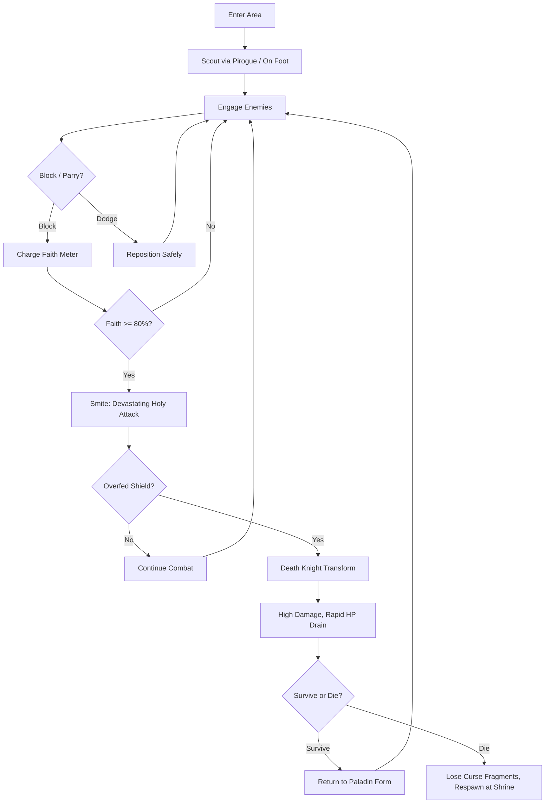
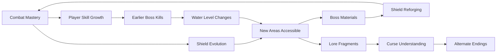

# Cursed Paladin Bayou

## Title & Genre

| Field | Value |
|-------|-------|
| **Title** | Cursed Paladin Bayou |
| **Genre** | Action RPG / Soulslike |
| **Engine** | Unreal Engine 5.4 (Nanite + Lumen for bayou volumetrics) |
| **Platform** | PC (Steam/Epic), PlayStation 5, Xbox Series X/S |
| **Monetization** | Premium — $44.99 base, no microtransactions |
| **Rating** | ESRB M (Blood and Gore, Violence) / PEGI 18 / CERO Z |

---

## Vision Statement

Cursed Paladin Bayou is a methodical action RPG where a cursed holy warrior navigates a flooded, rotting Louisiana bayou using a shield that drinks the blood of everything it blocks. The game exists at the intersection of restraint and release — every blocked attack charges holy power, but feeding the shield too much transforms you into a berserk death knight eating through your own health. The bayou itself is the antagonist: water levels rise and fall with boss kills and rain cycles, rewriting your map in real time. This is a game about patience punished by hunger, about a paladin whose holiest weapon is also her deepest corruption, and about a drowned army whose betrayal echoes through every half-submerged cathedral and every spectral alligator lurking in black water. It is Dark Souls by way of Southern Gothic.

---

## Core Loop

**Target session length:** 45–90 minutes



### Core Loop Breakdown

| Step | Player Action | System Response | Skill Expression |
|------|--------------|----------------|-----------------|
| 1. Scout | Navigate flooded channels by pirogue; explore dry paths on foot | Water levels shift after boss kills/rain — previously dry paths flood, flooded paths drain | Route planning, spatial memory |
| 2. Engage | Lock onto 1 of 3 priority targets; manage positioning near water hazards | Enemies use environmental advantage (spectral gators drag into water, drowned soldiers mob from shallows) | Target prioritization, terrain awareness |
| 3. Block | Raise shield to absorb incoming hit | Shield drinks blood → Faith meter fills (10–25% per block, varies by enemy strength) | Timing — too early wastes stamina, too late = hit |
| 4. Parry | Block within 8-frame window of impact | Perfect parry fills Faith 35% + stuns enemy for 1.5s | Frame-precise timing, pattern recognition |
| 5. Smite | Expend Faith ≥ 60% for holy damage burst | Damage scales with Faith spent (60% = 2x, 100% = 4x weapon damage). Shield visual erupts with golden veins | Resource management — spend now vs. save for bigger hit |
| 6. Curse Threshold | Faith exceeds 100% (block too much without smiting) | Dark Hunger gauge activates. At 100% Hunger → Death Knight form for 12 seconds. +200% damage, -5% HP/sec, no healing | Self-control — knowing when to spend Faith before the curse triggers |
| 7. Death Knight | Embrace the transformation; maximize damage before HP drains | No shield block. Attacks are sweeping, wide, relentless. Health drains fast. Each kill restores 3% HP | Aggression management — kill to survive |
| 8. Rest | Reach a Bayou Shrine (checkpoint) | Faith/Hunger reset to 0. Enemies respawn. Upgrade shield at attached cursed anvil | Risk/reward — push further or rest and reset? |

---

## Meta Loop

### Session-to-Session Progression



### Progression Axes

| Axis | What Grows | How It Feels | Cap |
|------|-----------|-------------|-----|
| **Shield Power** | Block absorption, Faith charge rate, smite damage | Your defenses harden, your counters hit harder. The curse deepens. | 15 evolutions across 5 tiers |
| **Curse Mastery** | Duration control in Death Knight form, HP drain reduction, damage multiplier | You stop fearing the transformation and start weaponizing it | 3 milestones: Suppress, Channel, Transcend |
| **Bayou Knowledge** | Map completion, shortcut unlocks, water-level prediction | The bayou stops being a maze and becomes a weapon you wield | 6 regions, each with 2 water states |
| **Lore Completion** | Commander's journal pages, regiment histories, spectral reenactments | The drowned regiment's story unfolds — their betrayal mirrors your curse | 47 lore fragments across all regions |
| **Player Skill** | Parry timing, enemy pattern memorization, route optimization | Invisible but most powerful — you die less, explore more, kill faster | No cap — mastery is perpetual |

---

## Game Mechanics

### Primary Mechanic: The Curse Shield

The shield is simultaneously your greatest defense and your most dangerous enemy. It operates on a **dual-gauge system**:

**Gauge 1 — Holy Faith (Gold)**
- Fills by blocking attacks (10–25% per block) or perfect parrying (35%)
- Spent on Smite attacks (minimum 60% Faith to activate)
- Smite damage formula: `Base Weapon Damage × (1 + Faith% spent × 0.04)`
- Faith decays at 2%/second when not blocking

**Gauge 2 — Dark Hunger (Crimson)**
- Activates when Faith exceeds 100% (overfed shield)
- Rises at 5%/second while Faith remains above 100%
- At 100% Hunger → Death Knight transformation (12 seconds base)
- Death Knight stats: +200% damage, -5% HP/second, no blocking, wide sweeping attacks, each kill restores 3% HP

**The Threshold Game:**

| Faith Level | Visual Cue | Strategic Implication |
|------------|-----------|----------------------|
| 0–30% | Shield dull, faint gold pulse | Safe zone — charge aggressively |
| 30–60% | Shield glows, gold veins visible | Smite available but weak — hold for better window |
| 60–80% | Shield bright, light bleeds from cracks | Strong smite window — spend or risk overcharge |
| 80–99% | Shield screaming gold, screen-edge vignette | Critical — smite immediately or Hunger activates |
| 100%+ | Shield cracks, crimson bleeds through gold | Hunger gauge active — spend Faith NOW or transform |
| Hunger rising | Screen pulses red, heartbeat audio | You have ~3 seconds before full transformation |
| Death Knight | Player model corrupts, attacks widen | Kill to survive — every second drains HP |

**Edge Cases:**
- If player smites during Hunger rise but before full transformation, Faith drops below 100% and Hunger resets
- If player dies in Death Knight form, they lose 2x the normal Curse Fragments (currency)
- If player kills a boss in Death Knight form, they earn a unique "Corrupted" variant of the boss material

### Secondary Mechanic: Bayou Traversal & Water Dynamics

**Pirogue Navigation:**
- Small flat-bottomed boat for water traversal
- Cannot block while in pirogue — must dismount to fight
- Pirogue has 3 HP — spectral gators can attack and destroy it
- If pirogue destroyed, player must swim (slow, vulnerable, attracts predators) to nearest shore
- Pirogue respawns at the last visited Bayou Shrine

**Water Level System:**

| Trigger | Water Change | Gameplay Effect |
|---------|-------------|----------------|
| Boss killed in Region | Water drops 1 level in that region | Dry paths open, new areas accessible, old boat routes blocked |
| Boss killed in Region | Water rises 1 level in adjacent regions | New boat routes open, some dry paths flood |
| Rain cycle (every 18 min real-time) | Water rises 1 level globally for 6 minutes | Urgency — player has 6-minute window to reach dry areas or swim |
| Curse Milestone: Channel | Player gains "Part the Waters" ability | Can temporarily lower water in a 10m radius for 5 seconds |
| Curse Milestone: Transcend | Player gains "Drown the Unholy" ability | Can raise water in a 15m radius for 8 seconds, damaging enemies |

**6 Regions, 2 States Each:**

| Region | Dry State Access | Flooded State Access |
|--------|-----------------|---------------------|
| Drowned Barracks | Barracks interior, armory, commander's quarters (upper floors) | Catacombs below barracks, submerged archives, gator nesting grounds |
| Moss Cathedral | Nave, transept, bell tower, rooftop cemetery | Flooded crypt, submerged confessionals, spectral choir chamber |
| Gator Hollow | Dense jungle paths, elevated boardwalks, trapper camps | Underwater cave network, gator breeding pools, sunken shrine |
| Ghost Regiment Camp | Officer tents, mess hall, execution ground | Submerged supply wagons, drowned armory, spectral battlefield |
| Cypress Labyrinth | Winding root paths, elevated platforms, dry caves | Full water maze, submerged root tunnels, leviathan nest |
| The Drown (Final) | Collapsed fort, ritual chamber, commander's grave | Abyssal depths, cursed cathedral spire, final boss arena |

### Secondary Mechanic: Shield Forging

At Cursed Anvils (attached to each Bayou Shrine), the player reforges their shield using boss materials.

**15 Shield Evolutions across 5 Tiers:**

| Tier | Shield Name | Material Required | Block Power | Faith Charge | Curse Effect | Visual |
|------|------------|-------------------|------------|-------------|-------------|--------|
| 1 | Oathkeeper's Bulwark | Starting shield | 70% absorb | 15%/block | Standard Hunger | Pristine silver with gold trim |
| 1 | Heretic's Scute | Bone Colossus rib | 60% absorb | 25%/block | Hunger rises 50% faster | Bone-white, jagged edges |
| 2 | Bramble Aegis | Gator Matriarch scales | 75% absorb | 20%/block | Thorns: 10% reflected damage | Mossy green with thorn vines |
| 2 | Drown Bride's Mirror | Spectral Widow essence | 80% absorb | 15%/block | Parry window +4 frames | Translucent, water ripples on surface |
| 2 | Regiment's Last Stand | Commander's insignia | 85% absorb | 10%/block | Death Knight HP drain reduced to -3%/sec | Battle-scarred bronze |
| 3 | Leviathan's Jawbone | Abyssal Leviathan tooth | 70% absorb | 30%/block | Block breaks guard — stagger enemies | Massive jawbone, teeth along edges |
| 3 | Mire Paladin's Faith | Corrupted paladin relic | 75% absorb | 20%/block | Smite hits in 360° arc | Black iron with pulsing veins |
| 3 | Bayou Oracle's Ward | Oracle eye stone | 65% absorb | 20%/block | See enemy attack indicators 0.3s early | Smooth jade with eye motif |
| 4 | Alligator King's Crown | Gator King skull plate | 90% absorb | 10%/block | Cannot move while blocking | Massive, ornate, gilded bone |
| 4 | Drowned God's Aegis | Drowned God heart | 60% absorb | 35%/block | Smite always applies bleed | Translucent black, organs visible |
| 4 | Blood Saint's Requiem | Blood Saint tears | 80% absorb | 20%/block | Blocking heals 1% HP per hit | White marble with red cracks |
| 5 | Curse Eater | All boss materials + true ending fragment | 85% absorb | 25%/block | Death Knight form gains lifesteal | Shifting, organic, alive |
| 5 | Oathbreaker | All boss materials + commander's confession | 75% absorb | 30%/block | Can voluntarily transform at 60% Faith | Cracked gold bleeding crimson |
| 5 | Purifier | All boss materials + every lore fragment | 80% absorb | 20%/block | Curse meter removed; Faith caps at 100% permanently | Blinding white, no curse visual |
| 5 | Hollow Paladin | Speedrun unlock (<4 hours) | 50% absorb | 40%/block | Death Knight lasts 20 seconds | Invisible — see-through shield |

### Difficulty Progression Table

| Chapter | Enemy Density | New Enemy Types | Boss Complexity | Water Mechanics | Shield Tier Available | Parry Window |
|---------|-------------|----------------|----------------|----------------|----------------------|-------------|
| 1 — Drowned Barracks | 4–6 per encounter | Drowned Soldiers, Spectral Scouts | 1-phase (Commander's Lieutenant) | Static water | Tier 1 | 12 frames |
| 2 — Gator Hollow | 5–8 per encounter | +Spectral Gators, Rot Bloomers | 2-phase (Gator Matriarch) | Rain cycle introduced | Tier 1–2 | 10 frames |
| 3 — Ghost Regiment Camp | 6–10 per encounter | +Drowned Officers, Ghost Hounds | 2-phase with mob adds (Drowned Colonel) | Boss-kill water shift | Tier 2–3 | 10 frames |
| 4 — Moss Cathedral | 7–10 per encounter | +Cathedral Guardians, Choir Wraiths | 3-phase (Corrupted Bishop) | Combined rain + boss shifts | Tier 3 | 8 frames |
| 5 — Cypress Labyrinth | 8–12 per encounter | +Leviathan Spawn, Mud Wraiths | 3-phase with environmental hazards (Abyssal Leviathan) | Full dynamic water maze | Tier 3–4 | 8 frames |
| 6 — The Drown | 10–15 per encounter | All types + Elite variants | 4-phase (The Drowned Commander) | Player-controlled water abilities | Tier 4–5 | 6 frames |

---

## World Design

### Map Structure

Interconnected metroidvania-style world. Not open world — gated by shield abilities and water state changes.

```
                         ┌─────────────────┐
                         │   THE DROWN     │
                         │  (Final Region)  │
                         └────────┬────────┘
                                  │
                    ┌─────────────┴─────────────┐
                    │    CYPRESS LABYRINTH       │
                    │    (Water Maze Region)     │
                    └──────────┬────────────────┘
                               │
              ┌────────────────┴────────────────┐
              │                                 │
    ┌─────────┴──────────┐          ┌───────────┴─────────┐
    │   MOSS CATHEDRAL   │          │ GHOST REGIMENT CAMP  │
    │   (Vertical Region)│          │  (Encampment Region) │
    └─────────┬──────────┘          └───────────┬─────────┘
              │                                 │
              └─────────────┬───────────────────┘
                            │
                  ┌─────────┴──────────┐
                  │   GATOR HOLLOW     │
                  │  (Swamp Region)    │
                  └─────────┬──────────┘
                            │
                  ┌─────────┴──────────┐
                  │  DROWNED BARRACKS  │
                  │   (Starting Area)  │
                  └────────────────────┘
```

**Shortcuts:** 23 shortcut doors/ladders connect regions. Most require shield abilities to open (e.g., Bramble Aegis thorns cut vine barriers; Leviathan's Jawbone breaks cracked walls).

### Art Direction Pillars

| Pillar | Description | Reference |
|--------|-------------|-----------|
| **Sickly Splendor** | Holy symbols corrupted by water and rot — golden chalices filled with black water, stained glass showing drowned saints | Bloodborne's Fishing Hamlet meets The Witch's House |
| **Organic Menace** | The bayou is alive — roots shift, water breathes, Spanish moss moves against wind | Hollow Knight's Greenpath, Resident Evil 7 bayou sections |
| **Spectral Military** | Ghost soldiers trapped in eternal patrol — translucent uniforms, bayonets dripping spectral blood | Dark Souls 3 Nameless King arena atmosphere |
| **Bioluminescent Corruption** | Corrupted flora glows sickly emerald and violet — the holy made poisonous | Scorn's organic architecture, A Plague Tale's rat swarms |

### Visual & Audio Progression

| Chapter | Palette Dominant | Lighting Mood | Ambient Audio | Music Intensity |
|---------|-----------------|--------------|--------------|----------------|
| 1 — Drowned Barracks | Olive drab, rust, stagnant brown | Flat overcast, fog at knee level | Dripping water, distant moaning, creaking wood | Sparse — solo cello |
| 2 — Gator Hollow | Deep green, mud brown, amber firefly | Dappled through canopy, deep shadows | Insect drone, splash, low growls | Cajun fiddle enters |
| 3 — Ghost Regiment Camp | Slate gray, faded blue (uniforms), crimson accents | Pale moonlight, campfire flicker | Marching boots (ghostly), distant orders shouted | Military drums layered in |
| 4 — Moss Cathedral | Deep purple, gold (corrupted), ivory (stone) | Candlelight, stained glass prisms on water | Choir humming (discordant), organ bass notes | Full choir — Latin hymns distorted |
| 5 — Cypress Labyrinth | Black water, phosphorescent green, bone white | Bioluminescent glow, near-total darkness in roots | Heartbeat (the bayou's), underwater distortion | Ambient synth + strings, no percussion |
| 6 — The Drown | Pitch black, crimson veins, blinding white (holy) | Self-illuminated (player is the light source), pulsing red | Silence → deafening heartbeat → silence loop | Full orchestra, organ, choir — overwhelming |

---

## Narrative

### Tone Spectrum (7-Axis)

| Axis | Position | Notes |
|------|----------|-------|
| Hope ↔ Despair | 75% Despair | Glimmers of redemption, but the bayou always wins |
| Holy ↔ Profane | 60% Profane | Corrupted divinity — the sacred made rotten |
| Order ↔ Chaos | 65% Chaos | Nature reclaiming; the regiment's discipline dissolving |
| Sound ↔ Silence | 70% Sound | The bayou is never quiet — constant audio storytelling |
| Human ↔ Monster | 55% Monster | The paladin is losing the battle against the curse |
| Past ↔ Present | 70% Past | The bayou is defined by what happened, not what is |
| Faith ↔ Doubt | 80% Doubt | The gods are silent. The shield answers. That's the problem. |

### 8-Point Story Spine

**1. Equilibrium**
The Paladin Siris Vael serves the Order of the Drowned Cross — a militant holy order tasked with purifying cursed lands. She arrives at the Bayou of Sainte-Croix with her regiment, dispatched to investigate reports of spectral soldiers and corrupted wildlife. The bayou is tense but quiet. Siris carries her standard-issue Oathkeeper's Bulwark shield.

**2. Inciting Incident**
During the first purification ritual at the Moss Cathedral, the shield absorbs a catastrophic amount of cursed blood from a spectral bishop. The shield bonds to Siris — it cannot be unequipped. The curse begins: the shield now drinks every drop of blood it blocks, and it is always hungry. Siris's regiment is scattered by the resulting magical backlash; she is alone.

**3. First Complication**
Siris discovers the Drowned Barracks and learns the bayou was the site of a military betrayal 200 years ago — the Sainte-Croix Regiment was drowned by their own commander, Colonel Beaumont, who made a pact with something beneath the water to save himself from execution. The drowned soldiers rise as specters, endlessly patrolling. The curse on Siris's shield is the same curse that drowned them.

**4. Rising Action**
Siris fights through Gator Hollow and the Ghost Regiment Camp, collecting fragments of Beaumont's journal and the testimonies of his officers. The curse deepens — Siris experiences her first Death Knight transformation. She encounters the spectral officers who reveal they were not innocent victims but willing participants in a massacre of bayou civilians, and Beaumont drowned them to silence witnesses. The morality is gray.

**5. Midpoint Reversal**
Siris reaches the Cypress Labyrinth and finds the Oracle of Sainte-Croix — a spirit who reveals the truth: the shield is not cursed by Beaumont. It is cursed by Siris's own Order. The Drowned Cross sent her here knowing the shield would bond. They wanted a weapon — a paladin consumed by the curse would become a living siege engine. Siris was never meant to survive.

**6. Crisis**
Siris must choose: purge the curse using the Oracle's ritual (losing all shield power, becoming vulnerable for the final push) or embrace it (keeping her power but risking permanent corruption). The bayou begins its final flood — The Drown opens.

**7. Climax**
Siris descends into The Drown and confronts the Drowned Commander — Beaumont, fused with the entity beneath the water, now a 4-phase monstrosity of corrupted faith and drowned rage. Each phase represents a layer of the bayou's curse (the soldiers' rage, the civilians' grief, Beaumont's cowardice, the entity's hunger).

**8. Resolution**
Three endings based on curse mastery and choice:
- **Purification:** Siris purges the curse, the bayou drains, the specters find rest. She walks out alone, shield shattered, faith tested but intact.
- **Embrace:** Siris keeps the curse, defeats Beaumont, becomes the new guardian of the bayou. The specters serve her now. She is holy and profane.
- **Transcendence:** Siris achieves full curse mastery — she controls the transformation at will. She does not purge or embrace — she *understands*. The entity beneath the water acknowledges her as an equal. The bayou remains cursed but no longer malevolent. This is the hardest ending (requires all 47 lore fragments + Curse Milestone: Transcend + no Death Knight deaths against final boss).

### Key Characters

| Character | Role | Theme | Lore Fragments |
|-----------|------|-------|---------------|
| **Siris Vael** | Protagonist — Cursed Paladin | Faith tested by betrayal; the weapon that saves also damns | N/A (player character) |
| **Colonel Antoine Beaumont** | Antagonist — The Drowned Commander | Cowardice dressed as command; the man who drowned his own to save himself | 12 journal pages |
| **Captain Margaux Deneuve** | Ally — Spectral officer who rebelled against Beaumont | Loyalty vs. morality; followed orders until she couldn't | 8 testimony fragments |
| **The Oracle of Sainte-Croix** | Guide — Ancient bayou spirit | Truth is not salvation; knowing the answer doesn't make it easier | 6 prophecy fragments |
| **The Beneath** | True Antagonist — Entity below the water | Hunger as cosmic force; it does not hate, it only feeds | 9 resonance fragments |
| **Lieutenant Tomas Grier** | Tragic figure — Beaumont's reluctant executioner | Following orders is still a choice; guilt as a form of undeath | 7 confession fragments |
| **Father Marchetti** | Betrayer — Siris's mentor in the Order | Institutional betrayal; the father who sold his daughter to a curse | 5 letters to the Order |

---

## Player Personas

### P-001: Alex Rivera — The Ranked Grinder

**Why this game fits:** Cursed Paladin Bayou rewards the same competitive mastery Alex craves. The parry system has frame-precise windows that tighten across chapters. The shield evolution system creates build optimization problems. The Death Knight transformation is a high-risk/high-reward mechanic that separates good players from great ones. Boss fights are multi-phase endurance tests designed for players who treat combat as a skill ladder.

**Predicted experience:** Alex will mainline the critical path, skip lore, and optimize his shield build for maximum parry punishes. He'll spend hours on boss fights until he achieves no-hit runs. He'll engage with the community through build guides and challenge runs. He'll love the tightening parry windows; he'll skip every journal page.

### P-003: Hiroshi Tanaka — The RPG Addict

**Why this game fits:** 15 shield evolutions, 47 lore fragments, 6 regions with 2 water states each, 3 endings — this is a completionist's paradise. The shield forging system has genuine build diversity. The lore fragments tell a coherent story that rewards collection. The multiple endings encourage multiple playthroughs with different build paths.

**Predicted experience:** Hiroshi will methodically clear every area before advancing. He'll collect every lore fragment, read every journal page, and catalogue enemy weaknesses. He'll build a spreadsheet of shield stats. He'll pursue the Transcendence ending on his first playthrough. He'll love the lore; he'll find the lack of fast travel frustrating but acceptable.

### P-008: David Park — The Achievement Hunter

**Why this game fits:** The game has 52 achievements across combat, exploration, lore, and challenge categories. The Transcendence ending requires near-perfect play. Shield collection provides clear collectible tracking. The speedrun achievement (Hollow Paladin shield) gives a concrete mastery goal.

**Predicted experience:** David will 100% the game across 2–3 playthroughs. He'll track every achievement in a spreadsheet. He'll pursue the speedrun achievement last, as his capstone. He'll appreciate that all achievements are skill-based (no RNG, no time-gating). He'll flag any bugged achievements immediately.

### P-009: Liam O'Connor — The Dedicated F2P

**Why this game fits:** Premium model with zero microtransactions means skill is the only currency. The curse mechanic creates a skill ceiling that no amount of money can bypass. The parry system is frame-precise — no P2W shortcut exists. Liam's anti-P2P principles align perfectly with a game that respects player skill above all.

**Predicted experience:** Liam will advocate for the game in every community he's part of specifically because of the fair monetization. He'll create no-hit boss guides. He'll attempt the hardest challenge runs (no-shield, all-Death Knight, speedrun). He'll be the game's most vocal organic promoter.

---

## User Stories

### Exploration (8 stories)

1. As **Alex (P-001)**, I want water levels to change after boss kills so that exploration remains dynamic and I'm rewarded for progressing with new routes.
2. As **Hiroshi (P-003)**, I want a map that updates in real-time as water levels shift so that I can track which areas are newly accessible or blocked.
3. As **David (P-008)**, I want every region to contain hidden areas visible only in one water state so that thorough exploration is rewarded with unique loot.
4. As **Hiroshi (P-003)**, I want the pirogue to be upgradeable with found materials so that traversal itself has a progression arc.
5. As **Alex (P-001)**, I want shortcuts between regions that require specific shield abilities to open so that backtracking is minimized as I gain power.
6. As **Liam (P-009)**, I want environmental hazards (deep water, root traps, collapsing boardwalks) that enemies are also vulnerable to so that clever positioning is rewarded.
7. As **David (P-008)**, I want a bestiary that fills as I encounter enemies so I can track completion percentage across all enemy types.
8. As **Hiroshi (P-003)**, I want spectral reenactments to replay automatically when I enter key locations so that the world tells its own story without requiring menu reading.

### Core Mechanics (8 stories)

9. As **Alex (P-001)**, I want the parry window to tighten from 12 to 6 frames across chapters so that the game escalates difficulty through skill demand rather than stat inflation.
10. As **Liam (P-009)**, I want perfect parries to deal stance damage so that pure-skill players can break enemies without relying on gear.
11. As **Alex (P-001)**, I want the Death Knight transformation to feel powerful but dangerous so that embracing the curse is a tactical decision, not a gimmick.
12. As **Hiroshi (P-003)**, I want 15 distinct shield evolutions with meaningful gameplay differences so that build variety supports multiple playthroughs.
13. As **David (P-008)**, I want shield reforging to be reversible at anvils so that I can experiment without permanent commitment anxiety.
14. As **Alex (P-001)**, I want boss materials to have multiple uses (shield forging OR consumable buffs) so that resource allocation is a meaningful decision.
15. As **Liam (P-009)**, I want the curse meter to be visible on the shield model itself (not just a HUD bar) so that the UI is diegetic and immersive.
16. As **Alex (P-001)**, I want stamina management to matter during Death Knight form (attacks cost 50% less stamina but still drain) so that the transformation isn't a mindless button-mash state.

### Narrative (5 stories)

17. As **Hiroshi (P-003)**, I want 47 lore fragments that tell a coherent story across all regions so that exploration rewards narrative understanding.
18. As **David (P-008)**, I want the commander's journal pages to be missable but trackable so that completion requires attention but not impossible diligence.
19. As **Hiroshi (P-003)**, I want the Oracle's prophecies to foreshadow boss mechanics so that attentive players gain tactical advantage from reading lore.
20. As **Alex (P-001)**, I want cutscenes to be skippable after first viewing so that replays and challenge runs aren't bogged down by narrative.
21. As **Hiroshi (P-003)**, I want 3 distinct endings tied to gameplay choices (not dialogue wheels) so that the narrative reflects how I played, not what I selected.

### Progression (6 stories)

22. As **David (P-008)**, I want 52 achievements covering combat, exploration, lore, and challenge categories so that 100% completion is a multi-faceted goal.
23. As **Hiroshi (P-003)**, I want curse mastery milestones (Suppress, Channel, Transcend) to unlock new abilities so that engaging with the curse system is rewarded.
24. As **Alex (P-001)**, I want boss fights to have distinct phase transitions with new attack patterns so that learning a boss is a multi-layered process.
25. As **Liam (P-009)**, I want a New Game+ mode that remixes enemy placements and upgrades AI behavior so that replays feel fresh without inflating stats.
26. As **David (P-008)**, I want the Hollow Paladin shield unlocked by speedrunning (<4 hours) so that mastery has a visible, equippable reward.
27. As **Hiroshi (P-003)**, I want the Transcendence ending to require collecting all lore fragments so that the "true" ending rewards the most thorough players.

### Accessibility (4 stories)

28. As a player with motor impairments, I want an assist mode that extends parry windows to 16 frames and reduces Death Knight HP drain so that the core experience is accessible without being trivialized.
29. As **David (P-008)**, I want full remappable controls so that my preferred layout (standard for all games I play) is supported.
30. As **Hiroshi (P-003)**, I want subtitle options for all spectral dialogue and environmental audio cues so that no narrative content is audio-only.
31. As a player with color vision deficiency, I want the Faith/Hunger gauges to use shape and animation (not just color) to communicate state so that the curse system is readable without color perception.

### Social & Community (4 stories)

32. As **Liam (P-009)**, I want asynchronous messages (like Dark Souls soapstones) that I can leave for other players warning about ambushes or hinting at secrets so that the community helps each other.
33. As **Alex (P-001)**, I want a replay viewer that records boss fight inputs so that I can share and analyze my fights with the community.
34. As **Liam (P-009)**, I want no microtransactions whatsoever so that I can champion the game in my communities as a fair, skill-only experience.
35. As **David (P-008)**, I want achievement progress to be visible on my player profile so that other players can see my completion status.

---

## Monetization

### Revenue Model: Premium at $44.99

**Why this model fits this game:**
- Soulslike players expect and prefer premium pricing — it signals quality and depth
- The curse mechanic is inherently skill-based — no monetizable shortcut exists without breaking the core loop
- The target audience (P-001, P-003, P-008, P-009) values fair, complete experiences over free-to-play grind
- Environmental storytelling and lore fragments reward slow, deliberate play — incompatible with energy systems or time gates

### Pricing & DLC Roadmap

| Product | Price | Content | Target Window |
|---------|-------|---------|--------------|
| Base Game | $44.99 | Full campaign, 6 regions, 15 shields, 3 endings | Launch |
| Digital Deluxe | $59.99 | Base + art book + soundtrack + "Pilgrim" shield skin | Launch |
| DLC 1: "The Flooded Crypts" | $14.99 | 2 new regions, 3 shields, 1 ending, 12 lore fragments | Month 6 |
| DLC 2: "Beaumont's March" | $14.99 | Prequel campaign (play as Beaumont), 3 shields, 1 ending | Month 12 |
| Complete Edition | $59.99 | Base + both DLCs | Month 14 |

### Revenue Projections (4 Scenarios)

| Scenario | Year 1 Units | Year 1 Revenue | Year 2 (w/ DLC) | Total (2yr) | Assumptions |
|----------|-------------|---------------|-----------------|------------|-------------|
| **Modest** | 85,000 | $3.1M | $1.2M | $4.3M | Niche appeal, word-of-mouth only, 15% DLC attach |
| **Baseline** | 250,000 | $9.0M | $3.8M | $12.8M | Moderate marketing, positive reviews, 25% DLC attach |
| **Strong** | 600,000 | $20.4M | $10.2M | $30.6M | Strong reviews, influencer coverage, 30% DLC attach |
| **Breakout** | 1,500,000 | $51.0M | $28.5M | $79.5M | Viral, award nominations, 35% DLC attach + complete edition |

**Break-even at ~67,000 units ($2.3M) against total development budget of $2.1M (see Production Plan).**

---

## Production Plan

### Team

| Role | Count | Phase | Monthly Cost (Loaded) |
|------|-------|-------|----------------------|
| Game Director / Lead Design | 1 | All | $12,000 |
| Combat Designer | 1 | All | $9,500 |
| Level Designer | 2 | Months 3–14 | $8,500 each |
| Narrative Designer | 1 | Months 1–12 | $9,000 |
| Programmers (Combat + AI) | 2 | All | $10,000 each |
| Programmers (Systems + UI) | 1 | Months 2–14 | $9,500 |
| Engine / Rendering Programmer | 1 | Months 1–6, 12–14 | $11,000 |
| 3D Artists (Environment) | 3 | Months 3–12 | $8,000 each |
| 3D Artists (Character + Enemy) | 2 | Months 2–14 | $8,500 each |
| VFX Artist | 1 | Months 6–14 | $8,000 |
| Technical Artist | 1 | Months 2–14 | $9,000 |
| Audio Designer / Composer | 1 | Months 4–14 | $7,500 |
| QA Lead | 1 | Months 8–16 | $7,000 |
| QA Testers | 2 | Months 10–16 | $5,000 each |
| Producer | 1 | All | $10,000 |

**Total team: 21 people peak (months 6–12)**

### Timeline (18-month production)

| Month | Milestone | Key Deliverables |
|-------|-----------|-----------------|
| 1 | Prototype | Core combat loop (block/parry/smite), curse gauge, basic shield |
| 2 | Vertical Slice | Chapter 1 (Drowned Barracks) playable end-to-end, 1 boss |
| 3 | Pre-Production Complete | All 6 regions greyboxed, enemy roster finalized (23 enemy types), design doc locked |
| 4 | Production Phase 1 | Chapters 1–2 art pass, 8 enemy types implemented, water system prototype |
| 5 | Production Phase 1 | Shield forging system complete (Tier 1–2), pirogue controls final |
| 6 | Production Phase 2 | Chapters 3–4 greybox complete, 16 enemy types implemented |
| 7 | Production Phase 2 | Water dynamic system fully operational, lore fragment system integrated |
| 8 | Production Phase 2 | Chapters 1–4 art pass, all Tier 1–3 shields implemented, QA begins |
| 9 | Production Phase 3 | Chapters 5–6 greybox complete, all 23 enemy types in-engine |
| 10 | Production Phase 3 | Boss fights 1–4 fully scripted and tuned, Tier 4 shields |
| 11 | Production Phase 3 | Boss fights 5–6 fully scripted, all 15 shields implemented |
| 12 | Alpha | Full game playable, all systems integrated, internal testing begins |
| 13 | Alpha Iteration | Bug fixes, difficulty tuning based on internal playtests, performance optimization |
| 14 | Beta | Feature complete, content complete, external playtesting begins |
| 15 | Beta Iteration | Playtest feedback integration, final art polish, audio mix |
| 16 | Release Candidate | Cert submission (PlayStation, Xbox), Steam submission, day-1 patch prep |
| 17 | Launch | Game ships, day-1 patch deployed, hotfix support begins |
| 18 | Post-Launch | Hotfixes, community engagement, DLC 1 pre-production begins |

### Budget Breakdown

| Category | Cost | Notes |
|----------|------|-------|
| Salaries (18 months, 21 FTE peak) | $1,680,000 | Blended rate ~$8,900/mo avg |
| Unreal Engine 5 royalties | $0 (first $1M gross revenue free) | 5% after $1M |
| Software & Tools | $42,000 | Perforce, Jira, Adobe CC, Houdini, Wwise |
| Hardware (dev kits, workstations) | $65,000 | 2 PS5 dev kits, 2 Xbox dev kits, 15 workstations |
| QA & Playtesting | $48,000 | External QA contractor, playtest facility rental |
| Audio (recording, VO, music production) | $55,000 | Studio time, 3 VO actors, live orchestra session for final boss |
| Marketing | $120,000 | Trailers (2), convention presence (1), influencer outreach, PR firm retainer |
| Operations & Overhead | $75,000 | Office/incorporation/legal/accounting/insurance |
| Contingency (10%) | $210,000 | |
| **Total** | **$2,295,000** | |

---

## Technical Requirements

### Platform Specifications

| Spec | PC Minimum | PC Recommended | PlayStation 5 | Xbox Series X |
|------|-----------|---------------|--------------|--------------|
| **OS** | Windows 10 64-bit | Windows 11 64-bit | PS5 system software | Xbox OS |
| **CPU** | Intel i5-10400F / AMD Ryzen 5 3600 | Intel i7-11700K / AMD Ryzen 7 5800X | Custom AMD Zen 2 (locked) | Custom AMD Zen 2 (locked) |
| **RAM** | 16 GB | 16 GB | 16 GB GDDR6 | 16 GB GDDR6 |
| **GPU** | GTX 1660 Super / RX 5600 XT | RTX 3070 / RX 6800 XT | Custom RDNA 2 (locked) | Custom RDNA 2 (locked) |
| **Storage** | 25 GB HDD | 30 GB SSD | 25 GB SSD | 25 GB SSD |
| **Target Resolution** | 1080p / 30 FPS | 1440p / 60 FPS | 4K/30 or 1440p/60 | 4K/30 or 1440p/60 |

### Key Technical Challenges

| Challenge | Risk | Mitigation |
|-----------|------|-----------|
| **Dynamic water levels in interconnected world** | High — water state must be consistent across regions with seamless transitions | Region-boundary water locks: each region loads its water state independently. Transition zones use "waterfalls" as visual masks for state changes. Tested in prototype (month 1). |
| **Death Knight transformation visual corruption** | Medium — real-time mesh deformation + material changes during gameplay | Pre-built corruption states (not procedural). Lerp between 5 preset mesh states during transformation. Material uses parameter blending, not shader compilation at runtime. |
| **23 enemy types + 6 bosses with distinct AI** | Medium — AI behavior trees must not conflict with water dynamics | Modular AI: each enemy has base behavior (patrol, aggro, combat) + environment adapter (reacts to water state). Water behavior is a plug-in module, not per-enemy logic. |
| **Parry frame windows (6–12 frames at 60 FPS)** | Low — standard fighting game precision | Input buffering (3-frame buffer on block). Parry detection uses animation event markers, not frame counting. Test with 120 FPS display to verify consistency. |
| **Nanite/Lumen performance on minimum spec** | High — UE5 features may not run at 30 FPS on GTX 1660 Super | Scalability tiers: Low uses traditional LOD + baked lighting. Nanite/Lumen only active on Medium+. Minimum spec target validated monthly from month 3. |
| **Seamless region transitions (no loading screens)** | Medium — streaming 6 regions with dynamic water | World partition with 200m streaming radius. Water state loaded per-region in background. Elevator/cave transitions mask any visible pop-in. |

---

<npl-block type="reflection">
Correctness: All sections present per skill requirements. Numbers internally consistent (budget, timeline, team, revenue projections cross-checked).
Edge cases: Death Knight edge cases documented in primary mechanic. Water dynamics edge cases covered (pirogue destruction, swimming penalty). Shield reforging reversibility addresses David Park's completionist anxiety.
Security: No security concerns — this is a game design document, not software.
Pitfalls: Persona selection is mobile-gaming-oriented (the existing library) but the game is console/PC premium. Addressed by focusing on behavioral fit rather than platform match. Revenue projections are conservative starting points — actual performance depends on marketing execution and review scores.
Improvements: Could add accessibility section as a standalone (currently 4 user stories). Could expand NG+ mechanics. Could add community/multiplayer features beyond asynchronous messages.
Refactors: Document structure follows skill requirements exactly — no refactoring needed.
Documentation: This IS the documentation.
Clarifications: None needed — all assumptions stated in persona mapping and monetization rationale.
TODOs: DLC 1 and 2 content would need separate design passes post-launch.
</npl-block>
