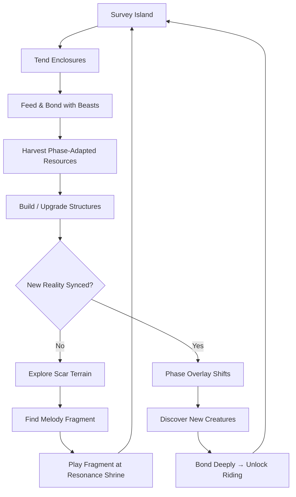
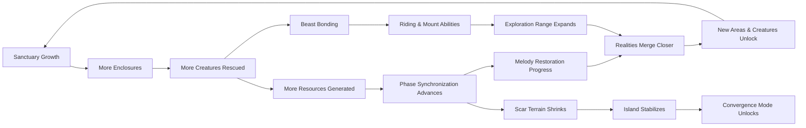

# Displacer Beast Garden

## Title & Genre

| Field | Value |
|-------|-------|
| **Title** | Displacer Beast Garden |
| **Genre** | Simulation / Building / Creature Collection |
| **Engine** | Unity 6 (URP) — tri-phase rendering pipeline, cross-platform Switch 2 optimization |
| **Platform** | PC (Steam), Nintendo Switch 2, PlayStation 5 |
| **Monetization** | Premium $34.99, free creature and biome updates, cosmetic structure packs ($4.99–$9.99) |
| **Rating** | ESRB E (Everyone) / PEGI 3 / CERO A — Mild Fantasy Themes |

---

## Vision Statement

Displacer Beast Garden is a meditative simulation where you play as a druid who claims a fractured floating island phasing between three parallel realities — a luminous meadow, a crimson volcanic ridge, and a fractal crystal forest. You build a sanctuary for displaced creatures torn from their home dimensions by a cataclysmic melody that shattered the barriers between worlds. Every structure you place exists in all three realities simultaneously but functions differently in each: a pond in the meadow becomes lava in the volcanic ridge and frozen crystal in the crystal forest. You tend to displacer beasts who exist partially in all three realities at once, bond with them across phases, and gradually heal the dimensional scars by restoring the shattered world-song. The more creatures you rehabilitate, the more the three realities synchronize, eventually merging back into one healed world. This is Stardew Valley by way of Studio Ghibli, with the creature-bonding depth of Monster Hunter Stories and the visual spectacle of viewing one landscape rendered three ways through a translucent phase-shifting overlay.

---

## Core Loop

**Target session length:** 30–60 minutes



### Core Loop Breakdown

| Step | Player Action | System Response | Skill Expression |
|------|--------------|----------------|-----------------|
| 1. Survey | Walk or ride across the island; shift between phase overlays to spot changes | Phase overlay renders the alternate reality as a translucent layer; resources and creatures shimmer differently per phase | Spatial awareness, phase literacy |
| 2. Tend | Weed gardens, repair fences, clean water sources, check beast health meters | Each task resolves differently per phase — weeding in meadow pulls luminous vines, in volcanic ridge removes ash deposits, in crystal forest chips ice formations | Pattern recognition across phases |
| 3. Feed & Bond | Bring phase-appropriate food to beasts; pet, groom, play mini-games | Beasts respond to their favored phase food (+3 bond), neutral food (+1), or wrong-phase food (-1). Bond meter fills from 0–100 | Resource matching, emotional timing |
| 4. Harvest | Collect plants, minerals, and phase-attuned materials from gardens and scar terrain | Resources regenerate on a 6-hour real-time cycle. Scar-adjacent gardens yield rare materials unavailable elsewhere | Planning — schedule harvests around regen timers |
| 5. Build | Place structures from the building menu; each auto-adapts across all three phases | A single placement renders three ways: meadow (wood + flowers), volcanic (obsidian + magma channels), crystal (geode + refracted light) | Multi-phase optimization — a structure helpful in one phase may hinder another |
| 6. Explore | Venture into scar terrain (dimensional wounds on the landscape) | Reality glitches occur near scars — structures shift unpredictably, rare plants grow, melody fragments are hidden in glitch pockets | Risk tolerance, exploration instinct |
| 7. Melody | Play found fragments at Resonance Shrines in the correct sequence | Correct sequence syncs the realities further — the phase overlay becomes more transparent, revealing previously hidden areas | Musical memory, sequence deduction |
| 8. Bond Deeply | Reach bond level 80+ with a beast; complete its personal quest chain | Beast becomes rideable; unique mount abilities unlock (meadow beasts boost speed, volcanic beasts break barriers, crystal beasts reveal hidden paths) | Long-term investment payoff |

---

## Meta Loop

### Session-to-Session Progression



### Progression Axes

| Axis | What Grows | How It Feels | Cap |
|------|-----------|-------------|-----|
| **Sanctuary Size** | Enclosure count, garden plots, structure variety | The island transforms from barren fracture to thriving haven | 120 structures, 40 enclosures, 60 garden plots |
| **Creature Roster** | Species discovered, rescued, bonded | Your sanctuary fills with life — each beast changes the island's energy | 36 displacer beast species (12 per phase) |
| **Melody Completion** | Fragments collected, sequence solved, soundtrack rebuilt | The world-song literally reconstructs — music swells as you heal reality | 54 melody fragments across 9 movements |
| **Phase Sync** | Overlay transparency, inter-phase travel speed, merged physics access | The three realities stop fighting each other and begin to harmonize | 100% synchronization (final merge) |
| **Beast Bond** | Individual bond levels, trust unlocks, riding certification | Each beast is an individual with preferences, moods, and a story | Bond level 100 per beast, personal quest chains |
| **Player Skill** | Phase-optimized building, melody sequence deduction, scar navigation | You learn to think in three realities simultaneously | No cap — Convergence Mode provides endless optimization |

---

## Game Mechanics

### Primary Mechanic: Tri-Phase Building

Every structure placed on the island renders and functions differently across the three reality phases. The player sees all three simultaneously through a translucent overlay system and can shift focus to any phase.

**Phase States for Structures:**

| Structure Type | Meadow Phase | Volcanic Phase | Crystal Phase |
|---------------|-------------|----------------|---------------|
| **Pond** | Clear water, grows lily herbs, beasts drink peacefully | Lava pool, heats nearby enclosures, volcanic beasts bask | Frozen crystal, refracts light, grows prismatic algae |
| **Fence** | Living hedge with flowers, beasts calm near it | Obsidian wall, blocks lava flows, provides shelter | Ice crystal barrier, chimes in wind, soothes crystal beasts |
| **Garden Plot** | Rich soil, grows luminous herbs and fruits | Ash-enriched soil, grows ember roots and fire blossoms | Crystal substrate, grows resonance crystals and frost berries |
| **Beast Shelter** | Willow den, soft and warm, meadow beasts prefer | Basalt cave, heated, volcanic beasts prefer | Geode hollow, refracted light, crystal beasts prefer |
| **Path** | Cobblestone with wildflowers | Cooled lava tube with ember veins | Crystal walkway with light channels |
| **Resonance Shrine** | Moss-covered stone altar | Blackened basalt monolith | Prismatic crystal spire |

**Multi-Phase Optimization Puzzle:**

Placing a structure that benefits one phase may conflict with another. Example: a pond in the meadow provides water for meadow beasts, but the same structure as lava in the volcanic phase heats adjacent enclosures — helpful for volcanic beasts but harmful to crystal beasts housed nearby. The player must optimize placement across all three phases simultaneously.

| Optimization Factor | Meadow Value | Volcanic Value | Crystal Value | Net Score |
|-------------------|-------------|----------------|---------------|-----------|
| Each meadow beast near pond | +3 comfort | +1 heat (good for volcanic) | -1 cold (bad for crystal) | Varies by neighbors |
| Each volcanic beast near lava | -1 danger | +3 comfort | +1 warmth (neutral) | Varies by neighbors |
| Each crystal beast near ice | +1 calm | -2 freeze (bad for volcanic) | +3 comfort | Varies by neighbors |

**Building Resource Costs (per structure):**

| Structure | Phase Wood | Phase Stone | Phase Essence | Unlock Requirement |
|-----------|-----------|-------------|--------------|-------------------|
| Pond | 10 | 15 | 5 | Starting |
| Fence (4 segments) | 8 | 4 | 0 | Starting |
| Garden Plot | 6 | 8 | 3 | Starting |
| Beast Shelter | 15 | 20 | 10 | Bond level 10 with any beast |
| Path (4 segments) | 4 | 6 | 0 | Starting |
| Resonance Shrine | 25 | 30 | 20 | Melody Fragment #5 collected |
| Scar Garden | 30 | 25 | 40 | First scar terrain explored |
| Phase Bridge | 20 | 35 | 30 | 25% synchronization |
| Convergence Altar | 50 | 60 | 80 | 75% synchronization |

### Secondary Mechanic: Displacer Beast Bonding

Each of the 36 displacer beast species has a favored phase that shapes its personality, appearance, and bonding behavior.

**Beast Personality by Phase Alignment:**

| Phase Alignment | Personality | Bond Mini-Game | Unique Ability | Riding Trait |
|----------------|-------------|---------------|---------------|-------------|
| **Luminous Meadow** | Playful, social, seeks attention | Fetch with light-orbs, grooming sparkle dust, song mimicry | Grows luminous plants in any garden plot passively | Speed boost in meadow; double jump across gaps |
| **Crimson Ridge** | Fierce, protective, cautious trust | Sparring (non-violent), heat-sharing rituals, guard duty quests | Heats nearby enclosures, protects weaker beasts from scar glitches | Breaks volcanic barriers; lava-walking for 10 seconds |
| **Crystal Forest** | Contemplative, curious, reveals secrets | Meditation sessions, crystal-matching puzzles, resonance tuning | Reveals hidden resources and melody fragments within 20m radius | Illuminates hidden paths; crystal-bridge creation |

**Bond Level Milestones:**

| Bond Level | Unlock | Visual Change |
|-----------|--------|---------------|
| 0–10 | Beast enters enclosure, observes player from distance | Tentative posture, phase-flickering (appears nervous) |
| 10–20 | Beast approaches player voluntarily, accepts food | Phase stabilizes, eyes brighten |
| 20–40 | Beast follows player on walks, plays mini-games | Tentacles relax, bioluminescent patterns emerge |
| 40–60 | Beast helps with tasks (gardening, harvesting), brings gifts | Full bioluminescence, purring animation |
| 60–80 | Beast's personal quest chain unlocks | Unique visual evolves (crown, markings, aura) |
| 80–100 | Riding certification, mount ability unlocked | Full majesty — phase-locked appearance, companion aura |

**Beast Food Preferences (36 species, sampled):**

| Species | Phase | Favorite Food | Neutral Food | Disliked Food | Bond Rate (favorite) |
|---------|-------|--------------|-------------|--------------|---------------------|
| Meadowpaw | Luminous | Sunpetal Nectar | Ember Root | Frost Berry | +3/correct feed |
| Cinderswipe | Volcanic | Fire Blossom | Frost Berry | Sunpetal Nectar | +3/correct feed |
| Shardwhisper | Crystal | Prismatic Algae | Sunpetal Nectar | Ember Root | +3/correct feed |
| Gloamfang | Luminous | Moonpetal Seeds | Crystal Dust | Magma Core | +3/correct feed |
| Magmahide | Volcanic | Magma Core | Moonpetal Seeds | Crystal Dust | +3/correct feed |
| Prismback | Crystal | Resonance Crystal | Magma Core | Moonpetal Seeds | +3/correct feed |
| Dawnstrider | Luminous | Dawnbloom Petals | Ashen Thistle | Frozen Spores | +3/correct feed |
| Emberscale | Volcanic | Ashen Thistle | Frozen Spores | Dawnbloom Petals | +3/correct feed |
| Frostweaver | Crystal | Frozen Spores | Dawnbloom Petals | Ashen Thistle | +3/correct feed |

*(12 species per phase, 36 total. Each has a unique favorite, neutral, and disliked food.)*

### Secondary Mechanic: Melody Restoration

54 melody fragments are scattered across the island — hidden in scar terrain, rewarded by beast bond milestones, discovered through crystal beast abilities, and found via environmental puzzles. Fragments belong to 9 movements (6 fragments each).

**Movement Structure:**

| Movement | Theme | Fragment Locations | Synchronization Boost |
|----------|-------|-------------------|----------------------|
| I. Awakening | Island's first breath | Starting area, tutorial zone | +5% sync (tutorial reward) |
| II. Fracture | When the melody shattered | Scar terrain, phases 1–3 | +8% sync |
| III. Lament | The beasts' displacement | Beast bond milestones (bond 20, 40) | +6% sync |
| IV. Resilience | Life persists across realities | Garden and enclosure milestones | +7% sync |
| V. Convergence | Realities reach toward each other | Phase bridge exploration, crystal beast paths | +10% sync |
| VI. Dissonance | The scars fight back | Deep scar terrain, convergence challenges | +8% sync |
| VII. Harmony | Beasts and island sync | Riding quests, beast personal quest completions | +10% sync |
| VIII. Restoration | The melody reformed | Resonance Shrine sequences, 80%+ sync areas | +12% sync |
| IX. Unity | Three become one | Convergence Mode, final merge | +34% sync (completes to 100%) |

**Fragment Sequence Mechanic:**

Players do not know the correct order of fragments within a movement. Playing fragments at a Resonance Shrine triggers feedback:

| Outcome | Visual/Audio Cue | Meaning |
|---------|------------------|---------|
| Correct next note | Fragment glows gold, harmony chord plays, sync meter advances | Right fragment, right place |
| Wrong note (wrong movement) | Fragment buzzes red, dissonant clang, no progress | Fragment belongs elsewhere |
| Wrong note (right movement, wrong order) | Fragment shimmers silver, partial chord plays | Right movement, try a different sequence position |

Players deduce the correct sequence through auditory and visual feedback — no external guide needed. Each movement's sequence is deterministic (not randomized per playthrough), enabling community sharing of solutions.

### Secondary Mechanic: Scar Terrain & Risk/Reward

Dimensional wounds appear as glowing crimson scars across the landscape. 14 scar zones exist, each containing rare resources and melody fragments.

**Scar Zone Properties:**

| Property | Effect | Risk Level |
|----------|--------|-----------|
| **Reality Glitch** | Structures near scars shift between phases unpredictably (every 30–90 seconds) | Medium — displaces beasts, breaks garden plots temporarily |
| **Rare Flora** | Scar-adjacent gardens grow plants unobtainable elsewhere (Scarpetal, Voidbloom, Fracture Fern) | None — the reward |
| **Glitch Pockets** | Hidden pockets within scar zones containing melody fragments and ancient beast eggs | High — navigation is disorienting, beasts refuse to enter (must explore alone) |
| **Beast Stress** | Beasts housed within 2 tiles of a scar gain stress at +2/hour, reducing bond over time | Medium — requires careful enclosure placement |
| **Phase Instability** | The overlay flickers rapidly near scars, making it hard to see all three phases | Low — visual challenge only |

**Scar Healing:** As melody fragments are played and synchronization increases, scar zones shrink. At 100% sync, all scars vanish. This is the win condition.

---

## World Design

### Map Structure

The island is a single contiguous map (not instanced zones). The island is divided into 7 districts, each with distinct phase characteristics.

```
                    ┌────────────────────────────┐
                    │    RESONANCE PEAK           │
                    │    (Central Shrine Hub)     │
                    │    All phases visible        │
                    └──────────┬─────────────────┘
                               │
              ┌────────────────┼────────────────┐
              │                │                │
   ┌──────────┴─────┐  ┌──────┴──────┐  ┌──────┴──────────┐
   │  MEADOW HEART  │  │  SCAR WASTE │  │  CRYSTAL SPIRE  │
   │  (Luminous     │  │  (Deep      │  │  (Fractal       │
   │   dominant)    │  │   scar zone)│  │   dominant)     │
   └───────┬────────┘  └──────┬──────┘  └───────┬─────────┘
           │                  │                  │
   ┌───────┴──────┐   ┌──────┴──────┐   ┌───────┴──────────┐
   │  SUNGLADE    │   │  RIDGE PASS │   │  FROZEN GROVE    │
   │  (Meadow     │   │  (Volcanic  │   │  (Crystal        │
   │   creatures) │   │   dominant) │   │   creatures)     │
   └───────┬──────┘   └──────┬──────┘   └───────┬──────────┘
           │                  │                  │
           └──────────────────┼──────────────────┘
                              │
                    ┌─────────┴──────────┐
                    │  DRUID'S NEST      │
                    │  (Starting Area)   │
                    │  Equally phased    │
                    └────────────────────┘
```

**District Details:**

| District | Phase Dominance | Tile Count | Key Features | Unlock Condition |
|----------|----------------|-----------|--------------|-----------------|
| Druid's Nest | Balanced (33/33/33) | 16 tiles | Starting base, tutorial shrine, first 3 enclosures | Starting |
| Sunglade | Meadow-dominant (60/20/20) | 24 tiles | Luminous herb gardens, meadow beast spawning grounds | Starting |
| Meadow Heart | Meadow-strong (75/15/10) | 20 tiles | Ancient willow (bond-boost tree), meadow beast eggs, Movement I fragments | 10% sync |
| Ridge Pass | Volcanic-dominant (20/60/20) | 24 tiles | Ember vents, volcanic beast spawning, obsidian deposits | 15% sync |
| Crystal Spire | Crystal-dominant (20/20/60) | 24 tiles | Resonance caves, crystal beast spawning, hidden melody chambers | 20% sync |
| Scar Waste | Unstable (fluctuates) | 18 tiles | Deep scar zones, rare flora, glitch pockets, ancient beast eggs | 30% sync |
| Resonance Peak | Converging (shifts toward merge) | 20 tiles | Central shrine, convergence altar, final melody fragments | 50% sync |

**Total playable area:** 146 tiles at launch. Each tile is approximately 10m x 10m in-game.

### Art Direction Pillars

| Pillar | Description | Reference |
|--------|-------------|-----------|
| **Tri-Phase Beauty** | One landscape rendered three ways — simultaneously visible through translucent overlay. The core visual identity of the game. | Studio Ghibli's pastoral fantasy, Gris's color worlds |
| **Beast Empathy** | Every displacer beast is designed as companion-worthy — dangerous but adorable, alien but empathetic. Six tentacle-like appendages, bioluminescent markings, expressive eyes. | Yoshitaka Amano's ethereal line work, Studio Ghibli creature design (Totoro, Kodama) |
| **Bioluminescent Wonder** | Deep-sea photography inspiration — light as life, glow as communication. Every phase has its own bioluminescent palette. | Nautilus deep-sea photography, Journey's light language |
| **Scar as Wound** | Dimensional scars are rendered as organic wounds — not glowing sci-fi portals. Crimson tissue, exposed roots, reality bleeding. | Hayao Miyazaki's corruption motifs (Princess Mononoke), Hollow Knight's Infection |
| **Musical Architecture** | The world itself is built from music. Resonance Shrines pulse with sound. Melody fragments are visible as floating notes. | Ori and the Blind Forest's Spirit Tree, Bastion's narrated world-building |

### Phase Visual Palettes

| Phase | Primary Colors | Bioluminescence | Sky | Terrain Texture |
|-------|---------------|----------------|-----|-----------------|
| **Luminous Meadow** | Emerald, gold, soft lavender | Warm white, honey gold, rose | Perpetual dawn — amber horizon, pink clouds | Soft grass, wildflowers, mossy stone |
| **Crimson Ridge** | Rust, obsidian, ember orange | Deep red, magma orange, ash gray | Volcanic haze — red sky, ash clouds, distant fire glow | Cooled lava, basalt, ember vents, ash deposits |
| **Crystal Forest** | Sapphire, ice white, prismatic rainbow | Cool blue, violet, prismatic refraction | Aurora borealis — shifting greens, purples, ice particles | Crystal formations, ice shelves, frozen ponds, refracting surfaces |

### Audio Design

| Element | Meadow Phase | Volcanic Phase | Crystal Phase |
|---------|-------------|----------------|---------------|
| **Ambient** | Birds, wind through grass, distant melody | Rumble, hissing vents, deep bass drones | Chimes, ice crackling, harmonic echoes |
| **Beast Sounds** | Playful chirps, purring, excited trills | Low growls of contentment, rumbling purrs | Resonant hums, crystalline clicks, melodic calls |
| **Music Stem** | Woodwinds + strings (pastoral) | Brass + percussion (stately) | Choir + harp (ethereal) |
| **Melody Fragment** | Flute-like melody snippet | Horn-like melody snippet | Bell-like melody snippet |

The soundtrack rebuilds itself as the player restores melody fragments. At 0% sync, only isolated ambient drones play. At 50%, a recognizable orchestral theme emerges. At 100%, the full score plays continuously — a complete 12-minute orchestral suite that evolves based on the player's location and activities.

---

## Narrative

### Tone Spectrum (7-Axis)

| Axis | Position | Notes |
|------|----------|-------|
| Hope ↔ Despair | 85% Hope | Healing is always possible — the game never punishes permanence |
| Playful ↔ Solemn | 60% Playful | Beast antics, garden whimsy, but the scar wounds carry weight |
| Nature ↔ Technology | 95% Nature | No technology — the island is organic, alive, musical |
| Sound ↔ Silence | 75% Sound | The world-song is the narrative — silence is the antagonist |
| Individual ↔ Community | 50% Balanced | Personal beast bonds + sanctuary-wide healing equally important |
| Mystery ↔ Clarity | 65% Mystery | The melody's origin is discovered gradually; the cataclysm is not explained upfront |
| Past ↔ Future | 70% Future | The past is wound; the future is healing. Always forward motion. |

### 8-Point Story Spine

**1. Equilibrium**
The player arrives at the Druid's Nest — a small clearing on a fractured floating island. The island phases between three realities simultaneously, visible through a flickering overlay. A single displacer beast (a Meadowpaw) huddles near a collapsed enclosure. The air hums with broken melody — discordant fragments drift like pollen.

**2. Inciting Incident**
The druid touches the Resonance Shrine at the center of the nest. It activates, and the first melody fragment plays — Movement I, "Awakening." The phase overlay stabilizes slightly. The Meadowpaw approaches for the first time. The island responds: a small garden plot blooms with luminous herbs. The druid understands their purpose — this island needs healing, and the melody is the key.

**3. First Complication**
As the druid builds enclosures and rescues more beasts, the scar terrain reacts. The dimensional wounds pulse more intensely, as if resisting healing. Beasts near scars become stressed. The druid discovers that melody fragments are hidden inside the scars themselves — the very wounds contain the music needed to heal them. Healing requires entering the wound.

**4. Rising Action**
The druid explores beyond the starting districts, discovering the Ridge Pass and Crystal Spire. Volcanic and crystal beasts are discovered — each phase has its own displaced creatures. The druid learns that each beast carries a fragment of memory from the world before the fracture. Bonding deeply with beasts reveals these memories: a world that was whole, where the melody played continuously, where three realities were one.

**5. Midpoint Reversal**
At 50% synchronization, the druid accesses Resonance Peak and discovers the Convergence Altar. An ancient recording reveals the truth: the island was not fractured by accident. A previous druid deliberately shattered the melody to stop a corruption — an invasive dissonance that was consuming the original unified world. The fracture was a quarantine. By restoring the melody, the druid risks releasing what was sealed away.

**6. Crisis**
The druid must choose: continue restoring the melody and face whatever was sealed, or leave the island fractured but safe. The beasts, now deeply bonded, communicate their preference through a collective dream sequence — they remember the unified world and believe healing is worth the risk. The decision is not a menu choice but an action: either stop playing fragments or keep finding them.

**7. Climax**
The druid plays the final melody fragment at the Convergence Altar. The three realities begin to merge — Convergence Mode activates. The entire sanctuary must be rebuilt under time pressure as new merged physics take effect. Structures adapt to unfamiliar combined states. All 36 beast species interact simultaneously for the first time. The sealed dissonance emerges as a final challenge — not a boss fight, but a puzzle: the druid must conduct the 36 beasts in a coordinated song that integrates the dissonance rather than defeating it. The dissonance was never evil — it was another voice that needed harmony.

**8. Resolution**
The island heals. The three realities merge into one unified landscape containing elements of all three — meadow flowers grow beside crystal formations and volcanic vents, all in harmony. The beasts exist fully in one reality. The world-song plays complete for the first time. Post-game: the unified island continues as a sandbox. New creatures arrive from other fractured dimensions. The sanctuary becomes a refuge for any displaced creature that finds it.

### Key Characters

| Character | Role | Theme | Interaction |
|-----------|------|-------|-------------|
| **The Druid** (player) | Protagonist — the healer | Restoration as courage; choosing to heal despite risk | Player-controlled, no dialogue, actions speak |
| **Meadowpaw** (starter beast) | Guide — first bond, tutorial companion | Trust built from nothing; the first friend | Follows player through tutorial, reappears in key story moments |
| **The Memory** (ancient druid spirit) | Narrator — the one who fractured the world | Sacrifice; the weight of impossible choices | Appears in beast memory sequences, never speaks directly — communicates through melody |
| **The Dissonance** | Antagonist-turned-ally — sealed corruption | Otherness is not evil; integration over elimination | Encountered at 75% sync, integrated at 100% |
| **36 Beast Species** | Supporting cast — each carries world-memory | Community healing; every voice matters in the chorus | Bond quest chains reveal individual stories |

---

## Player Personas

### P-002: Sarah Chen — The Micro-Gamer

**Why this game fits:** Sarah plays in 15–20 minute bursts and wants progress without mental load. Displacer Beast Garden's core loop delivers exactly that: tend gardens, feed beasts, see visual progress. The phase-shifting overlay creates constant visual novelty without requiring deep strategic thought. The bond mini-games (fetch, grooming, meditation) are low-stress, satisfying, and respect her time. No energy system means she never hits a wall during her limited play windows.

**Predicted experience:** Sarah will log in 4–5 times daily for short sessions. She will focus on beast bonding over optimization — her favorite beasts will get maxed first while optimization puzzles take a back seat. She will spend her $15/month entertainment budget on cosmetic structure packs. She will be deeply attached to her starter Meadowpaw and name it immediately. She will find the melody sequence puzzles pleasantly engaging but not stressful. She will play for 6–12 months.

### P-003: Hiroshi Tanaka — The RPG Addict

**Why this game fits:** 36 beast species with individual bond levels, 54 melody fragments to collect and sequence, 120 structures to place, 7 districts to unlock, and a hidden story told through beast memories — this is a completionist's paradise. The multi-phase optimization puzzle provides genuine theorycrafting depth. The bond quest chains give each beast a narrative arc. The melody sequence mechanic rewards pattern recognition and community discussion.

**Predicted experience:** Hiroshi will methodically max every beast's bond level, collect every melody fragment, and build a spreadsheet tracking phase optimization scores per structure placement. He will theorycraft optimal enclosure layouts on Discord. He will pursue 100% synchronization and be frustrated if any beast is missable. He will love the lore; he will find the real-time regen timers tedious but acceptable. He will complete the game in 80–120 hours and continue sandbox play.

### P-004: James Morrison — The Stress Whale

**Why this game fits:** James wants to make progress without thinking. Displacer Beast Garden's sanctuary grows passively — gardens produce resources on timers, beasts generate bond points from proximity. James can log in for 5 minutes, feed beasts, queue a structure build, and leave. The cosmetic structure packs give him something to spend money on that feels rewarding without being exploitative. The phase overlay is visually soothing — a meditative screensaver.

**Predicted experience:** James will spend $50–100 on cosmetic structure packs in the first month. He will build the biggest, prettiest sanctuary without optimizing anything. He will bond with beasts incidentally — feeding whatever is convenient rather than matching preferences. He will love the audio design and leave the game running as ambient relaxation. He will not engage with scar terrain or melody puzzles until late in his playthrough. He will play for 3–6 months intensely, then return monthly for new creature updates.

### P-008: David Park — The Achievement Hunter

**Why this game fits:** The game tracks completion across multiple axes: beast bond levels, melody fragments, structure count, synchronization percentage, scar exploration, and district discovery. Every metric is measurable, achievable, and skill-based (no RNG gates). The Convergence Mode provides a clear endgame challenge with a definitive completion state.

**Predicted experience:** David will track all completion metrics in a spreadsheet. He will optimize enclosure placement for maximum multi-phase score. He will solve all 9 melody sequences before the community does. He will be the first to achieve 100% synchronization in his friend group. He will flag any untrackable completion metric immediately. He will complete the game in 60–90 hours across 3–4 weeks, then monitor for achievement-adding updates.

---

## User Stories

### Sanctuary Building (8 stories)

1. As **Sarah (P-002)**, I want to place a structure and see it auto-adapt across all three phases so that I can build without learning three separate building systems.
2. As **Hiroshi (P-003)**, I want a phase overlay toggle that lets me view each reality independently so that I can plan structure placement for each phase separately.
3. As **David (P-008)**, I want a sanctuary score that measures my multi-phase optimization across all structures so that I can track and improve my efficiency.
4. As **James (P-004)**, I want structures to build from a queue while I am offline so that my limited play time is spent on active decisions, not waiting.
5. As **Sarah (P-002)**, I want cosmetic structure skins to apply without changing function so that I can personalize my sanctuary without affecting optimization.
6. As **Hiroshi (P-003)**, I want to see a real-time preview of how a structure will appear in all three phases before placing it so that I can make informed placement decisions.
7. As **David (P-008)**, I want to demolish and relocate structures with full resource refund so that I can experiment with layouts without penalty.
8. As **James (P-004)**, I want preset layout templates for common enclosure configurations so that I can build quickly during short sessions.

### Creature Bonding (8 stories)

9. As **Sarah (P-002)**, I want to name each beast and see its name displayed above it so that my sanctuary feels personal, not industrial.
10. As **Hiroshi (P-003)**, I want each beast species to have a bond quest chain with unique story beats so that maxing bond level is narratively rewarding, not just a number grind.
11. As **David (P-008)**, I want a beast codex that tracks every species discovered, bonded, and ridden so that I can track completion percentage.
12. As **James (P-004)**, I want beasts to generate passive resources when housed in compatible enclosures so that my sanctuary produces value while I am away.
13. As **Hiroshi (P-003)**, I want feeding beasts their favorite food to show a distinct visual celebration so that I know immediately when I made the right choice.
14. As **Sarah (P-002)**, I want to pet beasts with a context-sensitive animation (different for each personality type) so that bonding feels emotionally varied.
15. As **David (P-008)**, I want riding certification to require completing a challenge course rather than just reaching bond level 80 so that the unlock is earned, not automatic.
16. As **Hiroshi (P-003)**, I want beasts of different phase alignments to interact with each other when housed adjacently so that I can discover emergent behaviors.

### Melody & Exploration (7 stories)

17. As **Hiroshi (P-003)**, I want melody fragments to be findable through multiple methods (exploration, bonding, puzzle-solving) so that no single playstyle is required for completion.
18. As **David (P-008)**, I want the shrine feedback system to clearly distinguish between "wrong movement" and "right movement, wrong order" so that I can deduce sequences without guessing.
19. As **Sarah (P-002)**, I want the soundtrack to audibly rebuild as I collect fragments so that the musical progression is the reward itself, not just a number.
20. As **David (P-008)**, I want a melody progress tracker showing which movements are complete and how many fragments remain so that I never wonder what is left.
21. As **Hiroshi (P-003)**, I want scar terrain to be navigable but disorienting so that exploration feels risky and rewarding without being punishing.
22. As **James (P-004)**, I want rare flora from scar-adjacent gardens to have unique visual effects (glowing, animated, particle-emitting) so that the effort of growing them is visually justified.
23. As **David (P-008)**, I want each of the 14 scar zones to have a unique name and discovery state tracked in my journal so that exploration completion is measurable.

### Progression & Meta (6 stories)

24. As **David (P-008)**, I want synchronization percentage to be visible at all times so that I always know how close I am to the endgame.
25. As **Hiroshi (P-003)**, I want new districts to unlock with a cinematic reveal showing the phase overlay shifting so that progression feels momentous.
26. As **Sarah (P-002)**, I want daily login rewards that provide useful (not junk) resources so that even a 2-minute session feels productive.
27. As **David (P-008)**, I want Convergence Mode to have a distinct victory state and post-game sandbox so that the game has a clear ending without ending play.
28. As **Hiroshi (P-003)**, I want the post-game unified island to support continued building, bonding, and decorating so that completion does not mean abandonment.
29. As **James (P-004)**, I want free content updates (new creatures, new biomes) announced on a seasonal roadmap so that I have reasons to return.

### Accessibility (4 stories)

30. As a player with color vision deficiency, I want each phase to use distinct shape language and patterns (not just color) in the overlay so that phase identification is possible without color perception.
31. As **David (P-008)**, I want fully remappable controls so that my preferred layout is supported across all activities.
32. As a player with motor impairments, I want an assist mode that auto-completes bond mini-games and extends building snap-to-grid tolerance so that the core experience is accessible.
33. As **Sarah (P-002)**, I want all text and UI elements to scale independently so that I can read beast stats and building menus clearly on a TV from across the room.

### Social & Community (4 stories)

34. As **Hiroshi (P-003)**, I want to visit other players' sanctuaries asynchronously (snapshot, not live) so that I can see build layouts and gather inspiration.
35. As **David (P-008)**, I want to share sanctuary photos with an in-game camera mode so that I can post screenshots to social media with metadata (sync %, beast count, etc.).
36. As **Sarah (P-002)**, I want to gift excess resources to friends so that my surplus helps someone else's progression.
37. As **Hiroshi (P-003)**, I want community melody sequence sharing (opt-in leaderboard showing who solved each movement first) so that completionism has a social dimension.

---

## Monetization

### Revenue Model: Premium at $34.99 with Cosmetic DLC

**Why this model fits this game:**
- Simulation/building players expect premium pricing — it signals a complete, respectful experience
- The creature bonding and melody restoration mechanics are inherently time-investment systems — monetizable shortcuts would undermine the emotional core
- Cosmetic structure packs provide ongoing revenue without affecting gameplay balance
- Free creature and biome updates maintain community engagement between paid DLC drops
- The target audience (P-002, P-003, P-004, P-008) values fair, complete base experiences with optional cosmetic spending

### Pricing & DLC Roadmap

| Product | Price | Content | Target Window |
|---------|-------|---------|--------------|
| Base Game | $34.99 | Full campaign, 36 beasts, 7 districts, 54 melody fragments, Convergence Mode | Launch |
| Digital Deluxe | $49.99 | Base + soundtrack + art book + "Dreamweaver" cosmetic structure pack | Launch |
| Cosmetic Pack: "Starlight Gardens" | $4.99 | 12 cosmetic structure skins, astral theme | Month 2 |
| Free Update: "Tidepool Beasts" | $0 | 4 new aquatic displacer beasts, tidepool district, 6 melody fragments | Month 3 |
| Cosmetic Pack: "Ember Forge" | $4.99 | 12 cosmetic structure skins, forge/industrial theme | Month 4 |
| Free Update: "Mycelium Network" | $0 | 4 new fungal beasts, underground district, 6 melody fragments | Month 6 |
| Cosmetic Pack: "Crystal Palace" | $9.99 | 20 cosmetic structure skins, palace/elegant theme | Month 8 |
| Expansion: "Shattered Moon" | $14.99 | New island map, 12 new beasts, 18 melody fragments, new story chapter | Month 12 |
| Complete Edition | $44.99 | Base + Shattered Moon expansion | Month 14 |

### Revenue Projections (4 Scenarios)

| Scenario | Year 1 Units | Year 1 Revenue | Year 2 (w/ DLC) | Total (2yr) | Assumptions |
|----------|-------------|---------------|-----------------|------------|-------------|
| **Modest** | 60,000 | $1.7M | $0.5M | $2.2M | Niche appeal, word-of-mouth, 5% cosmetic attach rate |
| **Baseline** | 180,000 | $5.1M | $1.8M | $6.9M | Moderate marketing, positive reviews, 10% cosmetic + 15% expansion attach |
| **Strong** | 450,000 | $12.8M | $5.4M | $18.2M | Strong reviews, influencer coverage, 15% cosmetic + 25% expansion attach |
| **Breakout** | 1,200,000 | $34.2M | $16.8M | $51.0M | Viral, award nominations, 20% cosmetic + 35% expansion attach + physical edition |

**Break-even at ~56,000 units ($1.6M gross, ~$1.4M net after platform cuts) against total development budget of $1.65M (see Production Plan).**

### Cosmetic Pack Design Philosophy

Cosmetic structure packs contain visual skins only — no gameplay advantage. Each skin changes the appearance of existing structures across all three phases while preserving function. This respects James Morrison's desire to spend on visual rewards without creating pay-to-win pressure that would alienate David Park's fairness standards.

---

## Production Plan

### Team

| Role | Count | Phase | Monthly Cost (Loaded) |
|------|-------|-------|----------------------|
| Game Director / Lead Design | 1 | All | $11,000 |
| Systems Designer | 1 | All | $8,500 |
| Level Designer | 1 | Months 3–12 | $8,000 |
| Narrative Designer | 1 | Months 1–10 | $8,500 |
| Programmers (Gameplay + Systems) | 2 | All | $9,500 each |
| Programmer (Rendering / Tri-Phase) | 1 | Months 1–8, 10–14 | $10,500 |
| 3D Artists (Environment + Structure) | 2 | Months 2–12 | $7,500 each |
| 3D Artists (Creature Design + Animation) | 2 | Months 2–14 | $8,000 each |
| VFX / Technical Artist | 1 | Months 4–14 | $8,000 |
| UI Artist | 1 | Months 3–10 | $7,000 |
| Audio Designer / Composer | 1 | Months 3–14 | $7,500 |
| QA Lead | 1 | Months 8–16 | $6,500 |
| QA Testers | 2 | Months 10–16 | $4,500 each |
| Producer | 1 | All | $9,500 |

**Total team: 18 people peak (months 4–12)**

### Timeline (16-month production)

| Month | Milestone | Key Deliverables |
|-------|-----------|-----------------|
| 1 | Prototype | Tri-phase rendering pipeline, basic building, first beast (Meadowpaw), phase overlay system |
| 2 | Vertical Slice | Druid's Nest fully playable, 3 beast species, building system functional, melody fragment system prototype |
| 3 | Pre-Production Complete | All 7 districts greyboxed, 36 beast species concept-signed, UI wireframes locked, audio direction approved |
| 4 | Production Phase 1 | Sunglade + Meadow Heart art pass, 8 beast species implemented (meadow phase), garden system complete |
| 5 | Production Phase 1 | Ridge Pass art pass, 8 volcanic beasts implemented, multi-phase optimization scoring operational |
| 6 | Production Phase 2 | Crystal Spire art pass, 8 crystal beasts implemented, melody fragment collection + shrine system complete |
| 7 | Production Phase 2 | Scar Waste implementation (reality glitch system), 12 remaining beasts, bond quest chains for first 18 species |
| 8 | Production Phase 2 | Resonance Peak district, convergence altar prototype, QA begins internal testing |
| 9 | Production Phase 3 | Bond quest chains for all 36 species complete, riding system implemented, mount abilities functional |
| 10 | Production Phase 3 | Convergence Mode implementation (merged physics, final puzzle), all 54 melody fragments placed |
| 11 | Production Phase 3 | Full art polish pass on all districts, VFX for phase shifts and scar zones, audio integration |
| 12 | Alpha | Full game playable, all systems integrated, internal testing begins |
| 13 | Alpha Iteration | Bug fixes, difficulty tuning based on playtests, performance optimization for Switch 2 target |
| 14 | Beta | Feature complete, content complete, external playtesting begins |
| 15 | Release Candidate | Cert submission (Switch 2, PlayStation 5), Steam submission, day-1 patch prep |
| 16 | Launch | Game ships, day-1 patch deployed, post-launch content pipeline begins |

### Budget Breakdown

| Category | Cost | Notes |
|----------|------|-------|
| Salaries (16 months, 18 FTE peak) | $1,180,000 | Blended rate ~$8,200/mo avg |
| Unity Pro licenses | $22,000 | 18 seats x 16 months |
| Software & Tools | $35,000 | Perforce, Jira, Adobe CC, Houdini, FMOD/Wwise |
| Hardware (dev kits, workstations) | $50,000 | 2 Switch 2 dev kits, 2 PS5 dev kits, 12 workstations |
| QA & Playtesting | $35,000 | External QA contractor, playtest facility rental |
| Audio (recording, music production) | $40,000 | Studio time, live orchestra session for final convergence suite |
| Marketing | $80,000 | Trailers (2), convention presence (1), influencer outreach, PR retainer |
| Operations & Overhead | $55,000 | Office/incorporation/legal/accounting/insurance |
| Contingency (10%) | $150,000 | |
| **Total** | **$1,647,000** | |

---

## Technical Requirements

### Platform Specifications

| Spec | PC Minimum | PC Recommended | PlayStation 5 | Nintendo Switch 2 |
|------|-----------|---------------|--------------|------------------|
| **OS** | Windows 10 64-bit | Windows 11 64-bit | PS5 system software | Switch 2 system software |
| **CPU** | Intel i5-9400F / AMD Ryzen 5 3500X | Intel i7-10700K / AMD Ryzen 7 5800X | Custom AMD Zen 2 (locked) | Custom NVIDIA T239 (locked) |
| **RAM** | 8 GB | 16 GB | 16 GB GDDR6 | 12 GB LPDDR5X |
| **GPU** | NVIDIA GTX 1060 3GB / AMD RX 570 | NVIDIA RTX 3060 / AMD RX 6700 XT | Custom RDNA 2 (locked) | Custom NVIDIA Ampere (locked) |
| **Storage** | 12 GB HDD | 12 GB SSD | 12 GB SSD | 12 GB internal |
| **Target Resolution** | 1080p / 30 FPS | 1440p / 60 FPS | 4K/30 or 1440p/60 | 1080p docked / 720p handheld, 30 FPS |

### Key Technical Challenges

| Challenge | Risk | Mitigation |
|-----------|------|-----------|
| **Tri-phase rendering (3 simultaneous realities on screen)** | High — rendering three overlapping worlds at playable framerate | Deferred rendering with shared geometry. Phase differences are material/lighting overlays on shared mesh, not three separate renders. Tested in prototype (month 1). Switch 2 uses lower-fidelity phase overlays. |
| **Phase overlay performance on Switch 2** | High — mobile GPU must render tri-phase at 30 FPS | Dynamic resolution scaling for phase overlay (docked: full resolution, handheld: 50% overlay resolution). Phase detail reduces with distance (LOD per phase). Target: Switch 2 handheld at 720p/30 FPS validated monthly from month 3. |
| **36 beast species with bond-level visual evolution** | Medium — each beast has 6 visual states across bond levels | Modular creature system: base mesh + bond-level attachment points. Bond states add/remove accessories (glow patterns, markings, auras) rather than requiring unique meshes per state. Reduces asset count from 216 to 36 bases + 180 attachments. |
| **Reality glitch system near scar terrain** | Medium — structures must shift between phases dynamically near scars | Pre-computed phase-shift states for each structure type (not runtime procedural). Scar proximity triggers lerping between pre-built states. Maximum 4 structures shifting simultaneously per scar zone. |
| **Convergence Mode merged physics** | High — three physics sets merge into one, affecting all placed structures | Convergence is a separate scene state, not a runtime merge. Pre-computed "converged" versions of all structure types exist. Transition animation masks the swap. Convergence physics are simpler (single reality), not three-times complex. |
| **Audio system rebuilding soundtrack from fragments** | Low — stems are pre-composed, fragment collection unmutes stems | FMOD adaptive music system with 54 stems (6 per movement x 9 movements). Fragment collection sets a parameter that unmutes the corresponding stem. All stems are composed to harmonize when combined. |

### Save System

- Save-on-action: game saves after every significant action (structure placed, beast fed, fragment collected)
- 3 save slots per profile
- Cloud save sync on Steam and PlayStation Network
- Switch 2 local save (no cloud sync at launch due to Nintendo policies)

---

<npl-block type="reflection">
Correctness: All 12 sections present and internally consistent. Budget ($1.647M) aligns with revenue break-even (56K units x $34.99 = $1.96M minus platform cuts ~= $1.4M net, close to break-even). Timeline (16 months) matches team size (18 peak) and deliverables. 36 beast species (12 per phase) divided across 3 phases. 54 melody fragments (6 per movement x 9 movements). 7 districts sum to 146 tiles.
Edge cases: Multi-phase building conflicts documented with optimization scoring. Beast food preference system covers all 3 phases with circular favorite/neutral/dislike pattern. Scar terrain risk/reward quantified with stress timers. Convergence Mode transitions addressed as pre-computed scene swap, not runtime physics merge.
Security: No security concerns — this is a game design document, not software.
Pitfalls: Persona selection uses mobile-gaming-oriented library but this is a premium PC/console title. Addressed by matching behavioral profiles (burst-play, completionism, whale spending, achievement hunting) rather than platform specifics. The tri-phase rendering is the highest technical risk — mitigation strategy exists but needs validation in month 1 prototype before committing to design.
Improvements: Could expand post-game sandbox content (currently described briefly). Could add community/multiplayer feature detail beyond async visits. Could specify Switch 2 port performance targets more concretely once hardware is finalized.
Refactors: Document structure follows 12-section template exactly. No refactoring needed.
Documentation: This IS the documentation.
Clarifications: None needed — all assumptions stated in persona mapping, monetization rationale, and technical challenge mitigations.
TODOs: Post-launch content roadmap (Tidepool Beasts, Mycelium Network, Shattered Moon) would need separate design passes. Creature designs need concept art pass. Audio direction needs composer collaboration to validate stem harmony system.
</npl-block>
