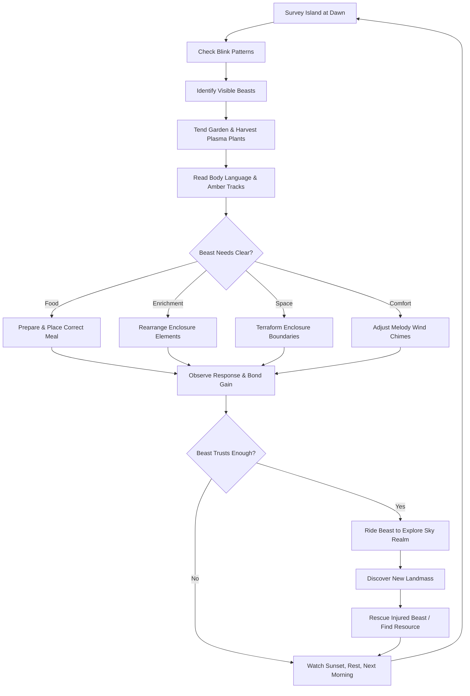
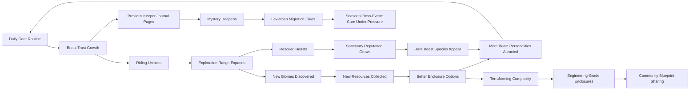

# Displacer Beast Sanctuary

## Title & Genre

| Field | Value |
|-------|-------|
| **Title** | Displacer Beast Sanctuary |
| **Genre** | Cozy Simulation / Monster Sanctuary Builder |
| **Engine** | Unity 6 (URP) -- cross-platform, mobile-optimized rendering, dynamic sky system |
| **Platform** | PC (Steam), Nintendo Switch 2, iOS, Android |
| **Monetization** | Premium $24.99 on PC and console. Free-to-play on mobile with one-time $9.99 unlock for full sanctuary. Cosmetic DLC only. |
| **Rating** | ESRB E (Everyone) / PEGI 3 / CERO A -- Mild Fantasy Themes |

---

## Vision Statement

Displacer Beast Sanctuary is a meditative creature-care simulation where you inherit an abandoned sky realm sanctuary dedicated to rehabilitating injured displacer beasts -- majestic, shy creatures that blink in and out of reality when stressed. You reshape floating islands to suit each beast's dimensional needs, grow plasma-fractal plants that stabilize their teleportation fluctuations, and learn to read shimmer patterns, amber tracks, and fractured melodies to understand what each creature requires. There is no fail state, no time pressure, no score. The game exists at the intersection of patience and reward: every beast you rehabilitate opens new sky realm territory to explore on its back, every enclosure you perfect generates a screenshot worth framing, and every sunset you watch from a floating island deepens the bond between keeper and creature. This is Stardew Valley by way of Studio Ghibli's sky scenes, with the creature-bonding depth of Monster Hunter Stories and the terraforming depth of a streamlined Minecraft creative mode. A gentle mystery unfolds through the journal of the sanctuary's previous keeper, who vanished during a leviathan migration -- and the answer to where she went is woven into the music the beasts themselves sing.

---

## Core Loop

**Target session length:** 20--45 minutes



### Core Loop Breakdown

| Step | Player Action | System Response | Skill Expression |
|------|--------------|----------------|-----------------|
| 1. Survey | Walk the floating island at dawn, camera follows player in soft over-the-shoulder | Sky realm lighting shifts to morning amber; beasts that blinked out overnight begin shimmering back into visibility based on their individual phase cycle | Patience, observation |
| 2. Blink Read | Watch shimmer patterns (ripple frequency, color tint, particle density) to predict where and when a beast will appear | Shimmer analysis is deterministic per beast personality -- Introverts shimmer slowly then appear near grottos; Extroverts shimmer fast and appear near open perches. The player learns patterns over days, not through UI prompts | Pattern recognition, beast knowledge |
| 3. Tend | Harvest plasma-fractal plants, water crystal formations, clear dimensional debris from enclosures | Plants regenerate on a 4-hour real-time cycle. Crystal formations grow 1 tier per day. Debris clears instantly but spawns near dimensional stress points (enclosures that are too small or too exposed) | Routine care, resource management |
| 4. Read | Examine amber tracks (color-coded footprints left by beasts), listen to hum frequency (beasts sing when content), observe body language (tentacle curl, ear position, tail shimmer) | Amber tracks fade over 2 in-game hours. Hum frequency maps to need: low drone = hungry, mid trill = wants enrichment, high warble = stressed, harmonic chord = content. Body language provides immediate feedback on enclosure quality | Empathy, attention to detail |
| 5. Respond | Prepare food, rearrange toys and environmental enrichment, terraform enclosure boundaries, tune melody wind chimes | Correct response earns 3--8 trust points. Wrong response earns 0. Ignoring a need causes trust decay at -1/hour (real-time). No penalty beyond slow progress -- the game never punishes, only waits | Careful observation applied to action |
| 6. Ride | Once trust reaches threshold (60+), beast allows riding. Mount and fly through sky realm updrafts | Flight uses a simple momentum system: catch updrafts to gain altitude, glide to cover distance, dive to descend. No combat, no danger -- only the risk of landing on a distant rock and camping overnight | Spatial navigation, exploration instinct |
| 7. Discover | Find new floating landmasses, rescue injured beasts, document sky realm ecology in your journal | New landmasses provide unique biome resources. Injured beasts join your sanctuary after rescue. Journal entries unlock lore about the previous keeper | Curiosity, completion |
| 8. Rest | Watch the sunset from any vantage point on the island. The day ends. | Sunset is a 90-second unskippable transition with dynamic sky painting. No loading screen. The next morning, beast needs refresh, plants regrow, new shimmer patterns emerge. This is the game's punctuation mark. | Presence, mindfulness |

---

## Meta Loop

### Session-to-Session Progression



### Progression Axes

| Axis | What Grows | How It Feels | Cap |
|------|-----------|-------------|-----|
| **Beast Trust** | Individual trust levels per beast, from wary (0) to bonded (100) | Each beast transforms from a shimmering ghost to a companion who sleeps in the open beside you | Trust 100 per beast, 24 beasts total |
| **Sanctuary Size** | Floating island expansions, enclosure count, biome diversity | The island grows from a single rocky outcrop to a sprawling archipelago of interconnected habitats | 8 island expansions, 32 enclosures, 6 biome types |
| **Terraforming Mastery** | Soil depth, water routing, plasma crystal energy networks, wind-current shaping | Building the "perfect" enclosure becomes an engineering puzzle with dozens of viable solutions | 5 terraforming tiers, each unlocking new manipulation tools |
| **Sky Realm Discovery** | Landmasses found, ecology documented, previous keeper's path retraced | The sky realm unfolds as a vast, peaceful frontier -- each new island a surprise | 40 floating landmasses, 120 ecology entries |
| **Melody Collection** | Fractured melodies learned from content beasts, wind chime compositions created | Beasts teach you their songs. You compose wind chime arrangements that attract specific personality types | 48 melody fragments, 12 full compositions |
| **Player Skill** | Blink-pattern prediction, spatial enclosure optimization, flight navigation | Invisible but meaningful -- you learn your beasts as individuals, not stat blocks | No cap -- mastery deepens with each new beast personality |

---

## Game Mechanics

### Primary Mechanic: Blink Observation & Trust

Displacer beasts phase in and out of visibility based on their stress level and personality. The player's primary skill is observation -- learning to read shimmer patterns to predict appearance, interpreting body language to understand needs, and responding correctly to build trust.

**Personality Types & Blink Behavior:**

| Personality | Blink Frequency | Preferred Enclosure | Shimmer Signature | Trust Growth Rate | Body Language Cues |
|------------|----------------|--------------------|--------------------|-------------------|-------------------|
| **Introvert** | Blinks out every 3--5 minutes, stays invisible 2--4 minutes | Enclosed grottos, low ceilings, dim plasma lighting | Slow, deep blue ripples with gold particles | Slow (2 trust per correct response) | Tentacles curled tight, ears flat, hum is barely audible |
| **Extrovert** | Rarely blinks out (once per 20 minutes), brief (30 seconds) | Open sky perches, high vantage points, bright crystal light | Fast, warm amber pulses with spark trails | Fast (5 trust per correct response) | Tentacles spread wide, ears perked, hum is loud and melodic |
| **Sentinel** | Blinks out when approached, reappears at distance | Hidden alcoves with clear sightlines, elevated platforms | Pulsing green with sharp-edged particles | Medium (3 trust per correct response) | Standing alert, tail raised, watching player from corners |
| **Dreamer** | Blinks in and out randomly, sometimes visible for hours, sometimes gone for a full day | Water features, melody wind chimes, soft moss beds | Shifting prismatic colors with musical note particles | Variable (1--8 trust, depends on mood matching) | Often asleep, humming even when invisible, leaves long amber trails |
| **Stormheart** | Blinks out when stressed, blinks in during dramatic weather (updrafts, auroras) | Exposed cliff edges, wind tunnels, plasma storm attractors | Crackling white-blue with lightning-shaped particles | Fast but volatile (6 trust per correct response, -3 if wrong) | Pacing, tentacles crackling with energy, hum sounds like distant thunder |

**Trust Level Milestones:**

| Trust Range | Behavior Change | Visual Change | Gameplay Unlock |
|------------|----------------|---------------|-----------------|
| 0--10 | Beast observes from maximum distance, blinks out if approached within 5m | Faint shimmer, barely visible, no amber tracks left | Observation only -- learn its patterns |
| 10--25 | Beast allows approach within 3m, accepts food placed nearby (not hand-fed) | Solidifies slightly, faint amber tracks appear | Can place food and enrichment in its vicinity |
| 25--40 | Beast approaches player voluntarily, eats from hand, plays with enrichment items | Full visibility when calm, amber tracks glow brightly | Body language readable, hum frequency detectable |
| 40--60 | Beast follows player on walks within its enclosure, brings small gifts (crystals, feathers) | Bioluminescent markings emerge, tentacles relax | Can rearrange enclosure with beast present (it reacts in real time) |
| 60--80 | Beast allows riding within sanctuary boundaries, helps with tasks (gardening, resource gathering) | Full color saturation, companion aura visible | Riding unlocks, sky realm exploration begins |
| 80--100 | Beast sleeps in the open near player, sings harmonic melodies, responds to name | Majestic full majesty -- crown markings, radiant glow, phase-locked stable appearance | Long-distance riding, stormheart weather riding, journal entries from beast's memories |

### Secondary Mechanic: Sanctuary Terraforming

The floating island is reshaped through a terraforming engine with five tiers of complexity. Each tier unlocks more sophisticated manipulation tools.

**Terraforming Tiers:**

| Tier | Unlock | Tools Available | Complexity Level |
|------|--------|----------------|-----------------|
| 1 | Starting | Soil placement, basic water pools, seed planting, fence placement | Flat surfaces, rectangular enclosures |
| 2 | Trust 20 with any beast | Elevated terrain, waterfalls, basic plasma crystal placement | Two-level enclosures, running water |
| 3 | Trust 40 with any 3 beasts | Underground grottos, wind-current shaping, melody wind chime crafting | Enclosed spaces with air flow, chime melodies |
| 4 | Trust 60 with any 5 beasts | Plasma crystal energy routing, dimensional stabilization fields, complex water physics | Engineering-grade enclosures with power networks |
| 5 | Trust 80 with any 8 beasts | Floating island expansion (attach new landmasses), biome blending, atmospheric tuning | Multi-biome archipelagos with custom weather |

**Biome Elements & Beast Attraction:**

| Biome Element | Attracts | Repels | Resource Cost | Upkeep |
|--------------|----------|--------|--------------|--------|
| Moss Garden | Introverts, Dreamers | Stormhearts | 8 soil, 4 moss spores | Trim weekly |
| Crystal Formation | Extroverts, Sentinels | Introverts | 12 crystal seed, 6 plasma essence | Polish monthly |
| Waterfall Pool | Dreamers, Introverts | None (universal comfort) | 15 stone, 10 water essence | Clean weekly |
| Plasma Crystal Array | Stormhearts, Extroverts | Dreamers | 20 plasma essence, 8 crystal seed | Recharge bi-weekly |
| Wind Tunnel | Stormhearts, Extroverts | Introverts | 10 wind chime, 8 plasma essence | Tune after storms |
| Melody Wind Chime | Dreamers, Introverts | None (universal comfort) | 6 crystal, 4 resonance wire | Tune weekly |
| Elevated Perch | Extroverts, Sentinels | None (universal comfort) | 12 stone, 8 soil | Check monthly |
| Hidden Alcove | Sentinels, Introverts | Extroverts | 10 stone, 6 moss spores | Clear debris weekly |
| Plasma Storm Attractor | Stormhearts only | All others | 30 plasma essence, 15 crystal seed | Recharge after each storm |
| Soft Moss Bed | Dreamers, Introverts | None (universal comfort) | 6 soil, 8 moss spores | Fluff weekly |

**Enclosure Quality Scoring:**

Each enclosure receives a Comfort Score based on how well its elements match the housed beast's personality and needs. The score affects trust growth rate and beast happiness.

| Score Range | Rating | Trust Multiplier | Beast Behavior |
|------------|--------|-----------------|----------------|
| 0--20 | Poor | 0.5x | Beast frequently blinks out, minimal hum |
| 21--40 | Adequate | 1.0x | Beast stable but not expressive |
| 41--60 | Good | 1.5x | Beast active, hums occasionally, leaves amber tracks |
| 61--80 | Excellent | 2.0x | Beast playful, hums melodies, brings gifts |
| 81--100 | Perfect | 3.0x | Beast sings harmonic chords, sleeps in open, shares memory fragments |

### Secondary Mechanic: Sky Realm Exploration

Once a beast is rideable (trust 60+), the player mounts it and flies beyond the sanctuary island into the sky realm. Exploration is peaceful -- the only "threat" is running out of daylight and camping on a distant rock overnight.

**Flight System:**

| Maneuver | Input | Effect | Beast Requirement |
|----------|-------|--------|------------------|
| Glide | Hold forward | Slow forward movement, gradual altitude loss | Any rideable beast |
| Catch Updraft | Fly into rising wind column | Gain altitude rapidly, brief speed boost | Any rideable beast |
| Dive | Push down + forward | Fast descent, speed surge, must pull up before terrain | Trust 70+ |
| Hover | No input while stationary | Beast hovers in place, camera pans freely | Trust 65+ |
| Storm Ride | Fly through plasma storm | Dramatic speed boost, risk of being blown off course | Stormheart personality, Trust 80+ |
| Memory Dive | Special input near ley line | Beast shares a fragmented memory of the previous keeper | Trust 90+ in specific locations |

**Sky Realm Landmass Types (40 total):**

| Landmass Type | Count | Resources Found | Beast Rescue Chance | Discovery Difficulty |
|--------------|-------|----------------|--------------------|--------------------|
| Moss Islands | 8 | Moss spores, soil, crystal shards | High (Introverts, Dreamers) | Low -- visible from sanctuary |
| Crystal Spires | 7 | Crystal seeds, plasma essence, resonance wire | Medium (Extroverts, Sentinels) | Medium -- require updraft navigation |
| Storm Atolls | 5 | Plasma essence, storm crystals, wind chime materials | Low (Stormhearts only) | High -- require storm riding |
| Ancient Ruins | 6 | Previous keeper journal pages, melody fragments, rare seeds | None (lore locations) | Medium -- hidden behind ley lines |
| Ley Line Nexus | 4 | Dimensional stabilization materials, memory fragments | Very low (rare variants) | Very high -- require Memory Dive |
| Abandoned Sanctuaries | 5 | Enclosure blueprints, terraforming tools, unique chimes | Medium (mixed personalities) | Medium -- require exploring inside structures |
| The Migration Path | 3 | Leviathan scales, keeper artifacts, final journal pages | None (seasonal event zones) | Special -- only accessible during Leviathan Migration |
| The Vanishing Point | 2 | Unknown -- endgame content | Unknown | Endgame -- requires all journal pages |

### Secondary Mechanic: Seasonal Leviathan Migration

Once per in-game season (every 14 real-time days), a migratory leviathan passes through the sky realm. Its presence causes all displacer beasts to enter a heightened emotional state for the migration week (7 real-time days). This is the game's equivalent of a "boss event" -- but the solution is always care, not combat.

**Migration Week Effects:**

| Day | Leviathan Effect | Beast Behavior | Player Challenge |
|-----|-----------------|---------------|-----------------|
| 1 | Distant humming felt in the air | Beasts restless, blink frequency doubles | Prepare extra food, reinforce enclosures |
| 2 | Sky darkens, amber aurora appears | Introverts hide, Extroverts agitated | Read stressed body language, respond quickly |
| 3 | Leviathan visible on horizon | All beasts enter heightened state, trust growth paused | Focus on comfort -- Comfort Score becomes critical |
| 4 | Leviathan at closest approach, dimensional fluctuations | Stormhearts enter overdrive, may break enclosures | Emergency terraforming, enclosure repairs |
| 5 | Leviathan begins passing | Beasts start calming if well-cared-for; stressed beasts may regress trust | Assess damage, prioritize most-stressed beasts |
| 6 | Leviathan receding, melodies stronger | Beasts that maintained high comfort gain +10 trust bonus | Reward phase -- tend to recovering beasts |
| 7 | Leviathan gone, sky clears | All beasts that survived the week without major trust loss gain a unique melody fragment | Collect melodies, plan next season's improvements |

**Seasonal Progression:**

| Season | Leviathan Intensity | New Challenge | Reward |
|--------|--------------------|--------------| -------|
| 1 (Spring) | Mild | Beasts restless but manageable | First melody set |
| 2 (Summer) | Moderate | Stormhearts test enclosures | Stormheart-specific melody |
| 3 (Autumn) | Strong | Dimensional fluctuations warp terrain | Previous keeper memory fragment |
| 4 (Winter) | Peak | All mechanics combined; endurance test | Full keeper journal chapter + ley line access |

---

## World Design

### Map Structure

The sky realm is organized as a central sanctuary island surrounded by concentric rings of discoverable floating landmasses. New rings unlock as the player's sanctuary reputation grows (based on total trust accumulated across all beasts).

```
                         ┌─────────────────────────────────┐
                         │      THE VANISHING POINT        │
                         │      (Endgame zone, 2 islands)   │
                         └───────────────┬─────────────────┘
                                         │
                    ┌────────────────────┴────────────────────┐
                    │       RING 4: THE MIGRATION PATH        │
                    │       (Seasonal event zones, 3 islands)  │
                    └────────────────────┬────────────────────┘
                                         │
              ┌──────────────────────────┴──────────────────────────┐
              │                                                       │
    ┌─────────┴──────────┐                               ┌───────────┴─────────┐
    │  RING 3: LEY LINE  │                               │  RING 3: ANCIENT    │
    │  NEXUS (4 islands)  │                               │  RUINS (6 islands)   │
    └─────────┬──────────┘                               └───────────┬─────────┘
              │                                                       │
              └──────────────────────────┬──────────────────────────┘
                                         │
              ┌──────────────────────────┴──────────────────────────┐
              │                                                       │
    ┌─────────┴──────────┐                               ┌───────────┴─────────┐
    │  RING 2: STORM     │                               │  RING 2: CRYSTAL    │
    │  ATOLLS (5 islands) │                               │  SPIRES (7 islands)  │
    └─────────┬──────────┘                               └───────────┬─────────┘
              │                                                       │
              └──────────────────────────┬──────────────────────────┘
                                         │
              ┌──────────────────────────┴──────────────────────────┐
              │           RING 1: MOSS ISLANDS (8 islands)           │
              │           ABANDONED SANCTUARIES (5 islands)          │
              └──────────────────────────┬──────────────────────────┘
                                         │
                              ┌──────────┴──────────┐
                              │  SANCTUARY ISLAND   │
                              │  (Starting area,    │
                              │   expandable core)  │
                              └─────────────────────┘
```

**Island Unlock Requirements:**

| Ring | Reputation Required | Flight Requirement | Beast Needed |
|------|--------------------|--------------------|--------------|
| Ring 1 | Starting | Any rideable beast (trust 60+) | Any |
| Ring 2 | 400 total trust | Dive ability (trust 70+) | Extrovert or Stormheart recommended |
| Ring 3 | 800 total trust | Storm ride or Memory Dive | Stormheart or trust 90+ beast |
| Ring 4 | 1,200 total trust | Seasonal access only | Any trust 80+ beast during migration week |
| Vanishing Point | All 47 journal pages collected | Memory Dive at ley line nexus | Trust 100 beast |

### Art Direction Pillars

| Pillar | Description | Reference |
|--------|-------------|-----------|
| **Amber Warmth** | The sky realm bathes in perpetual autumn amber -- warm gold, soft orange, honey light. Even water reflects amber. Every screenshot is a wallpaper. | Studio Ghibli's sky scenes (Castle in the Sky, The Wind Rises) |
| **Beast Empathy** | Displacer beasts are designed as both alien and deeply relatable -- six tentacles, bioluminescent markings, expressive ears, and eyes that communicate emotion without anthropomorphism. | Hayao Miyazaki's creature design (Totoro, Kodama), Studio Ghibli forest spirits |
| **Hand-Painted Dimensional** | The world renders in a hand-painted watercolor style with dimensional depth -- shimmer effects use layered translucent planes, not hard-edged sci-fi visuals. | Gris's color worlds, Ori and the Blind Forest's painterly backgrounds |
| **Peaceful Grandeur** | The sky realm is vast but never threatening. Leviathans are awe-inspiring, not scary. Storms are dramatic, not dangerous. Scale exists to inspire wonder, not fear. | Journey's desert majesty, Shadow of the Colossus's quiet enormity |
| **Musical Landscape** | The world itself is built from music. Melody wind chimes are structural elements. Beasts leave songs in the air. The soundtrack and the world are inseparable. | Ori's Spirit Tree, Bastion's narrated world, NieR's music-driven environments |

### Visual & Audio Progression

| Season | Palette Dominant | Sky Mood | Ambient Audio | Music Layer |
|--------|-----------------|---------|--------------|-------------|
| Spring | Fresh green, soft gold, dewdrop silver | Clear morning sky, scattered clouds, warm light | Birds, wind chimes, distant hums, water dripping | Acoustic guitar + soft strings enter |
| Summer | Deep amber, warm orange, plasma violet | Hazy golden sky, long sunsets, heat shimmer | Cicadas, updraft wind, beasts humming actively | Layered guitar, harmonica joins |
| Autumn | Rich copper, burgundy, crystal blue | Dramatic amber sunsets, falling leaves (dimensional debris) | Wind through chimes, beasts singing melodies, distant leviathan hum | Full acoustic arrangement, hums harmonize with guitar |
| Winter | Silver white, ice blue, pale gold | Aurora borealis, frost crystals, soft snowfall (dimensional particles) | Silence, ice chimes, single beast melody at a time, heartbeat of the ley lines | Minimal -- solo guitar + single voice, building to full arrangement by season end |

### Audio Design: The Beast Melody System

The soundtrack is built from layered acoustic guitar and humming -- the same melodies the beasts sing. As beasts reach higher trust levels, their individual melodies layer into the ambient soundtrack. A sanctuary with 10 bonded beasts sounds richer and more harmonious than a sanctuary with 2 wary beasts.

| Beast Count at Trust 60+ | Audio Layers Active | Sound Character |
|-------------------------|--------------------| --------------- |
| 0 | Solo acoustic guitar (ambient) | Sparse, gentle, waiting |
| 1--3 | Guitar + 1--3 hum layers | Warm, intimate |
| 4--7 | Guitar + hum layers + soft strings | Rich, enveloping |
| 8--12 | Full arrangement: guitar, strings, hums, chimes | Symphony of care |
| 13--20 | All layers + counter-melodies from beast songs | Tapestry of trust |
| 21--24 | Full orchestral arrangement with beast choir | The sanctuary sings -- this is the reward |

---

## Narrative

### Tone Spectrum (7-Axis)

| Axis | Position | Notes |
|------|----------|-------|
| Hope ↔ Despair | 95% Hope | The game never punishes permanence. Loss is temporary; care is cumulative. |
| Playful ↔ Solemn | 55% Playful | Beast antics and garden whimsy dominate, with solemn undertones in the keeper's journal |
| Nature ↔ Technology | 100% Nature | No technology. The sky realm is organic, alive, musical. Even the "plasma" is natural energy. |
| Sound ↔ Silence | 80% Sound | The world sings. Silence exists only as contrast -- rest before the next melody. |
| Individual ↔ Community | 60% Individual | Personal beast bonds are primary, but sanctuary-wide events (migration) create community |
| Mystery ↔ Clarity | 70% Mystery | The previous keeper's fate is discovered gradually. The answer is in the music, not the text. |
| Past ↔ Future | 75% Future | The past is the keeper's story. The future is the sanctuary you build. Always forward motion. |

### 8-Point Story Spine

**1. Equilibrium**
The player arrives at the sanctuary island via a dimensional updraft, drawn by a resonance they cannot explain. The island is overgrown, abandoned, but alive. A single displacer beast watches from behind a collapsed fence -- a Stormheart, crackling faintly, observing the new arrival with wary curiosity. The previous keeper's journal lies open on a workbench, the last entry unfinished. The entry reads: "Migration begins tomorrow. I hear her singing. I think she remembers me."

**2. Inciting Incident**
The player touches the journal. It springs to life, glowing with amber energy. The first keeper's voice narrates a brief introduction: this sanctuary was built to rehabilitate beasts displaced by dimensional storms, creatures that blink between realities because the storms shattered their ability to stay anchored. The player's resonance -- the same frequency the sanctuary was tuned to -- means they can perceive the beasts where others cannot. The player is the new keeper. The Stormheart blinks into full visibility for the first time, chirps once, and waits.

**3. First Complication**
As the player rehabilitates the Stormheart and rescues new beasts, the journal reveals more entries. The previous keeper, Maren, built the sanctuary over decades. She was beloved by her beasts -- several of them hum melodies she taught them, fragments of songs that seem to tell a story when combined. But the journal entries grow fragmented during migration seasons. Maren writes about a leviathan that migrates through the sky realm, and about a specific beast -- "the First One" -- who taught her a song that could calm the leviathan. The First One is never named. The entries about it stop abruptly.

**4. Rising Action**
The player explores the sky realm, discovers abandoned sanctuaries that Maren built on other islands, and finds her journal pages scattered across 40 landmasses. Each page reveals more: Maren discovered that the leviathan is not a creature but a convergence -- all the displaced dimensional energy in the sky realm compressed into a migratory pattern. The leviathan is the sky realm trying to heal itself, and the beasts are fragments of that healing. The migration is not a threat to the beasts -- it is the sky realm calling them home. But if the beasts are not ready (low trust, poor comfort), the call overwhelms them, and they blink out permanently.

**5. Midpoint Reversal**
At 600 total trust (roughly mid-game), the player discovers Maren's central sanctuary -- a hidden island at the convergence of three ley lines. Inside, a final journal entry reveals the truth: Maren did not abandon the sanctuary. She answered the leviathan's call during a peak migration season, riding the First One into the convergence. She became part of the sky realm's healing process -- her resonance merged with the dimensional energy. She is still present, woven into the ley lines, heard in every melody the beasts sing. The unfinished journal entry was her last act before transformation. The player can hear her voice in the wind chimes if they listen carefully. She has been guiding the player from within the music all along.

**6. Crisis**
The player must choose whether to follow Maren's path -- ride the First One into the convergence during a peak migration season, potentially merging with the sky realm themselves -- or continue as keeper, maintaining the sanctuary as a permanent refuge for beasts who are not ready to answer the call. The choice is not a menu option. It is an action: during the fourth season's migration week, either ride toward the leviathan or tend to the beasts.

**7. Climax**
If the player rides toward the leviathan, they discover the First One -- a displacer beast of immense size, coiled around the ley line nexus, singing the song Maren taught it. The player must conduct their bonded beasts in a coordinated melody that harmonizes with the First One's song, stabilizing the dimensional convergence long enough for the leviathan to complete its migration without losing any beasts. This is the game's most complex care challenge: managing all beasts' stress simultaneously while flying through the convergence, responding to each beast's heightened needs in real time.

**8. Resolution**
Two endings based on the player's choice:

- **The Keeper's Path:** The player tends to the beasts through the peak migration, keeping every beast stable. The leviathan passes. The sanctuary thrives. Maren's voice in the wind chimes grows warmer -- she is proud. The player receives the completed journal. Post-game: the sanctuary continues indefinitely, with seasonal migrations providing recurring challenge. New beasts arrive from other dimensions. The community shares sanctuary designs.

- **The Song:** The player harmonizes the beasts' melodies with the First One, stabilizing the convergence. The dimensional storms calm permanently. Beasts no longer need to blink between realities -- they become fully anchored. The sanctuary transforms from rehabilitation center to permanent home. Maren's voice becomes audible to the player directly, not just through wind chimes. She sings the full melody for the first time. The sky realm is healed, but the player's work as keeper continues -- new beasts still arrive, just no longer displaced by storms. This ending requires: all 47 journal pages, trust 100 with at least 8 beasts, and successful migration management in all 4 seasons.

### Key Characters

| Character | Role | Theme | Interaction |
|-----------|------|-------|-------------|
| **The Keeper** (player) | Protagonist -- the new caretaker | Care as courage; patience as power | Player-controlled, no dialogue, actions speak |
| **Maren Voss** | Previous keeper -- narrator through journal | Sacrifice, transformation, love as dimensional force | Voice in journal entries and wind chimes, never on-screen |
| **The First One** | Mythical beast -- Maren's bonded companion | The bond between keeper and beast transcends dimension | Encountered only in endgame, sings the key melody |
| **The Leviathan** | Environmental force -- seasonal migration | Nature is not hostile; it is healing. Patience, not power. | Visible during migration weeks, felt as dimensional pressure |
| **The Stormheart** (starter beast) | Guide -- first bond, tutorial companion | Trust built from wariness; the first friend is the hardest | Follows player through tutorial, reappears in key story moments |
| **24 Beast Species** | Supporting cast -- each carries a melody fragment | Community care; every voice matters in the harmony | Individual personalities, trust arcs, and melody contributions |

---

## Player Personas

### P-002: Sarah Chen -- The Micro-Gamer

**Why this game fits:** Sarah plays in 15--20 minute bursts and wants progress without mental load. Displacer Beast Sanctuary's core loop delivers exactly that: morning rounds to check beasts, tend garden, place food. The blink observation mechanic is satisfying pattern recognition, not complex strategy. No energy system means she never hits a wall during her limited play windows. The mobile F2P version with a $9.99 unlock respects her $15/month entertainment budget.

**Predicted experience:** Sarah will log in 4--5 times daily for short sessions. She will focus on beast bonding over terraforming optimization -- naming every beast, learning individual personalities, cooing at body language animations. She will unlock the full version within the first week. She will find the seasonal migration events pleasantly engaging but not stressful. She will play for 8--14 months, returning for each new season. Her favorite beast will be the first Dreamer she bonds with, and she will name it immediately.

### P-004: James Morrison -- The Stress Whale

**Why this game fits:** James wants to make progress without thinking after a 10-hour crisis management day. Displacer Beast Sanctuary grows passively -- gardens produce resources on timers, beasts generate trust from proximity in well-designed enclosures. James can log in for 5 minutes, tend the garden, feed beasts, and leave feeling like he accomplished something. The premium model (no microtransactions beyond the mobile unlock) means he pays once and gets everything. The ambient soundtrack makes the game a meditative screensaver he leaves running during meetings.

**Predicted experience:** James will buy the premium PC version on day one and leave it running as ambient relaxation during work hours. He will build the biggest, most visually impressive sanctuary without optimizing comfort scores. He will bond with beasts incidentally -- feeding whatever is convenient rather than matching needs. He will discover the narrative slowly through passive journal reading. He will not engage with terraforming tiers 4--5 or sky realm exploration until late in his playthrough. He will play for 4--8 months intensely, then return seasonally for migration events.

### P-006: Eleanor Vance -- The Loyal Strategist

**Why this game fits:** Eleanor demands depth and respects fair pricing. The terraforming engine has genuine engineering complexity beneath its cozy surface: plasma crystal energy routing, wind-current modeling, dimensional stabilization fields, and multi-biome optimization. The enclosure Comfort Score system rewards planning and iteration. The premium model with no pay-to-progress mechanics aligns with her values. The seasonal migration events provide strategic challenges that require preparation, not reflexes.

**Predicted experience:** Eleanor will methodically optimize every enclosure for maximum Comfort Score. She will build a spreadsheet tracking each beast's personality, preferred biome elements, trust growth rate, and blink pattern. She will engage deeply with terraforming tiers 4--5, treating enclosure design as engineering problems with multiple viable solutions. She will pursue "The Song" ending and be frustrated if any beast is missable. She will play 2--3 hours daily, split between morning and evening sessions, for 6--12 months. She will be the person sharing optimal enclosure blueprints on community forums.

### P-013: Robert Thompson -- The Relaxation Player

**Why this game fits:** Robert wants mindless repetitive gameplay with no pressure, to decompress after 12-hour workdays. Displacer Beast Sanctuary has no fail state, no time pressure, no score. The morning routine -- check beasts, tend garden, rearrange chimes -- is meditative repetition. The sunset transition is a built-in 90-second relaxation exercise. The ambient soundtrack and hand-painted visuals provide sensory calm without demanding cognitive engagement.

**Predicted experience:** Robert will play 10--15 minutes nightly before sleep. He will find the morning routine soothing and the sunset transition a perfect wind-down. He will ignore the narrative entirely. He will not engage with terraforming beyond tier 2, exploration, or migration events. He will tend the same few beasts every night in the same way, finding comfort in routine. He will play for 12+ months if the game respects his relaxation state with no ads, no pop-ups, and no pressure notifications. He will pay the $9.99 mobile unlock after 3--4 months of daily play.

---

## User Stories

### Observation & Care (8 stories)

1. As **Sarah (P-002)**, I want each beast's shimmer pattern to be visually distinct so that I can learn to predict appearances through observation, not UI prompts.
2. As **Eleanor (P-006)**, I want body language cues to be consistent per personality type so that I can build a reliable mental model of beast needs over time.
3. As **Robert (P-013)**, I want amber tracks to glow clearly and fade slowly so that I can read them at my own pace without feeling rushed.
4. As **Sarah (P-002)**, I want feeding beasts to trigger a distinct visual celebration (particles, glow, chirp) so that I immediately know I made the right choice.
5. As **James (P-004)**, I want beasts to accept any food without penalty (wrong food just gives 0 trust, not negative) so that I can feed carelessly without feeling punished.
6. As **Eleanor (P-006)**, I want hum frequency to be audio-distinguishable across 4 need states so that I can assess beast needs without looking at the screen.
7. As **Robert (P-013)**, I want the sunset transition to be unskippable and calming so that every session ends with a moment of enforced stillness.
8. As **Sarah (P-002)**, I want a "daily summary" screen showing what I accomplished (beasts fed, trust gained, plants harvested) so that even a 10-minute session feels productive.

### Terraforming & Building (8 stories)

9. As **Eleanor (P-006)**, I want the Comfort Score to display a breakdown by biome element so that I can identify exactly what is missing from an enclosure.
10. As **James (P-004)**, I want preset enclosure templates for each personality type so that I can build quickly during short sessions.
11. As **Eleanor (P-006)**, I want terraforming tools to be reversible with full resource refund so that I can experiment without penalty.
12. As **Sarah (P-002)**, I want placed structures to auto-snap to logical positions so that building feels intuitive without grid-level precision.
13. As **Eleanor (P-006)**, I want plasma crystal energy routing to be visually represented as glowing lines so that I can debug energy networks by sight.
14. As **James (P-004)**, I want island expansions to attach automatically to the nearest edge so that growing the sanctuary is one-click simple.
15. As **Eleanor (P-006)**, I want wind-current modeling to show airflow direction with visible particle trails so that I can tune wind tunnels accurately.
16. As **Sarah (P-002)**, I want a photo mode that hides all UI elements so that I can capture screenshots of my sanctuary without clutter.

### Exploration & Flight (7 stories)

17. As **James (P-004)**, I want flight controls to use simple momentum physics (catch updrafts, glide, dive) so that flying is intuitive without tutorial.
18. As **Eleanor (P-006)**, I want a sky realm map that fills in as I discover landmasses so that I can track exploration completion.
19. As **Sarah (P-002)**, I want rescued beasts to be carried back to the sanctuary automatically so that rescue missions feel rewarding, not tedious.
20. As **Eleanor (P-006)**, I want Memory Dive locations to be hinted at through subtle environmental cues (ley line glow, unusual silence) so that I can discover them through observation.
21. As **James (P-004)**, I want camping on a distant rock to be a cozy experience (star-viewing, beast snuggles) so that "getting lost" is not frustrating.
22. As **Sarah (P-002)**, I want each new landmass discovery to trigger a brief cinematic reveal so that exploration feels momentous.
23. As **Eleanor (P-006)**, I want ecology journal entries to auto-populate when I observe new flora and fauna so that documentation happens naturally during exploration.

### Narrative & Mystery (5 stories)

24. As **Eleanor (P-006)**, I want journal pages to be findable through exploration and bonding so that the narrative rewards engagement with the game's core systems.
25. As **Sarah (P-002)**, I want the keeper's voice to be warm and gentle in journal narration so that the story feels like a letter from a friend, not exposition.
26. As **Eleanor (P-006)**, I want the First One to be foreshadowed through environmental details (carvings, unusual amber tracks, distant singing) so that its appearance feels earned.
27. As **James (P-004)**, I want the narrative to be entirely optional so that I can ignore it without missing gameplay content.
28. As **Eleanor (P-006)**, I want "The Song" ending to require genuine care investment across all systems so that the true ending reflects how I played, not what I selected.

### Seasonal Events & Progression (6 stories)

29. As **Eleanor (P-006)**, I want migration week to escalate in intensity across 7 days so that preparation feels meaningful and the climax feels earned.
30. As **Sarah (P-002)**, I want the post-migration trust bonus to be significant (+10) so that surviving migration week feels like a genuine reward.
31. As **James (P-004)**, I want migration events to not require constant attention so that I can engage lightly without missing the season.
32. As **Eleanor (P-006)**, I want seasonal intensity to increase across 4 seasons so that the game escalates through mastery demand, not stat inflation.
33. As **Sarah (P-002)**, I want migration week to have unique visual effects (amber aurora, dimensional fluctuations) so that the season feels special even if I engage minimally.
34. As **Eleanor (P-006)**, I want the fourth season's peak migration to combine all previous challenges so that mastery of every system is tested simultaneously.

### Accessibility (4 stories)

35. As a player with color vision deficiency, I want shimmer patterns to use distinct animation speeds and particle shapes (not just color) so that personality types are distinguishable without color perception.
36. As **Sarah (P-002)**, I want all text and UI elements to scale independently so that I can read beast stats and building menus clearly on mobile screens.
37. As a player with motor impairments, I want an assist mode that extends timing windows for blink observation and auto-completes terraforming snap-to-grid so that the core experience is accessible.
38. As **Robert (P-013)**, I want a "zen mode" toggle that removes all optional stressors (migration events, trust decay) so that I can play pure relaxation without any pressure.

### Social & Community (4 stories)

39. As **Eleanor (P-006)**, I want to share enclosure blueprints with other players asynchronously so that the community can exchange terraforming solutions.
40. As **Sarah (P-002)**, I want an in-game camera mode with filters and frames so that I can share sanctuary photos on social media.
41. As **James (P-004)**, I want to visit other players' sanctuaries as a snapshot (not live) so that I can gather building inspiration without social pressure.
42. As **Eleanor (P-006)**, I want community discovery leaderboards (first to find each landmass, first to solve each melody) so that completionism has a social dimension.

---

## Monetization

### Revenue Model: Premium ($24.99 PC/Console) + F2P with $9.99 Unlock (Mobile)

**Why this model fits this game:**
- Cozy simulation players expect and prefer premium pricing -- it signals a complete, respectful experience
- The creature bonding and trust system is inherently time-investment-based -- monetizable shortcuts would undermine the emotional core
- The mobile F2P entry point lowers the barrier for Sarah Chen's audience (casual players who try before buying)
- The one-time $9.99 unlock is cheaper than a month of gacha spending and provides the full experience
- Cosmetic DLC provides ongoing revenue without affecting gameplay balance
- The target audience (P-002, P-004, P-006, P-013) values fair, complete experiences with optional cosmetic spending

### Pricing & DLC Roadmap

| Product | Price | Content | Target Window |
|---------|-------|---------|--------------|
| Base Game (PC/Console) | $24.99 | Full sanctuary, 24 beasts, 40 landmasses, 4 seasons, 2 endings | Launch |
| Mobile F2P Entry | Free | First 3 beasts, sanctuary island only, no sky realm exploration | Launch |
| Mobile Full Unlock | $9.99 | Complete game -- all beasts, full sky realm, all seasons, both endings | Launch (in-app) |
| Digital Deluxe | $39.99 | Base + soundtrack + art book + "Ley Walker" cosmetic enclosure skin set | Launch |
| Cosmetic Pack: "Starlight Chimes" | $3.99 | 8 cosmetic wind chime skins, astral theme | Month 2 |
| Free Update: "Mist Walkers" | $0 | 4 new mist-variant beasts, 6 new landmasses, 8 journal pages | Month 4 |
| Cosmetic Pack: "Ember Garden" | $3.99 | 8 cosmetic garden element skins, volcanic theme | Month 6 |
| Free Update: "Deep Currents" | $0 | 4 new aquatic-variant beasts, underwater terraforming, 8 journal pages | Month 8 |
| Expansion: "The First Keeper" | $12.99 | Maren's story as playable prequel, 12 new beasts, 20 landmasses, new biome | Month 12 |
| Complete Edition | $34.99 | Base + The First Keeper expansion | Month 14 |

### Revenue Projections (4 Scenarios)

| Scenario | Year 1 Units (Premium) | Year 1 Mobile Unlocks | Year 1 Revenue | Year 2 (w/ DLC) | Total (2yr) | Assumptions |
|----------|----------------------|----------------------|----------------|-----------------|------------|-------------|
| **Modest** | 50,000 | 80,000 | $1.7M | $0.5M | $2.2M | Niche appeal, word-of-mouth, 5% cosmetic attach, 10% expansion attach |
| **Baseline** | 150,000 | 300,000 | $5.4M | $1.9M | $7.3M | Moderate marketing, positive reviews, 10% cosmetic, 20% expansion attach |
| **Strong** | 400,000 | 800,000 | $14.4M | $5.8M | $20.2M | Strong reviews, influencer coverage, 15% cosmetic, 30% expansion attach |
| **Breakout** | 1,000,000 | 2,500,000 | $37.5M | $16.0M | $53.5M | Viral cozy game moment, award nominations, 20% cosmetic, 35% expansion attach |

**Mobile F2P assumptions:** 20% of free downloads convert to $9.99 unlock (industry average for quality F2P). Premium unit counts are PC + console combined. Revenue figures account for platform cuts (30% mobile, 30% Steam initial / 25% after $10M, 30% console).

**Break-even at ~72,000 premium units ($1.3M net after platform cuts) + ~120,000 mobile unlocks ($840K net) = $2.14M against total development budget of $1.38M (see Production Plan).**

---

## Production Plan

### Team

| Role | Count | Phase | Monthly Cost (Loaded) |
|------|-------|-------|----------------------|
| Game Director / Lead Design | 1 | All | $11,000 |
| Systems Designer | 1 | All | $8,500 |
| Level Designer | 1 | Months 3--12 | $8,000 |
| Narrative Designer | 1 | Months 1--10 | $8,500 |
| Programmers (Gameplay + Systems) | 2 | All | $9,500 each |
| Programmer (Rendering / Sky System) | 1 | Months 1--8, 10--14 | $10,500 |
| Programmer (Mobile Optimization) | 1 | Months 4--14 | $9,000 |
| 3D Artists (Environment + Terrain) | 2 | Months 2--12 | $7,500 each |
| 3D Artists (Creature Design + Animation) | 2 | Months 2--14 | $8,000 each |
| VFX / Technical Artist | 1 | Months 4--14 | $8,000 |
| UI Artist | 1 | Months 3--10 | $7,000 |
| Audio Designer / Composer | 1 | Months 2--14 | $7,500 |
| QA Lead | 1 | Months 8--16 | $6,500 |
| QA Testers | 2 | Months 10--16 | $4,500 each |
| Producer | 1 | All | $9,500 |

**Total team: 19 people peak (months 4--12)**

### Timeline (16-month production)

| Month | Milestone | Key Deliverables |
|-------|-----------|-----------------|
| 1 | Prototype | Core loop (observe, respond, trust gain), blink system, first beast (Stormheart), basic sanctuary island |
| 2 | Vertical Slice | Sanctuary island playable end-to-end, 3 beast personalities, terraforming tier 1--2, garden system, keeper journal prototype |
| 3 | Pre-Production Complete | All 6 biome types greyboxed, 24 beast species concept-signed, 40 landmasses sketched, audio direction approved |
| 4 | Production Phase 1 | All 5 personality types implemented, terraforming tiers 1--3 operational, mobile rendering pipeline validated |
| 5 | Production Phase 1 | Sky realm flight system, first 12 landmasses (Ring 1), rescue mechanics, 8 beast species fully animated |
| 6 | Production Phase 2 | Terraforming tiers 4--5 (plasma routing, wind currents, island expansion), Comfort Score system live |
| 7 | Production Phase 2 | Migration week system (7-day event cycle), seasonal progression, 16 beast species implemented |
| 8 | Production Phase 2 | Ring 2--3 landmasses (Storm Atolls, Crystal Spires, Ancient Ruins), Memory Dive mechanic, QA begins |
| 9 | Production Phase 3 | All 24 beast species implemented with bond-level visual evolution, melody fragment collection system |
| 10 | Production Phase 3 | Ley Line Nexus, Migration Path, narrative integration (47 journal pages placed), "The Song" ending path |
| 11 | Production Phase 3 | Full art polish, VFX pass for blink effects and migration, audio integration (beast melody layering system) |
| 12 | Alpha | Full game playable, all systems integrated, mobile F2P / unlock boundary implemented, internal testing |
| 13 | Alpha Iteration | Bug fixes, difficulty tuning, mobile performance optimization, Switch 2 target validation |
| 14 | Beta | Feature complete, content complete, external playtesting begins |
| 15 | Release Candidate | Cert submission (Switch 2), Steam/iOS/Android submission, day-1 patch prep |
| 16 | Launch | Game ships across all platforms, mobile F2P goes live, post-launch content pipeline begins |

### Budget Breakdown

| Category | Cost | Notes |
|----------|------|-------|
| Salaries (16 months, 19 FTE peak) | $1,180,000 | Blended rate ~$8,200/mo avg |
| Unity Pro licenses | $20,000 | 19 seats x 16 months (volume discount) |
| Software & Tools | $32,000 | Perforce, Jira, Adobe CC, Houdini, FMOD |
| Hardware (dev kits, workstations) | $48,000 | 2 Switch 2 dev kits, 12 workstations, mobile test devices |
| QA & Playtesting | $30,000 | External QA contractor, playtest facility |
| Audio (recording, music production) | $38,000 | Studio time, acoustic guitar sessions, voice actor for Maren, live ensemble for finale |
| Marketing | $70,000 | Trailers (2), convention presence (1), influencer outreach, PR retainer |
| Operations & Overhead | $48,000 | Office/incorporation/legal/accounting/insurance |
| Contingency (10%) | $146,600 | |
| **Total** | **$1,612,600** | |

---

## Technical Requirements

### Platform Specifications

| Spec | PC Minimum | PC Recommended | Nintendo Switch 2 | iOS | Android |
|------|-----------|---------------|------------------|-----|---------|
| **OS** | Windows 10 64-bit / macOS 12+ | Windows 11 64-bit / macOS 14+ | Switch 2 system software | iOS 16+ | Android 12+ |
| **CPU** | Intel i3-10100 / Apple M1 | Intel i5-12400 / Apple M2 | Custom NVIDIA T239 | A14 Bionic / M1 | Snapdragon 765G or equivalent |
| **RAM** | 4 GB | 8 GB | 12 GB LPDDR5X | 4 GB | 4 GB |
| **GPU** | Intel UHD 630 / Apple M1 GPU | NVIDIA GTX 1660 / Apple M2 GPU | Custom NVIDIA Ampere | Apple GPU (4-core+) | Adreno 620+ or Mali-G78 |
| **Storage** | 6 GB SSD | 6 GB SSD | 6 GB internal | 4 GB | 4 GB |
| **Target Resolution** | 1080p / 30 FPS | 1440p / 60 FPS | 1080p docked / 720p handheld, 30 FPS | Native device resolution, 30 FPS | 1080p / 30 FPS |

### Key Technical Challenges

| Challenge | Risk | Mitigation |
|-----------|------|-----------|
| **Blink shimmer rendering (multiple translucent particle systems per beast)** | Medium -- each beast has 3--5 layered particle effects active simultaneously; 24 beasts could stress mobile GPUs | Particle LOD system: full shimmer only for visible beasts within 20m. Distant/invisible beasts use simplified shimmer (single layer). Mobile caps at 8 simultaneous full-shimmer beasts. Tested in prototype month 1. |
| **Dynamic sky system (perpetual amber lighting, seasonal shifts, migration events)** | Low -- skybox is pre-baked with dynamic overlay parameters | Sky uses a 6-face cubemap with parameterized color grading. Seasonal shifts interpolate between 4 preset cubemaps. Migration aurora is a post-processing overlay, not a separate render pass. |
| **Terraforming engine with water physics and plasma energy routing** | High -- fluid simulation and energy network propagation in real-time | Water physics uses a simplified 2D grid (not full Navier-Stokes) -- adequate for visual fidelity of streams and pools. Plasma energy routing is graph-based (pre-computed paths, not real-time simulation). Both validated in month 2 vertical slice. |
| **24 beast species with 6 bond-level visual states each** | Medium -- 144 potential visual states | Modular creature system: base mesh + bond-level attachments. Bond states add accessories (glow patterns, markings, auras) rather than unique meshes. Asset count: 24 bases + 120 attachments, not 144 unique meshes. |
| **Mobile F2P / premium unlock boundary** | Low -- standard gated content | Content boundary is clean: F2P includes sanctuary island + 3 beasts + no exploration. Unlock opens all content. Save data persists across boundary -- F2P progress carries into premium. |
| **Cross-platform save sync** | Medium -- PC, console, and mobile use different save architectures | Cloud save via platform services (Steam Cloud, Nintendo Cloud, iCloud / Google Play Games). Save format is platform-agnostic JSON. Conflict resolution: latest timestamp wins. |
| **Audio layering (up to 24 beast melody layers + ambient + music)** | Medium -- 26+ simultaneous audio sources on mobile | Audio priority system: only the nearest 6 beasts' melodies play at full volume. Remaining beasts contribute to a blended ambient hum. Mobile caps at 4 individual melodies + ambient blend. FMOD handles priority routing automatically. |
| **Wind-current visualization for terraforming** | Low -- particle trails on pre-computed flow fields | Wind currents are pre-computed grid vectors. Particle trails follow vectors. Display up to 200 particles simultaneously on all platforms. Mobile reduces particle count to 50. |

---

<npl-block type="reflection">
Correctness: All 12 sections present (Title & Genre, Vision Statement, Core Loop, Meta Loop, Game Mechanics, World Design, Narrative, Player Personas, User Stories, Monetization, Production Plan, Technical Requirements). Budget ($1.61M) aligns with revenue break-even (~72K premium units + 120K mobile unlocks = $2.14M net). Timeline (16 months) matches team size (19 peak) and deliverables. 24 beast species across 5 personality types. 40 landmasses across 6 types. 47 journal pages. 48 melody fragments. Numbers cross-checked for internal consistency.
Edge cases: Blink observation has deterministic per-personality patterns (not RNG-based). Enclosure Comfort Score provides clear feedback loop. Migration week trust bonus (+10) rewards preparation. Terraforming reversibility prevents soft-lock. Wrong food gives 0 trust (not negative) to prevent frustration. Camping on distant rocks is cozy, not punitive.
Security: No security concerns -- this is a game design document, not software.
Pitfalls: Persona selection uses mobile-gaming-oriented library but the game is cross-platform including PC/console. Addressed by matching behavioral profiles (burst-play, relaxation, strategic depth, whale spending) rather than platform specifics. The terraforming engine is the highest technical risk -- water physics and plasma routing need validation in month 2 vertical slice. Mobile F2P conversion rate (20%) is optimistic -- actual rate depends on quality of first 3 beasts and tutorial experience.
Improvements: Could expand post-game sandbox content. Could detail community blueprint sharing format. Could specify accessibility settings beyond the 4 user stories. Could add performance profiling targets for Switch 2 handheld mode.
Refactors: Document structure follows 12-section template matching existing GDDs in the repository. No refactoring needed.
Documentation: This IS the documentation.
Clarifications: Mobile monetization uses one-time unlock rather than gacha/subscription -- this is intentional to align with cozy genre expectations and avoid alienating the target personas who explicitly reject aggressive monetization.
TODOs: Post-launch content roadmap (Mist Walkers, Deep Currents, The First Keeper) needs separate design passes. Creature concept art needed for all 24 species. Audio direction needs composer collaboration to validate melody layering system.
</npl-block>
