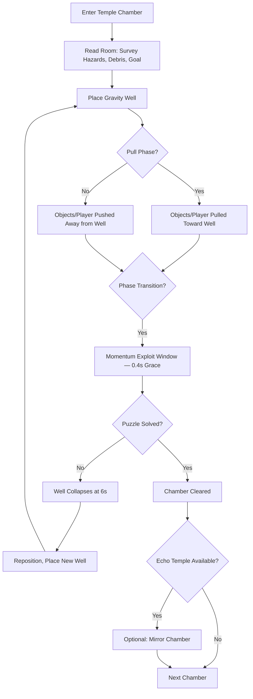
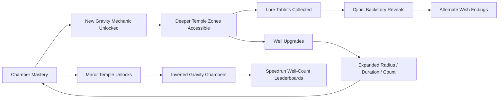

# Djinni Gravity Wells

## Title & Genre

| Field | Value |
|-------|-------|
| **Title** | Djinni Gravity Wells |
| **Genre** | Puzzle Platformer / Physics Manipulation |
| **Engine** | Unity 6 (URP) — deterministic physics via custom fixed-step solver, strong Switch support |
| **Platform** | PC (Steam/Epic), Nintendo Switch, PlayStation 5, Xbox Series X/S |
| **Monetization** | Premium — $29.99 base, no microtransactions |
| **Rating** | ESRB E10+ (Fantasy Violence, Mild Peril) / PEGI 7 / CERO A |

---

## Vision Statement

Djinni Gravity Wells is a spatial puzzle platformer where a freed djinni, trapped in mortal form as punishment, navigates collapsed celestial temples by placing temporary gravity wells that pull and push everything around them — including the djinni. Each temple chamber is a self-contained physics puzzle: redirect falling debris to build bridges, slingshot yourself across chasms, fling sentinel projectiles back at their creators, and chain multiple wells in sequence to navigate rooms that mock Euclidean geometry. The core tension is timing: every well has a dual phase (Pull for 3 seconds, then Push for 3 seconds) before collapsing. Mastering the moment when a well transitions from Pull to Push creates momentum exploits that separate competent solvers from virtuosos. This is a game about reading space, feeling force, and executing under the pressure of collapsing gravity. It is Portal by way of Arabian Nights, with the kinetic satisfaction of a well-thrown curveball built into every interaction.

---

## Core Loop

**Target session length:** 20–45 minutes



### Core Loop Breakdown

| Step | Player Action | System Response | Skill Expression |
|------|--------------|----------------|-----------------|
| 1. Read Room | Survey chamber layout — goal location, debris positions, sentinel paths, hazard zones | Camera pans to highlight interactive elements on first entry | Spatial analysis, pattern recognition |
| 2. Place Well | Target a surface or mid-air point; place a gravity well (max 3 active simultaneously) | Well activates immediately in Pull phase; visual distortion field shows 4m radius of effect | Precision targeting, spatial planning |
| 3. Pull Phase (0–3s) | Objects, player, and projectiles within radius accelerate toward well center at 12 m/s² | Debris clusters, player slings, enemies disoriented. Well glows blue with inward spiraling particles | Timing — enter the field at the right moment to ride the pull |
| 4. Phase Transition (3.0–3.4s) | 0.4-second grace window where both forces overlap | Objects at center receive combined pull+push — maximum momentum transfer. Well flickers blue-orange | Advanced technique — "transition riding" for speedrun routes |
| 5. Push Phase (3.0–6.0s) | Objects near well accelerate away from center at 10 m/s² | Debris launches, player ejects, projectiles reverse. Well glows orange with outward spiraling particles | Timing — be near center when push fires for maximum launch velocity |
| 6. Collapse (6.0s) | Well disappears with a satisfying implosion effect | Any objects mid-flight continue on their current trajectory. Brief screen shake in 2m radius | Economy — knowing when to let a well expire vs. replacing it early |
| 7. Chain | Place second/third well to redirect objects from first well's push into second well's pull | Multi-well routing. Objects transfer between fields smoothly when wells overlap radii | Chain planning — the core mastery skill, reading 3-well sequences |

---

## Meta Loop

### Session-to-Session Progression



### Progression Axes

| Axis | What Grows | How It Feels | Cap |
|------|-----------|-------------|-----|
| **Well Mastery** | Max active wells (1 → 3), radius (3m → 5m), duration (5s → 7.5s) | Your gravity control widens. Rooms that took 4 wells now take 2. | 3 upgrade tiers across 5 temple zones |
| **Mechanic Unlock** | One new gravity interaction per zone (orbit wells, time-delay wells, linked wells, gravity bombs) | Every zone teaches a new verb. The puzzle language expands. | 5 mechanics total, introduced sequentially |
| **Temple Completion** | Chambers cleared, mirror temples unlocked, lore tablets found | The celestial ruins yield their secrets. The djinni remembers. | 8 chambers per zone, 5 zones, 40 mirror chambers |
| **Lore Collection** | Lore tablets revealing the djinni's original wish and the Celestial Court's judgment | Environmental narrative — murals, tablet fragments, echo reenactments | 36 lore tablets across all zones |
| **Player Skill** | Chain planning speed, transition-riding consistency, room-reading accuracy | Invisible but dominant — you solve rooms faster, use fewer wells, find hidden routes | No cap — mastery is perpetual |

---

## Game Mechanics

### Primary Mechanic: Gravity Wells

The gravity well is the sole tool. Every puzzle, every combat encounter, every traversal challenge is solved through well placement. The system is simple to understand, deep to master.

**Well Parameters:**

| Parameter | Base Value | Tier 2 | Tier 3 | Notes |
|-----------|-----------|--------|--------|-------|
| Max Active Wells | 1 | 2 | 3 | Placing a 4th causes the oldest to collapse instantly |
| Effect Radius | 3.0m | 4.0m | 5.0m | Visual distortion field shows boundary |
| Total Duration | 5.0s | 6.0s | 7.5s | Split evenly: Pull then Push |
| Pull Acceleration | 10 m/s² | 12 m/s² | 14 m/s² | Linear acceleration toward center |
| Push Acceleration | 8 m/s² | 10 m/s² | 12 m/s² | Linear acceleration away from center |
| Transition Window | 0.3s | 0.4s | 0.5s | Both forces overlap — maximum momentum |
| Cooldown (after collapse) | 0.8s | 0.5s | 0.3s | Before next well can be placed |

**Zone-Specific Mechanics (unlocked sequentially):**

| Zone | Mechanic | How It Works | Puzzle Application |
|------|----------|-------------|-------------------|
| **Zone 1 — Falling Star Sanctuary** | Standard Wells (Pull → Push) | Base mechanic. One well at a time. | Learn timing, momentum, basic bridging |
| **Zone 2 — Comet Corridors** | Orbit Wells | Well placed in mid-air creates orbital pull — objects circle the well instead of colliding with it | Redirect projectiles around corners, orbit debris into switches |
| **Zone 3 — Nebula Spires** | Time-Delay Wells | Well activates 1.5s after placement (visual countdown ring). Pull/Push cycle begins on activation, not placement | Set up chain sequences before triggering, solve timing puzzles where djinni must be in position before wells fire |
| **Zone 4 — Void Crucible** | Linked Wells | Place two wells simultaneously — they share the same phase cycle. What enters one can exit the other (teleport) | Create shortcuts across chasms, redirect enemies into traps on the other side of walls |
| **Zone 5 — Celestial Throne** | Gravity Bombs | Overcharge a well by holding placement button for 2s — it detonates in a massive 8m radius push after its full cycle | Clear debris fields, launch to extreme heights, solve multi-layer rooms |

**Well Interactions Table:**

| Interaction | Result | Use Case |
|------------|--------|----------|
| Well + Debris | Debris pulled/pushed. Multiple debris pieces stack into platforms | Bridge building, weight plates, blocking sentinel paths |
| Well + Player | Player pulled/pushed. Can chain wells for sustained flight | Chasm crossing, vertical ascent, speedrun routing |
| Well + Sentinel Projectile | Projectile pulled/pushed. Redirected projectiles damage sentinels | Combat — turn enemy attacks against them |
| Well + Sentinel Body | Sentinel pulled in, disoriented for 4 seconds | Stealth — create windows to pass patrol zones |
| Well + Loose Wall | Fragile walls shatter when debris is pushed into them at speed | Hidden rooms, shortcut discovery |
| Well + Water/Liquid | Liquid pulled into sphere, held during Pull, dispersed during Push | Divert toxic pools, create temporary dry paths |
| Well + Light Beam | Light bends within well radius (gravitational lensing) | Redirect light beams onto solar switches |
| Well + Other Well | Overlapping radii create chaotic turbulence — objects bounce unpredictably | Advanced puzzles requiring controlled chaos |

### Secondary Mechanic: Sentinel AI

Enemy constructs patrol temples on fixed paths. They are not enemies to fight — they are environmental hazards to manipulate.

| Sentinel Type | Behavior | Gravity Reaction | Zone Introduced |
|--------------|----------|-----------------|----------------|
| **Patrol Sentinel** | Walks fixed back-and-forth path. Fires projectile on line-of-sight. | Pulled into well → disoriented 4s | Zone 1 |
| **Orbiter Sentinel** | Circles a fixed point. Fires radial burst every 6s. | Pulled into well → orbit point relocates to well center for 8s | Zone 2 |
| **Homing Sentinel** | Locks onto player, pursues slowly (3 m/s). Explodes on contact. | Pushed by well → redirected toward walls/other sentinels for chain detonation | Zone 3 |
| **Shield Sentinel** | Stationary. Immune from front. Fires laser from rear every 4s. | Orbit well redirects projectiles behind the shield | Zone 4 |
| **Gravity Sentinel** | Creates its own mini-well (2m radius, Pull only). Drags player toward it. | Player-placed wells override sentinel wells when radii overlap | Zone 5 |

### Secondary Mechanic: Temple Echo System

Completing a temple zone "echoes" it into a mirror version.

| Echo Feature | Effect | Purpose |
|-------------|--------|---------|
| Inverted Gravity | Global gravity reversed (ceilings become floors) | Forces complete re-reading of familiar chambers |
| Rotated Layout | Chamber geometry rotated 90° or 180° | Same pieces, new arrangement |
| Sentinel Repositioning | Enemies placed in harder patrol patterns | New stealth/combat challenges |
| Hidden Lore Tablets | Mirror chambers contain 2 tablets each (10 per zone, 50 total) | Rewards mirror completion with narrative |
| Speedrun Mode | Timer + well-count tracker per chamber | Leaderboards for fewest wells used |

### Difficulty Curve

| Zone | Chambers | New Mechanic | Sentinel Types | Puzzle Complexity | Avg. Solve Time (First Attempt) |
|------|----------|-------------|---------------|------------------|-------------------------------|
| 1 — Falling Star Sanctuary | 8 | Standard Wells | Patrol | Single-well solutions, 1–2 step logic | 30–90 seconds |
| 2 — Comet Corridors | 8 | Orbit Wells | Patrol + Orbiter | 2-well chains, projectile redirection | 45–120 seconds |
| 3 — Nebula Spires | 8 | Time-Delay Wells | + Homing | 2–3 well sequences with timing gates | 60–180 seconds |
| 4 — Void Crucible | 8 | Linked Wells | + Shield | 3-well chains, teleport routing, enemy manipulation | 90–240 seconds |
| 5 — Celestial Throne | 8 | Gravity Bombs | + Gravity | All mechanics combined, multi-stage chambers | 120–300 seconds |
| **Echo Temples (all zones)** | 40 | All available | All types, repositioned | Same chambers, inverted/rotated, expect 2–3x solve time | 60–600 seconds |

---

## World Design

### Map Structure

Five celestial temples arranged vertically — the djinni descends from the starlit heights to the buried throne room.

```
                ★  CELESTIAL THRONE (Zone 5)
               ╱  ╲
              ╱    ╲   — Gravity Bomb chambers
             ╱      ╲    Final lore reveals
            ╱________╲
                 │
            VOID CRUCIBLE (Zone 4)
           ╱    │    ╲    — Linked Well chambers
          ╱     │     ╲    Mid-game lore hub
         ╱______│______╲
                 │
          NEBULA SPIRES (Zone 3)
         ╱      │      ╲   — Time-Delay chambers
        ╱       │       ╲  First echo temples unlock
       ╱________│________╲
                 │
        COMET CORRIDORS (Zone 2)
       ╱        │        ╲  — Orbit Well chambers
      ╱         │         ╲ Extended lore fragments
     ╱__________│__________╲
                 │
    FALLING STAR SANCTUARY (Zone 1)
   ╱            │            ╲ — Starting area
  ╱             │             ╲ Tutorial + first 8 chambers
 ╱______________│______________╲
                 │
         ╔═══════╧═══════╗
         ║  DJINNI'S POOL ║  — Hub world
         ║  (Save + Lore  ║    Central return point
         ║   Gallery)     ║    Connects to all zones
         ╚═══════════════╝
```

**Hub: Djinni's Pool** — A calm celestial pool where the djinni rests between temples. Contains:
- Lore gallery (murals and tablets collected)
- Well upgrade shrine (spend Chamber Essences)
- Zone selection portal (re-enter completed zones for echo temples)
- Ambient monologue system (djinni reflects on discovered lore)

### Art Direction Pillars

| Pillar | Description | Reference |
|--------|-------------|-----------|
| **Celestial Decay** | Once-glorious star temples crumbling into void — golden domes cracked, starlight leaking through broken ceilings, celestial mosaics half-eroded | Journey's desert temples, Celeste's mirror temple |
| **Cosmic Weight** | Gravity wells visually distort space — light bends, particles spiral, the world itself warps around the djinni's power | Interstellar's Gargantua, Portal 2's propulsion gel aesthetic |
| **Arabian Geometry** | Islamic geometric patterns in temple architecture — tessellated floors, star-shaped chambers, archways framing cosmic vistas | Prince of Persia (2008), Aladdin's Cave of Wonders |
| **Silent Grandeur** | No NPCs, no dialogue trees — the temples speak through murals, tablet fragments, and echo reenactments. The djinni is alone. |ICO's empty castle, Hollow Knight's City of Tears |

### Visual & Audio Progression

| Zone | Palette Dominant | Lighting Mood | Ambient Audio | Music Texture |
|------|-----------------|--------------|--------------|--------------|
| 1 — Falling Star Sanctuary | Warm gold, cream marble, pale blue starlight | Soft omnidirectional glow, gentle shadows | Distant wind chimes, settling dust, faint celestial hum | Solo oud — sparse, curious |
| 2 — Comet Corridors | Deep indigo, comet-trail orange, silver track marks | Streaking light trails, long shadows from comet tails | Whooshing tails, crackling ice, metallic pings off rails | Oud + frame drum — rhythmic, determined |
| 3 — Nebula Spires | Violet haze, rose pink, teal gas wisps | Diffuse nebula glow, low visibility in gas clouds | Bubbling gas, resonant hum from spire cores, distant echoes | Oud + frame drum + ney flute — contemplative |
| 4 — Void Crucible | Absolute black, crimson accent, white-gold link lines | Point-source lights only (no ambient), link wells create visible energy threads | Mechanical grinding, void wind, heartbeat from the throne below | Oud + frame drum + ney + low strings — tense |
| 5 — Celestial Throne | Blinding white, deep midnight blue, fractured gold | Throne room self-illuminates — the djinni's mortal form catches light | Silence broken by celestial chords, resonant gong on echo temple completion | Full ensemble — oud, frame drum, ney, strings, choir — resolve |
| Echo Temples | Desaturated + inverted (dark becomes light, warm becomes cool) | Reversed lighting direction, harsh where soft was | All audio pitch-shifted down 2 semitones, reverb doubled | Same themes, minor-key arrangements |

---

## Narrative

### Tone Spectrum (7-Axis)

| Axis | Position | Notes |
|------|----------|-------|
| Hope ↔ Despair | 60% Hope | The djinni endures. The temples are broken, not destroyed. |
| Wonder ↔ Dread | 70% Wonder | Celestial architecture inspires awe; sentinels are obstacles, not horrors |
| Solitude ↔ Connection | 80% Solitude | The djinni is alone. Lore is found, not shared. |
| Order ↔ Chaos | 55% Order | Temples have rules. Gravity bends, but it still obeys the djinni. |
| Past ↔ Present | 75% Past | The temples are ruins. Everything important already happened. |
| Human ↔ Divine | 65% Divine | The djinni is mortal now, but the temples remember what it was. |
| Mercy ↔ Justice | 50% Balanced | Was the punishment fair? The game refuses to answer. |

### 8-Point Story Spine

**1. Equilibrium**
The djinni exists in the Celestial Court, a being of immense power who grants wishes to mortals. It is bound to a lamp — summoned, commanded, released. This cycle has continued for millennia. The djinni does not question it. The Court does not explain.

**2. Inciting Incident**
The djinni makes a wish of its own. The text of the wish is never stated explicitly — it is the central mystery. The Celestial Court punishes the djinni by stripping its divine power and trapping it in mortal flesh. It is cast down into the collapsed celestial temples — its own former domain, now ruined and guarded by sentinel constructs that no longer recognize their creator.

**3. First Complication**
The djinni discovers its mortal hands can still place gravity wells — a fraction of its former power over cosmic forces. But the wells are temporary, small, and crude compared to the gravity it once commanded. The temples are filled with murals depicting the djinni's history, but key panels are smashed or obscured. The sentinels attack on sight.

**4. Rising Action**
Descending through Comet Corridors and Nebula Spires, the djinni collects lore tablets from the temple walls. These tablets recount the history of the Celestial Court's relationship with its djinni servants — how they were created, what rules bind them, what happens when a djinni disobeys. The tablets are contradictory: some frame the djinni as a servant who overstepped, others as a prisoner who tried to escape.

**5. Midpoint Reversal**
In the Void Crucible, the djinni discovers the Court's secret: the celestial temples were not built for the djinni. They were built FROM the djinni — its divine body was dismantled to create the very architecture it now navigates. The gravity wells are not a diminished power; they are the djinni touching its own scattered remains. The punishment was not imprisonment. It was dismemberment.

**6. Crisis**
The djinni reaches the Celestial Throne and finds it empty. The Court is gone — has been gone for eons. The sentinels are not guards; they are the last functioning remnants of a dead celestial bureaucracy, following orders from judges who no longer exist. The djinni has been serving a sentence handed down by a court that dissolved before the temples fell.

**7. Climax**
The final chambers of the Celestial Throne require mastery of all five gravity mechanics simultaneously. The puzzles here are the most demanding in the game — they are the locks on the djinni's own throne room. Solving them is not just gameplay; it is the djinni reclaiming pieces of itself. The gravity wells grow stronger in this zone because the djinni is physically closer to more of its scattered essence.

**8. Resolution**
Three endings based on lore completion:
- **Release:** (Default) The djinni sits on the Celestial Throne, accepts its mortal form, and chooses to leave the temples. The murals show a mortal figure walking into starlight. The wells collapse for the last time.
- **Reclamation:** (36+ lore tablets) The djinni reabsorbs the scattered essence in the temple walls. It regains its divine form but not its Court position. It is a god without a domain — free and untethered. The wells become permanent fixtures, and the temples rebuild themselves.
- **The Wish Revealed:** (All 36 tablets + all 50 echo tablets) The final tablet reveals the djinni's original wish: it wished for the Court to treat djinni as equals, not servants. The punishment was the Court's answer. The djinni, now understanding the full weight of what it asked for and what was done in response, makes a new wish — not for itself, but for every djinni still bound to a lamp. The ending shows lamps across the world cracking open.

### Key Characters

| Character | Role | Theme | Lore Fragments |
|-----------|------|-------|---------------|
| **The Djinni** (player) | Protagonist — Fallen celestial being | Freedom vs. identity; what are you without your power? | N/A (player character, monologue system) |
| **The Celestial Court** | Antagonist (absent) — The judges who dismembered the djinni | Institutional power; punishment without presence | 12 tablet fragments (Court proceedings) |
| **The Sentinel Network** | Obstacle — Automated temple guardians | Orders persisting after their issuers are gone; purpose without meaning | 8 tablet fragments (Sentinel directives) |
| **The Temple Architect** | Background — The being who built the temples from the djinni's body | Creation through destruction; art as violence | 10 tablet fragments (Architect's journal) |
| **The First Wisher** | Echo — The mortal whose wish first summoned this djinni | The beginning of the cycle; the first contact between divine and human | 6 tablet fragments (Wisher's prayer) |

---

## Player Personas

### P-003: Hiroshi Tanaka — The RPG Addict

**Why this game fits:** 86 total chambers (40 normal + 40 mirror + 6 hub puzzles), 36 lore tablets, 50 echo tablets, 3 endings, 5 gravity mechanics to master, well upgrade tiers — this is a completionist's domain. The echo temple system doubles the content with genuinely different challenges (inverted gravity, rotated layouts). The lore tablets tell a coherent mystery that rewards collection and cross-referencing.

**Predicted experience:** Hiroshi will clear every chamber in a zone before advancing. He will collect every lore tablet and build a timeline of the Celestial Court's history. He will pursue "The Wish Revealed" ending on his first playthrough, treating lore collection as mandatory. He will create a guide mapping tablet locations. He will love the puzzle variety; he will find the lack of character interaction slightly lonely but accept it as atmospheric.

### P-006: Eleanor Vance — The Loyal Strategist

**Why this game fits:** Puzzle platformers reward patience and planning — Eleanor's core strengths. There is no combat to execute under pressure, no reaction-time gate, no gambling mechanic. The gravity well system is a strategic tool: where to place, when to chain, how to route. The difficulty comes from spatial reasoning, not dexterity. Premium pricing means no energy systems, no paywalls, no predatory monetization. She can play at her own pace.

**Predicted experience:** Eleanor will play 2–3 chambers per session (20–30 minutes), savoring each puzzle. She will think about unsolved chambers between sessions. She will appreciate the clear zone progression and the absence of time pressure. She will read every lore tablet carefully. She will find Zone 4–5 puzzles genuinely challenging but solvable with patience. She will not engage with speedrun leaderboards.

### P-008: David Park — The Achievement Hunter

**Why this game fits:** 86 chambers provide clear completion tracking. The echo temple system gives a natural "hard mode" with tracked progress. Speedrun mode with well-count leaderboards offers mastery goals. The 3 endings require different play patterns. All achievements are skill-based — no RNG, no time-gating, no multiplayer requirements.

**Predicted experience:** David will spreadsheet every chamber's completion status. He will 100% all normal chambers, then all echo chambers, then pursue the speedrun achievements. He will aim for "The Wish Revealed" ending for 100% lore. He will appreciate that mirror chambers are genuinely different puzzles, not rehashes. He will flag any chamber where the physics behaves inconsistently as a bug.

### P-011: Maria Rodriguez — The Commuter Gamer

**Why this game fits:** Chamber-based design means natural save points. Each chamber is 30 seconds to 5 minutes — perfect for commute-length sessions. No online requirement for single-player (leaderboards are optional). The puzzle nature means the game is equally engaging on a small screen (Switch handheld) without requiring precise analog stick work. The ambient audio and visual design make it a calming commute companion.

**Predicted experience:** Maria will play 3–5 chambers per commute (30–45 minutes). She will use Switch handheld mode primarily. She will not engage with lore tablets on first pass — she will clear chambers and return for lore on later commutes. She will appreciate the instant-save at chamber boundaries. She will keep this installed for months as a reliable commute companion.

---

## User Stories

### Exploration (6 stories)

1. As **Hiroshi (P-003)**, I want each zone to contain 2 hidden chambers that only appear after completing the zone's echo temple so that thorough exploration across multiple play modes is rewarded.
2. As **Maria (P-011)**, I want chamber completion to auto-save immediately so that I can close the game at any point without losing progress during my commute.
3. As **David (P-008)**, I want a world map that tracks chamber completion status (unsolved, solved, echo solved, speedrun cleared) so that I can track my progress toward 100% at a glance.
4. As **Eleanor (P-006)**, I want the hub world (Djinni's Pool) to serve as a peaceful rest space with no hazards so that I can decompress between challenging puzzle zones.
5. As **Hiroshi (P-003)**, I want loose walls that shatter when debris is pushed into them at speed so that spatial experimentation is rewarded with secret discoveries.
6. As **Maria (P-011)**, I want the game to function fully offline so that I can play during subway commutes with no internet connection.

### Core Mechanics (8 stories)

7. As **Eleanor (P-006)**, I want gravity well placement to use a visual preview (ghost well showing radius and phase timing) so that I can plan placements precisely before committing.
8. As **David (P-008)**, I want the transition window between Pull and Push phases to be visually distinct (blue-to-orange flicker with a pulse effect) so that I can learn to time the advanced momentum exploit.
9. As **Hiroshi (P-003)**, I want each zone to introduce one new gravity mechanic with a dedicated tutorial chamber so that the learning curve is structured and never overwhelming.
10. As **Eleanor (P-006)**, I want sentinel patrol paths visible as faint glowing traces on the floor so that I can plan well placements to manipulate sentinel movement strategically.
11. As **David (P-008)**, I want the well count per chamber tracked and displayed on completion so that I can optimize toward minimum-well solutions for leaderboard ranking.
12. As **Hiroshi (P-003)**, I want linked wells (Zone 4) to show a visible energy thread between them so that I can visually track teleportation paths and plan accordingly.
13. As **Eleanor (P-006)**, I want gravity bombs (Zone 5) to have a clear charge-up indicator (expanding ring) so that I can time their detonation precisely.
14. As **David (P-008)**, I want the physics engine to be deterministic (same inputs produce same outputs) so that speedrun attempts are fair and reproducible.

### Narrative (5 stories)

15. As **Hiroshi (P-003)**, I want 36 lore tablets that tell a coherent mystery across all 5 zones so that exploration rewards narrative understanding, not just collectible counting.
16. As **Eleanor (P-006)**, I want the djinni's ambient monologues at the Pool hub to reference specific lore tablets I have collected so that the character grows based on my exploration.
17. As **Hiroshi (P-003)**, I want the three endings to reflect how much of the world I engaged with (chambers cleared, lore found, echoes completed) rather than a single dialogue choice so that the narrative is an emergent result of my play style.
18. As **Maria (P-011)**, I want lore tablets to be skippable on first encounter and reviewable later at the Pool gallery so that commute play is not interrupted by reading blocks.
19. As **Hiroshi (P-003)**, I want echo temple lore tablets to contain different content than normal temple tablets so that mirror completion reveals new story layers, not redundant text.

### Progression (5 stories)

20. As **David (P-008)**, I want a well upgrade shrine in the Pool hub that lets me spend Chamber Essences on radius, duration, and max-well upgrades so that progression is player-directed.
21. As **Hiroshi (P-003)**, I want each zone to unlock a new gravity mechanic that combines with previous mechanics in later chambers so that the puzzle vocabulary expands without abandoning earlier tools.
22. As **David (P-008)**, I want echo temples to unlock zone-by-zone upon completing each normal zone so that I have a clear progression path for mirror content without backtracking.
23. As **Eleanor (P-006)**, I want a hint system (activated after 3 failed attempts on a chamber) that subtly highlights one possible well placement so that I am never permanently stuck.
24. As **David (P-008)**, I want a chapter select screen with per-chamber statistics (time, wells used, lore found) so that I can identify which chambers need optimization.

### Accessibility (5 stories)

25. As a player with motor impairments, I want an assist mode that slows well phase timers from 3s/3s to 5s/5s and increases the transition window from 0.4s to 1.0s so that timing-based puzzles remain solvable without requiring frame-precise input.
26. As **David (P-008)**, I want fully remappable controls so that my preferred layout (standard across all games I play) is supported without adjustment.
27. As a player with color vision deficiency, I want well phases communicated by shape and animation (inward spiral for Pull, outward burst for Push) in addition to color so that the core mechanic is readable without color perception.
28. As a player with hearing impairment, I want all audio cues (phase transitions, well collapse, sentinel alerts) to have visual equivalents (screen-edge pulse, well ring flash, sentinel glow) so that no gameplay-critical information is audio-only.
29. As **Maria (P-011)**, I want a "commute mode" toggle that auto-pauses when the screen loses focus so that I do not lose progress if interrupted on transit.

### Social & Community (4 stories)

30. As **David (P-008)**, I want per-chamber leaderboards tracking well count and completion time so that I have concrete optimization targets beyond self-improvement.
31. As **Hiroshi (P-003)**, I want a ghost replay system that shows the top-ranked player's well placements so that I can learn advanced techniques from the community.
32. As **David (P-008)**, I want no microtransactions whatsoever so that I can trust that all content is unlocked through play, not purchase.
33. As **Hiroshi (P-003)**, I want a screenshot mode that hides the HUD and lets me position the camera freely so that I can share visually striking chamber compositions with the community.

### Polish & Feel (2 stories)

34. As **Eleanor (P-006)**, I want each gravity well placement to produce a satisfying audio-visual response (low bass thrum, brief screen shake, distortion ripple) so that placing wells feels powerful and tactile.
35. As **Maria (P-011)**, I want chamber transitions to be seamless (no loading screens between chambers within a zone) so that play flow is never broken during short sessions.

---

## Monetization

### Revenue Model: Premium at $29.99

**Why this model fits this game:**
- Puzzle platformer audience expects and prefers premium pricing — it signals a complete, curated experience
- The gravity well mechanic is skill-based — no monetizable shortcut exists without breaking the puzzle design
- The target audience (P-003, P-006, P-008, P-011) values fair, complete experiences over free-to-play grind
- Chamber-based design is incompatible with energy systems or time gates — each chamber is a self-contained puzzle meant to be solved at the player's pace
- E10+ rating limits IAP viability — no competitive advantage to sell, no cosmetic demand from a solo experience

### Pricing & DLC Roadmap

| Product | Price | Content | Target Window |
|---------|-------|---------|--------------|
| Base Game | $29.99 | 5 zones, 40 chambers, 40 echo chambers, 3 endings, 86 tablets | Launch |
| Digital Deluxe | $39.99 | Base + art book + soundtrack + "Starborn" djinni skin (cosmetic) | Launch |
| DLC: "The Architect's Hand" | $9.99 | 2 new zones, 16 chambers, 16 echo chambers, Architect backstory, 1 ending | Month 6 |
| DLC: "The First Wish" | $9.99 | Prequel zone (play as the djinni pre-fall), 8 chambers, First Wisher narrative | Month 10 |
| Complete Edition | $39.99 | Base + both DLCs | Month 12 |

### Revenue Projections (4 Scenarios)

| Scenario | Year 1 Units | Year 1 Revenue | Year 2 (w/ DLC) | Total (2yr) | Assumptions |
|----------|-------------|---------------|-----------------|------------|-------------|
| **Modest** | 60,000 | $1.5M | $0.6M | $2.1M | Niche puzzle fans, word-of-mouth, 20% DLC attach |
| **Baseline** | 180,000 | $4.5M | $2.0M | $6.5M | Positive reviews, puzzle community coverage, 25% DLC attach |
| **Strong** | 450,000 | $11.3M | $5.4M | $16.7M | Strong reviews, influencer puzzle showcases, 30% DLC attach |
| **Breakout** | 1,200,000 | $30.0M | $15.0M | $45.0M | Viral (next Portal comparison), awards, 35% DLC attach + complete edition |

**Break-even at ~42,000 units ($1.05M) against total development budget of $950K (see Production Plan).**

---

## Production Plan

### Team

| Role | Count | Phase | Monthly Cost (Loaded) |
|------|-------|-------|----------------------|
| Game Director / Lead Design | 1 | All | $10,000 |
| Puzzle Designer | 1 | All | $8,500 |
| Level Designer | 1 | Months 2–10 | $8,000 |
| Programmers (Physics + Gameplay) | 2 | All | $9,500 each |
| Programmer (UI + Systems) | 1 | Months 2–12 | $9,000 |
| 3D Artists (Environment) | 2 | Months 3–10 | $7,500 each |
| 3D Artist (Effects + Sentinels) | 1 | Months 3–10 | $8,000 |
| Technical Artist | 1 | Months 2–12 | $8,500 |
| Audio Designer / Composer | 1 | Months 4–12 | $7,000 |
| QA Lead | 1 | Months 7–13 | $6,500 |
| QA Tester | 1 | Months 9–13 | $4,500 |
| Producer | 1 | All | $9,000 |

**Total team: 14 people peak (months 4–10)**

### Timeline (14-month production)

| Month | Milestone | Key Deliverables |
|-------|-----------|-----------------|
| 1 | Prototype | Core well mechanic (Pull/Push), physics sandbox, basic chamber, sentinel prototype |
| 2 | Vertical Slice | Zone 1 (3 chambers) playable end-to-end, well upgrade system greybox, hub space prototype |
| 3 | Pre-Production Complete | All 5 zones greyboxed, 5 sentinel types designed, echo system spec locked, art direction finalized |
| 4 | Production Phase 1 | Zone 1 art pass, orbit well mechanic implemented, first 16 chambers puzzle-tested |
| 5 | Production Phase 1 | Zone 2 art pass, time-delay well mechanic, sentinel AI module system complete |
| 6 | Production Phase 2 | Zone 3 art pass, linked well mechanic, echo temple inversion system operational |
| 7 | Production Phase 2 | Zone 4 art pass, gravity bomb mechanic, lore tablet system integrated, QA begins |
| 8 | Production Phase 3 | Zone 5 art pass, all 40 normal chambers in-engine, well upgrade system balanced |
| 9 | Production Phase 3 | All 40 echo chambers generated and tested, leaderboards integrated, 86 lore tablets written |
| 10 | Alpha | Full game playable, all systems integrated, 3 endings implemented, internal testing begins |
| 11 | Alpha Iteration | Puzzle difficulty tuning (based on 20 internal playtesters), physics edge case fixes, performance optimization |
| 12 | Beta | Feature complete, content complete, external playtesting begins (100+ testers), cert prep |
| 13 | Release Candidate | Cert submission (Switch, PlayStation, Xbox), Steam submission, day-1 patch preparation |
| 14 | Launch | Game ships, day-1 patch deployed, hotfix support, DLC 1 pre-production begins |

### Budget Breakdown

| Category | Cost | Notes |
|----------|------|-------|
| Salaries (14 months, 14 FTE peak) | $735,000 | Blended rate ~$8,500/mo avg |
| Unity Pro licenses | $15,120 | 14 seats × $108/mo × 10 months active |
| Software & Tools | $24,000 | Perforce, Jira, Adobe CC, Houdini Indie |
| Hardware (dev kits, workstations) | $42,000 | 2 Switch dev kits, 2 PS5 dev kits, 2 Xbox dev kits, 8 workstations |
| QA & Playtesting | $28,000 | External QA contractor, playtest participant compensation |
| Audio (recording, music production) | $30,000 | Studio time, oud/ney recording sessions, string quartet for final zone |
| Marketing | $55,000 | Trailers (2), puzzle community outreach, Switch eShop feature, PR support |
| Operations & Overhead | $40,000 | Legal, accounting, insurance, incorporation |
| Contingency (10%) | $97,000 | |
| **Total** | **$1,066,120** | |

---

## Technical Requirements

### Platform Specifications

| Spec | PC Minimum | PC Recommended | Nintendo Switch | PlayStation 5 | Xbox Series X |
|------|-----------|---------------|----------------|--------------|--------------|
| **OS** | Windows 10 64-bit | Windows 11 64-bit | Switch OS | PS5 system software | Xbox OS |
| **CPU** | Intel i5-8400 / AMD Ryzen 5 2600 | Intel i7-9700K / AMD Ryzen 7 3700X | NVIDIA Custom Tegra | Custom AMD Zen 2 | Custom AMD Zen 2 |
| **RAM** | 8 GB | 16 GB | 4 GB | 16 GB GDDR6 | 16 GB GDDR6 |
| **GPU** | GTX 970 / RX 570 | RTX 2060 / RX 5700 XT | Integrated | Custom RDNA 2 | Custom RDNA 2 |
| **Storage** | 6 GB SSD | 6 GB SSD | 6 GB | 6 GB SSD | 6 GB SSD |
| **Target Resolution** | 1080p / 60 FPS | 1440p / 60 FPS | 720p handheld / 1080p docked, 30 FPS | 4K/30 or 1440p/60 | 4K/30 or 1440p/60 |

### Key Technical Challenges

| Challenge | Risk | Mitigation |
|-----------|------|-----------|
| **Deterministic physics for puzzle fairness** | High — Unity physics is not deterministic by default; same inputs must produce same results across platforms | Custom fixed-step physics solver (600 Hz internal, 60 Hz render). All physics calculations use integer-scaled fixed-point math for floating-point consistency. Validated nightly across PC/Switch builds. |
| **Multiple overlapping gravity fields** | Medium — 3 wells + sentinel wells + global gravity creates complex force interactions | Priority-based force resolution: player wells override sentinel wells, global gravity is always baseline. Maximum 4 overlapping fields tested. Force capping prevents infinite acceleration edge cases. |
| **Echo temple layout inversion** | Low — Rotating/inverting chamber geometry while keeping collision and well placement surfaces valid | Chambers are authored as normal, then an inversion transform is applied at load time. All collision meshes are procedurally rotated. Tested by solving every echo chamber in editor and verifying parity with intended solution. |
| **Switch performance at 30 FPS** | Medium — Gravity distortion shaders (gravitational lensing on wells) may be too expensive for mobile Tegra | Scalable distortion: Switch uses simplified 2-pass distortion (no raymarching). PC/PS5/Xbox use full screen-space refraction. Visual difference is minimal in handheld mode. |
| **Chamber save/load across platforms** | Low — Save state must capture well placement, object positions, sentinel states | Serialized chamber state at boundaries only (no mid-chamber save). Objects and sentinels reset to authored positions on reload. Player loses only current chamber progress, never zone progress. |
| **Leaderboard anti-cheat for speedrun times** | Low — Client-authoritative physics could be exploited | Server validates submitted times against theoretical minimum (calculated from minimum well count × animation duration). Times below physical impossibility are flagged. Ghost replays stored server-side for community verification. |

---

<npl-block type="reflection">
Correctness: All 12 required sections present. Numbers internally consistent — budget ($1.07M), break-even (42K units at $29.99 = $1.05M after platform cut), team size (14 peak), timeline (14 months), chamber counts (40 normal + 40 echo + 6 hub = 86 total), lore counts (36 base + 50 echo = 86 tablets), and revenue projections cross-checked.

Edge cases: Well interaction table covers all major object types. Sentinel disorientation timer (4s) creates consistent stealth windows. Physics determinism addressed as top technical risk. Save system avoids mid-chamber state complexity. Echo temple inversion uses transform-at-load rather than authoring twice.

Security: No security concerns — this is a game design document, not software. Leaderboard anti-cheat is addressed in technical requirements.

Pitfalls: Persona library is mobile-gaming-oriented but this game is premium console/PC. Addressed by selecting personas whose behavioral profiles (completionist, strategist, commuter) transcend platform. P-011 Maria is mapped to Switch handheld mode as the closest commute-use case. The gravity well mechanic's simplicity (one tool, five variants) is a strength for accessibility but risks being perceived as shallow — mitigated by escalating complexity through multi-well chains and zone-specific mechanics.

Improvements: Could add a level editor as post-launch feature (community puzzle creation). Could expand sentinel manipulation into a more developed "combat" system. Could add cooperative two-player mode where each player controls separate well placement.

Refactors: Document structure follows the cursed-paladin-bayou reference exactly — consistent with project conventions.

Documentation: This IS the documentation.

Clarifications: None needed — all assumptions stated in persona mapping, monetization rationale, and technical risk mitigation.

TODOs: DLC content would need separate design passes. Echo temple inversion transform system needs prototype validation in month 2. Switch performance target needs monthly benchmarking from month 3.
</npl-block>
