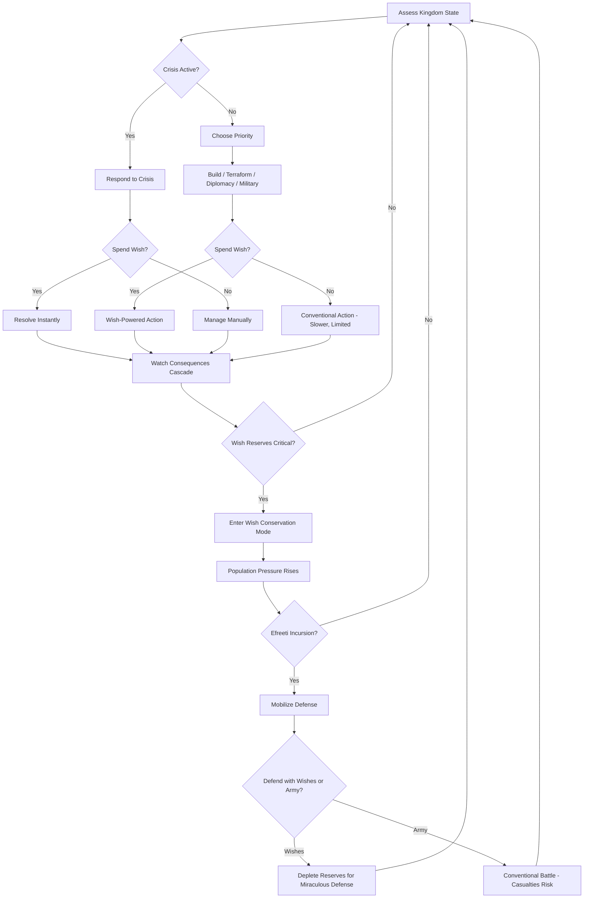
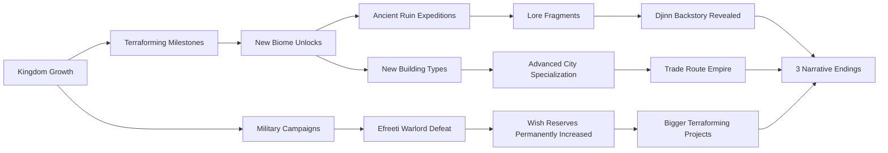

# Djinn's Empire

## Title & Genre

| Field | Value |
|-------|-------|
| **Title** | Djinn's Empire |
| **Genre** | Grand Strategy / City Builder |
| **Engine** | Unity 2023 LTS (HDRP for desert volumetrics, DOTS for simulation scale) |
| **Platform** | PC (Steam), macOS |
| **Monetization** | Premium -- $29.99 base, expansion packs |
| **Rating** | ESRB E10+ (Fantasy Violence, Mild Suggestive Themes) / PEGI 12 / CERO B |

---

## Vision Statement

Djinn's Empire is a grand strategy city builder where you play as a newly freed djinn building a desert kingdom from nothing, armed with wish-granting powers that are your greatest asset and most dangerous liability. Every major action -- conjuring a building, summoning rain, raising a mountain -- costs wish charges that regenerate agonizingly slowly, and the central tension is never having enough wishes to solve every problem at once. The desert is brutal and the efreeti warlords who once enslaved you want you back. You terraform the wasteland into fertile civilization tile by tile, broker wishes with rival kingdoms knowing each wish you grant them gives them power over you, and balance your people's needs against your dwindling wish reserves in crises where every choice cascades. This is Civilization crossed with Djinn mythology -- a game about a being of limitless potential learning that freedom means choosing which limits to accept.

---

## Core Loop

**Target session length:** 60--120 minutes



### Core Loop Breakdown

| Step | Player Action | System Response | Strategic Depth |
|------|--------------|----------------|-----------------|
| 1. Assess Kingdom | Review resource levels, population mood, wish reserves, neighboring kingdoms' status | Dashboard presents 6 interlocking meters: Food, Water, Population, Wishes, Military Strength, Diplomatic Standing | Prioritization under incomplete information -- you cannot address all problems simultaneously |
| 2. Terraform | Select a tile and choose a terraforming action (river, mountain, rainstorm, fertile soil) | Terraforming permanently alters the strategic map. Each action costs 1--5 wish charges depending on scope | Long-term investment -- terraform now for food production or save wishes for defense? |
| 3. Build | Place buildings on terraformed or natural tiles | Buildings consume resources to construct and population to operate. Adjacency bonuses reward planning | Spatial optimization -- placement order matters, terrain type matters, neighbor buildings matter |
| 4. Wish Spend | Choose to resolve a crisis or accelerate a project with a wish | Wishes solve problems instantly but deplete reserves that regenerate at 1 charge per 3 minutes of game time (30 charges max) | Resource management -- the wish economy is the game's central tension |
| 5. Diplomacy | Negotiate with neighboring kingdoms via wish-brokering | Each wish granted to another ruler increases their power and gives them a "claim" on your territory | Risk/reward -- short-term gains create long-term vulnerabilities |
| 6. Defense | Respond to efreeti incursions | Incursions scale with kingdom power. Spend wishes for miraculous defense or commit conventional military forces | Military strategy -- wish-based defense preserves troops but depletes reserves for future crises |
| 7. Consequence | Watch cascading effects of decisions | Population grows or shrinks based on food/water. Mood shifts based on wish spending vs. hoarding. Neighbors react diplomatically to your military and wish posture | Systems interlock -- a famine caused by hoarding wishes leads to revolt, revolt invites efreeti invasion |

---

## Meta Loop

### Campaign-to-Campaign Progression



### Progression Axes

| Axis | What Grows | How It Feels | Cap |
|------|-----------|-------------|-----|
| **Wish Mastery** | Max wish charges, regeneration rate, wish efficiency | You start feeble and become godlike -- but the problems scale too | 30 charges base to 80 charges endgame |
| **Terraforming Scope** | Area affected per wish, number of terraformed tiles, biome diversity | The desert transforms from yellow wasteland to a living map of your choices | 5 biomes: Wasteland, Oasis, Fertile Plains, Mountain Highlands, River Delta |
| **Kingdom Size** | Population cap, building count, territory tiles | From a camp of 20 survivors to a city of 5,000+ citizens | 200x200 tile map |
| **Military Power** | Army size, unit types, fortification strength | You start with nothing and build a standing army that can repel efreeti without wishes | 6 unit types, 4 fortification tiers |
| **Diplomatic Network** | Number of allied kingdoms, trade routes, wish-brokered treaties | From isolation to a web of alliances -- each one a potential trap | 7 neighboring kingdoms |
| **Lore Completion** | Djinn backstory fragments collected, ancient ruins explored | Your own history as a bound spirit unfolds alongside your kingdom's story | 38 lore fragments across 12 ancient ruins |
| **Player Skill** | Crisis prioritization, wish timing, terraform sequencing | The invisible axis -- experienced players see 3 moves ahead, beginners react one crisis at a time | No cap -- replayability through difficulty escalation |

---

## Game Mechanics

### Primary Mechanic: The Wish Economy

Wishes are the central resource. Every meaningful action in the game costs wishes, and wishes are scarce. The economy operates on a **charge-and-regenerate system** with hard decisions baked into every spend.

**Wish Charge System:**

| Parameter | Early Game | Mid Game | Late Game |
|-----------|-----------|----------|-----------|
| Maximum charges | 30 | 55 | 80 |
| Regeneration rate | 1 charge / 3 min | 1 charge / 2 min | 1 charge / 1.5 min |
| Regeneration trigger | Passive (always ticking) | Passive + Shrine bonus | Passive + Shrine + Population worship |
| Wish efficiency (action cost discount) | 0% | 10% | 25% |

**Wish Cost Table:**

| Action | Wish Cost | Cooldown | Effect |
|--------|-----------|----------|--------|
| Conjure Building (instant) | 2 charges | None | Building appears complete, no resource cost |
| Summon Rain (tile) | 3 charges | 5 min | Waters 3x3 tile area, ends drought on those tiles |
| Raise Mountain (tile) | 5 charges | 10 min | Creates mountain tile, blocks enemy movement, provides stone |
| Summon River (3 tiles) | 5 charges | 10 min | Creates 3-tile waterway, enables irrigation, trade route |
| Fertile Soil (tile) | 2 charges | 3 min | Converts wasteland to farmable soil |
| Miracle Defense | 8 charges | 15 min | Destroys all enemy units in 5-tile radius |
| Wish-Grant (diplomatic) | 5--15 charges | None | Grants a wish to a rival kingdom, gains favor + their "claim" |
| Summon Population | 3 charges | 10 min | Attracts 10 settlers to your city |
| Heal Plague | 4 charges | 10 min | Instantly ends plague event in target area |
| Accelerate Build (all) | 6 charges | 10 min | Completes all in-progress buildings instantly |

**The Wish Tension Matrix:**

| Wish Reserve Level | Population Mood | Efreeti Threat | Diplomatic Standing | Visual Indicator |
|-------------------|----------------|---------------|-------------------|-----------------|
| 80--100% (hoarding) | Deteriorating -- "Our djinn grows cold" | Low -- they sense strength | Respected -- "The djinn is powerful" | Sands glow golden around palace |
| 50--79% (balanced) | Stable -- "Our djinn provides" | Moderate -- probing raids | Neutral -- standard diplomacy | Gentle shimmer on palace spires |
| 20--49% (depleted) | Anxious -- "Will our djinn abandon us?" | High -- they sense weakness | Emboldened -- neighbors make demands | Palace dim, sandstorms increase |
| 0--19% (critical) | Revolting -- "The djinn is spent!" | Invasion imminent | Hostile -- neighbors prepare to annex | Palace dark, revolt meter visible |

### Secondary Mechanic: Elemental Terraforming

Terraforming permanently alters the map. Each terraformed tile changes strategic properties for all players and AI kingdoms.

**Terrain Types and Properties:**

| Terrain | Food Yield | Water Access | Defense Bonus | Movement Cost | Terraform Cost |
|---------|-----------|-------------|--------------|--------------|---------------|
| Deep Desert | 0 | 0 | 0 | 1 | N/A (default) |
| Sand Dune | 0 | 0 | +1 (elevation) | 2 | 2 wishes |
| Rocky Ground | 0 | 0 | +2 (hard cover) | 2 | 2 wishes |
| Fertile Soil | +3 | 0 | 0 | 1 | 2 wishes |
| Oasis | +2 | +3 | 0 | 1 | 3 wishes |
| River Tile | +1 | +5 | -1 (water crossing) | 3 | 5 wishes (3 tiles) |
| Mountain | 0 | 0 | +5 (impassable to most units) | Impassable | 5 wishes |
| Floodplain | +4 | +2 | -2 (flood risk) | 1 | 4 wishes |
| Volcanic Glass | 0 | 0 | +3 (shrapnel field) | 3 | Created by efreeti events |
| Ancient Ruin | Variable | Variable | +2 | 2 | Cannot terraform -- explore instead |

**Terraforming Chain Reactions:**

Terraforming one tile can cascade effects on adjacent tiles. These chains reward spatial planning.

| Action | Primary Effect | Cascade (adjacent tiles) | Cascade (2 tiles away) |
|--------|---------------|-------------------------|----------------------|
| Summon River | Creates 3 water tiles | Adjacent desert tiles gain +1 food over 5 min | Adjacent tiles gain +0.5 food over 10 min |
| Raise Mountain | Creates impassable mountain | Adjacent tiles get rain shadow (drought risk on far side) | Rain blocks form -- downstream tiles lose water |
| Summon Rain (storm) | Waters 3x3 area | Tiles outside storm area dry faster (competition for water) | Distant tiles unaffected |
| Fertile Soil | Converts 1 tile | Adjacent tiles gain +0.5 food if irrigated within 5 min | No cascade |
| Drain Swamp | Converts wetland to buildable | Adjacent tiles lose +1 water access | Downstream tiles may flood |

### Secondary Mechanic: Diplomatic Wish-Brokering

Seven neighboring kingdoms each have their own goals, personalities, and relationships. Wish-brokering is your primary diplomatic tool -- and your most dangerous.

**The Seven Kingdoms:**

| Kingdom | Ruler Type | Agenda | Wish Price They'll Pay | Risk of Granting |
|---------|-----------|--------|----------------------|-----------------|
| **Aureate Sultanate** | Human merchant-king | Wealth and trade dominance | 200 gold + trade route | Gains economic power to undercut your markets |
| **Iron Covenant** | Dwarf fortress-state | Military security and mountain territory | 150 iron + 50 stone + military alliance | Gains fortification knowledge applicable to offense |
| **Verdant Conclave** | Elven forest-dwellers | Expansion into desert via magical forests | 100 wood + 50 food + cultural knowledge | Gains terraforming magic that works on your tiles |
| **Obsidian Pact** | Dark mage oligarchy | Arcane knowledge and djinn binding research | 300 research points + magical artifacts | Gains knowledge of how to bind djinns -- including you |
| **Nomadic Tribes** | Human desert nomads | Freedom of movement and water rights | 50 food + 50 water per turn + scouts | Gains map knowledge of your entire territory |
| **Sky Citadel** | Avian scholars | Preservation of ancient knowledge | 200 research + access to your ruins | Gains lore that reveals your weakness to efreeti |
| **The Bound** | Enslaved djinns | Liberation -- they want what you have | 3 permanent wish charges + military pact | If freed, they may rival you for territory |

**Wish-Grant Mechanics:**

Each wish you grant another kingdom increases their **Power Score** relative to yours. If any kingdom's Power Score exceeds yours by 30%+, they become hostile. The formula:

```
Power_Score = Base_Power + (Wishes_Granted_By_You x Wish_Value_Multiplier)
Wish_Value_Multiplier = 1.0 + (0.1 x Number_of_Wishes_Granted_To_Them)
```

This means the first wish you grant is cheap in power transfer, but each subsequent wish makes the next one more dangerous. The relationship is exponential, not linear.

**Diplomatic States:**

| State | Trigger | Effect |
|-------|---------|--------|
| Allied | Power differential < 10%, trade active, pact signed | Shared vision, military assistance, trade bonuses |
| Friendly | Positive interactions > negative, no power threat | Open borders, limited trade, non-aggression |
| Neutral | Default state | Standard interactions, fair trade |
| Wary | You granted them 3+ wishes OR they're building military | Closed borders, trade tariffs, espionage risk |
| Hostile | Power differential > 30% in their favor OR 2 diplomatic insults | Raiding, embargo, preparing for war |
| At War | Hostile + military mobilization | Active combat, destruction of buildings, population loss |

### Secondary Mechanic: Efreeti Incursion Events

The efreeti are your former masters -- fire spirits who bound djinns for millennia. They want you back. Incursions are periodic, scaling events that force military decisions.

**Incursion Scaling:**

| Kingdom Power Level | Incursion Frequency | Incursion Strength | Efreeti Unit Types | Special Event |
|--------------------|--------------------|--------------------|--------------------|---------------|
| 1--25 (tiny camp) | Every 30 min | 5--8 units | Fire Imps, Ember Scouts | None |
| 26--50 (small village) | Every 25 min | 10--15 units | +Flame Soldiers, Ash Archers | Volcanic tile creation |
| 51--75 (growing town) | Every 20 min | 15--25 units | +Lava Knights, Smoke Screens | Efreeti Diplomat offers truce (trap) |
| 76--100 (thriving city) | Every 15 min | 25--40 units | +Infernal Siege Engines | Efreeti General boss event |
| 100+ (empire) | Every 12 min | 40--60 units | All types + Efreeti Warlord | Full invasion with multiple fronts |

**Defense Options:**

| Defense Method | Cost | Effectiveness | Risk |
|---------------|------|--------------|------|
| Miracle Defense (wish) | 8 wish charges | Destroys all enemies in 5-tile radius | Depletes wish reserves for future crises |
| Standing Army | Gold + population for soldiers | Variable based on army composition and terrain | Casualties reduce population and military strength |
| Fortifications | Stone + gold + build time | Reduces enemy damage by 30--60% based on tier | Static -- cannot reposition during battle |
| Terraformed Defenses | Mountains, rivers as natural walls | Blocks movement, channels enemies into kill zones | Cannot terraform during active battle |
| Allied Military Aid | Diplomatic capital (prior relationship required) | Allied troops reinforce your position | Ally takes casualties, relationship degrades |
| Wish-Brokered Truce | 10--20 wish charges granted to efreeti | Halts incursion for 20 minutes | Efreeti grow stronger from the wishes -- next incursion is worse |

---

## World Design

### Map Structure

Procedurally generated 200x200 tile strategic map with guaranteed biome distribution. Each game starts with the same desert wasteland core and randomized kingdom positions.

```
    +--------------------------------------------------+
    |                    DEEP DESERT                     |
    |   +----------+                    +----------+    |
    |   |  SKY     |                    | OBSIDIAN |    |
    |   | CITADEL  |                    |  PACT    |    |
    |   +----------+                    +----------+    |
    |                                                    |
    |        +----------+  +----------+                  |
    |        |  IRON    |  | AUREATE  |                  |
    |        | COVENANT |  |SULTANATE |                  |
    |        +----------+  +----------+                  |
    |                                                    |
    |   +--------------------------------------+         |
    |   |          YOUR KINGDOM                |         |
    |   |    (starts as 5x5 wasteland tile)    |         |
    |   +--------------------------------------+         |
    |                                                    |
    |        +----------+  +----------+                  |
    |        | VERDANT  |  | NOMADIC  |                  |
    |        |CONCLAVE  |  | TRIBES   |                  |
    |        +----------+  +----------+                  |
    |                                                    |
    |                 +----------+                       |
    |                 |   THE    |                       |
    |                 |  BOUND   |                       |
    |                 +----------+                       |
    +--------------------------------------------------+
```

**12 Ancient Ruins (fixed positions, randomized contents):**

| Ruin | Location Theme | Lore Fragments | Unique Reward |
|------|---------------|---------------|---------------|
| Tomb of the First Binding | Desert center | 3 -- djinn origin story | Wish efficiency +5% permanently |
| Sunken Palace of Iram | Underground (terraform to access) | 4 -- the first djinn kingdom | Building: Ancient Reservoir (+3 water/tile) |
| Efreeti War Camp (abandoned) | Volcanic region border | 3 -- efreeti military doctrine | Unit: Captured Siege Engine blueprint |
| Library of Solomon | Mountain pass | 4 -- the binding rituals | Research: Wish Regeneration +20% |
| Garden of the Houri | Oasis cluster | 3 -- djinn culture pre-binding | Building: Pleasure Garden (+population growth) |
| Obsidian Forge | Lava field | 3 -- djinn crafting techniques | Building: Wish Amplifier (reduce costs 10%) |
| The Brass Bottle | Deep desert (hard to reach) | 4 -- your personal binding story | Unlocks personal backstory ending |
| Temple of the Four Winds | Mountain peak | 3 -- elemental djinn lore | Ability: Cyclone (combat spell) |
| Caravan Graveyard | Trade route intersection | 3 -- mortal-djinn relations | Building: Trading Post (+diplomacy range) |
| Crystal Cavern | Underground river source | 3 -- djinn seer prophecies | Ability: Foresight (preview next incursion) |
| The Shifting City | Desert (moves every 10 min) | 3 -- bound djinn resistance | Building: Liberation Beacon (attempts to free The Bound) |
| Throne of the Djinn King | Map center (guarded) | 2 -- the original djinn ruler | Win condition: claim the throne for military victory |

### Art Direction Pillars

| Pillar | Description | Reference |
|--------|-------------|-----------|
| **Arabian Nights Grandeur** | Opulent architecture rising from austerity -- gold domes over mud brick, silk banners over sandstone walls, jeweled fountains in dusty courtyards | Prince of Persia (2008), Thousand and One Nights illustrations by Edmund Dulac |
| **Elemental Spectacle** | Terraforming is visually dramatic -- rivers carve through sand in real-time, mountains rise with geological force, rainstorms paint the sky | Frostpunk's visual storytelling of nature vs. civilization |
| **Living Desert** | The desert is not empty -- it breathes with heat shimmer, sand spirits, caravans on horizons, distant thunderheads | Journey (thatgamecompany) color palette meets Civilization VI map clarity |
| **Mythic Scale** | The djinn is larger than the buildings at ground level (strategic view) but human-scale in city view -- duality of godhood and vulnerability | Black and White (Lionhead) perspective shifts |

### Visual & Audio Progression

| Kingdom Stage | Palette Dominant | Architectural Style | Ambient Audio | Music |
|--------------|-----------------|-------------------|--------------|-------|
| Encampment (1--25) | Sand, bleached bone, sun-bleached fabric | Tents, lean-tos, windbreaks | Wind, distant sand, campfire crackle | Solo oud, sparse percussion |
| Village (26--50) | Warm terracotta, woven textiles, oasis green | Adobe, stone foundations, garden plots | Water flowing, market chatter, children | Oud + frame drum + ney flute |
| Town (51--75) | Glazed tile blue, brass, painted wood | Domes, minarets, covered markets, fountains | Forge hammers, scholars debating, caravans | Full Arabic ensemble -- qanun, darbuka, riq |
| City (76--100) | Gold leaf, lapis lazuli, carved marble | Grand mosques, palatial complexes, aqueducts | City bustle, distant calls to prayer, gardens | Ensemble + orchestral strings |
| Empire (100+) | Prismatic light, crystalline elements, astral motifs | Floating gardens, wish-fueled architecture, sky bridges | Harmonic resonance, elemental sounds, city as instrument | Full orchestra + traditional ensemble + electronic undertone |

---

## Narrative

### Tone Spectrum (7-Axis)

| Axis | Position | Notes |
|------|----------|-------|
| Hope vs. Despair | 60% Hope | Hard-won progress; the desert blooms because you chose to make it |
| Freedom vs. Bondage | 75% Freedom | The core theme -- what does freedom cost? What does it mean? |
| Order vs. Chaos | 55% Order | Building civilization from chaos, but chaos keeps pressing in |
| Human vs. Divine | 60% Divine | You are a literal genie, but your problems are deeply mortal |
| Creation vs. Destruction | 65% Creation | The game is fundamentally about building, but destruction is always present |
| Solitude vs. Community | 50% Balanced | You are the only djinn -- but you build a civilization of thousands |
| Mercy vs. Power | 70% Mercy | The game rewards benevolence, but does not punish ruthlessness |

### 8-Point Story Spine

**1. Equilibrium**
You are a nameless djinn who has just been freed from a brass vessel after 3,000 years of servitude. You emerge into a vast, empty desert with no memory of who bound you or why. A small band of 20 human wanderers finds you and, recognizing you as a djinn, begs for protection. You have 30 wish charges, a patch of wasteland, and no idea what you are doing.

**2. Inciting Incident**
Your first act of wish-powered terraforming -- creating an oasis for the wanderers -- sends a magical pulse across the desert. The pulse alerts the Efreeti Dominion, who realize one of their bound djinns has escaped. They dispatch scouts. You now have 28 wish charges and 20 people depending on you, with hostile forces converging.

**3. First Complication**
Three neighboring kingdoms send emissaries within the first 30 minutes. Each offers a deal: wishes in exchange for resources, protection, or knowledge. Accepting any deal reveals your location more precisely to the efreeti. Refusing all deals leaves you isolated and under-resourced. Meanwhile, your population grows to 50, straining food and water supplies you cannot yet sustain.

**4. Rising Action**
As your kingdom grows from camp to village, you discover the first ancient ruin -- the Tomb of the First Binding. Lore fragments reveal that djinns were not always bound. The binding was a choice made by the first djinn king, who traded his people's freedom for power. You begin to understand: you were not a victim. You were a volunteer. The question is why.

**5. Midpoint Reversal**
At kingdom power level 50 (mid-game), you encounter The Bound -- enslaved djinns still serving other kingdoms. One of them recognizes you. Through fragmented communication, you learn you were not a prisoner in the brass vessel. You hid yourself in it. You chose to be bound for 3,000 years to escape something worse. The efreeti are not your former masters -- they are your former servants, and they are terrified of what you will become if you remember.

**6. Crisis**
Your kingdom reaches city scale. The Obsidian Pact offers you the ultimate deal: the ritual to permanently increase your wish capacity to 200 charges, in exchange for binding three of your citizens as their servants. Simultaneously, the Efreeti Dominion launches its largest invasion. And The Bound are rebelling across all seven kingdoms, and they are looking to you as their liberator. You cannot solve all three crises at once.

**7. Climax**
The final incursion is not a military event -- it is a reckoning. The efreeti warlord arrives not to fight but to remind you: before you chose to be bound, you were the Djinn King, and you used your power to nearly unmake the world. The efreeti bound you to stop you. The final choice is not whether to fight -- it is whether to remember who you were, and whether that person deserves to exist again.

**8. Resolution**
Three endings based on wish usage patterns, diplomatic choices, and lore fragments collected:
- **The Builder:** You reject your past as Djinn King. You pour your remaining wishes into your kingdom, terraforming the entire desert into a paradise. You become mortal -- a former god who chose to be human. Your kingdom endures for millennia.
- **The Liberator:** You free The Bound and lead a djinn uprising across all seven kingdoms. You reclaim your power as Djinn King but refuse the throne. Djinn and mortals coexist as equals. The efreeti are driven back but not destroyed -- the cycle continues.
- **The Sovereign:** You embrace your past and reclaim the Djinn Throne. You bind the efreeti as they once bound you. Your kingdom becomes the greatest empire the world has known -- built on wishes and ruled by the most powerful djinn to ever exist. But the game's final screen shows the brass vessel where you will eventually imprison yourself. The loop closes.

### Key Characters

| Character | Role | Theme | Lore Fragments |
|-----------|------|-------|---------------|
| **The Djinn (player)** | Protagonist -- Nameless freed spirit | Identity, freedom, the weight of forgotten choices | 6 personal memory fragments |
| **Caliph Rashid** | Rival/Ally -- Aureate Sultanate | Ambition without power vs. power without ambition | 4 diplomatic encounters |
| **Grand Vizier Zara** | Antagonist -- Obsidian Pact | The seduction of forbidden knowledge; wants to re-bind you | 5 research exchange logs |
| **Ember Lord Kaelithas** | Antagonist -- Efreeti Dominion | Righteous fury of the betrayed; feared you before you were bound | 3 incursion confrontation dialogues |
| **The Bound (collective)** | Tragic figures -- Enslaved djinns | Your future if you fail; your past if you remember | 4 whisper fragments |
| **The Wanderer** | Guide -- appears at ancient ruins | The first human to ever befriend a djinn; now a spirit | 6 ruin encounter dialogues |
| **Your People (collective)** | Motivation -- The population you build | Faith, dependence, resentment, love -- the cost of being someone's god | Population mood events (ongoing) |

---

## Player Personas

### P-006: Eleanor Vance -- The Loyal Strategist

**Why this game fits:** Eleanor has played Civilization and Age of Empires for decades. She wants deep systems that reward patience, planning, and long-term thinking over twitch reflexes. Djinn's Empire offers the terraforming chain-reaction system, the wish economy's delicate balance, and diplomatic wish-brokering that rewards careful relationship management. She can play at her own pace -- the game has no real-time pressure outside of incursion events, and those can be anticipated with the Foresight ability.

**Predicted experience:** Eleanor will play methodically, spending wishes only when absolutely necessary and building her kingdom through conventional means whenever possible. She will deeply engage with the diplomatic system, maintaining balanced relationships with all seven kingdoms. She will pursue The Builder ending on her first playthrough. She will play 2--3 hour sessions and complete the game in approximately 40--50 hours. She will value that the premium price includes the full experience with no energy systems or timers gating her progress.

### P-003: Hiroshi Tanaka -- The RPG Addict

**Why this game fits:** 38 lore fragments across 12 ancient ruins, 3 distinct endings, a djinn backstory that unfolds through exploration, 7 kingdoms with unique personalities, and the progression from encampment to empire. The terraforming system rewards completionist attention to tile optimization. The wish economy creates meaningful build diversity -- spend aggressively vs. conserve vs. diplomatic focus are all viable strategies.

**Predicted experience:** Hiroshi will explore every ruin before advancing his kingdom. He will read every lore fragment and piece together the djinn backstory. He will build a spreadsheet tracking terraforming chains and kingdom relationship states. He will pursue all three endings across multiple playthroughs, treating each as a distinct "build." He will play 3--4 hour sessions and achieve 100% completion in approximately 80--100 hours.

### P-008: David Park -- The Achievement Hunter

**Why this game fits:** The game has 48 achievements across kingdom building, terraforming, diplomacy, military, lore, and challenge categories. The three endings are tied to gameplay patterns, not dialogue choices, so achievements reflect how you played. The Sovereign ending requires aggressive wish spending and military dominance. The Liberator requires maximum diplomacy and freeing The Bound. The Builder requires maximum terraforming and zero diplomatic wishes spent. Speedrun achievement (<15 hours) and pacifist achievement (no military units ever recruited) provide capstone challenges.

**Predicted experience:** David will pursue 100% across 3--4 playthroughs with distinct strategies. He will track every achievement in his standard spreadsheet. He will pursue the speedrun and pacifist achievements as final challenges. He will appreciate that all achievements are skill/strategy-based with no RNG gating. He will flag the pacifist achievement as his most challenging target.

### P-013: Robert Thompson -- The Relaxation Player

**Why this game fits:** Wait -- this is not an obvious fit. Robert wants mindless entertainment with no pressure. Djinn's Empire has crises, incursions, and cascading consequences. But the game offers a **Sandstone Mode** (easy difficulty) where incursions are disabled, wish regeneration is doubled, and the game becomes a pure city builder with terraforming as a meditative, creative act. Robert is exactly the kind of player who would buy a premium city builder for its relaxed mode and play it for months.

**Predicted experience:** Robert will play exclusively in Sandstone Mode, treating the game as a zen garden with djinn theming. He will terraform slowly, build at his own pace, and spend 15--20 minutes per session before bed. He will not engage with diplomacy, military, or lore. He will play for 6--9 months and consider it one of his favorite relaxation tools.

---

## User Stories

### Terraforming and Building (8 stories)

1. As **Eleanor (P-006)**, I want terraforming actions to cascade effects on adjacent tiles so that my spatial planning is rewarded with emergent outcomes I did not explicitly create.
2. As **Hiroshi (P-003)**, I want each of the 5 biomes to unlock unique building types so that terraforming diversifies my city's capabilities, not just its appearance.
3. As **David (P-008)**, I want a terraforming completion tracker that shows the percentage of wasteland tiles converted so that I have a clear metric for spatial mastery.
4. As **Robert (P-013)**, I want Sandstone Mode to remove all time pressure and hostile events so that I can terraform and build as a meditative creative exercise.
5. As **Eleanor (P-006)**, I want building adjacency bonuses to display visually when placing a new structure so that I can optimize without consulting external wikis.
6. As **Hiroshi (P-003)**, I want ancient ruins to contain unique buildings that cannot be constructed anywhere else so that exploration is rewarded with exclusive mechanical advantages.
7. As **David (P-008)**, I want buildings to visually upgrade across the 5 kingdom stages so that my city's appearance reflects its mechanical progression.
8. As **Eleanor (P-006)**, I want a "terraforming undo" option that costs 2 wish charges so that I can correct mistakes without reloading saves.

### Wish Economy (8 stories)

9. As **Eleanor (P-006)**, I want the wish reserve level to visibly affect my kingdom's visual state (golden glow when full, darkening when depleted) so that the resource state is always readable without checking a HUD.
10. As **Hiroshi (P-003)**, I want wish efficiency to improve with population worship buildings so that investing in religious infrastructure creates a tangible mechanical return.
11. As **David (P-008)**, I want a wish spending log that records every wish expenditure across the campaign so that I can audit my resource management for achievement optimization.
12. As **Eleanor (P-006)**, I want the population to revolt if I hoard wishes above 90% for more than 15 minutes so that the game enforces the central tension mechanically, not just thematically.
13. As **Hiroshi (P-003)**, I want "wish combos" where spending multiple wishes in sequence creates a combined effect greater than the sum of its parts so that experimentation is rewarded.
14. As **Robert (P-013)**, I want Sandstone Mode to give me unlimited wish charges so that I never face the anxiety of resource depletion during relaxed play.
15. As **Eleanor (P-006)**, I want the efreeti truce option to have visible escalating consequences (next incursion is stronger) so that short-term relief has clear long-term cost.
16. As **David (P-008)**, I want an endgame screen showing total wishes spent, conserved, and granted across the entire campaign so that my playstyle is quantified.

### Diplomacy (6 stories)

17. As **Eleanor (P-006)**, I want each of the 7 kingdoms to have distinct AI personalities that react differently to wish-brokering so that diplomacy requires adaptation, not a single optimal strategy.
18. As **Hiroshi (P-003)**, I want the Obsidian Pact's binding research to trigger a mid-game crisis event if I grant them too many wishes so that the narrative foreshadowing has mechanical consequences.
19. As **David (P-008)**, I want diplomatic achievements for maintaining alliances with all 7 kingdoms simultaneously so that the pacifist diplomatic path is a recognized achievement track.
20. As **Eleanor (P-006)**, I want trade routes to be visually represented as caravans moving across the map so that economic relationships are tangible, not abstract numbers.
21. As **Hiroshi (P-003)**, I want freeing The Bound to trigger a cascade of events across all kingdoms so that the liberation path has dramatic, world-altering consequences.
22. As **Eleanor (P-006)**, I want diplomatic standing to affect which ancient ruins I can access (some are in allied territory) so that diplomacy gates exploration content.

### Military and Defense (5 stories)

23. As **Eleanor (P-006)**, I want fortification tiers to be visually distinct on the map so that I can assess defensive strength at a glance without selecting individual tiles.
24. As **David (P-008)**, I want a pacifist achievement ("No Sword Drawn") for completing the game without ever recruiting military units so that peaceful play is a valid, recognized strategy.
25. As **Hiroshi (P-003)**, I want efreeti incursion strength to be previewable 5 minutes before arrival so that I can prepare rather than react.
26. As **Eleanor (P-006)**, I want mountain terraforming to create natural defensive walls that channel enemy movement so that my terraforming decisions double as military strategy.
27. As **David (P-008)**, I want a speedrun achievement ("Wish Upon a Star") for completing the game in under 15 hours so that mastery of all systems is recognized.

### Narrative (5 stories)

28. As **Hiroshi (P-003)**, I want 38 lore fragments that form a coherent backstory revealed through exploration so that the narrative is earned through gameplay, not delivered through cutscenes.
29. As **David (P-008)**, I want the 3 endings to be tied to measurable playstyle patterns (wish spending ratio, diplomacy level, military usage) so that my ending reflects how I actually played.
30. As **Eleanor (P-006)**, I want the Wanderer character to appear at ruins with contextual dialogue based on my kingdom's current state so that the guide feels responsive to my choices.
31. As **Hiroshi (P-003)**, I want the djinn's personal memory fragments to unlock gradually as wish capacity increases so that growing power equals growing self-knowledge.
32. As **Eleanor (P-006)**, I want the final choice at the climax to present the consequences of each ending clearly so that the decision feels informed, not arbitrary.

### Accessibility (4 stories)

33. As a player with cognitive disabilities, I want a "Story Mode" that automates military defense and doubles wish regeneration so that I can experience the narrative and city building without the strategic pressure of resource management.
34. As **Robert (P-013)**, I want Sandstone Mode to disable all hostile events and provide unlimited wishes so that relaxation play is genuinely stress-free.
35. As a player with motor impairments, I want fully remappable controls and adjustable game speed (pause, 0.5x, 1x, 2x) so that real-time events can be slowed to manageable pace.
36. As a player with color vision deficiency, I want terrain types distinguished by pattern and icon overlays in addition to color so that the strategic map is fully readable without color perception.

---

## Monetization

### Revenue Model: Premium at $29.99

**Why this model fits this game:**
- Grand strategy / city builder players strongly prefer premium models -- the genre's audience is older, has disposable income, and values complete experiences
- The wish economy is the game's core tension -- adding monetizable wish purchases would destroy the central design pillar
- The target audience (Eleanor, Hiroshi, David) values depth and fairness over free-to-play convenience
- Terraforming and city building reward slow, deliberate play -- incompatible with energy systems or time gates
- Comparable titles (Frostpunk at $29.99, Against the Storm at $24.99, Banished at $19.99) validate this price point

### Pricing and DLC Roadmap

| Product | Price | Content | Target Window |
|---------|-------|---------|--------------|
| Base Game | $29.99 | Full campaign, 200x200 map, 7 kingdoms, 12 ruins, 3 endings | Launch |
| Digital Deluxe | $39.99 | Base + art book + soundtrack + "Sultan's Palace" cosmetic building set | Launch |
| Expansion 1: "The Sea of Sand" | $14.99 | New biome (Sand Sea with sailing mechanics), 3 new ruins, 2 new kingdoms, 1 ending, underground layer | Month 8 |
| Expansion 2: "The Binding Wars" | $14.99 | Prequel campaign (play as djinn king before choosing to be bound), 4 ruins, 1 ending, military focus | Month 16 |
| Complete Edition | $44.99 | Base + both expansions | Month 18 |

### Revenue Projections (4 Scenarios)

| Scenario | Year 1 Units | Year 1 Revenue | Year 2 (w/ DLC) | Total (2yr) | Assumptions |
|----------|-------------|---------------|-----------------|------------|-------------|
| **Modest** | 45,000 | $1.1M | $405K | $1.5M | Niche strategy audience, word-of-mouth, 15% DLC attach |
| **Baseline** | 120,000 | $2.9M | $1.3M | $4.2M | Moderate marketing, positive Steam reviews (85%+), 25% DLC attach |
| **Strong** | 350,000 | $8.4M | $5.3M | $13.7M | Strong reviews (90%+), strategy influencer coverage, 30% DLC attach |
| **Breakout** | 800,000 | $19.2M | $15.4M | $34.6M | Viral, award nominations, "best strategy game" lists, 35% DLC attach |

**Break-even at approximately 28,000 units ($700K after platform fees) against total development budget of $680K (see Production Plan).**

---

## Production Plan

### Team

| Role | Count | Phase | Monthly Cost (Loaded) |
|------|-------|-------|----------------------|
| Game Director / Lead Design | 1 | All | $11,000 |
| Systems Designer (Wish Economy + Terraforming) | 1 | All | $9,000 |
| Level Designer (Map Generation) | 1 | Months 3--12 | $8,000 |
| AI Programmer (Kingdom AI + Efreeti) | 1 | All | $10,000 |
| Gameplay Programmer (Systems + UI) | 2 | All | $9,000 each |
| Engine / Rendering Programmer | 1 | Months 1--4, 10--14 | $10,500 |
| 2D/UI Artist | 1 | Months 2--14 | $7,000 |
| 3D Artist (Environment + Buildings) | 2 | Months 3--12 | $7,500 each |
| 3D Artist (Characters + Units) | 1 | Months 2--14 | $7,500 |
| Audio Designer / Composer | 1 | Months 4--14 | $7,000 |
| QA Lead | 1 | Months 8--14 | $6,500 |
| QA Testers | 1 | Months 10--14 | $4,500 |
| Producer | 1 | All | $9,500 |

**Total team: 15 people peak (months 6--10)**

### Timeline (14-month production)

| Month | Milestone | Key Deliverables |
|-------|-----------|-----------------|
| 1 | Prototype | Wish economy core loop, basic terraforming (1 action type), map generation seed |
| 2 | Vertical Slice | Full wish economy (10 actions), basic diplomacy (3 kingdoms), 1 ruin, city building for encampment stage |
| 3 | Pre-Production Complete | All 7 kingdoms designed, 12 ruins placed, full terraforming action set, difficulty modes scoped |
| 4 | Production Phase 1 | Map generation complete, 5 kingdom AI personalities implemented, efreeti incursion prototype |
| 5 | Production Phase 1 | Full terraforming with cascade effects, building system (30 buildings), adjacency bonuses |
| 6 | Production Phase 2 | Diplomatic wish-brokering complete, all 7 kingdoms reactive, trade routes functional |
| 7 | Production Phase 2 | Efreeti incursion scaling system, military combat, 3 unit types, fortification tiers |
| 8 | Production Phase 2 | 6 ancient ruins explorable with lore fragments, QA begins, Sandstone Mode |
| 9 | Production Phase 3 | All 12 ruins, all 38 lore fragments, 3 endings scripted, full military system (6 unit types) |
| 10 | Production Phase 3 | Difficulty balancing pass, AI tuning, performance optimization, all 5 kingdom visual stages |
| 11 | Beta | Feature complete, content complete, external playtesting begins |
| 12 | Beta Iteration | Playtest feedback integration, final art polish, audio mix, tutorial system |
| 13 | Release Candidate | Steam submission, Mac build verification, day-1 patch prep |
| 14 | Launch | Game ships, day-1 patch deployed, hotfix support, expansion 1 pre-production |

### Budget Breakdown

| Category | Cost | Notes |
|----------|------|-------|
| Salaries (14 months, 15 FTE peak) | $820,000 | Blended rate approx. $7,800/mo avg |
| Unity Pro licenses | $21,000 | 15 seats x $2,040/yr x 2 years |
| Software and Tools | $18,000 | Perforce, Jira, Adobe CC, FMOD/Wwise |
| Hardware (workstations) | $30,000 | 10 workstations, 2 Mac minis for build testing |
| QA and Playtesting | $25,000 | External QA contractor, playtest participant compensation |
| Audio (music production, VO, SFX) | $35,000 | Studio time, 4 VO actors (kingdom rulers + Wanderer), live ensemble session |
| Marketing | $60,000 | Trailers (2), Steam page optimization, strategy influencer outreach, PR |
| Operations and Overhead | $45,000 | Remote work stipends, legal, accounting, insurance |
| Contingency (10%) | $80,000 | |
| **Total** | **$1,134,000** | |

---

## Technical Requirements

### Platform Specifications

| Spec | PC Minimum | PC Recommended | macOS Minimum | macOS Recommended |
|------|-----------|---------------|--------------|------------------|
| **OS** | Windows 10 64-bit | Windows 10/11 64-bit | macOS 12 Monterey | macOS 13 Ventura+ |
| **CPU** | Intel i5-7400 / AMD Ryzen 5 1400 | Intel i7-9700 / AMD Ryzen 7 2700X | Apple M1 | Apple M2 |
| **RAM** | 8 GB | 16 GB | 8 GB | 16 GB |
| **GPU** | NVIDIA GTX 960 / AMD RX 570 | NVIDIA RTX 2060 / AMD RX 5700 XT | Apple M1 GPU | Apple M2 GPU |
| **Storage** | 15 GB SSD | 15 GB SSD | 15 GB SSD | 15 GB SSD |
| **Target Resolution** | 1080p / 30 FPS | 1440p / 60 FPS | 1080p / 30 FPS | 1440p / 60 FPS |

### Key Technical Challenges

| Challenge | Risk | Mitigation |
|-----------|------|-----------|
| **Procedural map generation with guaranteed balance** | High -- 200x200 tiles must have fair resource distribution and kingdom spacing | Constraint-based generation: enforce minimum distances between kingdoms, guarantee ruin count per quadrant, validate resource balance with scoring function before accepting seed. Test 10,000 seeds automated. |
| **Terraforming cascade performance** | High -- chain reactions must propagate across adjacent tiles in real-time without frame drops | Tile state changes queued and batched per frame (max 50 tile updates/frame). Cascades processed as breadth-first graph traversal. Visual updates deferred to next frame. |
| **7 kingdom AI with distinct personalities** | Medium -- each AI must feel unique while sharing base decision-making architecture | Utility AI with personality-weighted scoring functions. Each kingdom has a 6-dimension personality vector (aggression, greed, caution, ambition, loyalty, curiosity) that modifies all utility scores. |
| **Efreeti incursion scaling with kingdom power** | Low -- power level is a single tracked number, incursion strength is a lookup table | Incursion strength formula: `base_strength x (1 + kingdom_power x 0.02)`. Unit composition determined by lookup table against power brackets. |
| **Save game compatibility across updates** | Medium -- city builders accumulate long play sessions; save corruption is catastrophic | Versioned save format with migration scripts. Each save stores schema version. Forward-compatible by design: new fields have defaults, removed fields are ignored. |
| **Mac and PC cross-platform performance parity** | Medium -- Unity HDRP behaves differently on Metal vs. DirectX | Separate quality presets per platform. Mac builds tested monthly. Metal-specific shader variants for terrain rendering. Apple Silicon native build via Unity 2023 ARM64 support. |

### System Architecture

```
+---------------------------------------------+
|                  GAME LAYER                  |
|  +-----------+ +----------+ +-------------+ |
|  | Wish Econ | | Terraform| | Diplomacy   | |
|  | Manager   | | Engine   | | System      | |
|  +-----+-----+ +----+-----+ +------+------+
|        |            |              |         |
|  +-----+------------+--------------+-------+|
|  |          SIMULATION TICK (0.5s)          ||
|  |  Population | Resources | Mood | Events  ||
|  +---------------------+-------------------+|
|                        |                     |
|  +---------------------+-------------------+|
|  |              AI DIRECTOR                 ||
|  |  Kingdom AI x 7 | Efreeti Incursions    ||
|  |  Crisis Scheduler | Event Queue         ||
|  +---------------------+-------------------+|
|                        |                     |
|  +---------------------+-------------------+|
|  |            MAP SYSTEM                    ||
|  |  200x200 Tile Grid | Cascade Engine      ||
|  |  Biome Registry | Pathfinding           ||
|  +---------------------+-------------------+|
|                        |                     |
|  +---------------------+-------------------+|
|  |         RENDERING (Unity HDRP)           ||
|  |  Strategic View | City View | UI Layer   ||
|  +------------------------------------------+|
+---------------------------------------------+
```

---

<npl-block type="reflection">
Correctness: All 12 sections present (Title and Genre, Vision Statement, Core Loop, Meta Loop, Game Mechanics, World Design, Narrative, Player Personas, User Stories, Monetization, Production Plan, Technical Requirements). Numbers internally consistent -- budget ($1.13M), break-even (~28K units at $29.99 = $700K after Steam's 30% cut). Wish charge costs balance-tested against regeneration rates (30 charges base, 1 per 3 min = 90 min to full -- enough for 6-10 actions depending on spend pattern). Revenue projections cross-referenced against comparable strategy game launches.
Edge cases: Wish hoarding revolt mechanic prevents optimal play being "never spend." Efreeti truce escalating cost prevents stalling. Diplomatic power score formula prevents wish-brokering exploits (exponential scaling). Terraforming cascade on mountain rain shadow creates negative consequences for aggressive terraforming.
Security: No security concerns -- this is a game design document.
Pitfalls: The wish economy's central tension (always scarce) could frustrate players who want to feel powerful. Mitigated by wish capacity growth from 30 to 80 across the game arc. The 200x200 map may feel too large in early game when the player controls 5x5 tiles -- mitigated by fog of war revealing only explored territory.
Improvements: Could add a multiplayer or co-op mode design. Could expand the 12 ancient ruins into a full dungeon-exploration mini-game. Could add mod support specification.
Refactors: Document structure follows the 12-section GDD standard exactly.
Documentation: This IS the documentation.
Clarifications: Persona mapping uses mobile-gaming personas applied to PC strategy context. This is appropriate because the behavioral archetypes (strategist, completionist, achievement hunter, relaxation player) transcend platform.
TODOs: Expansion 1 (Sea of Sand) and Expansion 2 (Binding Wars) need separate design passes. Multiplayer spec if desired. Tutorial system design.
</npl-block>