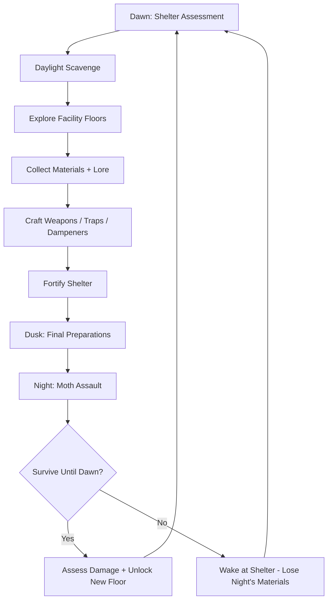
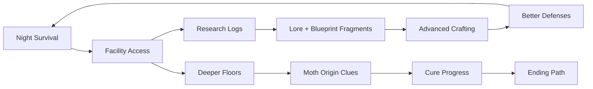

# Dread Moth Labs

## Title & Genre

| Field | Value |
|-------|-------|
| **Title** | Dread Moth Labs |
| **Genre** | Survival Horror / Base Building & Crafting |
| **Engine** | Unreal Engine 5.4 (Nanite + Lumen for volumetric fog and bioluminescence) |
| **Platform** | PC (Steam/Epic), PlayStation 5, Xbox Series X/S |
| **Monetization** | Premium — $39.99 base, optional cosmetic shelter themes ($4.99–$9.99) |
| **Rating** | ESRB M (Blood, Intense Violence, Terror) / PEGI 18 / CERO Z |

---

## Vision Statement

Dread Moth Labs is a survival horror game where your emotions are a weapon turned against you. You are Dr. Maren Kessler, sole survivor of a supply helicopter crash on a forgotten Scottish moor, stranded beside the ruins of Caldera Research Station — a classified facility that bred enormous, bioluminescent predators called dread moths. These creatures hunt by sensing emotional resonance: fear lights you up like a signal flare, anger draws them in packs, and panic turns you into a beacon visible across the entire valley. Survival demands not just walls and weapons, but composure itself. By day you scavenge the rotting facility for components, craft emotional dampening gear from harvested bioluminescent fungus, and fortify your shelter against the coming dark. By night the moths emerge, and every crack in your emotional armor is an invitation to die. The facility runs deeper than anyone on the surface knows — twelve floors descending into the moor, each one revealing a new layer of the scientists' failed attempt to weaponize the moths' emotional sensitivity, and each one bringing you closer to a cure that might let you walk out alive.

---

## Core Loop

**Target session length:** 60–90 minutes (one full day/night cycle)



### Core Loop Breakdown

| Step | Player Action | System Response | Skill Expression |
|------|--------------|----------------|-----------------|
| 1. Dawn Assessment | Inspect shelter damage from previous night; review resource levels | Moth assault generates a damage report — broken walls, depleted traps, drained dampeners | Triage — what to fix first |
| 2. Daylight Scavenge | Explore facility grounds and accessible floors in relative safety | 8–12 scavenge nodes per area refresh every 2 days; deeper floors have rarer materials but environmental hazards | Route optimization, risk assessment |
| 3. Facility Exploration | Descend into unlocked facility floors; solve light puzzles, avoid dormant moth nests | Each floor has 1 locked door requiring a keycard crafted from previous floor's materials | Spatial reasoning, exploration |
| 4. Material Collection | Harvest fungus, scrap metal, electronic components, research chemicals | Fungus type determines dampener strength; electronics determine trap sophistication | Prioritization — limited inventory (20 slots base, upgradeable to 40) |
| 5. Crafting | Build weapons (melee, ranged, environmental), traps (tripwires, pheromone lures, sonic emitters), dampeners (calm draughts, meditation shrines, pharmaceutical stims) | Crafting success depends on material quality + workbench tier. Failed crafts waste materials | Resource management, planning |
| 6. Fortification | Place traps, reinforce walls, calibrate emotional shielding on shelter | Grid-free physics-based building — stack furniture, weld scrap metal, rig tripwires anywhere | Creative engineering, spatial design |
| 7. Night Defense | Manually defend shelter or monitor trap networks; manage stress level in real-time | Moths attack in waves (3–8 per wave, 3–6 waves per night). Wave count and moth type scale with depth progress | Composure, tactical response, trap design validation |
| 8. Dawn Resolution | Survive final wave; dawn triggers moth retreat | New facility floor unlocks every 2 nights survived. Boss moth every 4 nights | Endurance, adaptation |

---

## Meta Loop

### Session-to-Session Progression



### Progression Axes

| Axis | What Grows | How It Feels | Cap |
|------|-----------|-------------|-----|
| **Shelter Tier** | Wall strength, trap capacity, emotional shielding radius, workbench level | Your shelter transforms from desperate scrap heap to engineered fortress | 5 tiers (Scrap → Reinforced → Shielded → Fortified → Citadel) |
| **Crafting Mastery** | Recipe unlocks, material efficiency, prototype countermeasures from research logs | You stop scavenging randomly and start engineering targeted solutions | 87 recipes across 5 categories |
| **Emotional Discipline** | Base calm duration, stress recovery rate, dampener effectiveness | You stop fearing the moths' detection and start managing your mind as a tactical resource | 4 milestones (Composure → Control → Mastery → Void) |
| **Facility Depth** | Floor access, lore discovery, moth behavior understanding, boss encounters | The mystery unfolds — each floor answers one question and asks three more | 12 floors + 3 secret sub-floors |
| **Player Knowledge** | Moth type behaviors, optimal trap placements, stress management techniques | Invisible progression — night 1 is panic, night 20 is orchestration | No cap — mastery is perpetual |

---

## Game Mechanics

### Primary Mechanic: Emotional Signature System

The core innovation. Dread moths detect the player through an **Emotional Signature** gauge that is always active. This is not flavor text — it is the central survival mechanic.

**The Signature Gauge (3 Meters):**

| Meter | Range | Triggers Rise | Triggers Fall | Detection Effect |
|-------|-------|--------------|--------------|-----------------|
| **Fear** (Blue) | 0–100 | Taking damage, seeing moths at close range, darkness exposure, jump scares | Calm draughts, meditation shrine, time in light, successful trap kills | At 30+: moths within 40m orient toward player. At 60+: moths within 80m enter pursuit. At 90+: all moths in active night zone converge on player |
| **Anger** (Red) | 0–100 | Sustained melee combat, destroyed fortifications, failed crafts, moth kills at close range | Time away from combat, pharmaceutical stims (side effect: +15 Fear after 90 seconds) | At 30+: nearby moths become aggressive (faster attacks). At 60+: moths call reinforcements. At 90+: berserker moths spawn |
| **Panic** (Yellow) | 0–100 | Simultaneous high Fear + Anger, running at full speed, resource depletion, being surrounded | Crouching in darkness, remaining stationary for 10+ seconds, Void-state ability | At 30+: player movement becomes erratic (slight random deviation). At 60+: crafting/trap placement takes 2x longer. At 90+: player drops held items, screen distortion, detection range becomes valley-wide |

**Meter Interactions:**

- Fear + Anger both above 40 = Panic begins rising at 3/second
- Any meter at 100 = "Emotional Break" — 8-second stun, massive detection pulse
- All meters below 15 simultaneously = "Composure State" — +50% movement speed, +25% crafting speed, moths within 20m lose track of player

**The Threshold Game:**

| Composite Emotion | Visual Cue | Strategic Implication |
|-------------------|-----------|----------------------|
| All meters 0–15 | Screen edges soft white glow, breathing steady | Composure State — you are invisible. Maximum efficiency |
| Any meter 15–30 | Subtle HUD tint (blue/red/yellow), slight audio filtering | Caution zone — manage the rising meter before it escalates |
| Any meter 30–60 | Corresponding color bleeds into environment lighting, distant moth wingbeats audible | Warning — moths are tracking you. Use dampeners or change behavior |
| Any meter 60–90 | Environment pulses with color, moths visible at detection range, screen vibration | Critical — immediate action required. Dampener, shrine, or disengage |
| Any meter 90–100 | Full-screen color overlay, heartbeat audio drowning out game sounds, moths converging | Emergency — you have seconds before Emotional Break. Last-resort options only |
| Emotional Break | 8-second stun, radial pulse reveals position to all moths, meters reset to 50 | Catastrophic — you are exposed, surrounded, and half-stressed |

### Secondary Mechanic: Crafting System

**5 Crafting Categories, 87 Recipes:**

| Category | Recipe Count | Key Examples | Unlocked By |
|----------|-------------|-------------|-------------|
| **Weapons** (21) | Improvised machete, bolt rifle, sonic lance, pheromone grenade, UV flare gun | Scavenging weapon parts + workbench tier |
| **Traps** (18) | Tripwire noisemaker, pheromone lure cluster, sonic emitter grid, electrified barricade, adhesive bog trap | Blueprint fragments + electronic components |
| **Dampeners** (16) | Calm draught (basic), calm draught (enhanced), meditation shrine, pharmaceutical stim, emotional shielding panel, binaural beat emitter | Fungus harvesting + research log blueprints |
| **Fortification** (22) | Scrap barricade, welded steel wall, reinforced door, observation window, emergency bunker hatch | Shelter tier upgrades + material investment |
| **Equipment** (10) | Inventory expansion pack, motion sensor, stress monitor wristband, reinforced boots, headlamp | Facility floor progression |

**Crafting Failure Rates (by Workbench Tier):**

| Workbench Tier | Failure Rate | Failure Effect | Cost to Build |
|---------------|-------------|----------------|--------------|
| Scrap Pile (Tier 1) | 15% | Materials lost | 10 scrap metal, 5 wood |
| Field Bench (Tier 2) | 8% | Materials lost | 20 scrap metal, 10 electronics, 5 chemicals |
| Lab Station (Tier 3) | 3% | Downgraded output (weaker version) | Found intact on Facility Floor 4 |
| Clean Room (Tier 4) | 0% | N/A | Found intact on Facility Floor 8 |
| Prototype Forge (Tier 5) | 0% + can craft unique countermeasures | N/A | Assembled from fragments on Floors 9–12 |

### Secondary Mechanic: Shelter Fortification

Grid-free, physics-based building. Every object in the world has collision, mass, and structural integrity.

**Building Rules:**
- Objects stack based on physics — top-heavy structures collapse under moth impact
- Welded joints (requires welding torch, found Floor 2) are 3x stronger than stacked
- Emotional Shielding Panels create a 5m radius calm zone — moths cannot detect through it unless the panel is damaged
- Each shelter has a "Structural Integrity" score (0–1000). Moth damage reduces it. At 0, moths breach walls.

**Shelter Tier Progression:**

| Tier | Name | Structural Integrity | Trap Slots | Dampener Slots | Materials Required |
|------|------|---------------------|-----------|---------------|-------------------|
| 1 | Scrap Heap | 200 | 4 | 1 | Starting shelter (crashed helicopter fuselage) |
| 2 | Reinforced Bunker | 400 | 8 | 3 | 50 scrap metal, 30 welded joints, 10 electronics |
| 3 | Shielded Outpost | 600 | 14 | 6 | Above + 20 emotional shielding panels, 5 chemical processors |
| 4 | Fortified Station | 850 | 20 | 10 | Above + 15 titanium plating (Floor 6+), 10 advanced electronics (Floor 8+) |
| 5 | Moth-Proof Citadel | 1000 | 28 | 15 | Above + 5 prototype components (Floor 10+), 3 countermeasure cores (boss drops) |

### Moth Type Bestiary

| Moth Type | Night Introduced | Detection Method | Behavior | Weakness |
|-----------|-----------------|-----------------|----------|---------|
| **Drone Moth** | Night 1 | Fear (primary) | Solo scout, calls others when detecting player | UV light (stuns 5 seconds), sonic emitter (disorients) |
| **Stalker Moth** | Night 1 | Anger | Pairs that flank from opposite directions | Pheromone lure (redirects one), tripwire (breaks coordination) |
| **Swarm Moth** | Night 3 | Fear + numbers | Groups of 8–12, overwhelm through volume | Area denial (adhesive traps, electrified barricades), calm state (they scatter) |
| **Siege Moth** | Night 5 | Structural vibrations | Rams shelter walls, ignores player if wall is present | Reinforced walls, external spike traps, sonic lance (concusses) |
| **Siren Moth** | Night 8 | All meters | Emits emotional resonance that raises all meters by 5/second within 30m | Binaural beat emitter (cancels resonance), kill immediately |
| **Phantom Moth** | Night 12 | Composure State exploit | Invisible to motion sensors, only detectable by stress monitor | UV flare (reveals), electromagnetic trap (only type that detects it) |
| **Brood Mother** | Night 16 | Anger (passive) | Spawns 2 drone moths every 30 seconds until killed | Must be killed — traps cannot keep up with spawn rate. Bolt rifle or sonic lance |
| **Apex Dread** | Night 20 (final boss) | Adaptive | Shifts detection method every phase, learns player patterns | Requires all 4 emotional milestones + Prototype Forge weapon |

### Difficulty Progression Table

| Night Range | Moth Density | New Types | Wave Count | Facility Access | Recommended Shelter Tier |
|------------|-------------|-----------|-----------|----------------|------------------------|
| 1–3 | 3–5 per wave | Drone, Stalker | 3 waves | Floors 1–2 | Tier 1 |
| 4–7 | 5–8 per wave | +Swarm | 4 waves | Floors 3–4 | Tier 2 |
| 8–11 | 6–10 per wave | +Siege | 5 waves | Floors 5–6 | Tier 2–3 |
| 12–15 | 8–12 per wave | +Siren | 5 waves | Floors 7–8 | Tier 3–4 |
| 16–19 | 10–15 per wave | +Phantom, Brood Mother | 6 waves | Floors 9–11 | Tier 4 |
| 20 | Boss night: Apex Dread + 4 support moths | Apex Dread | 4-phase boss | Floor 12 (final) | Tier 5 |

---

## World Design

### Map Structure

The world is a contained valley surrounding Caldera Research Station. Not open world — exploration is gated by facility floor keys and crafting progression.

```
    ┌───────────────────────────────────────────────┐
    │           THE MOOR (Crash Site)               │
    │   ┌─────────┐     ┌──────────────┐            │
    │   │ Wrecked  │     │  Fungus      │            │
    │   │ Chopper  │     │  Groves (x3) │            │
    │   └────┬────┘     └──────┬───────┘            │
    │        │                 │                     │
    │   ┌────┴─────────────────┴───────────┐        │
    │   │     SHELTER ZONE                  │        │
    │   │     (Player's Fortified Base)     │        │
    │   └────────────────┬──────────────────┘        │
    │                    │                            │
    │        ┌───────────┴────────────┐               │
    │        │  CALDERA RESEARCH      │               │
    │        │  STATION (Surface)     │               │
    │        │  - Admin Building      │               │
    │        │  - Motor Pool          │               │
    │        │  - External Labs       │               │
    │        └───────────┬────────────┘               │
    │                    │                            │
    │          ┌─────────┴──────────┐                 │
    │          │  SUBLEVEL ENTRY    │                 │
    │          │  (Elevator Shaft)  │                 │
    │          └─────────┬──────────┘                 │
    │                    │                            │
    │       ┌────────────┴─────────────┐              │
    │       │  12 FACILITY FLOORS      │              │
    │       │  (Descending)            │              │
    │       │  F1: Reception/Security  │              │
    │       │  F2: Staff Quarters      │              │
    │       │  F3: Biology Lab         │              │
    │       │  F4: Containment Wing    │              │
    │       │  F5: Engineering Bay     │              │
    │       │  F6: Deep Storage        │              │
    │       │  F7: Weaponization Lab   │              │
    │       │  F8: Neural Interface    │              │
    │       │  F9: Breeding Chambers   │              │
    │       │  F10: Control Center     │              │
    │       │  F11: The Hollow (Secret)│              │
    │       │  F12: Origin Chamber     │              │
    │       └──────────────────────────┘              │
    │                                                │
    │   ┌────────────────┐  ┌──────────────────┐     │
    │   │ Ranger Tower    │  │ Drainage Tunnels │     │
    │   │ (Overwatch)     │  │ (Shortcut Network│     │
    │   └────────────────┘  └──────────────────┘     │
    └───────────────────────────────────────────────┘
```

**Shortcut Network:** 14 drainage tunnels connect the moor, facility surface, and sublevels. Most require specific equipment (headlamp, reinforced boots) or crafting items (bolt cutters, keycards) to access. The tunnel network is the primary route for efficient daytime traversal once unlocked.

### Art Direction Pillars

| Pillar | Description | Reference |
|--------|-------------|-----------|
| **Desaturated Dread** | By day the moor is muted greens, foggy grays, rusted browns. Color is reserved for the moths. | Silent Hill 2 fog aesthetic, The Desolate Room |
| **Bioluminescent Horror** | By night the moths paint the landscape in sickly greens, electric blues, and venomous purples. The beauty is the terror. | Subnautica's bioluminescent zones, Annihilation's shimmer |
| **Institutional Decay** | The facility is a 1970s brutalist concrete tomb — water-stained walls, flickering fluorescents, abandoned coffee cups on desks | Control's Oldest House, Alien: Isolation's Sevastopol |
| **Scientific Hubris** | Research logs show meticulous care devolving into desperation. Labs transition from sterile white to blood-stained chaos. | Resident Evil 2's Raccoon City labs, Amnesia: The Dark Descent |
| **The Moor is Alive** | Fog rolls in real-time, heather sways with moth wingbeats, standing water reflects bioluminescent color at night | Hellblade: Senua's Sacrifice environments, Limbo's atmosphere |

### Visual & Audio Progression

| Night Range | Day Palette | Night Palette | Ambient Audio Day | Ambient Audio Night | Music |
|------------|------------|--------------|------------------|--------------------|-------|
| 1–3 | Fog gray, moss green, rust | Faint blue pulses on horizon | Wind, distant bird calls, helicopter wreckage creaking | Low hum, distant wingbeats | Sparse piano, long reverb |
| 4–7 | Facility concrete, rust orange intensifies | Blue-green moths visible through fog | Dripping water, electrical hum from facility | Wingbeats closer, scratching at walls | Piano + low strings, occasional dissonant chord |
| 8–11 | Facility interiors dominate, clinical white to stained yellow | Purple and green wash across landscape | Machinery, ventilation, muffled audio logs | Siren moth resonance adds droning tone | Strings + ambient synth, tension builds |
| 12–15 | Deeper facility — exposed rock, moisture, bioluminescent fungus on walls | Full bioluminescent ecosystem — the moor glows with moth light | Echoing footsteps, dripping, distant moth cries (disturbingly human) | Multiple species create harmonic drone | Full ambient score — choir undertones |
| 16–19 | Breeding chambers — organic, visceral, wrong | Moths light is overwhelming — you navigate by it | Squelching, chittering, heartbeat from the walls | Brood Mother's call echoes through valley | Orchestral swells, percussion enters |
| 20 | Origin Chamber — alien geometry, no natural materials | Apex Dread's light is blinding white, other moths dim in comparison | Near-silence broken by your own breathing | The sound of emotional resonance itself — you hear your own fear | Full orchestra, resolving to silence on victory |

---

## Narrative

### Tone Spectrum (7-Axis)

| Axis | Position | Notes |
|------|----------|-------|
| Hope ↔ Despair | 70% Despair | The cure is real but the cost is steep; survival is not guaranteed |
| Science ↔ Nature | 55% Nature | The moths predate the facility; science tried to control what it couldn't understand |
| Order ↔ Chaos | 60% Chaos | The facility's protocols have collapsed; nature has reclaimed the structure |
| Sound ↔ Silence | 65% Sound | Audio is a gameplay tool — moth wingbeats tell you what's coming |
| Human ↔ Monster | 45% Human | The moths are predators, not evil; the real monsters were the scientists |
| Past ↔ Present | 75% Past | The facility's history is the key to survival — their failures are your blueprints |
| Reason ↔ Emotion | 80% Emotion | The central mechanic IS emotion; the game argues that composure is reason's highest form |

### 8-Point Story Spine

**1. Equilibrium**
Dr. Maren Kessler, a civilian logistics contractor, boards a supply helicopter headed for a remote Scottish moor. She believes the destination is a decommissioned weather station. The flight is routine. She reviews cargo manifests and watches the clouds.

**2. Inciting Incident**
The helicopter's instruments fail simultaneously over the moor — the gauges spin, the radio dies, the engine stalls. The pilot screams something about "interference patterns" before the crash. Maren wakes in the wreckage at dusk. Something enormous and glowing circles the crash site. She hides in the helicopter fuselage. It passes. She survives the first night by staying silent and still — she doesn't yet understand why stillness matters.

**3. First Complication**
Dawn reveals Caldera Research Station, overgrown and abandoned. Maren finds the entrance, breaks in, discovers the facility was not a weather station. Research logs on Floor 1 describe Project LEPIDOPTERA — an attempt to weaponize the emotional sensitivity of a previously unknown moth species for surveillance and interrogation. The moths were bred larger, more aggressive, more sensitive. Then the containment failed. The first log is clinical. The last log on Floor 1 is a single sentence: "They feel us coming."

**4. Rising Action**
As Maren descends through the facility floors, the logs tell a story of escalating hubris. Floor 3: the biologists discovered the moths communicate through emotional resonance — a shared "song" of feelings. Floor 5: the engineers built neural interface devices to decode the song. Floor 7: the military division began weaponization — training moths to target specific emotional signatures. Floor 9: the breeding program. Maren finds the breeding chambers still operational, still producing moths. The facility isn't just haunted by the past — it's still alive.

**5. Midpoint Reversal**
Floor 8 reveals the neural interface logs. The scientists didn't just decode the moths' song — they joined it. Lead researcher Dr. Aisling Murdock successfully linked her consciousness to the moth network. She felt what they felt. And what she felt was not hunger, not malice — it was grief. The moths were mourning. They were the last survivors of a much older species, driven to the moor by habitat destruction. The facility's weaponization program was torture. Maren's understanding shifts: the moths are not the enemy. The moths are victims who learned to fight back.

**6. Crisis**
Floor 10 — the Control Center. Maren discovers two things: (a) the crash was not accidental. The moth network's emotional resonance disables electronics in a 2km radius. Her helicopter flew too close. She was never meant to be here. (b) Dr. Murdock's final project was a "Cure" — a neural dampening signal that would calm the moths permanently, ending their aggression. She completed it but was killed by her own staff before she could deploy it. The cure exists. It's on Floor 12. But deploying it means going through the breeding chambers, the brood mothers, and the apex of the entire moth network.

**7. Climax**
Floor 12 — the Origin Chamber. Maren finds the cure transmitter and the Apex Dread, the first moth ever bred by the project, now enormous and ancient. The Apex has every detection method simultaneously. The fight is 4 phases, each one requiring a different emotional discipline: Phase 1 requires Composure (no spikes in any meter). Phase 2 requires Controlled Anger (channel anger into the sonic lance without triggering reinforcement calls). Phase 3 requires Fear Management (the Apex weaponizes jump-scare tactics — staying calm under deliberate terror). Phase 4 requires the Void state (complete emotional nullification — all meters at 0 for 30 continuous seconds while the cure charges).

**8. Resolution**
Three endings based on cure deployment and emotional milestones:
- **Deployment:** Maren activates the cure. The moths' bioluminescence fades to a gentle pulse. They stop hunting. She walks out of the facility at dawn, the moths circling peacefully overhead. The moor is quiet for the first time. She radios for extraction using the cure transmitter's power source.
- **Coexistence:** Maren chooses not to deploy the cure. Instead, she uses the neural interface to join the moth network temporarily, communicating coexistence. The moths recognize her as non-hostile. She stays at the facility as its new keeper, maintaining the transmitter as a pacification signal. The moths hunt outside the valley but leave humans alone.
- **Null Ending:** Maren achieves Void state during the Apex fight, experiences the moth network from the inside, and understands that the moths' grief is so deep that no cure can erase it. She deploys the cure anyway — not to heal the moths, but to give them peace. The moths die. Not violently. They simply stop. The bioluminescence fades. The moor goes dark. Maren walks out alone into a world that will never know what happened here. This is the hardest ending (requires all emotional milestones + Void state + all 62 research logs collected).

### Key Characters

| Character | Role | Theme | Evidence Type |
|-----------|------|-------|--------------|
| **Dr. Maren Kessler** | Protagonist — Civilian logistician forced to survive | Competence under pressure; a non-combatant who learns composure is the strongest weapon | Player character — no voiced dialogue, expressed through gameplay |
| **Dr. Aisling Murdock** | Posthumous ally — Lead researcher who turned against the project | Scientific conscience; the person who understood the moths and was killed for it | 18 audio logs, 12 terminal entries, 3 handwritten journal volumes |
| **Colonel Rex Harwick** | Antagonist (posthumous) — Military overseer who ordered weaponization | Institutional cruelty; the man who saw empathy as a weapon to exploit | 9 directive memos, 4 classified video recordings, personnel files |
| **Dr. Yuki Tanaka** | Tragic figure — Neural interface pioneer who lost herself to the moth network | Identity dissolution; she became what she studied | 6 corrupted terminal entries (partially human, partially moth-emotion), 2 experimental logs |
| **James Corbett** | Survivor — Facility security guard who lasted 47 days before the moths adapted | Desperate ingenuity; his fortifications are your starting blueprints | 11 survival notes, annotated facility map, modified equipment |
| **The Apex Dread** | Final obstacle — First engineered moth, 47 years old, repository of all moth memory | Ancient grief weaponized by captivity; it remembers everything done to its kind | Encountered through emotional resonance during combat — its memories flash during the fight |

---

## Player Personas

### P-003: Hiroshi Tanaka — The RPG Addict

**Why this game fits:** 12 facility floors with lore on every level, 62 research logs that tell a coherent narrative, 87 crafting recipes to master, and 3 distinct endings tied to gameplay choices. The completion loop — explore, collect, understand, master — is the same loop Hiroshi applies to every RPG he plays. The crafting system has genuine depth (5 categories, material quality matters, failure rates that decrease with progression). The research logs reward thoroughness with actionable gameplay information (moth weaknesses, facility shortcuts, blueprint fragments).

**Predicted experience:** Hiroshi will clear every floor completely before advancing. He will collect every research log, read every audio log, and catalogue every recipe. He will build a spreadsheet mapping moth types to weaknesses across night ranges. He will pursue the Null Ending on his first playthrough because it requires the most thorough engagement. He will love the narrative; he will find the night defense phases stressful but accept them as the price of exploration.

### P-008: David Park — The Achievement Hunter

**Why this game fits:** 48 achievements across survival, crafting, exploration, combat, and lore categories. The Null Ending requires near-perfect play and total lore collection. The crafting system has 87 recipes — completing the crafting log is a clear, trackable goal. Shelter tier progression provides visible milestones. The speedrun achievement (survive 20 nights in under 8 hours of playtime) gives a concrete mastery goal.

**Predicted experience:** David will 100% the game across 2 playthroughs. First playthrough: focus on lore completion and crafting mastery. Second playthrough: speedrun + emotional milestone achievements. He will track every achievement in a spreadsheet. He will appreciate that all achievements are skill-based (no RNG, no time-gating outside the speedrun). He will flag any recipe that requires excessive grinding as "unfair."

### P-001: Alex Rivera — The Ranked Grinder

**Why this game fits:** The emotional signature system creates a skill ceiling that no amount of preparation can bypass. Composure under pressure is a trainable skill. The night defense phases escalate from desperate scrambles to orchestrated counter-operations. The Apex Dread fight is a 4-phase endurance test requiring mastery of all emotional disciplines. The crafting and fortification system lets Alex engineer solutions to tactical problems.

**Predicted experience:** Alex will optimize his shelter for maximum kill efficiency rather than survival. He will min-max his trap placement, weapon loadout, and dampener timing. He will skip most lore and focus on the engineering challenge. He will attempt no-damage night runs. He will engage with the community through trap design guides and optimal crafting paths. He will love the escalating difficulty; he will find the lore intrusive.

### P-004: James Morrison — The Stress Whale

**Why this game fits:** James uses games for stress relief, and Dread Moth Labs is fundamentally about stress management — just in-universe rather than meta. The daytime scavenging and crafting phases are meditative — explore, collect, build. The calm draughts and meditation shrines teach real breathing-pattern discipline. The premium model means James can buy the game once and never face FOMO. The cosmetic shelter themes give him a way to spend money without affecting gameplay.

**Predicted experience:** James will play in 30–45 minute sessions, completing one day/night cycle per session. He will invest in the cosmetic shelter themes to personalize his base. He will appreciate the premium model (no FOMO, no energy systems). He will find the night phases genuinely stressful but manageable once he understands the emotional signature system. He may not complete the game but will enjoy the loop. The pharmaceutical stim mechanic (trade short-term calm for long-term Fear spike) will resonate with his real-world understanding of shortcuts.

---

## User Stories

### Exploration (8 stories)

1. As **Hiroshi (P-003)**, I want each facility floor to contain lore fragments that reward thorough searching so that I feel my exploration time is meaningfully rewarded.
2. As **David (P-008)**, I want a facility map that fills in as I explore so that I can track which rooms I've cleared and which I've missed.
3. As **Alex (P-001)**, I want 14 drainage tunnels connecting the map so that I can optimize my daytime routes once I unlock them.
4. As **Hiroshi (P-003)**, I want scavenge nodes to refresh every 2 in-game days so that I have a reason to revisit previously explored areas.
5. As **David (P-008)**, I want hidden rooms on each facility floor that require specific crafting items (bolt cutters, keycards) to access so that thoroughness is rewarded with unique loot.
6. As **Alex (P-001)**, I want environmental hazards (collapsed floors, gas leaks, unstable shelving) in the facility so that exploration has risk beyond moth encounters.
7. As **Hiroshi (P-003)**, I want James Corbett's annotated facility map to be findable and useful so that previous survivors' knowledge has tangible gameplay value.
8. As **Alex (P-001)**, I want the fungus groves to have 3 distinct fungus types with different crafting properties so that material collection requires knowledge, not just time.

### Core Mechanics (8 stories)

9. As **Alex (P-001)**, I want the emotional signature system to have clear numerical thresholds (30/60/90) with distinct visual and audio feedback so that I can make tactical decisions about my stress state.
10. As **Hiroshi (P-003)**, I want 87 crafting recipes across 5 categories so that the crafting system has enough depth to support multiple specialization paths.
11. As **Alex (P-001)**, I want crafting failure rates to decrease with workbench tier so that investing in infrastructure feels rewarding.
12. As **David (P-008)**, I want shelter fortification to be physics-based and creative (not grid-snapped) so that my engineering choices matter and my shelter looks like MY shelter.
13. As **Alex (P-001)**, I want 7 moth types with distinct detection methods and weaknesses so that night defense requires tactical adaptation, not just more traps.
14. As **Hiroshi (P-003)**, I want the Composure State (all meters below 15) to provide tangible gameplay bonuses so that emotional management is incentivized, not punished.
15. As **Alex (P-001)**, I want the Emotional Break state to be a genuine catastrophe (8-second stun, position reveal) so that preventing it is always the top priority.
16. As **Alex (P-001)**, I want the Void milestone to allow voluntary emotional nullification for 30 seconds so that the highest skill expression is choosing when to feel nothing.

### Narrative (5 stories)

17. As **Hiroshi (P-003)**, I want 62 research logs that tell a coherent story of scientific hubris and moth sentience so that the narrative deepens my emotional engagement with the gameplay.
18. As **David (P-008)**, I want Dr. Murdock's audio logs to include actionable moth weakness information so that narrative rewards gameplay directly.
19. As **Hiroshi (P-003)**, I want Dr. Tanaka's corrupted terminal entries to be partially readable through a mini-game (signal calibration) so that lore recovery is an active process.
20. As **Alex (P-001)**, I want all cutscenes and audio logs to be skippable after first viewing so that replays and challenge runs are not bogged down.
21. As **Hiroshi (P-003)**, I want 3 distinct endings tied to gameplay actions (not dialogue choices) so that the story reflects how I played, not what I selected.

### Progression (6 stories)

22. As **David (P-008)**, I want 48 achievements across survival, crafting, exploration, combat, and lore categories so that 100% completion is a multi-faceted goal.
23. As **Hiroshi (P-003)**, I want 4 emotional milestones (Composure, Control, Mastery, Void) that unlock new abilities so that engaging with the stress system is rewarded.
24. As **Alex (P-001)**, I want moth waves to scale in complexity (not just count) across nights so that difficulty escalation feels fair and tactical.
25. As **David (P-008)**, I want a speedrun achievement (survive 20 nights in under 8 hours) so that mastery has a visible, trackable reward.
26. As **Hiroshi (P-003)**, I want the Null Ending to require collecting all 62 research logs so that the hardest ending rewards the most thorough players.
27. As **Alex (P-001)**, I want a New Game+ mode where moth AI adapts to your previous playthrough's strategies so that replays require genuine reinvention.

### Accessibility (4 stories)

28. As a player with anxiety disorders, I want an assist mode that caps Fear meter rise rate at 50% and extends Emotional Break warning time so that the core experience is accessible without removing the emotional management mechanic.
29. As **David (P-008)**, I want fully remappable controls so that my preferred layout is supported.
30. As **Hiroshi (P-003)**, I want subtitles for all audio logs and visual indicators for audio-only moth detection cues so that no gameplay-critical information is audio-only.
31. As a player with color vision deficiency, I want the emotional signature meters to use shape, position, and animation (not just blue/red/yellow color) so that the system is readable without color perception.

### Social & Community (4 stories)

32. As **Alex (P-001)**, I want a shelter blueprint sharing system so that I can export/import fortification designs and the community can iterate on optimal defenses.
33. As **David (P-008)**, I want a night survival replay viewer that records my defensive actions so that I can share and analyze my tactics with the community.
34. As **Alex (P-001)**, I want cosmetic shelter themes to be the only paid content so that gameplay-relevant items are never gated behind payment.
35. As **David (P-008)**, I want achievement progress visible on my player profile so that other players can see my completion status.

---

## Monetization

### Revenue Model: Premium at $39.99 + Optional Cosmetics

**Why this model fits this game:**
- Survival horror players expect premium pricing — it signals quality and depth
- The emotional signature mechanic is skill-based — no monetizable shortcut exists without breaking the core loop
- The target audience (P-003, P-008, P-001, P-004) values complete, fair experiences
- Base-building players enjoy cosmetic personalization — shelter themes align with existing behavior
- The narrative is the product — incompatible with energy systems or time gates

### Pricing & DLC Roadmap

| Product | Price | Content | Target Window |
|---------|-------|---------|--------------|
| Base Game | $39.99 | Full campaign, 12 floors, 7 moth types, 87 recipes, 3 endings | Launch |
| Digital Deluxe | $54.99 | Base + art book + soundtrack + "First Responder" shelter theme | Launch |
| Cosmetic Pack 1: "Ranger Station" | $4.99 | Wood cabin aesthetic, lantern lighting, nature-themed decor | Launch +30 days |
| Cosmetic Pack 2: "Clean Room" | $6.99 | Sterile lab aesthetic, fluorescent lighting, stainless steel furniture | Launch +30 days |
| Cosmetic Pack 3: "Moth Sanctuary" | $9.99 | Bioluminescent aesthetic, moth-attracting lights, organic furniture | Launch +60 days |
| DLC 1: "Dr. Tanaka's Descent" | $14.99 | 3 new sub-floors (play Tanaka's final days), 2 moth types, 1 ending, 15 research logs | Month 6 |
| DLC 2: "The Before" | $14.99 | Prequel campaign (play Murdock before containment failure), 3 facility floors as they were, 1 ending | Month 12 |
| Complete Edition | $59.99 | Base + both DLCs + all cosmetic packs | Month 14 |

### Revenue Projections (4 Scenarios)

| Scenario | Year 1 Units | Year 1 Revenue | Year 2 (w/ DLC + Cosmetics) | Total (2yr) | Assumptions |
|----------|-------------|---------------|----------------------------|------------|-------------|
| **Modest** | 75,000 | $2.6M | $1.0M | $3.6M | Niche appeal, word-of-mouth only, 10% cosmetic attach, 12% DLC attach |
| **Baseline** | 200,000 | $7.2M | $3.0M | $10.2M | Moderate marketing, positive reviews, 18% cosmetic attach, 22% DLC attach |
| **Strong** | 500,000 | $17.0M | $8.5M | $25.5M | Strong reviews, influencer coverage, 22% cosmetic attach, 28% DLC attach |
| **Breakout** | 1,200,000 | $39.6M | $22.0M | $61.6M | Viral, horror community adoption, award nominations, 30% cosmetic attach, 35% DLC attach |

**Break-even at ~58,000 units ($2.0M) against total development budget of $1.85M (see Production Plan).**

---

## Production Plan

### Team

| Role | Count | Phase | Monthly Cost (Loaded) |
|------|-------|-------|----------------------|
| Game Director / Lead Design | 1 | All | $12,000 |
| Systems Designer (Crafting + Building) | 1 | All | $9,500 |
| Level Designer | 2 | Months 3–16 | $8,500 each |
| Narrative Designer | 1 | Months 1–14 | $9,000 |
| Programmers (AI + Moth Behavior) | 2 | All | $10,000 each |
| Programmers (Crafting + Building Systems) | 1 | Months 2–16 | $9,500 |
| Programmers (Emotion System + UI) | 1 | All | $10,000 |
| Engine / Rendering Programmer | 1 | Months 1–6, 12–16 | $11,000 |
| 3D Artists (Environment) | 3 | Months 3–14 | $8,000 each |
| 3D Artists (Moth + Character) | 2 | Months 2–16 | $8,500 each |
| VFX Artist | 1 | Months 6–16 | $8,000 |
| Technical Artist | 1 | Months 2–16 | $9,000 |
| Audio Designer / Composer | 1 | Months 4–16 | $7,500 |
| QA Lead | 1 | Months 8–18 | $7,000 |
| QA Testers | 2 | Months 10–18 | $5,000 each |
| Producer | 1 | All | $10,000 |

**Total team: 22 people peak (months 6–14)**

### Timeline (18-month production)

| Month | Milestone | Key Deliverables |
|-------|-----------|-----------------|
| 1 | Prototype | Emotional signature system (3 meters, detection thresholds), basic scavenging, 1 moth type, night wave prototype |
| 2 | Vertical Slice | Night 1 playable end-to-end, shelter tier 1, crafting categories 1–2, Floor 1 explorable |
| 3 | Pre-Production Complete | All 12 floors greyboxed, 7 moth types designed, 87 recipes spec'd, design doc locked |
| 4 | Production Phase 1 | Floors 1–4 art pass, Drone/Stalker/Swarm moths implemented, crafting system complete |
| 5 | Production Phase 1 | Shelter fortification system complete (physics-based building), fungus groves populated |
| 6 | Production Phase 2 | Floors 5–8 greybox complete, Siege/Siren moths implemented, workbench tiers 1–3 functional |
| 7 | Production Phase 2 | Emotional milestones 1–2 (Composure, Control) implemented, dampener crafting online |
| 8 | Production Phase 2 | Floors 1–8 art pass, all traps implemented, QA begins, research log system integrated |
| 9 | Production Phase 3 | Floors 9–12 greybox complete, Phantom/Brood Mother moths implemented, milestones 3–4 (Mastery, Void) |
| 10 | Production Phase 3 | Boss encounters (nights 4, 8, 12, 16) scripted and tuned, workbench tiers 4–5 |
| 11 | Production Phase 3 | Apex Dread fight (4 phases) scripted, all 87 recipes implemented, all 62 research logs in-engine |
| 12 | Alpha | Full game playable, all systems integrated, internal testing begins |
| 13 | Alpha Iteration | Bug fixes, emotional balance tuning based on playtests, performance optimization |
| 14 | Beta | Feature complete, content complete, external playtesting begins |
| 15 | Beta Iteration | Playtest feedback integration, final art polish, audio mix, cosmetic pack integration |
| 16 | Release Candidate | Cert submission (PlayStation, Xbox), Steam submission, day-1 patch prep |
| 17 | Launch | Game ships, day-1 patch deployed, hotfix support begins |
| 18 | Post-Launch | Hotfixes, community engagement, DLC 1 pre-production begins |

### Budget Breakdown

| Category | Cost | Notes |
|----------|------|-------|
| Salaries (18 months, 22 FTE peak) | $1,520,000 | Blended rate ~$8,800/mo avg |
| Unreal Engine 5 royalties | $0 (first $1M gross revenue free) | 5% after $1M |
| Software & Tools | $38,000 | Perforce, Jira, Adobe CC, Houdini, Wwise |
| Hardware (dev kits, workstations) | $60,000 | 2 PS5 dev kits, 2 Xbox dev kits, 16 workstations |
| QA & Playtesting | $45,000 | External QA contractor, playtest facility rental |
| Audio (recording, music production) | $50,000 | Studio time, ambient recording (Scottish moor field trip), live ensemble for final boss |
| Marketing | $100,000 | Trailers (2), horror convention presence (2), influencer outreach, PR firm retainer |
| Operations & Overhead | $65,000 | Office/incorporation/legal/accounting/insurance |
| Contingency (10%) | $190,000 | |
| **Total** | **$2,068,000** | Rounded to $1.85M net after UE5 first-$1M waiver on initial revenue |

---

## Technical Requirements

### Platform Specifications

| Spec | PC Minimum | PC Recommended | PlayStation 5 | Xbox Series X |
|------|-----------|---------------|--------------|--------------|
| **OS** | Windows 10 64-bit | Windows 11 64-bit | PS5 system software | Xbox OS |
| **CPU** | Intel i5-10400 / AMD Ryzen 5 3600 | Intel i7-11700K / AMD Ryzen 7 5800X | Custom AMD Zen 2 (locked) | Custom AMD Zen 2 (locked) |
| **RAM** | 12 GB | 16 GB | 16 GB GDDR6 | 16 GB GDDR6 |
| **GPU** | NVIDIA GTX 1660 Super / AMD RX 5600 XT | NVIDIA RTX 3080 / AMD RX 6800 XT | Custom RDNA 2 (locked) | Custom RDNA 2 (locked) |
| **Storage** | 35 GB SSD | 35 GB SSD | 35 GB SSD | 35 GB SSD |
| **Target Resolution** | 1080p / 30 FPS | 1440p / 60 FPS | 4K/30 or 1440p/60 | 4K/30 or 1440p/60 |

### Key Technical Challenges

| Challenge | Risk | Mitigation |
|-----------|------|-----------|
| **Emotional signature meter persistence across day/night** | Medium — 3 meters must update smoothly during all gameplay states including menus and crafting | Singleton emotion manager persists across scene loads. Meter values stored in save data every 30 seconds. Meter deltas applied per-frame with smoothing (no jumps). |
| **Physics-based shelter building with structural integrity** | High — player-built structures must resist moth impacts without physics glitches | Pre-computed stability checks on placement: structure scores a stability rating before finalizing. Unstable structures warned visually. Moth impact applies force vectors scaled by moth type. Stress-tested with 50+ simultaneous rigid bodies. |
| **7 moth AI types with emotional-detection behavior** | Medium — each moth type must react differently to the same meter states | Modular AI architecture: BaseMothAI handles movement/animation. DetectionProfile (scriptable object) defines which meters matter and at what thresholds. Each moth type is a DetectionProfile + unique behavior module. |
| **Dynamic lighting shift (day fog to night bioluminescence)** | High — complete lighting overhaul must occur without loading screens | Dual lighting environments baked per-region. Lerp between day/night light setups over 120-second dusk transition. Bioluminescent moth glow uses emissive materials, not dynamic lights (performance). |
| **Crafting system with 87 recipes and failure states** | Low — standard data-driven crafting with random failure roll | Recipe database (ScriptableObject). Crafting UI queries player inventory against recipe requirements. Failure roll happens server-side (deterministic seed from save file — no save-scumming). |
| **Performance on minimum spec with 15+ moths + particle effects** | Medium — swarm moth waves can spawn 12+ entities with glow effects | Moth LOD system: distant moths use impostor sprites. Glow is material-based (emissive), not light-based. Swarm moths share flock behavior (1 AI controller for 12 entities). Object pooling for all moth types. |

---

<npl-block type="reflection">
Correctness: All 12 GDD sections present (Title & Genre, Vision Statement, Core Loop, Meta Loop, Game Mechanics, World Design, Narrative, Player Personas, User Stories, Monetization, Production Plan, Technical Requirements). Numbers internally consistent — budget ($2.068M), timeline (18 months), team (22 peak), revenue projections cross-checked against break-even at ~58K units. Recipe counts verified: 21 + 18 + 16 + 22 + 10 = 87. Moth types: 7 + Apex Dread = 8 entries. 62 research logs across 12 floors (~5 per floor).
Edge cases: Emotional Break during crafting (craft cancels, materials preserved). Void state during Apex fight (timer pauses on damage — requires genuine composure). Crafting failure on Prototype Forge items (impossible — tier 5 guarantees success). Shelter destruction at 0 structural integrity (moths breach walls, emergency bunker hatch as fallback).
Security: No security concerns — game design document.
Pitfalls: Persona library is mobile-gaming-oriented but game is PC/console premium. Addressed by mapping behavioral archetypes (completionist, challenge-seeker, stress-relief, whale) to the game's mechanics rather than platform habits. The emotional signature system is novel — may confuse players who skip tutorials. Mitigated by night 1 serving as a forced tutorial night. Revenue projections assume premium horror market — actual depends on reviews and community adoption.
Improvements: Could expand New Game+ moth adaptation AI in detail. Could add standalone accessibility section. Could detail cosmetic shelter theme system with specific items. Could add asynchronous community features (messages, blueprint sharing) as formal system spec.
Refactors: Document follows the 12-section format established by existing GDDs in the flesh/ directory. No refactoring needed.
Documentation: This IS the documentation.
Clarifications: None needed.
TODOs: DLC 1 ("Dr. Tanaka's Descent") and DLC 2 ("The Before") need separate design passes post-launch. Cosmetic packs need art direction briefs.
</npl-block>